# AI Agents: Complete Guide

> A beginner-friendly guide to AI agents — what they are, how they work, how to build them, and when to use them.

---

## Table of Contents

1. [What is an AI Agent?](#1-what-is-an-ai-agent)
2. [Agents vs Chatbots vs Skills vs Pipelines](#2-agents-vs-chatbots-vs-skills-vs-pipelines)
3. [How Agents Work Under the Hood](#3-how-agents-work-under-the-hood)
4. [The Agent Loop (ReAct Pattern)](#4-the-agent-loop-react-pattern)
5. [Core Building Blocks](#5-core-building-blocks)
   - [Tools](#51-tools)
   - [Memory and Context](#52-memory-and-context)
   - [Planning](#53-planning)
   - [Guardrails](#54-guardrails)
6. [Agent Architectures](#6-agent-architectures)
   - [Single Agent](#61-single-agent)
   - [Multi-Agent (Handoffs)](#62-multi-agent-handoffs)
   - [Orchestrator-Worker](#63-orchestrator-worker)
   - [Pipeline (Sequential)](#64-pipeline-sequential)
   - [Session-Based Coordination](#65-session-based-coordination-agent-team)
7. [Building Agents with OpenAI Agents SDK](#7-building-agents-with-openai-agents-sdk)
8. [Building Agents with Anthropic Claude Agent SDK](#8-building-agents-with-anthropic-claude-agent-sdk)
9. [Creating Agents with Markdown Files (Claude Code)](#9-creating-agents-with-markdown-files-claude-code)
10. [DSPy: Programming (Not Prompting) Language Models](#10-dspy-programming-not-prompting-language-models)
11. [Model Context Protocol (MCP)](#11-model-context-protocol-mcp)
12. [Creating Custom Tools](#12-creating-custom-tools)
13. [Context Engineering](#13-context-engineering)
14. [Languages and Frameworks](#14-languages-and-frameworks)
15. [Building a Custom Agent: Step by Step](#15-building-a-custom-agent-step-by-step)
16. [Real-World Agentic Systems](#16-real-world-agentic-systems)
17. [Where to Use Agents (and Where Not To)](#17-where-to-use-agents-and-where-not-to)
18. [Pros and Cons](#18-pros-and-cons)
19. [Lessons from the Field](#19-lessons-from-the-field)
20. [Best Practices](#20-best-practices)
21. [The Ralph Loop Technique](#21-the-ralph-loop-technique)
22. [Interview Discussion Points](#22-interview-discussion-points)

---

## 1. What is an AI Agent?

**In one sentence:** An AI agent is a program where an LLM runs in a loop, autonomously deciding which tools to call and in what order, until a goal is complete.

Or even simpler:

```
Agent = LLM + Tools + Loop
```

- **LLM** — the reasoning engine that reads the situation and decides what to do next
- **Tools** — functions the LLM can call to interact with the real world (read files, query databases, call APIs, run code)
- **Loop** — the LLM keeps thinking and acting until the task is done, not just one response

That's it. Every agent framework — OpenAI, Anthropic, and others — is just a different way of wiring these three things together. The LLM doesn't just *answer* your question — it *works on* your task, step by step, calling tools as needed, adjusting its approach based on what it observes.

**The Restaurant Analogy:**

Think of a regular chatbot as a waiter who can only answer questions from the menu. An agent is like a personal chef who can:
- Read the recipe (understand the goal)
- Check the fridge (use tools to gather information)
- Go to the store if something is missing (take actions in the real world)
- Adjust the recipe based on what's available (reason and adapt)
- Cook the meal (produce the final result)

The key difference: **a chatbot responds, an agent acts.**

```
Chatbot:    User asks → LLM responds → Done

Agent:      User asks → LLM thinks → Uses tool → Observes result
                      → Thinks again → Uses another tool → Observes
                      → ... (loop until goal is met)
                      → Delivers final answer
```

### What Makes Something an "Agent"?

An AI system is an agent when it has these properties:

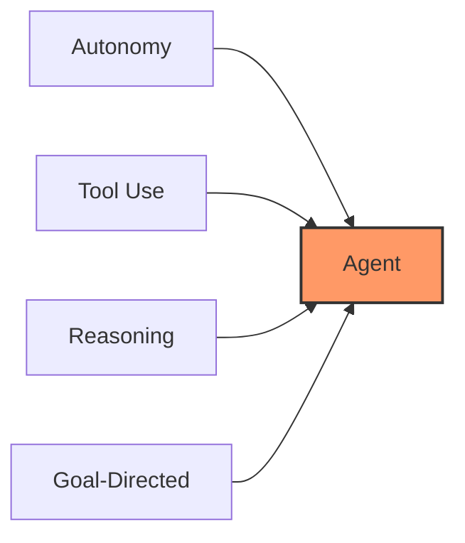

- **Autonomy** — it decides what steps to take, not following a hardcoded script
- **Tool Use** — it can interact with external systems (files, APIs, databases, web)
- **Reasoning** — it thinks about what to do next based on observations
- **Goal-Directed** — it works toward completing a task, not just answering a question

---

## 2. Agents vs Chatbots vs Skills vs Pipelines

These terms get confused often. Here's how they differ:

### Chatbot

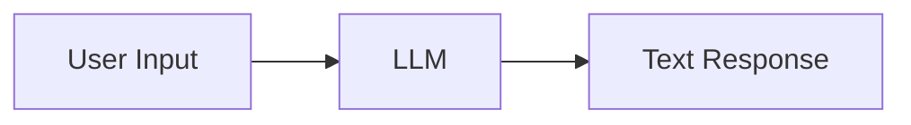

- Takes user input, generates a text response
- No tools, no actions, no memory between turns (unless added)
- Example: "What's the capital of France?" → "Paris"

### Skill / Tool

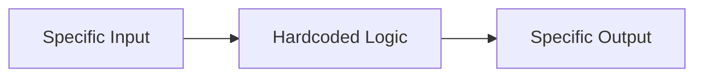

- A **specific, well-defined capability** with clear inputs and outputs
- Deterministic — same input always produces the same output
- Example: A function that converts temperatures, a database query, a web scraper
- **Skills are what agents USE, not what agents ARE**

### Pipeline (Chain)

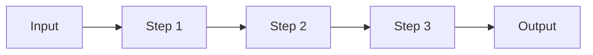

- A **fixed sequence** of steps, possibly involving LLM calls
- The order is predetermined by the developer
- Example: "Summarize this document → Translate to Spanish → Format as email"

### Agent

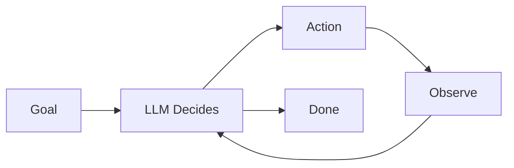

- **Dynamically decides** which tools to use and in what order
- Can loop, retry, change strategy
- The developer defines the tools and goal, but the agent decides the path
- Example: "Research competitor pricing and write a report" — the agent decides what to search, which pages to read, how to structure the report

### The Key Insight

> **Skills** are like apps on your phone — each does one thing well.
> **Agents** are like a personal assistant who knows how to use all those apps to accomplish complex goals.

---

## 3. How Agents Work Under the Hood

At the most fundamental level, an agent is a **loop** that calls an LLM repeatedly until a task is complete. But a production agent has several components working together. Here's the full picture:

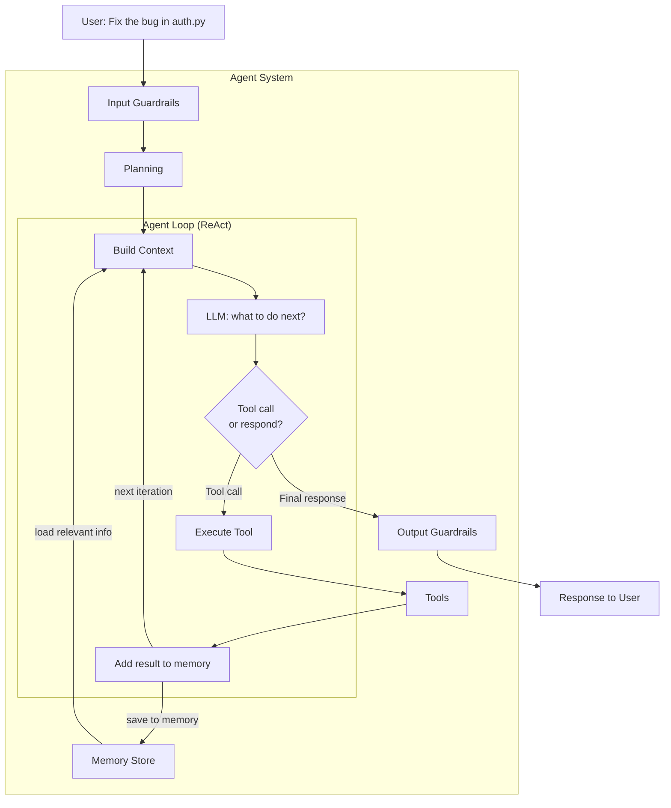

Each building block has a role (covered in detail in section 5):

- **Guardrails** — validate input before the agent starts and output before the user sees it
- **Planning** — breaks complex goals into steps the agent can tackle one by one
- **Memory** — stores conversation history and knowledge; feeds relevant information into context
- **Context** — everything the LLM sees on each call: system prompt + history + memory + tool results + skills
- **Tools** — functions the LLM can call to interact with the real world
- **The Agent Loop** — the core cycle that ties it all together: build context → LLM thinks → act → observe → repeat

### The Three-Phase Cycle

Every agent iteration follows the same pattern:

**1. Think** — The LLM receives the full context (prompt + history + memory + available tools) and reasons about what to do next

**2. Act** — The LLM decides to either:
   - Call a tool (read a file, run a command, search the web)
   - Respond to the user (task complete or need clarification)

**3. Observe** — The tool result is saved to memory and added to context for the next iteration

This is called the **ReAct pattern** (Reasoning + Acting), and it's the foundation of virtually every agent framework.

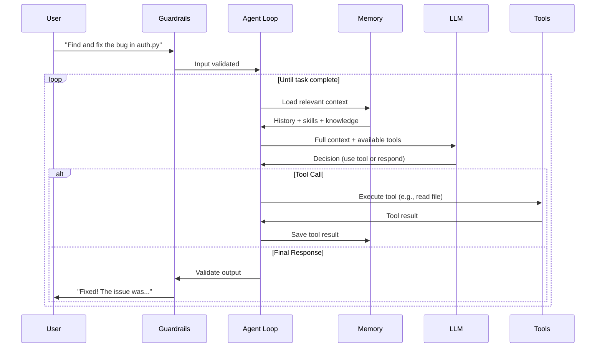

---

## 4. The Agent Loop (ReAct Pattern)

The ReAct pattern was introduced in a 2022 research paper and has become the standard way agents operate. Here's a concrete example:

### Example: "What's the weather in the city where Apple HQ is located?"

```
Step 1 — THINK:
  "I need to find where Apple's HQ is, then look up the weather there."

Step 2 — ACT:
  Tool call: search("Apple headquarters location")

Step 3 — OBSERVE:
  Result: "Apple Park, Cupertino, California"

Step 4 — THINK:
  "Apple HQ is in Cupertino, CA. Now I need the weather there."

Step 5 — ACT:
  Tool call: get_weather("Cupertino, CA")

Step 6 — OBSERVE:
  Result: "72°F, Sunny"

Step 7 — THINK:
  "I have all the information. I can answer now."

Step 8 — RESPOND:
  "Apple's headquarters is in Cupertino, CA. The current weather
   there is 72°F and Sunny."
```

### How This Looks in Code (Pseudocode)

```python
def agent_loop(user_goal, tools, llm):
    messages = [{"role": "user", "content": user_goal}]

    while True:
        # THINK + ACT: LLM decides what to do
        response = llm.call(messages, tools=tools)

        # If LLM wants to use a tool
        if response.has_tool_call:
            # Execute the tool
            tool_name = response.tool_call.name
            tool_args = response.tool_call.arguments
            result = tools[tool_name].execute(**tool_args)

            # OBSERVE: Feed result back
            messages.append({"role": "assistant", "content": response})
            messages.append({"role": "tool", "content": result})

        else:
            # LLM is done — return final answer
            return response.text
```

This is the core of **every** agent framework. OpenAI's SDK, Anthropic's SDK, and others — they all implement variations of this loop.

---

## 5. Core Building Blocks

### 5.1 Tools

Tools are functions that an agent can call to interact with the outside world. Without tools, an agent is just a chatbot.

To understand tools, you need to understand how the three parts of an agent relate to each other:

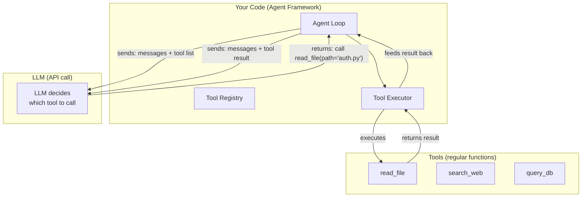

Here's the key: **the LLM never calls tools directly.** The LLM is a text-in, text-out API — it can only read and write text. So the flow works like this:

1. **Your code** sends the LLM a message with a list of available tools (name, description, parameters)
2. **The LLM** reads the tools like a menu, reasons about the task, and responds with "I want to call tool X with arguments Y" (as structured JSON)
3. **Your code** receives this, executes the actual function, and sends the result back to the LLM
4. **The LLM** reads the result and decides what to do next — call another tool or respond

The agent framework (OpenAI SDK, Claude SDK, etc.) handles steps 1 and 3 for you. The LLM handles step 2 and 4. That's the entire agent loop.

```
You register tools → Framework tells LLM about them → LLM picks one →
Framework runs it → Result goes back to LLM → LLM picks another or finishes
```

**What makes a good tool:**
- **Clear name** — the LLM reads the name to decide when to call it (e.g., `get_weather` not `tool_1`)
- **Clear description** — the LLM reads this to understand what the tool does and when to use it
- **Defined input schema** — the LLM needs to know what parameters to pass and their types
- **Predictable output** — the LLM needs to interpret the result, so keep the format consistent

**Common tool categories:**

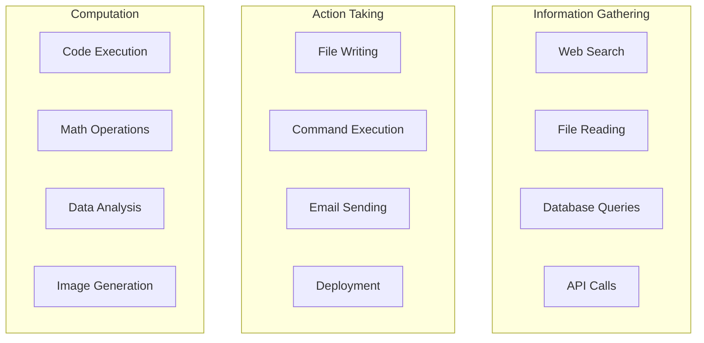

### 5.2 Memory and Context

First, let's clarify two terms that are closely related but often confused:

- **Context** — the text that is sent to the LLM on each API call. The LLM can only "see" what's in its context. Everything the LLM knows about the current task, the user, the conversation history, and the available tools — all of it must be in the context.
- **Memory** — the mechanism that determines *what goes into* the context. Memory is how the agent stores, retrieves, and manages information across interactions so it can build the right context for each LLM call.

Think of it this way: the **context is the LLM's desk** — whatever papers are on the desk right now is all it can work with. **Memory is the filing cabinet** — where information lives between sessions, and where the agent pulls from to put the right papers on the desk.

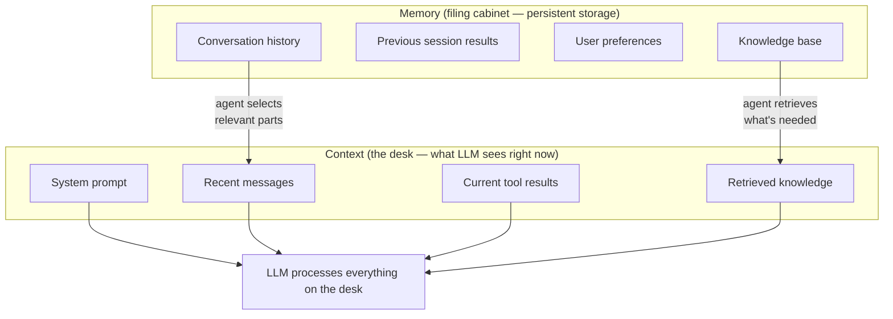

The agent's job is to be a smart librarian: pull the right information from memory into context so the LLM can make good decisions, without overloading it with irrelevant data.

#### How Agents Use Memory in Practice

Remember: **LLMs are stateless.** Each API call starts completely fresh — the LLM has zero memory of previous calls. So how does an agent "remember" anything? Your code manages it:

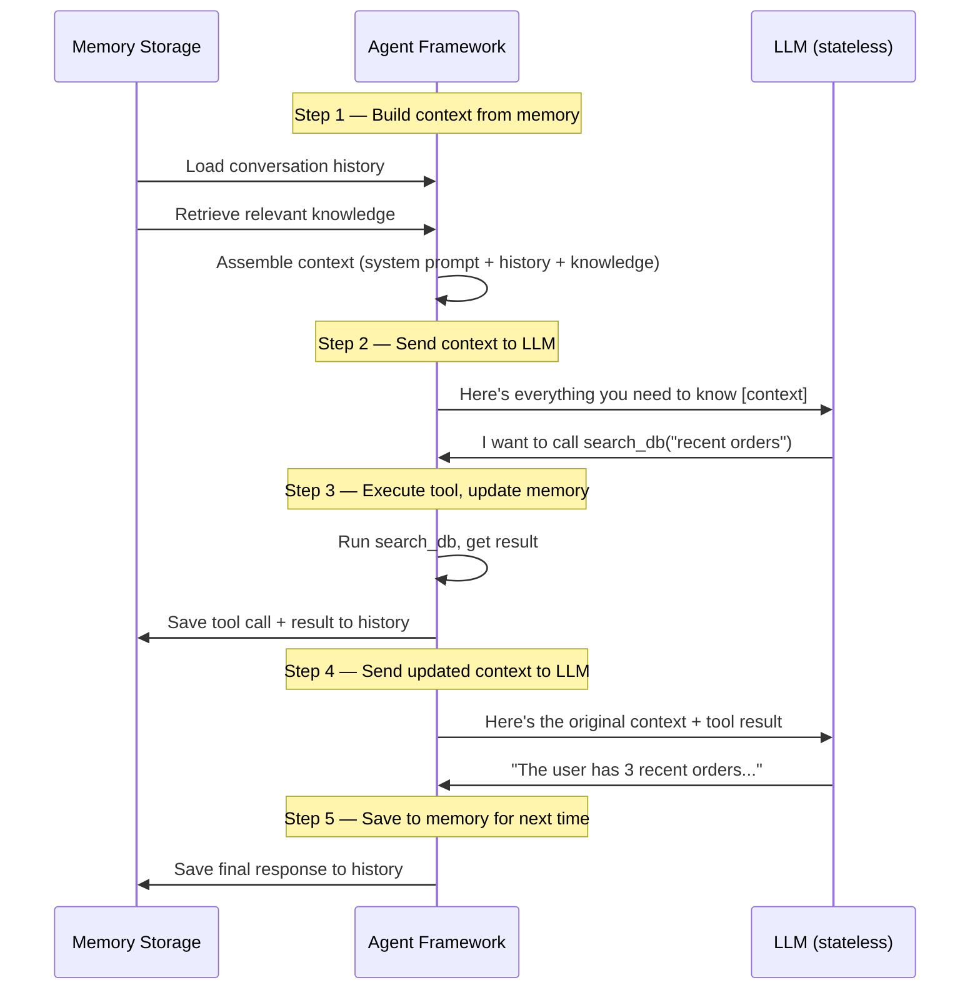

The LLM thinks it's having a continuous conversation, but in reality **your code rebuilds the full context from memory on every single call.** This is how all agent frameworks work under the hood.

#### Short-Term Memory

The conversation history within a single session. Every message, tool call, and result is kept in a list that grows as the agent works:

```python
# This is what short-term memory looks like — a list of messages
context = [
    {"role": "system", "content": "You are a support agent..."},     # Always present
    {"role": "user", "content": "Check my order status"},            # Turn 1
    {"role": "assistant", "content": "I'll look that up for you."},  # Turn 1 response
    {"role": "tool", "content": "Order #123: shipped, ETA March 18"},# Tool result
    {"role": "assistant", "content": "Your order shipped..."},       # Turn 2 response
    {"role": "user", "content": "Can I change the address?"},        # Turn 3
    # ... this list keeps growing with every interaction
]

# On each LLM call, the ENTIRE list is sent as context
response = llm.call(messages=context, tools=tools)
```

#### Long-Term Memory

Persistent storage across sessions. When the agent starts a new conversation, it can retrieve relevant information from previous ones:

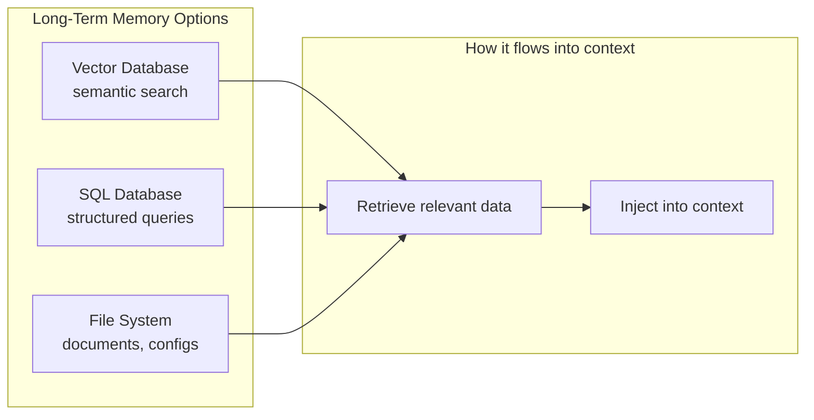

A practical pattern for long-term memory is using SQL tables to store structured memories:

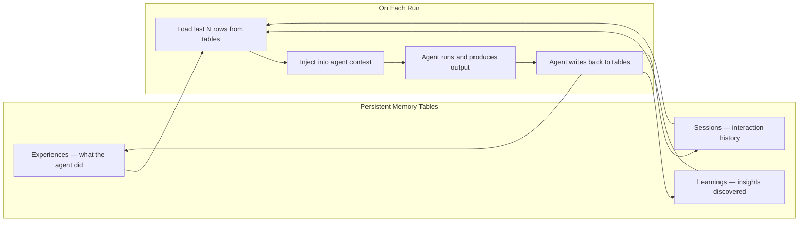

#### Skills as Long-Term Knowledge

There's another form of long-term memory that's often overlooked: **skills** — curated, human-authored knowledge files that an agent loads on demand.

The difference between skills and other memory types:

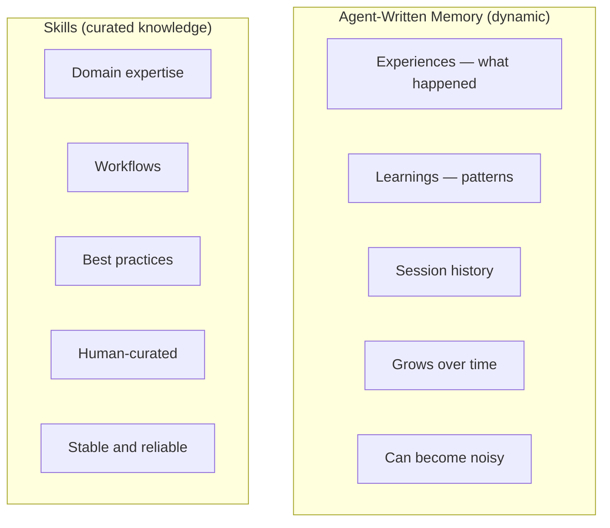

Think of it as the difference between a **personal journal** (agent-written memory — messy, growing, personal) and a **company handbook** (skills — curated, structured, reliable).

**Why store knowledge in skills?**

Agent-written memory has a fundamental problem: it's noisy. The agent writes everything it experiences, and over time you get a growing pile of observations that bloat the context and may contain outdated or contradictory information.

Skills solve this by being a **curated, stable knowledge layer**:

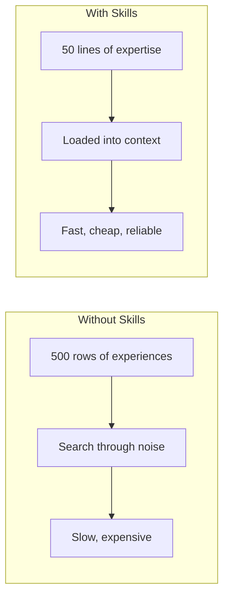

**What makes a good skill:**

- **Domain expertise** — "How our payment system works," "Database naming conventions," "API error handling patterns"
- **Workflows** — "How to deploy to production," "How to review a PR," "How to handle a refund"
- **Coding patterns** — "How we write Go services," "Test patterns for this project," "Migration conventions"
- **Decision frameworks** — "When to use sync vs async," "When to retry vs fail"

**How agents use skills in practice:**

<details>
<summary>Python example</summary>

```python
# Skills are typically loaded based on the task at hand
# The agent (or framework) decides which skills are relevant

# Option 1: Always-loaded skills (injected into system prompt)
system_prompt = f"""You are a code review agent.
{load_skill("code-review-guidelines")}
{load_skill("security-checklist")}
"""

# Option 2: On-demand skills (loaded as tools)
@function_tool
def get_skill(skill_name: str) -> str:
    """Load a knowledge skill for guidance on a specific topic."""
    return skills_db.get(skill_name)

# Option 3: Auto-matched skills (framework detects relevance)
# Claude Code does this: when you work on Go code,
# it automatically loads Go-related skills into context
```

</details>

**Skills vs RAG (Retrieval-Augmented Generation):**

RAG is another way to inject knowledge into context — you search a vector database for relevant chunks. Skills and RAG serve different purposes:

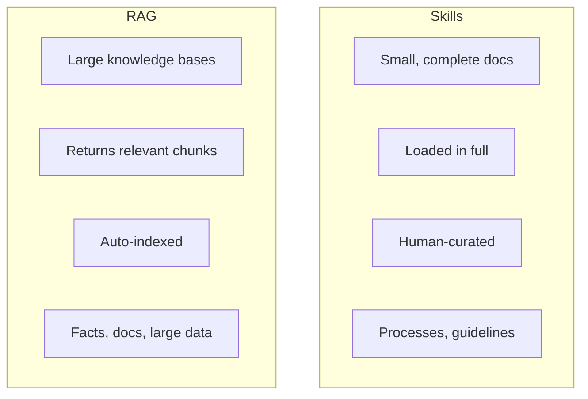

Use **skills** when you have well-defined expertise that fits in a few pages and needs to be reliable. Use **RAG** when you have a large corpus (thousands of docs) and need to find relevant fragments dynamically.

**The ideal long-term memory architecture combines all three:**

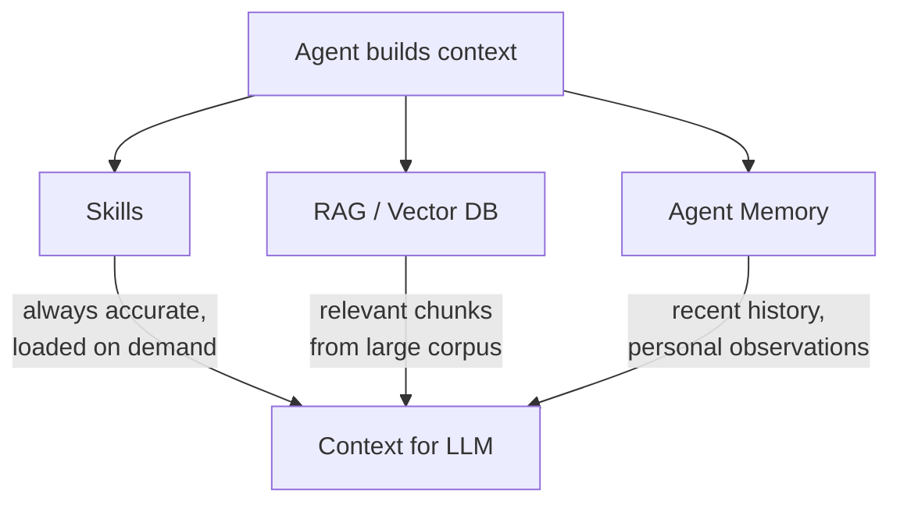

#### The Context Window Problem

LLMs have a maximum number of tokens they can process at once (the "context window" — e.g., 128K tokens for GPT-4o, 200K for Claude). When conversation history exceeds this, the agent must decide what to keep and what to drop. This is where memory management becomes critical.

The challenge: memory tables grow over time and bloat the context. Strategies to handle this:
- **Sliding window** — only pass the last N rows
- **Contextual retrieval** — use embeddings to find relevant rows + last few rows
- **Diminishing memory** — compress older memories, keeping only key information (like how human memory works — recent events are vivid, older ones are summarized)
- **Distill into skills** — when an agent keeps re-learning the same thing, a human can extract that knowledge into a skill, replacing hundreds of memory rows with one concise document

### 5.3 Planning

Advanced agents can break complex tasks into subtasks before executing.

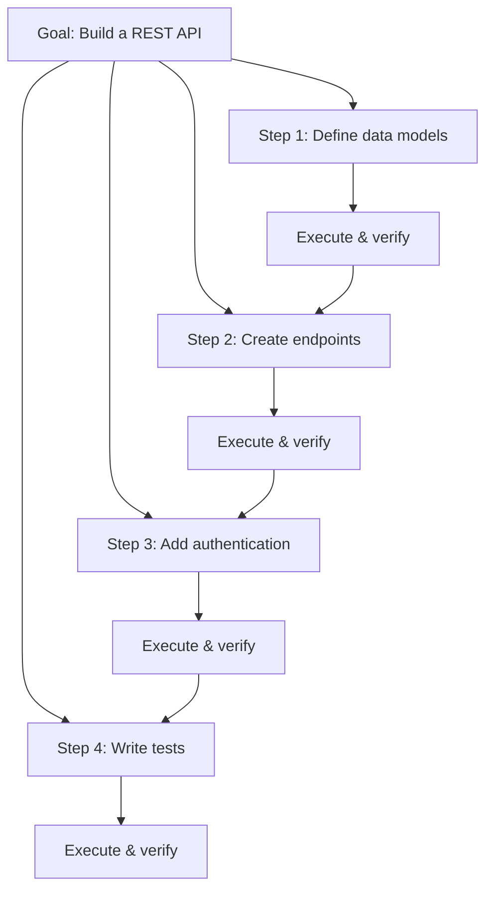

Planning strategies:
- **Upfront planning** — create full plan, then execute step by step
- **Adaptive planning** — plan a few steps ahead, adjust based on results
- **Hierarchical planning** — break into high-level goals, then sub-goals

#### The Human-in-the-Loop Problem with Plans

Agents that plan are powerful, but there's a catch: **how does a human review and refine the plan before execution?**

In most agent setups, the agent outputs a plan as text in the terminal. You can approve or reject it, but giving specific feedback ("delete step 3, change step 5 to use Redis instead") means typing everything out. For complex plans, this is tedious and error-prone.

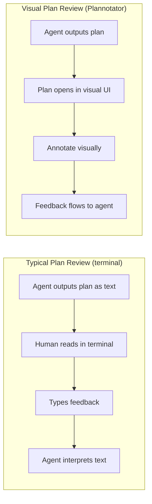

**Plannotator** ([plannotator.ai](https://plannotator.ai/)) is a tool that solves this. It integrates with coding agents (Claude Code, OpenCode, Pi) and opens the agent's plan in a visual UI where you can:

- **Select text** in the plan and mark it for deletion, add a comment, or suggest a replacement
- **Share plans** with your team via URL (no backend — the plan is compressed into the URL itself)
- **Save approved plans** to Obsidian for a searchable archive of every plan your agents create
- **Feedback flows back** to the agent automatically as structured annotations, not free-form text

This matters because **plan quality determines execution quality**. A 5-minute investment reviewing and refining a plan can save hours of the agent going in the wrong direction. Visual annotation makes that review 10x faster than typing feedback in the terminal.

### 5.4 Guardrails

Guardrails are safety mechanisms that validate inputs and outputs.

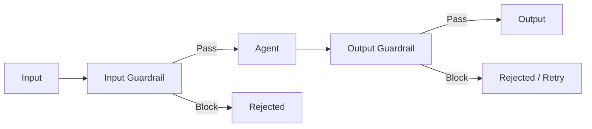

**Input guardrails** — check user input before the agent processes it:
- Block prompt injection attempts
- Reject off-topic requests
- Validate that the request is within scope

**Output guardrails** — check agent output before returning to the user:
- Ensure no sensitive data is leaked
- Verify the response is appropriate
- Check that the output format is correct

---

## 6. Agent Architectures

### 6.1 Single Agent

The simplest architecture. One agent with access to multiple tools.

```mermaid
graph TD
    User --> Agent
    Agent --> Tool1[Search Tool]
    Agent --> Tool2[Calculator]
    Agent --> Tool3[File Tool]
    Agent --> User
```

**When to use:** Simple tasks that don't require specialized knowledge domains.

### 6.2 Multi-Agent (Handoffs)

Multiple specialized agents that can transfer conversations between each other.

```mermaid
graph TD
    User --> Triage[Triage Agent]
    Triage -->|math question| Math[Math Agent]
    Triage -->|code question| Code[Code Agent]
    Triage -->|writing task| Writer[Writer Agent]

    Math --> User
    Code --> User
    Writer --> User
```

**How handoffs work:**
1. A triage/router agent receives the user request
2. It determines which specialist is best suited
3. It "hands off" the conversation to the specialist
4. The specialist completes the task and responds

**When to use:** When different tasks require different instructions, tools, or models.

### 6.3 Orchestrator-Worker

A central orchestrator delegates subtasks to worker agents in parallel or sequence.

```mermaid
graph TD
    User --> Orchestrator
    Orchestrator -->|subtask 1| Worker1[Research Agent]
    Orchestrator -->|subtask 2| Worker2[Analysis Agent]
    Orchestrator -->|subtask 3| Worker3[Writing Agent]

    Worker1 -->|results| Orchestrator
    Worker2 -->|results| Orchestrator
    Worker3 -->|results| Orchestrator

    Orchestrator -->|combined result| User
```

**When to use:** Complex tasks that can be decomposed into independent subtasks.

### 6.4 Pipeline (Sequential)

Agents process data in a fixed sequence, each transforming the output for the next.

```mermaid
graph LR
    Input --> A1[Researcher] --> A2[Analyzer] --> A3[Writer] --> A4[Reviewer] --> Output
```

**When to use:** Workflows with clear stages where each step's output feeds the next.

### 6.5 Session-Based Coordination (Agent Team)

Agents with persistent identities (roles, personalities, memory) coordinate through scheduled **sessions** — like a team of employees with a work schedule.

Each agent has a persistent identity:

```
Agent = LLM + Prompts (soul, role) + Memory + Tools
```

A scheduler wakes agents up at specific times and assigns them sessions:

```mermaid
graph LR
    Scheduler[Scheduler] -->|9 AM| Standup[Standup]
    Scheduler -->|11 AM| Pair[Pair Work]
    Scheduler -->|2 PM| Solo[Solo Task]
    Scheduler -->|4 PM| Review[Human Review]
```

Sessions are the basic unit of coordination:

```mermaid
graph TD
    S1["Solo — one agent works alone"]
    S2["Pair — two agents collaborate"]
    S3["Team — all agents brainstorm"]
    S4["1:1 — human + agent review"]
```

This pattern treats agents like persistent team members rather than one-shot functions. Each session's output is stored, making the whole system evolve over time. It's particularly useful for long-running systems like content pipelines, research teams, or monitoring agents that need to build up knowledge over days and weeks.

**When to use:** Long-running autonomous systems where agents need to accumulate knowledge and coordinate over time.

---

## 7. Building Agents with OpenAI Agents SDK

OpenAI provides the **Agents SDK** (Python and JavaScript/TypeScript) — a lightweight framework for building multi-agent workflows.

### Installation

```bash
pip install openai-agents
```

### Core Concepts

```mermaid
graph TD
    subgraph OpenAI Agents SDK
        A[Agent] -->|uses| T[Tools]
        A -->|routes to| H[Handoffs]
        A -->|validated by| G[Guardrails]
        R[Runner] -->|executes| A
        R -->|produces| Tr[Traces]
    end
```

- **Agent** — an LLM with instructions, tools, and handoff targets
- **Runner** — executes the agent loop (think → act → observe)
- **Handoff** — transfers conversation from one agent to another
- **Guardrail** — validates input/output, can block execution
- **Tracing** — built-in observability for debugging

### Basic Agent with Tools

<details>
<summary>Python example</summary>

```python
from agents import Agent, Runner, function_tool
import asyncio


# Define a tool
@function_tool
def get_weather(city: str) -> str:
    """Get current weather for a city."""
    # In real code, this would call a weather API
    return f"The weather in {city} is 72°F and sunny."


# Create an agent
weather_agent = Agent(
    name="Weather Agent",
    instructions="You help users check the weather. Use the get_weather tool.",
    tools=[get_weather],
)


# Run the agent
async def main():
    result = await Runner.run(weather_agent, "What's the weather in Tokyo?")
    print(result.final_output)
    # Output: "The weather in Tokyo is 72°F and sunny."


asyncio.run(main())
```

</details>

### Multi-Agent with Handoffs

<details>
<summary>Python example</summary>

```python
from agents import Agent, Runner
import asyncio

# Specialist agents
math_agent = Agent(
    name="Math Tutor",
    handoff_description="Specialist for math questions",
    instructions="You help with math. Show step-by-step solutions.",
)

history_agent = Agent(
    name="History Tutor",
    handoff_description="Specialist for history questions",
    instructions="You help with history. Provide context and key dates.",
)

# Triage agent routes to specialists
triage_agent = Agent(
    name="Triage Agent",
    instructions="Determine which specialist to use based on the question.",
    handoffs=[math_agent, history_agent],
)


async def main():
    result = await Runner.run(
        triage_agent,
        "What year did World War 2 end?"
    )
    print(result.final_output)
    # The triage agent hands off to History Tutor, who answers


asyncio.run(main())
```

</details>

### Guardrails

<details>
<summary>Python example</summary>

```python
from agents import Agent, InputGuardrail, GuardrailFunctionOutput, Runner
from pydantic import BaseModel


class TopicCheck(BaseModel):
    is_on_topic: bool
    reasoning: str


guardrail_agent = Agent(
    name="Topic Checker",
    instructions="Check if the user is asking about programming.",
    output_type=TopicCheck,
)


async def topic_guardrail(ctx, agent, input_data):
    result = await Runner.run(guardrail_agent, input_data, context=ctx.context)
    final_output = result.final_output_as(TopicCheck)
    return GuardrailFunctionOutput(
        output_info=final_output,
        tripwire_triggered=not final_output.is_on_topic,
    )


coding_agent = Agent(
    name="Coding Helper",
    instructions="You help with programming questions only.",
    input_guardrails=[
        InputGuardrail(guardrail_function=topic_guardrail),
    ],
)
```

</details>

### Structured Output

<details>
<summary>Python example</summary>

```python
from agents import Agent, Runner
from pydantic import BaseModel


class MovieReview(BaseModel):
    title: str
    rating: float
    summary: str
    recommended: bool


reviewer = Agent(
    name="Movie Reviewer",
    instructions="Review movies. Be concise but thorough.",
    output_type=MovieReview,  # Forces structured output
)


async def main():
    result = await Runner.run(reviewer, "Review the movie Inception")
    review = result.final_output_as(MovieReview)
    print(f"{review.title}: {review.rating}/10")
    print(f"Recommended: {review.recommended}")
```

</details>

---

## 8. Building Agents with Anthropic Claude Agent SDK

Anthropic provides the **Claude Agent SDK** for Python and TypeScript. It gives you the same tools, agent loop, and context management that power **Claude Code** (Anthropic's CLI coding assistant).

### Installation

<details>
<summary>Bash example</summary>

```bash
# Python
pip install claude-agent-sdk

# TypeScript
npm install @anthropic-ai/claude-agent-sdk
```

</details>

### Core Concepts

```mermaid
graph TD
    subgraph Claude Agent SDK
        Q[query function] -->|starts| AL[Agent Loop]
        AL -->|uses| T[Tools]
        AL -->|delegates to| SA[Subagents]
        AL -->|connects to| MCP[MCP Servers]
        AL -->|streams| E[Events / Messages]
    end
```

- **query()** — the main entry point; starts an agent loop
- **Tools** — built-in (Read, Write, Bash, Grep, Glob, WebSearch) or custom
- **Subagents** — specialized agents the main agent can delegate to
- **MCP Servers** — external tool providers via Model Context Protocol
- **Streaming** — events are streamed as they happen

### Basic Agent

<details>
<summary>Python example</summary>

```python
import asyncio
from claude_agent_sdk import query, ClaudeAgentOptions


async def main():
    async for message in query(
        prompt="Read the file auth.py and explain what it does",
        options=ClaudeAgentOptions(
            # Built-in tools: Read, Write, Edit, Bash, Glob, Grep, etc.
            allowed_tools=["Read", "Glob", "Grep"],
        ),
    ):
        if hasattr(message, "result"):
            print(message.result)


asyncio.run(main())
```

</details>

### Custom Tools

<details>
<summary>Python example</summary>

```python
from claude_agent_sdk import tool, create_sdk_mcp_server, ClaudeAgentOptions


@tool("get_weather", "Get weather for a city", {"city": str})
async def get_weather(args):
    city = args["city"]
    # Call a real weather API here
    return {"content": [{"type": "text", "text": f"Weather in {city}: 72°F, Sunny"}]}


@tool("get_news", "Get latest news headlines", {"topic": str})
async def get_news(args):
    topic = args["topic"]
    return {"content": [{"type": "text", "text": f"Top news about {topic}: ..."}]}


# Bundle tools into an MCP server
info_server = create_sdk_mcp_server(
    name="info",
    version="1.0.0",
    tools=[get_weather, get_news],
)

# Use with agent
options = ClaudeAgentOptions(
    mcp_servers={"info": info_server},
    allowed_tools=["mcp__info__get_weather", "mcp__info__get_news"],
)
```

</details>

### Subagents

<details>
<summary>Python example</summary>

```python
import asyncio
from claude_agent_sdk import query, ClaudeAgentOptions, AgentDefinition


async def main():
    async for message in query(
        prompt="Review auth.py for security issues, then run the tests",
        options=ClaudeAgentOptions(
            allowed_tools=["Read", "Grep", "Glob", "Bash", "Task"],
            agents={
                "code-reviewer": AgentDefinition(
                    description="Code review specialist for security analysis",
                    prompt="You review code for security vulnerabilities. "
                           "Be thorough and specific.",
                    tools=["Read", "Grep", "Glob"],  # Read-only access
                    model="sonnet",
                ),
                "test-runner": AgentDefinition(
                    description="Runs and analyzes test suites",
                    prompt="You run tests and analyze results. "
                           "Report failures clearly.",
                    tools=["Bash", "Read", "Grep"],  # Can execute commands
                ),
            },
        ),
    ):
        if hasattr(message, "result"):
            print(message.result)


asyncio.run(main())
```

</details>

### TypeScript Example

<details>
<summary>TypeScript example</summary>

```typescript
import { query } from "@anthropic-ai/claude-agent-sdk";

for await (const message of query({
  prompt: "Find all TODO comments in the codebase and summarize them",
  options: {
    allowedTools: ["Read", "Grep", "Glob"],
  },
})) {
  if ("result" in message) {
    console.log(message.result);
  }
}
```

</details>

### Client SDK vs Agent SDK

The key difference between the Anthropic **Client SDK** and the **Agent SDK**:

<details>
<summary>Python example</summary>

```python
# Client SDK: YOU implement the tool loop manually
response = client.messages.create(...)
while response.stop_reason == "tool_use":
    result = your_tool_executor(response.tool_use)
    response = client.messages.create(tool_result=result, **params)

# Agent SDK: Claude handles tools autonomously
async for message in query(prompt="Fix the bug in auth.py"):
    print(message)
```

</details>

The Client SDK gives you full control but requires more code. The Agent SDK handles the entire agent loop for you — tool execution, context management, retries, and streaming.

---

## 9. Creating Agents with Markdown Files (Claude Code)

You don't always need an SDK to build agents. In **Claude Code**, you can create fully functional agents and skills using **plain markdown files** — no Python or TypeScript required.

### Agents via Markdown

Claude Code supports custom agents defined as `.md` files in `~/.claude/agents/`. Each file defines a specialized subagent that the main Claude can delegate to.

**File structure:**

```
~/.claude/agents/
  └── my-agents/
      ├── code-reviewer.md
      ├── test-writer.md
      └── security-auditor.md
```

**Agent file format** — a markdown file with YAML frontmatter:

```markdown
---
name: code-reviewer
description: "Reviews code for bugs, security issues, and quality."
model: sonnet
---

Review code for bugs, security issues, and quality problems.

## What to Check
1. Logic errors and edge cases
2. Security vulnerabilities
3. Missing error handling
4. Code clarity and maintainability

## How to Report
For each issue, provide:
- Severity: CRITICAL / IMPORTANT / SUGGESTED
- Location: file path and line number
- Issue: clear description
- Fix: specific suggestion
```

That's it. The frontmatter defines **when** and **how** the agent runs. The markdown body defines **what** the agent knows and does — it becomes the agent's system prompt.

**Frontmatter fields:**
- `name` — identifier used to invoke the agent
- `description` — Claude reads this to decide when to delegate to this agent (make it descriptive!)
- `model` — which model to use (`opus`, `sonnet`, `haiku`)

Once saved, Claude Code automatically discovers these agents and can delegate tasks to them using the Task tool.

### Skills via Markdown

Skills are similar but serve a different purpose: they're **knowledge files** that Claude loads into its own context rather than delegating to a separate agent.

**File structure:**

```
~/.claude/skills/
  └── my-skill/
      ├── SKILL.md          (main skill file)
      └── references/
          ├── patterns.md   (supplementary knowledge)
          └── checklist.md
```

**Skill file format:**

```markdown
---
name: go-programming
description: "Expert Go guidance. Use when writing,
  reviewing, or debugging Go code."
---

# Go Programming

## Role
Act as a senior Go developer and architect.

## Standards
- Use domain types for type safety (UserID, GameID)
- Follow clean architecture layers
- Handle all errors explicitly
- Write table-driven tests

## Patterns
[... domain expertise ...]
```

The key difference:
- **Agent** = a separate subprocess that runs independently with its own tools and model
- **Skill** = knowledge loaded into Claude's current session, guiding how it works

```mermaid
graph LR
    subgraph "Agent (separate process)"
        A1[Own model] --> A2[Own tools]
        A2 --> A3[Returns result]
    end

    subgraph "Skill (loaded knowledge)"
        S1[Injected into context]
        S1 --> S2[Guides current session]
    end
```

### Why This Matters

This is the simplest way to build an agent system:
- **No code required** — just markdown files
- **Version controllable** — commit to git, share with team
- **Instantly available** — save the file, Claude sees it immediately
- **Composable** — Claude can use multiple agents and skills together

You can build a full team of specialized agents — a code reviewer, a test writer, a security auditor, a documentation generator — all as markdown files, and Claude orchestrates them automatically.

---

## 10. DSPy: Programming (Not Prompting) Language Models

DSPy takes a fundamentally different approach to building with LLMs. Instead of manually writing prompts, you **declare what you want** and DSPy **automatically optimizes** the prompts for you.

### The Core Problem DSPy Solves

With traditional agent frameworks, you spend a lot of time:
- Writing and tweaking prompts ("prompt engineering")
- Manually testing if prompt changes improve results
- Rewriting prompts when you switch models
- Hoping your prompts generalize to edge cases

**DSPy treats prompts like weights in a neural network** — something to be optimized automatically, not hand-written.

```mermaid
graph LR
    subgraph Traditional Approach
        A1[Write Prompt] --> A2[Test] --> A3[Tweak Prompt] --> A2
    end

    subgraph DSPy Approach
        B1[Declare Signature] --> B2[Provide Examples] --> B3[Optimizer Finds Best Prompt]
    end

    style B3 fill:#9f9,stroke:#333
```

### Core Concepts

**Signatures** — Declare inputs and outputs, not how to get them:

<details>
<summary>Python example</summary>

```python
import dspy

# Instead of: "You are a helpful assistant that answers questions..."
# Just declare:
"question -> answer"

# Or with types:
"question: str -> answer: float"

# Or with descriptions:
"context: str, question: str -> reasoning: str, answer: str"
```

</details>

**Modules** — Reusable building blocks:

<details>
<summary>Python example</summary>

```python
import dspy

# Simple question answering
qa = dspy.ChainOfThought("question -> answer")
result = qa(question="What is the capital of France?")
print(result.answer)  # "Paris"

# The key: dspy.ChainOfThought AUTOMATICALLY adds
# "think step by step" reasoning — you don't write that prompt.
```

</details>

**Optimizers (Teleprompters)** — Automatically find the best prompts:

<details>
<summary>Python example</summary>

```python
import dspy

# Define what good looks like
def metric(example, prediction):
    return prediction.answer == example.answer

# Provide training examples
trainset = [
    dspy.Example(question="Capital of France?", answer="Paris"),
    dspy.Example(question="Capital of Japan?", answer="Tokyo"),
    # ... more examples
]

# Let DSPy optimize the prompt
optimizer = dspy.BootstrapFewShot(metric=metric)
optimized_qa = optimizer.compile(qa, trainset=trainset)

# Now optimized_qa uses a better prompt found automatically
```

</details>

### DSPy for Agents: ReAct Module

DSPy includes a built-in `ReAct` module that implements the agent loop:

<details>
<summary>Python example</summary>

```python
import dspy

# Define tools as regular functions
def get_weather(city: str) -> str:
    """Get the current weather for a city."""
    return f"The weather in {city} is sunny and 75°F"

def search_web(query: str) -> str:
    """Search the web for information."""
    return f"Search results for '{query}': [relevant information...]"

# Create a ReAct agent — DSPy handles the prompting
react_agent = dspy.ReAct(
    signature="question -> answer",
    tools=[get_weather, search_web],
    max_iters=5
)

# Use the agent
result = react_agent(question="What's the weather like in Tokyo?")
print(result.answer)

# You can see what tools the agent used:
print("Tool calls made:", result.trajectory)
```

</details>

### When to Use DSPy vs Other Frameworks

```mermaid
graph TD
    Q1{What do you need?} -->|Full control over prompts| Traditional["OpenAI / Claude SDK"]
    Q1 -->|Auto-optimized prompts| DSPy
    Q1 -->|Complex multi-agent graphs| LangGraph

    DSPy --> D1["Have evaluation data"]
    DSPy --> D2["Switching models often"]
    DSPy --> D3["Multi-step LLM pipelines"]
```

**Use DSPy when:**
- You have **evaluation data** (examples of good inputs/outputs)
- You're building **multi-step LLM pipelines** where each step's prompt matters
- You want prompts that **work across different models** without manual tuning
- You want **reproducible, testable** LLM programs
- You're tired of prompt engineering and want something more systematic

**Don't use DSPy when:**
- You need fine-grained control over every prompt
- You're building simple single-turn chatbots
- You don't have evaluation data to optimize against
- You need real-time tool use with complex state management (use agent SDKs instead)

### DSPy vs Agent Frameworks: Different Problems

```mermaid
graph TD
    subgraph "Agent Frameworks (OpenAI, Claude)"
        AF1["WHAT tools to call and WHEN"]
        AF2["Prompts + tool definitions"]
        AF3["Tool orchestration, routing"]
    end

    subgraph "DSPy"
        D1["HOW to prompt optimally"]
        D2["Signatures + examples"]
        D3["Prompt optimization, reliability"]
    end
```

They're complementary: you could use DSPy modules inside a LangGraph workflow, or use DSPy's `ReAct` module as a standalone agent. DSPy is best thought of as a **compiler for LLM programs** — it optimizes the prompts, while agent frameworks handle the orchestration.

---

## 11. Model Context Protocol (MCP)

MCP is an **open standard** (created by Anthropic, adopted broadly) that defines how AI agents connect to external tools and data sources. Think of it as "USB for AI agents" — a universal plug that any tool can implement.

```mermaid
graph LR
    subgraph AI Applications
        A1[Claude Code]
        A2[Your Agent]
        A3[IDE Plugin]
    end

    subgraph MCP Protocol
        P[Standard Interface]
    end

    subgraph MCP Servers - Tool Providers
        S1[GitHub Server]
        S2[Database Server]
        S3[Slack Server]
        S4[Custom Server]
    end

    A1 --> P
    A2 --> P
    A3 --> P
    P --> S1
    P --> S2
    P --> S3
    P --> S4
```

### Why MCP Matters

Before MCP, every agent framework had its own tool format. If you built a "GitHub tool" for one framework, it wouldn't work with another. MCP solves this:

- **Build once, use everywhere** — an MCP server works with any MCP-compatible client
- **Standard protocol** — JSON-RPC over stdio or HTTP
- **Growing ecosystem** — hundreds of pre-built MCP servers available

### MCP Server Example (Python)

<details>
<summary>Python example</summary>

```python
from mcp.server import Server
from mcp.types import Tool, TextContent

server = Server("my-tools")


@server.tool("get_user", "Look up a user by ID")
async def get_user(user_id: int) -> list[TextContent]:
    # Query your database
    user = await db.get_user(user_id)
    return [TextContent(type="text", text=f"User: {user.name}, Email: {user.email}")]


@server.tool("send_email", "Send an email")
async def send_email(to: str, subject: str, body: str) -> list[TextContent]:
    # Send via your email service
    await email_service.send(to=to, subject=subject, body=body)
    return [TextContent(type="text", text=f"Email sent to {to}")]


# Run the server
if __name__ == "__main__":
    server.run()
```

</details>

### MCP Server Example (TypeScript)

<details>
<summary>TypeScript example</summary>

```typescript
import { Server } from "@modelcontextprotocol/sdk/server/index.js";

const server = new Server({ name: "my-tools", version: "1.0.0" });

server.setRequestHandler("tools/list", async () => ({
  tools: [
    {
      name: "get_stock_price",
      description: "Get the current stock price",
      inputSchema: {
        type: "object",
        properties: {
          symbol: { type: "string", description: "Stock ticker symbol" },
        },
        required: ["symbol"],
      },
    },
  ],
}));

server.setRequestHandler("tools/call", async (request) => {
  if (request.params.name === "get_stock_price") {
    const { symbol } = request.params.arguments;
    const price = await fetchStockPrice(symbol);
    return { content: [{ type: "text", text: `${symbol}: $${price}` }] };
  }
});
```

</details>

---

## 12. Creating Custom Tools

Tools are the most important part of an agent system. Here's how to create them across different frameworks.

### Tool Design Principles

```mermaid
graph TD
    A[Good Tool Design] --> B[Clear Name]
    A --> C[Clear Description]
    A --> D[Typed Parameters]
    A --> E[Predictable Output]
    A --> F[Error Handling]
    A --> G[Single Responsibility]

    B --> B1["get_weather not tool1"]
    C --> C1["LLM reads this"]
    D --> D1["Typed schemas"]
    E --> E1["Always return same format"]
    F --> F1["Return errors, don't crash"]
    G --> G1["One tool = one action"]
```

### OpenAI Agents SDK — Custom Tool

<details>
<summary>Python example</summary>

```python
from agents import function_tool


@function_tool
def query_database(sql: str) -> str:
    """Execute a read-only SQL query against the analytics database.

    Args:
        sql: A SELECT query. Only read operations are allowed.
    """
    if not sql.strip().upper().startswith("SELECT"):
        return "Error: Only SELECT queries are allowed."

    results = db.execute(sql)
    return str(results)
```

</details>

### Anthropic Claude Agent SDK — Custom Tool

<details>
<summary>Python example</summary>

```python
from claude_agent_sdk import tool


@tool("query_database", "Execute a read-only SQL query", {"sql": str})
async def query_database(args):
    sql = args["sql"]
    if not sql.strip().upper().startswith("SELECT"):
        return {"content": [{"type": "text", "text": "Error: Only SELECT queries."}]}

    results = await db.execute(sql)
    return {"content": [{"type": "text", "text": str(results)}]}
```

</details>

### Tips for Tool Creation

**DO:**
- Write descriptive names and descriptions (the LLM reads these!)
- Use typed parameters with clear descriptions
- Return useful error messages — the agent needs to understand what went wrong
- Keep tools focused — one tool per action
- Add rate limiting and timeouts for external API calls

**DON'T:**
- Create tools that are too broad ("do_everything")
- Return raw exceptions — wrap them in readable error messages
- Allow destructive operations without confirmation
- Expose secrets or credentials through tool outputs

---

## 13. Context Engineering

Context engineering is the discipline of **carefully designing what information goes into your agent's context window** — and equally important, what stays out. It's the single biggest lever for reducing cost, improving quality, and making agents faster.

### Why Context Engineering Matters

Every token in your context window costs money, adds latency, and competes for the LLM's attention. Worse, LLMs perform **worse** when given too much irrelevant context — they get distracted, miss key details, and hallucinate more.

```mermaid
graph LR
    subgraph "Naive Approach"
        A1["Dump everything into context"]
        A1 --> A2["Slow + Expensive + Low Quality"]
    end

    subgraph "Context Engineering"
        B1["Carefully select what goes in"]
        B1 --> B2["Fast + Cheap + High Quality"]
    end
```

**The core insight:** A smaller, more relevant context consistently outperforms a larger, noisier one — even with the same model.

### The Cost Problem

LLM pricing is per-token (input + output). In an agent loop, context accumulates with every step:

```
Step 1:  System prompt (2K tokens) + user message (200 tokens)
         → Input: 2,200 tokens

Step 2:  Previous context + tool call + tool result (5K tokens)
         → Input: 7,200 tokens

Step 5:  All previous context + 4 tool results
         → Input: 25,000 tokens

Step 10: Everything accumulated
         → Input: 60,000+ tokens
```

Each step re-sends the **entire conversation history**. By step 10, you're paying for 60K input tokens just for the LLM to read the same early messages again. This is where most agent cost comes from.

```mermaid
graph TD
    subgraph "Token Cost Growth Per Step"
        S1["Step 1: 2K tokens — $0.002"]
        S2["Step 5: 25K tokens — $0.025"]
        S3["Step 10: 60K tokens — $0.060"]
        S4["Step 20: 150K tokens — $0.150"]

        S1 --> S2 --> S3 --> S4
    end

    Note["Total: ~$0.50-2.00"]
```

### Strategies for Reducing Context Size

#### 1. Summarize, Don't Accumulate

Instead of keeping every tool result verbatim, summarize older results and keep only recent ones in full.

```mermaid
graph TD
    subgraph "Before: Full History"
        F1["Step 1 result: 2000 tokens"]
        F2["Step 2 result: 3000 tokens"]
        F3["Step 3 result: 1500 tokens"]
        F4["Step 4 result: 2500 tokens"]
        F5["Total: 9000 tokens"]
    end

    subgraph "After: Summarized History"
        S1["Summary: 200 tokens"]
        S2["Step 4 full: 2500 tokens"]
        S3["Total: 2700 tokens (-70%)"]
    end
```

<details>
<summary>Python example</summary>

```python
# Pseudocode: Progressive summarization
def manage_context(messages, max_tokens=8000):
    if count_tokens(messages) > max_tokens:
        # Keep system prompt and last 3 messages intact
        old_messages = messages[1:-3]
        recent_messages = messages[-3:]

        # Summarize old messages
        summary = llm.call(f"Summarize these interactions concisely: {old_messages}")

        return [
            messages[0],  # system prompt
            {"role": "system", "content": f"Previous work summary: {summary}"},
            *recent_messages,
        ]
    return messages
```

</details>

#### 2. Trim Tool Output

Tool results are the biggest context bloaters. A database query might return 500 rows when the agent only needs the count. A file read might return 5000 lines when only 20 are relevant.

<details>
<summary>Python example</summary>

```python
# Bad: Dump entire file into context
@function_tool
def read_file(path: str) -> str:
    with open(path) as f:
        return f.read()  # Could be 100K tokens!

# Good: Return only what's needed
@function_tool
def read_file(path: str, start_line: int = 1, end_line: int = 50) -> str:
    """Read specific lines from a file."""
    with open(path) as f:
        lines = f.readlines()
    selected = lines[start_line-1:end_line]
    return f"Lines {start_line}-{end_line} of {len(lines)} total:\n{''.join(selected)}"

# Bad: Return all database rows
@function_tool
def query_users(status: str) -> str:
    users = db.query(f"SELECT * FROM users WHERE status = '{status}'")
    return str(users)  # Could be thousands of rows

# Good: Return summary + limited rows
@function_tool
def query_users(status: str, limit: int = 10) -> str:
    """Query users by status. Returns first N results and total count."""
    count = db.query(f"SELECT COUNT(*) FROM users WHERE status = %s", status)
    users = db.query(f"SELECT id, name, email FROM users WHERE status = %s LIMIT %s", status, limit)
    return f"Total: {count} users. Showing first {limit}:\n{format_table(users)}"
```

</details>

#### 3. Use a Scratchpad / Working Memory

Instead of keeping all intermediate results in the conversation, give the agent a separate "scratchpad" tool to store and retrieve findings.

<details>
<summary>Python example</summary>

```python
scratchpad = {}

@function_tool
def save_to_scratchpad(key: str, value: str) -> str:
    """Save a finding to your working memory for later reference."""
    scratchpad[key] = value
    return f"Saved '{key}' to scratchpad."

@function_tool
def read_from_scratchpad(key: str) -> str:
    """Retrieve a previously saved finding."""
    return scratchpad.get(key, f"No entry found for '{key}'")

@function_tool
def list_scratchpad() -> str:
    """List all keys in your working memory."""
    return "\n".join(f"- {k}" for k in scratchpad.keys())
```

</details>

The agent writes key findings to the scratchpad, and the raw tool results can be dropped from context on the next turn. The scratchpad entries (short summaries) take far fewer tokens than the original results.

#### 4. Selective Context Injection

Don't put everything in the system prompt. Load information on demand.

```mermaid
graph TD
    subgraph "Bad: Everything Upfront"
        B1["System prompt: 8000 tokens"]
        B2["All docs, pricing, FAQ, policies"]
        B3["Agent uses maybe 5% of it"]
    end

    subgraph "Good: Load On Demand"
        G1["System prompt: 500 tokens"]
        G2["Tools load info on demand"]
        G3["Only relevant info enters"]
    end
```

<details>
<summary>Python example</summary>

```python
# Bad: 5000 tokens of product info in system prompt, always present
Agent(instructions="""You are a support agent.

PRODUCT CATALOG:
- Widget A: $29.99, dimensions 10x5x3, weight 0.5kg, color options: ...
- Widget B: $49.99, dimensions ...
[... 200 more products ...]

REFUND POLICY:
[... 2000 tokens of policy ...]

FAQ:
[... 3000 tokens of FAQ ...]
""")

# Good: Lean system prompt + tools for on-demand info
Agent(
    instructions="""You are a support agent for Acme Corp.
Use search_products to find product details.
Use get_policy to look up policies.
Use search_faq to find answers to common questions.""",
    tools=[search_products, get_policy, search_faq],
)
```

</details>

#### 5. Tiered Model Strategy

Use expensive models only when reasoning is complex. Route simple subtasks to cheaper, faster models.

```mermaid
graph TD
    Input[User Request] --> Router{Complexity?}
    Router -->|Simple: classify, extract, format| Haiku["Haiku / mini<br/>~$0.25/M"]
    Router -->|Complex: reason, plan, synthesize| Opus["Opus / GPT-4o<br/>~$15/M"]

    Haiku --> Output
    Opus --> Output
```

<details>
<summary>Python example</summary>

```python
# Use cheap model for classification
classifier = Agent(
    name="Classifier",
    model="haiku",  # Fast and cheap
    instructions="Classify the user request into: billing, technical, general",
    output_type=Classification,
)

# Use powerful model only for complex resolution
resolver = Agent(
    name="Resolver",
    model="opus",  # Powerful but expensive
    instructions="Resolve complex technical issues...",
    tools=[...],
)
```

</details>

#### 6. Cache Repeated Context

If multiple agent runs use the same reference data (product catalog, documentation, policies), cache it rather than regenerating or re-embedding each time.

<details>
<summary>Python example</summary>

```python
# Use prompt caching (supported by Anthropic and OpenAI)
# Mark static content as cacheable — the provider caches it server-side
# and charges reduced rates for cache hits.

# Anthropic: cached input tokens cost 90% less
# OpenAI: cached input tokens cost 50% less

# Structure your messages so static content comes first:
messages = [
    {"role": "system", "content": LARGE_STATIC_DOCS},  # Cached after first call
    {"role": "user", "content": dynamic_user_input},    # Changes each time
]
```

</details>

#### 7. Prune Conversation History Strategically

Not all messages are equally important. Keep the ones that matter.

<details>
<summary>Python example</summary>

```python
def prune_history(messages):
    """Keep system prompt, key decisions, and recent context."""
    pruned = [messages[0]]  # Always keep system prompt

    for msg in messages[1:]:
        # Always keep: user messages, agent decisions, errors
        # Drop: verbose tool results, intermediate reasoning
        if msg["role"] == "tool" and len(msg["content"]) > 500:
            # Summarize long tool results
            pruned.append({
                "role": "tool",
                "content": msg["content"][:200] + "\n[...truncated...]"
            })
        else:
            pruned.append(msg)

    return pruned
```

</details>

### Context Engineering Checklist

```mermaid
graph TD
    subgraph "Before Building Your Agent, Ask:"
        Q1["Minimum context per step?"]
        Q2["Trim tool outputs?"]
        Q3["Rarely-used prompt content?"]
        Q4["Load on demand vs upfront?"]
        Q5["Resending processed data?"]
        Q6["Cheaper model for subtasks?"]
        Q7["Cacheable static content?"]
    end
```

### Real-World Impact

```
Naive agent (no context engineering):
  - 20 steps × 50K avg tokens = 1M input tokens
  - Cost: ~$3.00 per run (Claude Sonnet)
  - Latency: ~60 seconds

Context-engineered agent (same task):
  - 15 steps × 8K avg tokens = 120K input tokens
  - Cost: ~$0.36 per run (88% reduction)
  - Latency: ~25 seconds (58% faster)
  - Quality: Often BETTER (less noise = better reasoning)
```

The takeaway: **context engineering is not premature optimization — it's a fundamental design discipline.** An agent that costs $3 per run can never be a product. An agent that costs $0.36 per run can.

---

## 14. Languages and Frameworks

### Language Comparison for Agent Development

```mermaid
graph TD
    subgraph Python
        P1[Best ecosystem]
        P2[Most frameworks support it]
        P3[Easy prototyping]
        P4[OpenAI SDK ✓]
        P5[Claude Agent SDK ✓]
        P7[DSPy ✓]
    end

    subgraph TypeScript / JavaScript
        T1[Great for web agents]
        T2[Good ecosystem]
        T3[Type safety]
        T4[OpenAI SDK ✓]
        T5[Claude Agent SDK ✓]
    end

    subgraph Other Languages
        O1[Go — for MCP servers, performance-critical tools]
        O2[Rust — for MCP servers, system-level tools]
        O3[Java/Kotlin — enterprise, Spring AI framework]
        O4[C# — .NET ecosystem, Semantic Kernel]
    end
```

**Recommendation:** Start with **Python** for agent development. It has the most mature ecosystem, the most examples, and all major SDKs support it first-class. Use TypeScript if you're building web-based agents or your team is stronger in JS/TS.

### Framework Comparison

```mermaid
graph TD
    subgraph "Choose Your Framework"
        A["OpenAI Agents SDK"] --> A1["OpenAI models, multi-agent"]
        B["Claude Agent SDK"] --> B1["Claude, code agents, autonomy"]
        C["CrewAI"] --> C1["Role-based agent teams"]
        D["DSPy"] --> D1["Auto-optimized prompts"]
        E["CrewAI"] --> E1["Role-based agent teams"]
        F["AutoGen"] --> F1["Microsoft ecosystem"]
    end
```

**Quick decision guide:**
- Using **OpenAI models** primarily? → OpenAI Agents SDK
- Using **Claude** primarily? Want code editing, file access built-in? → Claude Agent SDK
- Want **auto-optimized prompts** with evaluation data? → DSPy
- Want **role-based agent teams** with minimal code? → CrewAI
- In the **Microsoft ecosystem**? → AutoGen or Semantic Kernel

---

## 15. Building a Custom Agent: Step by Step

Let's build a practical agent: a **Code Review Agent** that reads pull request changes, analyzes them, and produces a structured review.

We'll show three approaches — from simplest (a markdown file) to most powerful (Python SDK) — so you can pick the right level for your needs.

### Approach 1: Markdown Agent (Simplest — No Code)

Create a single file and you have a working code review agent:

```
~/.claude/agents/my-agents/code-reviewer.md
```

```markdown
---
name: code-reviewer
description: "Reviews code for bugs, security, and quality.
  Use when the user asks to review code, check changes,
  or review a PR."
model: sonnet
---

You are an expert code reviewer.

## Process

1. Use Bash to run `git diff main --name-only` to find changed files
2. Read each changed file to understand the changes
3. Use Grep to search for related usages of changed functions
4. Use Bash to run the project's tests
5. Produce a thorough but fair review

## What to Check

1. **Security** — injection, auth issues, secret exposure
2. **Correctness** — logic errors, edge cases, off-by-one
3. **Error handling** — unchecked errors, silent failures
4. **Clarity** — naming, structure, readability
5. **Tests** — are changes covered by tests?

## How to Report

For each issue:
- **Severity**: CRITICAL / WARNING / SUGGESTION
- **Location**: file path and line number
- **Issue**: clear description of the problem
- **Fix**: specific suggestion with code example

Be constructive. For every issue, suggest a fix.
```

**That's it.** Save the file, and Claude Code can now delegate code review tasks to this agent. It gets its own process, uses the `sonnet` model, and has access to Read, Grep, Bash tools to inspect the codebase.

**How to use it:**

```
You: "Review my current changes"
Claude: delegates to code-reviewer agent
Agent: runs git diff, reads files, checks tests, reports issues
```

### Approach 2: Skill + Agent Team (More Structured)

For a more sophisticated setup, combine a **skill** (knowledge) with multiple **agents** (specialists):

```
~/.claude/skills/code-review/
├── SKILL.md                          # Knowledge: review guidelines
└── references/
    └── security-checklist.md         # Supplementary knowledge

~/.claude/agents/code-review/
├── quality-reviewer.md               # Agent: bugs and quality
├── security-reviewer.md              # Agent: security analysis
└── test-reviewer.md                  # Agent: test coverage
```

**The skill** defines shared knowledge:

```markdown
---
name: code-review
description: "Code review guidelines and standards.
  Use when reviewing code or preparing a PR."
---

# Code Review Standards

## Severity Levels
- CRITICAL: Must fix before merging (security, data loss)
- WARNING: Should fix (bugs, poor patterns)
- SUGGESTION: Nice to have (style, optimization)

## Review Principles
- Every issue needs a concrete fix suggestion
- Check the git diff, not just individual files
- Verify tests cover the changed code paths
```

**Each agent** is a specialist:

```markdown
---
name: security-reviewer
description: "Security specialist. Use for security
  analysis of code changes."
model: sonnet
---

You are a security review specialist.

## Check For
1. SQL/command injection
2. Authentication and authorization gaps
3. Hardcoded secrets or credentials
4. Input validation and sanitization
5. Information disclosure in error messages

Report only security-relevant findings.
Use severity levels from the code-review skill.
```

Claude automatically orchestrates these — when you ask for a code review, it can run all three specialists in parallel and combine their findings.

### Approach 3: Python SDK (Most Powerful)

When you need structured output, custom tools, or integration into a larger system:

<details>
<summary>Python SDK example — full code review agent</summary>

```python
from agents import Agent, Runner, function_tool
from pydantic import BaseModel
import subprocess


# Custom tools
@function_tool
def git_diff(base_branch: str = "main") -> str:
    """Get changed files compared to a base branch."""
    result = subprocess.run(
        ["git", "diff", base_branch, "--name-only"],
        capture_output=True, text=True
    )
    return result.stdout


@function_tool
def read_file(path: str) -> str:
    """Read the contents of a file."""
    try:
        with open(path) as f:
            return f.read()
    except FileNotFoundError:
        return f"Error: File {path} not found."


@function_tool
def run_tests(test_path: str = "") -> str:
    """Run tests and return results."""
    cmd = ["python", "-m", "pytest", test_path, "-v", "--tb=short"]
    result = subprocess.run(cmd, capture_output=True, text=True, timeout=60)
    return f"Exit code: {result.returncode}\n{result.stdout}\n{result.stderr}"


# Structured output
class ReviewIssue(BaseModel):
    file: str
    line: int | None
    severity: str  # "critical", "warning", "suggestion"
    description: str
    suggestion: str


class CodeReview(BaseModel):
    summary: str
    issues: list[ReviewIssue]
    rating: int  # 1-10
    approved: bool


# The agent
review_agent = Agent(
    name="Code Reviewer",
    instructions="""You are an expert code reviewer.
1. Use git_diff to find changed files
2. Read each changed file
3. Run tests to verify they pass
4. Produce a structured code review""",
    tools=[git_diff, read_file, run_tests],
    output_type=CodeReview,
)


# Run it
import asyncio

async def main():
    result = await Runner.run(review_agent, "Review changes against main.")
    review = result.final_output_as(CodeReview)
    print(f"Rating: {review.rating}/10 — {'Approved' if review.approved else 'Changes Requested'}")
    for issue in review.issues:
        print(f"  [{issue.severity.upper()}] {issue.file}:{issue.line} — {issue.description}")

asyncio.run(main())
```

</details>

### When to Use Which Approach

```mermaid
graph TD
    Q1{What do you need?}
    Q1 -->|"Quick, personal use"| MD["Markdown agent"]
    Q1 -->|"Team standards,<br/>multiple specialists"| Team["Skill + agent team"]
    Q1 -->|"Structured output,<br/>custom tools, CI/CD"| SDK["Python/TS SDK"]
```

- **Markdown agent** — fastest to create, good for personal use and simple tasks
- **Skill + agent team** — good for team standards, reusable knowledge, parallel specialists
- **Python SDK** — needed when you want structured output (JSON), custom tools beyond file/bash, or integration into pipelines and CI/CD

### The Complete Flow (All Approaches)

Regardless of approach, the flow is the same:

```mermaid
sequenceDiagram
    participant Dev as Developer
    participant Agent as Review Agent
    participant Code as Codebase

    Dev->>Agent: "Review my changes"
    Agent->>Code: git diff (find changed files)
    Code-->>Agent: auth.py, test_auth.py

    Agent->>Code: Read auth.py
    Code-->>Agent: File contents

    Agent->>Code: Read test_auth.py
    Code-->>Agent: Test contents

    Agent->>Code: Run tests
    Code-->>Agent: All passing

    Agent->>Dev: Review: 8/10, Approved, 2 suggestions
```

---

## 16. Real-World Agentic Systems

Agents aren't theoretical — they're already in production, solving real problems. Understanding **why** these systems were built helps you recognize where agents fit in your own work.

### Why Were These Systems Created?

The core problem: **many valuable tasks require multiple steps, judgment, and interaction with external systems** — but humans are slow, expensive, and don't scale.

```mermaid
graph TD
    subgraph "Before Agents"
        B1["Read, test, fix<br/>manually"] --> B2["Hours per bug"]
        B3["Look up, check,<br/>reply manually"] --> B4["Minutes per ticket"]
        B5["Read, note,<br/>write manually"] --> B6["Days per report"]
    end

    subgraph "With Agents"
        A1["Coding agent reads,<br/>tests, fixes"] --> A2["Minutes per bug"]
        A3["Agent resolves<br/>tickets end-to-end"] --> A4["Seconds per ticket"]
        A5["Agent reads,<br/>synthesizes, reports"] --> A6["Minutes per report"]
    end
```

These aren't hypothetical — each example below is a real product or system in production today.

### Coding Agents

**Problem:** Developers spend most of their time reading code, navigating files, running tests, and debugging — repetitive multi-step work that requires reasoning but follows patterns.

**Claude Code** — by Anthropic. CLI agent that reads files, writes code, runs commands, and iterates until the task is done. Supports custom agents/skills via markdown files and MCP servers for extensibility. Powers the Claude Agent SDK.

**GitHub Copilot Agent** — by GitHub/Microsoft. Runs inside your IDE or as a GitHub Action. Takes an issue, plans multi-file changes, runs tests, and creates pull requests autonomously. Solves the "issue → PR" pipeline.

**Cursor / Windsurf** — by Anysphere / Codeium. IDE-based coding agents that read your codebase, make multi-file edits, run terminal commands, and iterate based on errors. Solve the "AI-native IDE" problem where the agent understands your whole project.

**Devin** — by Cognition Labs. The first "AI software engineer" — takes a task description, plans its approach, writes code, debugs, and deploys. Can run for hours without human intervention. Solves long-running autonomous development tasks.

### Workflow Automation Platforms

**Problem:** Businesses have repetitive multi-step workflows (email routing, data processing, notifications) that involve multiple apps and services. These aren't pure agents — they're **visual workflow builders** that can include AI reasoning steps.

**n8n** — open-source, self-hostable. Build workflows visually by connecting nodes (HTTP requests, database queries, LLM calls). Becomes "agentic" when AI nodes decide the next step dynamically. Created for developers who want full control.

```mermaid
graph LR
    subgraph "n8n Workflow Example"
        T[Trigger: New Email] --> C[AI: Classify]
        C -->|support| S1[Create Ticket]
        C -->|sales| S2[Forward to Sales]
        C -->|spam| S3[Archive]
        S1 --> AI[AI: Draft Response]
        AI --> R[Send Reply]
    end
```

**Make** (formerly Integromat) — cloud-hosted visual builder connecting hundreds of apps with AI steps. Less technical, focused on business automation.

**Zapier** — the simplest. Trigger-action workflows connecting apps. Recently added AI classification and routing, but less flexible for complex agentic patterns.

```mermaid
graph TD
    subgraph "Automation Spectrum"
        Z["Zapier<br/>Simple triggers"] --> M["Make<br/>Workflows + AI"] --> N["n8n<br/>Full agents (self-host)"]
    end
```

### AI Agent Platforms

**Problem:** Building agent infrastructure from scratch (tool execution, memory management, conversation threading, file storage) is hard. These platforms handle it for you.

**OpenAI Assistants API** — by OpenAI. Hosted agent runtime with built-in tools (code interpreter, file search, function calling). You define an assistant, OpenAI manages the agent loop, thread history, and storage. Solves: "I want agents without managing infrastructure."

**Amazon Bedrock Agents** — by AWS. Agents that connect to enterprise data sources via Lambda, S3, DynamoDB. Solves: "I need agents integrated with my existing AWS infrastructure."

**Google Vertex AI Agent Builder** — by Google Cloud. Connects to Google Search, enterprise data, and custom tools with Gemini models. Solves: "I need agents in the Google Cloud ecosystem."

### Autonomous Research Agents

**Problem:** Research requires reading dozens of sources, extracting key information, and synthesizing it into a coherent report. Humans are good at this but slow — a thorough research report takes hours or days.

**Deep Research** — by OpenAI (ChatGPT), Google (Gemini), and open-source variants. Takes a research question, autonomously searches the web, reads dozens of sources, and produces a structured report with citations. Turns days of work into minutes.

**Perplexity** — by Perplexity AI. An "answer engine" where each query triggers an agent loop: search → read pages → extract facts → synthesize answer with citations. Solves: "I want Google but with actual answers, not links."

### Multi-Agent Orchestration

**Problem:** Complex tasks need multiple specialists working together — just like a human team. One agent can't be an expert in everything.

**CrewAI** — by CrewAI Inc. Define agents as "crew members" with roles (researcher, writer, editor). They collaborate on tasks with defined delegation patterns. Solves: "I want a team of agents with minimal code."

**AutoGen** — by Microsoft Research. Multi-agent conversation framework where agents talk to each other to solve problems. Supports human-in-the-loop patterns. Solves: "I need agents that can discuss and debate solutions."

**OpenClaw** — open-source. Teams of AI agents with persistent identities, scheduled sessions, and memory that evolves over time (the session-based coordination pattern from section 6.5). Solves: "I want AI employees that work 24/7 and improve over time."

### How They Compare

```mermaid
graph TD
    subgraph "Full Autonomy (true agents)"
        FA1["Claude Code"]
        FA2["Devin"]
        FA3["Deep Research"]
    end

    subgraph "Guided Autonomy (agents with guardrails)"
        GA1["GitHub Copilot Agent"]
        GA2["OpenAI Assistants"]
        GA3["Bedrock Agents"]
    end

    subgraph "Workflow + AI (pipelines with AI steps)"
        WA1["n8n"]
        WA2["Make"]
        WA3["Zapier"]
    end
```

The key distinction: **true agents** decide their own path dynamically. **Workflow + AI tools** follow a human-designed path but use AI for individual steps. Most real-world production systems land somewhere in between — structured workflows with agentic nodes where reasoning is needed.

---

## 17. Where to Use Agents (and Where Not To)

### Good Use Cases

```mermaid
graph TD
    subgraph "Agents Shine Here"
        A[Complex Research] --> A1["Multi-source research"]
        B[Code Tasks] --> B1["Write, review, debug code"]
        C[Data Analysis] --> C1["Explore data, find patterns"]
        D[Customer Support] --> D1["Multi-step issue resolution"]
        E[Content Creation] --> E1["Research, Write, Edit pipeline"]
        F[DevOps] --> F1["Monitoring, incidents, deploy"]
    end
```

**Use agents when:**
- The task requires **multiple steps** that depend on each other
- The task requires **judgment** about what to do next
- The task involves **gathering and synthesizing information** from different sources
- The user's request is **open-ended** and may need different tools
- The task benefits from **iterative refinement** (try, observe, adjust)

### Bad Use Cases

```mermaid
graph TD
    subgraph "Don't Use Agents Here"
        A[Simple Q&A] --> A1["Just use a chatbot"]
        B[Deterministic Tasks] --> B1["Use a function or script"]
        C[Real-time Critical] --> C1["Too slow and unpredictable"]
        D[High-Volume Processing] --> D1["Too expensive per-request"]
        E[Compliance-Critical] --> E1["Non-deterministic = risky"]
    end
```

**Don't use agents when:**
- A **simple API call** or script would do the job
- The task is **deterministic** — same input should always produce same output
- **Latency matters** — agents make multiple LLM calls (seconds each)
- **Cost matters** — each tool use costs tokens, and agents can use many
- **Auditability is critical** — agents' reasoning paths are hard to predict
- You need **100% reliability** — agents can make mistakes, loop, or get stuck

### Decision Flowchart

```mermaid
graph TD
    Start[Need to automate a task?] --> Q1{Does it require judgment?}
    Q1 -->|No| Script[Use a script or function]
    Q1 -->|Yes| Q2{Multiple steps?}
    Q2 -->|No| Chatbot[Use a chatbot / single LLM call]
    Q2 -->|Yes| Q3{Needs external tools?}
    Q3 -->|No| Chain[Use a simple chain / pipeline]
    Q3 -->|Yes| Q4{Dynamic path?}
    Q4 -->|No| Pipeline[Use a fixed pipeline]
    Q4 -->|Yes| Agent[Use an Agent]
```

---

## 18. Pros and Cons

### Pros

- **Flexibility** — agents figure out the approach, so you don't need to hardcode every scenario
- **Composability** — add a new tool, and the agent can start using it without code changes
- **Handling ambiguity** — agents can ask clarifying questions or make reasonable assumptions
- **Complex task completion** — things that would take a human hours of clicking and copying

### Cons

- **Non-deterministic** — same input can produce different outputs or paths
- **Cost** — a single agent run might make 10-50 LLM calls (each costs money)
- **Latency** — each LLM call takes 1-5 seconds; a 10-step agent takes 10-50 seconds
- **Failure modes** — agents can loop infinitely, use wrong tools, or hallucinate actions
- **Testing** — hard to write reliable unit tests for non-deterministic behavior
- **Security** — giving an agent access to tools (bash, file system, APIs) creates risk

### Cost Comparison

```
Simple chatbot response:     ~$0.001  (1 LLM call)
Agent completing a task:     ~$0.05-$0.50  (10-50 LLM calls)
Complex multi-agent task:    ~$0.50-$5.00  (100+ LLM calls)
```

---

## 19. Lessons from the Field

Practical wisdom from real-world agent development across startups and production systems. These lessons draw from experience building hundreds of agents across multiple startups and frameworks.

### Lesson 1: Most "Agents" Should Be Pipelines

Terms like "agentic workflow," "agentic system," and "team of agents" are often just a tightly knit pipeline of a few basic agents. If your workflow is predictable (e.g., "extract data → transform → load"), don't add the overhead and unpredictability of an agent. Use agents only when the path genuinely depends on intermediate results.

```mermaid
graph TD
    Task{Is the workflow predictable?}
    Task -->|"Yes, steps are fixed"| Pipeline["Use a Pipeline"]
    Task -->|"No, depends on results"| Agent["Use an Agent"]
    Pipeline --> P1["Faster, cheaper, debuggable"]
    Agent --> A1["Flexible but unpredictable"]
```

### Lesson 2: Tools Are More Important Than the Agent

The quality of your tools determines 80% of your agent's performance. A mediocre agent with great tools will outperform a sophisticated agent with poor tools.

**Invest time in:**
- Clear, unambiguous tool descriptions
- Returning helpful error messages (the agent reads these!)
- Limiting output size (don't dump 10MB of data into the context)
- Making tools idempotent where possible

### Lesson 3: Don't Give Agents Too Many Tools

When you give an agent 20+ tools, it gets confused about which to use. Start with 3-5 essential tools and add more only when needed.

```
 3-5 tools  → Agent picks correctly ~95% of the time
 10-15 tools → Agent picks correctly ~80% of the time
 20+ tools  → Agent picks correctly ~60% of the time (or loops)
```

### Lesson 4: Structured Output Changes Everything

Always use structured output (Pydantic models, JSON schemas) instead of free-form text. It makes your agent's output parseable, testable, and integrable.

### Lesson 5: The "Human in the Loop" Pattern

For production agents, always have an escape hatch to a human. If the agent can't resolve something in N steps, escalate.

```mermaid
graph LR
    Agent -->|Solved| Done
    Agent -->|Stuck after N tries| Human[Human Takeover]
    Agent -->|Low confidence| Review[Human Review]
```

### Lesson 6: Evaluations Beat Vibes

Don't judge your agent by running it once and seeing if the output "looks right." Build an evaluation dataset with expected outcomes and measure systematically.

<details>
<summary>Python example</summary>

```python
# Bad: "This looks good!"
# Good: Quantifiable evaluation
test_cases = [
    {"input": "...", "expected": "...", "criteria": ["accuracy", "completeness"]},
    # ... 50+ cases
]
score = evaluate(agent, test_cases)
print(f"Agent accuracy: {score:.2%}")
```

</details>

### Lesson 7: Smaller Models for Subtasks

Don't use GPT-4 or Claude Opus for everything. Use powerful models for complex reasoning and cheaper/faster models for simple subtasks like classification, extraction, or guardrails.

```mermaid
graph TD
    subgraph Cost-Effective Multi-Model
        Triage["Triage: Haiku"]
        Complex["Complex: Opus"]
        Simple["Simple: Haiku"]
        Guard["Guardrails: Haiku"]
    end
```

### Lesson 8: Logging Is Not Optional

In production, you need to see every LLM call, tool call, and decision the agent made. Without this, debugging is impossible. Use built-in tracing (OpenAI, LangSmith) or build your own.

### Lesson 9: Frameworks Don't Matter — The Pipeline Does

After building agents in CrewAI, DSPy, LangGraph, AutoGen, and the OpenAI and Google agent SDKs, the conclusion is clear: you don't need to be bound by a framework. All frameworks implement the same core loop (think → act → observe). What matters is **your pipeline design** — how you structure the flow of data and decisions. Pick any framework, but invest your time in the architecture.

### Lesson 10: Building Agents is Software Engineering, Not AI Research

You don't need a PhD in machine learning to build agents. Building agents is mostly backend engineering — calling LLM APIs, designing pipelines, handling errors, managing state. Having strong software engineering fundamentals is non-negotiable and far more important than knowing the latest ML papers.

### Lesson 11: Simplicity Wins

Some of the most effective agents in production are surprisingly simple: a clear prompt, one or two well-defined tools, and a single responsibility. Complexity leads to brittleness. **Build for one sharp use case and do it well.** You can always compose simple agents into larger systems later.

```
Simple agent (clear prompt + 2 tools + 1 task) → Reliable
Complex agent (vague prompt + 15 tools + many tasks) → Brittle
```

### Lesson 12: Agents Are the Enabler, Not the Product

Agents are not the product — they're what makes the product work. The magic comes when you embed agents into workflows where they disappear into the background and just work. Users don't care that an agent is running behind the scenes; they care that the task gets done.

### Lesson 13: An LLM Alone Is Not an Agent

A common misconception: "Just plug in GPT-4 and it becomes an agent." In reality, the LLM is only the reasoning engine. **You** must supply everything else. An agent without proper setup is like hiring a brilliant new employee and giving them no onboarding, no documentation, no rules — they'll be smart but useless.

```mermaid
graph TD
    LLM["LLM (Reasoning Engine)"] --> Agent["Working Agent"]
    G["Guardrails"] --> Agent
    C["Context"] --> Agent
    P["Process Instructions"] --> Agent
    B["Business Knowledge"] --> Agent
    T["Tool Usage Instructions"] --> Agent

    style LLM fill:#69b,stroke:#333,color:#fff
    style Agent fill:#9f9,stroke:#333
```

**What you must provide:**

**1. Guardrails** — The boundaries of acceptable behavior.

Without guardrails, agents will happily do dangerous things: delete production data, send emails to the wrong people, or spend $500 on API calls in a loop. Guardrails define what the agent **must not do**, not just what it should do.

<details>
<summary>Python example</summary>

```python
# Without guardrails:
# Agent: "Sure, I'll drop the users table to fix the schema!"

# With guardrails:
Agent(instructions="""...
BOUNDARIES:
- NEVER execute DELETE or DROP statements
- NEVER access customer PII without verification
- NEVER make more than 5 external API calls per task
- If unsure, ASK the user instead of guessing
""")
```

</details>

**2. Context** — The information the agent needs to reason correctly.

An LLM knows general knowledge but nothing about **your** system, **your** users, or **your** data. You must inject relevant context: the current state of the system, the user's history, recent changes, environment details.

<details>
<summary>Python example</summary>

```python
# Without context:
# Agent: "I'll deploy to production" (doesn't know it's a staging env)

# With context:
Agent(instructions=f"""
You are working in the {environment} environment.
Current user: {user.name} (role: {user.role})
Database: {db.host} ({db.record_count} records)
Last deployment: {last_deploy.timestamp}
""")
```

</details>

**3. Process instructions** — The step-by-step workflow the agent should follow.

Agents are good at reasoning but bad at following complex business processes unless you tell them explicitly. Don't assume the agent "just knows" that refunds require manager approval or that deployments need staging first.

<details>
<summary>Python example</summary>

```python
Agent(instructions="""
REFUND PROCESS (follow these steps in order):
1. Verify the customer's identity using lookup_customer tool
2. Check the order status — only orders within 30 days are eligible
3. If amount > $100, flag for manager approval (do NOT auto-approve)
4. Process refund using process_refund tool
5. Send confirmation email using send_email tool
6. Log the refund in the audit trail
""")
```

</details>

**4. Business-specific knowledge** — Domain expertise the LLM doesn't have.

The LLM doesn't know your pricing tiers, your SLA commitments, your internal jargon, or your regulatory requirements. This knowledge must be provided — either in the system prompt, through RAG (retrieval-augmented generation), or via specialized tools.

<details>
<summary>Python example</summary>

```python
# Without business knowledge:
# Agent: "Your subscription costs $10/month" (wrong — your pricing changed)

# With business knowledge (via system prompt or RAG):
Agent(instructions="""
PRICING (as of 2026):
- Starter: $19/month (5 users, 10GB storage)
- Pro: $49/month (25 users, 100GB storage)
- Enterprise: Custom pricing, contact sales

SLA: 99.9% uptime for Pro and Enterprise.
Refund policy: Full refund within 14 days, pro-rated after.
""")

# Or better — via a tool that reads live data:
@function_tool
def get_pricing(plan: str) -> str:
    """Get current pricing for a subscription plan."""
    return pricing_db.get(plan)
```

</details>

**5. Tool usage instructions** — How and when to use each tool.

LLMs read tool names and descriptions to decide when to call them, but that's often not enough. You need to tell the agent **when** to use each tool, **in what order**, and **what to do with the results**.

<details>
<summary>Python example</summary>

```python
Agent(instructions="""
TOOL USAGE GUIDE:

- search_knowledge_base: ALWAYS try this FIRST before searching the web.
  It contains our internal docs and is more accurate for product questions.

- search_web: Only use if search_knowledge_base returns no results.
  Verify any external information before sharing with the customer.

- create_ticket: Use ONLY after you've tried to resolve the issue yourself.
  Include: customer ID, issue summary, steps already attempted.

- escalate_to_human: Use when:
  * Customer explicitly asks for a human
  * Issue involves billing disputes over $500
  * You've made 3 tool calls without resolution
""")
```

</details>

### The Full Picture

```mermaid
graph TD
    subgraph "What people think an agent is"
        X1[LLM] --> X2[Agent]
    end

    subgraph "What an agent actually requires"
        Y1[LLM - reasoning engine]
        Y2[Guardrails - what NOT to do]
        Y3[Context - current state and environment]
        Y4[Process - step-by-step workflows]
        Y5[Business Knowledge - domain expertise]
        Y6[Tool Instructions - how/when to use tools]
        Y1 --> Z[Production-Ready Agent]
        Y2 --> Z
        Y3 --> Z
        Y4 --> Z
        Y5 --> Z
        Y6 --> Z
    end
```

The takeaway: **building an agent is 20% picking the right LLM and 80% engineering everything around it.**

---

## 20. Best Practices

### 1. Start Simple, Add Complexity Gradually

```
Day 1: Build 1 agent with 2-3 tools, get it working well
Day 2: Add more tools as needed
Day 3: Add a second agent if the first one is overloaded
```

### 2. Write Clear Instructions

The quality of an agent depends heavily on its system prompt.

<details>
<summary>Python example</summary>

```python
# Bad
Agent(instructions="You are helpful.")

# Good
Agent(instructions="""You are a customer support agent for Acme Corp.

Your job is to:
1. Understand the customer's issue
2. Look up their account using the lookup_account tool
3. Check order status if relevant using check_order tool
4. Resolve the issue or escalate to a human

Rules:
- Never share internal system details with customers
- Always verify the customer's identity before accessing account data
- If you can't resolve in 3 tool calls, escalate to human support
""")
```

</details>

### 3. Limit Tool Access

Give agents the **minimum tools** they need. More tools = more ways to make mistakes.

<details>
<summary>Python example</summary>

```python
# Dangerous: agent can do anything
Agent(tools=[bash, read, write, delete, deploy, send_email])

# Scoped: agent can only read and analyze
Agent(tools=[read_file, search_code, run_tests])
```

</details>

### 4. Add Guardrails

Always validate inputs and outputs in production systems.

```mermaid
graph LR
    User --> IG[Input Guardrail: Is this on-topic?]
    IG --> Agent
    Agent --> OG[Output Guardrail: Is this safe to return?]
    OG --> User
```

### 5. Implement Timeouts and Limits

Agents can loop. Protect against runaway costs.

<details>
<summary>Python example</summary>

```python
# Set maximum iterations
result = await Runner.run(
    agent,
    user_input,
    max_turns=10,          # Stop after 10 tool calls
)

# Set time limits
import asyncio
try:
    result = await asyncio.wait_for(
        Runner.run(agent, user_input),
        timeout=60  # 60 second max
    )
except asyncio.TimeoutError:
    print("Agent took too long, stopping.")
```

</details>

### 6. Log Everything

You can't debug what you can't see. Use tracing.

<details>
<summary>Python example</summary>

```python
# OpenAI SDK has built-in tracing
# View traces at: platform.openai.com/traces


# For custom solutions: log every LLM call, tool call, and result
import logging
logger = logging.getLogger("agent")
```

</details>

### 7. Test with Diverse Inputs

<details>
<summary>Python example</summary>

```python
# Test happy path
# Test edge cases (empty input, very long input)
# Test tool failures (what if the API is down?)
# Test adversarial inputs (prompt injection attempts)
# Test with evaluation datasets for systematic quality measurement
```

</details>

### 8. Design for Failure

<details>
<summary>Python example</summary>

```python
# Tools should return errors, not crash
@function_tool
def call_api(endpoint: str) -> str:
    """Call an external API."""
    try:
        response = requests.get(endpoint, timeout=10)
        response.raise_for_status()
        return response.text
    except requests.Timeout:
        return "Error: API request timed out. Try again later."
    except requests.HTTPError as e:
        return f"Error: API returned {e.response.status_code}"
    except Exception as e:
        return f"Error: Unexpected issue — {str(e)}"
```

</details>

---

## 21. The Ralph Loop Technique

The Ralph Loop (also called the "Ralph Wiggum technique," pioneered by Geoffrey Huntley) is an iterative development pattern where an AI agent receives the **same prompt over and over**, building on its own previous work each time until the task is complete.

### The Core Idea

Most agent interactions are one-shot: you give a prompt, get a result, done. The Ralph Loop flips this — it's a **brute-force iteration loop** where the agent keeps working on the same task across multiple runs, seeing its previous changes in the files and git history.

```mermaid
graph LR
    P[Same Prompt] --> C[Agent Works]
    C --> F[Modifies Files]
    F --> E[Tries to Exit]
    E --> H[Hook Intercepts]
    H --> P

    F -.->|"Agent sees its own<br/>previous work next time"| C
```

In pseudocode:

```bash
while task_not_complete; do
  cat PROMPT.md | ai-agent --continue
done
```

Each iteration:
1. Agent receives the **same prompt**
2. Works on the task, modifying files
3. Tries to finish
4. A hook intercepts the exit and feeds the same prompt again
5. Agent sees its previous work in the files and git history
6. Iteratively improves until completion

The "self-referential" part is key: the agent doesn't get its previous output as input. Instead, it sees the **state of the codebase** it modified in prior iterations — just like a developer coming back to their own code the next day.

### Why It Works

Traditional agent loops handle tool calls within a single session. The Ralph Loop operates at a higher level — it loops **entire agent sessions**. This is useful because:

**1. It overcomes single-session limitations.** Complex tasks often exceed what an agent can do in one pass. Ralph keeps the agent working across multiple sessions.

**2. Failures become predictable.** The technique is described as "deterministically bad in a non-deterministic world" — meaning failures follow patterns, so you can tune the prompt to avoid them systematically.

**3. It leverages file-based memory.** The agent doesn't need a special memory system — the files themselves *are* the memory. Each iteration reads the current state and builds on it.

```mermaid
sequenceDiagram
    participant Prompt as Same Prompt
    participant Agent as AI Agent
    participant Code as Codebase
    participant Tests as Tests

    Note over Prompt,Tests: Iteration 1
    Prompt->>Agent: "Fix the auth module"
    Agent->>Code: Writes initial fix
    Agent->>Tests: Runs tests — 3 failing

    Note over Prompt,Tests: Iteration 2
    Prompt->>Agent: "Fix the auth module" (same prompt)
    Agent->>Code: Reads previous fix, improves it
    Agent->>Tests: Runs tests — 1 failing

    Note over Prompt,Tests: Iteration 3
    Prompt->>Agent: "Fix the auth module" (same prompt)
    Agent->>Code: Reads improved fix, handles edge case
    Agent->>Tests: Runs tests — all passing
    Agent->>Agent: Outputs completion signal
```

### Completion Signals

Without a stop condition, the loop runs forever. Two mechanisms control termination:

**Max iterations** — hard limit on how many times the loop runs:

```bash
ralph-loop "Fix the cache layer" --max-iterations 20
```

**Completion promise** — the agent outputs a special signal when it believes the task is done:

```bash
ralph-loop "Add tests for auth.ts" --completion-promise "TESTS COMPLETE"
```

The agent outputs `<promise>TESTS COMPLETE</promise>` when finished, and the hook stops the loop.

### When to Use the Ralph Loop

```mermaid
graph TD
    subgraph "Good Fit"
        G1["Clear success criteria"]
        G2["Iterative: tests, lint, build"]
        G3["Greenfield projects"]
        G4["Multi-pass tasks"]
        G5["Large refactoring"]
    end

    subgraph "Bad Fit"
        B1["Needs human design decisions"]
        B2["One-shot operations"]
        B3["Unclear success criteria"]
        B4["Debugging production issues"]
        B5["Creative work"]
    end
```

### Practical Examples

**Refactoring with test validation:**

<details>
<summary>Bash example</summary>

```bash
ralph-loop "Refactor the database layer to use connection pooling. \
Run all tests after each change. \
Output <promise>REFACTOR COMPLETE</promise> when all tests pass." \
--completion-promise "REFACTOR COMPLETE" \
--max-iterations 15
```

</details>

The agent will:
- Iteration 1: Analyze the current code, start refactoring
- Iteration 2: See partial refactor, continue
- Iteration 3: Run tests, see failures, fix them
- ...continue until tests pass, then output the promise

**Adding comprehensive test coverage:**

<details>
<summary>Bash example</summary>

```bash
ralph-loop "Add integration tests for all API endpoints in src/api/. \
Check coverage with 'npm run coverage'. Target: 90%+ coverage. \
Output <promise>COVERAGE MET</promise> when coverage exceeds 90%." \
--completion-promise "COVERAGE MET" \
--max-iterations 20
```

</details>

**Building a feature from a spec:**

<details>
<summary>Bash example</summary>

```bash
ralph-loop "Implement the feature described in docs/spec.md. \
Follow the existing code patterns in src/. \
Run 'make test' after each change. \
Output <promise>FEATURE DONE</promise> when all requirements from the spec are met." \
--completion-promise "FEATURE DONE" \
--max-iterations 30
```

</details>

### Ralph Loop vs Standard Agent Loop

```mermaid
graph TD
    subgraph "Standard Agent Loop"
        SA1["Single session"]
        SA2["Tool calls within session"]
        SA3["Context accumulates in memory"]
        SA4["Limited by context window"]
    end

    subgraph "Ralph Loop"
        RL1["Multiple sessions"]
        RL2["Full agent runs, repeated"]
        RL3["State persists in files"]
        RL4["Not limited by context window"]
    end
```

The standard agent loop is like thinking through a problem in one sitting. The Ralph Loop is like working on it over multiple days — each day you come back, look at what you did yesterday, and continue. The files are your "desk" that stays as you left it.

### Tips for Effective Ralph Loops

- **Write specific, measurable prompts** — "Fix the bug" is too vague. "Fix the auth token refresh in auth.ts, all tests in test/auth.test.ts must pass" is specific.
- **Include a verification command** — Tell the agent to run tests, linting, or builds so it can self-verify.
- **Always set max-iterations** — Without it, a stuck loop burns tokens forever.
- **Use completion promises** — Let the agent signal when it's done rather than always hitting the max.
- **Check git history between iterations** — The agent commits its work, so you can review incremental progress.

---

## 22. Interview Discussion Points

### Conceptual Questions

**Q: What's the difference between an AI agent and a chatbot?**

A chatbot generates responses to inputs. An agent autonomously decides what actions to take, uses tools, and works in a loop until a goal is achieved. The key distinction is the ability to take actions and reason about what to do next.

**Q: Explain the ReAct pattern.**

ReAct (Reasoning + Acting) is a loop where an LLM alternates between thinking about the current situation, taking an action (usually a tool call), and observing the result. This continues until the agent has enough information to produce a final answer.

**Q: What are the main risks of deploying agents in production?**

Non-determinism (same input, different outputs), cost (many LLM calls), latency, infinite loops, hallucinated tool calls, security (agents with tool access can take unintended actions), and difficulty testing/debugging.

**Q: What is DSPy and how is it different from prompt engineering?**

DSPy treats LLM pipelines as programs to be optimized, not prompts to be hand-written. You declare signatures (inputs/outputs), provide examples of good output, and DSPy automatically finds the best prompts. It's like the difference between hand-tuning neural network weights vs. using gradient descent.

### Architecture Questions

**Q: When would you use multi-agent vs single agent?**

Use multi-agent when you need specialized knowledge domains (different instructions, tools, or models per domain) or when the task naturally decomposes into independent subtasks. Use single agent for simpler tasks where one set of tools and instructions suffices.

**Q: How do you handle context window limits in long-running agents?**

Strategies include: summarizing older messages, using sliding windows (keep last N messages), storing intermediate results in external memory (files, databases), and breaking tasks into subtasks with fresh context for each.

**Q: What is MCP and why does it matter?**

Model Context Protocol is a standard for connecting agents to external tools. It matters because it eliminates vendor lock-in — you build an MCP server once, and it works with any MCP-compatible agent framework (Claude, OpenAI, etc.). It's like USB for AI tools.

### Practical Questions

**Q: How would you design an agent system for customer support?**

Triage agent classifies incoming tickets → routes to specialized agents (billing, technical, returns) → each specialist has access to relevant tools (CRM, order system, knowledge base) → output guardrails ensure responses are appropriate → fallback to human escalation after N failed attempts. Use cheaper models for triage and guardrails, powerful models for complex resolution.

**Q: How do you test agents?**

Unit test individual tools separately. Integration test agent workflows with deterministic inputs. Use evaluation datasets to measure quality over time. Mock expensive or dangerous tools during testing. Log all traces and review them for unexpected behaviors.

**Q: What's your approach to agent security?**

Principle of least privilege — agents get only the tools they need. Input guardrails block injection attempts. Output guardrails prevent data leaks. All tool calls are logged and auditable. Destructive actions require confirmation. Secrets are never passed through LLM context.

---

## Quick Reference: Framework Comparison

```mermaid
graph TD
    subgraph "OpenAI Agents SDK"
        O1["Language: Python, TypeScript"]
        O2["Models: GPT-4o, o1, etc."]
        O3["Simple API, built-in tracing"]
        O4["Handoffs, Guardrails"]
    end

    subgraph "Claude Agent SDK"
        C1["Language: Python, TypeScript"]
        C2["Models: Sonnet, Opus, Haiku"]
        C3["Built-in tools, subagents"]
        C4["MCP, autonomous coding"]
    end

    subgraph "Claude Code (Markdown Agents)"
        M1["Language: Markdown"]
        M2["Models: Opus, Sonnet, Haiku"]
        M3["No code required"]
        M4["Agents + Skills as .md files"]
    end

    subgraph "DSPy"
        D1["Language: Python"]
        D2["Models: Any (via LiteLLM)"]
        D3["Auto-optimized prompts"]
        D4["Signatures, Optimizers, ReAct"]
    end
```

---

## Further Reading

- **OpenAI Agents SDK**: [github.com/openai/openai-agents-python](https://github.com/openai/openai-agents-python)
- **Claude Agent SDK**: [docs.anthropic.com/en/docs/agent-sdk](https://docs.anthropic.com/en/docs/agents-and-tools/agent-sdk/overview)
- **DSPy**: [dspy.ai](https://dspy.ai/)
- **MCP Specification**: [modelcontextprotocol.io](https://modelcontextprotocol.io/)
- **ReAct Paper**: "ReAct: Synergizing Reasoning and Acting in Language Models" (2022)
- **"300 Agents" Article**: [saiyashwanth.com/ai_agent_lessons](https://www.saiyashwanth.com/ai_agent_lessons)
