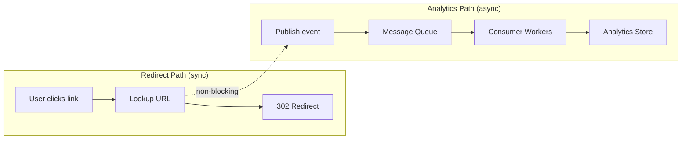
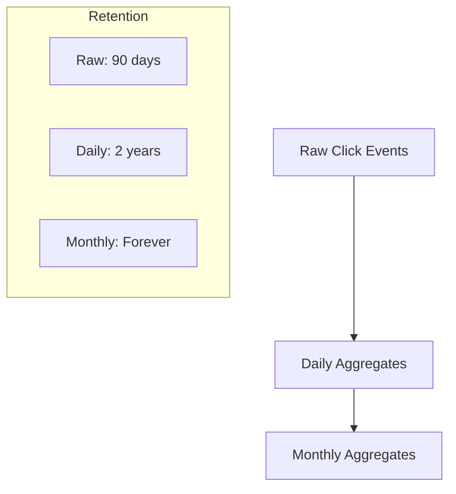

# Analytics Pipeline

> Async click event processing for real-time statistics.

## What It Is

An asynchronous pipeline that captures click events during redirects, processes them in the background, and stores aggregated statistics for user dashboards.

## How It Works

### Event Flow

1. **Redirect Service** publishes click event to message queue (non-blocking)
2. **Message Queue** buffers events, handles backpressure
3. **Consumer Workers** enrich events (GeoIP, device parsing)
4. **Analytics Store** persists for querying

### Click Event Data

| Field | Source | Example |
|-------|--------|---------|
| short_code | Request path | `k7Qz3Np` |
| timestamp | Server time | `2024-02-01T12:34:56Z` |
| ip_hash | Hashed IP | `a1b2c3d4` (privacy) |
| country | GeoIP lookup | `US` |
| referrer | HTTP header | `twitter.com` |
| device_type | User-Agent | `mobile` |
| browser | User-Agent | `Chrome` |

## Data Aggregation

### Pre-computed Aggregates

To serve dashboard queries quickly, aggregates are computed:

- **Hourly**: Clicks, unique visitors per URL
- **Daily**: Top referrers, countries, devices
- **Monthly**: Summary statistics, trends

## Why This Approach

- **Non-blocking**: Redirects never wait for analytics
- **Scalable**: Queue absorbs traffic spikes
- **Resilient**: Analytics failure doesn't affect redirects
- **Efficient**: Pre-aggregation enables fast dashboard queries

## Key Configuration

| Parameter | Value | Rationale |
|-----------|-------|-----------|
| Queue retention | 7 days | Buffer for consumer downtime |
| Consumer workers | 3-10 | Scale with traffic |
| Raw data retention | 90 days | Balance storage vs detail |
| Aggregation lag | < 5 minutes | Near real-time dashboards |

## Backpressure Handling

When the queue fills up:

1. **Oldest events dropped first** - recent data more valuable
2. **Alert on queue depth** - scale consumers
3. **Backfill from logs** - recover dropped events if needed

## Privacy Considerations

- IP addresses are hashed, not stored raw
- No PII in click events
- Aggregates further anonymize data
- Retention policies limit data lifetime
