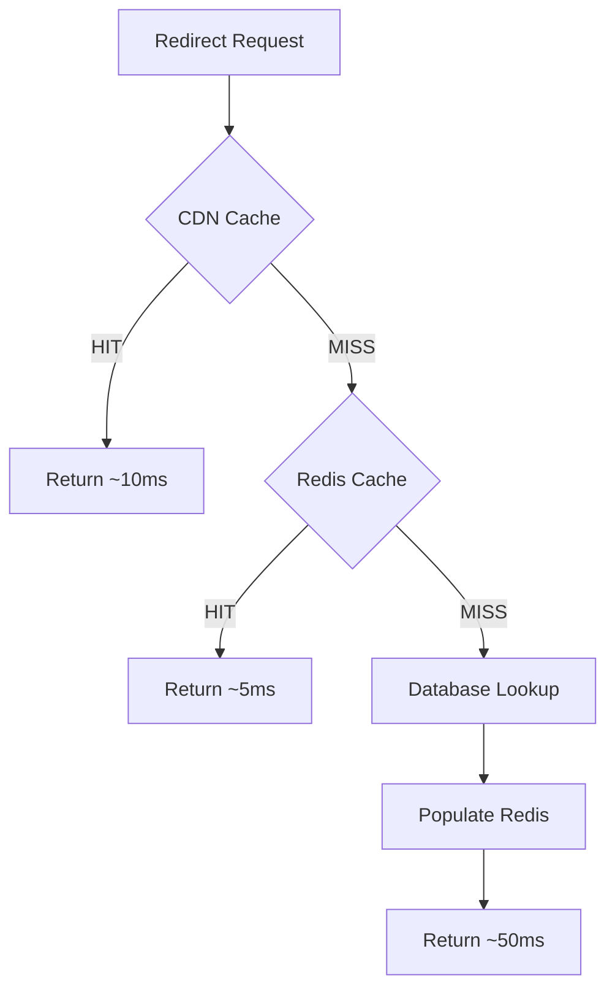
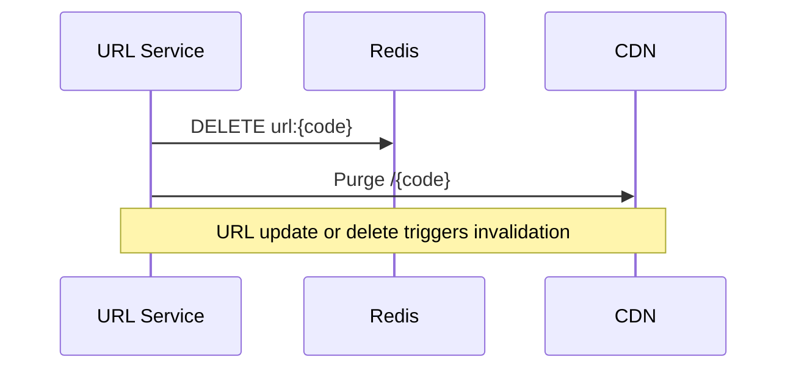

# Caching Strategy

> Multi-layer cache architecture for sub-50ms redirect latency.

## What It Is

A three-tier caching system that serves most redirects from memory, minimizing database load and achieving consistent low latency globally.

## How It Works



### Cache Layers

| Layer | TTL | Scope | Purpose |
|-------|-----|-------|---------|
| **CDN** | 1 hour | Global edge | Lowest latency for hot URLs |
| **Redis** | 24 hours | Per region | Fast lookup, reduces DB load |
| **Database** | N/A | Primary | Source of truth |

### Cache Key Design

```
url:{short_code}     → long_url          # Primary lookup
url:404:{short_code} → "1"               # Negative cache (5 min TTL)
rate:{api_key}:{min} → count             # Rate limiting
```

### Negative Caching

When a short code doesn't exist, cache this fact for 5 minutes. This prevents repeated database lookups for invalid or expired URLs.

## Why This Approach

- **Latency**: CDN serves global users in ~10ms
- **Scalability**: 95%+ cache hit rate keeps database load minimal
- **Availability**: Cached data available even during database issues
- **Cost**: Fewer database queries reduces operational cost

## Key Configuration

| Parameter | Value | Rationale |
|-----------|-------|-----------|
| CDN TTL | 1 hour | Balance freshness vs edge performance |
| Redis TTL | 24 hours | Most URLs are accessed within a day |
| Negative cache TTL | 5 minutes | Short enough for deleted URL recovery |
| Redis cluster size | 3 nodes minimum | High availability with automatic failover |

## Cache Invalidation



On URL update or delete:
1. Delete Redis key immediately
2. Purge CDN edge cache via API
3. Next request fetches fresh data
