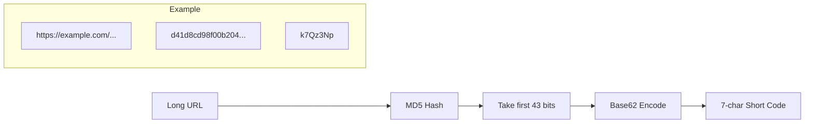
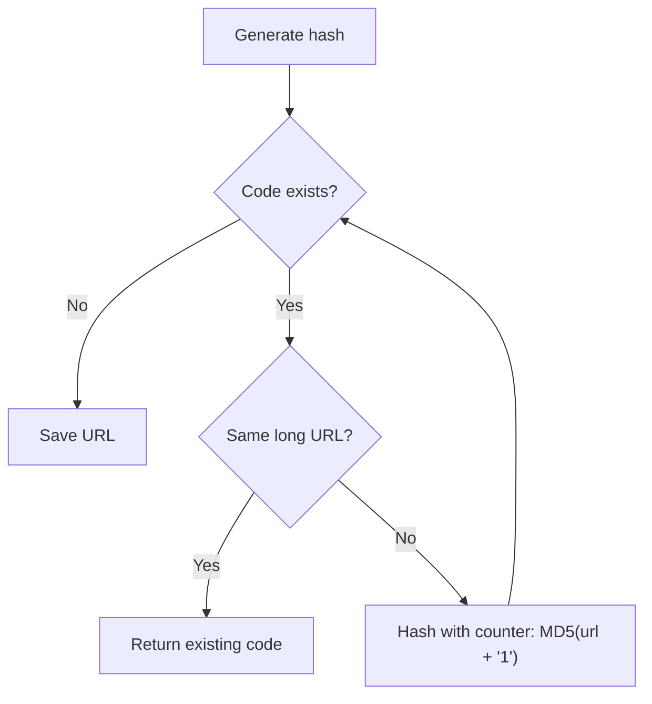

# Key Generation

> Hash-based short code generation for URL shortening.

## What It Is

Short codes are generated by hashing the long URL and encoding the result in base62. This produces deterministic, URL-safe identifiers without requiring coordination between servers.

## How It Works

### Base62 Encoding

- Characters: `a-z`, `A-Z`, `0-9` (62 characters)
- URL-safe, no encoding needed
- 7 characters = 62^7 = **3.5 trillion** unique codes

### Collision Handling

1. **Same URL shortened twice**: Return existing short code (idempotent)
2. **Different URLs, same hash**: Append counter and rehash

## Why This Approach

- **No coordination**: Each server generates codes independently
- **Deterministic**: Same URL always produces same base hash
- **Simple**: No distributed counter or ID service needed
- **Collision-safe**: Counter suffix handles rare hash collisions

## Key Configuration

| Parameter | Value | Rationale |
|-----------|-------|-----------|
| Code length | 7 characters | 3.5T combinations, sufficient for 1B+ URLs |
| Hash algorithm | MD5 | Fast, collision handling makes cryptographic strength unnecessary |
| Retry limit | 10 | Maximum collision resolution attempts before error |
