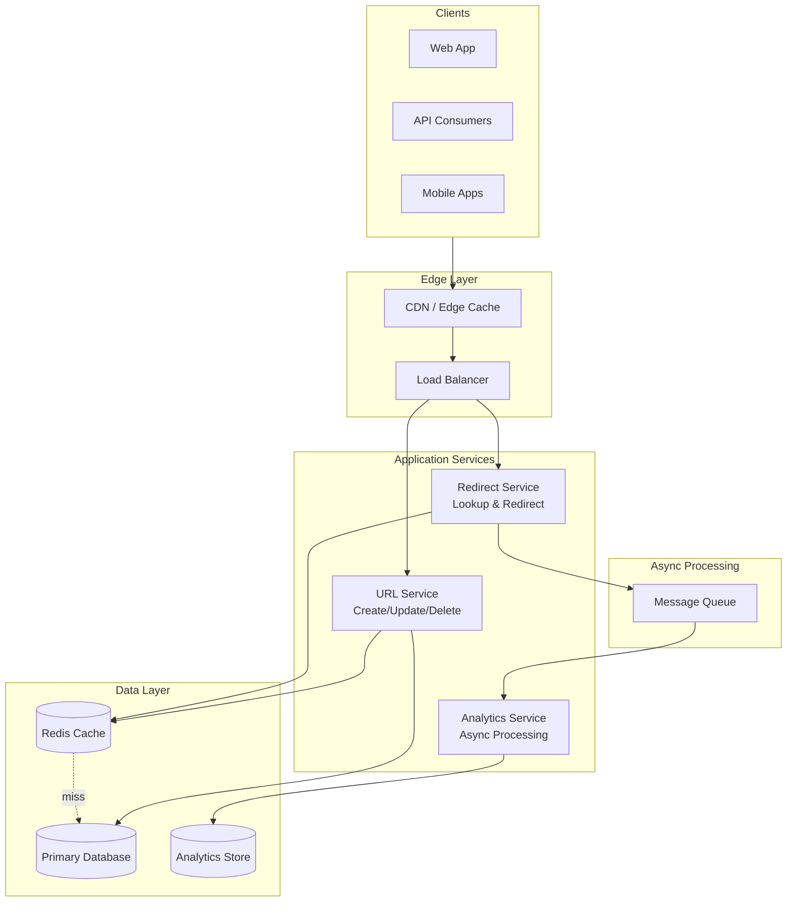
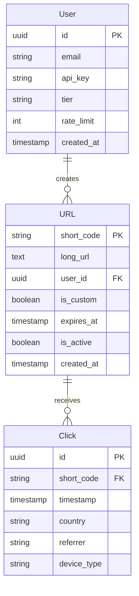
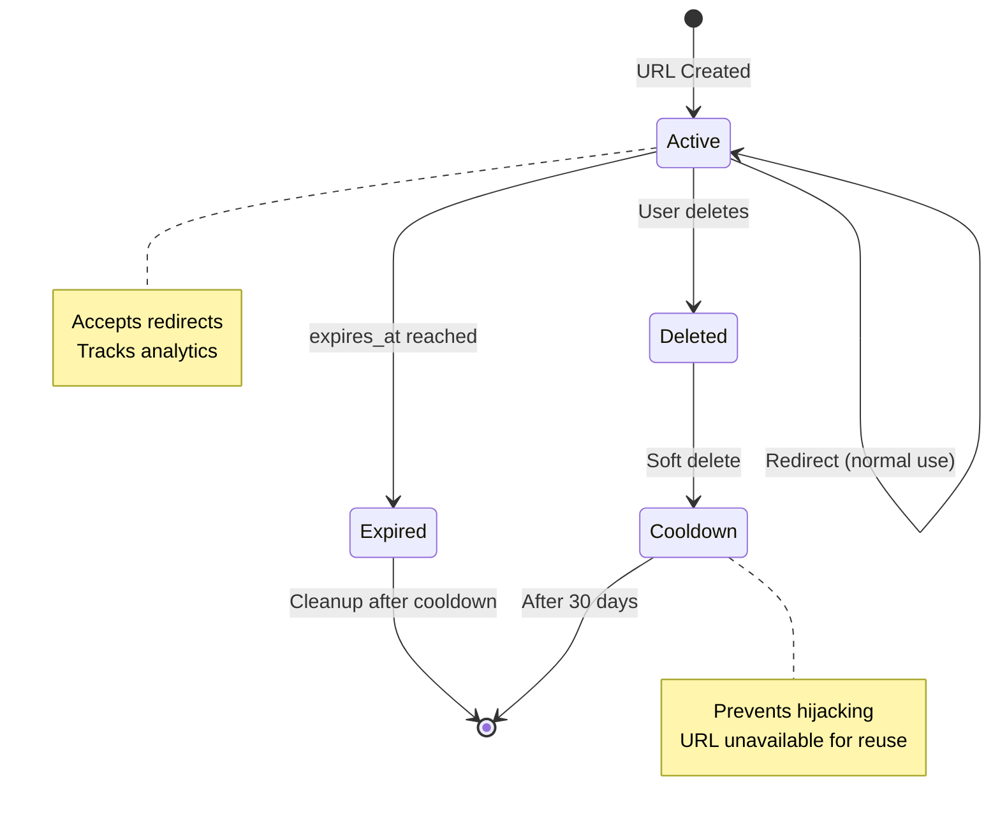
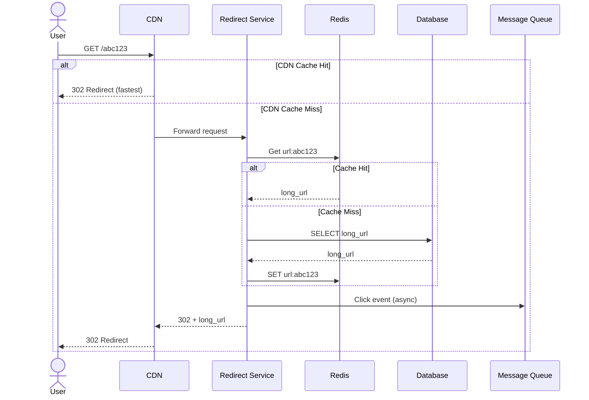
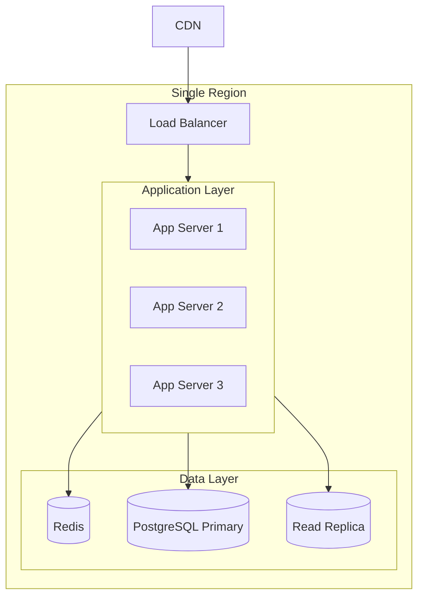
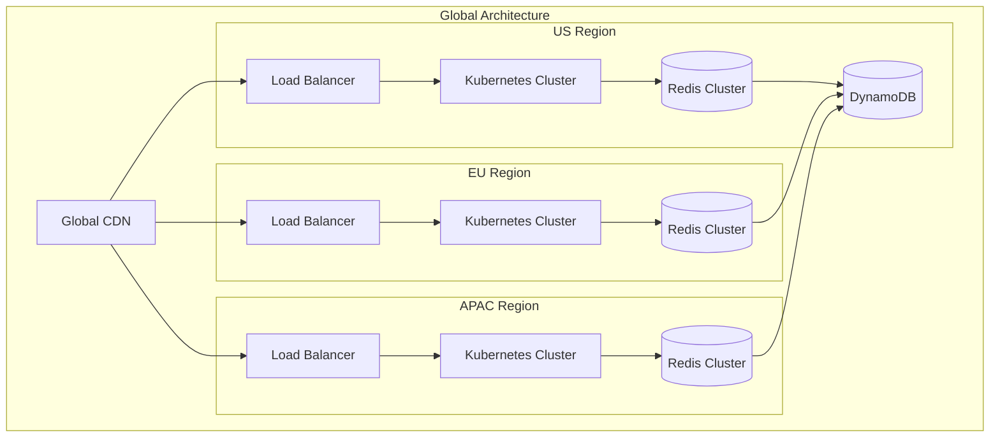

# System Design: URL Shortener

> A URL shortening service that converts long URLs into short, shareable links with analytics.

## Core Documents

- [requirements.md](../requirements.md) - Actors, constraints, scale, success criteria

## System Overview

## Service Responsibilities

| Service | Responsibility | Latency Target |
|---------|----------------|----------------|
| **URL Service** | Create, update, delete URLs; user management | < 500ms |
| **Redirect Service** | Lookup short URL → long URL, redirect user | < 50ms |
| **Analytics Service** | Ingest click events, aggregate statistics | Async |

## Key Design Decisions

### 1. Separate Read/Write Paths

Redirects (reads) vastly outnumber URL creations (writes) at ~100:1 ratio. Separating these paths allows independent optimization and scaling.

### 2. Cache-First for Redirects

Most redirects are served from Redis cache. Database is only accessed on cache miss. This achieves sub-50ms latency for hot URLs.

### 3. Async Analytics

Click tracking is published to a message queue and processed asynchronously. This ensures redirects are never blocked by analytics processing.

### 4. CDN at Edge

Popular URLs are cached at CDN edge locations globally, providing lowest latency for frequently accessed links.

## Data Model

## URL State Lifecycle

## Redirect Flow

## API Design

### Core Endpoints

| Method | Endpoint | Description |
|--------|----------|-------------|
| POST | `/api/v1/shorten` | Create short URL |
| GET | `/{short_code}` | Redirect to long URL |
| GET | `/{short_code}+` | Preview URL info |

### Authenticated Endpoints

| Method | Endpoint | Description |
|--------|----------|-------------|
| GET | `/api/v1/urls` | List user's URLs |
| GET | `/api/v1/urls/{code}` | Get URL details |
| PATCH | `/api/v1/urls/{code}` | Update URL |
| DELETE | `/api/v1/urls/{code}` | Delete URL |
| GET | `/api/v1/urls/{code}/stats` | Get analytics |

### Response Codes

| Code | Meaning |
|------|---------|
| 302 | Redirect to long URL |
| 404 | Short URL not found |
| 410 | URL expired or deleted |
| 429 | Rate limit exceeded |

## Technical Deep Dives

For complex topics, see supporting documentation:

- [Key Generation](../key-generation.md) - Hash-based short code generation
- [Caching Strategy](../caching.md) - Multi-layer cache architecture
- [Rate Limiting](../rate-limiting.md) - Token bucket with sliding window
- [Analytics Pipeline](../analytics.md) - Async click event processing

## Scaling Strategy

### Startup Scale (10M URLs, 1K req/sec)

### Enterprise Scale (1B+ URLs, 100K req/sec)

### Scale Comparison

| Aspect | Startup | Enterprise |
|--------|---------|------------|
| Database | PostgreSQL | DynamoDB (global tables) |
| Cache | Single Redis | Redis Cluster per region |
| Compute | 3 VMs | Kubernetes with auto-scaling |
| Regions | 1 | 3+ (geo-distributed) |
| Analytics | PostgreSQL | ClickHouse cluster |

## Failure Handling

| Component | Impact | Mitigation |
|-----------|--------|------------|
| Redis down | Cache miss, higher DB load | Read from DB, auto-failover |
| Database down | Can't create new URLs | Read-only mode from cache |
| Queue full | Analytics delayed | Drop oldest, backfill later |
| CDN outage | Slower redirects | Requests hit origin |

### Degradation Levels

1. **Normal** - All features available
2. **Analytics Degraded** - Redirects work, stats delayed
3. **Write Degraded** - Redirects work, can't create URLs
4. **Cache-Only** - Only cached URLs work
5. **Complete Outage** - Static error page via CDN

## Hotspots & Open Questions

- **Key generation choice**: Hash-based chosen for simplicity; counter-based is alternative for guaranteed uniqueness
- **Database transition**: At what exact scale to migrate from PostgreSQL to DynamoDB?
- **Custom domains**: SSL certificate management for white-label domains
- **Data retention**: How long to retain raw click data vs aggregates?

## Next Steps

1. Finalize key generation approach (hash vs counter)
2. Define database migration triggers
3. Design custom domain SSL strategy
4. Set analytics retention policy
