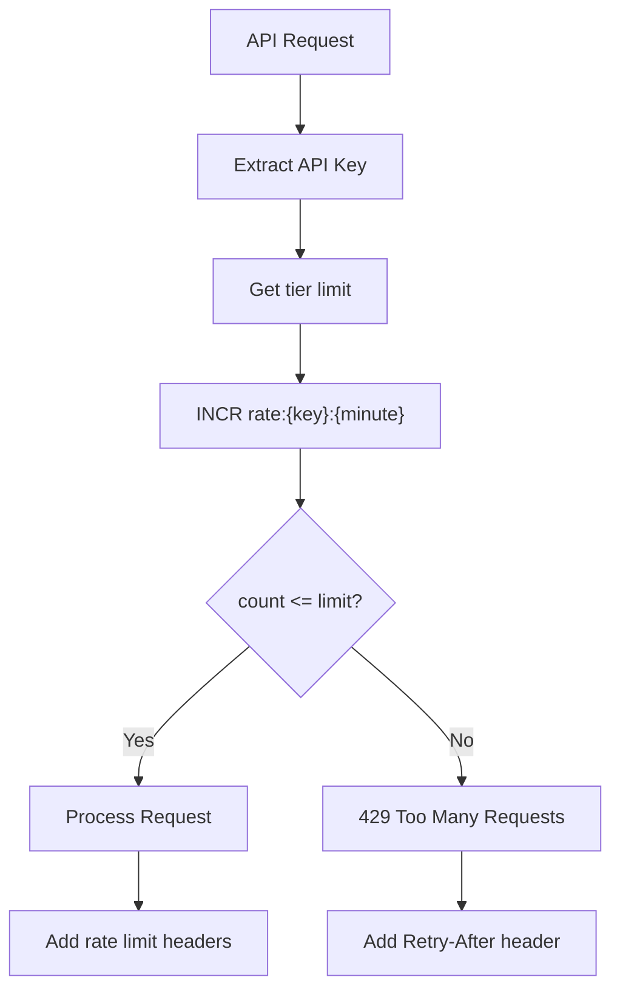

# Rate Limiting

> Token bucket with sliding window for API protection.

## What It Is

Rate limiting controls how many requests a user can make within a time window. This prevents abuse, ensures fair usage, and protects system resources.

## How It Works



### Sliding Window Counter

Using Redis atomic operations:

```
INCR rate:{api_key}:{minute_timestamp}
EXPIRE rate:{api_key}:{minute_timestamp} 60
```

Each minute window is a separate key that auto-expires, providing a sliding window effect.

## Rate Limits by Tier

| Tier | URL Creation | Redirects | Analytics API |
|------|--------------|-----------|---------------|
| Anonymous | 10/hour | Unlimited | N/A |
| Free | 100/min | Unlimited | 100/min |
| Pro | 1,000/min | Unlimited | 1,000/min |
| Enterprise | 10,000/min | Unlimited | 10,000/min |

## Response Headers

Successful requests include rate limit status:

```
X-RateLimit-Limit: 1000
X-RateLimit-Remaining: 847
X-RateLimit-Reset: 1706792400
```

Rate limited responses:

```
HTTP/1.1 429 Too Many Requests
Retry-After: 45
X-RateLimit-Remaining: 0
```

## Why This Approach

- **Simplicity**: Redis atomic operations are fast and reliable
- **Distributed**: Works across multiple application servers
- **Granular**: Per-minute windows allow burst recovery
- **Transparent**: Headers let clients self-throttle

## Key Configuration

| Parameter | Value | Rationale |
|-----------|-------|-----------|
| Window size | 1 minute | Fine-grained control, quick recovery |
| Redis TTL | 60 seconds | Auto-cleanup of expired windows |
| Burst allowance | 2x limit | Allow short bursts within reason |

## Edge Cases

### New Minute Boundary

When a request spans a minute boundary, the new minute starts fresh. This allows recovery from rate limiting without waiting for the full window.

### Distributed Counting

All rate limit checks go to Redis, ensuring consistent counting across all application servers. Redis cluster provides high availability.
