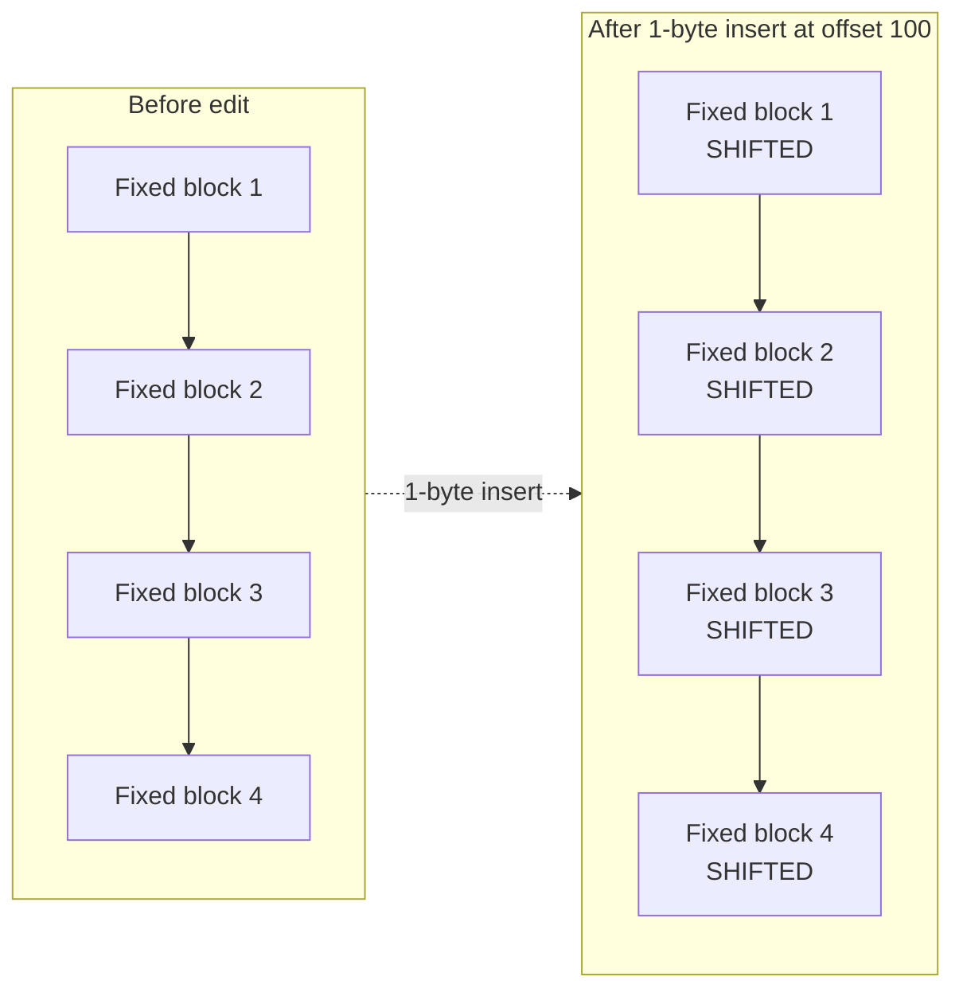
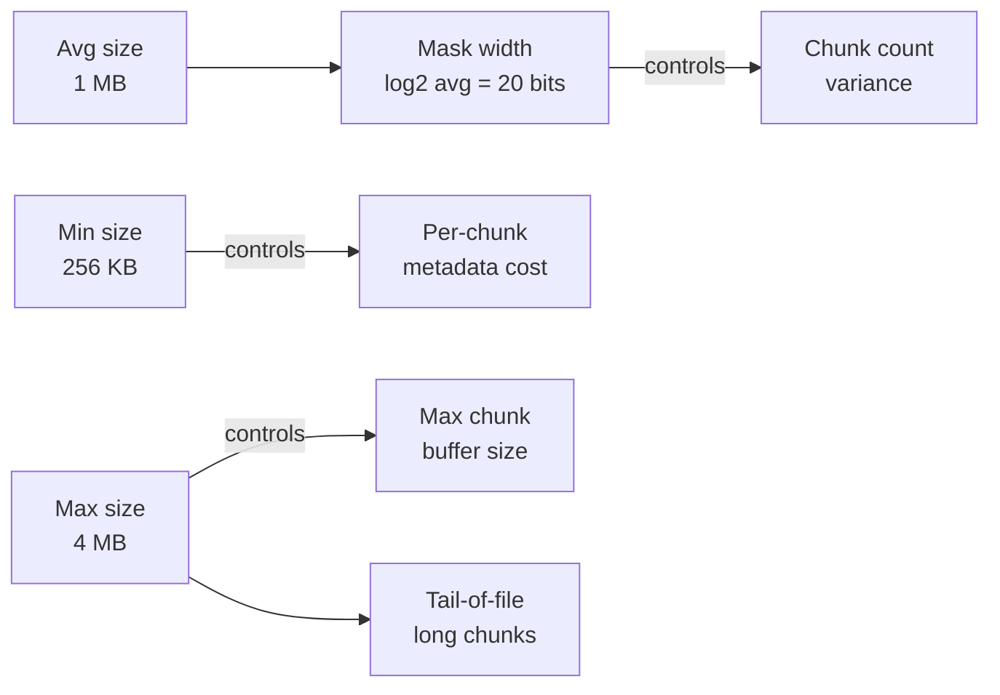
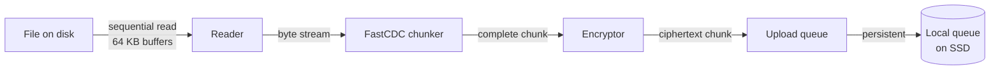
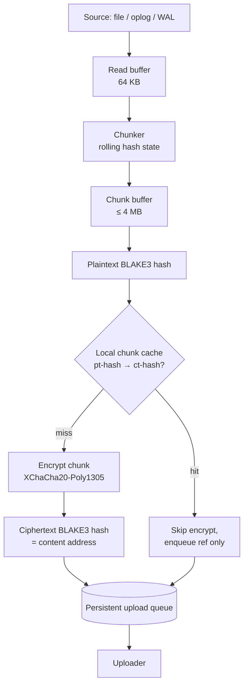

# Content-Defined Chunking (CDC) — Algorithms, Data Types, Pipeline

> Standalone reference. Covers the problem CDC solves, the algorithm
> family (Rabin / Buzhash / FastCDC / newer), a byte-level worked
> example, parameter tuning, per-data-type chunking behavior (photos,
> videos, database change logs, etc.), streaming and resumability,
> and performance on ARM.
>
> Used as a reference from:
> - [`umbrel-home/`](umbrel-home/) — end-to-end encrypted device backup design.
>
> If you want the design-level summary ("we pick FastCDC, 256 KB / 1 MB /
> 4 MB, per-user dedup, here's why for this specific system") see
> [`umbrel-home/docs/pipeline-03-chunking.md`](umbrel-home/docs/pipeline-03-chunking.md).

## 1. The problem CDC solves

A backup system wants: when the user changes a few bytes of a large file,
re-upload only the affected region, not the whole file. The naive way —
fixed-size blocks — works only if changes are overwrites of existing
bytes at existing offsets. The moment a change *inserts* bytes near the
start of a file, every downstream block shifts, and a fixed-block
deduper thinks every block is new.



Content-defined chunking (CDC) fixes this by choosing boundaries based
on **content**, not position. A boundary is placed at a byte `i`
whenever some hash of the bytes `[i-W .. i]` (a fixed-size window)
matches a predetermined pattern. Insert a byte near the start, and
only the boundaries inside the inserted region are affected — all
boundaries in the unchanged tail still hit the same pattern at the same
content offsets, so their chunks are bit-identical to before and dedup.

That's the whole idea. Everything below is just "how do we compute that
hash fast, and which pattern do we match?"

## 2. The rolling hash primitive

A rolling hash is a hash function defined over a sliding window of
bytes such that when the window advances by one byte (adds one at the
right, drops one at the left), the new hash can be computed from the
old hash in **O(1)**, not by re-hashing the whole window.

Formally, if `h_i` is the hash of bytes `[b_{i-W+1} .. b_i]` and we
slide to position `i+1`:

```
h_{i+1} = update(h_i, incoming_byte = b_{i+1}, outgoing_byte = b_{i-W+1})
```

The O(1) update is what makes CDC feasible on a device — otherwise
boundary detection would be O(n·W) where W is the window size.

Different CDC algorithms differ almost entirely in what rolling hash
they use and what boundary condition they match against.

## 3. Boundary selection

Given a rolling hash `h`, CDC declares a cut at position `i` when:

```
(h_i & mask) == magic
```

where `mask` has roughly `log₂(target_avg_chunk_size)` low bits set.
For a 1 MB target average, that's a 20-bit mask (2²⁰ ≈ 1 MB), so the
probability any given position is a cut is ~1/2²⁰, giving an expected
chunk size of ~1 MB.

Most implementations also enforce:

- **Min chunk size** — skip boundary evaluation for the first `min`
  bytes after a cut (no cut is allowed until you've read at least `min`
  bytes). Prevents pathological runs of tiny chunks.
- **Max chunk size** — force a cut after `max` bytes even if no natural
  boundary was found. Caps worst-case memory.

These three knobs — min, avg (via mask width), max — are the whole
parameter space of basic CDC.

## 4. Algorithm family

### 4.1 Rabin fingerprint CDC (the classic, LBFS 2001)

Rolling hash is a polynomial over GF(2) — each byte is treated as a
polynomial coefficient, and the hash is `h = Σ b_i · x^i mod p(x)` for
some irreducible polynomial `p(x)`. Rolling update is an XOR + shift +
table lookup per byte.

Properties:

- Excellent boundary distribution; the seminal paper is LBFS (Low-
  Bandwidth File System).
- Slow-ish on modern CPUs: the polynomial arithmetic doesn't vectorize
  well, and each byte costs a few table lookups.
- Used by: bup, some early research systems, original ZFS dedup.

### 4.2 Buzhash (borgbackup)

Rolling hash is a rotating XOR over a precomputed per-byte random
table:

```
h_{i+1} = rotate_left(h_i, 1) XOR table[incoming] XOR rotate_left(table[outgoing], W)
```

One XOR, one rotate, one table lookup per byte. Faster than Rabin.
Boundary distribution is slightly worse than Rabin but good enough in
practice.

- Used by: borgbackup, some LBFS-derived systems.

### 4.3 FastCDC (our pick)

FastCDC is the 2016 paper and subsequent improvements (FastCDC v2016,
v2020) that pair Gear-style rolling hashing with three practical
improvements:

1. **Gear hash** — rolling hash is simpler than Buzhash: just
   `h_{i+1} = (h_i << 1) + table[incoming]`. No rotation, no subtraction
   of the outgoing byte. The outgoing byte naturally decays because
   `h` is 64 bits and old bytes shift out the high end. This is ~2×
   faster than Buzhash and ~3–5× faster than Rabin on modern CPUs.
2. **Normalized chunking** — uses *two* masks: a stricter one
   (`mask_L`, fewer bits matched ⇒ lower cut probability) for the
   first half of the acceptable range and a looser one (`mask_S`, more
   bits matched ⇒ higher cut probability) for the second half. This
   squeezes the chunk-size distribution closer to the mean, reducing
   variance. Variance matters because extreme long chunks hurt
   dedup and extreme short chunks hurt bandwidth.
3. **Cut-point skipping** — the first `min` bytes after a cut are
   skipped from hash evaluation entirely (the hash isn't even
   computed). Saves roughly 20–30% of CPU on typical media where min
   is 25–50% of avg.

End result: FastCDC matches or beats Rabin on dedup quality at
~3× the throughput on ARM.

- Used by: restic, duplicacy, Kopia, most post-2016 backup tools.

### 4.4 Gear CDC / QuickCDC / RAM-CDC / AE / MII / newer research

Refinements that eke out another 10–30% throughput or improve
boundary stability under specific workloads. None have reached
restic-level production maturity, so we defer. Revisit every few
years.

### 4.5 Head-to-head

| Algorithm | Rolling update cost | Boundary quality | Throughput on ARM Cortex-A76 (rough) | Maturity |
|---|---|---|---|---|
| Rabin | ~3–5 ops + 2 table lookups | Excellent | ~0.4 GB/s | Very mature |
| Buzhash | 2 ops + 1 table lookup | Good | ~0.8 GB/s | Mature (borg) |
| FastCDC | 1 shift + 1 add + 1 table lookup | Excellent (with normalized chunking) | ~1.2–1.5 GB/s | Mature (restic) |
| Gear CDC (newer) | same as FastCDC | Good | ~1.5–2.0 GB/s | Research/early |

(Throughput numbers are order-of-magnitude on a single core. Actual
depends heavily on cache behavior, compiler, SIMD. Measure before
deploying.)

## 5. Worked example — FastCDC on a 5 MB MP4 edit

Suppose the user edits an MP4's metadata (rewrites a 200-byte title tag
inside the `moov` atom at offset ~1000) and re-saves.

Before edit, chunking the 5 MB file with FastCDC at (256 KB min, 1 MB
avg, 4 MB max) produces, say, 5 chunks at offsets:

```
[0, 1.1 MB, 2.3 MB, 3.0 MB, 4.1 MB, 5.0 MB]
chunks: C0, C1, C2, C3, C4
```

After the 200-byte in-place replacement at offset ~1000:

- The first chunk C0 (covering offset 0 → 1.1 MB) **has changed
  content** — its ciphertext hash is new. Must be re-uploaded.
- The rolling hash state entering byte 1.1 MB is, in a good CDC, almost
  identical to before. If the edit is in-place (same length), byte
  offsets haven't shifted at all, and the rolling window at every
  downstream boundary position matches bytes that are identical to
  the previous snapshot.
- So boundaries at 1.1 MB, 2.3 MB, 3.0 MB, 4.1 MB, 5.0 MB fire at the
  same offsets as before. Chunks C1, C2, C3, C4 are **bit-identical**
  and their content addresses (ct-hashes) match prior uploads.
- Upload cost: 1 chunk (~1.1 MB), not 5 MB.

Now suppose instead the user *inserts* a 300-byte custom tag at offset
~1000:

- C0's content changes and its length changes. New ct-hash, upload.
- Every downstream byte has shifted by 300 bytes. The rolling hash
  entering the region from ~1.1 MB onward is over a 64-byte window
  whose content is identical to before (it's the same file content, just
  at a new offset). So the rolling hash hits the pattern at the same
  *content* offsets as before — but now at file offsets 300 bytes
  later.
- Therefore boundaries shift by 300 bytes but chunks C1..C4 are
  content-identical. Their ct-hashes match. No re-upload.

This is the shift-resistance property. Fixed-size chunking would
re-upload all 5 MB.

## 6. Parameter tuning



### Smaller avg (e.g., 256 KB)

- **Pro:** Finer dedup granularity. A small edit re-uploads less.
- **Con:** More chunks ⇒ more metadata rows in the server DB, more HTTP
  round-trips (HEAD + PUT per chunk), more per-chunk AEAD overhead. At
  10K users with 50 GB each, 4× the chunk count means 4× the metadata
  DB rows.
- Use when: workload is many small edits to large files (source code
  repos, document editing).

### Larger avg (e.g., 4 MB)

- **Pro:** Less metadata overhead, faster uploads per byte.
- **Con:** An edit of 1 byte may still cost a 4 MB re-upload (because
  the edit falls inside a single chunk).
- Use when: workload is whole-file replacements (photos uploaded and
  never edited).

### Our pick: 256 KB / 1 MB / 4 MB

- Avg of 1 MB keeps metadata manageable (~50K rows per 50 GB user).
- Min of 256 KB avoids tiny-chunk pathologies without sacrificing
  granularity much.
- Max of 4 MB caps worst-case device memory.

These are restic's defaults; they're defensible for a mixed
media + notes + DB workload without measurement.

### Normalized chunking (FastCDC's second knob)

Beyond basic min/avg/max, FastCDC uses two masks:

- `mask_L` (stricter) for bytes in `[min, avg]` — makes cuts *less*
  likely in the first half of the acceptable range, biasing chunks
  toward the average.
- `mask_S` (looser) for bytes in `[avg, max]` — makes cuts *more*
  likely in the second half, discouraging runaway chunks.

Effect: chunk-size distribution becomes more bell-shaped instead of
geometric. In practice this reduces dedup-cost variance by ~10–20%
across a large corpus.

We take the defaults. It's a measured-once, never-tuned parameter.

## 7. Data-type-specific chunking

The big question: should the chunker know about file formats, or treat
every input as an opaque byte stream?

**Our design treats every input as opaque bytes.** This is the restic
model. But the reasoning matters — here's how it plays out per data
type.

### 7.1 JPEG / HEIC / PNG photos

- **Format structure:** JPEG is a series of segments (SOI, APPn, DQT,
  SOF, SOS, EOI) with entropy-coded DCT data inside SOS. HEIC is ISO
  BMFF container (moov-like boxes) wrapping HEVC.
- **What changes when the user edits:**
  - EXIF-only edit (rating, GPS, title in a photo manager) — the APPn
    header bytes change; the SOS data after is untouched.
  - Crop / rotate (metadata-only on some formats, new pixels on
    others) — mostly a new file.
- **CDC on raw bytes:** Since entropy-coded image data is already
  compressed and effectively random, FastCDC boundaries fall at
  content-dependent but essentially random positions. For an EXIF
  edit, only the chunk containing the header region changes; the rest
  dedups. For a crop/rotate that produces new pixels, nothing dedups.
- **Format-aware chunking would not help.** Trying to align chunks
  with JPEG segment boundaries would produce uneven chunk sizes and
  cost little extra dedup — the "expensive" image data is inside SOS
  anyway.
- **Compression layer:** zstd on JPEG/HEIC chunks buys almost nothing
  (already entropy-coded). The "skip compression if not useful" check
  should trigger on most chunks. Save the CPU.

### 7.2 MP4 / MOV / MKV / WebM videos

- **Format structure:** MP4/MOV are ISO BMFF atoms. Two important
  ones: `moov` (metadata, track index, timing) and `mdat` (encoded
  payload).
- **Two common edit patterns:**
  1. **Metadata-only rewrite.** Most editing tools can update the
     `moov` atom (titles, chapter marks, creation time) without
     re-encoding `mdat`. CDC on raw bytes handles this perfectly —
     `moov` chunks change, `mdat` chunks stay bit-identical.
  2. **Re-encode.** If the user transcodes or applies any pixel-level
     change, `mdat` is fully new. Zero dedup possible regardless of
     algorithm.
- **`moov` atom placement.** Some encoders write `moov` at the start,
  others at the end ("streaming-optimized" vs. "editor-friendly"). CDC
  doesn't care — it chunks bytes in order.
- **Format-aware chunking could help** in the narrow case where
  editors *move* the `moov` atom from end to start without re-encoding.
  CDC would see this as a huge shift and may miss the `mdat` dedup if
  the rolling hash window crosses the moved `moov` boundary. In
  practice this is rare enough to ignore.
- **Compression layer:** zstd on H.264/HEVC/AV1 streams buys nothing
  (already compressed). Skip compression.
- **Large files and memory:** A 5 GB 4K video must not be buffered in
  RAM during chunking. See §8 (streaming).

### 7.3 RAW photo formats (CR2, NEF, ARW, DNG)

- Generally large (~20–60 MB each) with embedded JPEG previews and raw
  sensor data. Thumbnails and EXIF edits are in small header regions.
- CDC on raw bytes is correct and good. Metadata-only edits re-upload
  the header chunk; sensor data dedups.

### 7.4 MongoDB oplog stream

- **What it is:** Append-only stream of BSON documents describing every
  write operation. The agent tails this and ships it.
- **Content pattern:** Every op has a similar "envelope" (timestamp,
  op type, namespace, document snippet). Lots of repeated substrings
  within and across ops.
- **CDC behavior:** Excellent. Boundary placement falls at natural
  inter-document points (where document bytes happen to hit the cut
  pattern). Across snapshots, the *previously-shipped* prefix of the
  oplog stream dedups by construction, and only the freshly-appended
  tail is new. The FastCDC shift-resistance is wasted here (the stream
  is append-only) but doesn't cost anything.
- **Compression:** BSON is text-heavy (field names, JSON-like structure),
  so zstd buys a lot. Always compress.

### 7.5 SQLite WAL frames

- **What it is:** A sequence of 4 KB (typical) page images plus frame
  headers. The WAL grows as transactions commit and resets after
  checkpoints.
- **Content pattern:** Page images contain application data; adjacent
  pages often share row patterns (same schema, similar rows).
- **CDC behavior:** Good. FastCDC will chunk across many page images
  per chunk (avg 1 MB ÷ 4 KB pages = ~256 pages per chunk). The shift-
  resistance shines when WAL checkpoints cause offset changes in the
  shipped byte stream — the chunker realigns naturally.
- **Special consideration — WAL resets.** When a checkpoint resets the
  WAL, the shipper rotates its logical stream (records a marker in
  the upload pipeline) so the chunker's rolling-hash state is reset
  too. Otherwise the hash would carry state across the reset and place
  boundaries based on stale window content.
- **Compression:** Page images are often low-entropy (many zero-padded
  cells, repeated schema strings). zstd helps significantly.

### 7.6 SQLite base dumps (`VACUUM INTO` output)

- **What it is:** A fully-checkpointed, compact copy of the live DB
  file. Rewriting on schedule.
- **Content pattern:** Consecutive base dumps share most page layouts.
  The rows that changed are scattered across pages, but the majority
  of pages (indexes, unchanged tables) are bit-identical across bases.
- **CDC behavior:** Excellent. Across two bases a few hours apart, most
  chunks dedup. This is the critical property: SQLite base snapshots
  look expensive ("full DB copy every N hours") but actually cost
  nearly zero after dedup.

### 7.7 Small files (< 256 KB)

- **Examples:** Markdown notes, app config, small images (favicons,
  avatars).
- **CDC isn't worthwhile** — the per-chunk metadata overhead exceeds
  the amortization window. Use whole-file chunking: one chunk per
  file, boundary at EOF.
- **Threshold:** 256 KB matches the FastCDC min chunk size. Files
  smaller than min are always one chunk anyway; making this explicit
  bypasses unnecessary hashing.

### 7.8 Already-chunked streams (HLS/DASH)

- Segments are pre-cut by the streaming protocol. Each segment is
  already a small file. Treat as "small file" (whole-file chunk each)
  even though individually they're 2–10 MB — CDC on them would work
  but the segment *is* the natural boundary.

### 7.9 Encrypted / already-random content

- If the user stores VeraCrypt containers, encrypted archives, or
  strongly-compressed blobs, every edit produces essentially random
  bytes from the chunker's perspective.
- CDC still places valid boundaries (the rolling hash hits the pattern
  probabilistically on random data too), and the shift-resistance
  still works at the outer container level.
- But per-chunk content hashes are unlikely to ever match across
  snapshots unless the container didn't change at all. Dedup wins
  come from "same container, unchanged" cases, not from in-place edits.

## 8. Streaming chunking

A 5 GB video arrives at the chunker but device RAM is 4 GB. We must
chunk without buffering the whole file.



Properties:

- **Reader** uses bounded read buffers (64 KB is plenty).
- **Chunker** maintains only: rolling hash state (64 bytes), current
  chunk buffer (up to `max_chunk_size` = 4 MB), and a few counters.
  Total: ~4 MB working memory regardless of file size.
- **Encryptor** processes one chunk at a time, produces ciphertext of
  the same order-of-magnitude size, hands it to the upload queue.
- **Upload queue** persists to local SSD. The chunker does not wait
  for uploads — it back-pressures against the queue's bounded size.

A 5 GB video chunks in ~4 seconds of CPU on ARM (1.2 GB/s FastCDC) plus
whatever disk read time. Never touches more than ~8 MB RAM (one chunk
being encrypted + one chunk being read).

## 9. Pipeline: chunker ↔ encryptor ↔ uploader



### Buffer sizing

| Stage | Buffer | Size | Why |
|---|---|---|---|
| Read | Per-source input buffer | 64 KB | Matches typical kernel readahead; too small wastes syscalls, too large wastes cache |
| Chunk | Per-chunk accumulator | up to 4 MB | = max chunk size |
| Encrypt | In-place on chunk buffer | 0 extra | AEAD can encrypt in place with a small tag appended |
| Queue staging | Per-enqueued ciphertext | ≤ 4 MB + tag | Held in queue until upload ack, persisted to SSD not RAM for long queues |

### Concurrency model

- **Chunker** is single-threaded per source stream (rolling hash is
  sequential by nature).
- **Multiple sources** (filesystem, oplog, each SQLite DB) run
  chunkers concurrently on separate cores.
- **Encryption** can happen in parallel with chunking of the next chunk
  — a small pipeline of 2 stages is enough; more depth wastes memory.
- **Upload** is concurrent with everything upstream.

Rough memory budget on a 4 GB device:

- 4 MB × 5 source streams = 20 MB for chunk buffers
- 16 MB local chunk cache (hot recent entries)
- 32 MB persistent queue page cache
- ≈ 70 MB total for the chunking pipeline. Easily fits.

### Why hash plaintext *before* encrypting

- Plaintext hash is the key to the local "have I already encrypted
  this chunk?" cache. Hit → reuse cached ciphertext; miss → encrypt
  fresh.
- Re-encrypting the same plaintext would produce different ciphertext
  each time (random DEK) and waste the dedup opportunity on the
  device's own files (e.g., filesystem scan after reboot finds the
  same files again).

### Why hash ciphertext *after* encrypting

- The server can only see ciphertext. The content address must be
  deterministic on what the server sees — the ct-hash.
- This is also what the server stores in the object store.

## 10. Resumability

The agent may crash, lose power, or be restarted mid-file. We don't
want to re-chunk from byte 0 every time.

### At file boundary (easy case)

The upload queue persists snapshot commits. A committed file is done.
On restart, the agent resumes scanning from the next uncommitted file.

### Mid-file (the interesting case)

A 5 GB video is halfway through chunking when the agent dies. On
restart:

1. The agent reads the file's size and last-modified time from disk.
2. It checks the queue / local metadata for "last successfully emitted
   chunk for this file": offset and ct-hash.
3. It seeks to that offset in the file, restarts the chunker with a
   *fresh* rolling hash state, and resumes.

Why a fresh rolling hash is fine: the chunker starts a new chunk at
the last emitted boundary. The first `min` bytes after that boundary
are "cut-point skipped" anyway (no boundary allowed until min is
reached), so the rolling hash has time to fill its 64-byte window with
content from the file before any cut is evaluated. Boundaries placed
after the restart are content-deterministic — same as if the chunker
had run continuously.

### Why this is safe under per-user dedup

If the agent happens to re-emit a chunk it previously emitted (because
the metadata about "last successful boundary" was lost), the HEAD
request against the server responds 200 (already have it) and the
second copy is skipped. No corruption, no duplicate storage.

### File changed while chunker was paused

If the file's mtime or size changed during the outage, treat it as a
new file: rescan from offset 0. The per-user dedup absorbs any
bit-identical chunks from the previous run.

## 11. Performance on ARM

Order-of-magnitude single-core numbers on a Cortex-A76 class CPU (what
Umbrel Home ships with):

| Stage | Throughput | Notes |
|---|---|---|
| Disk read (NVMe) | ~2–3 GB/s | Far faster than chunker |
| FastCDC | ~1.2–1.5 GB/s | Dominated by Gear hash |
| BLAKE3 | ~2–3 GB/s | SIMD-accelerated on ARMv8 |
| XChaCha20-Poly1305 | ~700 MB/s–1 GB/s | Software-only, no AES accel needed |
| zstd -3 (when enabled) | ~400 MB/s compress, ~1.5 GB/s decompress | Skip when not useful |

Overall pipeline throughput is pinned by the slowest stage that fires
on a given chunk. For compressible chunks that's zstd at ~400 MB/s.
For incompressible chunks (already-compressed media, encrypted blobs),
compression is skipped and throughput is pinned by XChaCha at ~700
MB/s.

Upload bandwidth is almost always the real bottleneck on a home
connection — the CPU pipeline can produce chunks far faster than
consumer Wi-Fi uploads them.

### Why we don't parallelize a single file across cores

CDC is inherently sequential — you can't place boundary at byte 2 MB
without having computed the rolling hash through byte 2 MB. You
could do speculative parallel chunking (each core starts at a
different offset, computes for a few chunks, keeps the chunks whose
first boundary aligned with some predecessor's last boundary) but
this is a well-known trap: the complexity isn't worth the gain for
our workload.

Instead we parallelize across *streams* — one chunker per source.

## 12. What CDC doesn't fix

Honest limits:

- **Re-encoded media.** If a video is re-encoded, every bit is new.
  No algorithm helps. This is the biggest "silent" dedup loss on a
  photo/video device.
- **Lossy transcodes.** Same as above. A 10 MB original photo and its
  10 MB recompressed version share zero bytes.
- **Thumbnail generation.** Thumbnails are new files; they don't
  dedup against the original. (They do dedup across *runs* of the
  same thumbnail generator, which matters.)
- **Encrypted containers.** An encrypted VeraCrypt container that
  rotates its master key ⇒ every block is new.
- **Compression that adds per-file randomness** (e.g., gzip with
  timestamp in the header). Minor issue; most modern tools default to
  deterministic compression.

These aren't CDC bugs — they're fundamental to "change all the bytes =
new content." Mitigation is outside the scope of chunking: pre-upload
transforms (e.g., keep the original and the re-encoded version
separately rather than replacing the original) would help UX but
don't change the storage math.

## 13. Summary

- **CDC solves the shift-insertion problem** that makes fixed-size
  chunking unusable for incremental backup.
- **FastCDC is the right algorithm** today: Gear hash is 2–3× faster
  than older rolling hashes, normalized chunking tightens size
  distribution, cut-point skipping saves CPU.
- **Treat all data as opaque bytes.** Format-aware chunking helps in
  narrow edge cases and costs significant engineering; the payoff
  isn't there.
- **Parameters:** 256 KB / 1 MB / 4 MB (min / avg / max). Default for
  restic and a good starting point for any mixed media + DB workload.
- **Per-data-type results:** Excellent for oplog/WAL (append-only
  streams), excellent for SQLite bases (page-level sharing across
  snapshots), good for photos (EXIF edits dedup), good for videos
  (metadata edits dedup, re-encodes don't), irrelevant for files
  < 256 KB (whole-file).
- **Pipeline:** bounded memory (~4 MB chunk buffer × concurrent
  streams), BLAKE3 on plaintext for local cache, encrypt per chunk,
  BLAKE3 on ciphertext for content address, resumable at chunk
  boundaries.
- **Bottleneck in practice is upload bandwidth**, not the chunking
  pipeline — ARM can produce chunks far faster than a home Wi-Fi
  uplink accepts them.

## Further reading

- Muthitacharoen et al., "A Low-Bandwidth Network File System" (SOSP
  2001) — Rabin-based CDC, the original.
- Xia et al., "FastCDC: A Fast and Efficient Content-Defined Chunking
  Approach for Data Deduplication" (USENIX ATC 2016).
- Xia et al., FastCDC 2020 follow-up — normalized chunking details.
- restic internals documentation — production FastCDC code
  (MIT-licensed, readable Go).
- borgbackup design docs — Buzhash-based CDC for comparison.
