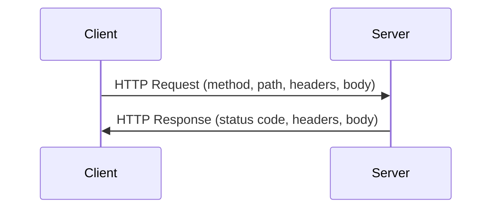
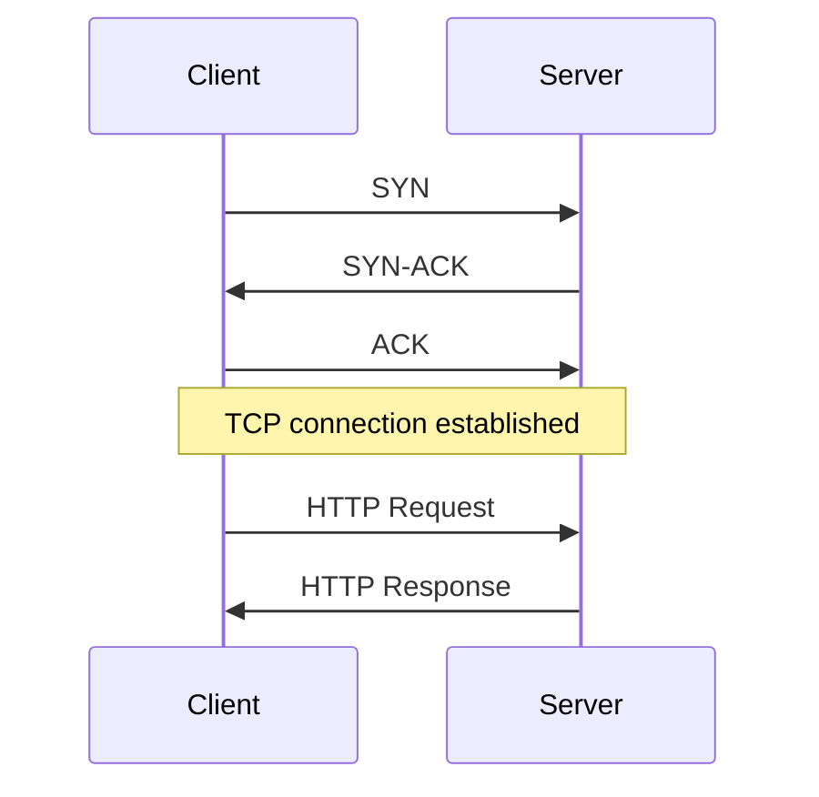
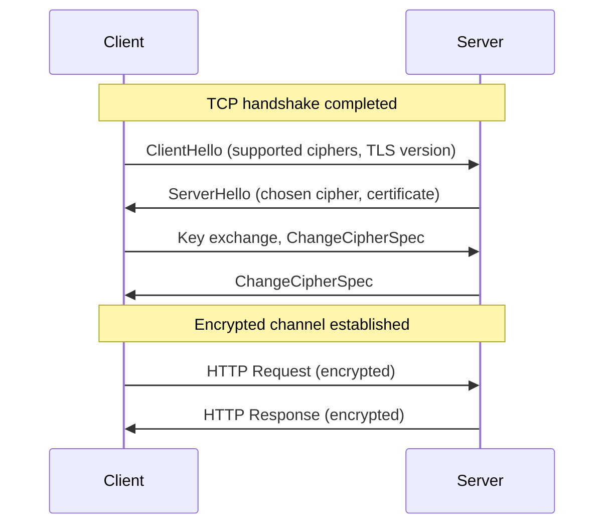
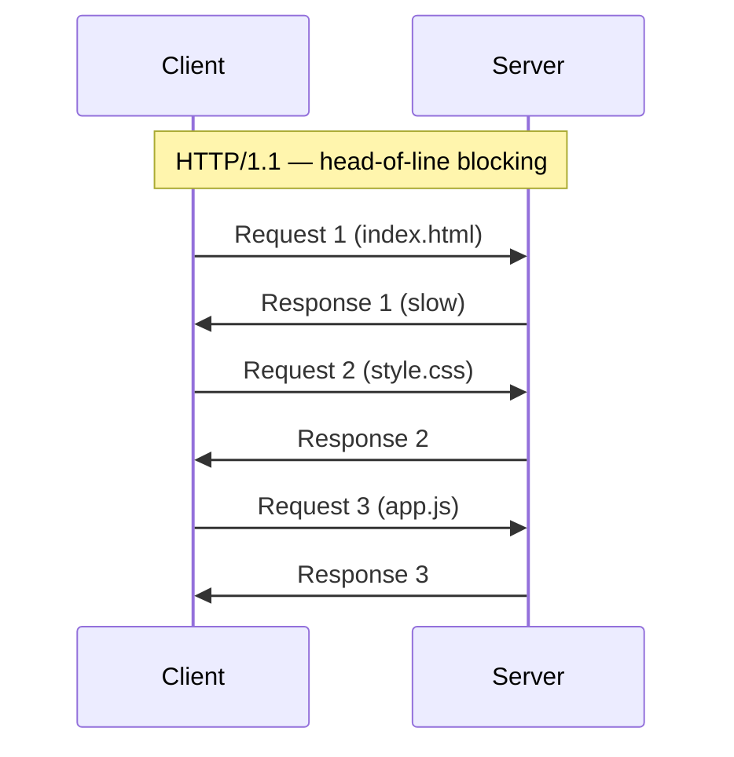
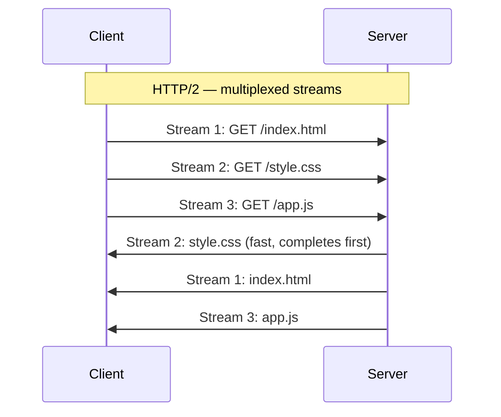
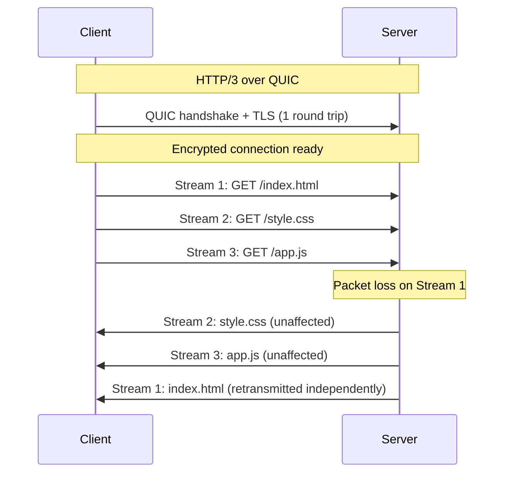
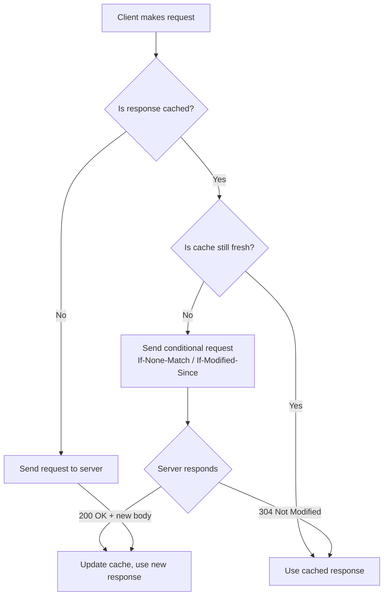
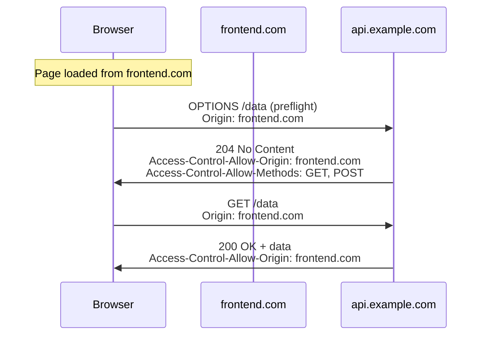
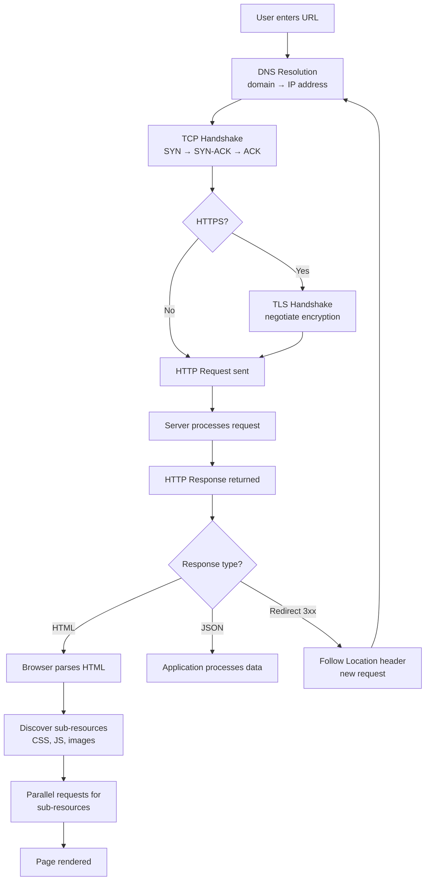

# How HTTP Works

HTTP (HyperText Transfer Protocol) is the application-layer protocol that powers communication on the web. It defines how clients (browsers, apps) and servers exchange messages.

## Core Concepts

### Request-Response Model

HTTP follows a simple pattern: the client sends a **request**, the server returns a **response**. Every interaction is one request matched to one response.



### Stateless Protocol

Each request is independent — the server does not remember previous requests. State is managed externally through cookies, tokens, or sessions.

---

## HTTP Request

A request consists of four parts:

### 1. Request Line

```
GET /api/users?page=2 HTTP/1.1
```

| Part | Description |
|------|-------------|
| **Method** | The action to perform (GET, POST, PUT, DELETE, PATCH, etc.) |
| **Path** | The resource being requested, including query parameters |
| **Version** | HTTP protocol version |

### 2. Headers

Key-value metadata about the request.

```
Host: api.example.com
Content-Type: application/json
Authorization: Bearer eyJhbGciOi...
Accept: application/json
```

### 3. Body (optional)

Data sent with the request, typically for POST/PUT/PATCH.

```json
{
  "name": "Alice",
  "email": "alice@example.com"
}
```

---

## HTTP Response

A response consists of three parts:

### 1. Status Line

```
HTTP/1.1 200 OK
```

### 2. Headers

```
Content-Type: application/json
Cache-Control: max-age=3600
Set-Cookie: session=abc123
```

### 3. Body

The actual content returned (HTML, JSON, binary data, etc.).

---

## HTTP Methods

| Method | Purpose | Idempotent | Has Body |
|--------|---------|------------|----------|
| **GET** | Retrieve a resource | Yes | No |
| **POST** | Create a resource | No | Yes |
| **PUT** | Replace a resource entirely | Yes | Yes |
| **PATCH** | Partially update a resource | No | Yes |
| **DELETE** | Remove a resource | Yes | Usually No |
| **HEAD** | Same as GET but no body returned | Yes | No |
| **OPTIONS** | Describe communication options (used in CORS preflight) | Yes | No |

**Idempotent** means making the same request multiple times produces the same result.

**Safe methods** (GET, HEAD, OPTIONS) do not modify server state.

---

## Status Codes

### Categories

| Range | Category | Meaning |
|-------|----------|---------|
| **1xx** | Informational | Request received, continuing |
| **2xx** | Success | Request succeeded |
| **3xx** | Redirection | Further action needed |
| **4xx** | Client Error | Problem with the request |
| **5xx** | Server Error | Server failed to fulfill valid request |

### Common Codes

| Code | Name | When Used |
|------|------|-----------|
| 200 | OK | Successful GET/PUT/PATCH |
| 201 | Created | Successful POST that created a resource |
| 204 | No Content | Successful DELETE, nothing to return |
| 301 | Moved Permanently | Resource URL changed permanently |
| 302 | Found | Temporary redirect |
| 304 | Not Modified | Cached version is still valid |
| 400 | Bad Request | Malformed or invalid request |
| 401 | Unauthorized | Authentication required |
| 403 | Forbidden | Authenticated but not authorized |
| 404 | Not Found | Resource does not exist |
| 405 | Method Not Allowed | HTTP method not supported for this resource |
| 409 | Conflict | Request conflicts with current state |
| 429 | Too Many Requests | Rate limit exceeded |
| 500 | Internal Server Error | Unhandled server failure |
| 502 | Bad Gateway | Upstream server returned invalid response |
| 503 | Service Unavailable | Server temporarily overloaded or in maintenance |
| 504 | Gateway Timeout | Upstream server did not respond in time |

---

## Connection Lifecycle

### TCP Handshake (underlying transport)

Before any HTTP data flows, the client and server establish a TCP connection.



### TLS Handshake (HTTPS)

For HTTPS, a TLS handshake happens after TCP and before HTTP. This negotiates encryption.



---

## HTTP Versions

### HTTP/1.0

- One request per TCP connection
- Connection closed after each response
- Extremely wasteful for pages with many resources

### HTTP/1.1

- **Persistent connections** — reuse the same TCP connection for multiple requests
- **Pipelining** — send multiple requests without waiting for responses (rarely used in practice)
- **Chunked transfer encoding** — stream responses in pieces
- **Host header** — enables virtual hosting (multiple domains on one IP)

**Problem:** Head-of-line blocking — the second request waits for the first response to complete.



### HTTP/2

- **Binary framing** — messages split into binary frames instead of text
- **Multiplexing** — multiple requests/responses in parallel over a single TCP connection
- **Stream prioritization** — clients can indicate which resources matter most
- **Header compression** (HPACK) — reduces overhead of repetitive headers
- **Server push** — server can proactively send resources the client will need



**Problem:** Still uses TCP — a single packet loss stalls all streams (TCP-level head-of-line blocking).

### HTTP/3

- Runs over **QUIC** (UDP-based) instead of TCP
- Eliminates TCP-level head-of-line blocking — packet loss on one stream doesn't affect others
- **Faster connection setup** — QUIC combines transport and TLS handshake into one round trip (1-RTT), or zero round trips for repeat connections (0-RTT)
- **Connection migration** — connections survive network changes (e.g., switching from Wi-Fi to cellular)



---

## Key Headers

### Request Headers

| Header | Purpose | Example |
|--------|---------|---------|
| `Host` | Target domain (required in HTTP/1.1) | `Host: api.example.com` |
| `Authorization` | Authentication credentials | `Authorization: Bearer token123` |
| `Content-Type` | Format of request body | `Content-Type: application/json` |
| `Accept` | Desired response format | `Accept: application/json` |
| `Cookie` | Session/state data | `Cookie: session=abc123` |
| `User-Agent` | Client software identifier | `User-Agent: Mozilla/5.0...` |
| `If-None-Match` | Conditional request (caching) | `If-None-Match: "etag123"` |

### Response Headers

| Header | Purpose | Example |
|--------|---------|---------|
| `Content-Type` | Format of response body | `Content-Type: text/html` |
| `Cache-Control` | Caching directives | `Cache-Control: max-age=3600` |
| `Set-Cookie` | Store data on client | `Set-Cookie: id=abc; HttpOnly` |
| `ETag` | Version identifier for caching | `ETag: "v1.2.3"` |
| `Location` | Redirect target | `Location: /new-path` |
| `Access-Control-Allow-Origin` | CORS permission | `Access-Control-Allow-Origin: *` |

---

## Caching

HTTP caching avoids redundant network requests.



### Cache-Control Directives

| Directive | Meaning |
|-----------|---------|
| `max-age=3600` | Cache is valid for 3600 seconds |
| `no-cache` | Must revalidate with server before using cache |
| `no-store` | Do not cache at all |
| `private` | Only the browser can cache (not CDNs/proxies) |
| `public` | Any cache can store this response |
| `immutable` | Content will never change (skip revalidation) |

---

## Cookies and State

Since HTTP is stateless, cookies provide a mechanism to maintain state across requests.

```mermaid
sequenceDiagram
    participant Browser
    participant Server

    Browser->>Server: POST /login (credentials)
    Server->>Browser: 200 OK + Set-Cookie: session=xyz; HttpOnly; Secure

    Browser->>Server: GET /dashboard + Cookie: session=xyz
    Server->>Browser: 200 OK (personalized content)
```

### Cookie Attributes

| Attribute | Purpose |
|-----------|---------|
| `HttpOnly` | Not accessible via JavaScript (prevents XSS theft) |
| `Secure` | Only sent over HTTPS |
| `SameSite=Strict` | Not sent with cross-site requests (CSRF protection) |
| `Max-Age` | Expiration time in seconds |
| `Domain` | Which domains receive the cookie |
| `Path` | Which paths receive the cookie |

---

## CORS (Cross-Origin Resource Sharing)

Browsers block requests from one origin to another by default. CORS headers allow servers to relax this restriction.



A **preflight** (OPTIONS request) is triggered when the actual request uses non-simple methods (PUT, DELETE, PATCH) or custom headers.

---

## Full Request Lifecycle

Putting it all together — what happens when you type a URL in a browser:



---

## Summary

| Concept | Key Takeaway |
|---------|-------------|
| **Model** | Request-response, always initiated by client |
| **Stateless** | Each request is independent; state via cookies/tokens |
| **Methods** | GET reads, POST creates, PUT replaces, PATCH updates, DELETE removes |
| **Status codes** | 2xx success, 3xx redirect, 4xx client error, 5xx server error |
| **HTTP/1.1** | Persistent connections, but head-of-line blocking |
| **HTTP/2** | Multiplexed streams over single TCP connection |
| **HTTP/3** | QUIC (UDP), eliminates TCP head-of-line blocking |
| **Caching** | Cache-Control + ETags reduce redundant requests |
| **Security** | HTTPS (TLS), HttpOnly cookies, CORS, SameSite |
