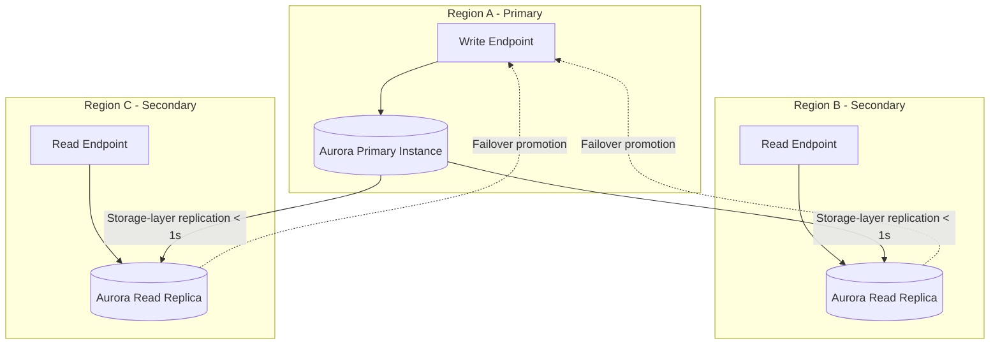
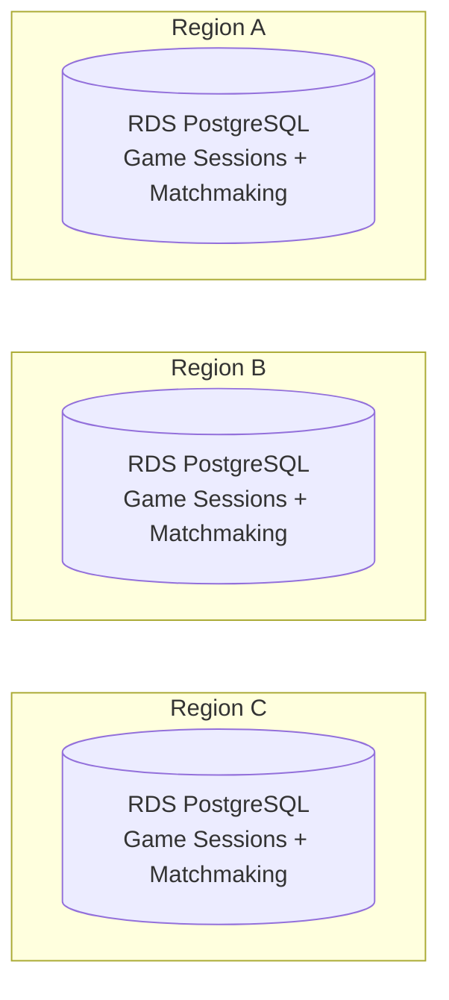

# Multi-Region Database Strategy

## Two-Tier Approach

### Tier 1: Aurora Global Database (global shared data only)

Used **only** for data that must be consistent across all regions: ledger, player accounts, session registry.

**What it is**: Aurora Global Database replicates at the storage layer (not logical replication). This means sub-second lag, no pub/sub setup, and AWS manages the replication entirely.

**Why chosen for ledger**: single write endpoint guarantees no double-spend. Read replicas in every region give fast local reads. Managed failover (~1 min) promotes a secondary when primary goes down.

### Tier 2: Standard RDS PostgreSQL (region-local data)

Used for everything else: game sessions, matchmaking, analytics, config.

**Completely independent per region.** No replication, no cross-region traffic. Standard RDS is cheaper, simpler, and sufficient for data that doesn't need to leave the region.

## Aurora Global Database vs Standard RDS — Comparison

| Aspect | Aurora Global Database | Standard RDS PostgreSQL |
|--------|----------------------|------------------------|
| **Cross-region replication** | Built-in, storage-layer, <1s lag | None (would need logical replication — manual setup) |
| **Write endpoint** | Single primary region | Independent per region (full R/W) |
| **Failover** | Managed cross-region promotion (~1 min) | Region-local failover only (Multi-AZ) |
| **Cost** | Higher — Aurora pricing + cross-region data transfer | Lower — standard RDS pricing |
| **Operational complexity** | Medium — AWS manages replication, but failover reconfigures write target | Low — each region is independent, nothing to coordinate |
| **Use when** | Data MUST be globally consistent | Data is region-scoped, no cross-region needs |

## Write Path for Global Data

Application-layer routing, not database-level:

1. Each region's ledger service knows its mode (`primary` or `replica`) via config
2. In `replica` mode → proxy writes to primary region's ledger service via gRPC
3. Primary region executes transaction against Aurora write endpoint
4. Application controls timeouts, retries, circuit breaking

## Connection Management

- **PgBouncer** in each region for connection pooling
- Primary region: PgBouncer → Aurora write endpoint
- Secondary regions: PgBouncer → Aurora read endpoint (local)
- Region-local services: PgBouncer → Standard RDS (local, full R/W)

## Failover Process

When the primary region fails:
1. Aurora Global DB promotes a secondary (~1 min, RPO ~1s)
2. Ledger services in promoted region switch to `primary` mode
3. Other regions update their gRPC proxy target to the new primary
4. This can be automated via config update or service discovery
