# Multi-Region iGaming Platform — Design Plan

> Requirements: [../requirements.md](../requirements.md)

## Overview

Scale a single-region iGaming platform to 3-5 AWS regions globally. Game sessions run locally per region for low latency. The ledger service requires strong consistency across all regions — this is the central design challenge.

Architecture modeled after industry patterns from PokerStars, DraftKings, Betfair, 888 Holdings, and Entain (see [Industry References](#13-industry-references)).

---

## 1. High-Level Architecture

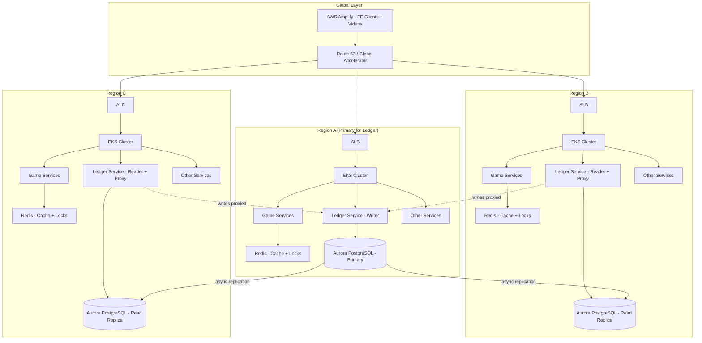

---

## 2. The Ledger Problem — Single-Writer with Read Replicas

This is the hardest part. Strong consistency with no double-spend means we cannot have multi-writer PostgreSQL across regions. The chosen approach: **single-writer primary with cross-region write proxying**.

### How It Works

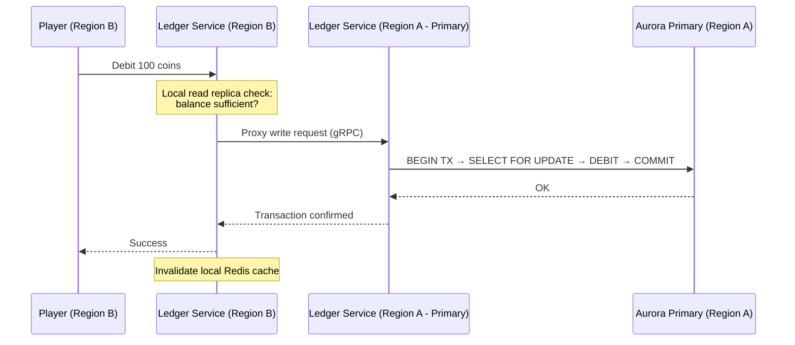

### Design Decisions

| Decision | Choice | Rationale |
|----------|--------|-----------|
| Write topology | Single-writer (Aurora Primary in one region) | Only way to guarantee no double-spend without distributed consensus overhead |
| Cross-region writes | Ledger service proxies writes to primary region via gRPC | Simpler than database-level routing; application controls retry/timeout logic |
| Read path | Local read replica + Redis cache | Fast reads for balance checks, game history |
| Write latency | ~50-150ms cross-region penalty | Acceptable — debits/credits are not latency-critical like game ticks |
| Failover | Aurora Global Database with managed failover | RPO ~1s, RTO ~1min; promoted replica becomes new primary |

### Why Not Multi-Writer?

- PostgreSQL does not natively support synchronous multi-region multi-writer
- Solutions like Citus or BDR add operational complexity and still have conflict resolution edge cases
- For financial data (ledger), conflict resolution = potential double-spend
- The single-writer penalty (~100ms cross-region) is acceptable for transaction operations

> Supporting doc: [../multi-region-database.md](../multi-region-database.md)

### Optimizing Ledger Write Latency

The naive approach (every game action → cross-region gRPC → primary DB) adds ~50-150ms per action. For a player doing rapid spins/hands, this is noticeable. Three strategies to reduce this, from simplest to most impactful:

#### Strategy 1: AWS Global Accelerator (network-level, ~20-30% improvement)

Replace Route 53 latency routing for the gRPC write path with **AWS Global Accelerator**. Instead of cross-region gRPC going over the public internet, traffic enters the AWS backbone at the nearest edge location and travels on Amazon's private network.

- Reduces cross-region latency by ~20-30% (e.g., 120ms → 80ms)
- No application changes — just a network path optimization
- Cost: Global Accelerator hourly fee + data transfer premium

#### Strategy 2: Session Balance (application-level, eliminates most cross-region writes)

The biggest win. Instead of hitting the primary ledger on every game action, **"check out" a session balance** when the game session starts:

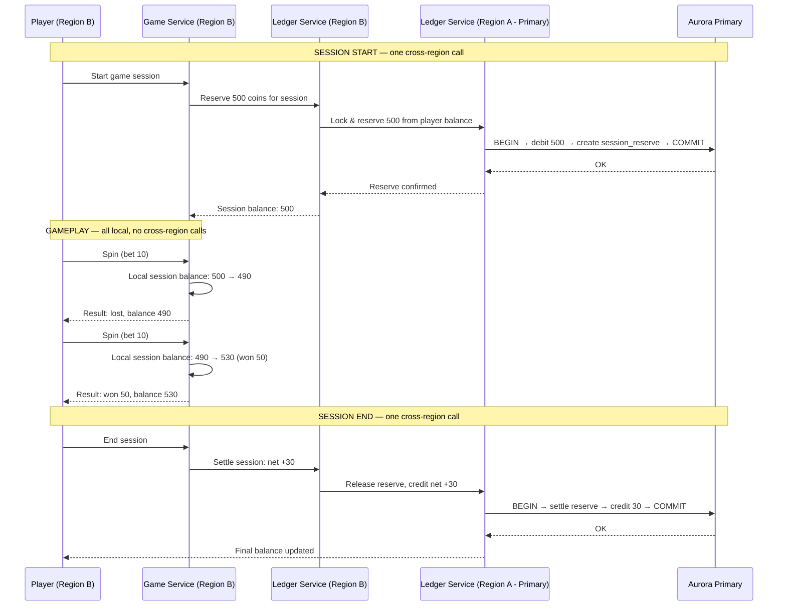

**How it works:**

| Phase | Where | Cross-region? | Latency |
|-------|-------|---------------|---------|
| Session start | Reserve N coins from global ledger | Yes — one call | ~100ms |
| Every game action | Debit/credit against local session balance | **No** — fully local | ~1-5ms |
| Session end | Settle net result back to global ledger | Yes — one call | ~100ms |
| Balance top-up | If session balance runs out, reserve more | Yes — occasional | ~100ms |

**Impact**: if a player does 100 spins per session, you go from **100 cross-region calls to 2** (start + end). That's a 98% reduction in cross-region ledger traffic.

**Strong consistency is preserved:**
- The global ledger debits the full reserve upfront — the money is "locked"
- No other session (even in another region) can spend those reserved coins
- The session balance is just a local accounting of already-reserved funds
- If the session crashes, the reserve times out and funds return to the global ledger

**This is how Betfair and most slot/casino platforms work** — they don't hit the ledger on every bet. They pre-authorize and settle.

#### Strategy 3: Player-Region Affinity (data-level, eliminates cross-region writes entirely)

If most players consistently play from one region, **shard the ledger by player home region**:

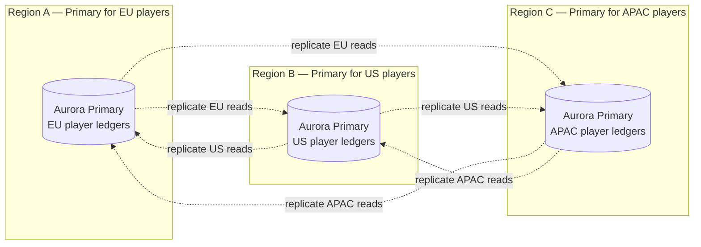

- Each player is assigned a "home region" based on where they usually play
- That player's ledger lives on the primary in their home region
- When playing from home region → **zero cross-region latency** for writes
- When traveling → falls back to cross-region proxy (rare case)

**Trade-offs:**
- More complex: multiple Aurora Global clusters, or partition-aware routing
- Player reassignment needed if they permanently move
- Cross-region reads needed for global leaderboards/reporting
- Best suited for large player bases with clear regional concentration

#### Recommended Combination

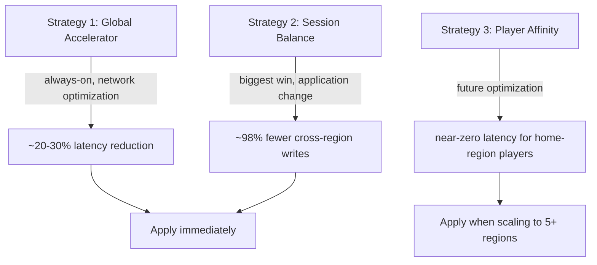

**Start with Strategy 1 + 2.** Global Accelerator is a quick infrastructure win. Session balance is the transformational change — it fundamentally changes the write pattern from "every action" to "start + end". Strategy 3 adds value later when you have enough players per region to justify the sharding complexity.

---

## 3. Service Classification

Not all services need the same multi-region treatment. Classify each service:

| Category | Behavior | Examples |
|----------|----------|----------|
| **Region-Local** | Runs independently per region, no cross-region data sharing | Game session service, matchmaking |
| **Global-Read, Local-Write-Proxy** | Reads from local replica, writes proxied to primary | Ledger, player account service |
| **Global-Shared** | Lightweight, can run independently with eventual consistency | Leaderboards, analytics, notifications |

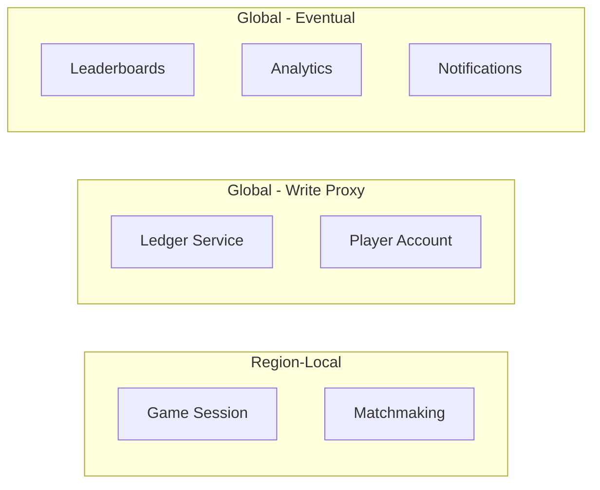

This classification drives deployment and data strategy per service — not everything needs the complexity of cross-region writes.

---

## 4. Per-Region Database Strategy

The critical insight: **only the ledger and player accounts need cross-region replication**. Everything else is region-local with its own independent database. This means two very different database strategies:

### What is Aurora Global Database?

Aurora Global Database is an AWS feature that replicates an Aurora PostgreSQL cluster across multiple AWS regions at the **storage layer** (not logical replication). It provides:
- Sub-second replication lag to secondary regions
- Read replicas in every secondary region
- Fast failover (~1 min) by promoting a secondary to primary
- A single write endpoint (primary region only)

**We use it ONLY for globally-shared data (ledger, player accounts).** Region-local services use plain standard RDS PostgreSQL — no Aurora Global, no cross-region replication, nothing fancy.

### Database Layout Per Region

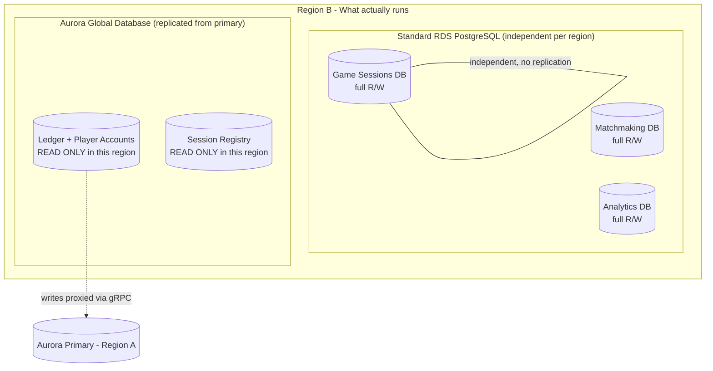

### Detailed Breakdown

| Database | Technology | Scope | Read | Write | Rationale |
|----------|-----------|-------|------|-------|-----------|
| **Ledger + Player Accounts** | Aurora Global DB | Global | Local replica | Proxy to primary | Strong consistency, no double-spend |
| **Session Registry** | Aurora Global DB | Global | Local replica | Region that owns session | Enables cross-region session redirect |
| **Game Sessions** | Standard RDS PostgreSQL | Region-local | Local | Local | Session data only matters locally |
| **Matchmaking** | Standard RDS PostgreSQL | Region-local | Local | Local | Players matched within their region |
| **Game Catalog / Config** | Standard RDS PostgreSQL | Region-local | Local | Seeded via CI/CD or config sync | Same data everywhere, deployed as part of release |
| **Analytics / Events** | Standard RDS PostgreSQL | Region-local | Local | Local, then streamed | Async-streamed to central data warehouse |

### Why This Split Matters Operationally

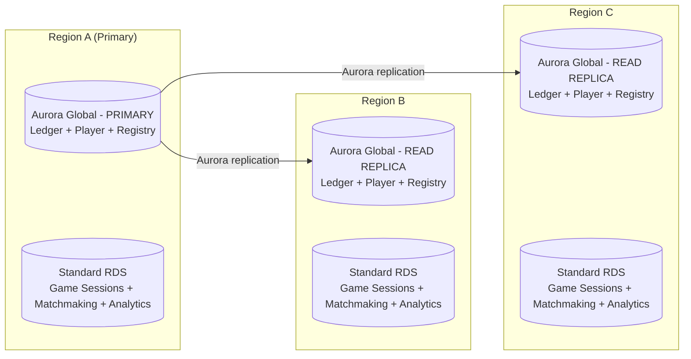

**Region-local RDS instances (game sessions, matchmaking, analytics):**
- Completely independent per region — no replication, no cross-region traffic
- Standard RDS PostgreSQL — cheaper, simpler to operate
- Each region manages its own backups, scaling, maintenance windows
- If Region B's local RDS goes down, only Region B's game sessions are affected

**Aurora Global cluster (ledger, player accounts):**
- Single primary in Region A, read replicas in B and C
- Only cluster that has cross-region replication
- Only cluster that needs the write-proxy pattern via gRPC
- Failover promotes a secondary → all ledger services reconfigure

### Key Benefit

Most of your services (game sessions, matchmaking, analytics, config) operate on **plain RDS PostgreSQL with zero cross-region complexity**. Aurora Global Database is an expensive, specialized tool — limit it to the one place that actually needs it.

---

## 5. Player Routing and Region Switching (VPN / Travel)

Players connect to the nearest region, but if they switch region mid-session (VPN, travel), they must be routed back to the region holding their active game session.

### Initial Connection

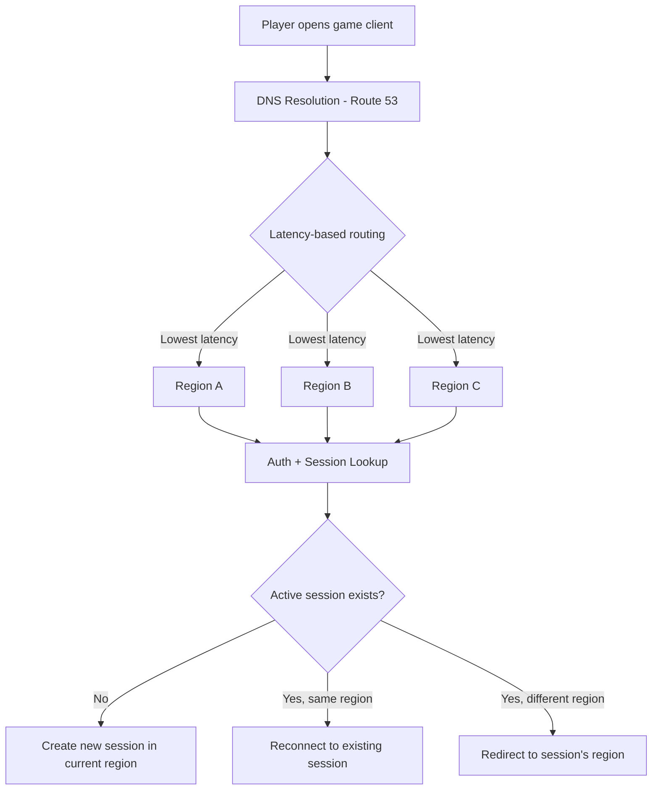

### How Region Switching Works

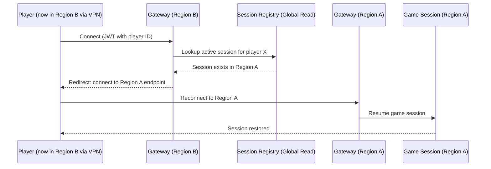

### Session Registry

A lightweight **session registry** tracks which region holds each player's active session:

| Field | Value |
|-------|-------|
| player_id | Global player identifier |
| session_id | Active game session ID |
| region | Region where the session lives (e.g., `eu-west-1`) |
| created_at | Session start time |
| ttl | Auto-expires when session ends |

- Stored in the **global Aurora database** (read replicas in every region for fast lookups)
- Written when a game session starts, deleted when it ends
- Every region can read it locally — only the region hosting the session writes it
- **Redirect, not proxy**: the client gets a region-specific endpoint and reconnects directly (avoids cross-region traffic for game data)

### Key Points

- **Route 53 latency-based routing** sends players to nearest region on first connect
- **Session registry lookup** on every connection — if active session exists elsewhere, redirect
- **JWT contains global player ID** — any region can authenticate the player
- **Client handles redirect**: receives a region-specific WebSocket/API endpoint and reconnects
- **Auth keys/secrets** synced across regions (AWS Secrets Manager with cross-region replication)
- **No active session?** Player stays in current region, new session created locally

---

## 6. Redis Strategy (Per-Region)

Redis runs inside each K8s cluster — it is NOT shared across regions.

| Use Case | Scope | TTL Strategy |
|----------|-------|-------------|
| Game session state | Region-local only | Short TTL, evict on session end |
| Ledger balance cache | Region-local, invalidate on write | Moderate TTL (~30s), invalidate on confirmed write |
| Distributed locks | Region-local only | Used for local concurrency (e.g., game state updates) |

**Important**: Redis is NOT used for cross-region locking. The ledger's strong consistency comes from PostgreSQL row-level locking on the primary, not from Redis.

---

## 7. Deployment Strategy

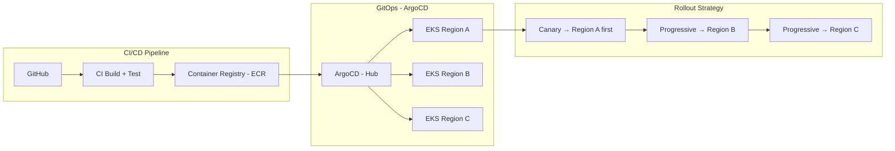

### Principles

- **Single container image** per service — same artifact deployed everywhere
- **Region-specific configuration** via ConfigMaps/Secrets (e.g., DB endpoints, primary/replica mode)
- **GitOps with ArgoCD**: cluster state defined in Git, ArgoCD syncs per-region clusters
- **Progressive rollout**: deploy to primary region first (canary), observe, then roll to other regions
- **Infrastructure as Code**: Terraform modules per region, shared module library

### Region Configuration

Each region's deployment knows its "role" via configuration:

```
# Region A config
LEDGER_MODE=primary
DB_ENDPOINT=aurora-primary.region-a.rds.amazonaws.com

# Region B config
LEDGER_MODE=replica
DB_READ_ENDPOINT=aurora-replica.region-b.rds.amazonaws.com
LEDGER_PRIMARY_GRPC=ledger.region-a.internal:443
```

---

## 8. Resilience and Failover

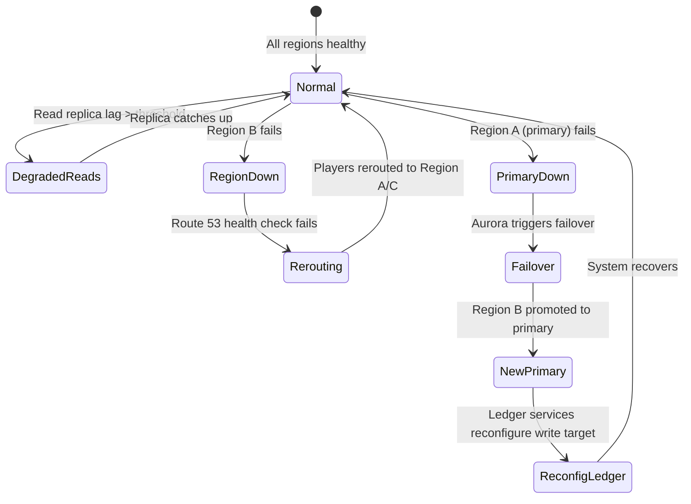

### Failure Scenarios

| Scenario | Impact | Recovery |
|----------|--------|----------|
| Non-primary region goes down | Players rerouted via DNS; no data loss | Automatic via Route 53 health checks |
| Primary region goes down | Ledger writes fail temporarily (~1 min) | Aurora Global DB promotes replica; ledger services detect new primary |
| Network partition between regions | Writes from isolated regions fail; local game sessions continue | Retry with backoff; players see "transaction pending" |
| Redis failure in a region | Cache miss → direct DB reads; locks unavailable | Redis restarts; game sessions may need reconnection |

### Health Checks

- **Route 53**: HTTP health checks on each region's ALB
- **K8s**: liveness/readiness probes per service
- **Ledger-specific**: write-path health check that verifies connectivity to primary DB
- **Alerting**: region-level dashboards + cross-region comparison alerts

---

## 9. Observability

| Layer | Tool | Scope |
|-------|------|-------|
| Metrics | Prometheus + Grafana (or CloudWatch) | Per-region + global aggregation |
| Logging | Centralized logging (CloudWatch Logs / ELK) | All regions → single view |
| Tracing | Distributed tracing (X-Ray / Jaeger) | Cross-region request traces (critical for ledger proxy path) |
| Alerting | PagerDuty / Opsgenie | Region-aware routing |

**Critical traces**: the ledger write-proxy path (Region B → Region A) must be traced end-to-end to monitor cross-region latency and detect degradation early.

---

## 10. Frontend and Media (AWS Amplify)

- Static JS clients and videos hosted on **AWS Amplify Hosting** (CloudFront CDN under the hood)
- Amplify handles CI/CD for frontend deployments — branch previews, automatic builds on push
- Client discovers backend via **single global domain** (e.g., `api.game.com`)
- Route 53 handles routing to nearest backend region — client doesn't need to know about regions
- Client uses **JWT** for auth — works against any region's auth service
- WebSocket connections for real-time game state are region-local

### Amplify Multi-Region Considerations

- Amplify Hosting is **globally distributed by default** (CloudFront edge) — no per-region frontend deployment needed
- Frontend is a single global deployment; the backend routing is what's region-aware
- Videos/media assets served from CloudFront edge caches — low latency everywhere
- **API endpoint configuration**: the frontend uses a single API domain, DNS handles the rest

---

## Summary of Trade-offs

| Trade-off | Decision | Cost | Benefit |
|-----------|----------|------|---------|
| Single-writer for ledger | Accept cross-region write latency (~100ms) | Slightly slower transactions from non-primary regions | Strong consistency, no double-spend, simpler operations |
| Redis per-region (not shared) | Accept cache inconsistency window | Stale cache for ~30s after cross-region write | Simple ops, no cross-region Redis complexity |
| Progressive rollout | Slower deploys | Full rollout takes longer | Catch issues before global impact |
| Aurora Global Database | AWS lock-in for PostgreSQL | Vendor dependency | Managed replication, fast failover, less ops burden |

---

## 11. Industry Comparison — How Others Solve This

Our design aligns with the dominant iGaming architecture pattern. Here's how major operators compare:

### Wallet/Ledger Strategy

| Operator | Database | Pattern | Scale |
|----------|----------|---------|-------|
| **PokerStars** | Amazon RDS (multi-region) | Single-writer per jurisdiction | 850K poker hands/hour, 140 countries |
| **DraftKings** | Amazon Aurora PostgreSQL | Single-writer + Kafka event streaming | Full AWS, .NET microservices on EKS |
| **Betfair** | Oracle → Kafka-centric event log | Single-writer + event sourcing | 160K-200K req/sec |
| **888 Holdings** | Hitachi VSP (block storage) | Active-active block replication across 3 DCs | 40K+ concurrent users per DC |
| **Entain** | SQL Server 2022 (on-prem) | Single-writer per jurisdiction | 2M transactions/minute peak |
| **Hard Rock Digital** | CockroachDB | Distributed SQL, row-level geo-partitioning | Single logical DB across 50 US states |
| **Our design** | Aurora Global Database | Single-writer + gRPC write proxy | Aligned with PokerStars/DraftKings pattern |

**Key industry insight**: single-writer per jurisdiction is the dominant pattern. The only exception is Hard Rock Digital using CockroachDB for distributed SQL — an emerging but more complex alternative. Our Aurora Global DB + gRPC proxy approach is validated by PokerStars and DraftKings doing essentially the same thing.

### Player Routing & Geolocation

All major operators use multi-layer geolocation verification:
- **IP geolocation** as first filter
- **GPS + Wi-Fi triangulation** for mobile
- **Device integrity verification** to detect VPNs and location spoofing
- Licensed providers: **GeoComply**, **Xpoint**, **Incognia**

PokerStars uses **AWS Cloud WAN** as their global network backbone with **AWS Network Firewall**. DraftKings uses **CloudFront + WAF** at the edge. Our Route 53 latency-based routing + session registry redirect aligns with these patterns.

### Infrastructure & Deployment

| Operator | Compute | IaC | CI/CD | Event Backbone |
|----------|---------|-----|-------|----------------|
| **PokerStars** | EKS (migrated from 33 physical DCs) | Terraform | Git-based pipelines | Amazon MSK (Managed Kafka) |
| **DraftKings** | EKS (.NET Core microservices) | Helm charts | CleanRoom isolated testing | Kafka |
| **Betfair** | Custom (actor-based Flywheel) | — | — | Apache Kafka (core backbone) |
| **Entain** | On-prem (Hyper-V) | Azure Arc | — | — |
| **Our design** | EKS | Terraform | ArgoCD GitOps | — (consider Kafka for event streaming) |

### Regulatory Deployment Tiers (AWS Reference Architecture)

The AWS Sports Betting Reference Architecture defines three tiers based on regulatory strictness:

| Tier | Description | Infrastructure |
|------|-------------|---------------|
| **Tier 1** — Cloud-Friendly | All components on AWS (some EU markets) | Standard EKS + RDS + MSK |
| **Tier 2** — Hybrid | Wallets/PAM must be in-jurisdiction (some US states) | AWS Local Zones or Outposts for regulated components |
| **Tier 3** — Strict | All core components on-prem (some Asian markets) | AWS only for analytics; Outposts or pure on-prem |

Our design currently targets Tier 1. If expanding to stricter jurisdictions, may need AWS Outposts or Local Zones for in-jurisdiction ledger deployment.

---

## 12. Multi-Region Cost Analysis

### Per-Service Pricing Breakdown

#### Cross-Region Data Transfer (the foundational cost driver)

| Route | Price per GB |
|-------|-------------|
| US East <-> EU (Ireland) | $0.02/GB |
| US East <-> Asia Pacific | $0.02-$0.09/GB |
| EU <-> Asia Pacific | $0.02-$0.09/GB |
| Same region, cross-AZ | $0.01/GB each direction |
| Same AZ | Free |

#### Aurora Global Database (ledger + player accounts only)

| Component | Price |
|-----------|-------|
| Instance (db.r6g.xlarge) | ~$0.52/hr (~$380/mo) |
| Instance (db.r6g.large, for replicas) | ~$0.26/hr (~$190/mo) |
| Storage | $0.10/GB-month (per region) |
| Replicated write I/Os | $0.20 per million (per secondary region) |

**3-region Aurora Global example** (xlarge primary, large replicas, 100GB storage):

| Item | Monthly |
|------|---------|
| Primary instance (Region A) | ~$380 |
| Secondary instance (Region B) | ~$190 |
| Secondary instance (Region C) | ~$190 |
| Storage: 100GB x 3 regions x $0.10 | $30 |
| Replicated write I/Os: 50M x 2 regions | $20 |
| Cross-region transfer | ~$20-50 |
| **Subtotal** | **~$830-$860/mo** |

#### Standard RDS PostgreSQL (region-local services)

| Instance | On-Demand/hr | Monthly |
|----------|-------------|---------|
| db.r6g.large (2 vCPU, 16GB) | ~$0.24/hr | ~$175/mo |
| db.r6g.xlarge (4 vCPU, 32GB) | ~$0.48/hr | ~$350/mo |

Per region: 2-3 RDS instances for game sessions, matchmaking, analytics = ~$525-$1,050/region.

#### EKS

| Component | Price |
|-----------|-------|
| Control plane (Standard) | $0.10/hr per cluster (~$73/mo) |
| Control plane (Extended Support) | $0.60/hr per cluster (~$438/mo) |
| Worker nodes | Standard EC2 pricing |

#### NAT Gateways (often the hidden cost surprise)

| Component | Price |
|-----------|-------|
| Hourly | $0.045/hr per NAT GW (~$33/mo) |
| Data processing | $0.045/GB through the gateway |
| Public IPv4 | $0.005/hr per EIP (~$3.60/mo) |

With 3 AZs x 3 regions = **9 NAT Gateways = ~$410/month** before data processing.

#### Other Services

| Service | Monthly Cost |
|---------|-------------|
| Route 53 (latency routing, 10M queries) | ~$10 |
| Global Accelerator | ~$20 |
| CloudFront / Amplify (Business plan) | ~$200 |
| ECR (3 regions, 20GB images) | ~$7 |
| Secrets Manager / KMS | ~$50-100 |
| Public IPv4 addresses (~20) | ~$72 |

### Total Estimated Monthly Cost (3 Regions)

| Category | On-Demand | With Optimization |
|----------|-----------|-------------------|
| EKS control planes (3 clusters) | $219 | $219 |
| EKS worker nodes (6x m6g.xlarge/region) | ~$8,100 | ~$4,050 (Savings Plans) |
| Aurora Global DB (ledger, 3 regions) | ~$860 | ~$500 (Reserved Instances) |
| Standard RDS (local DBs, 3 regions) | ~$2,100 | ~$1,250 (Reserved) |
| NAT Gateways (9 total) | ~$410 | ~$300 (VPC Endpoints reduce processing) |
| ALBs (3 regions) | ~$225 | ~$225 |
| Route 53 + Global Accelerator | ~$30 | ~$30 |
| CloudFront / Amplify | ~$200 | ~$200 |
| ECR + cross-region transfer | ~$50-200 | ~$30-100 |
| Observability (CloudWatch/Grafana) | ~$200-500 | ~$200-300 |
| Secrets, KMS, IPv4 | ~$125-175 | ~$125-175 |
| **Total** | **~$12,500-$13,200/mo** | **~$7,200-$7,600/mo** |
| **Annual** | **~$150K-$158K** | **~$86K-$91K** |

**Multiplier from single-region to 3-region**: roughly **2.5-3x** (not 3x, because some costs are shared: CloudFront, Route 53, ECR, Global Accelerator).

### Hidden Cost Pitfalls

| Pitfall | Why It Hurts | Estimated Hidden Cost |
|---------|-------------|----------------------|
| **NAT Gateway data processing** | $0.045/GB ON TOP of transfer charges; often 2x what teams expect | Can be 30-50% of data transfer bill |
| **Cross-AZ traffic** | Every ALB health check, DB sync, pod-to-pod call crossing AZs = $0.01/GB each way | $100-500/mo easily missed |
| **Public IPv4 addresses** | $3.60/mo each; EKS + ALBs + NAT GWs across 3 regions = 20+ IPs | $72+/mo |
| **CloudWatch Logs centralization** | Shipping logs cross-region for unified view = $0.02/GB | 100GB logs/day = $60/mo |
| **Aurora I/O charges** | Standard Aurora charges per I/O; high-write workloads can exceed instance costs | Switch to I/O-Optimized if I/O > 25% of DB bill |
| **Secrets Manager replication** | $0.40/secret/month, multiplied by regions | Adds up with many microservices |
| **Terraform/CI overhead** | More regions = more TF runs, longer pipelines, more build minutes | CI costs can 3x |

### Cost Optimization Strategies

#### 1. Network — Reduce Data Transfer

| Strategy | Price | When to Use |
|----------|-------|-------------|
| **VPC Peering** (cross-region) | Free hourly; $0.02-$0.05/GB transfer | 2-3 regions, point-to-point |
| **Transit Gateway** | $0.05/hr per attachment + $0.02/GB | 4+ VPCs, hub-and-spoke |
| **VPC Gateway Endpoints** (S3, DynamoDB) | **Free** | Always — eliminates NAT GW charges for S3/DynamoDB |
| **VPC Interface Endpoints** (ECR, CloudWatch, KMS) | $0.01/hr/AZ + $0.01/GB | Replaces NAT GW for AWS API traffic |
| **Session balance pattern** | Application change | **Biggest network win** — 98% fewer cross-region ledger writes |

**Recommendation**: Use VPC Peering for 3 regions (3 connections). Use Gateway Endpoints for S3/DynamoDB (free). Use Interface Endpoints for ECR pulls to avoid NAT processing charges.

#### 2. Compute — Reduce EKS Worker Costs

| Strategy | Savings | Use For |
|----------|---------|---------|
| **Compute Savings Plans (1yr)** | Up to 66% | Applies across ALL regions, instance families, even Fargate |
| **Spot Instances** | 60-90% off On-Demand | Analytics, leaderboards, batch, CI runners |
| **Spot + On-Demand mix** | 40-60% overall | Ledger/game on On-Demand; analytics/batch on Spot |
| **Karpenter (EKS autoscaler)** | 20-40% | Right-sizes and diversifies Spot automatically |

**Recommendation**: Compute Savings Plans for baseline + Spot for non-critical workloads. Target **40-50% overall compute savings**.

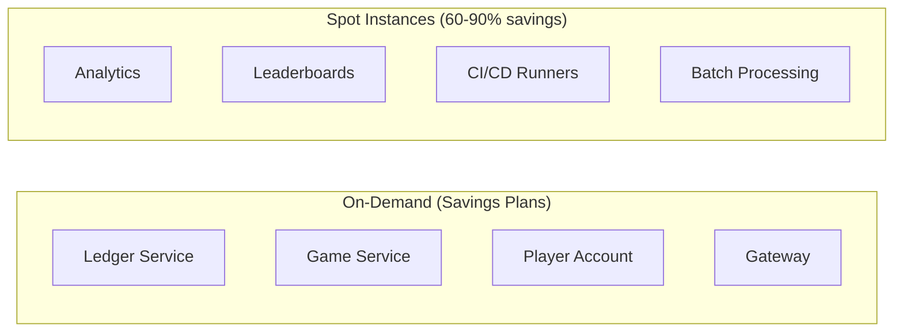

#### 3. Database — Right-Size and Reserve

| Strategy | Savings |
|----------|---------|
| **Reserved Instances (1yr All Upfront)** | ~42% off On-Demand |
| **Reserved Instances (3yr All Upfront)** | ~60% off On-Demand |
| **Aurora I/O-Optimized** | Switch if I/O charges > 25% of Aurora bill |
| **Right-size with Performance Insights** | 10-30% by downsizing over-provisioned instances |
| **Read replicas instead of scaling primary** | $0 additional replication within region |

#### 4. Summary: Where the Money Goes

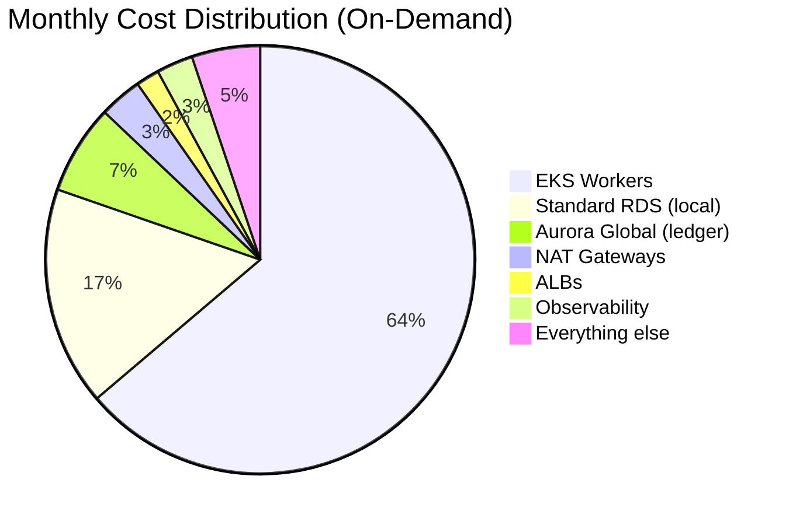

**Compute (EKS workers) is 60-65% of total cost** — this is where optimization has the biggest dollar impact. Data transfer, while per-GB expensive, is a small portion thanks to the session balance pattern.

---

## 13. Hotspots for Further Design

- **Ledger conflict handling**: what happens when a player rapidly switches regions mid-transaction?
- **Event streaming**: consider adding Kafka/MSK as event backbone (industry standard for iGaming — used by PokerStars, DraftKings, Betfair)
- **Geolocation compliance**: multi-layer verification (IP + GPS + device integrity) if operating in regulated jurisdictions
- **Regional compliance**: if expanding to Tier 2/3 jurisdictions, may need per-region ledger partitioning or AWS Outposts
- **Database connection pooling**: cross-region gRPC vs PgBouncer topology

---

## 14. Industry References

### Conference Talks

| Talk | Speaker | Venue | Link |
|------|---------|-------|------|
| Rebuilding the Busiest Trading Exchange to Scale 10X | Manjunath Shivakumar | Kafka Summit London 2019 | [Slides](https://www.slideshare.net/slideshow/rebuilding-the-busiest-trading-exchange-in-the-world-to-scale-10x-manjunath-shivakumar-paddypowerbetfair-kafka-summit-london-2019/147007205) / [Video](https://videos.confluent.io/watch/6Tah4C8FNaW8qZg1qwVB7s) |
| Financial Transaction Exchange at BetFair.com | Matt Youill | QCon 2008 | [InfoQ Presentation](https://www.infoq.com/presentations/matt-youill-betfair-flywheel-tradefair/) |
| Betfair Flywheel | Betfair | HPTS Workshop 2007 | [PDF Paper](http://hpts.ws/papers/2007/HPTS%20Workshop%20-%20Betfair%20-%20Flywheel.pdf) |
| Microservices Murder Mystery with Circuit Breakers | DraftKings | Datadog Dash 2018 | [Video](https://www.datadoghq.com/videos/how-draftkings-solves-the-microservices-murder-mystery-with-circuit-breakers/) |

### AWS Case Studies & Reference Architectures

| Resource | Focus | Link |
|----------|-------|------|
| PokerStars Case Study | Multi-region migration, Cloud WAN, EKS, MSK | [aws.amazon.com](https://aws.amazon.com/solutions/case-studies/pokerstars-case-study/) |
| Sports Betting Reference Architecture | 3-tier deployment model, DB choices, regulatory compliance | [Docs](https://docs.aws.amazon.com/architecture-diagrams/latest/sports-betting-architecture/sports-betting-architecture.html) / [PDF](https://docs.aws.amazon.com/pdfs/architecture-diagrams/latest/sports-betting-architecture/sports-betting-architecture.pdf) |
| Event-Driven Sportsbook Guidance | Event-driven architecture for sportsbooks | [aws.amazon.com](https://aws.amazon.com/solutions/guidance/building-an-event-driven-sportsbook-on-aws/) |
| Building Geolocation Verification for iGaming | Geolocation compliance architecture | [AWS Blog](https://aws.amazon.com/blogs/gametech/building-geolocation-verification-for-igaming-and-sports-betting-on-aws/) |
| Designing Compliant Betting Applications | PCI DSS, security, multi-account | [AWS Blog](https://aws.amazon.com/blogs/gametech/designing-compliant-and-secure-betting-and-gaming-applications-on-aws/) |

### Engineering Blogs

| Resource | Focus | Link |
|----------|-------|------|
| DraftKings Engineering | .NET microservices, Kubernetes, circuit breakers | [Medium](https://medium.com/draftkings-engineering) |
| Migrate Hundreds of Microservices (Part 1) | Cloud migration strategy | [Medium](https://medium.com/draftkings-engineering/migrate-hundreds-of-microservices-to-the-cloud-with-zero-downtime-part-1-781a4b8a21e1) |
| Migrate Hundreds of Microservices (Part 2) | Cloud migration continued | [Medium](https://medium.com/draftkings-engineering/migrate-hundreds-of-microservices-to-the-cloud-with-zero-downtime-part-2-b15ad75a0729) |
| Migrate Hundreds of Microservices (Part 3) | Cloud migration final | [Medium](https://medium.com/draftkings-engineering/migrate-hundreds-of-microservices-to-the-cloud-with-zero-downtime-part-3-075197dea5fb) |
| Entain Azure Arc Case Study | SQL Server on-prem, hybrid management, data sovereignty | [Microsoft](https://www.microsoft.com/en/customers/story/20487-entain-azure-arc) |
| 888 Holdings Hitachi Case Study | Active-active storage replication, 3-DC architecture | [Hitachi](https://www.hitachivantara.com/en-us/company/customer-stories/888-holdings-case-study.html) |

### Vendor Reference Architectures

| Resource | Focus | Link |
|----------|-------|------|
| Real Money Gaming Reference Architecture | Distributed SQL, geo-partitioning, Wire Act compliance | [CockroachDB](https://www.cockroachlabs.com/blog/real-money-gaming-reference-architecture/) |
| Gambling Application Architecture | Data residency, horizontal scaling | [CockroachDB](https://www.cockroachlabs.com/blog/gambling-application-architecture/) |
| Hard Rock Digital + CockroachDB | Single logical DB across 50 US states, AWS Outposts | [Blog](https://www.cockroachlabs.com/blog/roachfest23-hard-rock-digital/) / [Customer](https://www.cockroachlabs.com/customers/hard-rock-digital/) |
| LMAX Architecture | Disruptor pattern, single-threaded sequencing | [Martin Fowler](https://martinfowler.com/articles/lmax.html) |
