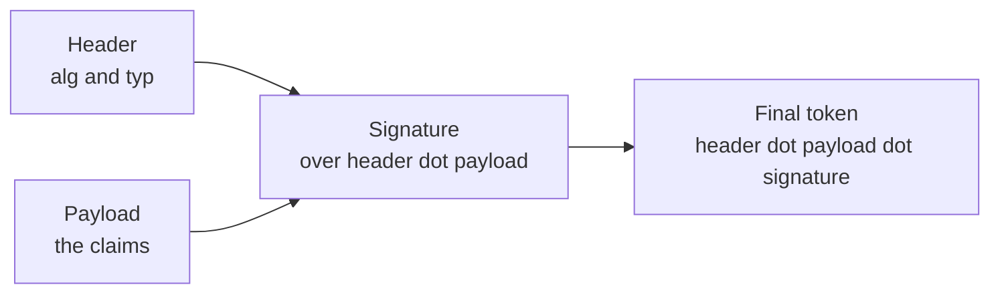
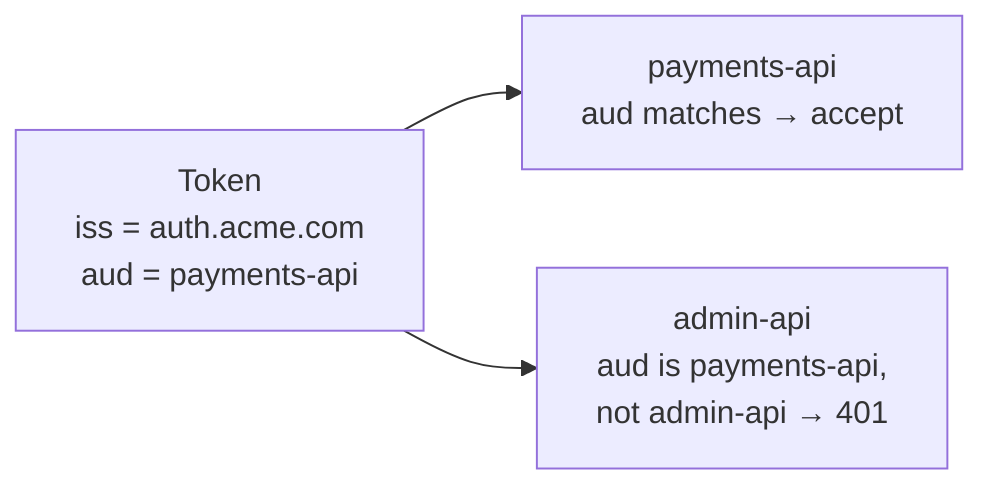
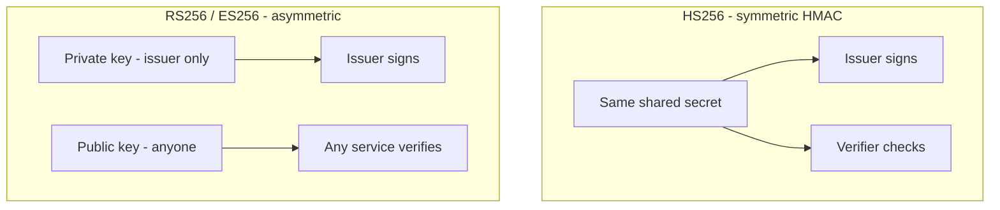
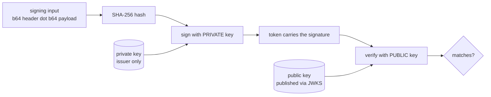
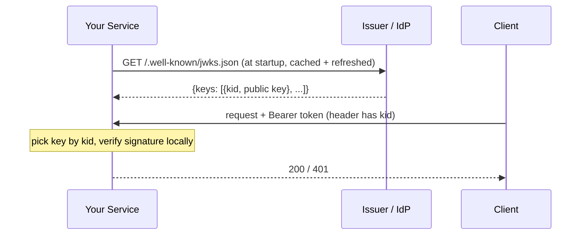
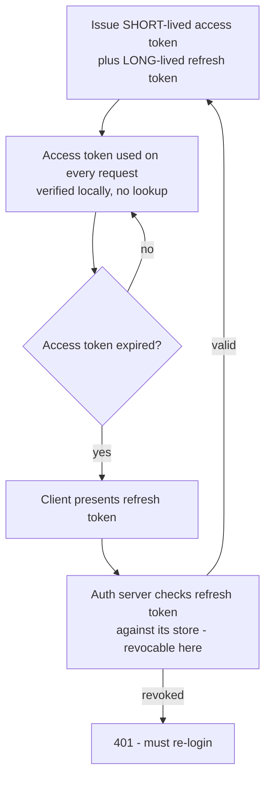
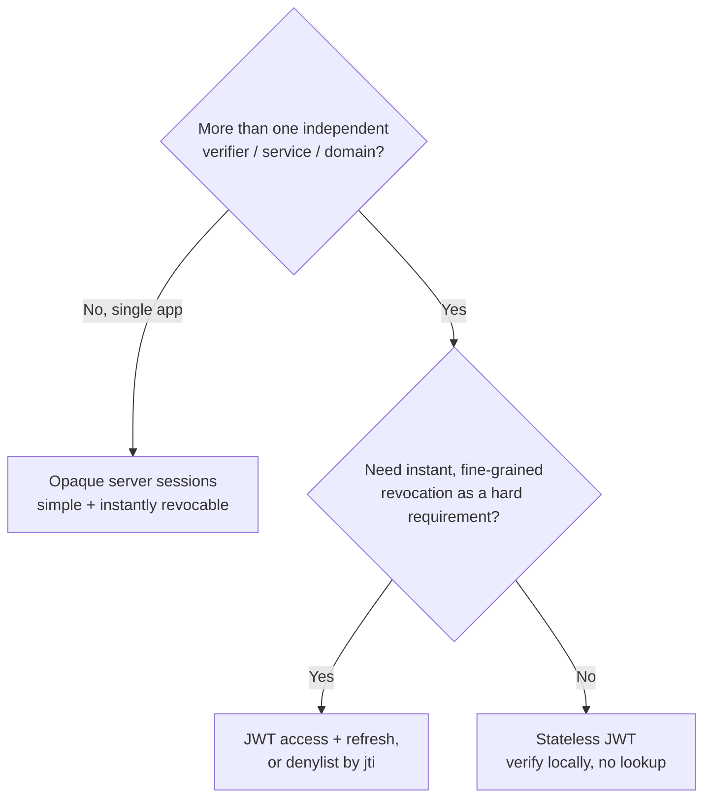

# JWT — A Deep but Friendly Guide

> Standalone reference. Covers the problem JWTs solve, how a token is
> built from first principles, a worked example you can decode by hand,
> the signing algorithms, the claims, how verification works (including
> JWKS), the access/refresh token pattern, the revocation problem that
> trips everyone up, the security footguns, and when you should *not*
> reach for a JWT. It also covers how a token is bound to one service
> (§4), what JWTs are used for beyond login (§14), where JWT sits in the
> auth protocol family (§15), and the **build-vs-buy** identity decision
> (§16), so it stands on its own.

## 1. The problem in one sentence

> "Service A authenticated the user. Now request after request hits
> services B, C and D. How do they trust *this* request is still that
> same authenticated user — **without calling back to a central session
> store every single time**?"

That's the whole motivation. JWT is one answer: instead of storing a
session server-side and looking it up on every request, you hand the
client a **self-contained, tamper-evident token** that any service can
verify *locally* using a shared secret or a public key.

The "self-contained" part is the superpower and the curse, as we'll see.

## 2. Why the obvious approach (server sessions) creaks at scale

The classic approach is the **opaque session**:

```text
1. User logs in.
2. Server creates a random session ID, stores {sid -> userID, expiry, roles} in a DB/Redis.
3. Server sends the opaque sid back as a cookie.
4. Every later request: server looks up sid in the store to learn who the user is.
```

This works great and has one *enormous* advantage we'll come back to:
**you can delete the row to instantly revoke a session.**

Where it creaks:

- **Every request needs a store lookup.** With many stateless services
  behind a gateway, that's a hot dependency on a central session store.
- **Shared state across services / regions.** Service D in another
  region needs to reach the same session store (or a replica) to know
  who you are.
- **Horizontal scaling friction.** Statelessness is the goal; a
  per-request central lookup is the opposite of stateless.

The JWT trade is: **move the identity data into the token itself**, sign
it so nobody can forge it, and let each service verify it with no
network call. You trade *easy revocation* for *no lookup*.

## 3. Anatomy of a JWT

A JWT is three Base64URL-encoded parts joined by dots:

```text
header  .  payload  .  signature
xxxxx   .  yyyyy    .  zzzzz
```



**Important:** Base64URL is *encoding*, not *encryption*. The header and
payload are **readable by anyone** who has the token. A signed JWT (the
common case, technically a **JWS**) protects against *tampering*, not
against *reading*. If you need the contents hidden, you need **JWE**
(encrypted) — see §7.

### 3.1 Header

```json
{
  "alg": "RS256",
  "typ": "JWT",
  "kid": "2024-key-01"
}
```

- `alg` — the signing algorithm (see §6).
- `typ` — token type, usually `JWT`.
- `kid` — *key ID*; tells the verifier which key signed this, so the
  issuer can rotate keys and publish several at once (see §8, JWKS).

### 3.2 Payload (claims)

```json
{
  "iss": "https://auth.acme.com",
  "sub": "user_8f3a1c",
  "aud": "https://api.acme.com",
  "exp": 1735689600,
  "iat": 1735686000,
  "nbf": 1735686000,
  "jti": "a1b2c3d4",
  "roles": ["editor"],
  "tenant": "acme-eu"
}
```

The **registered claims** (standardized, three letters) are the load-bearing ones:

| Claim | Meaning | Why it matters |
|-------|---------|----------------|
| `iss` | Issuer | Verify the token came from the IdP you trust |
| `sub` | Subject | *Who* the token is about (the user/workload ID) |
| `aud` | Audience | *Who* the token is for — reject tokens minted for another service (§4) |
| `exp` | Expiry (unix seconds) | Hard stop; the #1 defense against stolen tokens |
| `iat` | Issued-at | Token age, useful for "max session age" policies |
| `nbf` | Not-before | Token isn't valid yet (clock-skew / scheduled tokens) |
| `jti` | JWT ID | Unique ID — needed for denylist-based revocation (§10) |

Everything else (`roles`, `tenant`, …) are **custom claims**. Keep them
small — the token travels on *every* request header.

### 3.3 Signature

```text
signature = Sign(
    base64url(header) || "." || base64url(payload),
    key
)
```

The signature covers the header **and** the payload. Change a single
byte of either and the signature no longer verifies. That's the whole
integrity guarantee.

## 4. Scoping a token to one service — `aud` and `iss`

🧠 **Mental picture:** a JWT is a **bearer credential** — whoever holds
it can use it. So a token your auth server minted for the *payments* API
must not be usable against the *admin* API. Two registered claims pin
this down:

- **`aud` (audience)** — *who the token is for.* Each service is
  configured with its own identifier and **rejects any token whose `aud`
  is not itself.** A token with `aud: payments-api` is dead on arrival at
  `admin-api`.
- **`iss` (issuer)** — *who minted it.* A service trusts tokens only from
  issuers it knows (and whose verification keys it has via JWKS, §8).

Validated together on every request, they answer: *"was this token
minted by an issuer I trust, **for me specifically**?"* Only if both hold
does the service trust the rest of the claims.



**Why it matters — the cross-service replay / confused-deputy bug.**
Skip `aud` validation and any token the user holds for a low-privilege
service can be replayed against a high-privilege one — the second service
becomes a "confused deputy," honoring a credential it was never the
intended recipient of. This is exactly the footgun in §9, and the
`WithAudience` / `WithIssuer` checks in the verify code (§8) are how you
close it.

**Practical notes — this is least privilege applied to tokens:**

`aud` and `scope`/`roles` are how the **principle of least privilege**
shows up in JWT design: a token should grant *only* the access its holder
actually needs, *only* where it's needed, for *only* as long as needed.
Concretely:

- **Scope `where` (`aud`).** `aud` may be a single value *or* a list. A
  token deliberately usable by several services lists them all; keep that
  list as narrow as possible. Prefer **one token per audience** over one
  all-powerful token — a leaked narrow token has a small blast radius.
- **Scope `what` (`scope` / `roles`).** The issuer also bounds what the
  token can *do* via `scope` / `roles` claims (§14) — `aud` scopes *where*
  it can be used, these scope *what*. Mint read-only tokens for read-only
  callers; don't hand out an `admin` role "just in case."
- **Scope `how long` (`exp`).** Short lifetimes (§10) cap the damage when
  a token leaks despite the above.

A token that is narrow in all three dimensions is the least-privilege
ideal: even fully compromised, it can do little, in few places, briefly.

## 5. Worked example — verify a token by hand

Say we get this token (shortened):

```text
eyJhbGciOiJIUzI1NiIsInR5cCI6IkpXVCJ9      <- header
.eyJzdWIiOiJ1c2VyXzEiLCJleHAiOjE3MzU2ODk2MDB9   <- payload
.3Hk9...sig...                                  <- signature
```

To verify (HMAC / `HS256` case, shared secret):

```text
1. Split on '.' into [h, p, s].
2. Base64URL-decode h  -> {"alg":"HS256","typ":"JWT"}   (pick algorithm)
3. Recompute:  expected = HMAC_SHA256(h || "." || p, secret)
4. Compare base64url(expected) with s in CONSTANT TIME.
   - mismatch -> reject (forged / tampered).
5. Base64URL-decode p -> claims.
6. Check exp > now, nbf <= now, iss == trusted, aud == this service.
   - any fail -> reject.
7. Only now: trust claims.sub / claims.roles.
```

Step 4's algorithm choice **must be pinned by the server**, not taken
from the token's own `alg` field blindly — that's the source of two
classic attacks (§9). Step 6's `iss`/`aud` checks are the service-scoping
from §4.

## 6. Signing algorithms — symmetric vs asymmetric



| Family | Examples | Key model | Use when |
|--------|----------|-----------|----------|
| **HMAC** | HS256, HS384, HS512 | One **shared secret** signs *and* verifies | Single trust domain; *you* issue and *you* verify (e.g. one monolith). Simple, fast. |
| **RSA** | RS256, RS384, RS512 | **Private** key signs, **public** key verifies | Many independent verifiers; third parties verify without being able to mint tokens. The IdP standard. |
| **ECDSA** | ES256, ES384 | Same split as RSA, smaller keys/sigs | Same as RSA but you want smaller tokens / faster verify. |
| **EdDSA** | Ed25519 | Modern elliptic-curve | New systems; great speed + safety defaults. |

**Rule of thumb:** the moment *more than one party* needs to verify
tokens — i.e. real microservices, or an external IdP like Auth0/Keycloak
— use **asymmetric** (RS256/ES256). Then verifiers only ever hold the
**public** key; a leaked verifier can't forge tokens. With HS256, every
verifier holds the secret, so every verifier can also *mint* tokens.

### How it actually works — the mechanism

Signing never operates on the whole token directly; it operates on a
**hash** of `base64url(header) || "." || base64url(payload)`:

- **HMAC (HS256).** `signature = HMAC_SHA256(signing_input, secret)`.
  HMAC is keyed hashing — the *same* secret both produces and checks the
  tag. Verify = recompute the HMAC and constant-time-compare (exactly the
  §5 worked example). Fast, but the secret is a *symmetric* capability:
  anyone who can verify can also forge.
- **RSA / ECDSA / EdDSA (RS256 / ES256 / EdDSA).** The issuer generates a
  **keypair** once. It signs the hash with the **private** key (a math
  operation only the private key can perform); verifiers run the matching
  **public-key** verify over `(signing_input, signature)`. The public key
  reveals nothing that lets you forge — so it's safe to hand to everyone.



The open question that raises: *how does each verifier get the issuer's
public key, and what happens when the issuer rotates it?* That is exactly
what **JWKS** solves — see §8.

## 7. JWS vs JWE — signed vs encrypted

| | **JWS** (signed) | **JWE** (encrypted) |
|---|---|---|
| Protects | Integrity (tamper-evident) | Confidentiality + integrity |
| Payload readable? | **Yes** — anyone can decode it | No — only holder of the key |
| Common? | The default "JWT" everyone means | Rare; used when claims are sensitive |

99% of the time "JWT" means **JWS**. Treat the payload as **public**:
never put passwords, full PII, or secrets in a signed JWT.

## 8. Verification at scale — JWKS

**Yes — this is the direct continuation of the asymmetric signing in
§6.** Asymmetric signing only works if every verifier has the issuer's
*public* key. JWKS is the distribution mechanism for exactly that: the
public half of the §6 keypair, published so anyone can fetch it and
verify locally. (HMAC/§6 has no public half to distribute, so HS256
setups don't use JWKS.)

When an external/identity provider issues tokens, verifiers must not
hard-code the public key (keys rotate). Instead the issuer publishes a
**JWKS** (JSON Web Key Set) at a well-known URL:

```text
https://auth.acme.com/.well-known/jwks.json
```



The verifier:
1. Reads `kid` from the token header.
2. Picks the matching public key from the cached JWKS.
3. Verifies locally — **no per-request call to the IdP**.

This is what makes key **rotation** painless: the issuer publishes the
new key alongside the old one, signs new tokens with the new `kid`, and
verifiers transparently pick the right key.

### Go verification (the common "verify, don't issue" pattern)

```go
import (
    "github.com/golang-jwt/jwt/v5"
    "github.com/MicahParks/keyfunc/v3"
)

// Fetch + auto-refresh the issuer's public keys at startup.
jwks, _ := keyfunc.NewDefault([]string{
    "https://auth.acme.com/.well-known/jwks.json",
})

func verify(raw string) (jwt.MapClaims, error) {
    token, err := jwt.Parse(raw, jwks.Keyfunc,
        jwt.WithIssuer("https://auth.acme.com"),        // who minted it (§4)
        jwt.WithAudience("https://api.acme.com"),       // for THIS service (§4)
        jwt.WithValidMethods([]string{"RS256"}),        // PIN the algorithm
        jwt.WithExpirationRequired(),
    )
    if err != nil || !token.Valid {
        return nil, err
    }
    return token.Claims.(jwt.MapClaims), nil
}
```

Note `WithValidMethods` — pinning the allowed algorithm is what closes
the `alg` attacks in §9; `WithIssuer` / `WithAudience` enforce the
service-scoping from §4.

## 9. The security footguns (the ones that actually bite)

| Footgun | What goes wrong | Fix |
|---------|-----------------|-----|
| **`alg: none`** | Some libs once accepted an unsigned token if the header said `alg:none`. Instant forgery. | Reject `none`; pin allowed algorithms server-side. |
| **`alg` confusion (RS→HS)** | Attacker changes `alg` from `RS256` to `HS256` and signs with your *public* key as the HMAC secret (it's public!). Naive libs verify it. | Pin algorithm class; never let the token choose. |
| **No `exp` / huge `exp`** | A stolen token works forever. | Short-lived access tokens (minutes), require `exp`. |
| **Secrets in payload** | Payload is readable; you leaked PII/secrets. | Put only IDs + coarse claims; encrypt (JWE) if truly needed. |
| **Storing in `localStorage`** | XSS can read it and exfiltrate the token. | Prefer `HttpOnly`, `Secure`, `SameSite` cookies for browser apps. |
| **No signature check / decode-only** | Code that *decodes* without *verifying* trusts forged claims. | Always verify the signature **before** reading claims. |
| **Skipping `aud`/`iss`** | A token minted for service X is replayed against service Y (§4). | Always validate `iss` and `aud`. |
| **Non-constant-time compare** | Timing side-channel on signature compare. | Use the library's verify; don't hand-roll `==`. |

## 10. The big one — revocation

This is the question interviewers love and the reason JWTs are *not* a
free lunch.

> A signed JWT is valid until it **expires**. There is no central record
> to delete. So how do you log someone out *right now*, or kill a token
> after a password change / detected compromise?

You can't, natively. The standard answers:



The patterns, in order of how often they show up:

1. **Short-lived access + long-lived refresh (the standard).** Access
   tokens live ~5–15 min and are verified statelessly. **Refresh
   tokens** are long-lived but checked against a server store on each
   refresh. To revoke: delete the refresh token. Worst case, a
   compromised access token is valid only until it expires.

2. **Denylist (blocklist) by `jti`.** Keep a small store of revoked
   token IDs until their `exp` passes. Every verifier checks it. This
   reintroduces a per-request lookup — *but only against a small,
   short-lived set*, not the full session store. Good middle ground.

3. **Token versioning / `tokenVersion` claim.** Embed a per-user version
   number; bump it on "log out everywhere" / password change; verifiers
   compare against a cached per-user version. Cheap global invalidation.

The honest framing for an interview: **JWT optimizes the read path
(stateless verify) at the cost of the revocation path.** If instant,
fine-grained revocation is a hard requirement and you're already a
single trust domain, **opaque server sessions are often the better
choice** — don't cargo-cult JWT.

## 11. Access tokens vs refresh tokens

These two tokens exist to resolve the tension from §10: you want **short
lifetimes** (so a leaked token dies fast) *and* you don't want to force
the user to log in every 10 minutes. The answer is to split the job in
two.

- **Access token — the everyday key.** A short-lived (≈5–15 min) JWT the
  client attaches to *every* API request in the `Authorization: Bearer`
  header. Services verify it **statelessly** (signature + `exp` + `iss` +
  `aud`), with no store lookup — that's the whole performance win. Because
  it's short-lived, a stolen access token is only useful for minutes.
- **Refresh token — the "give me a new key" credential.** A long-lived
  (days–weeks) credential the client stores securely and sends **only** to
  the auth server's `/refresh` endpoint — never to resource services.
  When the access token expires, the client exchanges the refresh token
  for a fresh access token. The auth server checks the refresh token
  **against its store on each use**, so it's *revocable* — this is the one
  spot you reintroduce state, deliberately.

| | **Access token** | **Refresh token** |
|---|---|---|
| Lifetime | Short (minutes) | Long (days/weeks) |
| Used against | Every resource/API request | Only the auth server's refresh endpoint |
| Verified how | Statelessly (signature) | Looked up in a store (revocable) |
| Carried where | `Authorization: Bearer` header | Stored securely; sent only to refresh |
| If stolen | Limited blast radius (expires soon) | Big deal — enables minting new access tokens |

**Why we need both:** access tokens make the *common* path (every API
call) fast and stateless; refresh tokens give you a *revocable* checkpoint
without a per-request lookup. You get short-token security with
once-in-a-while re-auth, instead of one or the other.

**Example — a logged-in mobile app over a day:**

```text
08:00  Login → server returns access(exp 08:15) + refresh(exp +30 days)
08:00  GET /feed        → access token in header, verified locally, 200
08:14  POST /comment    → still valid, 200
08:16  GET /profile     → access token EXPIRED → 401
08:16  POST /refresh    → present refresh token; server checks store,
                          issues access(exp 08:31) + a NEW refresh token
08:16  GET /profile     → retried with fresh access token, 200
...    (repeat the refresh dance every ~15 min, invisibly to the user)
User taps "log out everywhere" → server deletes refresh tokens;
                          existing access tokens still die on their own
                          within 15 min.
```

**Refresh token rotation:** each refresh issues a *new* refresh token
and invalidates the old one (as in the 08:16 step above). If an old
(already-used) refresh token is ever presented again, that's a strong
signal of theft → revoke the whole chain and force re-login.

## 12. JWT vs opaque sessions — the decision



| Dimension | Opaque session | JWT |
|-----------|----------------|-----|
| Per-request store lookup | Yes | No (stateless) |
| Revocation | **Trivial** (delete row) | **Hard** (needs §10 patterns) |
| Cross-service / cross-region | Needs shared store | Verify anywhere with public key |
| Token size on the wire | Tiny (just an ID) | Larger (carries claims) |
| Leaked verifier can forge? | N/A | No (asymmetric) / Yes (HMAC) |
| Best fit | Single trust domain | Distributed / federated / third-party verify |

## 13. Real-world systems that use JWT

- **OIDC / OAuth 2.x ID tokens** — the ID token *is* a JWT. Every
  "Login with Google/Microsoft/Okta" hands you one.
- **Kubernetes ServiceAccount tokens** — projected SA tokens are JWTs
  with an `aud`; the API server (and OIDC-federated clouds) verify them.
- **API gateways** (Kong, Envoy, AWS API Gateway authorizers) — verify a
  JWT at the edge so upstream services don't have to.
- **Service meshes** — JWT for end-user identity, **mTLS** for
  workload-to-workload identity (different layers).

### Where you actually want a JWT

- **Microservices / multiple backends** — one login, then the same access
  token is verified independently by orders, payments, search… no shared
  session store on the hot path.
- **Public/partner APIs (OAuth2)** — issue scoped access tokens to
  third-party apps or other companies' servers (§15).
- **Mobile & SPA clients** — short access token + refresh token (§11)
  instead of server-side session cookies across many app instances.
- **SSO / social login** — the OIDC ID token *is* a JWT (§15); "Login
  with Google" hands you one.
- **Service-to-service / serverless** — short-lived signed tokens between
  functions/services with no session infrastructure to run.
- **One-shot signed actions** — password-reset, email-verify, magic-link,
  signed download URLs (§14).

### Where a JWT is overkill (use something simpler)

- **A single monolith with server-side sessions** — a session cookie +
  Redis/DB lookup is simpler and gives you **instant** logout/revocation
  for free. Don't add JWT to a Rails/Django app just because it's
  fashionable.
- **Server-rendered web app, one backend** — first-party `HttpOnly`
  session cookies are simpler and safer than hand-rolled JWT-in-JS.
- **You need immediate, fine-grained revocation** (banking "kill this
  session NOW", admin force-logout) — statelessness fights you here (§10);
  opaque sessions win.
- **Long-lived sessions with lots of mutable state/permissions** — a token
  you can't update without re-issuing is the wrong container; keep that
  state server-side and look it up.
- **Tiny internal tool / cron / trusted network** — a static API key or
  mTLS is often plenty; a full JWT stack is ceremony you don't need.

Rule of thumb: **reach for JWT when *independent* parties must verify
identity/authority without calling back to a central store. If there's
really only one backend, or revocation must be instant, prefer opaque
sessions.**

## 14. Beyond authentication — what else JWTs carry

A JWT isn't only "is this user logged in." Because it's a small, signed,
expiring, self-verifying envelope of facts, it gets used for several
distinct jobs:

- **Authorization (roles / scopes / permissions).** Embed `roles`,
  `scope`, or permission claims so a verifier can make access decisions
  **without a lookup** — the token already says what the holder may do.
  Caveat: verify the signature *before* trusting any claim (§9), and keep
  authz data **coarse**. Fine-grained, fast-changing permissions belong
  in a policy engine (OPA/Cedar, §16) that reads the token as input —
  not baked into a long-lived token you can't revoke (§10).
- **Provenance — "did *we* mint this?"** The signature plus `iss` prove
  the token came from a trusted issuer and wasn't forged or altered
  (§3.3, §7). That proof is *why* a verifier can trust the claims at all,
  and `aud` (§4) proves it was minted *for this service*.
- **Service-to-service / workload identity.** SPIFFE `jwt-svid` and
  Kubernetes projected SA tokens (§13) let a workload prove *what it is*,
  scoped with `aud`, without shared static secrets.
- **Short-lived signed tokens for one specific action.** Email
  verification links, password-reset links, magic-link login, signed
  download URLs: mint a JWT with a tight `exp` and a purpose claim, hand
  it to the user, verify it when they return — **no server-side state**
  for the pending action.
- **Stateless data exchange between mutually-trusting parties.** Whenever
  party A must hand party B a small, tamper-evident, expiring set of
  facts (e.g. a checkout token carrying cart-id + amount), a signed JWT
  does it without B calling back to A.

> ⚠️ **Anti-pattern:** don't treat the JWT as a general-purpose database
> row. It's readable (§7), can't be revoked early (§10), and rides on
> *every* request header (§3.2). Carry IDs and coarse claims; look up the
> rest.

### 14.1 Authorization in practice — roles, scopes, permissions

This is the most common "beyond login" use, so it's worth its own pass.

**The three common models (often combined):**

| Model | Claim | Means | Example |
|-------|-------|-------|---------|
| **RBAC** (role-based) | `roles` | Coarse buckets the app maps to permissions | `"roles": ["editor"]` |
| **Scopes** (OAuth-style) | `scope` | What a *client/app* may do on the user's behalf | `"scope": "orders:read payments:write"` |
| **Permissions** (fine) | `permissions` | Explicit allowed actions | `"permissions": ["invoice.refund"]` |

Rule: **`aud` says *where* the token is valid (§4); these say *what* the
holder may do there.** A service first checks `aud`/`iss`/signature, then
reads these claims to authorize the specific action.

**How to add them (issuer side):**
- The **issuer/IdP** writes the claims at mint time, after looking up the
  user's roles in *its* store. Resource services never invent authority —
  they only *read* what the trusted issuer signed.
- Keep names stable and namespaced if multi-tenant (e.g.
  `"https://acme.com/roles"`) to avoid collisions with standard claims.

**How to consume them (verifier side):**
- Verify signature + `exp` + `iss` + `aud` **first**; only then trust
  `roles`/`scope` (§9 — never authorize on an unverified token).
- Map coarse roles → concrete permissions *in the service* (or in a policy
  engine), so you can change the mapping without re-issuing tokens.

**Best practices:**
- **Least privilege (§4):** put the *minimum* the holder needs; don't ship
  `admin` "just in case."
- **Keep it coarse & small.** A handful of roles/scopes, not a 200-entry
  ACL — the token rides every request header, and big claim sets leak more
  if exposed.
- **Don't put fast-changing or high-stakes authz only in the token.** It
  can't be revoked before `exp` (§10). For "this user was just banned" or
  per-resource checks, do a server-side/policy-engine check; use a short
  `exp` so stale authority self-heals quickly.
- **Externalize complex policy.** For anything beyond simple role checks,
  feed the verified claims into a policy engine — **OPA** (Rego) or
  **Cedar** (§16) — instead of scattering `if role == ...` across services.
- **Audit & version.** Log authorization decisions; if you change what a
  role means, bump token version / rotate so old tokens can't ride on the
  old meaning.

## 15. Where JWT sits — the auth protocol family

🧠 **Mental picture:** JWT is a **token format**, not a protocol. The
protocols below decide *how a token is obtained and what it means*; many
of them ship that token *as* a JWT.

| Protocol | What it does | When you need it | Relation to JWT |
|----------|--------------|------------------|-----------------|
| **OAuth 2.1** | Delegated authorization ("let app X act on my behalf") | Third-party API access | Access tokens are *often* JWTs (sometimes opaque) |
| **OIDC** (OpenID Connect) | Identity layer on OAuth — "who is the user" | Social login, modern SSO | The **ID token is always a JWT** |
| **SAML 2.0** | XML-based enterprise SSO (older, ubiquitous) | Selling to enterprises | **Not** JWT — XML assertions; the legacy alternative |
| **SCIM** | Auto-provision/disable users from a corporate IdP | B2B SaaS user lifecycle | Orthogonal; uses bearer tokens (may be JWT) |
| **WebAuthn / Passkeys** | Passwordless, device-bound credentials | Phishing-resistant login | Orthogonal; the IdP may *then* issue a JWT |
| **TOTP / HOTP** | Time-based one-time passwords (Authenticator apps) | 2FA baseline | Orthogonal; a factor *before* a token is issued |
| **mTLS** | Mutual TLS for service-to-service identity | Internal service mesh | Different layer — *workload* identity, not *user* |
| **SPIFFE / SPIRE** | Workload identity for cloud-native | Zero-trust microservices | SVIDs can be JWT (`jwt-svid`) or X.509 |
| **JWT / JWS / JWE** | The token *formats* themselves | Used by most of the above | — |
| **JWKS** | Public-key distribution for JWT verification | Verifying JWTs from any external IdP | §8 |

**Takeaway:** "should I use OIDC or JWT?" is a category error. You use
**OIDC** to authenticate the user; OIDC *hands you a JWT*; you then
**verify that JWT** on each request. JWT is the wire format that makes
the others composable.

### What OAuth 2.0 and OIDC actually are (and their flows)

\* **OAuth 2.0 — *authorization* (delegated access).** It answers *"may
this app act on a resource on someone's behalf?"* The app never sees the
user's password; it receives a scoped **access token** (often a JWT) from
an authorization server. Core actors: **resource owner** (the user),
**client** (the app), **authorization server** (issues tokens),
**resource server** (your API).

\* **OIDC (OpenID Connect) — *authentication* on top of OAuth.** OAuth
alone never tells you *who* the user is. OIDC adds a standardized identity
layer: alongside the access token you get an **ID token** — *always a
JWT* — with identity claims (`sub`, `email`, `name`, `iss`, `aud`,
`nonce`) and a discovery document (`/.well-known/openid-configuration`)
that points at the JWKS (§8). "Login with Google/Microsoft" is OIDC.

**The flows you'll actually meet:**

| Flow | Who it's for | Sketch | Token(s) |
|------|-------------|--------|----------|
| **Authorization Code + PKCE** | Web apps, SPAs, mobile — anything with a user | Redirect user to IdP → user logs in → app gets a one-time `code` → app exchanges `code` (+ PKCE verifier) for tokens | access (+ ID if OIDC) + refresh |
| **Client Credentials** | **M2M / service-to-service** — no user | Service sends its own client-id/secret → gets a token | access only |
| **Refresh Token** | Keeping a session alive | Exchange refresh token for a new access token (§11) | new access (+ rotated refresh) |
| **Device Authorization** | TVs, CLIs, input-constrained devices | Device shows a code; user approves on a phone | access (+ refresh) |
| **Implicit** | *(legacy — avoid)* | Token returned straight in the redirect | access (deprecated; use Code + PKCE) |
| **ROPC (password)** | *(legacy — avoid)* | App collects the password directly | access (defeats the point of OAuth) |

**PKCE** (Proof Key for Code Exchange) binds the `code` to the client that
started the flow, so a stolen `code` is useless — now standard for *all*
Authorization Code flows, not just mobile.

**M2M tip:** for backend-to-backend, **Client Credentials** is the one you
want — there's no user, so there's no ID token and usually no refresh
token; just request a fresh short-lived access token when the old one
expires.

### One token, several services — and why M2M needs no refresh

Two questions that come up here, untangled:

**"A token that accesses service A *and* service B — is that M2M?"**
Not necessarily — these are *two independent properties*:

- **How many services accept it** is just the `aud` claim (§4). A token
  whose `aud` lists both A and B is accepted by both. This can happen in a
  *user* flow (Authorization Code) **or** an M2M flow — it's orthogonal to
  who's calling.
- **M2M vs user** is about *who initiated it*: **M2M = Client Credentials
  = no human in the loop** (a service authenticates *as itself* with its
  client-id/secret). If a user logged in, it's not M2M, however many
  services the token covers.

So "one token for A + B" describes the **audience**, not the flow. (And by
least privilege, §4: only put A *and* B in `aud` if the caller genuinely
needs both — otherwise mint a narrower token per service.)

**"M2M has no refresh token — so when it expires you just get a new one?"**
Exactly. A refresh token exists to avoid re-prompting a *human* for
credentials. M2M has no human: the calling service already holds its
client-id/secret, so re-authenticating is a single non-interactive call.
The pattern is:

```text
service A needs to call service B:
  1. token cached and not expired?  -> use it
  2. expired (or first call)?       -> POST /token  (grant_type=client_credentials)
                                       -> get a fresh short-lived access token, cache it
  3. call B with the token in the Authorization header
```

Practically: cache the token, watch its `exp`, and re-request a few
seconds before it lapses (or just on the first `401`). No refresh token,
no stored long-lived secret beyond the client credentials the service
already has.

## 16. You usually verify, not issue — build vs buy

Here's the part most JWT tutorials skip: **in production you rarely sign
JWTs yourself.** An identity provider issues them; your services only
*verify* them via JWKS (§8). Issuing tokens correctly means owning
password hashing, 2FA, refresh rotation, key rotation, breach detection,
SAML/SCIM, and compliance — each its own multi-week subsystem with nasty
footguns (forget to rotate signing keys → a leaked key signs valid
tokens forever).

> ⚠️ **The classic trap:** *"It's just username + password + JWT,
> right?"* You ship v1 in a weekend, then spend years bolting on the rest
> of the table below.

| Stage | What you'll end up needing |
|-------|----------------------------|
| **MVP** | Username + password + JWT |
| **+ Users complain** | Password reset, email verification, "remember me" |
| **+ Security review** | Argon2/bcrypt, rate limiting, brute-force protection, audit logs |
| **+ Mobile app** | Refresh tokens, secure token storage, biometric auth |
| **+ 2FA mandate** | TOTP, SMS, WebAuthn / Passkeys |
| **+ Enterprise** | SSO: SAML 2.0, OIDC, "Login with Google/Microsoft/Okta" |
| **+ B2B SaaS** | SCIM provisioning, org-level roles, per-tenant SSO config |
| **+ Compliance** | SOC 2, GDPR consent, breach notification |
| **+ Scale** | Session revocation across N services, **key rotation, JWKS** |

**🛒 For ~95% of teams: don't issue tokens — integrate a platform.**

**Commercial identity platforms:**

| Platform | Sweet spot |
|----------|-----------|
| [**Auth0**](https://auth0.com/) (Okta) | Full-featured IdP, great DX; per-MAU pricing |
| [**Clerk**](https://clerk.com/) | Modern UX, prebuilt React/Next components |
| [**WorkOS**](https://workos.com/) | "Enterprise-ready in a day" — SAML/SCIM/SSO |
| [**Stytch**](https://stytch.com/) | Passwordless / passkey-first |
| [**AWS Cognito**](https://aws.amazon.com/cognito/) | AWS-native, cheap, rougher DX |
| **Microsoft Entra ID** | Enterprise SSO for MS-centric customers |

**Self-hostable open-source:**

| Platform | Notes |
|----------|-------|
| [**Keycloak**](https://www.keycloak.org/) | De-facto OSS standard; full SAML/OIDC/SCIM; Java, heavy but proven |
| [**Ory**](https://www.ory.sh/) (Kratos+Hydra+Keto) | Cloud-native, Go-based — best fit for Go shops self-hosting |
| [**Zitadel**](https://zitadel.com/) | Go-based, multi-tenant, B2B-oriented |
| [**SuperTokens**](https://supertokens.com/) | Simpler scope (no SAML), good docs |

**Build (issue your own JWTs) only when:** hyperscale where SaaS pricing
breaks down, a hard requirement to keep all PII in your own infra, a
latency budget SaaS round-trips can't meet, or a genuinely exotic auth
model. Even then, most "build" cases run Keycloak/Ory underneath rather
than truly from scratch — so you're *still* mostly verifying, per §8.

For the **authorization** half ("what can you do" — distinct from the
JWT, which answers "who are you"), decouple policy from app code with
[**OPA**](https://www.openpolicyagent.org/) (Rego) or
[**Cedar**](https://www.cedarpolicy.com/) (AWS), reading the verified
JWT claims as input.

## 17. System-design interview cheat sheet

When JWT comes up, the interviewer is usually probing whether you
understand the **trade-off**, not the Base64 mechanics. Hit these beats:

- **Lead with the trade-off:** "JWT buys stateless verification — no
  per-request session lookup — at the cost of easy revocation."
- **Asymmetric for microservices:** RS256/ES256 so verifiers hold only
  the public key and can't mint tokens; distribute keys via **JWKS**.
- **Scope every token:** validate `iss` and `aud` so a token minted for
  one service can't be replayed against another (§4).
- **Always**: short-lived access token + revocable refresh token; pin
  the algorithm; validate `exp`, `iss`, `aud`.
- **Name the revocation strategy explicitly** (refresh rotation,
  `jti` denylist, or `tokenVersion`) — this is the question behind the
  question.
- **Know when to say no:** single trust domain + hard revocation
  requirement → opaque sessions in Redis are simpler and safer. Don't
  reach for JWT reflexively.
- **Browser storage:** `HttpOnly`+`Secure`+`SameSite` cookie over
  `localStorage` to limit XSS exposure.

## 18. TL;DR

- A JWT is `header.payload.signature`, Base64URL-encoded — **signed, not
  encrypted**; treat the payload as public.
- It exists to make auth **stateless**: verify locally, skip the central
  session lookup.
- `aud` + `iss` bind a token to a specific issuer and a specific service
  so it can't be replayed where it doesn't belong (§4).
- That same statelessness makes **revocation hard** — solve it with
  short-lived access tokens + revocable refresh tokens (and/or a `jti`
  denylist).
- Use **asymmetric** signing (RS256/ES256) + **JWKS** the moment more
  than one party verifies.
- For **authorization**, carry coarse `roles`/`scope` claims and follow
  least privilege (§14.1): minimum access, narrow `aud`, short `exp`;
  push fine-grained/fast-changing policy to a server-side check or policy
  engine — a token can't be revoked before it expires.
- The footguns are real: pin the algorithm, require `exp`, validate
  `iss`/`aud`, and never trust claims before checking the signature.
- If you're a single app that needs instant logout, **plain server
  sessions are often the right call** — JWT is a trade, not an upgrade.
