# Kubernetes (K8s) — The Complete Guide

## Table of Contents

- [What is Kubernetes?](#what-is-kubernetes)
- [Why Kubernetes Was Created](#why-kubernetes-was-created)
- [When to Use Kubernetes (and When Not To)](#when-to-use-kubernetes-and-when-not-to)
- [Problems Kubernetes Solves](#problems-kubernetes-solves)
- [Problems Kubernetes Brings](#problems-kubernetes-brings)
- [How Kubernetes Works — Architecture](#how-kubernetes-works--architecture)
- [Core Concepts and Objects](#core-concepts-and-objects)
- [Setting Up a Kubernetes Cluster](#setting-up-a-kubernetes-cluster)
- [Configuring and Managing a Cluster](#configuring-and-managing-a-cluster)
- [Managed Kubernetes Options — Providers, Prices, Features](#managed-kubernetes-options--providers-prices-features)
- [Deep Dive: Node Pools](#deep-dive-node-pools)
- [Deep Dive: OOM (Out of Memory)](#deep-dive-oom-out-of-memory)
- [Deep Dive: Karpenter](#deep-dive-karpenter)
- [Deep Dive: Ingress and Egress](#deep-dive-ingress-and-egress)
- [Deep Dive: Network Policies](#deep-dive-network-policies)
- [Deep Dive: Persistent Storage](#deep-dive-persistent-storage)
- [Deep Dive: RBAC and Security](#deep-dive-rbac-and-security)
- [Deep Dive: Service Accounts](#deep-dive-service-accounts)
- [Deep Dive: Service Mesh](#deep-dive-service-mesh)
- [Deep Dive: Kubernetes Operators](#deep-dive-kubernetes-operators)
- [Deep Dive: Internal DNS and Service Discovery](#deep-dive-internal-dns-and-service-discovery)
- [Deep Dive: Secret Management](#deep-dive-secret-management)
- [Deep Dive: Vertical Pod Autoscaler (VPA)](#deep-dive-vertical-pod-autoscaler-vpa)
- [Deep Dive: Init Containers and Sidecars](#deep-dive-init-containers-and-sidecars)
- [Deep Dive: Endpoints and EndpointSlices](#deep-dive-endpoints-and-endpointslices)
- [Tools for Managing, Monitoring, and Deploying](#tools-for-managing-monitoring-and-deploying)
- [Helm — The Package Manager for Kubernetes](#helm--the-package-manager-for-kubernetes)
- [Argo CD — GitOps Continuous Delivery](#argo-cd--gitops-continuous-delivery)
- [Other GitOps and CI/CD Tools](#other-gitops-and-cicd-tools)
- [Optimizing Kubernetes](#optimizing-kubernetes)
- [Optimizing Applications for Kubernetes](#optimizing-applications-for-kubernetes)
- [Saving Resources and Reducing Costs](#saving-resources-and-reducing-costs)
- [Common Mistakes and How to Avoid Them](#common-mistakes-and-how-to-avoid-them)
- [Useful kubectl Commands Cheat Sheet](#useful-kubectl-commands-cheat-sheet)

---

## What is Kubernetes?

Kubernetes (often shortened to **K8s** — the "8" stands for the eight letters between "K" and "s") is an **open-source container orchestration platform**. It automates the deployment, scaling, and management of containerized applications.

Think of it this way:

- **Containers** (like Docker) let you package your app with everything it needs to run.
- **Kubernetes** is the system that manages thousands of those containers across many machines, making sure they're running, healthy, and can talk to each other.

Imagine you run a fleet of food trucks across a city:

- **Without Kubernetes:** You personally drive to each truck, check if the cook showed up, replace broken equipment, decide which truck goes to which event, figure out how many trucks you need for a festival, and handle it when a truck breaks down mid-service. At 3 AM. On a holiday.
- **With Kubernetes:** You have a dispatcher system that does all of this automatically. You just say "I need 5 burger trucks running at all times" and the system handles the rest — placing trucks at locations, replacing ones that break down, spinning up extra trucks when a big event starts, and scaling back down when it's over.

The key problems K8s tackles:

- **Placement** — which server should this container run on? (like choosing which intersection gets which food truck based on demand and available parking)
- **Self-healing** — a container crashed? restart it. a whole server died? move its containers elsewhere. (a truck broke down? dispatch a replacement before customers notice)
- **Scaling** — traffic spiked? spin up more containers. traffic dropped? remove the extras. (festival weekend? send more trucks. Tuesday morning? pull them back)
- **Service discovery** — containers need to find and talk to each other, even as they move between servers. (trucks need to know where the supply depot is, even if it relocates)
- **Desired state** — you declare what you want ("5 replicas, 2 CPU each"), and K8s continuously works to make reality match your declaration. You describe the *what*, not the *how*.

Kubernetes was originally designed by Google and is now maintained by the **Cloud Native Computing Foundation (CNCF)**.

---

## Why Kubernetes Was Created

### The History

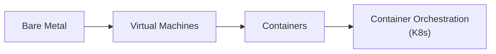

**1. The Bare Metal Era (2000s)**
Companies ran applications directly on physical servers. One app per server. Wasteful — most servers sat at 10-15% utilization.

**2. The Virtual Machine Era (2005-2015)**
VMware and hypervisors let you run multiple virtual machines on one physical server. Better utilization, but VMs are heavy — each one carries its own full operating system (gigabytes in size, minutes to boot).

**3. The Container Era (2013+)**
Docker made containers mainstream. Containers share the host OS kernel, making them lightweight (megabytes in size, seconds to start). But managing hundreds of containers across dozens of servers by hand? That's a nightmare.

**4. The Orchestration Era (2014+)**
Google had been running containers internally using a system called **Borg** for over a decade. In 2014, they open-sourced the ideas behind Borg as **Kubernetes**. It became the standard way to manage containers at scale.

### Why It Was Needed

Before Kubernetes, teams either:
- Managed containers manually with scripts (fragile, error-prone)
- Built their own orchestration tools (expensive, reinventing the wheel)
- Used simpler tools like Docker Compose (only works on a single machine)

Kubernetes provided a **universal, battle-tested platform** for running containers in production.

---

## When to Use Kubernetes (and When Not To)

### Use Kubernetes When

- You have **multiple microservices** that need to work together
- You need **auto-scaling** based on traffic or load
- You need **high availability** — your app can't afford downtime
- You run the same app in **multiple environments** (dev, staging, prod)
- You have a **team large enough** to manage it (or use managed K8s)
- You need **multi-cloud** or **hybrid cloud** deployments
- You need **rolling updates** with zero downtime

### Don't Use Kubernetes When

- You have a **simple app** (a single monolith, a side project)
- Your team is **very small** (1-3 developers) and doesn't have K8s experience
- You can use **simpler alternatives** (AWS ECS, Google Cloud Run, Fly.io, Railway)
- **Cost matters a lot** — K8s has significant overhead for small workloads
- You don't use containers yet — containerize first, orchestrate later

> **Rule of thumb:** If you can count your containers on two hands and they run on 1-2 servers, you probably don't need Kubernetes. If you have dozens of services with complex dependencies, scaling needs, and uptime requirements — Kubernetes starts making sense.

---

## Problems Kubernetes Solves

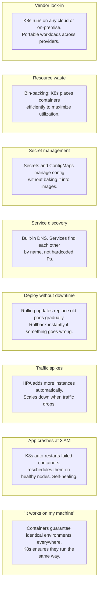

---

## Problems Kubernetes Brings

Kubernetes is powerful, but it's not free of cost:

### 1. Complexity
Kubernetes has a steep learning curve. The number of concepts, objects, and configuration options is overwhelming for newcomers. Even experienced engineers regularly struggle with YAML configuration, networking, and debugging.

### 2. Operational Overhead
Someone needs to:
- Keep the cluster updated (K8s releases a new version every ~4 months)
- Manage node OS patches and security updates
- Monitor cluster health, not just application health
- Handle certificate rotation, etcd backups, and more

### 3. Cost
- **Control plane costs** — managed K8s services charge for the control plane (e.g., EKS charges ~$73/month per cluster)
- **Node costs** — you pay for the VMs that run your workloads
- **Overhead** — K8s system components (kube-proxy, CoreDNS, CNI plugin, etc.) consume resources on every node
- **People costs** — you need engineers who understand K8s

### 4. Networking Complexity
K8s networking is notoriously complex. Pod-to-pod, pod-to-service, external-to-service — each has its own model. Debugging network issues requires deep knowledge of CNI plugins, iptables/nftables, and DNS.

### 5. Security Surface Area
More components = more attack surface. You need to secure the API server, etcd, kubelet, container runtime, network policies, RBAC, pod security, image scanning, and more.

### 6. YAML Hell
Kubernetes configuration is primarily YAML. Managing hundreds of YAML files across environments becomes a challenge in itself. This is why tools like Helm and Kustomize exist — to manage the YAML problem.

### 7. Debugging is Hard
When something goes wrong, the issue could be in your app, the container, the pod configuration, the node, the network, DNS, resource limits, or a dozen other places. The debugging surface is large.

---

## How Kubernetes Works — Architecture

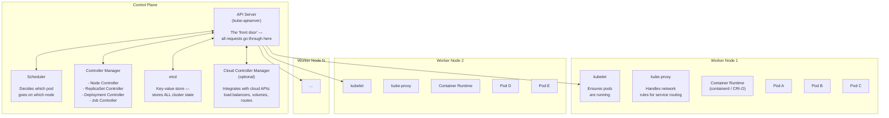

### Control Plane Components

| Component | What It Does | Analogy |
|-----------|-------------|---------|
| **API Server** | The central hub. All communication goes through it. kubectl, the dashboard, and internal components all talk to the API server. | The front desk of a hotel — all requests go through here |
| **etcd** | A distributed key-value store that holds ALL cluster state — what pods exist, their configurations, secrets, etc. | The hotel's filing cabinet — everything is recorded here |
| **Scheduler** | Watches for new pods that have no node assigned, and selects a node for them to run on based on resource requirements, constraints, and policies. | The hotel room assignment system |
| **Controller Manager** | Runs controller loops that watch the state of the cluster and make changes to move the **current state** toward the **desired state**. | The hotel's maintenance team that keeps everything running |
| **Cloud Controller Manager** | Lets K8s talk to cloud provider APIs (create load balancers, attach storage volumes, etc.) | The hotel's procurement department that orders supplies from vendors |

### Worker Node Components

| Component | What It Does | Analogy |
|-----------|-------------|---------|
| **kubelet** | An agent running on every node. Ensures containers in pods are running and healthy. Reports back to the control plane. | The floor supervisor on each floor of the hotel |
| **kube-proxy** | Maintains network rules on nodes. Handles routing traffic to the right pods. | The hotel's internal phone system — routes calls to the right room |
| **Container Runtime** | The software that actually runs containers (containerd, CRI-O). Docker is no longer used directly by K8s since v1.24. | The actual hotel room where the guest stays |

### The Reconciliation Loop — The Heart of Kubernetes

Kubernetes works on a **declarative model**. You don't say "run 3 copies of my app." You say "I want 3 copies of my app to be running." K8s then constantly works to make reality match your declaration:

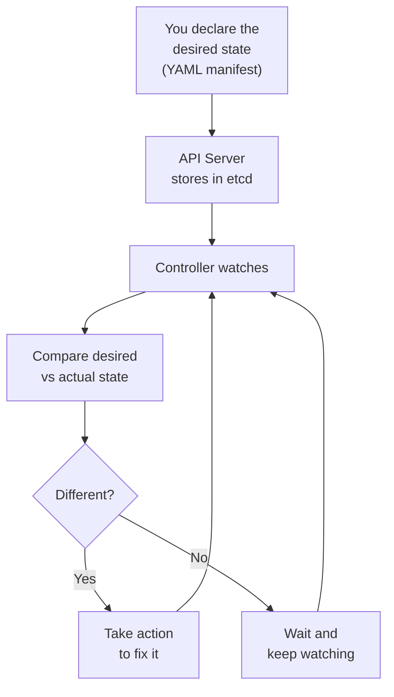

Example: You declare 3 replicas. One pod crashes. The ReplicaSet controller notices only 2 pods exist. It creates a new one. Back to 3. All automatic.

---

## Core Concepts and Objects

### Pod

The **smallest deployable unit** in Kubernetes. A Pod wraps one or more containers that share:
- The same network namespace (same IP, can talk via localhost)
- The same storage volumes
- The same lifecycle

Most of the time, **one pod = one container**. Multi-container pods are used for sidecars (logging agents, proxies, etc.).

```yaml
apiVersion: v1
kind: Pod
metadata:
  name: my-app
  labels:
    app: my-app
spec:
  containers:
    - name: my-app
      image: my-app:1.0.0
      ports:
        - containerPort: 8080
      resources:
        requests:
          cpu: "100m"      # 0.1 CPU cores
          memory: "128Mi"  # 128 MB
        limits:
          cpu: "500m"      # 0.5 CPU cores
          memory: "256Mi"  # 256 MB
```

> **Important:** You almost never create Pods directly. You use higher-level objects (Deployments, StatefulSets) that create and manage Pods for you.

### Deployment

Manages a set of identical Pods. Handles:
- Creating the right number of replicas
- Rolling updates (gradually replacing old pods with new ones)
- Rollbacks

```yaml
apiVersion: apps/v1
kind: Deployment
metadata:
  name: my-app
spec:
  replicas: 3
  selector:
    matchLabels:
      app: my-app
  template:
    metadata:
      labels:
        app: my-app
    spec:
      containers:
        - name: my-app
          image: my-app:1.0.0
          ports:
            - containerPort: 8080
          resources:
            requests:
              cpu: "100m"
              memory: "128Mi"
            limits:
              cpu: "500m"
              memory: "256Mi"
```

### Service

Pods are ephemeral — they get created and destroyed constantly. A **Service** provides a stable network endpoint (a fixed IP and DNS name) that routes traffic to the right Pods.

Types of Services:

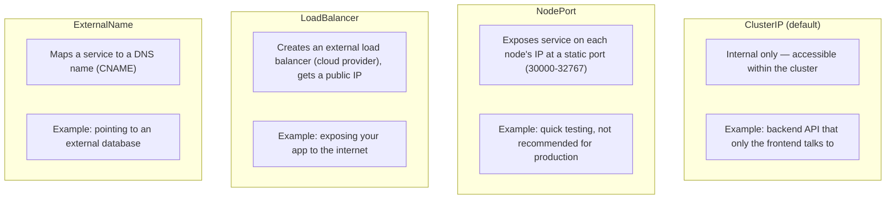

```yaml
apiVersion: v1
kind: Service
metadata:
  name: my-app-service
spec:
  selector:
    app: my-app          # Routes to pods with this label
  ports:
    - port: 80           # The port the service listens on
      targetPort: 8080   # The port the container listens on
  type: ClusterIP
```

### ReplicaSet

Ensures a specified number of pod replicas are running. **You almost never create ReplicaSets directly** — Deployments manage them for you. The Deployment creates a ReplicaSet, which creates Pods.

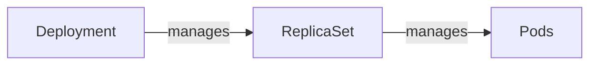

### StatefulSet

Like a Deployment, but for **stateful applications** (databases, message queues). Provides:
- **Stable network identities** — pods get predictable names (my-db-0, my-db-1, my-db-2)
- **Stable persistent storage** — each pod gets its own persistent volume
- **Ordered deployment and scaling** — pods are created/deleted in order

Use StatefulSets for: PostgreSQL, Redis, Kafka, Elasticsearch, etc.

### DaemonSet

Ensures that **one copy of a pod runs on every node** (or a subset of nodes). Perfect for:
- Log collectors (Fluentd, Filebeat)
- Monitoring agents (Datadog, Prometheus Node Exporter)
- Network plugins (CNI)
- Storage daemons

### Job and CronJob

A **Job** creates one or more pods and ensures they run **to completion** (exit code 0). Unlike Deployments which keep pods running forever, Jobs are for finite tasks.

A **CronJob** creates Jobs on a **recurring schedule** (like Unix cron).

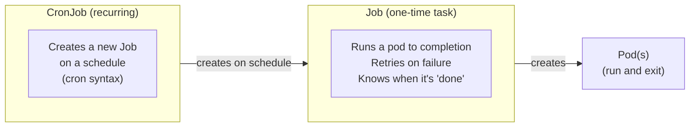

**When to use a Job (not a CronJob):**
- One-off database migrations
- Batch processing a queue until it's empty
- Data import/export tasks
- One-time cleanup or repair scripts
- Running as part of a CI/CD pipeline (triggered by Argo Workflows, Tekton, etc.)
- Any task triggered by an event, not a schedule

**When to use a CronJob:**
- Nightly database backups
- Hourly report generation
- Daily cleanup of expired records
- Periodic health checks or audits
- Scheduled data sync between systems

#### Job Example

```yaml
apiVersion: batch/v1
kind: Job
metadata:
  name: db-migration
spec:
  backoffLimit: 3              # Retry up to 3 times on failure
  activeDeadlineSeconds: 600   # Kill after 10 minutes (prevents stuck jobs)
  ttlSecondsAfterFinished: 86400  # Auto-delete after 24 hours
  template:
    spec:
      containers:
        - name: migrate
          image: my-app:1.0.0
          command: ['./migrate', 'up']
          env:
            - name: DATABASE_URL
              valueFrom:
                secretKeyRef:
                  name: db-credentials
                  key: url
      restartPolicy: Never     # "Never" = create new pod on failure
                                # "OnFailure" = restart same pod on failure
```

#### CronJob Example

```yaml
apiVersion: batch/v1
kind: CronJob
metadata:
  name: nightly-backup
spec:
  schedule: "0 2 * * *"                 # Every day at 2 AM
  concurrencyPolicy: Forbid             # Don't start a new job if previous is still running
  successfulJobsHistoryLimit: 3         # Keep last 3 successful job records
  failedJobsHistoryLimit: 5             # Keep last 5 failed job records
  startingDeadlineSeconds: 300          # If missed by 5 min, skip this run
  jobTemplate:
    spec:
      backoffLimit: 2
      template:
        spec:
          containers:
            - name: backup
              image: my-backup:1.0.0
              resources:
                requests:
                  cpu: "200m"
                  memory: "256Mi"
                limits:
                  memory: "512Mi"
          restartPolicy: OnFailure
```

#### Job Parallelism

Jobs can run multiple pods in parallel for batch processing:

```yaml
spec:
  completions: 10     # Total pods that must succeed
  parallelism: 3      # Run 3 pods at a time
  # K8s runs 3 pods simultaneously, creates new ones as they finish,
  # until 10 have completed successfully
```

#### Job Concurrency Policies (CronJob)

| Policy | Behavior |
|--------|----------|
| **Allow** (default) | Multiple Jobs can run simultaneously. Risk: overlapping runs. |
| **Forbid** | Skip this schedule if previous Job is still running. Safest for DB operations. |
| **Replace** | Kill the running Job and start a new one. For "latest data wins" scenarios. |

#### Best Practices for Jobs

- **Always set `activeDeadlineSeconds`** — prevents zombie Jobs that run forever
- **Always set `backoffLimit`** — prevents infinite retries
- **Set `ttlSecondsAfterFinished`** — auto-cleans completed Job objects (otherwise they pile up)
- **Use `Forbid` concurrency for CronJobs** that modify data — prevents race conditions
- **Set resource requests/limits** — Jobs can consume unexpected resources during batch processing
- **Use `startingDeadlineSeconds` on CronJobs** — handles the case where the scheduler was down and CronJobs pile up

### Namespace

A way to **logically divide a cluster** into separate environments. Think of them as folders.

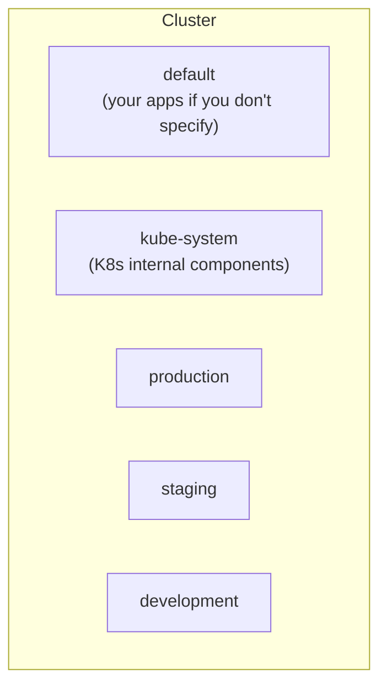

Namespaces provide:
- Resource isolation (resource quotas per namespace)
- Access control (RBAC per namespace)
- Network isolation (with Network Policies)

### ConfigMap and Secret

- **ConfigMap**: Stores non-sensitive configuration (environment variables, config files)
- **Secret**: Stores sensitive data (passwords, API keys, TLS certificates)

```yaml
# ConfigMap
apiVersion: v1
kind: ConfigMap
metadata:
  name: app-config
data:
  DATABASE_HOST: "postgres.default.svc.cluster.local"
  LOG_LEVEL: "info"

---
# Secret (values are base64-encoded, NOT encrypted by default!)
apiVersion: v1
kind: Secret
metadata:
  name: app-secrets
type: Opaque
data:
  DATABASE_PASSWORD: cGFzc3dvcmQxMjM=   # base64 of "password123"
```

> **Warning:** Kubernetes Secrets are only base64-encoded by default, NOT encrypted. Anyone with API access can read them. Use solutions like **Sealed Secrets**, **External Secrets Operator**, **HashiCorp Vault**, or enable **etcd encryption** for real security.

### Horizontal Pod Autoscaler (HPA)

Automatically scales the number of pods based on metrics:

```yaml
apiVersion: autoscaling/v2
kind: HorizontalPodAutoscaler
metadata:
  name: my-app-hpa
spec:
  scaleTargetRef:
    apiVersion: apps/v1
    kind: Deployment
    name: my-app
  minReplicas: 2
  maxReplicas: 10
  metrics:
    - type: Resource
      resource:
        name: cpu
        target:
          type: Utilization
          averageUtilization: 70
```

### Vertical Pod Autoscaler (VPA)

Instead of adding more pods, the VPA adjusts the **CPU and memory requests/limits** of existing pods. Useful when you don't know what resources your app actually needs. See the [Deep Dive: VPA](#deep-dive-vertical-pod-autoscaler-vpa) section for full details and YAML examples.

> **Note:** HPA and VPA should generally not be used together on the same metric. HPA scales horizontally (more pods), VPA scales vertically (bigger pods).

---

## Setting Up a Kubernetes Cluster

### Option 1: Local Development

For learning and development on your machine:

| Tool | Description | Best For |
|------|-------------|----------|
| **minikube** | Runs a single-node K8s cluster in a VM or container | Learning, local dev |
| **kind** (Kubernetes in Docker) | Runs K8s nodes as Docker containers | CI/CD, testing |
| **k3d** | Runs k3s (lightweight K8s) in Docker | Fast local development |
| **Docker Desktop** | Built-in K8s option | Quick start for Docker users |

```bash
# minikube
brew install minikube
minikube start
minikube dashboard   # opens the K8s dashboard in your browser

# kind
brew install kind
kind create cluster --name my-cluster

# k3d
brew install k3d
k3d cluster create my-cluster
```

### Option 2: Managed Kubernetes (Production)

See the [Managed Kubernetes Options](#managed-kubernetes-options--providers-prices-features) section below.

### Option 3: Self-Managed (Hard Mode)

Tools for setting up K8s on your own infrastructure:

- **kubeadm**: The official K8s setup tool. Requires manual networking and storage setup.
- **kOps**: Automated K8s setup on AWS (also supports GCE and OpenStack).
- **Rancher/RKE2**: Enterprise-grade K8s distribution with a management UI.
- **Kubespray**: Ansible-based K8s setup, supports bare metal and cloud.

> **Recommendation for juniors:** Start with minikube for learning, then use managed Kubernetes (EKS, GKE, AKS) for production. Don't self-manage unless you have strong infrastructure experience.

---

## Configuring and Managing a Cluster

### kubectl — The Command-Line Tool

`kubectl` is the primary CLI for interacting with Kubernetes.

```bash
# Install
brew install kubectl

# Configure — kubectl uses a kubeconfig file (~/.kube/config)
# Managed services provide commands to configure this:
aws eks update-kubeconfig --name my-cluster          # AWS EKS
gcloud container clusters get-credentials my-cluster  # GKE
az aks get-credentials --name my-cluster              # AKS

# Verify connection
kubectl cluster-info
kubectl get nodes
```

### Applying Configuration

```bash
# Apply a manifest (create or update)
kubectl apply -f deployment.yaml

# Apply all manifests in a directory
kubectl apply -f ./k8s/

# Delete resources
kubectl delete -f deployment.yaml

# View resources
kubectl get pods
kubectl get services
kubectl get deployments
kubectl get all                    # everything in the current namespace
kubectl get all --all-namespaces   # everything across all namespaces
```

### Debugging

```bash
# View pod logs
kubectl logs my-pod
kubectl logs my-pod -c my-container   # specific container in multi-container pod
kubectl logs my-pod --previous        # logs from the previous (crashed) instance
kubectl logs -f my-pod                # stream logs (follow)

# Describe a resource (events, status, conditions)
kubectl describe pod my-pod
kubectl describe node my-node

# Execute a command inside a container
kubectl exec -it my-pod -- /bin/sh

# Port-forward to access a pod locally
kubectl port-forward my-pod 8080:8080

# View resource usage
kubectl top pods
kubectl top nodes
```

### Contexts — Working with Multiple Clusters

```bash
# List available contexts
kubectl config get-contexts

# Switch context
kubectl config use-context my-cluster

# Set default namespace for a context
kubectl config set-context --current --namespace=production
```

### Maintaining a Cluster

Key maintenance tasks:

1. **Kubernetes version upgrades** — upgrade control plane, then nodes. Always read the changelog for breaking changes.
2. **Node OS patching** — cordon (mark unschedulable), drain (evict pods), update, uncordon.
3. **etcd backups** — critical for disaster recovery. Managed services handle this for you.
4. **Certificate rotation** — K8s uses TLS certificates internally. They expire. Managed services handle this.
5. **Monitoring cluster health** — watch for node pressure (CPU, memory, disk), failing pods, pending pods.

```bash
# Cordon a node (prevent new pods from being scheduled)
kubectl cordon node-1

# Drain a node (evict all pods gracefully)
kubectl drain node-1 --ignore-daemonsets --delete-emptydir-data

# Uncordon after maintenance
kubectl uncordon node-1
```

---

## Managed Kubernetes Options — Providers, Prices, Features

Managed Kubernetes means the cloud provider runs the **control plane** for you. You only manage the **worker nodes** (or even those can be managed with node auto-provisioning).

### Provider Comparison

```mermaid
flowchart TB
    subgraph AWS["AWS — EKS (~$73/mo per cluster)"]
        AWS1["Largest ecosystem, Karpenter, Fargate\n(serverless pods), deep AWS integration"]
    end
    subgraph GCP["Google Cloud — GKE (Free Standard / $73/mo Autopilot)"]
        GCP1["Best K8s experience, Autopilot mode\n(Google manages nodes), fastest upgrades, built-in Istio"]
    end
    subgraph AZ["Azure — AKS (Free!)"]
        AZ1["Best for Microsoft shops, Azure AD integration,\nWindows containers, Azure Arc for hybrid"]
    end
    subgraph DO["DigitalOcean — DOKS (Free!)"]
        DO1["Simplest setup, great for small teams,\nlower cost nodes"]
    end
    subgraph LI["Linode/Akamai — LKE (Free!)"]
        LI1["Budget-friendly, simple,\ngood for smaller workloads"]
    end
    subgraph VU["Vultr — VKE (Free!)"]
        VU1["Budget-friendly,\nglobal availability"]
    end
    subgraph CI["Civo — Civo K8s (Free!)"]
        CI1["Uses k3s (lightweight),\nvery fast cluster creation (~90 seconds)"]
    end
```

> Note: You always pay for worker nodes (VMs) on top of control plane costs. Prices as of early 2025 — check providers for current pricing.

### Choosing a Provider

- **Already on AWS?** → EKS is the natural choice. Best ecosystem, but more complex.
- **Want the best K8s experience?** → GKE. Google created K8s, and it shows.
- **Microsoft shop?** → AKS. Azure AD, .NET, Windows containers.
- **Small team, budget-conscious?** → DigitalOcean or Civo. Simple and cheap.
- **Need multi-cloud?** → Use tools like Crossplane or Terraform to manage K8s across providers.

### Serverless Kubernetes Options

Don't want to manage nodes at all?

- **AWS Fargate (with EKS)** — pay per pod, no nodes to manage
- **GKE Autopilot** — Google manages the nodes, you just deploy pods
- **Azure Container Apps** — serverless containers on K8s (abstracted)
- **Google Cloud Run** — fully serverless containers (not K8s, but similar workflow)

These options are more expensive per compute unit but save on operational effort.

---

## Deep Dive: Node Pools

A **Node Pool** (called "Node Group" in EKS) is a group of worker nodes within a cluster that share the same configuration:
- Machine type (e.g., 4 CPU / 16 GB RAM)
- OS image
- Labels and taints
- Autoscaling settings

### Why Use Multiple Node Pools?

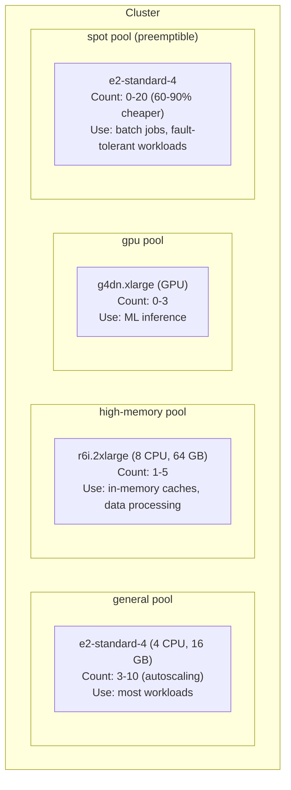

### Directing Pods to Specific Node Pools

Use **node selectors**, **affinity rules**, and **taints/tolerations**:

```yaml
# Node Selector — simple approach
spec:
  nodeSelector:
    cloud.google.com/gke-nodepool: high-memory

# Taints (on the node) + Tolerations (on the pod)
# Taint the GPU nodes so only GPU workloads land there:
# kubectl taint nodes gpu-node-1 gpu=true:NoSchedule

# Pod toleration:
spec:
  tolerations:
    - key: "gpu"
      operator: "Equal"
      value: "true"
      effect: "NoSchedule"

# Node Affinity — more flexible
spec:
  affinity:
    nodeAffinity:
      requiredDuringSchedulingIgnoredDuringExecution:
        nodeSelectorTerms:
          - matchExpressions:
              - key: node-type
                operator: In
                values:
                  - high-memory
```

### Best Practices for Node Pools

- **Separate system workloads** from application workloads (dedicated node pool for monitoring, logging, etc.)
- **Use spot/preemptible instances** for fault-tolerant workloads to save 60-90% on compute
- **Right-size your nodes** — too small and you waste resources on overhead; too large and a single node failure has a bigger blast radius
- **Enable autoscaling** on node pools so you're not paying for idle capacity

---

## Deep Dive: OOM (Out of Memory)

OOM (Out of Memory) is one of the most common issues in Kubernetes. It happens when a container tries to use more memory than it's allowed.

### How Memory Limits Work

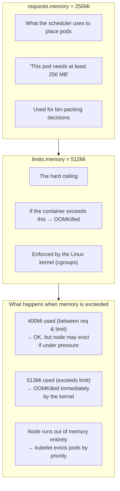

### OOMKilled — What It Means

When you see `OOMKilled` in pod status, the Linux kernel killed the container because it exceeded its memory limit. The exit code is **137** (128 + 9, where 9 is SIGKILL).

```bash
# Check for OOMKilled
kubectl describe pod my-pod
# Look for: State: Terminated, Reason: OOMKilled

kubectl get pods
# STATUS: OOMKilled or CrashLoopBackOff (if it keeps getting OOMKilled)
```

### Common Causes

1. **Memory limits set too low** — your app genuinely needs more memory
2. **Memory leaks** — the app slowly consumes more memory until it's killed
3. **JVM/runtime overhead** — Java, Node.js, and other runtimes need memory on top of your app's usage
4. **Large payloads** — processing big files or responses in memory
5. **No limits set** — the pod can consume all node memory, causing the node to become unstable

### How to Fix OOM Issues

```bash
# 1. Check actual memory usage
kubectl top pod my-pod

# 2. Check what the limits are
kubectl describe pod my-pod | grep -A 3 Limits

# 3. Check OOM events
kubectl get events --field-selector reason=OOMKilling
```

**Solutions:**
- **Increase memory limits** if the app genuinely needs more
- **Fix memory leaks** in your application (profiling tools: pprof for Go, heap dumps for Java)
- **Set appropriate JVM flags** (e.g., `-XX:MaxRAMPercentage=75` for Java)
- **Always set both requests and limits** — never leave them unset in production
- **Use VPA** to automatically find the right resource values

### Memory QoS Classes

Kubernetes assigns a QoS class to each pod based on its resource configuration:

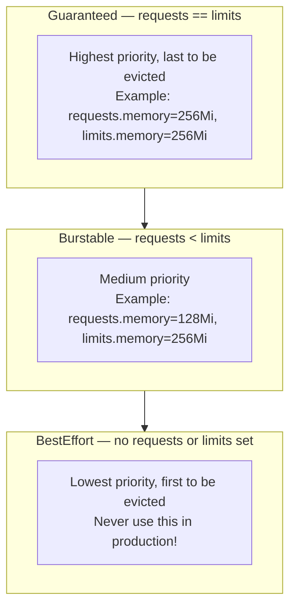

---

## Deep Dive: Karpenter

**Karpenter** is an open-source, high-performance Kubernetes node autoscaler, originally built by AWS. It replaces the traditional **Cluster Autoscaler** with a smarter, faster approach.

### Cluster Autoscaler vs. Karpenter

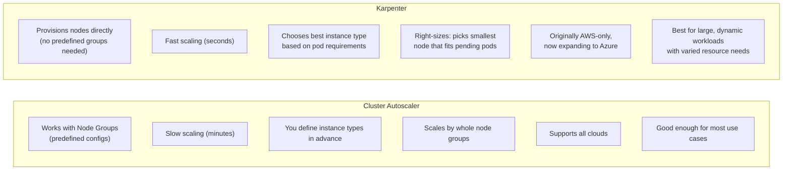

### How Karpenter Works

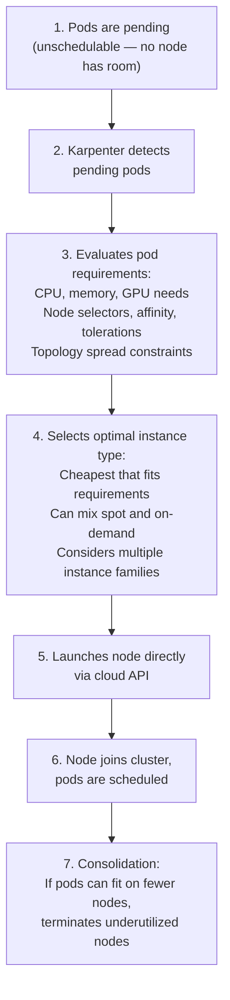

### Karpenter Key Concepts

- **NodePool** (was Provisioner in v0.x): Defines constraints for nodes Karpenter can create (instance families, zones, capacity type).
- **NodeClass** (EC2NodeClass on AWS): Defines cloud-specific configuration (AMI, subnets, security groups).
- **Consolidation**: Karpenter continuously looks for opportunities to reduce cost by replacing nodes with cheaper ones or bin-packing pods onto fewer nodes.
- **Disruption**: Karpenter can proactively replace nodes for upgrades, expiration, or drift detection.

```yaml
apiVersion: karpenter.sh/v1
kind: NodePool
metadata:
  name: default
spec:
  template:
    spec:
      requirements:
        - key: karpenter.sh/capacity-type
          operator: In
          values: ["on-demand", "spot"]
        - key: node.kubernetes.io/instance-type
          operator: In
          values: ["m5.large", "m5.xlarge", "m6i.large", "c5.large"]
      nodeClassRef:
        group: karpenter.k8s.aws
        kind: EC2NodeClass
        name: default
  limits:
    cpu: "100"
    memory: "400Gi"
  disruption:
    consolidationPolicy: WhenEmptyOrUnderutilized
    consolidateAfter: 30s
```

### When to Use Karpenter

- You're on AWS (or Azure once it's fully supported)
- You have workloads with varied resource requirements
- You want faster scaling than Cluster Autoscaler
- You want automatic cost optimization through consolidation
- You run spot instances and want intelligent fallback to on-demand

---

## Deep Dive: Ingress and Egress

### Ingress — Getting Traffic Into Your Cluster

**Ingress** is how external traffic reaches your services. There are two main components:

1. **Ingress Resource**: A Kubernetes object that defines routing rules (like a config file)
2. **Ingress Controller**: The actual software that implements those rules (you must install one — it's not built in!)

### How Many Ingresses? At What Level?

This is a common point of confusion. Here's how it breaks down:

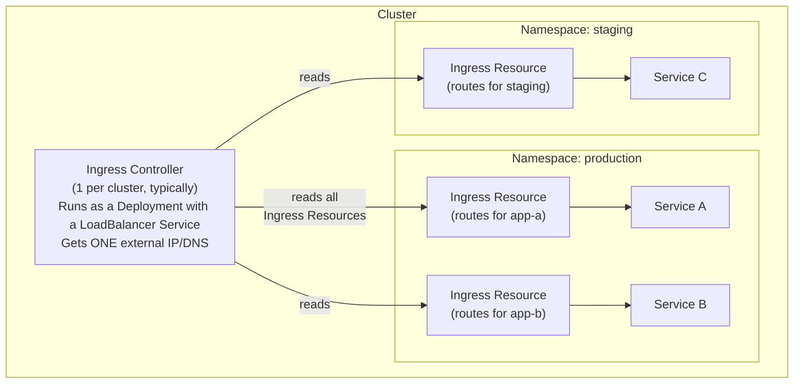

**Key points:**
- **Ingress Controller**: Usually **1 per cluster** (sometimes 2 for internal/external). It's a pod running NGINX/Traefik/etc. It watches ALL Ingress Resources across all namespaces and configures itself accordingly. It runs behind a LoadBalancer Service (one external IP).
- **Ingress Resource**: **One or more per namespace**. Each Ingress Resource is a YAML object that defines routing rules. You can have multiple Ingress Resources in a namespace — the controller merges them.
- **Services**: Ingress routes to **Services**, not to Pods directly. One Ingress can route to many Services.
- **Pods**: Pods have nothing to do with Ingress directly. They're behind Services.

**Common patterns:**

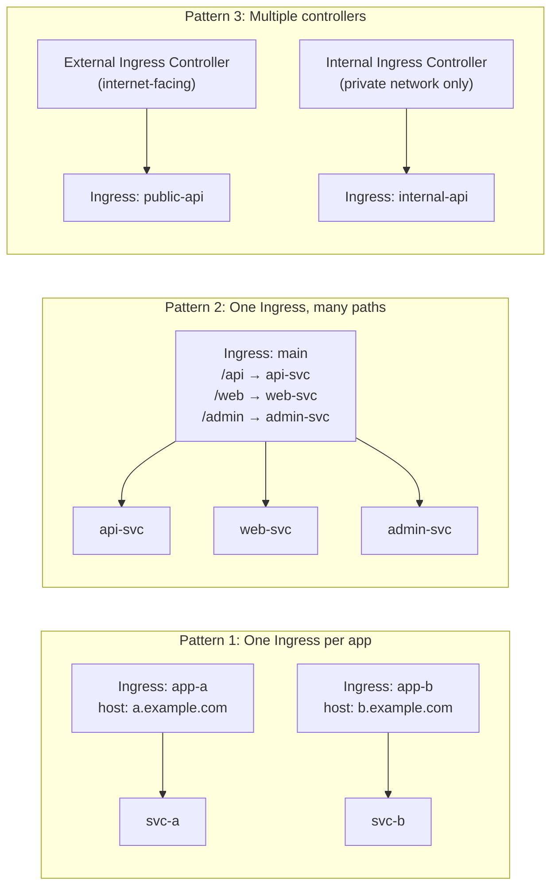

**When to use multiple Ingress Controllers:**
- Separate **public** (internet-facing) and **internal** (VPN/private) traffic
- Different teams need different controller configurations
- Different TLS requirements per traffic class

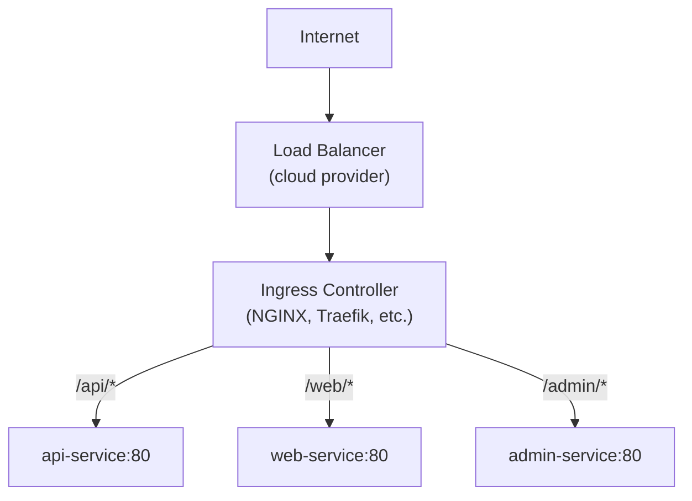

```yaml
apiVersion: networking.k8s.io/v1
kind: Ingress
metadata:
  name: my-ingress
  annotations:
    nginx.ingress.kubernetes.io/rewrite-target: /
spec:
  ingressClassName: nginx
  tls:
    - hosts:
        - myapp.example.com
      secretName: myapp-tls
  rules:
    - host: myapp.example.com
      http:
        paths:
          - path: /api
            pathType: Prefix
            backend:
              service:
                name: api-service
                port:
                  number: 80
          - path: /
            pathType: Prefix
            backend:
              service:
                name: web-service
                port:
                  number: 80
```

### Popular Ingress Controllers

| Controller | Best For |
|-----------|----------|
| **NGINX Ingress** | Most popular, good default choice, lots of features |
| **Traefik** | Built-in Let's Encrypt, auto-discovery, good for simple setups |
| **HAProxy** | High performance, TCP/UDP support |
| **AWS ALB Ingress** | Native AWS integration, path/host routing at ALB level |
| **Istio Gateway** | If you're already using Istio service mesh |
| **Emissary/Ambassador** | API Gateway features, rate limiting, auth |
| **Cilium** | eBPF-based, high performance networking |

### Gateway API — The Future of Ingress

The **Gateway API** is the successor to Ingress. It's more expressive and supports more use cases:

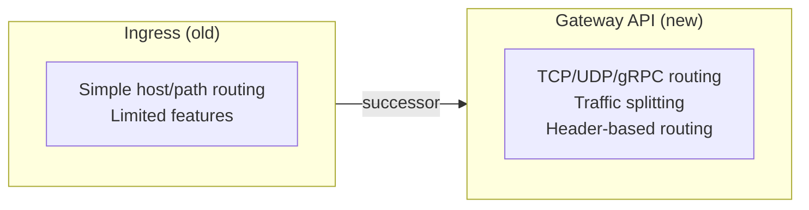

Gateway API is now GA (stable) and recommended for new setups.

### Sticky Sessions (Session Affinity)

Sticky sessions ensure a client always reaches the **same backend pod** for the duration of their session. This can be configured at **two levels**:

**Level 1: Service-level session affinity (built-in)**

Kubernetes Services support `sessionAffinity: ClientIP` natively — no Ingress Controller needed:

```yaml
apiVersion: v1
kind: Service
metadata:
  name: my-app
spec:
  selector:
    app: my-app
  sessionAffinity: ClientIP
  sessionAffinityConfig:
    clientIP:
      timeoutSeconds: 10800   # 3 hours
  ports:
    - port: 80
      targetPort: 8080
```

This uses the client's IP to route them to the same pod. Simple but limited — it breaks with NAT (many users behind the same IP) and doesn't support cookie-based affinity.

**Level 2: Ingress-level sticky sessions (cookie-based)**

Ingress Controllers offer cookie-based session affinity, which is more reliable:

```yaml
# NGINX Ingress Controller — cookie-based sticky sessions
apiVersion: networking.k8s.io/v1
kind: Ingress
metadata:
  name: my-app
  annotations:
    nginx.ingress.kubernetes.io/affinity: "cookie"
    nginx.ingress.kubernetes.io/affinity-mode: "persistent"
    nginx.ingress.kubernetes.io/session-cookie-name: "SERVERID"
    nginx.ingress.kubernetes.io/session-cookie-expires: "172800"      # 2 days
    nginx.ingress.kubernetes.io/session-cookie-max-age: "172800"
    nginx.ingress.kubernetes.io/session-cookie-change-on-failure: "true"
spec:
  rules:
    - host: myapp.example.com
      http:
        paths:
          - path: /
            pathType: Prefix
            backend:
              service:
                name: my-app
                port:
                  number: 80
```

The Ingress Controller sets a cookie on the client that identifies which backend pod to route to.

**Level 3: Cloud Load Balancer sticky sessions**

If you use a LoadBalancer Service without Ingress, the cloud LB itself can handle stickiness:
- **AWS ALB**: Target group stickiness (cookie-based)
- **GCP**: Session affinity on backend services
- **Azure**: Cookie-based session affinity on Application Gateway

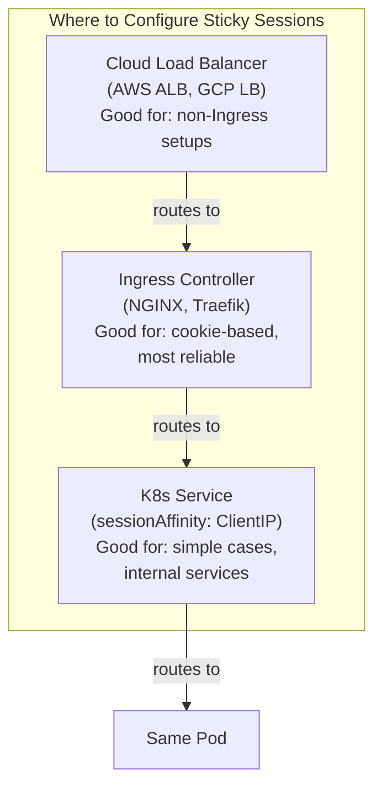

**Best practice:** Avoid sticky sessions if possible. They cause **uneven load distribution** — if one pod gets all the "sticky" users, it's overloaded while others are idle. Instead:
- Store session state in **Redis** or a database
- Use **JWT tokens** that contain session data
- Design apps to be **stateless** — any pod can handle any request

Use sticky sessions only when you truly can't avoid it (e.g., WebSocket connections, long-lived upload streams, legacy apps that store session in memory).

### Egress — Traffic Leaving Your Cluster

**Egress** is outbound traffic — pods talking to external services (databases, APIs, the internet).

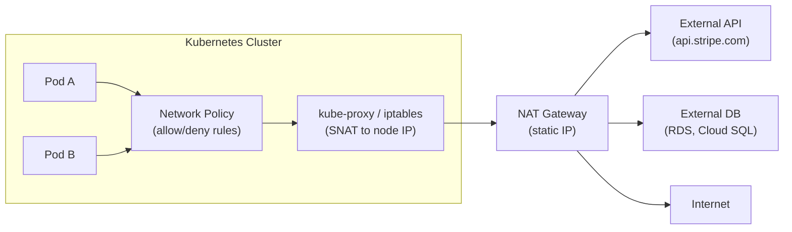

By default, pods can reach any external endpoint. You control egress with:

1. **Network Policies**: Block or allow outbound traffic at the pod level
2. **Egress Gateways**: Route all outbound traffic through a specific point (for auditing, firewalling)
3. **NAT Gateways**: In cloud environments, egress typically goes through a NAT Gateway with a static IP (important when external APIs whitelist your IP)

```yaml
# Network Policy — allow egress only to specific CIDRs
apiVersion: networking.k8s.io/v1
kind: NetworkPolicy
metadata:
  name: restrict-egress
spec:
  podSelector:
    matchLabels:
      app: my-app
  policyTypes:
    - Egress
  egress:
    - to:
        - ipBlock:
            cidr: 10.0.0.0/8    # internal network
      ports:
        - port: 5432
          protocol: TCP          # PostgreSQL only
    - to:
        - namespaceSelector:
            matchLabels:
              name: kube-system
      ports:
        - port: 53
          protocol: UDP          # DNS (required!)
```

> **Tip:** When restricting egress, always allow DNS (port 53) to kube-system, otherwise pods can't resolve any hostnames.

---

## Deep Dive: Network Policies

Network Policies are Kubernetes's built-in firewall. By default, **all pods can talk to all other pods** — there are no restrictions. Network Policies let you lock this down.

```mermaid
flowchart LR
    subgraph WITHOUT["Without Network Policies"]
        direction TB
        A1["App"] <--> B1["DB"]
        A1 <--> C1["Other"]
        B1 <--> D1["Hacker"]
        C1 <--> D1
    end
    subgraph WITH["With Network Policies"]
        direction TB
        A2["App"] --> B2["DB"]
        C2["Other"]
        D2["Hacker"] -.->|"blocked"| B2
    end
```

> **Important:** Network Policies require a CNI plugin that supports them (Calico, Cilium, Weave Net). The default kubenet does NOT support Network Policies.

---

## Deep Dive: Persistent Storage

Pods are **ephemeral** — when a pod dies, its local data is gone. For databases, file uploads, and other stateful data, you need persistent storage.

### Storage Concepts

```mermaid
flowchart LR
    SC["StorageClass\n\nDefines HOW storage\nis provisioned\n'Use AWS EBS gp3 volumes'\nEnables dynamic provisioning"] -->|creates| PV["PersistentVolume (PV)\n\nA piece of storage\nin the cluster\nExists independently\nof any pod"]
    PVC["PersistentVolumeClaim (PVC)\n\nA request for storage\nby a pod\n'I need 10 GB of fast SSD'"] -->|binds to| PV
    POD["Pod"] -->|uses| PVC
```

```yaml
# StorageClass (usually pre-configured by cloud provider)
apiVersion: storage.k8s.io/v1
kind: StorageClass
metadata:
  name: fast-ssd
provisioner: ebs.csi.aws.com
parameters:
  type: gp3
  iops: "3000"
reclaimPolicy: Delete
volumeBindingMode: WaitForFirstConsumer

---
# PVC — requesting storage
apiVersion: v1
kind: PersistentVolumeClaim
metadata:
  name: postgres-data
spec:
  accessModes:
    - ReadWriteOnce
  storageClassName: fast-ssd
  resources:
    requests:
      storage: 50Gi

---
# Using it in a Pod/StatefulSet
spec:
  containers:
    - name: postgres
      volumeMounts:
        - mountPath: /var/lib/postgresql/data
          name: data
  volumes:
    - name: data
      persistentVolumeClaim:
        claimName: postgres-data
```

### Access Modes

- **ReadWriteOnce (RWO)**: One node can mount the volume read-write. Most common.
- **ReadOnlyMany (ROX)**: Multiple nodes can mount read-only.
- **ReadWriteMany (RWX)**: Multiple nodes can mount read-write. Requires special storage (EFS, NFS, CephFS).

---

## Deep Dive: RBAC and Security

### RBAC (Role-Based Access Control)

RBAC controls **who can do what** in your cluster.

```mermaid
flowchart LR
    subgraph WHO["Subject (who)"]
        U["User"]
        G["Group"]
        SA["ServiceAccount"]
    end
    subgraph WHAT["Verb (what)"]
        V1["get / list / watch"]
        V2["create / update / patch"]
        V3["delete"]
    end
    subgraph ON["Resource (on what)"]
        R1["pods"]
        R2["deployments"]
        R3["services / secrets"]
        R4["configmaps / nodes"]
    end
    WHO -->|"Role or ClusterRole\ndefines permissions"| WHAT
    WHAT -->|"applied to"| ON

    subgraph SCOPE["Binding Scope"]
        NS["Role + RoleBinding\n= namespace-scoped"]
        CL["ClusterRole + ClusterRoleBinding\n= cluster-wide"]
    end
```

```yaml
# Role — allows reading pods in the "production" namespace
apiVersion: rbac.authorization.k8s.io/v1
kind: Role
metadata:
  namespace: production
  name: pod-reader
rules:
  - apiGroups: [""]
    resources: ["pods", "pods/log"]
    verbs: ["get", "list", "watch"]

---
# RoleBinding — assigns the role to a user
apiVersion: rbac.authorization.k8s.io/v1
kind: RoleBinding
metadata:
  namespace: production
  name: read-pods
subjects:
  - kind: User
    name: jane@example.com
roleRef:
  kind: Role
  name: pod-reader
  apiGroup: rbac.authorization.k8s.io
```

### Security Best Practices

1. **Enable RBAC** (enabled by default on managed K8s) — principle of least privilege
2. **Use Network Policies** — don't let all pods talk to all pods
3. **Scan container images** — use tools like Trivy, Snyk, or Grype
4. **Don't run as root** — set `runAsNonRoot: true` in pod security context
5. **Use Pod Security Standards** — enforce restricted or baseline security profiles
6. **Encrypt Secrets** — enable etcd encryption at rest, or use external secret managers
7. **Keep K8s updated** — security patches come frequently
8. **Limit API server access** — use private endpoints, IP whitelisting
9. **Audit logging** — enable and monitor K8s audit logs
10. **Use service accounts wisely** — don't use the default service account; create dedicated ones with minimal permissions

```yaml
# Pod security context
spec:
  securityContext:
    runAsNonRoot: true
    runAsUser: 1000
    fsGroup: 2000
  containers:
    - name: my-app
      securityContext:
        allowPrivilegeEscalation: false
        readOnlyRootFilesystem: true
        capabilities:
          drop:
            - ALL
```

---

## Deep Dive: Service Accounts

### What Is a Service Account?

A **Service Account** provides an identity for processes running inside pods. When your pod talks to the Kubernetes API (or to external cloud services), it uses a Service Account to authenticate.

```mermaid
flowchart LR
    subgraph AUTH["Authentication Model"]
        H["Human users"] -->|"certificates, OIDC"| API["K8s API Server"]
        P["Pods / processes"] -->|"Service Accounts"| API
    end
    subgraph SA["Service Account Defaults"]
        D1["Every namespace has a 'default' SA"]
        D2["Every pod uses it unless you specify another"]
        D3["Default SA has no permissions\n(unless someone added them — security risk)"]
    end
```

### Why Create Custom Service Accounts?

1. **Principle of least privilege** — each app gets only the permissions it needs
2. **Cloud IAM integration** — bind K8s Service Accounts to cloud roles (AWS IRSA, GCP Workload Identity)
3. **Audit trail** — know which app made which API call
4. **Limit blast radius** — if one app is compromised, it can only do what its SA allows

### Creating and Using Service Accounts

```yaml
# 1. Create a Service Account
apiVersion: v1
kind: ServiceAccount
metadata:
  name: my-app-sa
  namespace: production

---
# 2. Create a Role with specific permissions
apiVersion: rbac.authorization.k8s.io/v1
kind: Role
metadata:
  name: configmap-reader
  namespace: production
rules:
  - apiGroups: [""]
    resources: ["configmaps"]
    verbs: ["get", "list", "watch"]

---
# 3. Bind the Role to the Service Account
apiVersion: rbac.authorization.k8s.io/v1
kind: RoleBinding
metadata:
  name: my-app-configmap-access
  namespace: production
subjects:
  - kind: ServiceAccount
    name: my-app-sa
    namespace: production
roleRef:
  kind: Role
  name: configmap-reader
  apiGroup: rbac.authorization.k8s.io

---
# 4. Use the Service Account in your pod
apiVersion: apps/v1
kind: Deployment
metadata:
  name: my-app
spec:
  template:
    spec:
      serviceAccountName: my-app-sa    # Use our custom SA
      automountServiceAccountToken: true
      containers:
        - name: my-app
          image: my-app:1.0.0
```

### Cloud IAM Integration — IRSA and Workload Identity

This is one of the most powerful Service Account features. Instead of putting AWS/GCP credentials in a Secret, you **bind a K8s Service Account to a cloud IAM role**.

```mermaid
flowchart LR
    subgraph OLD["Old (insecure) way"]
        O1["Store AWS_ACCESS_KEY_ID\nin a K8s Secret\nStatic credentials, hard to rotate"]
    end
    subgraph NEW["New (recommended) way"]
        N1["K8s Service Account\n→ linked to →\nAWS IAM Role"]
        N2["Pod gets temporary credentials\nautomatically — no static keys"]
    end
```

**AWS IRSA (IAM Roles for Service Accounts):**

```yaml
apiVersion: v1
kind: ServiceAccount
metadata:
  name: s3-reader
  annotations:
    # This links the K8s SA to an AWS IAM role
    eks.amazonaws.com/role-arn: arn:aws:iam::123456789:role/s3-read-only
```

Now any pod using the `s3-reader` Service Account can read from S3 — no AWS keys needed. The AWS SDK automatically picks up the temporary credentials injected by EKS.

**GCP Workload Identity:**

```yaml
apiVersion: v1
kind: ServiceAccount
metadata:
  name: gcs-reader
  annotations:
    iam.gke.io/gcp-service-account: gcs-reader@my-project.iam.gserviceaccount.com
```

### Service Account Best Practices

1. **Don't use the default SA** — create dedicated Service Accounts per application
2. **Disable token auto-mounting** when pods don't need K8s API access:
   ```yaml
   automountServiceAccountToken: false
   ```
3. **Use cloud IAM integration** (IRSA/Workload Identity) instead of static cloud credentials
4. **Audit SA permissions** — regularly check what each SA can do:
   ```bash
   kubectl auth can-i --list --as=system:serviceaccount:production:my-app-sa
   ```
5. **Use bound service account tokens** (default since K8s 1.24) — tokens are time-limited and audience-bound, unlike the old non-expiring tokens

---

## Deep Dive: Service Mesh

A **Service Mesh** adds a layer of infrastructure between your services to handle:
- Mutual TLS (mTLS) — encrypted service-to-service communication
- Traffic management — retries, timeouts, circuit breaking, canary deployments
- Observability — request tracing, metrics, logging for every service call

### How It Works

A sidecar proxy (usually Envoy) is injected into every pod. All traffic goes through the proxy:

```mermaid
flowchart LR
    subgraph PA["Pod A"]
        AppA["Your App"] --> EnvA["Envoy\nSidecar"]
    end
    subgraph PB["Pod B"]
        EnvB["Envoy\nSidecar"] --> AppB["Your App"]
    end
    EnvA -->|"mTLS"| EnvB
```

Your app doesn't know about TLS, retries, or tracing. The sidecar handles it all transparently.

### Popular Service Meshes

| Service Mesh | Notes |
|-------------|-------|
| **Istio** | Most feature-rich, most complex. The "Kubernetes of service meshes." |
| **Linkerd** | Lightweight, simpler, Rust-based data plane. Great performance. |
| **Cilium Service Mesh** | eBPF-based, no sidecars needed. Modern and performant. |
| **Consul Connect** | By HashiCorp. Good if you already use Consul for service discovery. |

> **Do you need a service mesh?** Probably not if you have fewer than 10-15 services. The overhead (sidecars use CPU and memory in every pod) isn't worth it for small setups. Start without one and add it when you genuinely need mTLS or advanced traffic management.

---

## Deep Dive: Kubernetes Operators

### What is an Operator?

A Kubernetes **Operator** is a piece of software that extends Kubernetes to manage complex, stateful applications **automatically** — the same way a human operator (like a DBA) would.

Think of it this way:
- Kubernetes knows how to run containers, but it doesn't know how to **manage PostgreSQL** (when to take backups, how to failover replicas, how to upgrade safely).
- An **Operator** teaches Kubernetes that domain-specific knowledge.

```mermaid
flowchart LR
    subgraph MANUAL["Without Operator (DBA manually)"]
        M1["Sets up primary + replicas"]
        M2["Configures replication"]
        M3["Schedules backups"]
        M4["Handles failover at 3 AM"]
        M5["Runs version upgrades"]
        M6["Scales when needed"]
    end
    subgraph AUTO["With Operator (automatically)"]
        A1["Creates primary + replicas"]
        A2["Configures replication"]
        A3["Schedules backups"]
        A4["Handles failover at 3 AM"]
        A5["Runs rolling upgrades"]
        A6["Scales based on metrics"]
    end
```

> The Operator encodes the human's operational knowledge into software.

### How Operators Work

Operators follow the same **reconciliation loop** pattern that K8s uses internally:

```mermaid
flowchart TD
    A["1. You create a Custom Resource (CR)\n'I want a PostgreSQL cluster with\n3 replicas and daily backups'"] --> B["2. Operator watches\nfor Custom Resources"]
    B --> C["3. Compares desired state\nvs actual state"]
    C --> D["4. Takes action:\n- Creates StatefulSets, Services, ConfigMaps\n- Configures replication\n- Sets up backup CronJobs\n- Monitors health"]
    D --> E["5. Continuous reconciliation:\n- Replica down? Recreates it\n- Need upgrade? Rolling update\n- Backup failed? Retries and alerts"]
    E --> C
```

### Key Components of an Operator

```mermaid
flowchart TD
    subgraph CRD["Custom Resource Definition (CRD)"]
        CRD1["Extends K8s API with your new resource type\nExample: kind: PostgresCluster\nDefines the schema (what fields are allowed)"]
    end
    subgraph CR["Custom Resource (CR)"]
        CR1["An instance of the CRD\nYour 'desired state' declaration\nExample: 'I want a 3-node Postgres cluster'"]
    end
    subgraph CTRL["Controller (the Operator code)"]
        CTRL1["Watches Custom Resources\nContains the domain logic\nCreates/updates K8s resources\nRuns the reconciliation loop"]
    end
    CRD -->|"defines schema for"| CR
    CR -->|"watched by"| CTRL
    CTRL -->|"creates/manages"| K8S["Pods, Services,\nStatefulSets, ConfigMaps"]
```

### Example: Using a PostgreSQL Operator

Instead of manually creating StatefulSets, Services, and backup CronJobs, you just write:

```yaml
# CRD already installed by the operator
apiVersion: postgres-operator.crunchydata.com/v1beta1
kind: PostgresCluster
metadata:
  name: my-database
spec:
  postgresVersion: 16
  instances:
    - name: primary
      replicas: 3
      dataVolumeClaimSpec:
        accessModes: ["ReadWriteOnce"]
        resources:
          requests:
            storage: 100Gi
  backups:
    pgbackrest:
      repos:
        - name: repo1
          schedules:
            full: "0 1 * * 0"        # Weekly full backup
            incremental: "0 1 * * *"  # Daily incremental
          volume:
            volumeClaimSpec:
              accessModes: ["ReadWriteOnce"]
              resources:
                requests:
                  storage: 200Gi
```

The operator handles everything: creating pods, setting up streaming replication, configuring backups, handling failover. You get a production-ready PostgreSQL cluster from a single YAML file.

### Why Do We Need Operators?

1. **Automate Day-2 Operations** — Day 1 is deployment. Day 2 is everything after: upgrades, backups, scaling, failover, recovery. Operators automate Day 2.

2. **Encode Expert Knowledge** — A good Postgres operator knows everything a senior DBA knows: how to do zero-downtime upgrades, when to trigger a failover, how to restore from backup.

3. **Consistency** — Every Postgres cluster managed by the operator follows the same patterns. No more "this cluster was set up differently because a different person did it."

4. **Self-Healing** — If a replica goes down, the operator detects it and fixes it. At 3 AM. Without paging anyone.

5. **Complex Lifecycle Management** — Some applications have complex upgrade procedures (drain connections, upgrade primary, switch over, upgrade replicas). Operators handle this automatically.

### Popular Operators

| Operator | What It Manages |
|----------|----------------|
| **CloudNativePG** | PostgreSQL (CNCF project, very popular) |
| **CrunchyData PGO** | PostgreSQL (feature-rich, enterprise) |
| **Zalando Postgres Operator** | PostgreSQL (used at Zalando in production) |
| **Strimzi** | Apache Kafka |
| **MongoDB Community Operator** | MongoDB |
| **Redis Operator (Spotahome)** | Redis clusters |
| **Elastic Cloud on K8s (ECK)** | Elasticsearch, Kibana, APM |
| **Prometheus Operator** | Prometheus monitoring stack |
| **cert-manager** | TLS certificate management (technically an operator!) |
| **Rook** | Ceph storage |
| **Crossplane** | Cloud infrastructure (provisions AWS/GCP/Azure resources) |

> Browse all available operators at [OperatorHub.io](https://operatorhub.io)

### Building Your Own Operator — When and Why

**When you need a custom operator:**
- You have a complex in-house application with specific operational procedures
- You want to provide a "platform" experience to your developers (self-service databases, queues, etc.)
- No existing operator fits your use case

**When you DON'T need a custom operator:**
- A Deployment + HPA + health checks is enough for your app
- An existing operator already exists for your technology
- Your app is stateless — standard K8s resources handle it fine

### Languages and Frameworks for Building Operators

```mermaid
flowchart TB
    subgraph GO["Go-based (recommended)"]
        KB["Kubebuilder\nOfficial K8s SIG framework\nMost popular, generates scaffolding"]
        OS["Operator SDK (Red Hat)\nBuilt on Kubebuilder\nAlso supports Helm + Ansible operators"]
        CRT["controller-runtime\nLow-level library under Kubebuilder\nMax flexibility"]
    end
    subgraph OTHER["Other Languages"]
        MC["Metacontroller\nAny language via webhooks\nLow barrier to entry"]
        KOPF["kopf\nPython\nGreat for prototyping"]
        KRS["kube-rs\nRust\nGrowing ecosystem"]
        JAVA["Java Operator SDK\nFor Java shops"]
        SHELL["shell-operator (Flant)\nBash/Python\nSimple automation tasks"]
    end
```

### Which Language Should You Use?

**Go is the clear winner for production operators.** Here's why:

1. **Kubernetes itself is written in Go** — the client libraries, types, and tooling are Go-first
2. **Best client library** — `client-go` is the official, most complete K8s client
3. **Kubebuilder and Operator SDK** are Go-native — you get code generation, scaffolding, and testing tools for free
4. **Performance** — compiled binary, low memory footprint, fast startup
5. **Community** — 90%+ of operators in the ecosystem are Go. Examples, docs, and help are easier to find
6. **Static binary** — deploy as a tiny container image with no runtime dependencies

**When to consider other languages:**
- **Helm-based operator** (Operator SDK): If your operator is basically "install a Helm chart and update it." No coding needed.
- **Ansible-based operator** (Operator SDK): If your team knows Ansible well and the operator logic is procedural.
- **Python (kopf)**: For prototyping or if your team has zero Go experience and the operator is simple.
- **Java**: Only if your entire organization is Java-only and learning Go is not an option.

### Operator Maturity Model

The Operator SDK defines five levels of maturity:

```mermaid
flowchart TD
    L1["Level 1: Basic Install\nAutomated provisioning\nExample: Helm-based operator"] --> L2["Level 2: Seamless Upgrades\nAutomated version upgrades\nPatch/minor version support"]
    L2 --> L3["Level 3: Full Lifecycle\nBackup/restore\nFailure detection and recovery"]
    L3 --> L4["Level 4: Deep Insights\nMetrics, alerts, log processing\nWorkload analysis"]
    L4 --> L5["Level 5: Auto Pilot\nHorizontal/vertical scaling\nAuto-tuning, auto-healing\nAnomaly detection"]
```

### Example: Simple Operator Structure (Go + Kubebuilder)

```
my-operator/
├── api/
│   └── v1/
│       └── myapp_types.go       # CRD type definitions
├── controllers/
│   └── myapp_controller.go      # Reconciliation logic
├── config/
│   ├── crd/                     # Generated CRD YAML
│   ├── rbac/                    # RBAC permissions
│   ├── manager/                 # Deployment for the operator
│   └── samples/                 # Example CR YAML
├── main.go                      # Entry point
├── Dockerfile
└── Makefile
```

The core reconciliation logic:

```go
func (r *MyAppReconciler) Reconcile(ctx context.Context, req ctrl.Request) (ctrl.Result, error) {
    // 1. Fetch the Custom Resource
    myApp := &v1.MyApp{}
    if err := r.Get(ctx, req.NamespacedName, myApp); err != nil {
        return ctrl.Result{}, client.IgnoreNotFound(err)
    }

    // 2. Check desired state vs. actual state
    deployment := &appsv1.Deployment{}
    err := r.Get(ctx, types.NamespacedName{
        Name:      myApp.Name,
        Namespace: myApp.Namespace,
    }, deployment)

    if errors.IsNotFound(err) {
        // 3. Doesn't exist — create it
        deployment = r.buildDeployment(myApp)
        if err := r.Create(ctx, deployment); err != nil {
            return ctrl.Result{}, err
        }
    }

    // 4. Ensure replicas match desired state
    if *deployment.Spec.Replicas != myApp.Spec.Replicas {
        deployment.Spec.Replicas = &myApp.Spec.Replicas
        if err := r.Update(ctx, deployment); err != nil {
            return ctrl.Result{}, err
        }
    }

    // 5. Update status
    myApp.Status.ReadyReplicas = deployment.Status.ReadyReplicas
    if err := r.Status().Update(ctx, myApp); err != nil {
        return ctrl.Result{}, err
    }

    return ctrl.Result{}, nil
}
```

### Operator Best Practices

- **Be idempotent** — running the reconciler multiple times should produce the same result
- **Handle partial failures** — if step 3 of 5 fails, the next reconcile should pick up where it left off
- **Use owner references** — so child resources are garbage collected when the CR is deleted
- **Add finalizers** — for cleanup logic that must run before deletion (e.g., drop external resources)
- **Rate-limit reconciliation** — don't hammer the API server
- **Write good status conditions** — let users know what's happening (`Ready`, `Degraded`, `Progressing`)
- **Test thoroughly** — use envtest (fake API server) for unit tests, kind for integration tests

## Deep Dive: Internal DNS and Service Discovery

### How Do Pods Find Each Other?

In a traditional setup, you'd hardcode IPs or use a separate service registry (like Consul). In Kubernetes, **DNS-based service discovery is built in** via **CoreDNS**.

Every Kubernetes cluster runs CoreDNS as a Deployment in the `kube-system` namespace. Every pod is automatically configured to use it as its DNS server.

### How It Works

```mermaid
sequenceDiagram
    participant PodA as Pod A
    participant DNS as CoreDNS<br/>(10.96.0.10)
    participant KP as kube-proxy
    participant PodB as Pod B

    PodA->>DNS: resolve "api-service"
    Note over DNS: Tries: api-service.default.svc.cluster.local<br/>Looks up the Service object
    DNS-->>PodA: ClusterIP 10.96.45.12
    PodA->>KP: traffic to 10.96.45.12
    KP->>PodB: routes to actual pod IP
    Note over PodA,PodB: Pod A reaches Pod B without knowing any IPs
```

### DNS Naming Convention

Every Service gets a DNS record automatically:

```
<service-name>.<namespace>.svc.cluster.local

Examples:
  api-service.default.svc.cluster.local        # "api-service" in "default" namespace
  postgres.databases.svc.cluster.local          # "postgres" in "databases" namespace
  redis-master.cache.svc.cluster.local          # "redis-master" in "cache" namespace
```

**Shortcuts** — within the same namespace, you can just use the service name:

```
# Pod in "default" namespace calling "api-service" in "default" namespace:
curl http://api-service:8080/health          # works (same namespace)
curl http://api-service.default:8080/health  # also works
curl http://api-service.default.svc.cluster.local:8080/health  # full FQDN

# Pod in "default" namespace calling "postgres" in "databases" namespace:
curl http://postgres.databases:5432          # need to specify namespace
```

### Headless Services — DNS for StatefulSets

A **headless Service** (ClusterIP: None) doesn't get a single virtual IP. Instead, DNS returns the **individual pod IPs**. This is essential for StatefulSets:

```yaml
apiVersion: v1
kind: Service
metadata:
  name: postgres
spec:
  clusterIP: None    # Headless!
  selector:
    app: postgres
  ports:
    - port: 5432
```

With a StatefulSet + headless Service, each pod gets a **stable, predictable DNS name**:

```
postgres-0.postgres.databases.svc.cluster.local  → IP of pod postgres-0
postgres-1.postgres.databases.svc.cluster.local  → IP of pod postgres-1
postgres-2.postgres.databases.svc.cluster.local  → IP of pod postgres-2

This is how replicas find the primary, how clients connect to specific instances,
and how replication is configured — all via stable DNS names.
```

### ExternalName Services — Pointing to External Resources

Map an internal service name to an external DNS name:

```yaml
apiVersion: v1
kind: Service
metadata:
  name: external-db
spec:
  type: ExternalName
  externalName: my-database.abc123.us-east-1.rds.amazonaws.com
```

Now pods can call `external-db:5432` instead of the full RDS hostname. If you migrate to a different database, you just update the Service — no code changes.

### Common DNS Issues and Debugging

```bash
# 1. Check if CoreDNS is running
kubectl get pods -n kube-system -l k8s-app=kube-dns

# 2. Run a debug pod and test DNS
kubectl run dnstest --image=busybox:1.36 -it --rm -- nslookup api-service
kubectl run dnstest --image=busybox:1.36 -it --rm -- nslookup kubernetes.default

# 3. Check the resolv.conf inside a pod
kubectl exec my-pod -- cat /etc/resolv.conf

# 4. Check CoreDNS logs
kubectl logs -n kube-system -l k8s-app=kube-dns
```

**Common problems:**
- **DNS resolution slow** — CoreDNS is overwhelmed. Scale up CoreDNS replicas or enable NodeLocal DNSCache.
- **"Can't resolve service"** — wrong namespace, service doesn't exist, or typo in the name.
- **DNS works but connection fails** — DNS is fine, but the Service selector doesn't match any pods (labels mismatch).
- **ndots:5 problem** — by default K8s tries 5 search domains before looking externally. For external domains, this means 5 failed lookups before success. Fix with `dnsConfig` in the pod spec or use FQDNs with a trailing dot (`api.external.com.`).

### NodeLocal DNSCache

For large clusters, every DNS query going to CoreDNS creates a lot of network traffic. **NodeLocal DNSCache** runs a DNS cache on every node:

```mermaid
flowchart LR
    subgraph WITHOUT["Without NodeLocal DNSCache"]
        P1["Pod"] -->|"cross-node hop"| C1["CoreDNS"] --> R1["response"]
    end
    subgraph WITH["With NodeLocal DNSCache"]
        P2["Pod"] --> LC["Local DNS Cache\n(same node)"]
        LC -->|"cache hit"| R2["response (fast!)"]
        LC -->|"cache miss"| C2["CoreDNS"] --> R3["response\n(cached for next time)"]
    end
```

This significantly reduces DNS latency and CoreDNS load. Recommended for clusters with 50+ nodes.

---

## Deep Dive: Secret Management

### The Problem with Kubernetes Secrets

Kubernetes Secrets are **base64-encoded, not encrypted**. This is a common misunderstanding:

```bash
# "Secret" in K8s:
echo -n "my-password" | base64
# bXktcGFzc3dvcmQ=

# Anyone can decode this:
echo "bXktcGFzc3dvcmQ=" | base64 -d
# my-password
```

By default, Secrets are stored **unencrypted in etcd**. Anyone with etcd access or API access can read them. This is not real security — it's just obscurity.

### Levels of Secret Security

```mermaid
flowchart TD
    L0["Level 0: Plain K8s Secrets (base64)\nDefault behavior, stored unencrypted in etcd\nAnyone with RBAC access can read them\nNOT recommended for production"] --> L1["Level 1: etcd Encryption at Rest\nEnable EncryptionConfiguration on API server\nSecrets encrypted in etcd storage\nStill visible in plaintext via kubectl\nManaged K8s usually enables by default"]
    L1 --> L2["Level 2: Sealed Secrets / SOPS\nEncrypt secrets BEFORE committing to Git\nOnly the cluster can decrypt them\nSafe to store encrypted secrets in Git\nGood for GitOps workflows"]
    L2 --> L3["Level 3: External Secret Manager\nSecrets live outside K8s entirely\nK8s pulls them at runtime from a vault\nCentralized audit trail, rotation, access policies\nBest practice for production"]

    style L0 fill:#f44336,color:#fff
    style L1 fill:#ff9800,color:#000
    style L2 fill:#4caf50,color:#fff
    style L3 fill:#2196f3,color:#fff
```

### Sealed Secrets (by Bitnami)

Encrypts secrets so they're safe to commit to Git. Only the Sealed Secrets controller in the cluster can decrypt them.

```bash
# Install the controller
helm repo add sealed-secrets https://bitnami-labs.github.io/sealed-secrets
helm install sealed-secrets sealed-secrets/sealed-secrets -n kube-system

# Install the CLI
brew install kubeseal

# Create a regular secret, then seal it:
kubectl create secret generic my-secret \
  --from-literal=password=supersecret \
  --dry-run=client -o yaml | kubeseal -o yaml > sealed-secret.yaml
```

```yaml
# sealed-secret.yaml — safe to commit to Git!
apiVersion: bitnami.com/v1alpha1
kind: SealedSecret
metadata:
  name: my-secret
spec:
  encryptedData:
    password: AgBy3i4OJSWK+PiTySYZZA9rO...  # encrypted, not base64
```

When applied, the Sealed Secrets controller decrypts it and creates a regular K8s Secret.

### External Secrets Operator (ESO)

The most popular approach for production. Syncs secrets from an **external vault** into Kubernetes Secrets automatically.

```mermaid
flowchart LR
    subgraph VAULT["External Vault"]
        V1["AWS Secrets Manager"]
        V2["GCP Secret Manager"]
        V3["Azure Key Vault"]
        V4["HashiCorp Vault"]
        V5["1Password / Doppler"]
    end
    subgraph K8S["Kubernetes Cluster"]
        ESO["External Secrets\nOperator"] -->|"creates"| SEC["K8s Secrets\n(automatically)"]
    end
    ESO -->|"pulls secrets"| VAULT
```

```bash
# Install ESO
helm repo add external-secrets https://charts.external-secrets.io
helm install external-secrets external-secrets/external-secrets -n external-secrets --create-namespace
```

```yaml
# 1. SecretStore — tells ESO where to find secrets
apiVersion: external-secrets.io/v1beta1
kind: SecretStore
metadata:
  name: aws-secrets
spec:
  provider:
    aws:
      service: SecretsManager
      region: us-east-1
      auth:
        jwt:
          serviceAccountRef:
            name: external-secrets-sa

---
# 2. ExternalSecret — tells ESO which secret to sync
apiVersion: external-secrets.io/v1beta1
kind: ExternalSecret
metadata:
  name: database-credentials
spec:
  refreshInterval: 1h          # Re-sync every hour (catches rotations)
  secretStoreRef:
    name: aws-secrets
  target:
    name: database-credentials  # Name of the K8s Secret that will be created
  data:
    - secretKey: username        # Key in the K8s Secret
      remoteRef:
        key: prod/database       # Path in AWS Secrets Manager
        property: username       # Field within that secret
    - secretKey: password
      remoteRef:
        key: prod/database
        property: password
```

ESO automatically creates and updates a regular Kubernetes Secret that your pods consume normally.

### HashiCorp Vault

The most feature-rich secret manager. Can also handle:
- Dynamic secrets (generates short-lived database credentials on demand)
- PKI/certificate management
- Encryption as a service
- Secret rotation

Two ways to use Vault with K8s:

1. **Vault Agent Sidecar Injector** — injects a sidecar that fetches secrets and writes them to a shared volume
2. **Vault CSI Provider** — mounts secrets as files via the CSI driver
3. **External Secrets Operator** — syncs Vault secrets into K8s Secrets (recommended for simplicity)

### Do Vault/ESO Still Create Base64 K8s Secrets?

**Yes — but with important nuances.** This is a common source of confusion:

```mermaid
flowchart TD
    subgraph VAULT["External Secret Manager\n(Vault, AWS SM, etc.)"]
        V1["Secrets stored encrypted\nwith proper access controls"]
    end
    subgraph K8S["Kubernetes Cluster"]
        ESO["External Secrets Operator\nor Vault Agent"] -->|"creates"| SEC["K8s Secret\n(still base64 in etcd)"]
        SEC --> POD["Pod reads secret\nas env var or file"]
    end
    VAULT -->|"pulls at runtime"| ESO
```

**What changes with Vault/ESO:**
- Secrets are **never in Git** — no one can find them in your repo history
- The **source of truth** is the external vault, not K8s
- **Rotation** is automatic — ESO re-syncs, Vault rotates credentials
- **Audit trail** — who accessed what and when (in the vault, not K8s)
- **Access policies** are centralized in the vault

**What stays the same:**
- The K8s Secret object is still base64-encoded in etcd
- Anyone with RBAC access to the namespace can still `kubectl get secret`
- The secret is still in memory on the node where the pod runs

**To address this, combine with:**

### KMS (Key Management Service) Integration

KMS encrypts the K8s Secret **at rest in etcd** using a cloud-managed encryption key. Even if someone accesses etcd directly, they can't read the secrets.

```mermaid
flowchart LR
    subgraph WRITE["Writing a Secret"]
        API1["API Server"] -->|"encrypts with KMS key"| ETCD1["etcd\n(encrypted blob)"]
    end
    subgraph READ["Reading a Secret"]
        ETCD2["etcd\n(encrypted blob)"] -->|"decrypts with KMS key"| API2["API Server"] --> POD["Pod"]
    end
    subgraph KMS["Cloud KMS"]
        KEY["Encryption Key\n(AWS KMS / GCP Cloud KMS / Azure Key Vault)"]
    end
    API1 <-->|"encrypt/decrypt requests"| KMS
    API2 <-->|"encrypt/decrypt requests"| KMS
```

**How to enable on managed K8s:**
- **EKS**: Enabled by default with AWS KMS (you can bring your own KMS key)
- **GKE**: Enabled by default. Use Customer-Managed Encryption Keys (CMEK) for more control
- **AKS**: Enable with Azure Key Vault KMS plugin

**Self-managed K8s:** Configure `EncryptionConfiguration` on the API server with a KMS provider.

### The Complete Security Stack

For production, use all layers together:

```mermaid
flowchart TD
    subgraph LAYER1["Layer 1: Source of Truth"]
        VAULT2["External Secret Manager\n(Vault, AWS Secrets Manager)\nEncrypted, audited, access-controlled"]
    end
    subgraph LAYER2["Layer 2: Sync to K8s"]
        ESO2["External Secrets Operator\nPulls secrets at runtime\nAuto-rotates on schedule"]
    end
    subgraph LAYER3["Layer 3: Encryption at Rest"]
        KMS2["KMS Encryption\nSecrets encrypted in etcd\nEven etcd access can't read them"]
    end
    subgraph LAYER4["Layer 4: Access Control"]
        RBAC2["RBAC + Audit Logging\nOnly specific SAs can read specific secrets\nAll access logged"]
    end
    subgraph LAYER5["Layer 5: Delivery to Pod"]
        MOUNT["Mount as files (not env vars)\nFiles don't leak in logs or process listings"]
    end
    LAYER1 --> LAYER2 --> LAYER3 --> LAYER4 --> LAYER5

    style LAYER1 fill:#2196f3,color:#fff
    style LAYER2 fill:#4caf50,color:#fff
    style LAYER3 fill:#ff9800,color:#000
    style LAYER4 fill:#9c27b0,color:#fff
    style LAYER5 fill:#607d8b,color:#fff
```

### Best Practices for Secret Management

1. **Never commit plain secrets to Git** — use Sealed Secrets, SOPS, or External Secrets
2. **Use an external secret manager in production** — AWS Secrets Manager, GCP Secret Manager, or Vault
3. **Enable KMS encryption at rest** — ensures secrets are encrypted in etcd, not just base64
4. **Restrict RBAC access to Secrets** — not everyone needs `kubectl get secrets`
5. **Rotate secrets regularly** — ESO's `refreshInterval` makes this easy
6. **Use short-lived credentials** — Vault dynamic secrets, AWS IRSA, GCP Workload Identity
7. **Audit secret access** — enable K8s audit logging for Secret reads
8. **Mount secrets as files, not env vars** — env vars show up in `kubectl describe pod`, process listings, and crash dumps; files don't
9. **Use Vault dynamic secrets for databases** — Vault generates short-lived credentials per pod, auto-revokes on pod termination
10. **Separate secrets by namespace** — RBAC is namespace-scoped, so different teams can't read each other's secrets

---

## Deep Dive: Vertical Pod Autoscaler (VPA)

### What VPA Does

While HPA adds more pods, VPA adjusts the **resource requests and limits** of existing pods. It answers the question: "How much CPU and memory does this container actually need?"

```mermaid
flowchart LR
    subgraph HPA["HPA — Horizontal"]
        H1["'You need more waiters'\nAdds more pods"]
    end
    subgraph VPA["VPA — Vertical"]
        V1["'Each waiter needs a bigger tray'\nMakes pods bigger"]
    end
```

### How VPA Works

```mermaid
flowchart TD
    subgraph REC["VPA Recommender"]
        R1["Watches actual CPU/memory usage over time\nUses histogram-based model (not just averages)\nGenerates recommendations\nAccounts for OOM events"]
    end
    subgraph UPD["VPA Updater"]
        U1["Evicts pods that are significantly\nover/under-provisioned\nRestarted pod gets new resource requests"]
    end
    subgraph ADM["VPA Admission Controller"]
        A1["Mutates pod specs at creation time\nSets resource requests to\nrecommended values"]
    end
    REC -->|"recommendations"| UPD
    REC -->|"recommendations"| ADM
```

> **Important:** VPA currently works by **evicting and recreating pods** with updated resources. It does NOT change resources in-place (in-place resource resize is a K8s alpha feature as of v1.32). This means brief downtime per pod during updates — use PodDisruptionBudgets to ensure availability.

### VPA Modes

```yaml
apiVersion: autoscaling.k8s.io/v1
kind: VerticalPodAutoscaler
metadata:
  name: my-app-vpa
spec:
  targetRef:
    apiVersion: apps/v1
    kind: Deployment
    name: my-app
  updatePolicy:
    updateMode: "Auto"       # Options: "Off", "Initial", "Auto"
  resourcePolicy:
    containerPolicies:
      - containerName: my-app
        minAllowed:
          cpu: "50m"
          memory: "64Mi"
        maxAllowed:
          cpu: "2"
          memory: "4Gi"
        controlledResources: ["cpu", "memory"]
```

| Mode | Behavior | Use Case |
|------|----------|----------|
| **Off** | Only generates recommendations, doesn't apply them | Start here! Observe before automating. |
| **Initial** | Sets resources only when pods are first created | Safe — doesn't restart running pods |
| **Auto** | Evicts and recreates pods with updated resources | Full automation, but causes pod restarts |

### Reading VPA Recommendations

```bash
kubectl get vpa my-app-vpa -o yaml
```

```yaml
status:
  recommendation:
    containerRecommendations:
      - containerName: my-app
        lowerBound:          # Minimum reasonable resources
          cpu: "50m"
          memory: "128Mi"
        target:              # Recommended resources (use this!)
          cpu: "250m"
          memory: "512Mi"
        uncappedTarget:      # What VPA would recommend without min/max constraints
          cpu: "250m"
          memory: "512Mi"
        upperBound:          # Maximum observed needs (covers spikes)
          cpu: "1"
          memory: "1Gi"
```

### VPA + HPA — Can They Work Together?

They conflict when scaling on the **same metric** (e.g., both on CPU). But they can coexist:

```mermaid
flowchart LR
    subgraph SAFE["Safe Combination"]
        S1["HPA scales on custom metric\n(requests/sec, queue depth)"]
        S2["VPA adjusts CPU/memory requests"]
    end
    subgraph CONFLICT["Conflicting Combination"]
        C1["HPA scales on CPU utilization"]
        C2["VPA also adjusts CPU requests"]
        C3["VPA increases request\n→ utilization drops\n→ HPA scales down\n→ fighting each other!"]
    end
```

**Recommendation:** Use VPA in `Off` mode first. Apply its recommendations manually. Once you understand your resource profile, switch to `Initial` or `Auto` for non-HPA workloads.

### Installing VPA

```bash
# VPA is NOT installed by default — you need to add it
# Option 1: From the official repo
git clone https://github.com/kubernetes/autoscaler.git
cd autoscaler/vertical-pod-autoscaler
./hack/vpa-up.sh

# Option 2: Via Helm
helm repo add fairwinds-stable https://charts.fairwinds.com/stable
helm install vpa fairwinds-stable/vpa -n vpa --create-namespace
```

---

## Deep Dive: Init Containers and Sidecars

### Init Containers

**Init Containers** run **before** the main application container starts. They run sequentially, one after another, and the main container only starts after ALL init containers succeed.

```mermaid
flowchart LR
    IC1["Init Container 1\n(must finish)"] -->|"runs first"| IC2["Init Container 2\n(must finish)"] -->|"runs second"| MC["Main Container(s)\nstart running\n(runs forever)"]
```

### Why Use Init Containers?

1. **Wait for dependencies** — don't start the app until the database is ready
2. **Run migrations** — apply database schema changes before the app boots
3. **Download config/data** — fetch configuration from a remote source
4. **Set up permissions** — change file ownership, create directories
5. **Security separation** — init containers can have different permissions (e.g., run as root to set up volumes, while the main container runs as non-root)

```yaml
apiVersion: apps/v1
kind: Deployment
metadata:
  name: my-app
spec:
  template:
    spec:
      initContainers:
        # 1. Wait for database to be ready
        - name: wait-for-db
          image: busybox:1.36
          command: ['sh', '-c', 'until nc -z postgres.databases 5432; do echo "waiting for db..."; sleep 2; done']

        # 2. Run database migrations
        - name: run-migrations
          image: my-app:1.0.0
          command: ['./migrate', 'up']
          env:
            - name: DATABASE_URL
              valueFrom:
                secretKeyRef:
                  name: db-credentials
                  key: url

      containers:
        - name: my-app
          image: my-app:1.0.0
          ports:
            - containerPort: 8080
```

### Init Container vs. Startup Probe

| | Init Container | Startup Probe |
|-|---------------|---------------|
| **Purpose** | Run setup tasks before app starts | Wait for slow-starting app to become ready |
| **Runs** | Separate container, before the main one | Inside the main container |
| **Use when** | You need to run different code (migrations, config fetch) | Your app just needs time to start |

### Sidecar Containers

A **sidecar** is an additional container in the same pod that augments the main application. Sidecars run alongside the main container for the pod's entire lifetime.

Common sidecar patterns:

```mermaid
flowchart TB
    subgraph POD["Pod — Common Sidecar Patterns"]
        direction LR
        subgraph LOGS["Pattern 1: Log Shipping"]
            APP1["Main App\n(writes logs)"] --> SC1["Sidecar: Fluent Bit\n(reads logs, sends to Loki)"]
        end
        subgraph PROXY["Pattern 2: Proxy"]
            APP2["Main App\n(talks to localhost)"] <--> SC2["Sidecar: Envoy\n(handles mTLS, retries, tracing)"]
        end
        subgraph CONFIG["Pattern 3: Config Reload"]
            SC3["Sidecar: Config Reloader\n(watches ConfigMap)"] -->|"sends SIGHUP"| APP3["Main App\n(reloads config)"]
        end
    end
```

### Native Sidecar Containers (K8s 1.29+)

Since K8s 1.29 (stable in 1.31), there's a **native sidecar** feature using `restartPolicy: Always` on init containers. This solves the longstanding problem where sidecar containers wouldn't shut down gracefully:

```yaml
spec:
  initContainers:
    # This is a native sidecar — starts before main container,
    # runs alongside it, and shuts down AFTER main container exits
    - name: log-shipper
      image: fluent-bit:latest
      restartPolicy: Always       # This makes it a sidecar!
      volumeMounts:
        - name: logs
          mountPath: /var/log/app

  containers:
    - name: my-app
      image: my-app:1.0.0
      volumeMounts:
        - name: logs
          mountPath: /var/log/app
```

**Before native sidecars:** the log-shipper might exit before the main container finished writing its final logs, or it might prevent the pod from shutting down.

**With native sidecars:** guaranteed startup order (sidecar first), runs alongside the main container, shuts down last.

---

## Deep Dive: Endpoints and EndpointSlices

### What Are Endpoints?

When you create a Service, Kubernetes automatically creates an **Endpoints** object that lists the IP addresses of the pods matching the Service selector. This is how Services know where to route traffic.

```mermaid
flowchart TD
    SVC["Service: api-service\nselector: app=api"] --> EP["Endpoints: api-service\n- 10.244.0.15:8080 (pod api-abc123)\n- 10.244.1.22:8080 (pod api-def456)\n- 10.244.2.8:8080 (pod api-ghi789)"]
    EP --> KP["kube-proxy programs\niptables/IPVS rules to\nload-balance across these IPs"]
```

```bash
# View endpoints for a service
kubectl get endpoints api-service
# NAME          ENDPOINTS                                            AGE
# api-service   10.244.0.15:8080,10.244.1.22:8080,10.244.2.8:8080   5d

kubectl describe endpoints api-service
```

### EndpointSlices — The Scalable Replacement

**Endpoints** have a problem: a single Endpoints object lists ALL pod IPs. For services with hundreds of pods, this object becomes huge. Every change (pod added/removed) triggers a full update to all nodes.

**EndpointSlices** (default since K8s 1.21) split endpoints into chunks of ~100:

```mermaid
flowchart LR
    subgraph OLD["Old: Endpoints"]
        O1["One object with 500 pod IPs\nAny change sends all 500 IPs\nto every node"]
    end
    subgraph NEW["New: EndpointSlices"]
        N1["Slice 1\n~100 IPs"]
        N2["Slice 2\n~100 IPs"]
        N3["Slice 3\n~100 IPs"]
        N4["Slice 4\n~100 IPs"]
        N5["Slice 5\n~100 IPs"]
    end
    OLD -->|"replaced by"| NEW
```

```bash
# View endpoint slices
kubectl get endpointslices -l kubernetes.io/service-name=api-service
```

You rarely interact with EndpointSlices directly — they're managed automatically. But understanding they exist helps when debugging networking issues.

### Endpoints Without a Selector — Manual Service Discovery

You can create a Service **without a selector** and manually manage its Endpoints. This is useful for pointing to external services:

```yaml
# Service without selector
apiVersion: v1
kind: Service
metadata:
  name: external-database
spec:
  ports:
    - port: 5432

---
# Manually managed Endpoints
apiVersion: v1
kind: Endpoints
metadata:
  name: external-database    # Must match the Service name
subsets:
  - addresses:
      - ip: 203.0.113.50     # External database IP
    ports:
      - port: 5432
```

Now pods can call `external-database:5432` and K8s routes to `203.0.113.50:5432`. This is useful for gradual migrations — you can later change the Endpoints to point to an in-cluster database without any code changes.

---

## Tools for Managing, Monitoring, and Deploying

### Cluster Management Tools

| Tool | What It Does |
|------|-------------|
| **kubectl** | The official CLI. Essential. |
| **k9s** | Terminal-based UI for K8s. Like `htop` for your cluster. Highly recommended. |
| **Lens** | Desktop app for managing multiple clusters. Visual, user-friendly. |
| **Kubernetes Dashboard** | Official web UI. Basic but functional. |
| **kubectx / kubens** | Quickly switch between clusters (contexts) and namespaces. |
| **stern** | Multi-pod log tailing. See logs from multiple pods at once. |
| **kustomize** | Template-free customization of K8s manifests. Built into kubectl. |

### Monitoring and Observability

```mermaid
flowchart TB
    subgraph METRICS["Metrics"]
        M1["Prometheus + Grafana"]
        M2["Datadog"]
        M3["New Relic"]
    end
    subgraph LOGS["Logs"]
        L1["Loki + Grafana"]
        L2["ELK Stack (Elasticsearch)"]
        L3["Fluentd / Fluent Bit"]
    end
    subgraph TRACES["Traces"]
        T1["Jaeger / Tempo"]
        T2["Zipkin"]
        T3["OpenTelemetry"]
    end
    subgraph STANDARD["Standard Open-Source Stack (PLG / Grafana stack)"]
        S1["Prometheus + Grafana + Loki + Tempo"]
    end
```

**Prometheus + Grafana** is the de facto standard for K8s monitoring:

- **Prometheus** scrapes metrics from your pods and K8s components
- **Grafana** visualizes those metrics in dashboards
- **Alertmanager** sends alerts (Slack, PagerDuty, email) when things go wrong

Install the whole stack easily:
```bash
# Using the kube-prometheus-stack Helm chart
helm repo add prometheus-community https://prometheus-community.github.io/helm-charts
helm install monitoring prometheus-community/kube-prometheus-stack
```

### Key Metrics to Monitor

- **Pod CPU/memory usage** vs. requests/limits
- **Pod restart count** (frequent restarts = problems)
- **Node resource utilization**
- **Pending pods** (can't be scheduled — likely not enough resources)
- **API server latency** (slow API server = slow everything)
- **etcd health**
- **Persistent volume usage**

---

## Helm — The Package Manager for Kubernetes

**Helm** is to Kubernetes what `apt` is to Ubuntu or `brew` is to macOS. It packages Kubernetes manifests into reusable, configurable **charts**.

### Why Helm?

Without Helm, deploying a complex application (like PostgreSQL with replicas, monitoring, backups) requires writing and maintaining dozens of YAML files. Helm packages all of that into a single chart with sensible defaults.

### Key Concepts

```mermaid
flowchart TB
    subgraph CHART["Chart"]
        CH1["A package of K8s resources\nLike a 'recipe' for deploying an app\nContains templates, defaults, documentation"]
    end
    subgraph RELEASE["Release"]
        RL1["A specific instance of a chart\nrunning in your cluster\nSame chart = multiple releases"]
    end
    subgraph REPO["Repository"]
        RP1["A collection of charts\n(like a package registry)\nExamples: Bitnami, prometheus-community"]
    end
    subgraph VALUES["Values"]
        VL1["Configuration for a chart\nOverride defaults to customize\nvalues.yaml file or --set flags"]
    end
    REPO -->|"contains"| CHART
    CHART -->|"installed as"| RELEASE
    VALUES -->|"configures"| RELEASE
```

### Using Helm

```bash
# Install Helm
brew install helm

# Add a chart repository
helm repo add bitnami https://charts.bitnami.com/bitnami
helm repo update

# Search for charts
helm search repo postgres

# Install a chart (creates a release)
helm install my-postgres bitnami/postgresql \
  --namespace databases \
  --set auth.postgresPassword=mypassword \
  --set primary.persistence.size=50Gi

# List releases
helm list -A

# Upgrade a release (change config or chart version)
helm upgrade my-postgres bitnami/postgresql \
  --set primary.resources.requests.memory=512Mi

# Rollback to a previous version
helm rollback my-postgres 1

# View what would be deployed (dry run)
helm template my-postgres bitnami/postgresql --values values.yaml

# Uninstall a release
helm uninstall my-postgres
```

### Creating Your Own Chart

```bash
# Scaffold a new chart
helm create my-app

# Structure:
my-app/
├── Chart.yaml          # Chart metadata (name, version, description)
├── values.yaml         # Default configuration values
├── templates/          # K8s manifest templates
│   ├── deployment.yaml
│   ├── service.yaml
│   ├── ingress.yaml
│   ├── hpa.yaml
│   ├── serviceaccount.yaml
│   └── _helpers.tpl    # Template helper functions
└── charts/             # Dependencies (sub-charts)
```

### Helm vs. Kustomize

| Feature | Helm | Kustomize |
|---------|------|-----------|
| Approach | Templating (Go templates) | Patching (overlays) |
| Learning curve | Steeper | Gentler |
| Packaging | Full package manager with repos | Just file overlays |
| Third-party apps | Excellent — thousands of charts | Not designed for this |
| Complexity | Can become complex with many values | Simpler for basic cases |
| Built into kubectl | No (separate install) | Yes (`kubectl apply -k`) |

> **Recommendation:** Use **Helm** for installing third-party software (databases, monitoring, ingress controllers). Use **Kustomize** or **Helm** for your own apps — whichever your team prefers.

---

## Argo CD — GitOps Continuous Delivery

**Argo CD** is a declarative, GitOps continuous delivery tool for Kubernetes. It's the most popular GitOps tool for K8s.

### What is GitOps?

GitOps means: **Git is the single source of truth for your infrastructure.**

```mermaid
flowchart LR
    subgraph TRAD["Traditional Deployment (push)"]
        T1["Developer"] --> T2["CI builds image"] --> T3["CD pushes to K8s"] --> T4["Cluster"]
    end
    subgraph GITOPS["GitOps Deployment (pull)"]
        G1["Developer"] --> G2["Commits manifest\nto Git"] --> G3["Argo CD\ndetects change"] --> G4["Syncs to\nCluster"]
    end
```

### Why GitOps / Argo CD?

- **Audit trail**: Every change is a Git commit. Who changed what and when.
- **Rollback**: `git revert` = rollback your infrastructure
- **Consistency**: Git is always the truth. No "kubectl apply" drift.
- **Security**: No need to give CI/CD pipelines cluster admin access. Argo CD pulls from Git.
- **Multi-cluster**: One Argo CD can manage many clusters

### How Argo CD Works

```mermaid
flowchart TD
    A["1. Commit K8s manifests\n(or Helm charts) to Git"] --> B["2. Argo CD watches\nthe Git repo"]
    B --> C["3. Compares:\nGit (desired) vs Cluster (actual)"]
    C --> D{"4. Different?"}
    D -->|No| B
    D -->|Yes| E{"Auto-sync\nenabled?"}
    E -->|Yes| F["Argo CD applies\nchanges automatically"]
    E -->|No| G["Shows 'OutOfSync'\nin the UI\nManual sync required"]
    F --> H["5. Continuously monitors\nand self-heals\n(reverts manual cluster changes)"]
    H --> B
```

### Setting Up Argo CD

```bash
# Install Argo CD
kubectl create namespace argocd
kubectl apply -n argocd -f https://raw.githubusercontent.com/argoproj/argo-cd/stable/manifests/install.yaml

# Access the UI
kubectl port-forward svc/argocd-server -n argocd 8080:443

# Get the initial admin password
kubectl -n argocd get secret argocd-initial-admin-secret -o jsonpath="{.data.password}" | base64 -d

# Install the CLI
brew install argocd

# Login
argocd login localhost:8080

# Create an application
argocd app create my-app \
  --repo https://github.com/myorg/k8s-manifests.git \
  --path apps/my-app \
  --dest-server https://kubernetes.default.svc \
  --dest-namespace production \
  --sync-policy automated
```

### Argo CD Application Manifest

```yaml
apiVersion: argoproj.io/v1alpha1
kind: Application
metadata:
  name: my-app
  namespace: argocd
spec:
  project: default
  source:
    repoURL: https://github.com/myorg/k8s-manifests.git
    targetRevision: main
    path: apps/my-app
    # Or for Helm:
    # helm:
    #   valueFiles:
    #     - values-production.yaml
  destination:
    server: https://kubernetes.default.svc
    namespace: production
  syncPolicy:
    automated:
      prune: true       # Delete resources removed from Git
      selfHeal: true    # Revert manual cluster changes
    syncOptions:
      - CreateNamespace=true
```

### Argo CD ApplicationSet

For managing the same app across multiple clusters or environments:

```yaml
apiVersion: argoproj.io/v1alpha1
kind: ApplicationSet
metadata:
  name: my-app
spec:
  generators:
    - list:
        elements:
          - cluster: staging
            url: https://staging-cluster.example.com
          - cluster: production
            url: https://prod-cluster.example.com
  template:
    metadata:
      name: 'my-app-{{cluster}}'
    spec:
      source:
        repoURL: https://github.com/myorg/k8s-manifests.git
        path: 'apps/my-app/overlays/{{cluster}}'
      destination:
        server: '{{url}}'
        namespace: my-app
```

---

## Other GitOps and CI/CD Tools

### Flux CD

The other major GitOps tool, maintained by the CNCF:

| Feature | Argo CD | Flux CD |
|---------|---------|---------|
| UI | Beautiful built-in web UI | No built-in UI (use Weave GitOps) |
| Helm support | First-class | First-class |
| Multi-cluster | ApplicationSets | Kustomization controllers |
| Learning curve | Moderate | Moderate |
| Community | Larger | Smaller but active |
| Architecture | Single controller | Multiple controllers (modular) |

### CI/CD Pipeline Tools

These tools **build and test** your code, then update Git (which Argo CD picks up):

| Tool | Type | Notes |
|------|------|-------|
| **GitHub Actions** | CI/CD | Built into GitHub, great for most teams |
| **GitLab CI** | CI/CD | Built into GitLab, powerful pipelines |
| **Tekton** | CI/CD | Kubernetes-native pipeline engine |
| **Jenkins** | CI/CD | Legacy but still widely used |
| **Argo Workflows** | Workflow engine | Complex workflows, ML pipelines, DAGs |
| **Argo Events** | Event-driven | Triggers workflows from events (webhooks, queues) |

### Typical GitOps CI/CD Pipeline

```mermaid
flowchart TD
    DEV["Developer pushes code"] --> CI["CI Pipeline (GitHub Actions)\n1. Run tests\n2. Build Docker image\n3. Push to registry\n4. Update image tag in Git manifests"]
    CI --> GIT["Git Repo (manifests)\nImage tag updated"]
    GIT --> ARGO["Argo CD\nDetects change → Syncs to cluster → Rolling update"]
```

---

## Optimizing Kubernetes

### 1. Right-Size Your Resources

The single most impactful optimization. Most teams over-provision:

```bash
# Check actual vs. requested resources
kubectl top pods --all-namespaces

# Compare with:
kubectl describe pod <pod-name> | grep -A5 "Requests\|Limits"
```

Use **Vertical Pod Autoscaler (VPA)** in recommendation mode to find optimal values:
```bash
# VPA in recommendation mode — doesn't change anything, just suggests
kubectl get vpa my-app -o yaml
# Look at: status.recommendation.containerRecommendations
```

### 2. Use Horizontal Pod Autoscaler (HPA)

Scale based on actual demand instead of guessing peak capacity:

```yaml
apiVersion: autoscaling/v2
kind: HorizontalPodAutoscaler
spec:
  minReplicas: 2
  maxReplicas: 20
  metrics:
    - type: Resource
      resource:
        name: cpu
        target:
          type: Utilization
          averageUtilization: 70
    # Scale based on custom metrics too:
    - type: Pods
      pods:
        metric:
          name: http_requests_per_second
        target:
          type: AverageValue
          averageValue: "1000"
```

### 3. Enable Cluster Autoscaler or Karpenter

Don't pay for idle nodes. Let the cluster scale nodes up and down:

```mermaid
flowchart LR
    A["Minimal traffic\n2 nodes"] -->|"traffic increases"| B["Peak traffic\n10 nodes"]
    B -->|"traffic drops"| C["Night/weekend\n2 nodes again"]
```

### 4. Use Spot/Preemptible Instances

Save 60-90% on compute for fault-tolerant workloads:

```yaml
# Karpenter — mix spot and on-demand
requirements:
  - key: karpenter.sh/capacity-type
    operator: In
    values: ["spot", "on-demand"]
# Karpenter will prefer spot, fall back to on-demand if unavailable
```

### 5. Pod Disruption Budgets (PDB)

Ensure high availability during voluntary disruptions (upgrades, scaling):

```yaml
apiVersion: policy/v1
kind: PodDisruptionBudget
metadata:
  name: my-app-pdb
spec:
  minAvailable: 2        # Always keep at least 2 pods running
  # OR: maxUnavailable: 1  # At most 1 pod can be down at a time
  selector:
    matchLabels:
      app: my-app
```

### 6. Topology Spread Constraints

Spread pods across nodes and zones for resilience:

```yaml
spec:
  topologySpreadConstraints:
    - maxSkew: 1
      topologyKey: topology.kubernetes.io/zone
      whenUnsatisfiable: DoNotSchedule
      labelSelector:
        matchLabels:
          app: my-app
```

### 7. Resource Quotas and Limit Ranges

Prevent any single team or namespace from consuming all resources:

```yaml
apiVersion: v1
kind: ResourceQuota
metadata:
  name: team-quota
  namespace: team-a
spec:
  hard:
    requests.cpu: "10"
    requests.memory: "20Gi"
    limits.cpu: "20"
    limits.memory: "40Gi"
    pods: "50"

---
apiVersion: v1
kind: LimitRange
metadata:
  name: default-limits
  namespace: team-a
spec:
  limits:
    - default:          # Default limits if not specified
        cpu: "500m"
        memory: "256Mi"
      defaultRequest:   # Default requests if not specified
        cpu: "100m"
        memory: "128Mi"
      type: Container
```

---

## Optimizing Applications for Kubernetes

### 1. Graceful Shutdown

When K8s stops a pod, it sends SIGTERM. Your app should handle it:

```mermaid
flowchart LR
    A["K8s sends\nSIGTERM"] --> B["App stops accepting\nnew requests"]
    B --> C["Finishes in-flight\nrequests"]
    C --> D["Closes DB\nconnections"]
    D --> E["Exits cleanly"]
    A -->|"timeout (default 30s)"| F["K8s sends SIGKILL\n(force kill, no cleanup)"]
```

```yaml
spec:
  terminationGracePeriodSeconds: 60  # Give the app 60 seconds to shut down
  containers:
    - name: my-app
      lifecycle:
        preStop:
          exec:
            command: ["/bin/sh", "-c", "sleep 5"]  # Wait for load balancer to update
```

### 2. Health Checks (Probes)

Tell Kubernetes how to check if your app is healthy:

```yaml
spec:
  containers:
    - name: my-app
      # Liveness probe — is the app alive?
      # If it fails → K8s restarts the container
      livenessProbe:
        httpGet:
          path: /healthz
          port: 8080
        initialDelaySeconds: 10
        periodSeconds: 10
        failureThreshold: 3

      # Readiness probe — is the app ready to serve traffic?
      # If it fails → K8s removes the pod from service endpoints
      readinessProbe:
        httpGet:
          path: /ready
          port: 8080
        initialDelaySeconds: 5
        periodSeconds: 5
        failureThreshold: 3

      # Startup probe — for slow-starting apps
      # Until it succeeds, liveness/readiness probes are disabled
      startupProbe:
        httpGet:
          path: /healthz
          port: 8080
        initialDelaySeconds: 0
        periodSeconds: 5
        failureThreshold: 30    # 30 * 5 = 150 seconds to start
```

**Common mistake:** Using the liveness probe to check external dependencies. If your database is down, your liveness check fails, K8s restarts your pod, but the database is still down → restart loop. Liveness should only check if the **process itself** is healthy. Use readiness to check dependencies.

### 3. Build Small Container Images

```mermaid
flowchart LR
    BAD["Bad: ubuntu:22.04 + build tools\n500+ MB"] -->|"better"| GOOD["Good: distroless/alpine\n+ compiled binary\n10-50 MB"]
    GOOD -->|"best"| BEST["Best: scratch\n+ static binary (Go, Rust)\n5-20 MB"]
```

Smaller images = faster pulls = faster scaling = less storage cost.

```dockerfile
# Multi-stage build example (Go)
FROM golang:1.23 AS builder
WORKDIR /app
COPY . .
RUN CGO_ENABLED=0 go build -o /app/server .

FROM gcr.io/distroless/static:nonroot
COPY --from=builder /app/server /server
USER nonroot
ENTRYPOINT ["/server"]
```

### 4. Use Resource Requests and Limits

Always set them. Without them, K8s can't make good scheduling decisions:

```yaml
resources:
  requests:
    cpu: "100m"       # 0.1 CPU — used for scheduling
    memory: "128Mi"   # 128 MB — used for scheduling
  limits:
    cpu: "500m"       # 0.5 CPU — throttled if exceeded
    memory: "256Mi"   # 256 MB — OOMKilled if exceeded
```

**Tips:**
- **Requests**: Set to what your app normally uses (p50-p75)
- **Memory limits**: Set to what your app uses under peak load (p99 + buffer)
- **CPU limits**: Controversial — many teams set only CPU requests (no limit) to avoid throttling. If you set CPU limits, the app gets throttled (slowed down) when it exceeds them.

### 5. One Process Per Container

Don't run multiple processes in one container. Let K8s manage the lifecycle:
- One container = one process
- Need a sidecar (logging, proxy)? Add another container to the same pod

### 6. Externalize Configuration

Don't bake configuration into your images:
- Use **ConfigMaps** and **Secrets** for configuration
- Use **environment variables** or mounted files
- Same image in dev, staging, and production — only config changes

### 7. Log to stdout/stderr

Don't write logs to files inside the container. Write to stdout/stderr and let K8s handle log collection:

```
Your App → writes to stdout → Container Runtime captures it → Log collector
                                                               (Fluentd/Fluent Bit)
                                                               ships to Loki/Elasticsearch
```

### 8. Be Stateless Where Possible

Stateless apps are much easier to scale and manage on K8s:
- Store session data in Redis, not in memory
- Store files in object storage (S3), not on disk
- Use external databases, not local files

---

## Saving Resources and Reducing Costs

### 1. Right-Size Everything

This is #1 by far. Most clusters are 50-70% over-provisioned:

```bash
# Use tools to identify waste:
kubectl top pods --all-namespaces --sort-by=cpu
kubectl top nodes

# Or use Kubecost (open source cost monitoring for K8s)
helm install kubecost cost-analyzer \
  --repo https://kubecost.github.io/cost-analyzer/ \
  --namespace kubecost --create-namespace
```

### 2. Spot Instances Strategy

```mermaid
flowchart TB
    subgraph T1["Tier 1: Always On-Demand"]
        T1A["Databases (StatefulSets)"]
        T1B["System components (monitoring, ingress)"]
        T1C["Critical single-replica services"]
    end
    subgraph T2["Tier 2: Spot-Friendly (60-90% savings)"]
        T2A["Stateless web services (multiple replicas)"]
        T2B["Workers / consumers"]
        T2C["Batch jobs"]
        T2D["Dev/staging environments"]
    end
```

### 3. Scale Down During Off-Hours

If your traffic is lower at night or on weekends:

```yaml
# Use KEDA (Kubernetes Event Driven Autoscaler) or CronJobs
# to scale down during off-hours

# Or use kube-downscaler:
# Annotations on namespaces:
metadata:
  annotations:
    downscaler/downtime: "Mon-Fri 20:00-08:00 Europe/Berlin,Sat-Sun 00:00-24:00"
```

### 4. Namespace Resource Quotas

Prevent runaway resource consumption:

```yaml
# Force teams to stay within budget
apiVersion: v1
kind: ResourceQuota
metadata:
  name: compute-quota
spec:
  hard:
    requests.cpu: "20"
    requests.memory: "40Gi"
```

### 5. Delete Unused Resources

Common waste:
- **Unused PersistentVolumeClaims** — you're paying for disk you're not using
- **Orphaned LoadBalancers** — each costs money, even with no traffic
- **Old container images** — set up image lifecycle policies in your registry
- **Dev/test environments** that nobody uses anymore

### 6. Use Pod Priority and Preemption

Ensure critical workloads get resources first:

```yaml
apiVersion: scheduling.k8s.io/v1
kind: PriorityClass
metadata:
  name: high-priority
value: 1000000
globalDefault: false
description: "For critical production services"

---
# Use in your pods:
spec:
  priorityClassName: high-priority
```

### 7. Enable Pod Autoscaling + Cluster Autoscaling Together

The winning combination:

```mermaid
flowchart TD
    subgraph UP["Traffic Increases"]
        U1["Traffic increases"] --> U2["HPA adds more pods"]
        U2 --> U3["Pods pending (no room)"]
        U3 --> U4["Cluster Autoscaler/Karpenter\nadds nodes"]
        U4 --> U5["Pods scheduled"]
    end
    subgraph DOWN["Traffic Decreases"]
        D1["Traffic decreases"] --> D2["HPA removes pods"]
        D2 --> D3["Nodes underutilized"]
        D3 --> D4["Cluster Autoscaler/Karpenter\nremoves nodes"]
        D4 --> D5["Cost goes down"]
    end
```

---

## Common Mistakes and How to Avoid Them

### 1. Not Setting Resource Requests/Limits
**Problem:** Pods compete for resources, leading to OOM kills and CPU starvation.
**Fix:** Always set requests. Always set memory limits. Consider whether you need CPU limits.

### 2. Using `latest` Image Tag
**Problem:** You don't know what version is actually running. Rollbacks don't work.
**Fix:** Always use specific image tags (e.g., `my-app:1.2.3` or `my-app:sha-abc123`).

### 3. No Health Checks
**Problem:** K8s doesn't know if your app is healthy. Broken pods keep receiving traffic.
**Fix:** Always configure liveness and readiness probes.

### 4. Storing State in Pods
**Problem:** When pods restart (and they will), data is lost.
**Fix:** Use PersistentVolumes, external databases, or object storage.

### 5. Not Using Namespaces
**Problem:** Everything in the default namespace. No isolation. Hard to manage.
**Fix:** Use namespaces for environments (dev/staging/prod) or teams.

### 6. Hardcoding Configuration
**Problem:** Need to rebuild the image to change a config value.
**Fix:** Use ConfigMaps, Secrets, and environment variables.

### 7. No Pod Disruption Budgets
**Problem:** During upgrades, all pods are terminated at once → downtime.
**Fix:** Set PDBs to ensure minimum availability during voluntary disruptions.

### 8. Ignoring Security
**Problem:** Running as root, no network policies, exposed Secrets.
**Fix:** Follow the security best practices section above.

### 9. Not Monitoring
**Problem:** You don't know something is wrong until users complain.
**Fix:** Set up Prometheus + Grafana. Alert on key metrics.

### 10. Over-Engineering from Day One
**Problem:** Service mesh, multi-cluster federation, custom operators — before you have 5 services.
**Fix:** Start simple. Add complexity only when you hit real problems.

---

## Useful kubectl Commands Cheat Sheet

```bash
# ─── Cluster Info ───
kubectl cluster-info                          # Cluster endpoint info
kubectl get nodes -o wide                     # Node details
kubectl top nodes                             # Node resource usage
kubectl api-resources                         # All available resource types

# ─── Pod Operations ───
kubectl get pods -A                           # All pods, all namespaces
kubectl get pods -o wide                      # Show pod IPs and nodes
kubectl get pods --sort-by='.status.phase'    # Sort by status
kubectl get pods -l app=my-app                # Filter by label
kubectl describe pod <pod>                    # Detailed pod info + events
kubectl logs <pod> -f                         # Stream logs
kubectl logs <pod> --previous                 # Previous container logs
kubectl exec -it <pod> -- /bin/sh             # Shell into a pod
kubectl port-forward <pod> 8080:8080          # Local port forwarding
kubectl delete pod <pod>                      # Delete (will be recreated by controller)
kubectl cp <pod>:/path/file ./local-file      # Copy file from pod

# ─── Deployment Operations ───
kubectl rollout status deployment/my-app      # Watch rollout progress
kubectl rollout history deployment/my-app     # Rollout history
kubectl rollout undo deployment/my-app        # Rollback to previous version
kubectl scale deployment my-app --replicas=5  # Manual scale
kubectl set image deployment/my-app my-app=my-app:2.0.0  # Update image

# ─── Debugging ───
kubectl get events --sort-by='.lastTimestamp' # Recent events
kubectl get events --field-selector type=Warning  # Warnings only
kubectl run debug --image=busybox -it --rm -- /bin/sh  # Temporary debug pod
kubectl auth can-i create pods                # Check RBAC permissions
kubectl explain deployment.spec.strategy      # Built-in documentation

# ─── Resource Management ───
kubectl apply -f manifest.yaml                # Create or update
kubectl diff -f manifest.yaml                 # Preview changes
kubectl delete -f manifest.yaml               # Delete resources
kubectl apply -k ./overlays/production        # Apply with Kustomize
kubectl get all -n my-namespace               # All resources in namespace
```

---

## Conclusion

Kubernetes is a powerful but complex platform. Here's the recommended learning path:

```mermaid
flowchart TD
    S1["1. Learn Docker/containers first"] --> S2["2. Run minikube locally"]
    S2 --> S3["3. Deploy a simple app\n(Deployment + Service)"]
    S3 --> S4["4. Add Ingress,\nConfigMaps, Secrets"]
    S4 --> S5["5. Learn Helm\n(install third-party charts)"]
    S5 --> S6["6. Set up monitoring\n(Prometheus + Grafana)"]
    S6 --> S7["7. Try a managed K8s service\n(GKE, EKS, or AKS)"]
    S7 --> S8["8. Learn GitOps\n(Argo CD)"]
    S8 --> S9["9. Advanced: Autoscaling,\nNetwork Policies, RBAC"]
    S9 --> S10["10. Advanced: Service Mesh,\nCustom Operators, Multi-cluster"]
```

**Remember:**
- Start simple. Add complexity only when needed.
- Use managed Kubernetes unless you have a strong reason not to.
- Monitor everything — you can't fix what you can't see.
- Always set resource requests and limits.
- Use GitOps (Argo CD / Flux) from the beginning — it pays off fast.
- Kubernetes is a tool, not a goal. If a simpler solution works, use that instead.
