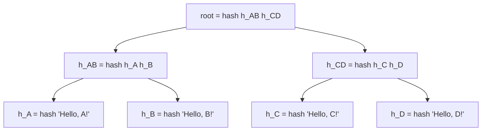
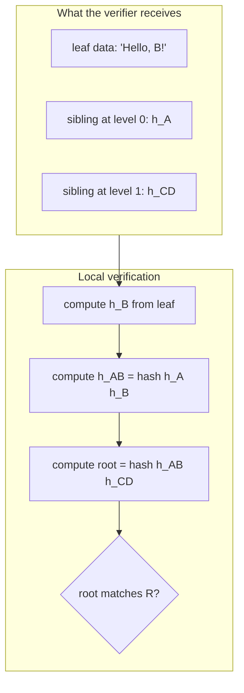
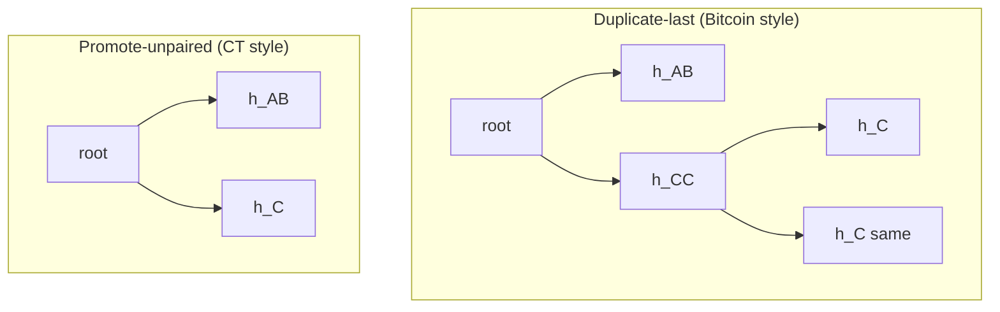
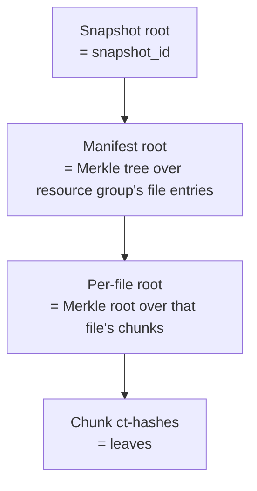

# Merkle Trees — A Deep but Friendly Guide

> Standalone reference. Covers the problem Merkle trees solve, how
> they work from first principles, worked examples, the properties
> they give you, real-world systems that use them, and common
> pitfalls.
>
> Used as a reference from:
> - [`umbrel-home/`](umbrel-home/) — end-to-end encrypted device backup.
>
> If you want the design-level summary of how this specific backup
> system uses Merkle roots (for file content, snapshots, and manifest
> integrity), see
> [`umbrel-home/docs/pipeline-06-storage.md`](umbrel-home/docs/pipeline-06-storage.md)
> and
> [`umbrel-home/docs/pipeline-02-file-capture.md`](umbrel-home/docs/pipeline-02-file-capture.md).

## 1. The problem in one sentence

> "I have a big pile of data. I want a small fingerprint that commits
> to the whole pile, but I also want to later prove one item is part
> of the pile without shipping the whole pile around."

That's it. That's the whole motivation. Every Merkle tree you see in
the wild — Git, Bitcoin, BitTorrent, certificate transparency,
backup dedup tools, IPFS, Ethereum — is solving this exact problem
for a different pile of data.

## 2. Why the obvious approaches fail

Imagine a library of 1,000,000 photos and you want to prove to a
friend that photo #42,318 hasn't been tampered with.

### Approach A: Hash the whole library

```text
fingerprint = hash(photo_1 || photo_2 || ... || photo_1000000)
```

Works for detecting *any* change — if a single byte flips, the hash
changes. But to verify photo #42,318 specifically, your friend has
to re-hash **the entire library**. Useless for per-item proofs.

### Approach B: Hash each photo separately

```text
h_1 = hash(photo_1)
h_2 = hash(photo_2)
...
h_1000000 = hash(photo_1000000)
```

Now per-item proof is cheap — show photo_42318, compute h_42318,
compare. But there are a million hashes to keep track of. No single
"one fingerprint" that commits to the whole library.

### The Merkle trick: pair and re-hash, recursively

Take the million individual hashes, pair them up, hash each pair:

```text
level 0 (leaves):   h_1   h_2   h_3   h_4   ...   (1,000,000 hashes)
level 1:            h_12  h_34  ...              (500,000 hashes)
level 2:            h_1234 ...                   (250,000 hashes)
...
level N:            root                          (1 hash)
```

Where `h_12 = hash(h_1 || h_2)`, `h_34 = hash(h_3 || h_4)`, etc.

One hash at the top: check.

Per-item proof: to prove photo #42,318 belongs to a tree with root
`R`, you only need **log₂(1,000,000) ≈ 20** sibling hashes along the
path from the leaf to the root — not a million. Your friend can
verify locally in microseconds.

That's the whole idea. The rest of this doc is mechanics, examples,
and applications.

## 3. Worked example — 4 files, by hand

Say we have four small files: `A.txt`, `B.txt`, `C.txt`, `D.txt`.

### Step 1: hash each leaf

```text
h_A = hash("Hello, A!")    // let's say this is 0xa1b2...
h_B = hash("Hello, B!")    //                     0xc3d4...
h_C = hash("Hello, C!")    //                     0xe5f6...
h_D = hash("Hello, D!")    //                     0x7890...
```

(Real hashes are 32 bytes / 256 bits. Abbreviating to 4 chars for
readability.)

### Step 2: hash pairs

```text
h_AB = hash(h_A || h_B)    // concatenate the two hashes, hash again
h_CD = hash(h_C || h_D)
```

### Step 3: hash the pairs of pairs

```text
root = hash(h_AB || h_CD)
```

### Visual



Four files, three internal-node hashes, one root. Seven hashes
total. Shape of a tree; hence "Merkle **tree**."

### What changes if `B.txt` is edited?

Edit `B.txt` to `"Hello, B2!"`. Now:

```text
h_B' = hash("Hello, B2!")            ≠ h_B
h_AB' = hash(h_A || h_B')            ≠ h_AB
root' = hash(h_AB' || h_CD)          ≠ root
```

The root changed. **Any single-byte change anywhere in any leaf
propagates all the way to the root.** That's the "tamper-evident
fingerprint" property.

But notice: `h_CD` is unchanged. The `CD` half of the tree didn't
need to be re-computed. This is the "dedup" property that backup
systems love.

## 4. Membership proofs (the feature that justifies the whole thing)

Given just the root `R` and a claim "photo #42,318 has content X,"
how does a verifier check without the whole library?

Recall our 4-file tree, and suppose someone claims: *"`B.txt`
contains `'Hello, B!'` and it belongs to the tree with root R."*

### What the verifier needs

- The claimed content: `"Hello, B!"`
- The *sibling hash at each level on the way up* — just those:
  - Sibling at leaf level: `h_A` (sibling of `h_B`)
  - Sibling at level 1: `h_CD` (sibling of `h_AB`)

That's **2 hashes** for a 4-leaf tree. In general: **log₂(N) hashes**
for N leaves.

### The verification, step by step

```text
step 1: compute leaf hash
  h_B_claimed = hash("Hello, B!")
  
step 2: combine with provided sibling
  h_AB_claimed = hash(h_A || h_B_claimed)
  
step 3: combine with next sibling up
  root_claimed = hash(h_AB_claimed || h_CD)
  
step 4: compare
  root_claimed == R ?
```

If the final hash matches `R`, the claim is cryptographically
verified. If any of the intermediate hashes or the leaf content had
been tampered with, the final root wouldn't match.

### Why this is powerful

- **Proof size is logarithmic.** A tree with 1 million leaves needs
  ~20 sibling hashes per proof. A tree with 1 billion needs ~30.
  Hashes are ~32 bytes, so proofs are under 1 KB regardless of how
  huge the tree is.
- **Verifier needs only the root.** If you trust the root came from
  a legitimate source (signed, pinned in a blockchain, etc.), you
  don't need to trust the prover at all — the math speaks.



## 5. Handling edge cases

### Odd number of leaves

What if you have 5 files instead of 4? The tree can't pair them
evenly. Two common fixes:

1. **Duplicate the last leaf.** Bitcoin does this — if there's an
   odd leaf, hash it with itself (`hash(h_last || h_last)`) to make
   a fake pair. Simple but occasionally produces the same root from
   two different inputs; Bitcoin's particular construction prevents
   this from being exploitable, but be careful.
2. **Promote unpaired nodes up unchanged.** More robust. An
   unpaired node at one level just moves up to the next level
   without being combined. This is what Certificate Transparency
   does.



Either works. The choice is a design detail; callers need to know
which convention a given system uses so they can reproduce the root
deterministically.

### Empty tree

Usually defined as a specific constant: `hash("")` or a dedicated
"empty Merkle root" sentinel. Most systems just declare "the empty
root is X" and move on.

### Tree with one leaf

Just `hash(leaf)` — the leaf's hash is the root. No internal nodes.

## 6. Shapes of Merkle trees

### Binary (the classic)

What we've been drawing. Each internal node has exactly two
children. Simple, symmetric, easy to reason about.

### N-ary (wider fanout)

Each internal node has N children instead of 2. Produces shallower
trees (`log_N(leaves)` depth instead of `log_2`), so fewer levels,
smaller proofs if N is moderate. But each proof step needs N-1
sibling hashes instead of 1 — so total proof size is roughly the
same for similar tree sizes.

Used where shallower trees help caching or where the underlying
data already has a natural N-ary structure (file trees, B-trees).

### Imbalanced / left-heavy

Useful when leaves arrive over time: append a new leaf cheaply by
building only the rightmost spine up to the root. Certificate
Transparency logs use this because certs stream in continuously.

### Merkle Patricia tries (Ethereum)

A hybrid of a radix trie and a Merkle tree. Each node is hashed,
but the tree structure itself encodes the keys — letting you prove
"key X maps to value Y" instead of just "Y is somewhere in the
tree." Ethereum's state tree and storage trees use this.

For most purposes (backups, repos, block proofs), the plain binary
Merkle tree is what you want.

## 7. The one property that enables everything

Phrased carefully, the property is:

> **Changing any byte of any leaf, or the order of any two leaves,
> produces a completely different root — with overwhelming
> probability, given a cryptographic hash.**

Two implications:

1. **Commitment.** The root is a tiny (~32-byte) fingerprint that
   commits to the whole tree. If you publish the root, you can't
   later swap anything in without being caught.
2. **Order matters.** `hash(h1 || h2)` is not the same as
   `hash(h2 || h1)`. Trees with the same leaves in different order
   have different roots. This means when you build a Merkle tree,
   you have to commit to an ordering.

## 8. Where Merkle trees show up in the wild

### Git

Every Git commit is a root hash over a tree-of-hashes:
- Each file's content is hashed → blob object.
- Each directory is hashed over its children (names + hashes) → tree object.
- A commit points to one top-level tree + parent commit hashes.

When you `git fetch`, the client says "I have root R1, send me
everything reachable from R2 but not from R1." The server walks the
tree and ships only the missing objects. Same dedup property: two
commits that share a directory share the directory's tree object
by hash.

### Bitcoin & most cryptocurrencies

Each block's header contains a Merkle root over the transactions in
that block. A light client can verify "my transaction is in block X"
by downloading the ~80-byte block header and a 20-hash proof — not
the whole block. This is how mobile wallets work.

### BitTorrent

Every piece of a torrented file has a hash. Originally these were
just a flat list in the torrent file. Modern BitTorrent v2 uses
Merkle trees so clients can verify partial downloads incrementally
and request only the sibling hashes they need.

### Certificate Transparency

Every SSL/TLS certificate issued by a public CA is logged in an
append-only Merkle-tree log. Browsers can verify "this certificate
appears in the public log" before trusting it. Misissued certs get
caught by anyone watching the logs.

### Content-addressed backup tools

restic, borgbackup, Kopia, Tarsnap, duplicacy — every production
dedup backup tool expresses each snapshot as a Merkle tree over
chunks. Our backup system is in exactly this family.

### Filesystems

ZFS, Btrfs, and APFS use Merkle trees internally for end-to-end
block checksumming. Apple's "signed system volume" in macOS uses a
Merkle tree over the OS files so boot integrity can be verified in
one hash comparison.

### Distributed databases

Cassandra, DynamoDB, and Riak use Merkle trees for **anti-entropy
repair**: two replicas exchange Merkle roots, walk down where they
differ, and only re-sync the divergent branches. Classic example of
the "find the difference" property.

### IPFS

Every file and every directory in IPFS is content-addressed by a
Merkle hash. The whole system is built on this primitive.

### Ethereum

State tree, transaction tree, receipts tree — all Merkle. The
block header commits to three roots, one for each. Light clients
use these to prove anything about the chain without downloading it.

## 9. How this repo's backup system uses Merkle trees

Three levels of Merkle roots stacked on top of each other:



### Level 1 — per-file content root (`last_chunk_root`)

Each file's bytes are split by content-defined chunking into ~1 MB
chunks. Each chunk is encrypted; each ciphertext has a `ct-hash`.
The file's **`last_chunk_root`** is a Merkle root over that ordered
list of `ct-hash`es. Stored in the walker's local state DB. 32
bytes per file.

Lets the walker detect "mtime changed but content didn't" with a
single 32-byte comparison. Details:
[`umbrel-home/docs/pipeline-02-file-capture.md`](umbrel-home/docs/pipeline-02-file-capture.md#last_chunk_root-is-a-32-byte-hash-not-the-file-data).

### Level 2 — per-resource-group manifest tree

Each Umbrel app is a "resource group." Its encrypted manifest is
itself a Merkle tree whose leaves are per-file entries
`(path, size, mtime, mode, chunk_roots[])` and per-DB entries. The
manifest's internal nodes are subtree hashes per directory, so
unchanged subdirectories share sub-manifests with the previous
snapshot — same dedup trick applied to the structure of the file
tree itself.

### Level 3 — snapshot root (the `snapshot_id`)

The manifest's root hash **is** the snapshot ID. A snapshot is
uniquely identified by the Merkle root of its content, period.

This gives us, for free:

- **Idempotent commits.** `POST /snapshots {root: R}` is a no-op
  if the server already has a snapshot with root `R` — duplicate
  commits can't create duplicate snapshots. The server just returns
  the existing snapshot.
- **Tamper-evident parent chain.** Each snapshot row stores the
  parent's root. The client can walk the chain and verify no root
  in the history has been altered — the hashes wouldn't match.
- **Per-file integrity proofs on restore.** Because the file
  content root is itself a Merkle root, a client restoring a single
  file can verify that file's chunks haven't been swapped by the
  server, using only log₂(chunks) sibling hashes.

Full schema and event-translation:
[`umbrel-home/docs/pipeline-06-storage.md`](umbrel-home/docs/pipeline-06-storage.md#metadata-db-schema).

## 10. Common pitfalls (and how grown-up systems avoid them)

### Second-preimage attacks

Naive Merkle construction lets an attacker find a different tree
that hashes to the same root, by exploiting the fact that hash
function inputs of different shape can collide when concatenated.

Mitigation: **domain separation**. Hash leaves and internal nodes
with different prefixes. Certificate Transparency does:

```text
leaf:     hash(0x00 || leaf_content)
internal: hash(0x01 || left_child || right_child)
```

The prefix byte makes it impossible for a leaf to be mistaken for
an internal node during verification.

### Ordering bugs

Because `hash(a || b) ≠ hash(b || a)`, a Merkle tree with the same
leaves in different order produces a different root. If two parties
disagree on ordering, they'll compute different roots for "the same"
data. Spec the ordering unambiguously (alphabetical, by hash,
insertion order — whatever, just pick one and document it).

### Length-extension attacks

Certain older hash functions (SHA-1, SHA-256 used naively) allow an
attacker to append data to a message without knowing the original
message. For Merkle trees this is rarely directly exploitable, but
it's why modern systems prefer BLAKE3, SHA-3, or SHA-256 with HMAC
framing.

### Forgetting to commit to structure

If your tree can have variable shape (odd-leaf handling, balanced vs
unbalanced), and you don't commit to *which* shape was used, two
trees with different shapes but the same leaf hashes can collide.
The fix is to encode structure into the hashes themselves (e.g.,
include the leaf count, or use a canonical balancing rule).

### Hash collisions aren't a real concern

With a 256-bit cryptographic hash, the probability of accidentally
producing two inputs with the same hash is negligible — on the
order of 1 in 2¹²⁸. For planning purposes, assume collisions don't
happen. The real attacks are always structural, not statistical.

## 11. When *not* to use a Merkle tree

- **You only need integrity of a single blob.** A plain hash is
  simpler and smaller.
- **You need random-access read by key.** Merkle trees are
  authenticators, not indexes. You need a separate data structure
  (or a Merkle Patricia trie) to map keys to values.
- **The data is a true stream with no pre-committed end.** You can
  still build a Merkle tree incrementally (see CT logs) but you
  have to accept that "the root" changes every time you append.

## 12. Key properties at a glance

| Property | Value |
|---|---|
| Commitment size | Constant (the hash size, e.g. 32 bytes for SHA-256 / BLAKE3) |
| Proof size | O(log N) hashes, where N is the number of leaves |
| Build cost | O(N) hash operations |
| Verify cost | O(log N) hash operations |
| Update cost (change one leaf) | O(log N) re-hashes along the path |
| Shared subtrees across roots | Automatic — unchanged subtrees produce the same subtree hash, so they dedup |

## 13. Further reading

- **Ralph Merkle's 1979 PhD thesis** — the original, surprisingly
  readable.
- **Bitcoin whitepaper, §7** — one-page explanation of transaction
  Merkle trees.
- **RFC 6962 (Certificate Transparency)** — the canonical modern
  spec for append-only Merkle logs, with clear tree-shape and
  proof-format definitions.
- **"Efficient Data Structures for Tamper-Evident Logging"**
  (Crosby & Wallach, 2009) — the paper CT's log structure is based
  on.
- **BLAKE3 paper** — the currently-recommended hash for new Merkle
  constructions; it has Merkle-mode built in.
- **Git internals chapter** in Pro Git — walks through how Git's
  tree/blob/commit objects compose into a Merkle DAG.

## 14. TL;DR for the hurried reader

- A Merkle tree is "hash pairs of hashes all the way up to one root."
- The root is a ~32-byte fingerprint that commits to every leaf.
- You can prove any one leaf belongs to the root with only
  `log₂(N)` sibling hashes — tiny even for billion-item collections.
- Any change anywhere in the leaves changes the root. Unchanged
  subtrees produce the same subtree hash — automatic dedup.
- Used everywhere content-addressing, integrity, or "prove one item
  is in a big collection" matters: Git, Bitcoin, BitTorrent, CT,
  ZFS, backups, IPFS, Ethereum.
- This repo's backup system stacks three levels of Merkle roots:
  per-file content, per-resource-group manifest, per-snapshot
  identity. Every durability, dedup, and tamper-detection property
  in that design traces back to this one primitive.
