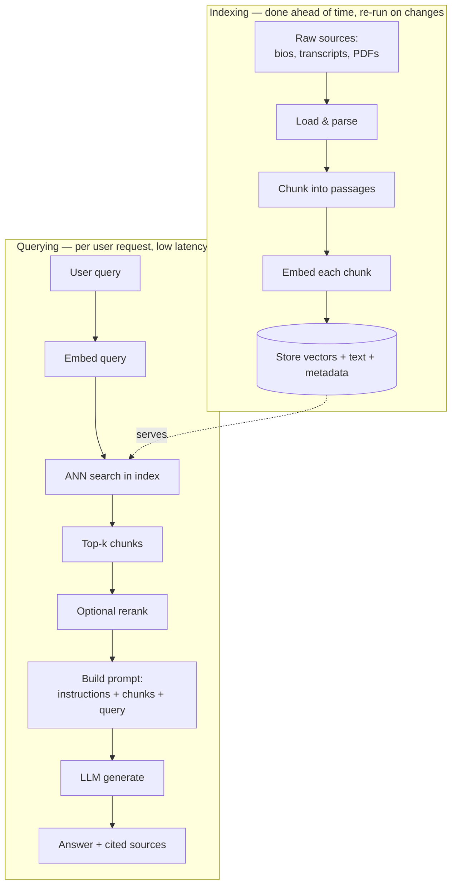
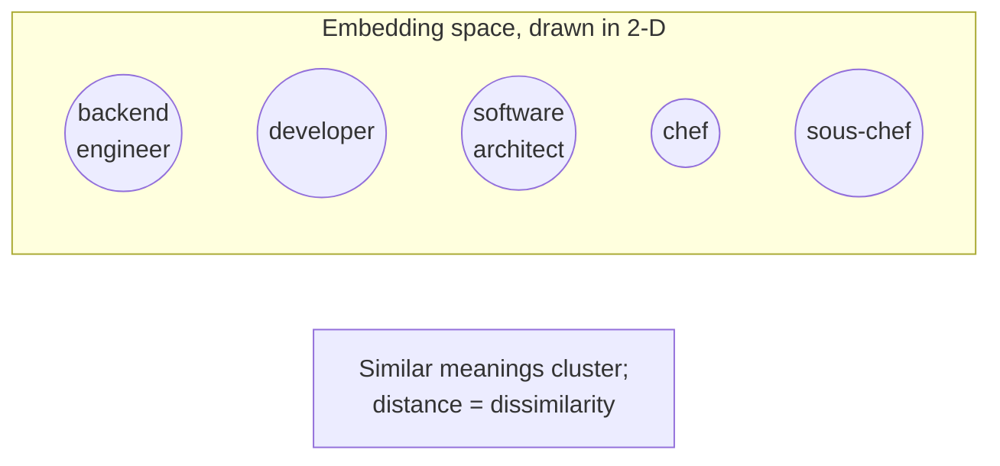
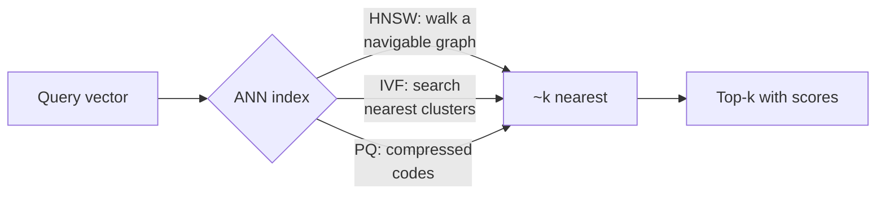
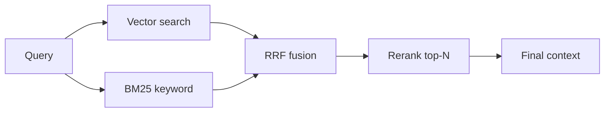
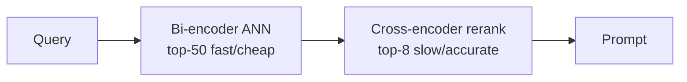
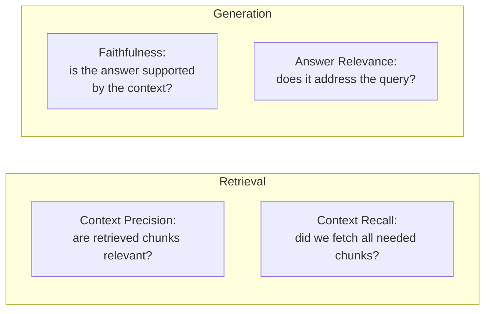

# RAG Guide — Chapter 1: Foundations

> How a RAG pipeline is *actually* built, from raw documents to a grounded
> answer. We walk the whole loop — **load → chunk → embed → index → retrieve →
> rerank → augment → generate** — explain the ML you need (embeddings, vector
> similarity, approximate nearest neighbour), and end with how to tell whether
> your RAG is any good. Everything is grounded in **PeopleFinder** (see the
> [README](README.md)).

---

## 1.1 The problem RAG solves, precisely

An LLM is a function `answer = f(prompt)`. Its weights are frozen at training
time. So it cannot know:

- **Your private data** (PeopleFinder's 50k bios were never on the public web).
- **Anything newer than its cutoff** (the candidate you added yesterday).
- **Facts too specific to have been memorized** (which of three "Maria K."s
  speaks Ukrainian).

You have three ways to get your data into that function:

1. **Put it in the weights** (fine-tuning) — expensive, goes stale, hard to cite.
2. **Put it all in the prompt** (long context) — pay per token every call, and
   models get "lost in the middle" of huge prompts.
3. **Put the _relevant slice_ in the prompt, chosen per query** — this is RAG.

RAG wins whenever the corpus is larger than a prompt, changes over time, must
stay private, or needs **citations**. The whole engineering challenge reduces to
one question: *given a query, how do we find the few passages that will let the
model answer well?*

## 1.2 The two phases: indexing (offline) and querying (online)



Keep these phases mentally separate. **Indexing** is a batch/streaming ETL job —
you optimize it for throughput and correctness, and you re-run it when data
changes. **Querying** is a request path — you optimize it for latency and
answer quality. Most beginner mistakes come from blurring the two (e.g. doing
expensive parsing at query time, or embedding queries with a different model
than the chunks).

## 1.3 Load & parse

Before anything, you turn heterogeneous sources into clean text (plus retained
metadata). For PeopleFinder:

- Bios / notes → already text; keep `person_id`, `field`, `updated_at`.
- Interview **transcripts** → from audio via a speech-to-text model (Whisper);
  keep speaker turns and timestamps.
- **PDFs / résumés** → layout-aware extraction (tables, columns) matters far
  more than people expect; a naive text dump scrambles two-column CVs.
- **Photos / video** → handled in [Chapter 3](03-multimodal-rag.md); here we
  care about the text you *derive* (captions, OCR, transcripts).

**Metadata is not optional.** Every chunk should carry enough to (a) filter
(`language = uk`, `location = Berlin`), (b) cite (which person, which document),
and (c) re-rank or expire (`updated_at`). Metadata filtering is often the
single biggest quality lever — see [Chapter 5](05-vector-databases.md).

## 1.4 Chunking — the most underrated step

You cannot embed a whole 20-page transcript as one vector and expect precise
retrieval; a single vector can only represent one "idea" well. So you split text
into **chunks** — passages small enough to be topically coherent, large enough
to be self-contained.

**Strategies, roughly in order of sophistication:**

| Strategy | How | Good for | Watch out |
|---|---|---|---|
| Fixed-size | N tokens with M-token overlap | Baseline, uniform text | Cuts mid-sentence/idea |
| Recursive | Split on ¶ → sentence → word until under N | General text (default) | Still ignores meaning |
| Document-structure | Split on headings/sections/speaker turns | Markdown, transcripts, CVs | Needs structured input |
| Semantic | Split where embedding similarity drops | Dense prose, mixed topics | Extra embedding cost at index time |
| Late / contextual | Add a short doc-level summary to each chunk (see §1.4.1) | Fragments that lose context | More tokens per chunk |

**Rules of thumb:** start with recursive chunking at ~**256–512 tokens** with
**10–15% overlap**. Overlap prevents an answer that straddles a boundary from
being lost. Bigger chunks = better recall of context but worse precision and
more tokens in the prompt; smaller chunks = sharper matches but risk losing the
surrounding meaning.

### 1.4.1 Contextual retrieval (the cheap, big win)

A chunk like *"She led the migration in Q3"* is useless out of context — *who*
is "she"? **Contextual chunking** prepends a short, LLM- or template-generated
blurb to each chunk before embedding: *"[Maria K., Project Atlas bio] She led
the migration in Q3."* This single trick sharply improves retrieval on
fragmented corpora and is why we thread `person_id`/name into every PeopleFinder
chunk. ([Chapter 2](02-evolution-and-types.md) covers the advanced variants.)

## 1.5 Embeddings — turning meaning into geometry

An **embedding model** maps a piece of text (or image, or audio) to a vector of
floats — typically **384 to 1536** dimensions — such that *things that mean
similar things land near each other*. "Ukrainian-speaking engineer" and
"розробник, розмовляє українською" should be close; "engineer" and "train
engineer" should be farther than "engineer" and "developer".



Key properties you must respect:

- **Same model for chunks and queries.** Vectors from two different models live
  in incompatible spaces. Change the model → re-embed *everything*.
- **Dimension is fixed** by the model (e.g. `bge-small` = 384, `bge-large` =
  1024). Higher dims can capture more nuance but cost more storage and compute.
- **Normalization & metric.** Most models are trained for **cosine similarity**
  (angle between vectors) or **dot product**. Use the metric the model card
  specifies; mixing them silently degrades results.
- **Context window.** Embedding models truncate long inputs (often 512 tokens) —
  another reason to chunk.

Which model to pick (BGE, E5, GTE, Nomic, Jina, and multilingual options) is
[Chapter 4](04-models.md). For now: a small open model like `bge-small-en` or
multilingual `bge-m3` runs on CPU and is plenty to start.

## 1.6 Vector search — nearest neighbours, fast

Retrieval = "find the k chunk-vectors closest to the query-vector." Exact search
(**kNN**) compares the query to *every* vector — fine for 10k vectors, far too
slow for millions. So we use **ANN** (Approximate Nearest Neighbour) indexes
that trade a little recall for orders-of-magnitude speed.



- **HNSW** (Hierarchical Navigable Small World) — a layered graph you greedily
  walk; the default in most vector DBs. Great recall/latency; higher RAM.
- **IVF** (Inverted File) — cluster vectors, search only the nearest clusters;
  smaller memory, tune `nprobe` for recall.
- **PQ** (Product Quantization) — compress vectors into short codes; huge memory
  savings at some accuracy cost. Essential on edge devices ([Ch. 9](09-edge-devices.md)).

You rarely implement these — FAISS, Qdrant, pgvector, etc. do it. But knowing
the three families explains every knob you'll tune (`ef_search`, `nprobe`,
`m`, `nlist`). See [Chapter 5](05-vector-databases.md).

## 1.7 Hybrid search — vectors are not enough

Pure vector search is *semantic* — great at "developer" ≈ "engineer", bad at
exact tokens: a part number, a rare surname, "Project Atlas". **Keyword search**
(BM25/full-text) nails those but misses paraphrases. **Hybrid** runs both and
fuses the scores — usually with **Reciprocal Rank Fusion (RRF)**, which just
adds `1/(k + rank)` across lists, needing no score calibration.



For PeopleFinder, hybrid is non-negotiable: "Ukrainian-speaking **Kubernetes**
engineer" needs the semantic sense *and* the exact token "Kubernetes".

## 1.8 Reranking — cheap precision at the end

ANN gives you, say, the top **50** candidates fast but imprecisely. A
**cross-encoder reranker** then scores each (query, chunk) *pair* jointly — far
more accurate than comparing two independent vectors — and you keep the top
**5–8** for the prompt. This two-stage "retrieve wide, rerank narrow" pattern is
the highest-ROI upgrade over naive RAG.



Rerankers (`bge-reranker`, `mxbai-rerank`, ColBERT-style late interaction) are
in [Chapter 4](04-models.md).

## 1.9 Augment — building the prompt

Now assemble the final prompt. A robust template:

```text
System: Answer ONLY from the context. If the context is insufficient, say so.
Cite sources by [person_id].

Context:
[1] (Maria K., bio) ...chunk text...
[2] (Ivan P., transcript 12:03) ...chunk text...
...

Question: <user query>
```

What matters here:

- **Grounding instruction** — tell the model to use only the context and to
  admit ignorance. This is your main defence against hallucination.
- **Citations** — number the chunks and ask the model to reference them; you can
  then show the user *where* each claim came from.
- **Order** — put the strongest chunks first *and* last; models attend least to
  the middle ("lost in the middle").
- **Budget** — leave room for the answer; don't fill the whole context window.

## 1.10 Generate

The LLM reads the prompt and produces a grounded answer. Choice of generator
(Llama, Qwen, Mistral, Phi, Gemma; sizes and quantization) is
[Chapter 4](04-models.md). The key RAG-specific point: a **smaller model with
good context often beats a bigger model guessing** — retrieval does the heavy
lifting, so you can self-host a 7–8B model and still get strong answers.

## 1.11 Does it work? Evaluating RAG

You cannot improve what you don't measure. RAG has **two** things to evaluate,
and they fail independently:



- **Retrieval metrics** (precision@k, recall@k, MRR, nDCG) need a small labelled
  set of *query → which chunks are correct*. Build ~50–100 by hand; it pays off.
- **Generation metrics** — **faithfulness** (no claims beyond the context) and
  **answer relevance** — are often scored by an **LLM-as-judge**. Frameworks
  like **RAGAS**, **TruLens**, or **DeepEval** automate this.
- **The golden diagnostic**: when an answer is wrong, ask *"was the right chunk
  even retrieved?"* If no → fix retrieval (chunking, embeddings, hybrid, rerank).
  If yes but the answer is still wrong → fix generation (prompt, model, grounding
  instruction). This one split routes almost every debugging session.

## 1.12 The failure modes you *will* hit

| Symptom | Likely cause | Fix |
|---|---|---|
| Confident but wrong | Weak grounding instruction; missing chunk | Stricter prompt; check retrieval first |
| Misses obvious exact matches | Pure vector, no keyword | Add hybrid/BM25 (§1.7) |
| Right doc, wrong passage | Chunks too big/small; no rerank | Tune chunking; add reranker |
| "She/it" refers to nothing | Chunks lost context | Contextual chunking (§1.4.1) |
| Great in English, bad in Ukrainian | Monolingual embedder | Multilingual model (`bge-m3`) |
| Slow at scale | Exact kNN; no ANN | Proper ANN index ([Ch.5](05-vector-databases.md)) |
| Answers from stale data | No re-index on change | Wire ingestion to updates |

## 1.13 TL;DR

- RAG = **retrieve the relevant slice of your data at query time, put it in the
  prompt**. It beats fine-tuning/long-context when data is private, changing,
  large, or needs citations.
- Two phases: **offline indexing** (load → chunk → embed → store) and **online
  querying** (embed → ANN search → rerank → augment → generate).
- The highest-ROI upgrades over a naive build, in order: **hybrid search**,
  **reranking**, **contextual chunking**, **metadata filtering**, and **actually
  measuring** retrieval vs generation separately.
- Use the **same embedding model** for chunks and queries; pick the ANN index
  and metric your DB/model prescribe.

Next: [Chapter 2 — Evolution & the types of RAG](02-evolution-and-types.md),
where naive RAG grows query rewriting, fusion, self-correction, and agents.
