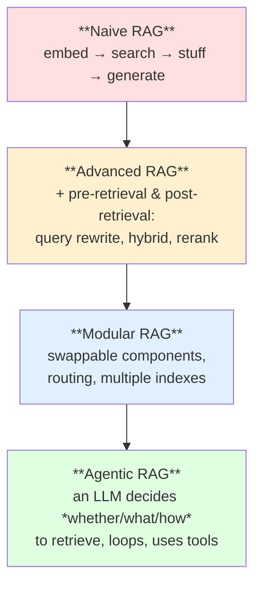
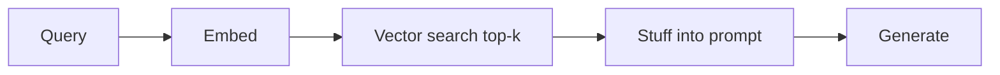
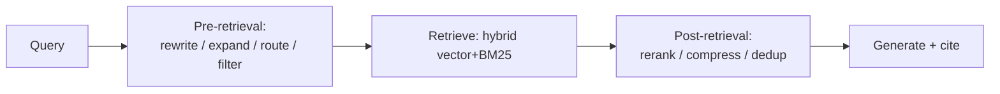
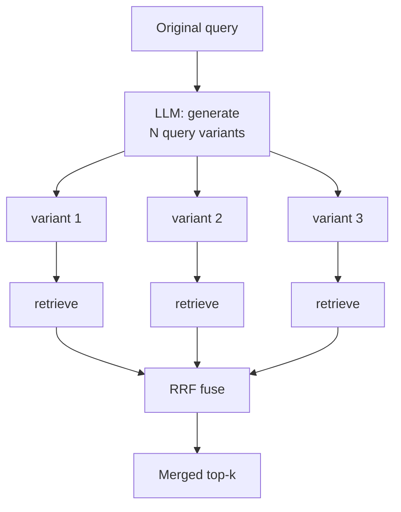
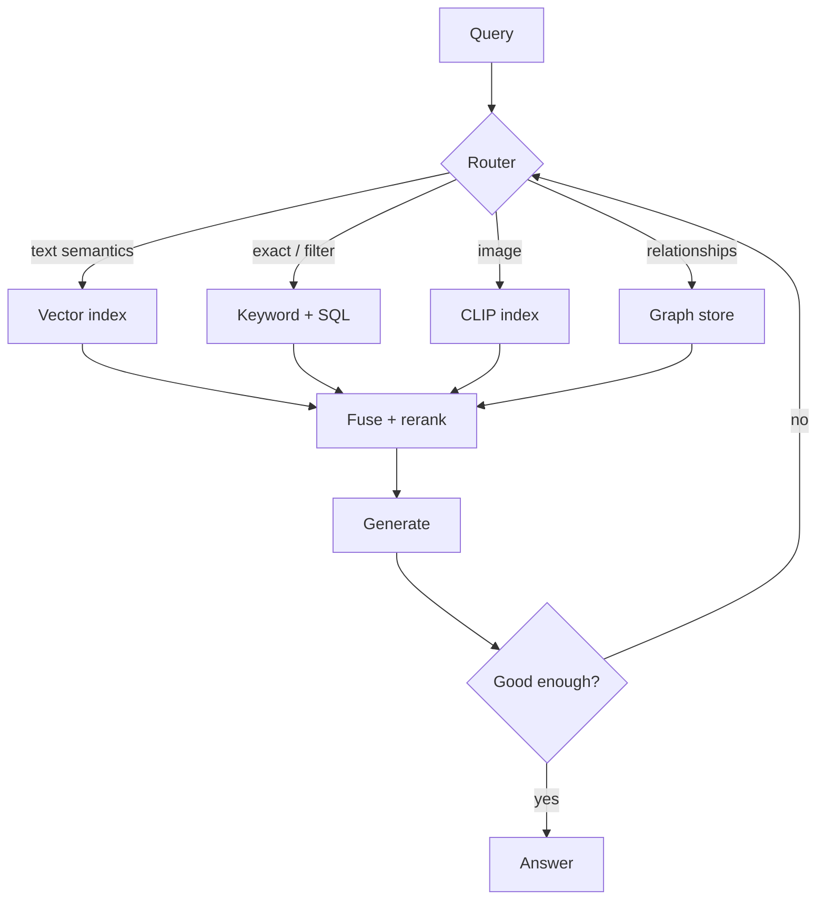
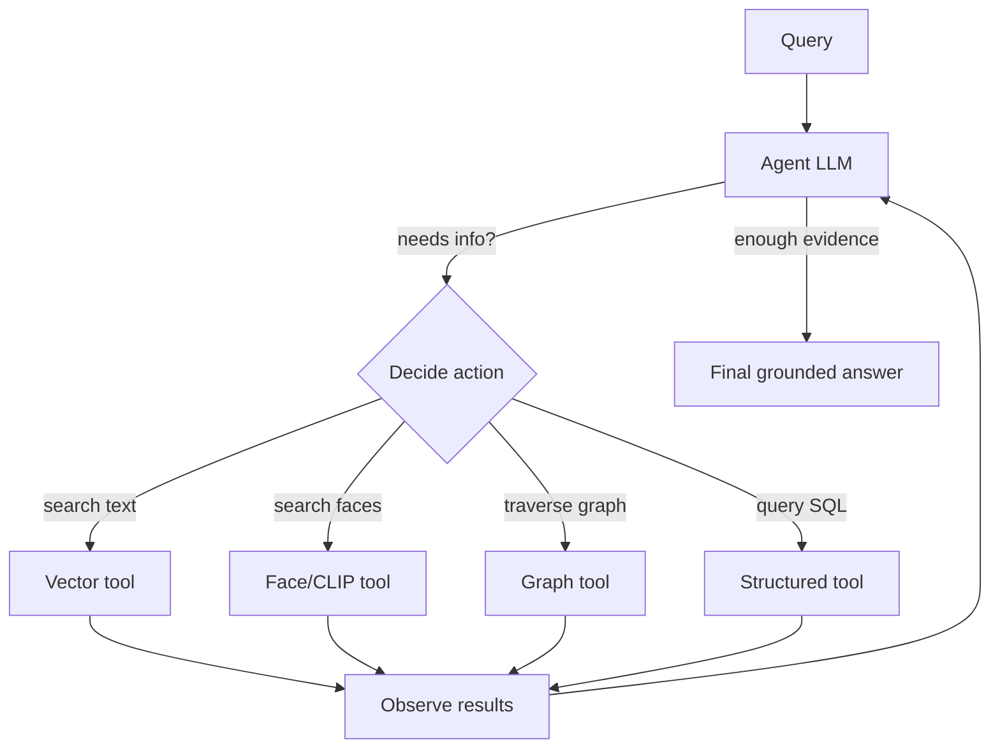
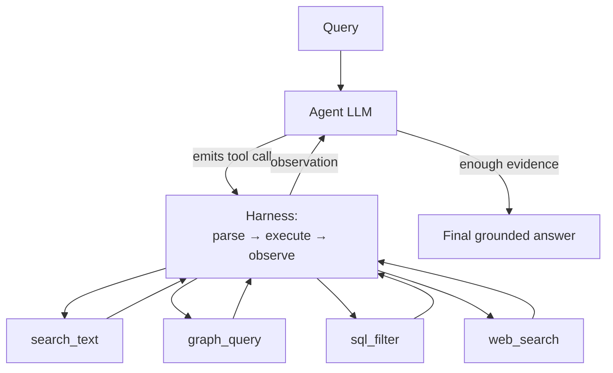
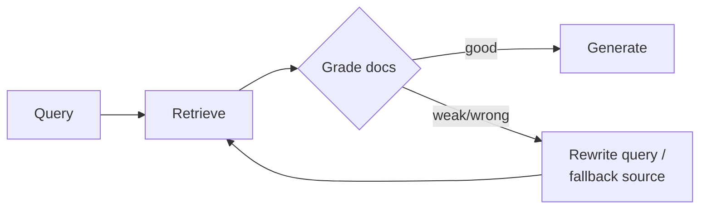

# RAG Guide — Chapter 2: Evolution & the Types of RAG

> RAG didn't arrive fully formed. It grew from "embed some chunks and hope" into
> a family of patterns: **Naive → Advanced → Modular → Agentic**, plus named
> techniques (query rewriting, HyDE, RAG-Fusion, reranking, Self-RAG, Corrective
> RAG, contextual retrieval). This chapter is the map: what each stage adds, when
> you actually need it, and how it looks on **PeopleFinder**. Prerequisites live
> in [Chapter 1](01-foundations.md).

---

## 2.1 The evolution, in one picture

The progression is **not** "always use the newest." Each stage adds capability
*and* cost/latency/complexity. Most production systems live at **Advanced** and
selectively borrow from **Modular/Agentic** where a query type demands it.

**Multimodal is an orthogonal axis, not a fifth rung.** If your data includes
images, audio, or video (PeopleFinder's photos and reels), you *still* pick an
altitude here for the reasoning — but each modality additionally needs its **own
encoder and index** (CLIP for images, Whisper/CLAP for audio, face embeddings for
identity), which a **Modular** router then fuses. So "we need multimodal RAG"
means: build at the altitude your queries require **and** add the per-modality
indexes of [Chapter 3](03-multimodal-rag.md). See the §2.7 table for where it fits.

## 2.2 Naive RAG — the baseline

The original pattern (and still the right *first* build):

**What it gets right:** dead simple, grounds the model in your data, ships in an
afternoon. **Where it breaks:**

- Query and documents use different wording → misses (vocabulary mismatch).
- One retrieval pass, fixed `k` → too little or too much context.
- No exact-match path → whiffs on names, codes, "Project Atlas".
- No relevance check → irrelevant chunks poison the answer.
- No handling of multi-hop questions ("who worked with the person who led Atlas?").

Naive RAG is the *control group*. Build it, measure it ([§1.11](01-foundations.md)),
then add only the machinery that moves your metrics.

## 2.3 Advanced RAG — fix retrieval before and after

"Advanced RAG" is Naive plus **pre-retrieval** and **post-retrieval** stages.
This is where 80% of real quality gains live, at modest cost.

### 2.3.1 Pre-retrieval techniques

- **Query rewriting / expansion** — an LLM cleans up a messy query ("uk speaking
  k8s guy berlin" → "Ukrainian-speaking Kubernetes engineer located in Berlin")
  and/or generates synonyms. Cheap, big recall win.
- **Query decomposition** — split a compound question into sub-queries, retrieve
  each, merge. Needed for "backend engineers in Berlin *who have spoken at a
  conference*" (two constraints, possibly two sources).
- **HyDE (Hypothetical Document Embeddings)** — instead of embedding the short
  query, have the LLM *write a fake ideal answer* and embed **that**; a
  paragraph-shaped vector matches paragraph-shaped chunks better than a
  keyword-shaped query does. Great when queries are terse.
- **Routing** — classify the query and send it to the right index/tool: a photo
  query → CLIP index; a "who-knows-whom" query → the graph
  ([Ch. 7](07-graph-rag.md)); a factual filter → structured DB.
- **Metadata filtering** — turn "in Berlin, speaks Ukrainian" into hard filters
  (`location=Berlin AND 'uk' IN languages`) *before* vector search, so semantics
  only rank the already-eligible set. Frequently the biggest single win.

### 2.3.2 Post-retrieval techniques

- **Reranking** — the retrieve-wide-then-rerank-narrow pattern from
  [§1.8](01-foundations.md); a cross-encoder reorders the top-50 to a precise
  top-8.
- **Contextual compression** — drop or summarize retrieved chunks down to the
  sentences that actually matter, saving prompt budget and reducing noise.
- **Deduplication / diversity (MMR)** — Maximal Marginal Relevance balances
  relevance against novelty so you don't fill the prompt with five near-identical
  chunks about the same person.

### 2.3.3 RAG-Fusion

Generate several query variations, retrieve for each, and fuse the ranked lists
with **Reciprocal Rank Fusion**. More robust than a single query because
different phrasings surface different-but-relevant chunks.

## 2.4 Contextual Retrieval (the 2024 upgrade worth adopting)

A refinement of contextual chunking ([§1.4.1](01-foundations.md)) popularized by
Anthropic: before embedding each chunk, prepend a short, LLM-generated sentence
situating it in its document ("This chunk is from Maria K.'s Project Atlas
retrospective; it discusses the Q3 database migration"). Then index **both** the
contextualized embedding **and** a contextual BM25 term set, and rerank. Reported
to cut retrieval-failure rates substantially versus plain chunking. Costs extra
one-time indexing compute (one small LLM call per chunk) — cache it.

## 2.5 Modular RAG — components you can rewire

At scale, RAG stops being a fixed pipeline and becomes a **graph of swappable
modules**: multiple retrievers, multiple indexes, a router, memory, and
loops/branches. The point is *configurability* — the same system answers a photo
query, a semantic-text query, and a relationship query by routing through
different modules.

PeopleFinder *is* a modular RAG system: one entry point, several indexes, a
router that picks the path per query. You don't need a framework for this, but
this is exactly what [LangGraph/LlamaIndex](06-frameworks-langchain.md) exist to
express.

## 2.6 Agentic RAG — let the model drive retrieval

In everything above, *your code* decides the retrieval steps. In **Agentic RAG**,
an **LLM agent** decides — at run time — whether to retrieve, what to query, which
tool to use, whether the results suffice, and whether to try again. Retrieval
becomes a **tool call in a reasoning loop**.

This unlocks **multi-hop** and **exploratory** questions that single-shot RAG
can't touch: *"Find backend engineers who worked with anyone who led Project
Atlas, and who are available next month."* The agent decomposes it, hits the
graph, then the vector index, then the availability table, and synthesizes.

### 2.6.1 The agent's toolbox — what "tools" actually are

An agent is a generator LLM ([§4.1](04-models.md)) wired to a set of **tools** it
can call. Each tool is a named function with a typed schema (name, description,
arguments) that the model emits a **structured call** for; your code executes it
and feeds the result back. For RAG-over-a-catalog like PeopleFinder the toolbox is
concretely:

| Tool | What it does | Backed by |
|---|---|---|
| `search_text(query, filters)` | Semantic + keyword search over bios/transcripts | Hybrid vector+BM25 ([§1.7](01-foundations.md)) |
| `search_faces(image)` | "Is this person in the catalog?" | Face index ([§3.8](03-multimodal-rag.md)) |
| `search_scene(image_or_text)` | "People photographed on a stage" | CLIP index ([Ch. 3](03-multimodal-rag.md)) |
| `graph_query(entity, relation)` | Traverse relationships (who worked with whom) | Graph store ([Ch. 7](07-graph-rag.md)) |
| `sql_filter(predicate)` | Exact structured lookups (availability, location) | Relational DB |
| `web_search(query)` | Fall back to the open web when the corpus is thin | External (CRAG-style, §2.6.3) |
| `transcribe(clip)` / `read_image(img)` | ASR / VLM to inspect media on demand | Whisper / VLM |

The model reads the question, **decides which tool(s) to call and with what
arguments**, observes the results, and loops until it has enough evidence — which
is how it handles multi-hop: call `graph_query`, then `search_text`, then
`sql_filter`, choosing each step from the last result.

### 2.6.2 The harness — how the loop is actually run

The "harness" is the runtime that drives the model↔tool loop: it exposes the tool
schemas, parses the model's tool calls, executes them, appends observations, and
decides when to stop. Common ways to build it:

- **ReAct** (Reason + Act) — the classic prompt pattern: *Thought → Action(tool)
  → Observation*, repeated until a final answer. Simple, framework-agnostic.
- **Native tool/function calling** — modern LLMs emit structured tool calls
  directly (no brittle text parsing); the harness just dispatches them.
- **LangGraph** — model the loop as an explicit **state graph** (retrieve → grade
  → traverse → generate, with cycles); best when you want control, persistence,
  and branching ([§6.2](06-frameworks-langchain.md)).
- **LlamaIndex agents / query engines** — router, sub-question, and ReAct agents
  purpose-built for retrieval ([§6.3](06-frameworks-langchain.md)).
- **DSPy** — declare the pipeline and let it **optimize** the prompts/tool use.
- **MCP (Model Context Protocol)** — a standard way to *expose* your retriever as
  a tool any agent/client can call, so the same PeopleFinder search serves every
  harness ([§13.3](13-products-and-ai-era.md)).

**Cost of admission:** more latency (multiple LLM turns), more tokens, harder to
make deterministic, and new failure modes (tool-call loops, wrong tool, bad
arguments). Use agentic RAG **selectively** — route only the queries that need it
there; keep the common, simple queries on the fast Advanced path.

### 2.6.3 Self-RAG and Corrective RAG (CRAG) — self-checking loops

Two influential patterns that add a **quality gate** without a full agent:

- **Self-RAG** — the model emits "reflection" signals: *do I even need to
  retrieve? Is this retrieved passage relevant? Is my sentence supported by it?*
  It can skip retrieval for questions it knows, and self-critique for
  faithfulness.
- **Corrective RAG (CRAG)** — a lightweight evaluator grades retrieved docs as
  *correct / ambiguous / wrong*; if they're weak, it **falls back** (e.g. a web
  or broader search) and refines the query before generating. This is the
  pattern that stops "the index had nothing good, so the model made something up."

## 2.7 Choosing your altitude — a decision table

| Your situation | Use |
|---|---|
| First build, need a baseline, prove the concept | **Naive** |
| Real users, quality matters, single-domain corpus | **Advanced** (hybrid + rerank + filtering) — *start here for prod* |
| Queries are terse / vocabulary mismatch | Add **HyDE**, query rewriting |
| **Data includes images / audio / video** | **[Multimodal RAG](03-multimodal-rag.md)** — one index per embedding space (CLIP for images, CLAP/Whisper for audio, faces for identity), routed & fused |
| Multiple content types or indexes (text/image/graph) | **Modular** (routing) |
| Multi-hop, exploratory, or "it depends" questions | **Agentic** (selectively) |
| Hallucination/faithfulness is the top risk | Add **Self-RAG / CRAG** gates |
| Fragmented chunks lose context | **Contextual retrieval** |

**If your data is multimodal**, treat that as an orthogonal axis, not a rung on
this ladder: you still pick an altitude (Naive→Agentic) for the *reasoning*, but
each modality gets its **own encoder and index** and the router fuses them. See
[Chapter 3](03-multimodal-rag.md) — introduced as an orthogonal axis in §2.1 and
central to the PeopleFinder example.

**Guiding principle:** climb this ladder only when a *measured* failure demands
it. Every rung adds latency, cost, and surface area for bugs. The most common
production sweet spot is **Advanced RAG with a router**, escalating specific
query classes to agentic behaviour.

## 2.8 TL;DR

- The lineage is **Naive → Advanced → Modular → Agentic**; it's a menu, not a
  march. Build Naive, measure, then add machinery that moves metrics.
- **Advanced RAG** (query rewriting/HyDE, hybrid search, metadata filtering,
  reranking, compression) delivers most of the real-world gains cheaply.
- **Modular RAG** = routing across multiple indexes/tools — PeopleFinder's shape.
- **Agentic RAG** lets the LLM plan retrieval for multi-hop/exploratory queries;
  powerful but slower and less deterministic — route to it selectively.
- **Self-RAG / CRAG** add self-grading so weak retrieval doesn't become confident
  nonsense; **Contextual Retrieval** fixes context-starved chunks.

Next: [Chapter 3 — Multimodal RAG](03-multimodal-rag.md) — images, audio, video,
and the joint embedding spaces (CLIP, SigLIP, CLAP, NV-CLIP) that make them
searchable.
