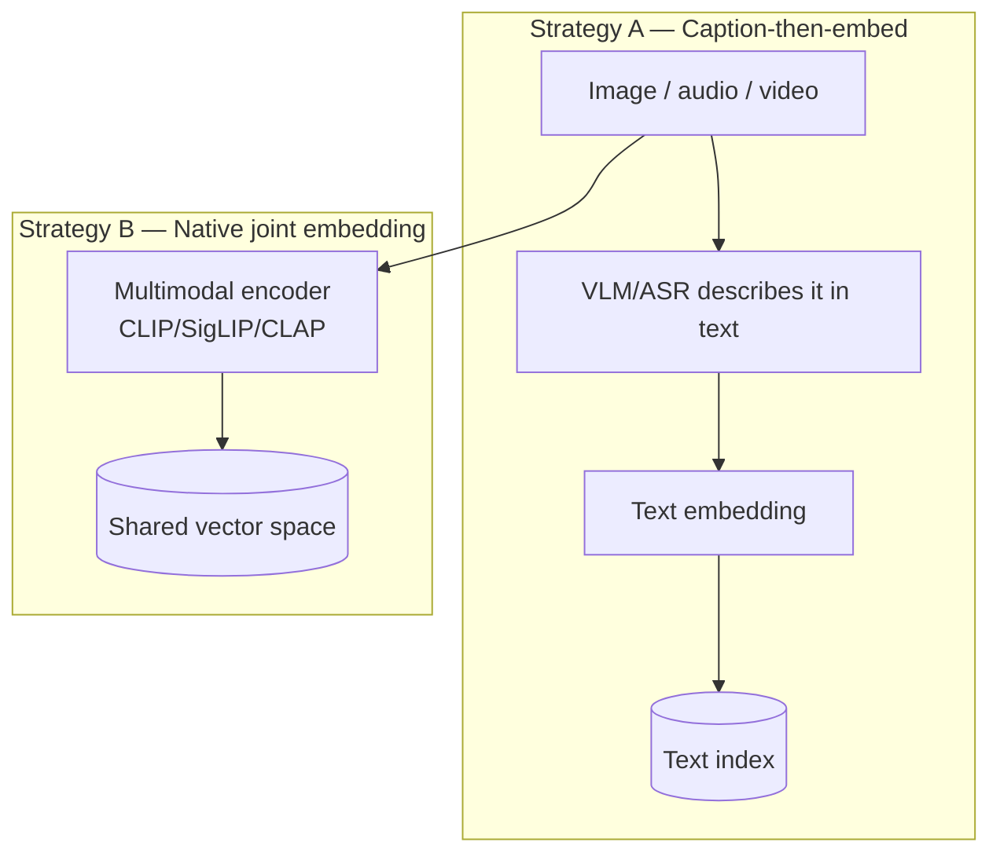
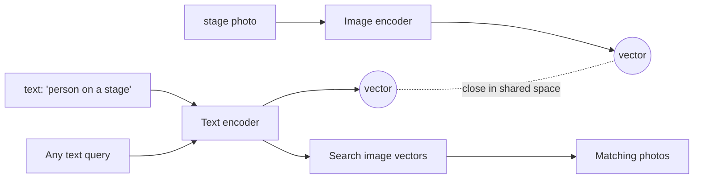
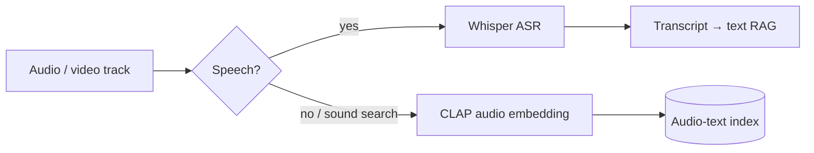
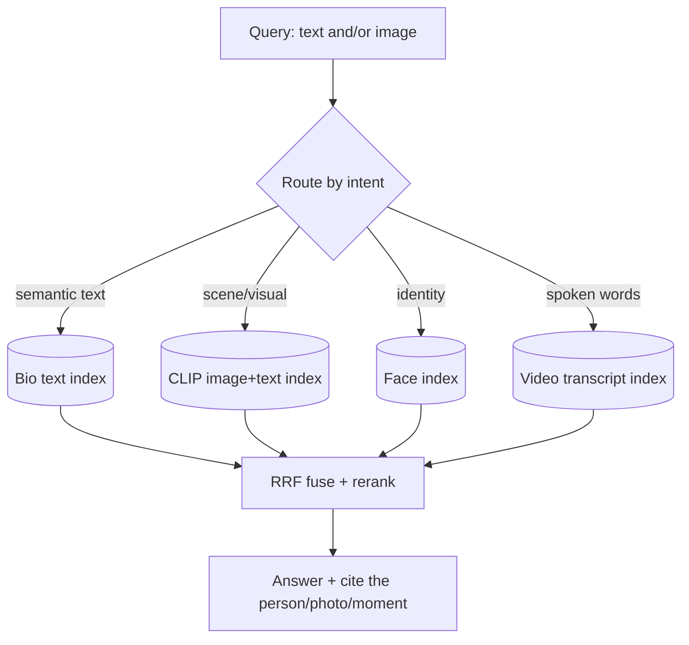

# RAG Guide — Chapter 3: Multimodal RAG

> Text RAG retrieves passages. **Multimodal RAG** retrieves — and reasons over —
> **images, audio, and video** too. The key idea is a **joint embedding space**
> where a photo and the phrase describing it land near each other, so you can
> search images with text (and vice-versa). We cover the two core strategies
> (caption-then-embed vs native joint embeddings), the models you'll actually use
> — **CLIP, OpenCLIP, SigLIP, NV-CLIP, ImageBind, CLAP, ColPali** — the special
> case of **face recognition** (which is *not* CLIP), and how to store and query
> it all. **PeopleFinder** has headshots, event photos, and video reels, so this
> chapter is where it comes alive.

---

## 3.1 Why you need it

PeopleFinder's data isn't just bios. A recruiter wants to:

- **Search photos by text**: *"people photographed outdoors / on a stage / in a
  suit."*
- **Search by photo (identity)**: *"is this the person in this snapshot?"* —
  match a face against the catalog.
- **Search video**: *"who demoed a product on camera?"* — over spoken words *and*
  visual scenes.

None of that works on text alone. You need to turn pixels and audio into vectors
that live in a space you can search — the same retrieve→rerank→generate loop from
[Chapter 1](01-foundations.md), just with more encoders.

## 3.2 The two strategies

There are two fundamentally different ways to make non-text searchable:

| | **A. Caption-then-embed** | **B. Native joint embedding** |
|---|---|---|
| How | A vision-language model (or Whisper) turns media → text, then embed the text | An encoder maps media *and* text into one shared vector space |
| Pros | Reuses your whole text stack; human-readable; great for detailed content | True cross-modal search; captures things captions miss (style, vibe, faces of scenes); cheaper per item |
| Cons | Lossy (caption ≠ image); VLM cost/latency; misses un-described detail | Coarser semantics; can't answer detailed "what's written on the sign" |
| Best for | Documents, charts, detailed scene Q&A | Fast visual similarity, "find images like this", huge libraries |

**Real systems use both.** PeopleFinder embeds photos with CLIP (Strategy B) for
"find outdoor photos", *and* transcribes video with Whisper → text RAG (Strategy
A) for "who mentioned Kubernetes on camera." This mirrors what real apps do —
Immich runs CLIP for visual smart-search *and* recently added OCR (RapidOCR) to
make text-in-images searchable ([Chapter 10](10-on-device-suggestions-and-media.md)).

## 3.3 Joint embedding spaces — how CLIP makes text search images

**CLIP** (Contrastive Language-Image Pre-training) trains an image encoder and a
text encoder *together* so that a matching (image, caption) pair produces nearby
vectors and mismatched pairs are pushed apart. After training, a photo of a
person on a stage and the text "person speaking at a conference" land close — in
the **same** vector space. That's the whole trick that makes cross-modal search
work.

Because text and images share the space, **one CLIP index answers three query
shapes**: text→image ("outdoor photos"), image→image ("more like this photo"),
and image→text (zero-shot labelling). You embed the query with whichever encoder
matches its modality and search the same index.

## 3.4 The multimodal model zoo (self-hostable unless noted)

| Model | Modalities | What it's for | Notes |
|---|---|---|---|
| **CLIP** (OpenAI) | image ↔ text | The original; `ViT-B/32`, `ViT-L/14` | Immich's default is `ViT-B-32__openai` (512-d) |
| **OpenCLIP** (LAION) | image ↔ text | Open re-implementations & bigger trains | Many `arch__pretrain` variants; fully open weights |
| **SigLIP / SigLIP 2** (Google) | image ↔ text | Sigmoid-loss CLIP; stronger accuracy/efficiency | Popular upgrade; LibrePhotos uses SigLIP 2 for zero-shot tagging |
| **NV-CLIP** (NVIDIA) | image ↔ text | Enterprise CLIP; ViT-H/14 (1024-d) & ViT-L (768-d) | **Commercial**, served as a **NIM** microservice; see §3.5 |
| **ImageBind** (Meta) | image, text, **audio**, depth, thermal, IMU | Binds 6 modalities to one space | Search audio/other with text without paired data |
| **CLAP** | **audio ↔ text** | Sound/music/non-speech search | The "CLIP for audio"; see §3.6 |
| **ColPali / ColQwen** | **document pages as images** ↔ text | Visual document retrieval (late interaction) | Skips OCR/parsing — embed the page image directly; see §3.7 |
| **ArcFace / FaceNet** | **face → identity vector** | *Who* is this — **not** CLIP; see §3.8 | 512-d identity embeddings |

**How to choose (image↔text):** start with **OpenCLIP `ViT-B/32`** or **SigLIP**
— both run on CPU/modest GPU and are free. Go bigger (`ViT-L`, SigLIP-L/400M)
only if recall demands it and you have the RAM. Multilingual queries?
Immich's list points the way: `nllb-clip-*` or `XLM-Roberta-ViT-*` variants keep
non-English text in the same space. Reserve **NV-CLIP** for when you're already
on NVIDIA infra and want its accuracy/enterprise licensing.

## 3.5 NV-CLIP — the enterprise option, in detail

**NV-CLIP** is NVIDIA's commercial multimodal embedding model — think "CLIP with
an enterprise license and NVIDIA-grade serving."

- **Backbones:** ViT-H/14 → **1024-dim** embeddings; ViT-L → 768-dim.
- **Input:** RGB **336×336**; trained on ~**700M** images.
- **Zero-shot ImageNet:** ~77.9% top-1 (ViT-H-336) — competitive with strong
  open CLIPs.
- **Serving:** shipped as an **NVIDIA NIM** container (from NGC) with an
  **OpenAI-compatible** `/v1/embeddings` API, built on TensorRT/Triton (FP16).
- **Licensing:** NVIDIA Open Model License (commercial use allowed); the NIM
  distribution is gated behind NVIDIA AI Enterprise.
- **Where it runs:** the NIM microservice targets **datacenter/workstation GPUs**
  (H100/A100/L40S/L4/RTX, ≥16 GB). Despite Jetson appearing on the underlying
  TAO-model's hardware list, **the NIM itself is not a Jetson deployment** — on
  the edge you'd use open CLIP/SigLIP (e.g. via NanoDB, [Ch. 9](09-edge-devices.md)).

> **When to pick NV-CLIP over OpenCLIP/SigLIP:** you're standardizing on NVIDIA
> NIMs, want a supported/licensed model with turnkey TensorRT serving, and run on
> datacenter GPUs. For self-hosted-on-small-hardware (this guide's bias), **open
> CLIP/SigLIP is the default** — free weights, runs anywhere, no gating.

## 3.6 Audio RAG — Whisper vs CLAP

Two very different jobs, two very different tools:

- **Speech** → use **Whisper** (or faster-whisper/distil-whisper): transcribe to
  text, then it's ordinary text RAG. This is how PeopleFinder searches *what
  people said* in interviews and videos. Keep timestamps so you can cite "12:03".
- **Non-speech audio** (a jingle, applause, a dog barking, a music style) →
  **CLAP** embeds audio and text into a shared space, so "upbeat acoustic guitar"
  retrieves matching clips. Overkill for PeopleFinder, essential for a media/music
  library.

## 3.7 Video and documents — sampling and late interaction

- **Video** = images + audio over time. The standard recipe: **sample keyframes**
  (scene-change detection or every N seconds) → embed each with CLIP; **extract
  the audio** → Whisper → transcript chunks. Store both, tagged with the
  timestamp, so a hit points to the exact moment. PeopleFinder indexes a
  candidate's reel this way.
- **Documents as images (ColPali/ColQwen)** — for slide decks, scanned CVs, and
  charts where layout matters, **late-interaction** models embed the *page image*
  into many patch vectors and match them against query-token vectors (ColBERT-
  style). This skips brittle PDF parsing/OCR and often beats it for visually rich
  docs — at the cost of more vectors per page.

## 3.8 Faces are a *different* space — don't use CLIP for identity

A crucial, commonly-missed point: **CLIP tells you a photo contains "a person
outdoors"; it does *not* reliably tell you it's *Maria*.** Identity needs a
dedicated **face recognition** model that produces an embedding where *the same
person's* faces cluster tightly, regardless of pose/lighting.

This detect → align → embed → cluster pipeline is exactly what the real photo
apps ship (Immich: InsightFace `buffalo_l`, RetinaFace + ArcFace, 512-d, DBSCAN;
LibrePhotos: InsightFace SCRFD+ArcFace, HDBSCAN; PhotoPrism: FaceNet, DBSCAN —
all detailed in [Chapter 10](10-on-device-suggestions-and-media.md)). Key
consequences for design:

- **Face embeddings and CLIP embeddings are different spaces** → **separate
  indexes**. "Find people outdoors" hits the CLIP index; "find this person" hits
  the face index. PeopleFinder needs **both**.
- **Licensing caveat:** InsightFace's pretrained models (buffalo/antelope) are
  **non-commercial** — a real trap. Immich redistributes them with special
  permission; if you ship PeopleFinder commercially, check the model licence or
  train/buy a permissively-licensed face model.
- **Faces are sensitive data.** Face recognition triggers biometric-privacy law
  (GDPR/BIPA). Keep it on-device where possible, get consent, and let users opt
  out.

## 3.9 Storing and querying multiple modalities

You **cannot** mix vectors from different models/spaces in one similarity search
— a CLIP vector and an ArcFace vector aren't comparable. So the storage rule is:

> **One index per embedding space** (CLIP-image+text share one; faces get their
> own; text-bios get their own), each with its own dimensionality and metric.
> Route the query to the right index (or several), then **fuse** results.

This is a **Modular RAG** router ([§2.5](02-evolution-and-types.md)) with
multiple typed indexes — precisely PeopleFinder's architecture, assembled fully
in [Chapter 11](11-worked-example-people-catalog.md).

## 3.10 Multimodal generation — VLMs close the loop

Retrieval finds the right photo/clip; a **vision-language model** (LLaVA, Qwen-VL,
MiniCPM-V, Gemma-vision, Llama-vision) can then *look at it* to answer ("does this
person appear to be presenting?") or caption it for Strategy A. On the edge these
run via Ollama/llama.cpp ([Ch. 9](09-edge-devices.md)); PhotoPrism even lets you
point its captioner at a local Ollama VLM ([Ch. 10](10-on-device-suggestions-and-media.md)).

## 3.11 TL;DR

- Multimodal RAG = same retrieve→generate loop, more encoders. The enabler is a
  **joint embedding space** (CLIP) where text can search images.
- Two strategies: **caption-then-embed** (lossy, reuses text stack, great for
  detail) and **native joint embedding** (true cross-modal, cheap, coarser). Use
  both.
- Image↔text: default to **open CLIP/SigLIP**; **NV-CLIP** is the enterprise/NVIDIA
  NIM option for datacenter GPUs. Audio: **Whisper** for speech, **CLAP** for
  sound. Video: keyframes + transcript. Visual docs: **ColPali**.
- **Faces are their own space** — use ArcFace/FaceNet + clustering, keep a
  **separate index**, and mind the **non-commercial licence** and **biometric
  privacy**.
- **One index per embedding space; route and fuse.** Never mix spaces in a single
  search.

Next: [Chapter 4 — Models you can self-host](04-models.md), where we pick the
embedding, reranking, and generator models for real hardware.
