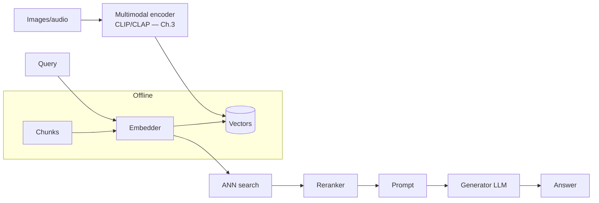
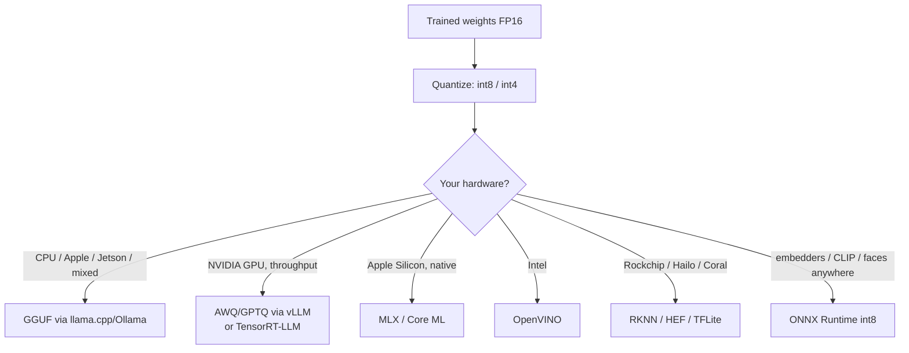
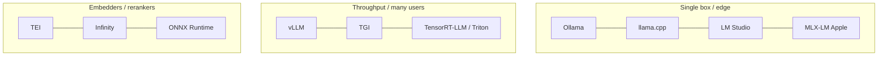

# RAG Guide — Chapter 4: Models You Can Self-Host

> A RAG system runs **four kinds of model**: an **embedder** (text → vector), a
> **reranker** (precisely score query↔chunk pairs), the **multimodal encoders**
> from [Chapter 3](03-multimodal-rag.md), and a **generator LLM** (write the
> grounded answer) — plus **Whisper** for speech. This chapter first says **what
> each of those models actually is**, then names the **open-weights, self-hostable**
> options with sizes and **the hardware they need**, and finally explains the part
> people find murkiest: **quantization and model formats** (GGUF, GPTQ, AWQ,
> TensorRT, Core ML/MLX, ONNX, OpenVINO, RKNN…) — what they are and which hardware
> each targets. Bias throughout: **small resources**, everything downloads from
> Hugging Face.

---

## 4.1 The four roles — and what each model *is*

Plain definitions (the "terms chapter" up front — a fuller glossary is in the
[cheat sheet](99-cheatsheet.md)):

- **Embedding model** (aka *bi-encoder*): a neural net that maps a piece of text
  to a single fixed-length **vector** (e.g. 384–1024 numbers) so similar meanings
  land nearby ([§1.5](01-foundations.md)). Small (30–560M params), runs on CPU.
  Used to *index* chunks and *encode* the query.
- **Reranker** (aka *cross-encoder*): reads a **(query, chunk) pair together** and
  outputs a single relevance score. More accurate than comparing two independent
  embeddings, but you can only run it on a *shortlist* because it's slower
  ([§1.8](01-foundations.md)). ~100–560M params.
- **Generator LLM**: the big **autoregressive decoder** — the "chatbot" model
  (Llama, Qwen, Mistral…). Given the prompt (instructions + retrieved context +
  question), it **generates the answer one token at a time**. This is the model
  that *writes*; retrieval just feeds it. 1B–70B+ params; the expensive one.
- **Multimodal encoder**: maps images/audio into vectors (CLIP, CLAP, ArcFace) —
  [Chapter 3](03-multimodal-rag.md). A **VLM** (vision-language model) is a
  generator LLM that can also *look at* images.
- **ASR** (Whisper): converts **speech → text** so audio becomes text RAG.

> Spend compute on **retrieval quality first** (embedder + reranker) — it caps
> everything downstream. The generator is where you size to your hardware.

## 4.2 Embedding models — and the hardware they need

Judge candidates on the **MTEB** leaderboard (retrieval subset), weighted for
*your* language, chunk length, and hardware.

| Family | Sizes / dims | Why you'd pick it |
|---|---|---|
| **BGE** (BAAI) | small 384-d (~33M) / base 768-d (~110M) / large 1024-d (~335M); **bge-m3** (~560M) | Best all-round open default; **bge-m3** is multilingual **and** does dense+sparse+multi-vector in one model |
| **E5** (Microsoft) | small/base/large; **multilingual-e5** | Strong multilingual; needs `query:` / `passage:` prefixes |
| **GTE** (Alibaba) | small→large; gte-Qwen variants | Competitive; long-context variants |
| **Nomic-embed** | 768-d, **8k context** (~137M) | Long chunks without truncation; fully open |
| **Jina v3** | up to 8k, task-LoRA | Long docs, multiple task modes |
| **Arctic-embed / mxbai-embed** | small→large | Snowflake/Mixedbread; strong, permissive |

**What hardware runs them at good speed** (embedders are small and cheap):

| Model size | CPU (modern x86, batch) | Raspberry Pi 5 | With GPU / ONNX-int8 |
|---|---|---|---|
| small 384-d (~33M) | **hundreds–~1000 texts/s** | ~tens/s | thousands/s |
| base 768-d (~110M) | ~100–300 texts/s | ~5–15/s | many hundreds/s |
| large / m3 (335–560M) | ~20–80 texts/s | slow (precompute only) | GPU recommended |

Takeaways: **small/base run fine on CPU** — a single query embed is sub-10 ms;
bulk indexing of a big corpus wants a GPU or an over-night batch. On a **Pi**, use
small models and **precompute at ingest** ([Ch. 9](09-edge-devices.md)); never
embed in a hot loop. Serve them with **ONNX Runtime** (int8) or **TEI** (§4.7) for
best CPU throughput.

## 4.3 Rerankers

A **cross-encoder** ([§4.1](#41-the-four-roles--and-what-each-model-is)) scores
(query, chunk) pairs jointly — the highest-ROI precision upgrade ([§1.8](01-foundations.md)).

| Reranker | Notes |
|---|---|
| **bge-reranker** (base ~110M / large / **v2-m3** multilingual) | Open default |
| **mxbai-rerank / jina-reranker** | Strong permissive alternatives |
| **ColBERT / ColBERTv2** | **Late interaction** — token-level match; more storage, excellent quality; also a retriever |

**Hardware:** `bge-reranker-base` scores ~30–50 candidates in **tens of ms on
CPU**; latency grows linearly with the shortlist size, so rerank the top-30–50,
not the top-500. GPU helps only at high query volume.

## 4.4 Generator LLMs (open weights)

The **generator** ([§4.1](#41-the-four-roles--and-what-each-model-is)) writes the
answer from retrieved context. For RAG you want strong **instruction-following and
grounding**, not maximum trivia — so a well-retrieved **7–8B** model is often
plenty.

| Family | Useful sizes | Notes / licence |
|---|---|---|
| **Llama 3.x** (Meta) | 8B, 70B | Excellent all-round; Llama Community License |
| **Qwen 2.5** (Alibaba) | 0.5B → 72B | Great multilingual + long context; mostly Apache-2.0 |
| **Mistral** | 7B, Nemo 12B, Small | Efficient; Apache-2.0 on several |
| **Phi-3 / Phi-4** (Microsoft) | mini 3.8B | Punches above its weight; MIT — edge-friendly |
| **Gemma 2 / 3** (Google) | 2B, 9B, 27B | Strong small models; Gemma terms |

The RAM they need depends entirely on **quantization** (§4.6). As a rule of thumb
at 4-bit (GGUF Q4_K_M), a model needs roughly **~0.6 GB per 1B params** plus a bit
for context:

| Hardware | Comfortable generator (Q4) |
|---|---|
| Raspberry Pi 5 (16 GB, CPU) | 3B (Llama 3.2 / Phi-3.5-mini), ~4–9 tok/s |
| Jetson Orin Nano 8 GB | 1–4B |
| Jetson Orin NX 16 GB / 16 GB GPU | **7–8B** (Qwen 2.5 7B, Llama 3.1 8B) |
| AGX Orin 64 GB / 24 GB GPU | 27B–70B |
| Apple M-series (unified mem) | 7B on 16 GB, 70B on 64 GB+ (via MLX/GGUF-Metal) |

> **RAG philosophy:** a **smaller model + great retrieval** beats a bigger model
> guessing. Optimize chunking/hybrid/rerank first, then pick the largest generator
> your hardware runs *comfortably*.

## 4.5 Speech and vision models (recap)

- **Speech → text:** **Whisper** (or **faster-whisper** / **distil-whisper**) —
  transcribe interviews/videos into text RAG; keep timestamps.
- **Multimodal encoders:** CLIP/OpenCLIP/SigLIP (image↔text), CLAP (audio↔text),
  ArcFace/FaceNet (faces) — [Chapter 3](03-multimodal-rag.md).
- **VLMs** (look-at-the-image answers/captions): LLaVA, Qwen-VL, MiniCPM-V,
  Gemma-vision, Llama-vision — served like text LLMs.

## 4.6 Quantization & model formats — what they are and which hardware they target

This is the part that confuses people. Two separate ideas:

### 4.6.1 Precision & quantization (how small the numbers are)

Model weights are trained in **FP32/FP16/BF16** (32- or 16-bit floats).
**Quantization** stores them in **fewer bits** — usually **int8** or **int4** —
cutting memory (and often speeding inference) for a small, usually acceptable
accuracy loss. A 7B model is ~14 GB at FP16 but ~**4.5 GB at 4-bit** — the single
biggest enabler for self-hosting on modest hardware.

| Level | Size vs FP16 | Quality | Use |
|---|---|---|---|
| FP16 / BF16 | 1× (baseline) | Best | GPUs with plenty of VRAM |
| **8-bit (Q8/int8)** | ~½ | Near-lossless | Safe default when RAM allows |
| **4-bit (Q4)** | ~¼ | Slight loss | **The sweet spot for edge/self-host** |
| 2–3-bit | ~⅛ | Noticeable loss | Only when desperate for RAM |

(Note: this is *model-weight* quantization. **Vector** quantization — PQ/scalar/
RaBitQ for the index — is a different thing, covered in [§5.6](05-vector-databases.md).)

### 4.6.2 Model formats & the hardware/runtime each targets

A "format" packages the (often quantized) weights for a specific **runtime**.
Picking the right one is mostly about **what hardware you have**:

| Format | Runtime | Hardware it targets | Notes |
|---|---|---|---|
| **GGUF** | llama.cpp / Ollama | **CPU, any GPU, Apple Metal, Jetson** | The de-facto cross-platform edge format; Q2–Q8; runs almost anywhere |
| **GPTQ** | vLLM, transformers | NVIDIA GPU | 4-bit, calibrated, GPU-only |
| **AWQ** | vLLM, TGI | NVIDIA GPU | Activation-aware 4-bit; good quality/speed |
| **EXL2** (ExLlamaV2) | exllama | NVIDIA GPU | Flexible bitrate, very fast |
| **bitsandbytes** (NF4/int8) | transformers | NVIDIA GPU | On-the-fly quant in PyTorch |
| **TensorRT-LLM / TensorRT** | Triton, **NIM**, Jetson | **NVIDIA only** (datacenter + Jetson) | Compiles to an optimized *engine*; fastest on NVIDIA; powers NV-CLIP/NIM ([§3.5](03-multimodal-rag.md)) |
| **Core ML** (`.mlpackage`) | Core ML | **Apple** (Neural Engine/GPU) | Convert via `coremltools` |
| **MLX** | MLX / MLX-LM | **Apple Silicon** | Apple's native array framework; uses unified memory well |
| **ONNX** | ONNX Runtime | **Cross-platform** (CPU, CUDA, CoreML, OpenVINO EPs) | Best for **embedders/CLIP/faces**; int8 dynamic quant; what Immich/LibrePhotos use |
| **OpenVINO** (IR) | OpenVINO | **Intel** CPU/iGPU/NPU | Immich's Intel accel path |
| **RKNN** | RKNN runtime | **Rockchip** NPUs (RK3588…) | Immich's RKNN accel ([§10.2](10-on-device-suggestions-and-media.md)) |
| **HEF** | Hailo SDK | **Hailo** NPU (Pi AI HAT) | Vision models; [§9.3](09-edge-devices.md) |
| **TFLite (int8)** | TFLite / Coral | **Google Edge TPU / mobile** | Tiny vision models |

**Practical rules:**

- **Generators, edge/mixed hardware → GGUF** (Ollama/llama.cpp). Works on CPU,
  any GPU, Apple Metal, and Jetson; one file, easy.
- **Generators, NVIDIA GPU + concurrency → AWQ/GPTQ on vLLM**, or **TensorRT-LLM**
  for max throughput (and on Jetson, TensorRT is the native fast path).
- **Apple Silicon → MLX or GGUF-Metal.** (Note: Immich's ML explicitly does *not*
  support Core ML — for *some* apps ONNX is the only cross-platform path.)
- **Embedders / rerankers / CLIP / faces → ONNX Runtime** (int8) — it has
  execution providers for CUDA, CoreML, OpenVINO, so one export runs everywhere.
- **Named edge NPUs** (Intel→OpenVINO, Rockchip→RKNN, Hailo→HEF, Coral→TFLite)
  each need their own compiled format — plan for it if you're targeting that chip.

## 4.7 How to serve them

- **Ollama / llama.cpp** — easiest self-host (GGUF), CPU or single GPU, perfect for
  edge/dev; **LM Studio** for a GUI; **MLX-LM** on Apple.
- **vLLM / TGI / TensorRT-LLM** — high-throughput GPU serving (paged attention,
  continuous batching) for concurrent users.
- **TEI / Infinity / ONNX Runtime** — fast embedder/reranker servers.

## 4.8 PeopleFinder's model picks

| Role | Pick | Format / hardware |
|---|---|---|
| Text embedder | **bge-m3** | ONNX int8 on CPU; GPU for bulk indexing |
| Reranker | **bge-reranker-v2-m3** | ONNX on CPU |
| Image↔text | **OpenCLIP ViT-B/32** / SigLIP (NV-CLIP on NVIDIA infra) | ONNX / TensorRT |
| Faces | **InsightFace (ArcFace)** ⚠ licence | ONNX (CUDA/RKNN on edge) |
| Speech | **faster-whisper** | CTranslate2, CPU/GPU |
| Generator | **Qwen 2.5 7B** (server: AWQ/vLLM) / **3B** (Pi: GGUF Q4) | per hardware §4.6 |

## 4.9 TL;DR

- Four roles: **embedder** (small, CPU, `bge-small`→`bge-m3`), **reranker**
  (cross-encoder, big precision win), **multimodal encoders** (Ch. 3),
  **generator** (autoregressive LLM; 7–8B is usually enough with good retrieval).
- **Embedders run on CPU** at hundreds/s (small) — precompute bulk, embed queries
  live; large models want a GPU.
- **Quantization** = fewer bits (int8/int4) → ~¼ the RAM at 4-bit, the key
  self-hosting enabler. Distinct from *vector* quantization ([Ch. 5](05-vector-databases.md)).
- **Formats target hardware:** **GGUF** (anywhere, edge default), **AWQ/GPTQ/
  TensorRT-LLM** (NVIDIA), **MLX/Core ML** (Apple), **ONNX** (embedders/CLIP,
  cross-platform), **OpenVINO/RKNN/HEF/TFLite** (Intel/Rockchip/Hailo/Coral NPUs).
- Serve with **Ollama/llama.cpp** (edge) or **vLLM/TGI/TensorRT-LLM** (scale);
  **TEI/ONNX** for encoders. Mind **licences** (esp. faces).

Next: [Chapter 5 — Vector databases & storage](05-vector-databases.md).
