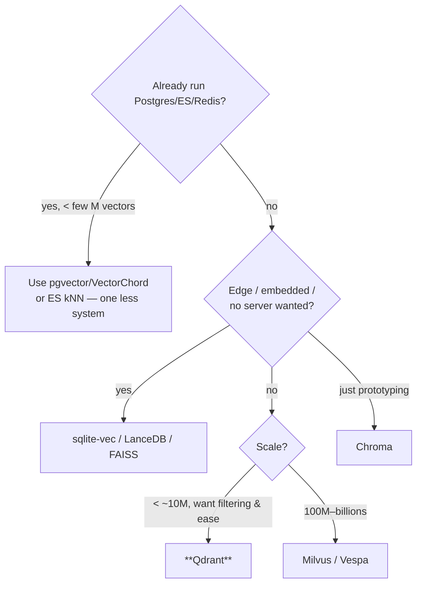
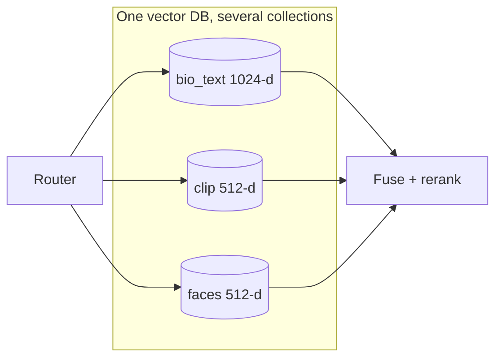

# RAG Guide — Chapter 5: Vector Databases & Storage

> The vector DB is where your embeddings live and where ANN search happens. This
> chapter compares the **self-hostable** options — **pgvector/VectorChord, FAISS,
> Qdrant, Milvus, Weaviate, Chroma, LanceDB, sqlite-vec**, plus Elasticsearch/
> Redis — on the axes that matter: **embedded vs server**, **filtering & hybrid**,
> **memory footprint**, and **ops burden**. It builds on the index families from
> [§1.6](01-foundations.md) and feeds the edge sizing in [Chapter 9](09-edge-devices.md).

---

## 5.1 What a vector DB actually gives you

More than "store vectors + do kNN." A production-grade one provides:

1. **ANN index** (HNSW/IVF/PQ) with tunable recall/latency.
2. **Metadata storage + filtering** — attach `{person_id, language, location}`
   and filter *during* search (pre-filter), not after.
3. **Hybrid search** — combine vector + keyword (BM25) with fusion ([§1.7](01-foundations.md)).
4. **CRUD + persistence** — upserts, deletes, snapshots (a plain library like
   FAISS gives you the index but not these).
5. **Quantization** — shrink vectors (scalar/PQ/binary/RaBitQ) to fit RAM.

If you only need #1 in-process, a *library* (FAISS) suffices. The moment you need
#2–#4, you want a real DB.

## 5.2 Index knobs, quickly

| Family | Key params | Trade |
|---|---|---|
| **HNSW** | `M` (graph degree), `ef_construction`, `ef_search` | Higher = better recall, more RAM/latency |
| **IVF** | `nlist` (clusters), `nprobe` (searched) | More `nprobe` = better recall, slower |
| **PQ / OPQ** | `m` sub-quantizers, bits | Big memory cut, some accuracy loss |
| **Binary / RaBitQ** | — | Extreme compression; rerank to recover accuracy |

You'll tune `ef_search`/`nprobe` at query time to trade recall for latency; set
`M`/`nlist` at build time. Most DBs default to HNSW.

## 5.3 The options — a self-hoster's tour

### Embedded / in-process (no server to run)

| Store | Shape | Best for |
|---|---|---|
| **sqlite-vec** | SQLite extension, one file | **Edge / tiny apps**; ships inside your process; trivial ops |
| **FAISS** | Library (Meta), C++/Python | Max speed in-process; you manage persistence/filtering |
| **LanceDB** | Embedded, columnar (Lance), disk-based | **Multimodal, local-first**; big datasets without a server; versioning |
| **Chroma** | Embedded or light server | **Prototyping / dev**; simplest Python API |

### Servers (run as a service, scale out)

| Store | Shape | Best for |
|---|---|---|
| **Qdrant** | Rust, single binary | **Great self-host default**: fast HNSW, first-class **filtering**, payloads, quantization, hybrid |
| **Milvus** | Distributed | **Billions** of vectors, horizontal scale (heavier ops) |
| **Weaviate** | Modules, GraphQL | Built-in hybrid + optional model modules |
| **Vespa** | JVM, advanced | Complex ranking, tensor ops, large scale |

### "You already run it" (reuse existing infra)

| Store | Note |
|---|---|
| **pgvector / VectorChord** | Postgres extensions — vectors *and* your relational data + SQL filters in one DB, transactional. **VectorChord** (IVF+RaBitQ) is Immich's choice ([Ch. 10](10-on-device-suggestions-and-media.md)) |
| **Elasticsearch / OpenSearch** | Mature **BM25 + kNN hybrid** in one engine; great if you already run it |
| **Redis** (vector) | Low-latency, in-memory; good when Redis is already your cache |

### 5.3.1 What each store supports — capability & hardware matrix

The tables above are "shape"; this is "what it can actually do." **Multimodal
support** here means built-in helpers for storing multiple vectors/modalities and
sometimes generating embeddings (image/text) — you can *always* store CLIP vectors
in any store, but some make it first-class.

| Store | Hybrid (BM25+vec) | Metadata pre-filter | Quantization | Multimodal helpers | Rough scale (single node) | Hardware fit |
|---|---|---|---|---|---|---|
| **sqlite-vec** | via SQLite FTS5 | SQL `WHERE` | manual/int8 | store any vectors | ~10⁵–10⁶ | **Edge / Pi / in-process**; tiny RAM |
| **FAISS** | ✗ (library) | ✗ (do it yourself) | **PQ/IVF/OPQ (excellent)** | store any vectors | 10⁶–10⁸ (RAM-bound) | Edge→server; **max control**, GPU build exists |
| **LanceDB** | ✓ (FTS) | ✓ | scalar/IVF-PQ | **multimodal-first** (Lance columnar: images+vectors+metadata together) | 10⁶–10⁸ (disk-based) | **Edge & local-first**; big data w/o a server |
| **Chroma** | limited | ✓ | basic | **multimodal loaders** (CLIP image+text out of the box) | ~10⁵–10⁶ | Dev/prototype; light server |
| **Qdrant** | ✓ (native) | **✓ excellent** | **scalar/binary/PQ** | named/multi-vectors (store CLIP+text per point) | 10⁶–10⁸+ | Single binary; **great server default**, quantize for RAM |
| **Milvus** | ✓ | ✓ | ✓ (many index types) | multi-vector fields | **10⁸–10⁹ (distributed)** | Cluster; heavy ops; GPU indexing option |
| **Weaviate** | **✓ native** | ✓ | PQ/BQ | **module ecosystem** (img2vec, multi2vec) | 10⁶–10⁸ | Server; modules can embed for you |
| **pgvector** | pgvector + PG FTS | **✓ SQL, transactional** | (VectorChord: IVF+RaBitQ) | store any vectors | 10⁵–10⁷ | Reuse Postgres; **VectorChord** for scale/RAM |
| **Elasticsearch/OpenSearch** | **✓ mature** | ✓ | scalar/BBQ | store any vectors | 10⁷–10⁸ | Server/cluster; RAM-hungry (JVM) |
| **Redis** (vector) | ✓ | ✓ | — | store any vectors | 10⁶–10⁷ | **In-memory** → fast but RAM = dataset |

Notes that matter in practice:

- **Multimodal:** **Chroma, Weaviate, and LanceDB** make image+text easiest
  (Chroma ships CLIP loaders; Weaviate has `multi2vec` modules; LanceDB stores the
  media, vectors, and metadata in one columnar table). Everywhere else you run the
  CLIP encoder yourself ([Ch. 3–4](03-multimodal-rag.md)) and just store the
  vectors — remember: **one collection per embedding space** ([§5.7](#57-multiple-indexes-one-system)).
- **Performance** is dominated by the **ANN index + RAM**, not the brand: HNSW is
  fast but RAM-heavy; IVF/PQ trade a little recall for big memory savings. On
  small hardware, **quantization support is the feature that decides feasibility**
  (§5.6) — FAISS and Qdrant are strongest here.
- **Hardware fit:** edge/Pi → **sqlite-vec / LanceDB / FAISS** (embedded, quantized);
  one server → **Qdrant**; reuse Postgres → **pgvector/VectorChord**; web-scale →
  **Milvus**. GPU-accelerated indexing exists for FAISS and Milvus but is rarely
  needed below ~10⁸ vectors.

## 5.4 Choosing — decision tree



**Defaults worth memorizing:** on Postgres already → **pgvector/VectorChord**;
standalone service → **Qdrant**; on the edge → **sqlite-vec / LanceDB**;
prototyping → **Chroma**; web-scale → **Milvus**.

## 5.5 Filtering & hybrid — the features that decide quality

- **Pre-filtering** ("`location=Berlin AND 'uk' IN languages` *then* rank by
  vector") is usually the biggest quality lever ([§2.3.1](02-evolution-and-types.md)).
  Qdrant, Weaviate, Milvus, pgvector, ES all support it; verify it's **pre**-filter
  (during search) not **post**-filter (after), which can return too few results.
- **Hybrid (vector + BM25)** — native in Weaviate, Qdrant, Elasticsearch/OpenSearch,
  Milvus; with pgvector you combine pgvector + Postgres full-text yourself. Fuse
  with **RRF**.
- For PeopleFinder both are mandatory: exact tokens (names, "Kubernetes") need
  BM25; hard constraints (language/location) need pre-filtering.

## 5.6 Memory footprint & quantization

Rough RAM for a **float32 HNSW** index:

```
bytes ≈ N × dims × 4   +   HNSW graph overhead (~N × M × 8)
```

Example — PeopleFinder, 50k people × ~10 chunks = 500k vectors at 1024-d:
`500k × 1024 × 4 ≈ 2 GB` raw, plus graph overhead. Fine on a server; **too much
for a Pi**. Fixes:

- **Scalar quantization** (float32→int8): ~4× smaller, tiny accuracy loss.
- **PQ / binary / RaBitQ**: 8–32× smaller; **rerank the top candidates with full
  vectors** to recover accuracy (VectorChord/Qdrant/FAISS do this).
- **Matryoshka truncation** ([§4.2](04-models.md)): store 256-d instead of 1024-d.
- **Fewer, better chunks**: index discipline beats compression.

> On a **Jetson/Pi**, combine int8/PQ quantization with sqlite-vec/LanceDB/FAISS —
> a few hundred-K vectors then fit in well under a gigabyte.

## 5.7 Multiple indexes, one system

Recall from [§3.9](03-multimodal-rag.md): different embedding spaces (bio-text,
CLIP, faces) can't share a similarity search. In practice you create **separate
collections/tables** in the *same* DB — Qdrant collections, or pgvector tables, or
Immich's `clip_index` + `face_index` — and the router queries the right one(s).



## 5.8 PeopleFinder's storage choice

- **Server build:** already on Postgres for the relational catalog → **pgvector**
  (or **VectorChord** for scale/compression, following Immich). One DB for
  people rows, metadata filters, *and* vectors — simplest to operate.
- **Standalone / higher scale:** **Qdrant** for its filtering + hybrid + quantization.
- **Edge build:** **sqlite-vec** or **LanceDB** with int8/PQ ([Ch. 9](09-edge-devices.md)),
  or **NanoDB** on Jetson for the CLIP index.

## 5.9 TL;DR

- A vector DB = ANN index **+ metadata filtering + hybrid + CRUD + quantization**.
  A library (FAISS) gives only the index.
- **Pick by situation:** Postgres already → **pgvector/VectorChord**; standalone →
  **Qdrant**; edge → **sqlite-vec/LanceDB/FAISS**; prototype → **Chroma**;
  billions → **Milvus**.
- **Pre-filtering + hybrid** are the features that most affect quality — insist on
  pre-filter.
- Size RAM as `N×dims×4` + overhead; on small hardware use **int8/PQ/RaBitQ (+ full-
  vector rerank)** and **matryoshka** truncation.
- Different embedding spaces → **separate collections in one DB**, fused by the
  router.

Next: [Chapter 6 — Frameworks: LangChain & friends](06-frameworks-langchain.md).
