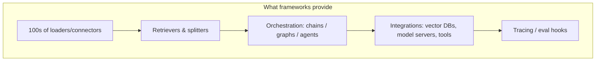
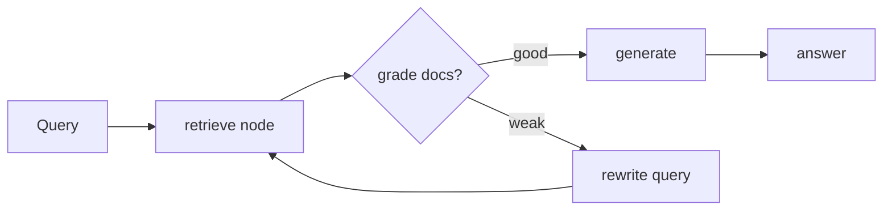
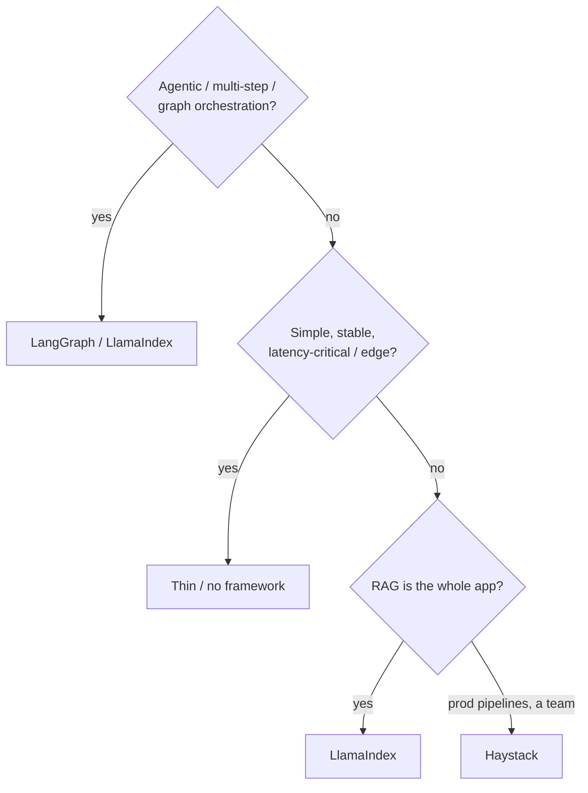

# RAG Guide — Chapter 6: Frameworks — LangChain & Friends

> Frameworks wire the pieces together: loaders, splitters, embedders, retrievers,
> and orchestration. This chapter covers **LangChain** (and **LangGraph**),
> **LlamaIndex**, and **Haystack** — what each is genuinely good at, a concrete
> look at LangChain's RAG components, and the most important judgment call: **when
> *not* to use a framework at all.** The concepts they implement are Chapters
> [1](01-foundations.md)–[2](02-evolution-and-types.md).

---

## 6.1 What a framework buys you (and costs you)



**Buys:** speed to a working prototype, a huge library of integrations (you don't
write the Qdrant/Whisper/PDF glue), and ready-made agentic orchestration.
**Costs:** indirection (three layers between you and a bug), abstraction churn
(APIs move), and hidden prompts/behavior. The trade is great early and can chafe
later — hence §6.6.

## 6.2 LangChain

The broadest ecosystem. For RAG you touch:

- **Document loaders** — files, web, DBs, APIs → `Document`s.
- **Text splitters** — recursive/semantic/structure-aware chunking ([§1.4](01-foundations.md)).
- **Embeddings / VectorStores / Retrievers** — uniform interfaces over the
  [Chapter 5](05-vector-databases.md) stores; retrievers include MMR, multi-query,
  parent-document, self-query (metadata filtering), contextual compression.
- **LCEL** (LangChain Expression Language) — compose steps with `|`:

  ```text
  chain = {"context": retriever | format, "question": passthrough}
          | prompt | llm | parser
  ```

- **LangGraph** — the important one for **[agentic/modular RAG](02-evolution-and-types.md)**:
  a stateful graph of nodes/edges with loops, branches, and persistence. This is
  how you express routers, Self-RAG/CRAG gates, and multi-step agents cleanly.
- **LangSmith** — tracing + evaluation (see [§1.11](01-foundations.md)).



> **Use LangChain when** you want maximum integrations and, especially, **LangGraph
> for agentic control flow**. Pin versions — the API surface moves.

## 6.3 LlamaIndex

Framed as a **data framework for LLM apps** — its center of gravity is
**indexing and retrieval**, and its RAG defaults are excellent.

- **Documents → Nodes**, a rich set of **indexes** and **query engines**, and
  **node post-processors** (rerankers, filters).
- **Property Graph Index** — first-class **[Graph RAG](07-graph-rag.md)**: build
  and query a knowledge graph over your corpus with little ceremony.
- Strong **router / sub-question** query engines for modular RAG.
- Proven on the edge: **Jetson Copilot** is Ollama + **LlamaIndex** + Streamlit
  ([Ch. 9](09-edge-devices.md)).

> **Use LlamaIndex when** RAG *is* the app and you want great retrieval defaults,
> query engines, and built-in graph indexing without hand-rolling it.

## 6.4 Haystack

deepset's **production-oriented** framework: typed **components** wired into
explicit **Pipelines**, mature **DocumentStores**, and a search-engine heritage.
Less "magic," more predictable — pleasant for teams shipping and maintaining
services.

> **Use Haystack when** you want clear, typed, production pipelines and search-
> quality retrieval without heavy abstraction.

## 6.5 The wider field (know they exist)

- **DSPy** — program and **optimize prompts/pipelines** declaratively instead of
  hand-tuning.
- **txtai / EmbedChain** — lightweight, batteries-included RAG.
- **RAGFlow / Verba** — opinionated end-to-end RAG apps.
- **Dify / Flowise** — **low-code** visual RAG/agent builders.

## 6.6 When *not* to use a framework

Naive RAG is genuinely ~100 lines: embed, upsert to a vector DB, search, stuff a
prompt, call the model. Prefer **no framework (or a thin one)** when:

- The pipeline is **simple and stable** — indirection just adds debugging cost.
- You're on the **edge / tight latency** and want to control every allocation.
- You need **full transparency** of prompts and calls (compliance, evals).
- The framework's abstractions fight your data model.

**Pragmatic middle path:** hand-write the hot query path; use a framework's
**loaders/splitters/integrations** for the boring ingestion glue; reach for
**LangGraph/LlamaIndex** only where **agentic or graph** orchestration earns it.



## 6.7 Which framework for which case

Pick by the *dominant* need, not by popularity:

| Your case | Reach for | Why |
|---|---|---|
| Plain text Q&A, prototype fast | **LlamaIndex** or LangChain | Best RAG defaults / most integrations |
| Agentic, multi-step, routing, loops | **LangGraph** | Explicit stateful graph, cycles, persistence |
| Multi-hop / knowledge graph | **LlamaIndex Property Graph** | Built-in graph build + query ([Ch. 7](07-graph-rag.md)) |
| Typed production pipelines, a team | **Haystack** | Predictable, maintainable components |
| Edge / latency-critical | **Thin / none** | Control every allocation ([Ch. 9](09-edge-devices.md)) |
| Non-devs / visual | **Dify / Flowise** | Low-code builders |

### 6.7.1 Multimodal (text + images + video + audio)

Frameworks help less here than people hope — the heavy lifting is the **encoders
and per-modality indexes** of [Chapter 3](03-multimodal-rag.md), which you wire in
regardless of framework. What a framework gives you is the **ingestion loaders and
a router** to fan a query out to the right index and fuse results. Concretely:

| Modality | What the framework orchestrates | You still supply |
|---|---|---|
| **Images** | Loader → call CLIP/SigLIP → store in the image collection; image query engine | CLIP encoder ([§3.3](03-multimodal-rag.md)); a face pipeline for identity ([§3.8](03-multimodal-rag.md)) |
| **Audio** | Whisper node → transcript → normal text RAG; (CLAP for non-speech) | Whisper/CLAP models ([§3.6](03-multimodal-rag.md)) |
| **Video** | Keyframe sampler → CLIP + Whisper transcript, timestamped | Frame sampler + encoders ([§3.7](03-multimodal-rag.md)) |
| **Fusion** | **Router / multi-index query engine** picks & fuses per modality | The routing rules ([§2.5](02-evolution-and-types.md)) |

Recommendations for a text+image+video+audio system like PeopleFinder:

- **LlamaIndex** — has the cleanest **multi-modal indexes, node parsers, and a
  router/sub-question query engine** to combine several typed indexes; the default
  choice when RAG-over-mixed-media *is* the app.
- **LangChain/LangGraph** — best when the multimodal retrieval must sit inside an
  **agent** that decides which modality tool to call (search_faces vs search_scene
  vs search_text, [§2.6.1](02-evolution-and-types.md)).
- **Haystack** — typed pipelines can branch per modality; good for a maintainable
  production media-search service.
- **Edge multimodal** ([Ch. 9](09-edge-devices.md)) — skip the framework; call
  ONNX CLIP + faster-whisper + sqlite-vec directly, or reuse **NanoDB** for the
  CLIP index on Jetson.

> Bottom line: no framework "does multimodal" for you — it **orchestrates** the
> encoders and **routes/fuses** their indexes. Choose LlamaIndex for
> retrieval-centric multimodal, LangGraph when an agent must choose the modality.

## 6.8 PeopleFinder's choice

- **Retrieval + graph:** **LlamaIndex** — its query engines and **Property Graph
  Index** cover both the multimodal retrieval and the relationship queries
  ([Ch. 7](07-graph-rag.md)) with minimal glue.
- **Agentic router:** wrap the modular router ([§2.5](02-evolution-and-types.md))
  in **LangGraph** so multi-hop queries can loop (retrieve → grade → traverse
  graph → synthesize).
- **Edge build:** drop the framework on the hot path; hand-write retrieve→rerank→
  generate against sqlite-vec + Ollama ([Ch. 9](09-edge-devices.md)).

## 6.9 TL;DR

- Frameworks buy **integrations + orchestration + prototyping speed**; they cost
  **indirection and churn**.
- **LangChain** = broadest ecosystem; **LangGraph** is its standout for **agentic/
  modular** control flow. **LlamaIndex** = best when **RAG is the app** (great
  retrieval defaults + **Property Graph** for graph RAG). **Haystack** = typed,
  **production** pipelines.
- Know the low-code (Dify/Flowise) and optimizer (DSPy) options exist.
- **Don't over-adopt:** simple RAG is ~100 lines. Hand-write the hot/edge path;
  use frameworks for ingestion glue and where agentic/graph orchestration pays.

Next: [Chapter 7 — Graph RAG](07-graph-rag.md).
