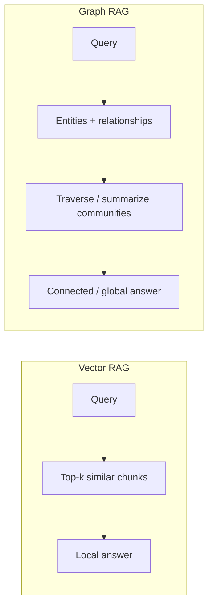
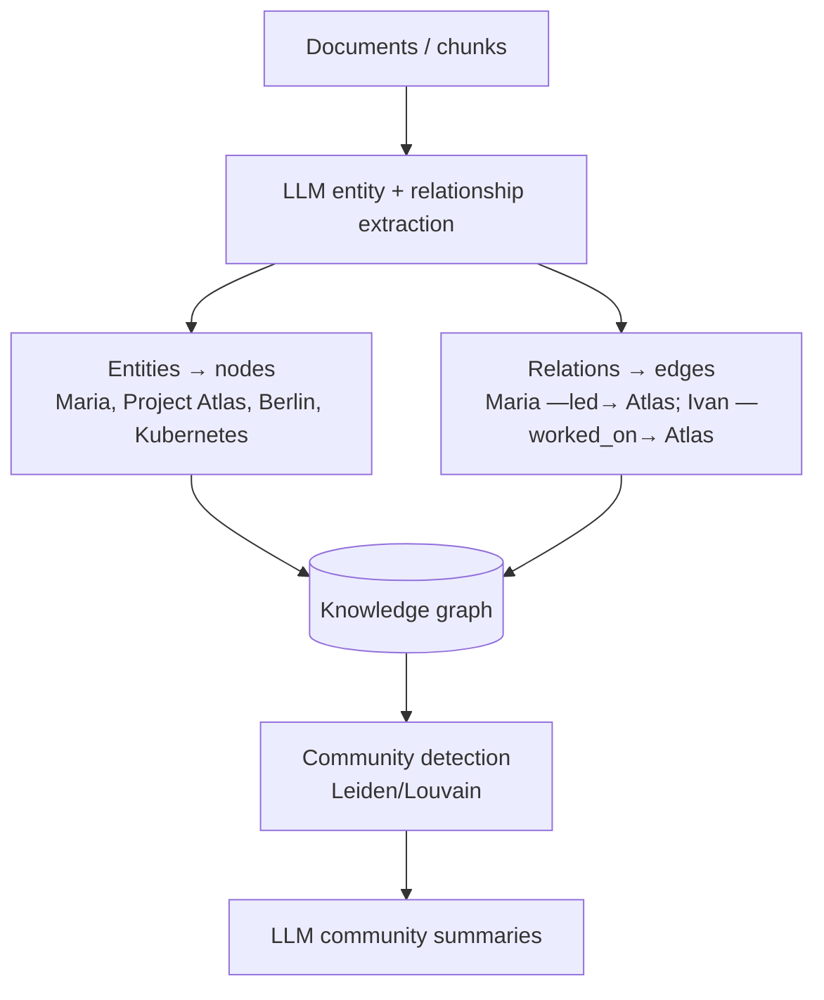
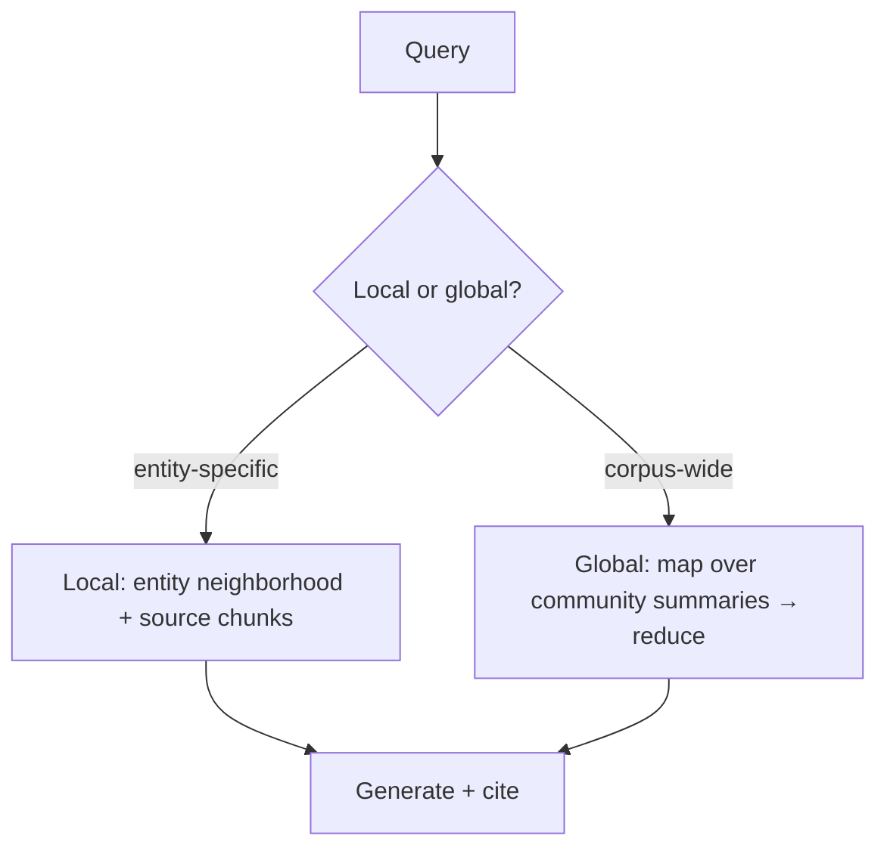
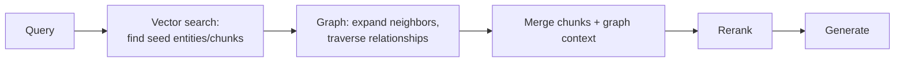
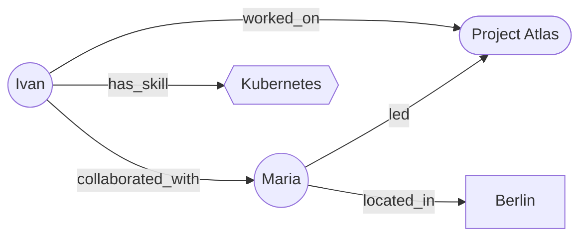

# RAG Guide — Chapter 7: Graph RAG

> Vector RAG finds passages that are *locally similar* to a query. It's bad at
> **connecting entities across documents** ("who worked with the person who led
> Atlas?") and at **corpus-wide synthesis** ("what themes run through all 50k
> bios?"). **Graph RAG** fixes both by building a **knowledge graph** of entities
> and relationships and retrieving by **traversal** and **community summaries**.
> This chapter explains how it's built (Microsoft GraphRAG and friends), **local
> vs global** queries, the **hybrid graph+vector** pattern, and — critically —
> **when it's worth the cost**. Temporal/agent-memory graphs (Graphiti) are
> [Chapter 8](08-memory-and-personalization.md).

---

## 7.1 What vectors can't do

Two query classes defeat plain vector RAG:

1. **Multi-hop / relational** — *"Find engineers who worked with anyone who
   reported to Maria."* The answer isn't in any single chunk; it's in the
   **relationships** between entities scattered across many documents.
2. **Global / thematic** — *"What are the main skill clusters in our catalog?"*
   No top-k passages answer this; it needs an **aggregate view** of everything.

## 7.2 How a knowledge graph is built from text

You extract structure the corpus only implies:

- **Extraction**: an LLM reads each chunk and emits `(entity, relationship,
  entity)` triples plus entity descriptions. This is the expensive step — one LLM
  pass per chunk.
- **Community detection**: cluster the graph (e.g. **Leiden**) into groups of
  densely-connected entities — a "backend-in-Berlin" cluster, an "Atlas team"
  cluster.
- **Community summaries**: the LLM writes a summary per community, at multiple
  levels. These summaries are what make **global** queries possible.

## 7.3 Local vs global search (the Microsoft GraphRAG model)

Microsoft's **GraphRAG** popularized two retrieval modes:

| Mode | How | Answers |
|---|---|---|
| **Local search** | Find the query's entities → expand their **neighborhood** (related entities, edges, source chunks) → generate | Specific, entity-anchored questions ("what did Maria work on with Ivan?") |
| **Global search** | **Map-reduce over community summaries**: partial answers per community, then combine | Corpus-wide/thematic ("main skill clusters", "recurring collaborations") |

## 7.4 Hybrid graph + vector — the pattern you'll actually ship

Pure graph RAG is powerful but heavy; pure vector RAG can't traverse. Most real
systems **combine** them:

Vectors do **entry-point retrieval** (fuzzy match to find the relevant entities);
the graph does **expansion and reasoning** (connect them). Neo4j's vector index,
LlamaIndex's Property Graph Index, and `neo4j-graphrag` all support exactly this.

## 7.5 The tooling

| Tool | What it is | Note |
|---|---|---|
| **Microsoft GraphRAG** | The reference pipeline (extraction → communities → local/global) | Batch, thorough, LLM-heavy indexing |
| **nano-graphrag** | Minimal, hackable GraphRAG reimplementation | Lighter, easier to self-host/modify |
| **LlamaIndex Property Graph Index** | Build + query graphs inside your RAG app | Easiest integration ([Ch. 6](06-frameworks-langchain.md)) |
| **Neo4j** (+ `neo4j-graphrag`, vector index) | Graph DB with native vectors → hybrid graph+vector | Production graph store; also backs Graphiti |
| **FalkorDB** | Fast Redis-based graph | Lightweight backing store |
| **Graphiti** (Zep) | **Temporal** knowledge-graph *memory* | Evolving/agent memory — [Ch. 8](08-memory-and-personalization.md) |

## 7.6 When to use Graph RAG — and when not

**Use it when:**

- Queries are **multi-hop / relational** (the answer is in the connections).
- You need **global synthesis** over a corpus (themes, clusters, "summarize
  everything about X").
- Your domain is **entity-rich** with meaningful relationships (people, orgs,
  code, medical, legal, supply chains).

**Don't, when:**

- Questions are **fact-lookup** answerable by top-k passages → plain vector RAG is
  cheaper and simpler.
- The corpus is **small or flat** (few cross-document relationships).
- You can't afford the **indexing cost** — GraphRAG runs an LLM over every chunk
  to extract triples and summarize communities; this is **slow and expensive**,
  and must be **re-run/updated** as data changes (this is exactly the pain
  **Graphiti** addresses with incremental temporal updates, [Ch. 8](08-memory-and-personalization.md)).

> **Rule of thumb:** start with hybrid **vector + rerank**. Add a graph *only* for
> the specific query classes (multi-hop, global) that vectors demonstrably fail —
> and prefer the **hybrid graph+vector** pattern over pure GraphRAG.

## 7.7 Graph RAG on PeopleFinder

PeopleFinder is entity-rich, so a graph pays off. Nodes: **People, Projects,
Organizations, Skills, Locations**. Edges: `worked_on`, `reported_to`,
`has_skill`, `located_in`, `collaborated_with`.

- **Local:** *"Who worked with Maria on Atlas and knows Kubernetes and is
  available?"* → find `Maria`, traverse `worked_on(Atlas)` → filter `has_skill=K8s`
  → join availability. Vectors seed "Maria"/"Atlas"; the graph does the joins.
- **Global:** *"What skill clusters and collaboration hubs exist?"* → community
  detection + summaries.
- **Temporal:** availability/location change over time → maintain the graph with
  **Graphiti** so answers reflect *now* ([Ch. 8](08-memory-and-personalization.md)).

## 7.8 TL;DR

- Graph RAG adds a **knowledge graph** (LLM-extracted entities + relationships) to
  answer **multi-hop/relational** and **global/thematic** questions vectors can't.
- **Microsoft GraphRAG**: extract → detect communities (Leiden) → summarize →
  **local** (entity neighborhood) vs **global** (map-reduce over summaries).
- Ship the **hybrid graph+vector** pattern: vectors find seed entities, the graph
  expands/reasons.
- Tools: **GraphRAG / nano-graphrag**, **LlamaIndex Property Graph**, **Neo4j /
  FalkorDB**, and **Graphiti** for temporal memory.
- **Cost is real** — LLM-heavy indexing that must be maintained. Use a graph only
  for the query classes that need it; default to vector+rerank otherwise.

Next: [Chapter 8 — Memory & personalization](08-memory-and-personalization.md).
