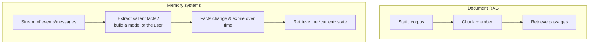
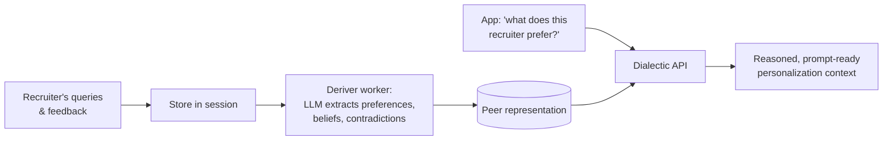
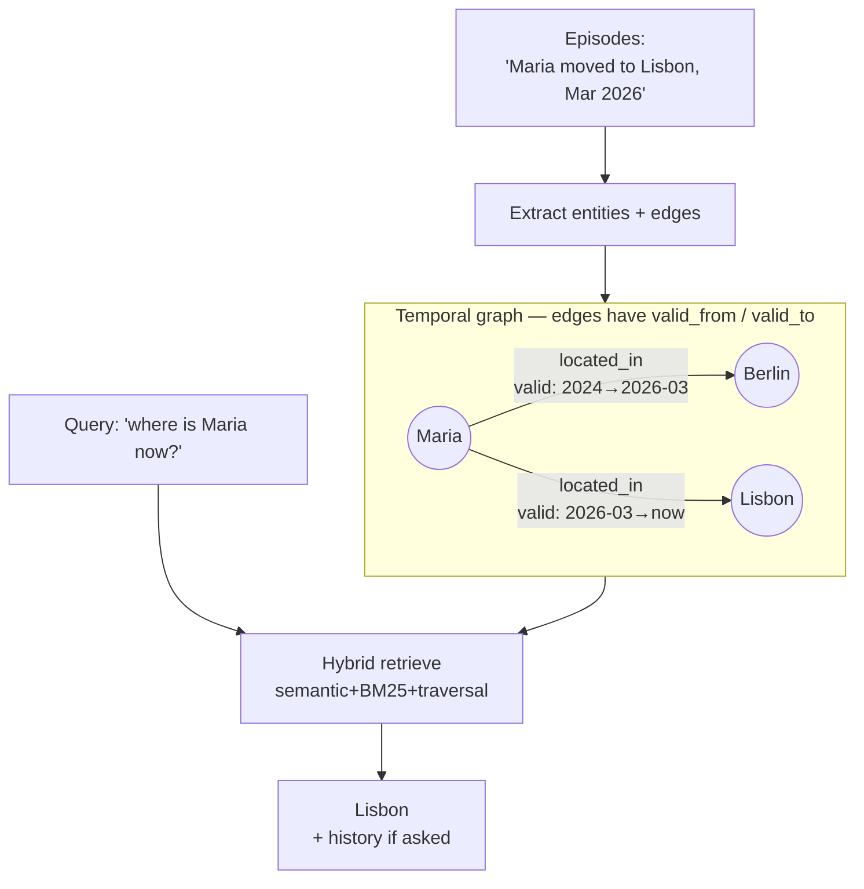
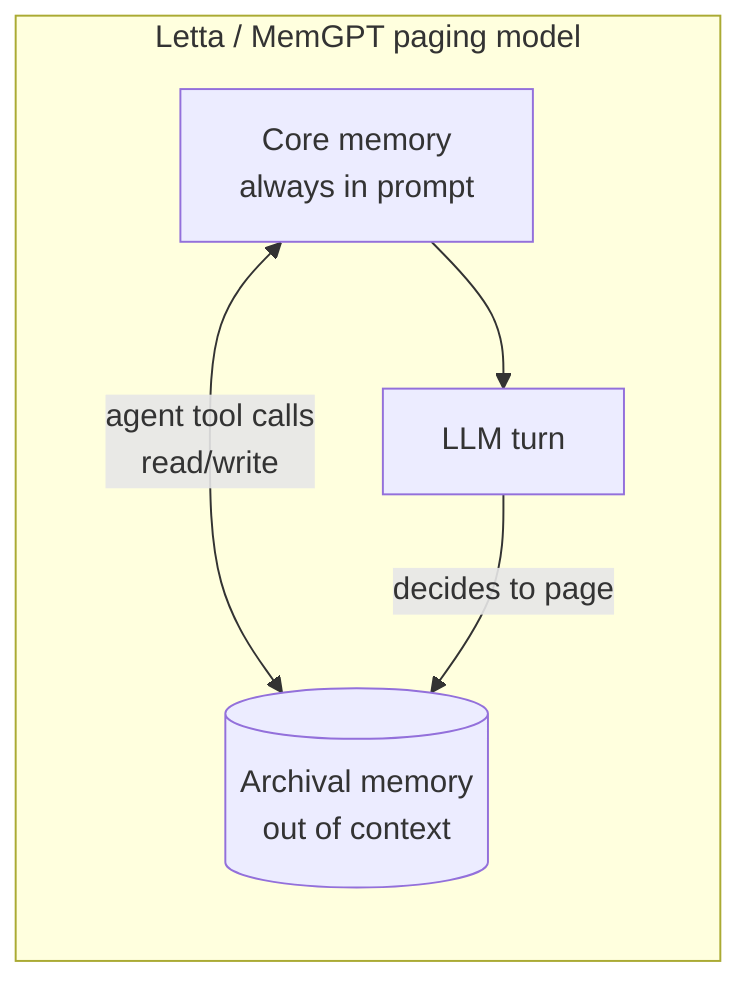
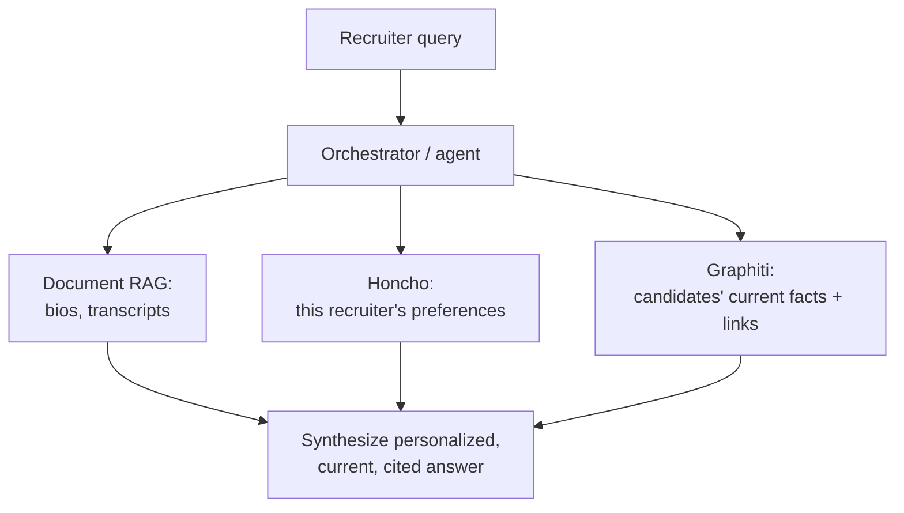

# RAG Guide — Chapter 8: Memory & Personalization

> Classic RAG retrieves from a **corpus** ("what do the documents say?"). But
> agents also need to remember **the user** and **facts that change over time**
> ("who is this person, what do they prefer, what's true *now*?"). That's a
> different problem, and a different toolset: **Honcho** (user representation /
> theory-of-mind), **Graphiti** (temporal knowledge-graph memory — almost
> certainly what people mean when they say "Graphify" next to Honcho), plus
> **Mem0** and **Letta/MemGPT**. This chapter explains what memory *is* versus
> retrieval, and how/where to use each tool. It builds on Graph RAG
> ([Chapter 7](07-graph-rag.md)).

---

## 8.1 Memory ≠ retrieval

It's tempting to think "memory is just RAG over the chat history." Sometimes it
is. But three things distinguish **memory** from **document retrieval**:

- **Source is a stream, not a corpus** — messages/events arrive continuously.
- **You store distilled facts, not raw text** — "prefers remote candidates",
  not the paragraph that implied it.
- **Time matters** — facts get superseded ("was in Berlin" → "moved to Lisbon");
  good memory tracks *when* something was true and invalidates the stale version.

For **PeopleFinder**, two memory needs appear that plain RAG handles badly:

1. **The recruiter** builds up preferences over many searches ("dislikes
   agencies", "always wants Ukrainian speakers", "shortlists seniors only"). We
   want to *personalize* results without them re-stating it every time → **Honcho**.
2. **Candidates' facts change** — availability, location, current employer. We
   want "what's true *now*, and what was true when" → **Graphiti**.

## 8.2 Honcho — modeling *the user*

**Honcho** (Plastic Labs) is memory infrastructure for **stateful agents that
understand people over time**. Its thesis: *memory is a reasoning problem, not a
retrieval problem.* Instead of storing chat logs and grepping them, Honcho runs
a background model that reads incoming messages and maintains a **representation**
— a theory-of-mind snapshot — of each participant.

**Data model** (current terminology):

| Concept | What it is |
|---|---|
| **Workspace** | Top-level isolation container |
| **Peer** | Any participant — human *or* AI agent — a first-class entity (`observe_me` to build a persistent model) |
| **Session** | A conversation context; many-to-many with peers |
| **Message** | Atomic unit, labelled by its source peer |
| **Representation** | The evolving "who is this peer" model (e.g. *"has 10+ yrs Rust"*), plus compact **peer cards** |

**How it works** — an asynchronous pipeline: **Store** messages → a background
worker (the "deriver") **Reasons** over them to update each peer's representation
→ you **Query** it → **Inject** the result into your prompt.

**How you query it:**

- **Dialectic API** — ask natural-language questions *about a peer* ("what kind
  of candidates does this recruiter favour?") and get reasoning-grounded answers.
  It's LLM-to-LLM: your app "chats with the user's representation."
- **Representation API** — a low-latency static snapshot of what's known.
- **Search** — hybrid BM25 + vector across sessions/peers.
- **Context** — a token-limited, prompt-ready bundle.

**Self-host:** a FastAPI server + **PostgreSQL (pgvector)** + the deriver worker,
via Docker. Pluggable LLM providers (Anthropic/OpenAI/Gemini). A managed cloud
also exists, but the whole thing runs on your own box.

> **Where to use Honcho:** long-lived assistants where *personalization* matters
> — tutors, coaches, companions, and PeopleFinder's recruiter profile. It answers
> *"who is this user and what do they want?"* — **complementary to**, not a
> replacement for, your document RAG (which answers *"what does the corpus say?"*).

## 8.3 Graphiti — temporal knowledge-graph memory (the real "Graphify")

> **Name check.** If you've heard "**Graphify**" mentioned alongside Honcho and
> agent memory, the tool almost certainly meant is **Graphiti** (by Zep). There
> *is* an old thing literally called *Graphify* — see the disambiguation box in
> [§8.4](#84-disambiguation--the-old-neo4j-graphify) — but it's an unrelated,
> abandoned 2015-era Neo4j text-classification plugin, not a memory system.

**Graphiti** is an open-source framework for building and querying **temporal
knowledge graphs** for AI agents — the engine at the core of Zep's context
infrastructure. Where static [GraphRAG](07-graph-rag.md) builds a graph once from
a document set, Graphiti builds one **incrementally and bi-temporally** from a
stream of **episodes** (messages, events, records).

**What makes it different:**

- **Incremental** — new episodes extract entities/relationships and merge into
  the graph continuously; no batch recompute.
- **Bi-temporal** — every edge (fact) carries a **validity window**: when it
  became true and when it was superseded. This gives **automatic fact
  invalidation** — "candidate is available" can be retired when a newer episode
  says otherwise, while history is preserved.
- **Provenance** — episodes are retained as ground truth behind each fact.
- **Hybrid retrieval** — combines **semantic embeddings + BM25 + graph
  traversal** for sub-second queries, without leaning on slow LLM summarization
  at query time.

**Backing stores:** Neo4j 5.26+, FalkorDB, Amazon Neptune, (Kuzu deprecated). It
relies on a structured-output LLM (OpenAI/Anthropic/Gemini) to extract
entities/edges from each episode.

> **Where to use Graphiti:** memory that is **structured and time-sensitive** —
> facts that change, need provenance, or need "what was true *when*." In
> PeopleFinder it tracks candidates' evolving state (availability, location,
> employer) so answers reflect *now*, and it powers relationship queries
> ([Chapter 7](07-graph-rag.md)). Contrast with static GraphRAG: use **GraphRAG**
> for one-shot corpus analysis, **Graphiti** for evolving agent memory.

## 8.4 Disambiguation — the old Neo4j "Graphify"

> **Graphify** (the literal name) is a **Neo4j unmanaged extension for
> text/document classification** using graph-based hierarchical pattern
> recognition (a Vector-Space-Model / cosine classifier over labelled text).
> Authored by Kenny Bastani (`kbastani/graphify`), it was **archived read-only in
> May 2020** and is effectively dead. GraphAware's comparable-era work was a
> *different* project, `graphaware/neo4j-nlp`. **None of these are agent-memory
> tools.** If someone recommends "Graphify" for RAG memory today, they mean
> **Graphiti**. Mentioned here only to rule out the name collision.

## 8.5 Mem0 and Letta — two more memory shapes

You'll meet these constantly; here's where they sit.

### Mem0 — a drop-in fact-memory layer

A "universal memory layer for AI agents": you feed it messages, it **extracts
salient memories**, and you **search** them at query time to inject into the
prompt. Retrieval is a **vector + BM25 + entity-linking hybrid** (the
"vector+graph" combo). Ships as a library, a self-hosted Docker server, or a
managed cloud. Good default when you just want "remember useful facts about this
user/session across conversations" without adopting a whole agent framework.
(Its published benchmark numbers are vendor-reported — treat as marketing.)

### Letta (formerly MemGPT) — agent-*owned* memory

Descends from the **MemGPT** research: treat the context window like an OS with
**virtual memory / paging**. The agent has **core memory** (always in-prompt,
editable "memory blocks") plus **archival/recall memory** (out-of-context,
retrieved on demand). Crucially, **the agent edits its own memory via tool
calls** during operation — memory management is agent-driven, not a fixed
pipeline. Archival memory effectively becomes a RAG store the model queries
itself. Use when you want a **long-running stateful agent that owns its memory**
rather than an external memory service bolted on.

## 8.6 Choosing a memory tool

| Need | Reach for |
|---|---|
| Personalize to *the user* (preferences, theory-of-mind) | **Honcho** |
| Time-aware, structured facts that change; provenance | **Graphiti** |
| One-shot analytical graph over a static corpus | Static **GraphRAG** ([Ch.7](07-graph-rag.md)) |
| Simple "remember facts about this user" drop-in | **Mem0** |
| Long-running agent that self-manages its memory | **Letta** |
| "Graphify" for memory | You mean **Graphiti** |

These compose. A production PeopleFinder could run **Honcho** for the recruiter's
profile, **Graphiti** for candidates' temporal facts + relationships, and plain
**document RAG** ([Ch.1](01-foundations.md)) for the bios/transcripts —
three memories, each answering a different question.

## 8.7 TL;DR

- **Memory ≠ document retrieval**: it distills a *stream* into changing, timed
  facts and models *the user*, not a static corpus.
- **Honcho** = user representation / personalization (reasoning-first, Dialectic
  API, self-hosts on FastAPI + Postgres/pgvector).
- **Graphiti** = temporal knowledge-graph memory (bi-temporal, incremental,
  hybrid retrieval, Neo4j/FalkorDB) — **this is the "Graphify" people mean.**
- The old **Neo4j Graphify** is a dead 2020 text-classifier; ignore it for memory.
- **Mem0** = drop-in fact memory; **Letta/MemGPT** = agent that owns its own
  paged memory.
- They **compose** with plain RAG — pick per question: *who is the user?*
  (Honcho) vs *what's true now?* (Graphiti) vs *what does the corpus say?* (RAG).

Next: [Chapter 9 — Edge devices](09-edge-devices.md) — running all of this on a
Raspberry Pi and NVIDIA Jetson.
