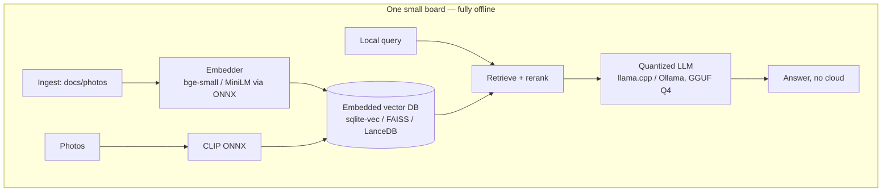
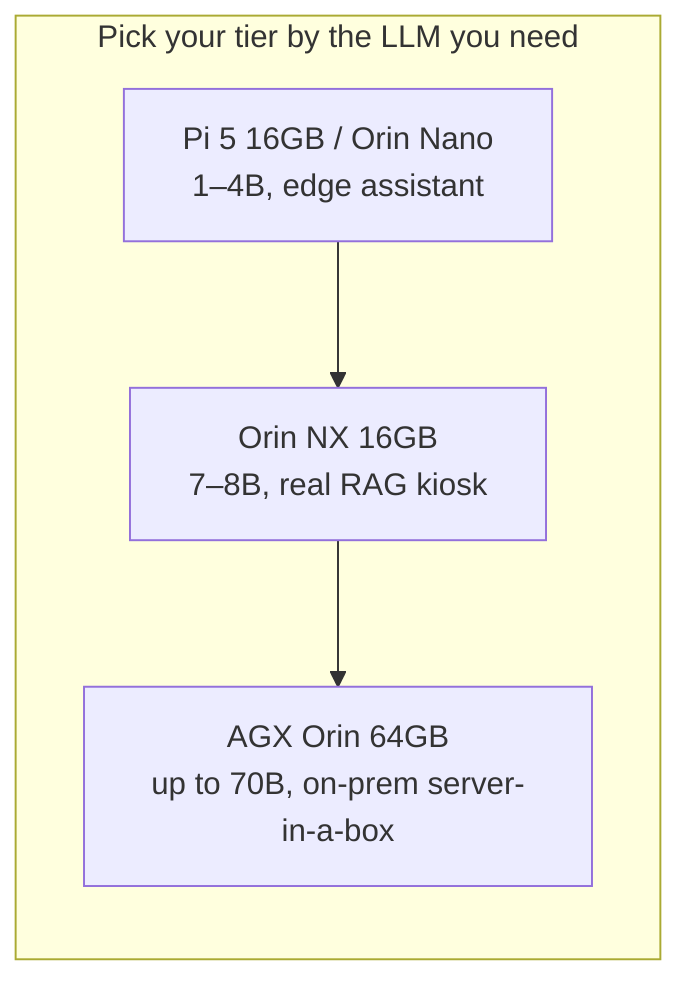
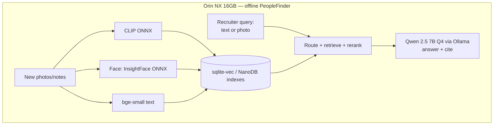

# RAG Guide — Chapter 9: Edge Devices — Raspberry Pi & NVIDIA Jetson

> RAG doesn't need the cloud. A whole pipeline — embedder, vector DB, small LLM —
> fits on a **$70 Raspberry Pi** or an **NVIDIA Jetson**, running fully offline.
> This chapter is about what *actually* fits: the constraints, the self-hosted
> stack (llama.cpp/Ollama, quantization, sqlite-vec/FAISS, ONNX CLIP), a concrete
> **Jetson vs Raspberry Pi** comparison (including the classic **Jetson Nano vs
> Pi** question), the full Jetson tier table, and the ready-made edge-RAG
> ecosystem (NanoDB, Jetson Copilot, jetson-containers). We close by shrinking
> **PeopleFinder** onto a field device.

---

## 9.1 Why run RAG on the edge at all

- **Privacy / sovereignty** — biometric and personal data ([Ch. 3](03-multimodal-rag.md))
  never leaves the box. Huge for PeopleFinder-style catalogs.
- **Offline / air-gapped** — kiosks, field laptops, ships, factories, clinics.
- **Latency & cost** — no per-token bill, no round-trip; answers are local.
- **Always-on appliances** — a home photo library, a shop's product finder.

The catch: edge hardware is **memory-bound and compute-limited**. Every design
choice below is about fitting quality into a few watts and a few gigabytes.

## 9.2 The edge-RAG stack (what fits, and how)

The four levers that make it fit:

1. **Quantization.** Run LLMs as **GGUF Q4_K_M** (≈4-bit) via **llama.cpp** or
   **Ollama**. A 7–8B model drops from ~16 GB to ~4.5 GB — the single biggest
   enabler. Embedders run as **ONNX** (int8 optional).
2. **Small models.** A 1–4B LLM with *good retrieval* beats a starved 13B. Pick
   embedders like `bge-small` (384-d) or `all-MiniLM` that run fast on CPU.
3. **Embedded vector DB.** No server: **sqlite-vec** (a SQLite extension) or
   **FAISS** or **LanceDB** — a single file, tiny RAM. Use **PQ/IVF** compression
   ([Ch. 5](05-vector-databases.md)) to shrink the index.
4. **Precompute at ingest.** Do the expensive embedding/face work when data
   arrives (or overnight), so queries are cheap. This is exactly how the photo
   apps behave ([Ch. 10](10-on-device-suggestions-and-media.md)).

## 9.3 Raspberry Pi — the CPU-only generalist

The Pi has **no CUDA GPU and no NPU** — ML runs on the ARM CPU (memory-bound).

| | Raspberry Pi 4 | Raspberry Pi 5 |
|---|---|---|
| CPU | 4× Cortex-A72 @1.5 GHz | 4× Cortex-A76 @2.4 GHz |
| RAM | up to 8 GB LPDDR4 | up to **16 GB** LPDDR4X |
| ML accel | none | none (PCIe for an AI HAT) |

**What RAG is realistic on a Pi 5 (CPU):**

- **LLM:** a 3B model at Q4 runs ~**4–9 tok/s** (e.g. Llama 3.2 3B ≈ 8.8 tok/s,
  Phi-3.5-mini ≈ 7.4 tok/s). Usable for short, grounded answers — not chatty long
  outputs. Use **llama.cpp/Llamafile** (faster than Ollama here).
- **RAM:** 8 GB is the floor; **16 GB recommended** to hold the LLM *and* a vector
  DB *and* the OS.
- **Embeddings/CLIP:** small ONNX embedders and CLIP inference work on CPU but are
  slow — precompute at ingest, never per-query in a loop.

**The Hailo AI HAT+ accelerators (Pi 5 only, over PCIe)** — important nuance:

| Accelerator | Perf | What it does |
|---|---|---|
| AI HAT+ (Hailo-8L) | 13 TOPS | **Vision only** (object detection, YOLO) — **cannot run LLMs** |
| AI HAT+ (Hailo-8) | 26 TOPS | Vision only; uses the Pi's RAM |
| AI HAT+ 2 (Hailo-10H) | **40 TOPS + 8 GB onboard** | Runs **LLMs up to ~6B + VLMs** (e.g. Llama 3.2), "chat over documents" |

So a bare Pi is a *text-RAG-and-small-LLM* box. Add a Hailo-8/8L to accelerate
**vision** (face/scene detection for a photo library); only the newer **Hailo-10H**
meaningfully accelerates **generative** LLM/VLM work.

## 9.4 Jetson Nano vs Raspberry Pi — the honest comparison

This is the classic question, and the answer is **"it depends on the workload."**
The original **Jetson Nano (2019, 4 GB)** has a **128-core Maxwell CUDA GPU**; a Pi
has no comparable ML compute. But the Nano is old and RAM-starved.

| Dimension | **Jetson Nano (orig, 4 GB)** | **Raspberry Pi 5 (16 GB)** |
|---|---|---|
| GPU/ML compute | **128-core Maxwell CUDA** (~472 GFLOPS FP16) | None usable for ML |
| CPU | 4× Cortex-A57 (weak, old) | **4× Cortex-A76 @2.4 GHz (much faster)** |
| Max RAM | 4 GB LPDDR4 | **16 GB** LPDDR4X |
| Software | Old JetPack / CUDA / Ubuntu 18.04 (stale) | Current OS & ecosystem |
| Power | 5–10 W | ~5–12 W |

**How to read it:**

- **Vision / CNN / CLIP / face inference → Jetson Nano wins.** Its CUDA cores give
  real hardware acceleration for the exact CNN/embedding workloads a photo library
  needs; the Pi grinds these on CPU.
- **Text LLM generation & general RAG orchestration → Pi 5 wins.** LLM decoding is
  **memory-bound**; the Pi's faster CPU and **16 GB** RAM run a 3–7B GGUF model
  better than the Nano's cramped 4 GB and dated toolchain (getting a modern
  llama.cpp CUDA build onto the old Nano is genuinely painful).
- **The Nano is dated.** For new builds, its successor the **Orin Nano** (§9.5)
  beats the Pi at *everything* ML — treat the original Nano as "a capable little
  CUDA vision box you might already own," not a first choice.

> **Rule of thumb:** vision-heavy edge RAG (photo/face/scene search) → **Jetson**.
> Text-RAG + small LLM on a budget with a current OS → **Pi 5 (16 GB)**. Building
> fresh and want both well → **Jetson Orin Nano**.

## 9.5 The Jetson family — unified memory + CUDA + Tensor cores

Jetson's advantage over a Pi is architectural: a real **CUDA GPU with Tensor
cores** (and NVDLA accelerators on Orin) sharing **unified memory** with the CPU —
so "VRAM" is just your RAM, and a 16 GB Orin NX can load a 7–8B model the way a
16 GB laptop GPU would.

| Module | AI perf | GPU | RAM | Power | LLM sweet spot |
|---|---|---|---|---|---|
| **Jetson Nano** (orig) | 472 GFLOPS FP16 | 128-core Maxwell | 4 GB | 5–10 W | tiny/≤1B, slow; better for vision |
| **Xavier NX** | 21 TOPS | 384c Volta + NVDLA | 8/16 GB | 10–15 W | 3–7B Q4 (modest) |
| **Orin Nano 8 GB** | 67 TOPS | 1024c Ampere + 32 Tensor | 8 GB | 7–25 W | **1–4B** (4B ≈ 9–10 tok/s) |
| **Orin NX 16 GB** | 157 TOPS | 1792c Ampere + 56 Tensor | 16 GB | 10–40 W | **7–8B Q4** (Llama 3.1 8B, Qwen 2.5 7B) |
| **AGX Orin 64 GB** | 275 TOPS | 2048c Ampere + 64 Tensor | 64 GB | 15–75 W | up to **70B Q4** interactively |

(Higher power mode = more tok/s: on Orin Nano, 25 W gives ~35–47% more throughput
than 15 W.)

## 9.6 The ready-made Jetson edge-RAG ecosystem

You don't start from scratch — NVIDIA's `dusty-nv` / Jetson AI Lab ships most of
it as containers:

| Tool | What it gives you |
|---|---|
| **jetson-containers** | Modular Docker builds for JetPack: ollama, llama.cpp, MLC, vLLM, transformers, NanoDB, etc. |
| **NanoDB** | A **CUDA-optimized multimodal vector DB** using CLIP/SigLIP embeddings; demo indexes **275K MS-COCO images in realtime on an AGX Orin** for txt2img/img2img search |
| **Jetson Copilot** | A reference **local RAG assistant**: **Ollama + LlamaIndex + Streamlit**, default **Llama3 8B**, with a "Use RAG" toggle over your indexed docs |
| **Jetson AI Lab** | Tutorials for RAG (LlamaIndex), vector DBs, VLMs, CLIP search on-device |

For a vision-heavy PeopleFinder, **NanoDB** is almost a drop-in for the CLIP index;
**Jetson Copilot** is a working blueprint for the text-RAG half.

## 9.7 What to build on what — use-case map

| Device | Good edge-RAG use cases |
|---|---|
| **Pi 5 (16 GB)** | Offline doc assistant; small knowledge base Q&A; home/SMB text RAG; autosuggest ([Ch. 10](10-on-device-suggestions-and-media.md)) |
| **Pi 5 + Hailo-8** | Above **+** accelerated face/scene detection for a photo library |
| **Pi 5 + Hailo-10H** | Above **+** a ~6B local LLM/VLM for on-box chat-over-docs |
| **Jetson Nano (orig)** | Accelerated CLIP/face **inference** node feeding a small index (vision box) |
| **Orin Nano 8 GB** | Compact multimodal RAG appliance (CLIP + 1–4B LLM) |
| **Orin NX 16 GB** | **The sweet spot**: full PeopleFinder kiosk — CLIP + faces + 7–8B LLM + vector DB, offline |
| **AGX Orin 64 GB** | On-prem "server in a box": large model, big index, multi-user |

## 9.8 PeopleFinder on the edge

A field recruiter needs the catalog offline at a venue. Target an **Orin NX
16 GB**:

Everything — CLIP scene search, face matching, bio retrieval, and a 7B generator —
runs on ~40 W with no network. Sync back to the central server when it reconnects.
The full architecture (cloud and edge variants) is in
[Chapter 11](11-worked-example-people-catalog.md).

## 9.9 TL;DR

- Edge RAG is real: **quantize (GGUF Q4) + small models + embedded vector DB +
  precompute at ingest**. llama.cpp/Ollama + sqlite-vec/FAISS + ONNX CLIP is the
  stack.
- **Raspberry Pi** = CPU-only generalist: fine for text RAG + a 3B LLM (16 GB
  recommended); add **Hailo** for vision, **Hailo-10H** for on-box LLMs.
- **Jetson Nano vs Pi:** Nano's CUDA GPU wins **vision/CLIP/face inference**; Pi 5
  wins **text-LLM generation & modern tooling** (more RAM, faster CPU, current OS).
  The original Nano is dated — prefer **Orin Nano** for new builds.
- **Jetson tiers:** Orin Nano (1–4B) → **Orin NX 16 GB (7–8B, the RAG sweet
  spot)** → AGX Orin 64 GB (up to 70B). Unified memory = RAM is your VRAM.
- Reuse the ecosystem: **NanoDB** (CUDA multimodal vector DB), **Jetson Copilot**
  (Ollama + LlamaIndex RAG blueprint), **jetson-containers**.

Next: [Chapter 10 — On-device suggestions & media libraries](10-on-device-suggestions-and-media.md),
mining Immich, PhotoPrism, and LibrePhotos for how real apps do this.
