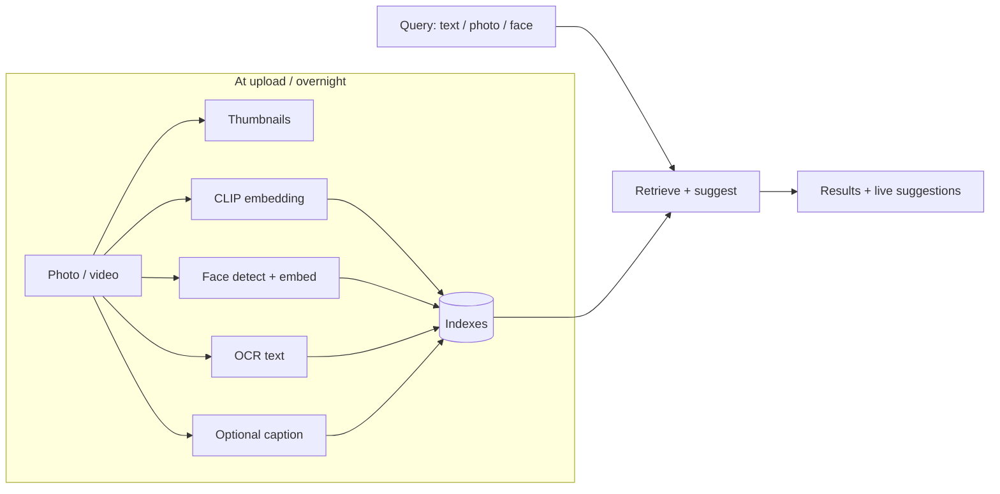
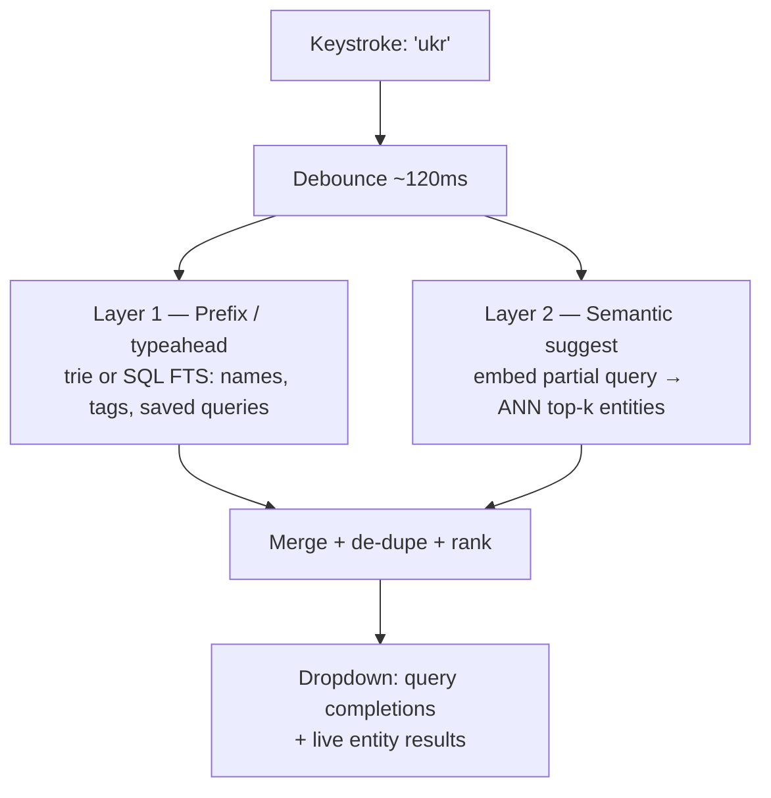
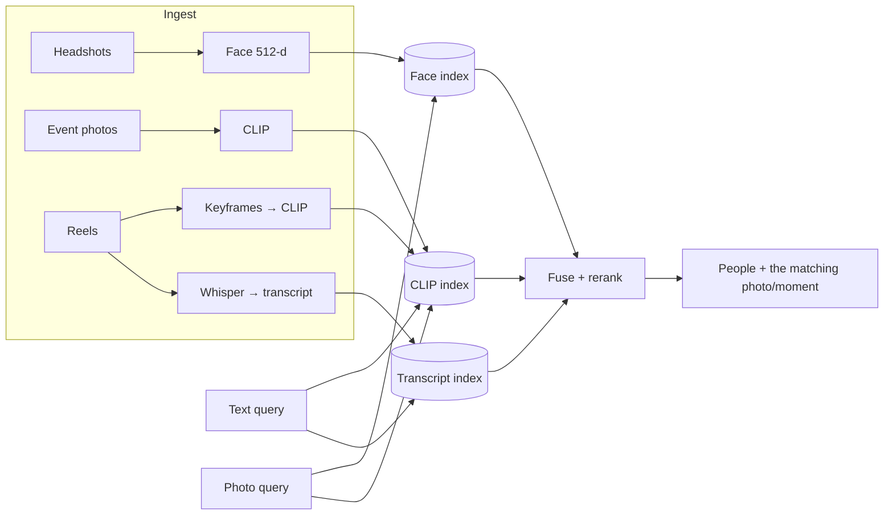

# RAG Guide — Chapter 10: On-device Suggestions & Media Libraries

> A self-hosted photo/video library *is* a multimodal RAG appliance: embed at
> ingest, search and **suggest** at query time. Rather than theorize, we dissect
> three real open-source apps you can run today — **Immich**, **PhotoPrism**, and
> **LibrePhotos** — and steal their battle-tested design decisions. Then we build
> the **auto-suggestion / suggest-during-search** layer (typeahead + semantic
> suggestions) that a photo/text/video library needs, and map it onto
> **PeopleFinder**. Multimodal basics are [Chapter 3](03-multimodal-rag.md); the
> hardware is [Chapter 9](09-edge-devices.md).

---

## 10.1 A media library is RAG in disguise

Swap "documents" for "photos/videos" and the pipeline is identical:

The three apps below make *different* choices at each box — and those differences
are the lesson.

## 10.2 Immich — CLIP smart-search done pragmatically

Immich is the most "RAG-native" of the three. What's worth stealing:

- **CLIP smart search.** Default model **`ViT-B-32__openai`** (512-d), exposed by
  a `<arch>__<pretrain>` naming scheme and **swappable in the UI** — English-tuned
  options (SigLIP2 variants), and **multilingual** ones (`nllb-clip-*`,
  `XLM-Roberta-ViT-*`) that keep non-English queries in the same space. Their docs
  publish a **Pareto table** (recall vs latency vs RAM per model) — copy that
  discipline when picking your own encoder.
- **A decoupled ML microservice.** ML is a separate **FastAPI + ONNX Runtime**
  container (`immich-machine-learning`); the main server sends preview images and
  stores the returned vectors in Postgres. This clean split lets you put ML on a
  GPU box and the app on a NAS.
- **Model TTL / lazy loading** — the killer edge trick: `MODEL_TTL` (default
  300 s) **unloads idle models** from RAM, and `PRELOAD`/batch-size knobs tune
  throughput. On a memory-bound board ([Ch. 9](09-edge-devices.md)) this is how
  you run CLIP + faces + OCR without holding them all resident.
- **Faces:** InsightFace **`buffalo_l`** (RetinaFace detect @640×640, min score
  0.7 → crop → **ArcFace 512-d**), clustered with **DBSCAN** by a **nightly job**;
  knobs are Min Detection Score, Max Recognition Distance, Min Recognized Faces.
- **Vector storage: VectorChord** (successor to pgvecto.rs, atop pgvector types)
  using **IVF + RaBitQ** quantization, with separate `clip_index` and `face_index`.
  It reindexes when you change models (dimensions change).
- **Reuse one embedding for many features:** **duplicate detection** runs on the
  *same* CLIP vectors (Max Detection Distance default **0.01**). One encoder,
  three features (search + dedupe + suggestions).
- **OCR (recent):** **RapidOCR** makes text-inside-images searchable — a cheap,
  high-value add for any media library.
- **Hardware acceleration** via backend-tagged images: **CUDA, ROCm, OpenVINO,
  ARM-NN (Mali only), RKNN (Rockchip)** — note plain Raspberry Pi gets **no HW
  accel** (CPU ML still works).

> **Steal from Immich:** decouple ML into a service; **lazy-unload models by TTL**;
> reuse one embedding across search/dedupe/suggest; publish a model Pareto table
> and make the encoder swappable; add OCR.

## 10.3 PhotoPrism — the lean, keyword-index approach

PhotoPrism deliberately avoids the vector-DB rabbit hole, and it's instructive:

- **Single Go binary with embedded TensorFlow** — one container, CPU-friendly,
  runs on a **Pi or NAS in ~3 GB RAM + swap, no GPU**. Operational simplicity as a
  feature.
- **Labels, not embeddings:** a **NASNet Mobile 224** model tags images; outputs
  map to a curated taxonomy via a **`rules.yml`** with **per-label probability
  thresholds** (`cat: 0.3`). Search is a **keyword/label index in SQL** (labels,
  EXIF, location) — **not** vector similarity.
- **CLIP is *not* in mainline:** a PR adding a Python CLIP service + **Qdrant**
  stayed **unmerged** — the maintainers judged the extra containers not worth the
  complexity. A real-world "do you actually need vectors?" data point.
- **Faces:** **FaceNet** (TensorFlow) → **512-d, L2-normalized** → **DBSCAN**
  clustering (so Euclidean ≈ cosine).
- **Modern captioning externalized:** a **Vision API** (`vision.yml`) POSTs images
  to a user-configured endpoint — e.g. a **local Ollama VLM** (MiniCPM-V, Qwen2.5-VL,
  gemma3, llama3.2-vision) — instead of bundling a heavy captioner.

> **Steal from PhotoPrism:** don't reach for a vector DB if a **label/keyword
> index** answers your queries — it's lighter and simpler. Externalize heavy VLM
> work to a **local Ollama** endpoint you can swap. Great template for a
> minimal-RAM Pi appliance.

## 10.4 LibrePhotos — modular, model-swappable microservices

LibrePhotos is the most modular and the most "kitchen-sink":

- **Django + a fleet of Flask microservices over localhost**, one per model:
  thumbnail (8003), image similarity (8002), face (8005), **clip_embeddings
  (8006)**, captioning (8007), llm (8008), tags (8011). Swap/scale each
  independently.
- **Semantic search = CLIP via sentence-transformers**, embeddings **indexed by
  FAISS**; the same vectors power "similar photo" suggestions. Text queries embed
  and match by vector similarity — true natural-language search.
- **Scene/tagging:** **Places365** CNN *or* **Google SigLIP 2** (ONNX, zero-shot),
  chosen in admin settings.
- **Captioning:** **im2txt / BLIP / Moondream 2**, selectable.
- **Faces:** InsightFace **SCRFD** detect + **ArcFace 512-d** on **ONNX Runtime**,
  clustered with **HDBSCAN** — and they **migrated from dlib (128-d) → ArcFace
  (512-d)**, a nice illustration that embedding dimension/model is a real upgrade
  lever.
- **Postgres** stores metadata, face encodings, *and* CLIP embeddings.

> **Steal from LibrePhotos:** **model-per-microservice** modularity with
> **admin-swappable** models; keep CLIP embeddings reusable for both search and
> "more like this"; remember that **upgrading the face model (dim ↑)** materially
> improves clustering.

## 10.5 Cross-app cheat sheet

| Decision | Immich | PhotoPrism | LibrePhotos |
|---|---|---|---|
| Semantic (NL) search | **CLIP** (swappable, multilingual) | **No** (label/keyword index) | **CLIP** (sentence-transformers) |
| Vector store | VectorChord/pgvector (IVF+RaBitQ) | SQL keyword index | **FAISS** + Postgres |
| Faces | InsightFace buffalo_l → ArcFace 512-d, DBSCAN | FaceNet 512-d, DBSCAN | InsightFace SCRFD+ArcFace 512-d, HDBSCAN |
| Runtime shape | Decoupled FastAPI ML service (ONNX) | Single Go binary (TF embedded) | Django + many Flask services |
| Captioning | — (OCR via RapidOCR) | External Vision API (Ollama VLM) | im2txt / BLIP / Moondream 2 |
| Min footprint | Moderate (swap models via TTL) | **Lightest** (~3 GB, Pi/NAS) | Heaviest (many services) |

**The meta-lesson:** three viable architectures for the *same* problem, trading
**capability vs simplicity vs footprint**. Choose by your constraint — a Pi
appliance leans PhotoPrism-lean; a GPU-backed rich search leans Immich/LibrePhotos.

## 10.6 Auto-suggestion & suggest-during-search

> This section is **search-time** suggestion (the user is typing a query). For
> **ingest-time** suggestions — proposing vibe / sentiment / tags / caption /
> location the moment an image is *uploaded* — see the second worked example,
> [Chapter 12](12-worked-example-image-enrichment.md).

"Suggestions while you type" is its own mini-RAG problem with a **tight latency
budget** (each keystroke must feel instant, ~<100 ms). Use **two layers**:

- **Layer 1 — lexical typeahead.** A **trie**/prefix index or SQL **full-text**
  over names, tags, and *popular past queries*. Microsecond-fast, handles exact
  prefixes ("ukr" → "Ukrainian", "Ukraine trip").
- **Layer 2 — semantic suggestions.** Embed the (partial) query and ANN-search the
  entity/photo index for *meaning* ("stage" also suggests "conference talk"). Only
  fire once the query is ≥ a few chars; **debounce** and **cache**.
- **Make it cheap:** precompute entity embeddings at ingest; cache hot query
  vectors; cap `k`; run Layer 2 async so Layer 1 paints immediately.
- **"Suggestions during search"** = show, live, both **query completions** (what
  you might mean) and a **preview of top results** (who/what matches) — the same
  retrieve loop, just executed per-debounced-keystroke against a small, fast index.

This is why PeopleFinder can offer *"as you type 'ukr…', suggest Ukrainian-speaking
candidates and the completion 'Ukrainian-speaking backend engineer'"* — Layer 1
completes the phrase, Layer 2 previews the people.

## 10.7 Semantic photo/video quick-search on PeopleFinder

Every arrow here is a decision the three apps already validated: CLIP for
scene/NL search (Immich/LibrePhotos), a separate face pipeline with clustering
(all three), Whisper transcripts for spoken content ([Ch. 3](03-multimodal-rag.md)),
and precompute-at-ingest so the *query* is cheap enough to power live suggestions.

## 10.8 TL;DR

- A **media library is multimodal RAG**: embed at ingest, search + suggest at
  query time. Immich/PhotoPrism/LibrePhotos are three real, contrasting blueprints.
- **Immich:** CLIP smart-search, **decoupled ONNX ML service**, **model-TTL
  lazy-unload** (edge gold), one embedding reused for search+dedupe, VectorChord,
  OCR, faces via InsightFace/DBSCAN.
- **PhotoPrism:** **lean single Go binary**, **label/keyword index instead of
  vectors**, externalized VLM captioning via local Ollama — the minimal-RAM Pi
  template; proof you don't always need a vector DB.
- **LibrePhotos:** **model-per-microservice**, CLIP+FAISS semantic search,
  admin-swappable models, ArcFace faces + HDBSCAN.
- **Auto-suggestion = two layers:** fast **prefix/typeahead** + **semantic
  suggest**, debounced and precomputed, to stay under the ~100 ms budget.

Next: [Chapter 11 — The PeopleFinder worked example](11-worked-example-people-catalog.md),
where every piece finally clicks together.
