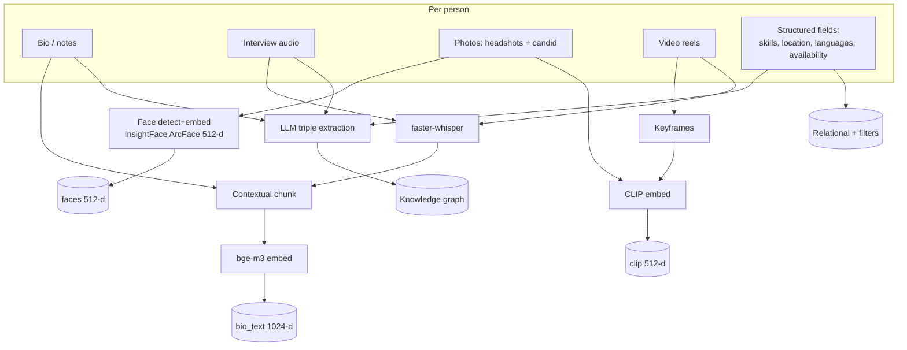
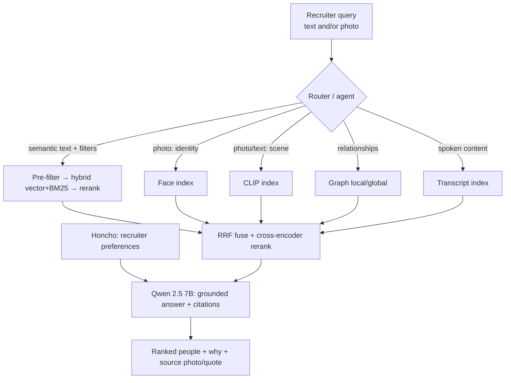
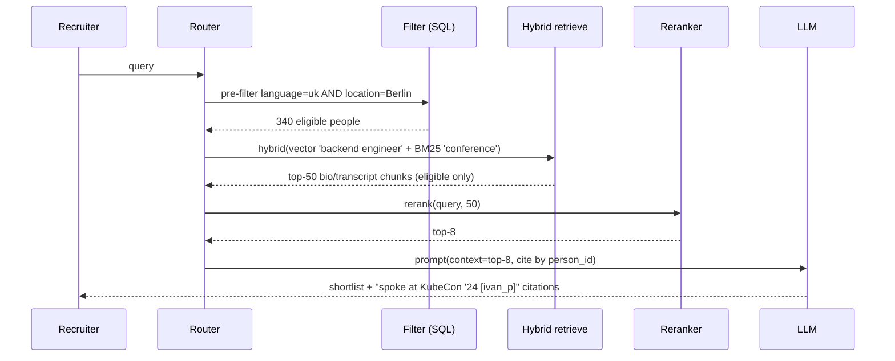
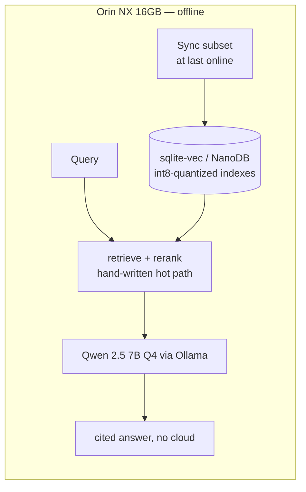

# RAG Guide — Chapter 11: The PeopleFinder Worked Example

> Everything, assembled. We take the **PeopleFinder** catalog ([README](README.md))
> — 50k people with bios, transcripts, photos, and video — and build the whole
> system: **multimodal ingestion**, a **modular/agentic router**, **hybrid +
> graph retrieval**, **reranking**, **memory/personalization**, and **grounded
> generation with citations**. Then we shrink it onto a **Jetson** for offline
> field use. This chapter references every prior chapter; think of it as the map
> of how the parts fit.

---

## 11.1 Requirements recap

Five query types, each exercising different machinery:

| # | Query type | Example | Machinery |
|---|---|---|---|
| Q1 | Semantic + filter | "Ukrainian-speaking backend engineer in Berlin who spoke at a conference" | pre-filter + hybrid text + rerank |
| Q2 | Visual / identity | "is this the person in this photo?" / "people photographed on stage" | face index / CLIP index |
| Q3 | Suggest-as-you-type | "ukr…" → completions + live results | typeahead + semantic suggest |
| Q4 | Relational / multi-hop | "who worked with Maria on Atlas and is available?" | graph traversal + filter |
| Q5 | Cited synthesis | "shortlist candidates for this JD and explain why" | decomposition + multi-index + grounded gen + memory |

## 11.2 Ingestion — build every index once

Key decisions, all justified in earlier chapters:

- **Contextual chunking** ([§1.4.1](01-foundations.md)) prepends `[person, field]`
  so fragments stay meaningful.
- **`bge-m3`** ([§4.2](04-models.md)) handles multilingual bios in one space.
- **Separate indexes per embedding space** ([§3.9](03-multimodal-rag.md), [§5.7](05-vector-databases.md)):
  bio-text, CLIP, faces — you cannot mix them.
- **Precompute at ingest** ([Ch. 9](09-edge-devices.md), [Ch. 10](10-on-device-suggestions-and-media.md))
  so queries — and live suggestions — stay cheap.
- **Graph built once** via LLM extraction ([§7.2](07-graph-rag.md)); kept current
  with **Graphiti** for temporal facts ([§8.3](08-memory-and-personalization.md)).

## 11.3 The query architecture — a modular/agentic router

Simple queries take the **Advanced** fast path (P1); multi-hop ones (Q4/Q5) are
routed by a **LangGraph agent** ([§2.6](02-evolution-and-types.md), [§6.2](06-frameworks-langchain.md))
that can loop: retrieve → grade → traverse graph → synthesize.

### 11.3.1 Why not just graph-RAG?

A fair question — PeopleFinder has people, projects, and orgs, so why not model the
whole thing as a graph? Because most of its traffic is **fuzzy semantic** (Q1) and
**visual** (Q2), which a graph *cannot* answer: you can't traverse your way to
"reads like this bio" or "looks like this photo." A graph-only build would **still**
need the vector and face indexes for the bulk of queries — **and** pay the
expensive LLM graph-extraction/maintenance cost ([§7.6](07-graph-rag.md)) on top.
So the graph earns its keep only for the **relationship / multi-hop** slice (Q4).
Hence the shape here: **vector + relational filters as the base, graph as an
auxiliary index** the router reaches for when a query is about connections.
Graph-*first* is simpler only when traffic is dominated by relationship traversal
over clean structured entities (an org chart, social-network analysis) — not a
semantic-and-visual catalog like this one.

## 11.4 Walking the flagship query (Q1)

*"Ukrainian-speaking backend engineer in Berlin who has spoken at a conference."*

Note the order: **hard filters first** (cheap, huge precision win, [§2.3.1](02-evolution-and-types.md)),
*then* semantics rank the eligible set, *then* rerank sharpens, *then* the model
writes a cited shortlist. If the answer is wrong, [§1.11](01-foundations.md)'s
diagnostic tells you whether to fix retrieval or generation.

## 11.5 The other queries, briefly

- **Q2 (visual/identity):** an uploaded snapshot → detect+embed the face
  ([§3.8](03-multimodal-rag.md)) → search the **face index** for "is this
  someone?"; or embed with **CLIP** for "people on a stage." Two different
  indexes, chosen by intent.
- **Q3 (suggest-as-you-type):** the **two-layer** typeahead + semantic-suggest of
  [§10.6](10-on-device-suggestions-and-media.md), debounced and precomputed.
- **Q4 (relational):** **graph local search** ([§7.7](07-graph-rag.md)) — seed
  "Maria"/"Atlas" via vectors, traverse `worked_on`, filter `has_skill=K8s` and
  availability.
- **Q5 (cited synthesis):** **decompose** the JD ([§2.3.1](02-evolution-and-types.md))
  into constraints, retrieve per constraint across indexes, fuse+rerank, and
  generate a grounded, cited shortlist — **personalized** by **Honcho** to the
  recruiter's learned preferences ([§8.2](08-memory-and-personalization.md)).

## 11.6 The server-build stack

| Layer | Choice | Chapter |
|---|---|---|
| Text embedder | bge-m3 (multilingual) | [4](04-models.md) |
| Reranker | bge-reranker-v2-m3 | [4](04-models.md) |
| Image↔text | OpenCLIP ViT-B/32 (or NV-CLIP on NVIDIA infra) | [3](03-multimodal-rag.md) |
| Faces | InsightFace ArcFace + DBSCAN/HDBSCAN | [3](03-multimodal-rag.md), [10](10-on-device-suggestions-and-media.md) |
| Speech | faster-whisper | [3](03-multimodal-rag.md), [4](04-models.md) |
| Vector store | pgvector / VectorChord (or Qdrant) | [5](05-vector-databases.md) |
| Graph | Neo4j + Graphiti (temporal) | [7](07-graph-rag.md), [8](08-memory-and-personalization.md) |
| Personalization | Honcho | [8](08-memory-and-personalization.md) |
| Orchestration | LlamaIndex + LangGraph | [6](06-frameworks-langchain.md) |
| Generator | Qwen 2.5 7B (served by vLLM) | [4](04-models.md) |

This is, essentially, **Immich's faces+CLIP** ([Ch. 10](10-on-device-suggestions-and-media.md))
+ **LibrePhotos' semantic search** + a **graph** + **memory** — nothing here is
exotic; it's the real-app patterns composed.

### 11.6.1 Minimum hardware to run it smoothly

The **generator LLM sets the floor**; everything else (embedders, reranker, CLIP,
faces, vector search) is light and fits in a few GB. Sizing for ~50k people
(~500k text vectors + CLIP + faces):

| Tier | Compute | RAM | Runs smoothly | Notes |
|---|---|---|---|---|
| **Minimum, snappy** | 8-core CPU **+ one 16 GB GPU** (RTX 4060 Ti 16GB / L4 / A4000) | 32 GB | 7B generator (AWQ/vLLM) + all retrieval, low–moderate users | Retrieval <100 ms, generation fast |
| **CPU-only (no GPU)** | 8–16-core CPU | 32 GB | **3B** generator (GGUF Q4); embedders/CLIP/faces precomputed | Generation a few tok/s — fine for an internal, low-volume tool |
| **Recommended (production)** | **24 GB GPU** (RTX 4090 / A5000 / L40S) | 64 GB | 7–14B via vLLM batching, many concurrent users | Split the DB onto its own node past a few M vectors |
| **Edge (offline)** | **Jetson Orin NX 16 GB** (floor: Orin Nano 8 GB + 3B) | 16 GB unified | Trimmed offline kiosk (§11.7) at ~40 W | 7–8B Q4 via Ollama |

Storage: SSD, ~30–100 GB for models + indexes + thumbnails (original media
separate). **Bottleneck rule:** if you can't give the generator a GPU, drop to a
3B model or accept slower answers — retrieval quality doesn't suffer either way.

## 11.7 The edge build — PeopleFinder on a Jetson Orin NX 16 GB

For an offline recruiting event, the same system shrinks ([Ch. 9](09-edge-devices.md)):

What changes:

- **Models quantized** (Qwen 7B → Q4 GGUF; embedders/CLIP/faces → ONNX int8).
- **Vector store** → **sqlite-vec / LanceDB** (or **NanoDB** for CLIP), with
  **PQ/matryoshka** compression ([§5.6](05-vector-databases.md)).
- **Drop the framework** on the hot path; hand-write retrieve→rerank→generate.
- **Subset the data** — sync only relevant candidates; reconcile on reconnect.
- **Graph/memory** trimmed to a local snapshot (or skipped) to save RAM.

Same UX, ~40 W, no network — the whole point of the self-hosted/edge bias.

## 11.8 Evaluating & operating PeopleFinder

- **Retrieval vs generation split** ([§1.11](01-foundations.md)): keep a labelled
  set of `query → correct person(s)`; track precision/recall@k per query type.
- **Faithfulness**: the model must cite `person_id`/photo/quote for every claim;
  reject uncited assertions (RAGAS-style LLM-judge).
- **Re-index on change**: new photos/bios trigger embedding + graph update;
  Graphiti invalidates stale facts (availability/location).
- **Privacy**: faces are biometric ([§3.8](03-multimodal-rag.md)) — consent,
  opt-out, and edge-only processing where required.
- **Cost control**: graph extraction is the expensive job ([§7.6](07-graph-rag.md)) —
  batch it; don't rebuild the whole graph on every edit.

## 11.9 TL;DR

- PeopleFinder = **multimodal ingest** (text/CLIP/faces/transcripts + graph) →
  **router** (fast Advanced path, agentic for multi-hop) → **fuse + rerank** →
  **grounded, cited generation**, personalized by **Honcho**.
- **Hard filters first**, then semantics, then rerank, then generate — the single
  most important ordering.
- **Separate indexes per embedding space**; a router picks and fuses.
- The **server stack** is just real-app patterns (Immich/LibrePhotos) + graph +
  memory; the **edge build** = quantize, sqlite-vec/NanoDB, drop the framework,
  subset the data.
- Operate it with the **retrieval/generation eval split**, re-indexing, and
  biometric-privacy discipline.

Next: [Chapter 12 — Worked Example 2: image enrichment at upload](12-worked-example-image-enrichment.md).
