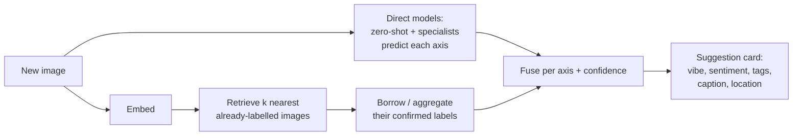
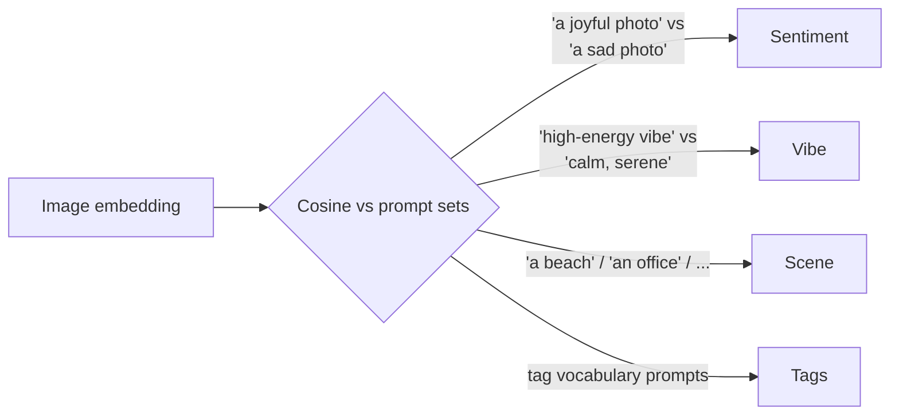
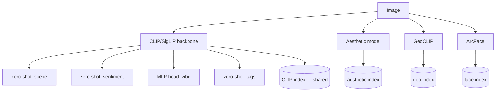
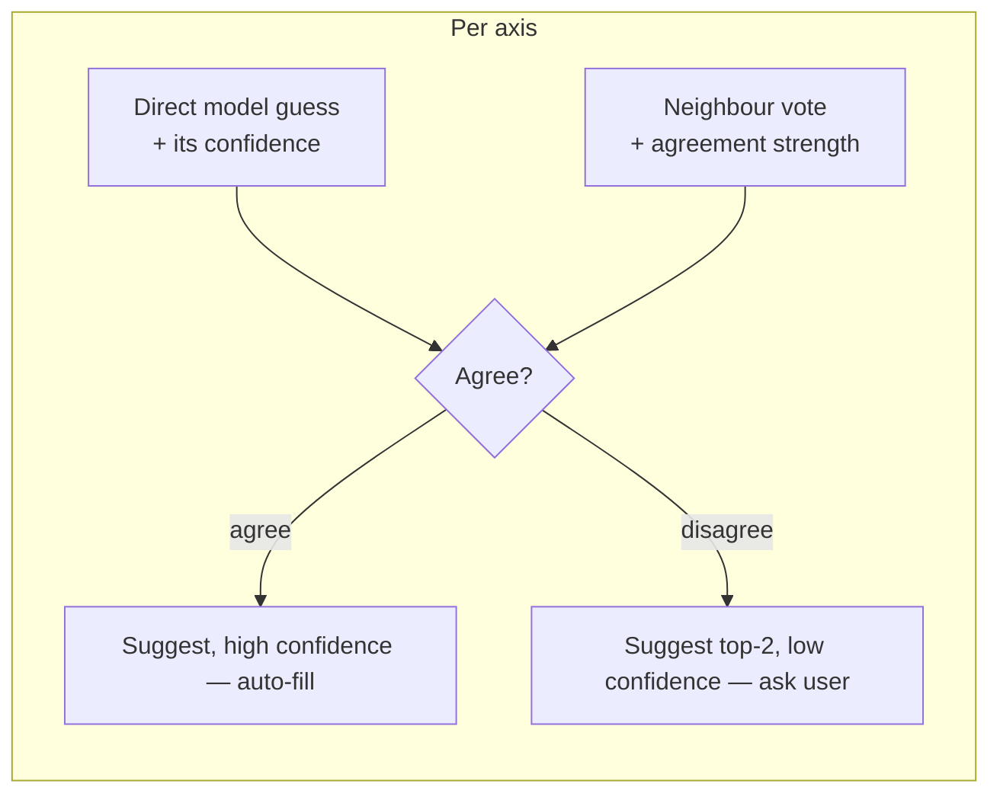
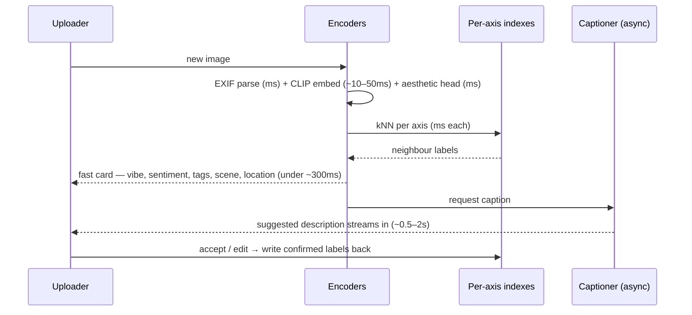
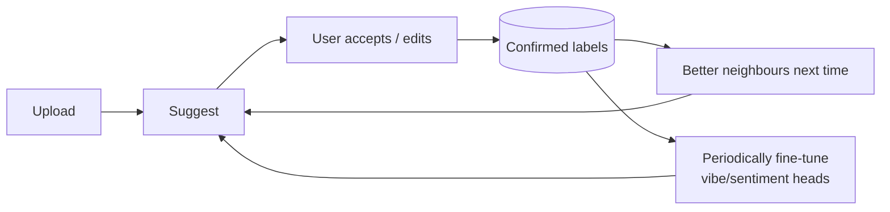

# RAG Guide — Chapter 12: Worked Example 2 — Multi-Axis Image Enrichment at Upload

> A second, different worked example. You have **lots of images** and, **the
> moment one is uploaded**, you want instant **suggestions along many axes** —
> vibe/mood, sentiment, a description, tags, context/scene, location — *before*
> the user does any searching. This is **not** search-time autosuggest
> ([Ch. 10 §10.6](10-on-device-suggestions-and-media.md)); it's **ingest-time
> enrichment**: predict-and-propose metadata for a brand-new item. The trick is to
> combine **cheap per-axis models** (mostly CLIP zero-shot + a few specialists)
> with a **RAG step that borrows labels from the image's nearest neighbours** in
> the existing corpus. This chapter answers "is that possible?" (yes), and — your
> core question — **what vector/model powers each axis**. Running scenario:
> **VibeVault**, a large image library (brand assets / stock / personal memories).

---

## 12.1 The problem — enrichment, not search

Two superficially similar features, fundamentally different:

| | Search-time suggestions ([§10.6](10-on-device-suggestions-and-media.md)) | **Ingest-time enrichment (this chapter)** |
|---|---|---|
| Trigger | User **types a query** | User **uploads an image** |
| Goal | Complete the query / preview results | **Propose metadata for the new item** (vibe, sentiment, tags, caption, location) |
| Direction | query → find items | item → find *attributes* |
| RAG role | retrieve items | retrieve **neighbours to borrow their labels** |

You want: drop an image in → within a moment, a card appears — *"Vibe: energetic
(0.82) · Sentiment: positive · Tags: beach, sunset, friends · Suggested caption:
'Golden-hour on the coast' · Location: Lisbon (from EXIF)"* — each field editable,
each with a confidence. That's enrichment.

## 12.2 Is it possible? Yes — two ingredients

1. **Direct prediction** — small models score each axis from the pixels: CLIP
   **zero-shot** (compare the image embedding to text prompts), plus a few
   specialists (an aesthetic head, a captioner, EXIF parsing).
2. **Neighbour-RAG** — embed the image, find its nearest neighbours among images
   you've *already labelled*, and **aggregate their confirmed attributes**
   (similarity-weighted vote). Where the model and the neighbours agree,
   confidence is high; where they disagree, flag it for the user.

Neither alone is enough: direct models are generic (they don't know *your* tag
vocabulary or house style); neighbours alone fail on genuinely new content (cold
start). Fused, they cover each other — and the neighbour set **improves every time
a user confirms a label** (§12.8).

## 12.3 The axes — and what vector/model each one needs

This is the heart of your question: *what vectors could be provided here?* Per
axis, you have a **direct model**, an optional **dedicated embedding**, and a
**RAG (borrow-from-neighbours)** path.

| Axis | Direct model (predict from pixels) | Vector / embedding | Neighbour-RAG (borrow) |
|---|---|---|---|
| **Context / scene** | Places365 CNN; **CLIP/SigLIP zero-shot** scene prompts | CLIP/SigLIP image embedding (the shared backbone) | neighbours' confirmed scene |
| **Tags / objects** | **RAM / RAM++ (Recognize Anything)** tagger; CLIP zero-shot vs your tag vocabulary | CLIP embedding + tag-text embeddings | neighbours' tags → collaborative tagging |
| **Description / caption** | **VLM** (BLIP-2 / Moondream 2 / LLaVA / Qwen-VL) | text embedding of the caption | few-shot the VLM with neighbour captions → match house style/length |
| **Sentiment** | Visual-sentiment classifier; CLIP zero-shot (positive/neutral/negative); **facial-emotion (FER)** if people present | CLIP embedding (or a sentiment-tuned head) | neighbours' confirmed sentiment |
| **Vibe / mood / aesthetic** | **LAION aesthetic predictor** or **NIMA** (a score); CLIP zero-shot mood prompts ("energetic", "calm", "moody"); colour/brightness stats | aesthetic embedding (CLIP → small MLP) | neighbours' vibe ratings |
| **Location** | **EXIF GPS** → reverse-geocode (direct metadata, when present); **GeoCLIP / StreetCLIP** visual geolocation or landmark recognition when no GPS | GeoCLIP geo-embedding | neighbours from the same shoot/cluster |
| **Camera / technical metadata** | **EXIF** parse (time, device, orientation, ISO) | — (structured fields) | — |
| **People / identity** | Face detect + **ArcFace** identity ([§3.8](03-multimodal-rag.md)); FER emotion | face embedding | link to known people |

Key realisation: **you do not need a separate deep embedding for every axis.** One
strong **CLIP/SigLIP embedding** feeds *most* axes via **zero-shot prompts** and
via neighbour retrieval. You only add a **dedicated vector/model** where CLIP is
genuinely weak — **aesthetics/vibe** (aesthetic predictor), **precise location**
(GeoCLIP/EXIF), **fine tagging** (RAM++), **identity** (ArcFace).

### 12.3.1 How CLIP zero-shot turns one embedding into many axes

CLIP puts images and text in one space ([§3.3](03-multimodal-rag.md)), so you can
"ask" an image a question by comparing it to candidate **text prompts** and taking
the closest:

One image encode (~10–50 ms), then each axis is just cosine similarities against a
small prompt set — near-free. That's why many axes come "for free" off the single
backbone.

## 12.4 Two ways to "vectorize by many points of view"

You framed it as vectorizing images by different viewpoints. Two architectures:

- **A. One backbone, many heads (default).** Compute **one** CLIP/SigLIP embedding;
  derive each axis with a zero-shot prompt set or a tiny trained **MLP head**
  (sentiment head, vibe head…). Cheap, one vector to store, fast. Best starting
  point.
- **B. Specialized embedding per axis (add selectively).** Where a viewpoint needs
  representation CLIP doesn't capture — **aesthetic** (LAION/NIMA), **geo**
  (GeoCLIP), **face identity** (ArcFace), maybe a **sentiment-tuned** encoder —
  give that axis its **own embedding and its own nearest-neighbour index**.

Rule: **start with A**, promote an axis to **B** only when its suggestions are
demonstrably poor off the shared CLIP vector.

## 12.5 The RAG twist — borrowing labels from neighbours

The "based on other RAG elements" part. For each axis, retrieve the new image's
**k nearest neighbours** in the relevant space among **already-confirmed** images,
then aggregate their labels:

- **Categorical axes (scene, sentiment, tags):** similarity-weighted **vote** —
  each neighbour contributes its confirmed label weighted by how close it is.
- **Numeric axes (vibe score, aesthetic):** similarity-weighted **average**.
- **Free-text (caption):** feed the neighbours' captions to the VLM as **few-shot
  examples** so the new caption matches your corpus's tone and length.

Then **fuse** the neighbour signal with the direct model:

Fusion gives you a **calibrated confidence** almost for free: model + neighbours
agreeing is strong evidence; disagreement is exactly where you want a human. It
also injects **your** taxonomy and style (neighbours carry *confirmed* labels in
your vocabulary), fixing the "generic model doesn't know our tags" problem.

## 12.6 Upload-time flow & latency budget

Instant means encode-once, then cheap lookups; defer only the slow captioner.

- **Fast axes (< ~300 ms):** EXIF, CLIP embed, all zero-shot axes, aesthetic score,
  and per-axis neighbour votes — show these immediately.
- **Slow axis (caption):** the VLM is the one heavy call — stream it in a beat
  later or make it on-demand. Everything else already painted.
- **Precompute the corpus:** existing images are embedded/indexed at rest, so the
  *only* work at upload is encoding the **one** new image ([Ch. 9](09-edge-devices.md)
  edge rules apply — quantized ONNX CLIP, sqlite-vec).

### 12.6.1 Minimum hardware to run it smoothly

Lighter than PeopleFinder — there's **no always-on big generator**. The fast axes
(CLIP + zero-shot + aesthetic + ANN) are CPU-friendly; the only heavy piece is the
**VLM captioner**, and it can be async. Size for **ingest throughput** if the
library is large.

| Tier | Compute | RAM | Runs smoothly | Notes |
|---|---|---|---|---|
| **Minimum, fast captions** | 8-core CPU **+ 8–12 GB GPU** (RTX 3060 12GB / L4) | 16–32 GB | Instant fast-axis card **+ small VLM** (Moondream 2 ~1.8B / BLIP) sub-second captions | Best interactive feel |
| **CPU-only (caption async)** | 8-core CPU | 16 GB | Fast-axis card in a few hundred ms; **VLM caption slow (several s) → async / on-demand** | Perfectly usable if captions needn't be instant |
| **Bulk backfill (large library)** | **16–24 GB GPU** | 32 GB | Encoding **millions** of images (CLIP + RAM++ tagger) at speed | GPU strongly recommended; else batch overnight |
| **Edge appliance** | **Jetson Orin Nano 8 GB** (comfortable: Orin NX 16 GB) | 8–16 GB unified | On-box CLIP + zero-shot + Moondream captions | Great offline enrichment box |

Storage is dominated by the **images/thumbnails**; the vector index is small (one
CLIP vector + attributes per image). **Bottleneck rule:** a modest GPU makes
captions instant; without one, keep the VLM off the critical path and the fast
axes still feel immediate.

## 12.7 Storage

- **One shared CLIP index** serves scene/sentiment/tags/vibe (via zero-shot) *and*
  the neighbour retrieval for those axes.
- **A small `attributes` table** per image holds the confirmed values (vibe score,
  sentiment, tags[], caption, location, source=model|neighbour|user, confidence).
  This is what neighbour-voting reads and writes.
- **Extra indexes only for Architecture-B axes:** an aesthetic-vector index, a
  GeoCLIP index, a face index — each its own collection ([§5.7](05-vector-databases.md)),
  never mixed with CLIP.
- Any store from [Chapter 5](05-vector-databases.md) works; **Chroma/LanceDB**
  make the image+vector+attributes co-location easy, **Qdrant/pgvector** if you
  already run them.

## 12.8 The feedback loop — suggestions get better as you go

Enrichment is a flywheel: every **accept/edit** becomes a **confirmed label**,
which (a) grows the neighbour pool so future votes are stronger, and (b) can
**train the per-axis MLP heads** once enough labels accumulate (active learning).

Cold start (empty corpus) → rely on direct models + generic prompts; as confirmed
labels accumulate, neighbour-RAG takes over and accuracy climbs on *your* content.

## 12.9 What real apps already do (so this isn't hypothetical)

The building blocks are proven in the apps from [Chapter 10](10-on-device-suggestions-and-media.md):

- **LibrePhotos** already runs **CLIP embeddings**, **Places365 / SigLIP 2** scene
  tags, and **captioners (im2txt/BLIP/Moondream 2)** at scan time — exactly the
  direct-model half, per image.
- **PhotoPrism** does label prediction with **per-label thresholds** and
  externalizes captioning to a **local Ollama VLM** — the same "small models tag,
  VLM describes" split.
- **Immich** computes a **CLIP embedding once and reuses it** for search *and*
  duplicates, and runs **OCR** — the "one embedding, many features" principle
  (§12.4-A) in production.

None of them does the **neighbour-RAG fusion + confidence** loop across *all* your
axes at upload — that's the value this design adds on top.

## 12.10 Pitfalls

- **Don't over-trust the model.** Sentiment/vibe are subjective and models are
  biased; always show them as *editable suggestions with confidence*, never
  silently-applied truth.
- **Cold start.** Neighbour-RAG is weak until you have confirmed labels — lead with
  direct models and improve over time (§12.8).
- **Taxonomy drift.** Constrain tags/scene to a **controlled vocabulary** (like
  PhotoPrism's `rules.yml`) or votes fragment across synonyms.
- **Privacy & sensitivity.** **Facial-emotion and sentiment inference on people**
  is biometric-adjacent and ethically loaded ([§3.8](03-multimodal-rag.md)) — get
  consent, allow opt-out, prefer on-device ([Ch. 9](09-edge-devices.md)).
- **Latency creep.** Keep the VLM off the critical path; one image encode + ANN is
  your budget.

## 12.11 TL;DR

- **Ingest-time enrichment** ≠ search suggestions: on **upload**, propose per-axis
  metadata (vibe, sentiment, tags, caption, scene, location) with confidence.
- It works by fusing **direct models** (CLIP **zero-shot** for most axes, plus
  specialists) with **neighbour-RAG** (borrow confirmed labels from the nearest
  already-labelled images); agreement → high confidence, disagreement → ask the user.
- **What vectors/models per axis:** one shared **CLIP/SigLIP** embedding drives
  scene/sentiment/tags/vibe via zero-shot; add **RAM++** (tags), a **VLM** (caption),
  an **aesthetic predictor** (vibe), **GeoCLIP + EXIF** (location), **ArcFace/FER**
  (people) only where CLIP is weak.
- **Architecture A** (one backbone + heads) is the default; promote an axis to
  **B** (its own embedding + index) only when needed.
- **Precompute the corpus**, encode only the new image, keep the **VLM async** →
  sub-second card. Confirmed labels form a **feedback flywheel** that improves
  suggestions over time.

Next: [Chapter 13 — Products & the AI era](13-products-and-ai-era.md).
