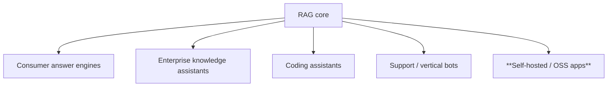
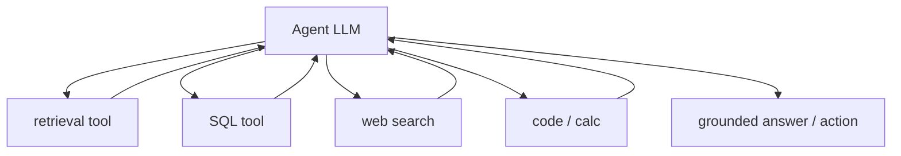

# RAG Guide — Chapter 13: Products & the AI Era

> Who actually ships RAG, and where it's heading. We survey the **products built
> on RAG** — consumer answer engines, enterprise knowledge assistants, coding
> tools, and the **self-hostable open-source apps** this guide's bias favors —
> then place RAG in the **agent era**: RAG as a tool, **MCP** as the integration
> standard, and the perennial **"long context killed RAG?"** debate (spoiler: it
> didn't). This chapter is orientation, not build instructions.

---

## 13.1 The products, by category

- **Consumer answer engines** — **Perplexity**, **ChatGPT search**, **Google AI
  Overviews / Gemini**: RAG *over the live web*. Query → search → read pages →
  synthesize a cited answer. The citation UX these popularized is now table stakes.
- **Enterprise knowledge assistants** — **Glean**, **Microsoft 365 Copilot**,
  **Notion AI**, **Dropbox Dash**, **Atlassian Rovo**, **Vectara**: RAG over *your
  company's* docs/wiki/tickets/email, usually with permissions-aware retrieval and
  a knowledge graph of people/projects (conceptually a corporate PeopleFinder).
- **Coding assistants** — **Cursor**, **GitHub Copilot**, **Cody**: RAG over a
  *codebase* (repo indexing + retrieval) so completions/answers are grounded in
  your actual code.
- **Support / vertical bots** — customer-support, legal, medical, and docs
  chatbots: RAG over a curated corpus with strict grounding/citations.

## 13.2 The self-hosted / open-source stack (this guide's home turf)

You can run a full RAG *product* without any SaaS:

| Project | What it is |
|---|---|
| **Open WebUI** | Chat UI for Ollama with built-in **docs/RAG** and web search |
| **AnythingLLM** | All-in-one desktop/server RAG app; local models + vector DB |
| **Onyx** (ex-Danswer) | Enterprise-style search/QA over connectors, self-hosted |
| **PrivateGPT / LocalGPT** | Offline "chat with your documents" |
| **Khoj / Jan** | Personal, local-first AI with retrieval |
| **Kotaemon / RAGFlow / Verba** | Opinionated end-to-end RAG apps |
| **Jetson Copilot** | On-device RAG reference (Ollama + LlamaIndex, [Ch. 9](09-edge-devices.md)) |

Pair any of these with the models ([Ch. 4](04-models.md)), a vector DB
([Ch. 5](05-vector-databases.md)), and — for media — the Immich/PhotoPrism/
LibrePhotos patterns ([Ch. 10](10-on-device-suggestions-and-media.md)), and you
own the entire stack.

## 13.3 RAG in the agent era — retrieval becomes a tool

Modern systems don't hard-code "always retrieve." An **agent** decides when to
retrieve, what to query, and which source — retrieval is **one tool among many**
(search, SQL, code exec, APIs). This is Agentic RAG ([§2.6](02-evolution-and-types.md)).

### MCP — the integration standard

The **Model Context Protocol (MCP)** standardizes how models/agents connect to
tools and data sources. In RAG terms: your retriever/knowledge base is exposed as
an **MCP server**, and any MCP-capable client (an IDE agent, a desktop assistant)
can query it without bespoke glue. This is quickly becoming the default way to
**plug a RAG index into an agent ecosystem** — build your PeopleFinder retriever
once, expose it over MCP, and every agent can use it.

## 13.4 "Did long context kill RAG?" — no, they're complementary

Context windows reached **100k–1M+ tokens**, reviving the "just paste everything"
argument. Where each actually wins:

| Dimension | Long context | RAG |
|---|---|---|
| Corpus size | Bounded by window | **Unbounded** (billions of chunks) |
| Cost / latency | **Grows with tokens every call** | Retrieve a few chunks, cheap |
| Freshness | Re-paste to update | **Swap the index**, no re-prompt |
| Citations | Weak/implicit | **Precise, per-chunk** |
| "Lost in the middle" | Real at scale | Avoided (few focused chunks) |
| Privacy/on-device | Huge prompts hard on edge | **Fits small hardware** ([Ch. 9](09-edge-devices.md)) |

**The synthesis:** long context doesn't replace RAG — it **relaxes** it. With a
bigger window you can retrieve **fewer, larger** chunks (less aggressive chunking),
pass more candidates to the final synthesis, and lean less on perfect reranking.
The industry framing is shifting from "RAG vs long context" to **context
engineering**: getting the *right* tokens into the window, whether by retrieval,
memory ([Ch. 8](08-memory-and-personalization.md)), or a long paste — usually a
blend. RAG remains the only option that's cheap, fresh, citable, unbounded, and
edge-friendly.

## 13.5 Converging techniques

- **RAG + fine-tuning** (e.g. **RAFT**) — fine-tune a model to use retrieved
  context better, combining both approaches ([§1.1](01-foundations.md)).
- **Graph + vector + memory** converging into one "context layer" — GraphRAG
  ([Ch. 7](07-graph-rag.md)) and temporal memory (Graphiti, [Ch. 8](08-memory-and-personalization.md))
  are becoming standard parts of serious systems, not exotic add-ons.
- **Multimodal-native & on-device** — the trend this whole guide rides: small
  quantized models + local vector DBs putting RAG on phones, cameras, and boards.

## 13.6 Where it's heading (safe bets)

- **Agentic retrieval by default** — models plan multi-step retrieval; single-shot
  RAG becomes the fast path, not the whole system.
- **Standardized plumbing (MCP)** — indexes as interchangeable tools.
- **Better evals** — retrieval/generation measurement ([§1.11](01-foundations.md))
  becomes routine, not an afterthought.
- **Multimodal + memory as first-class** — text-only, stateless RAG is the
  exception; catalogs like PeopleFinder (images + graph + memory + edge) are the
  norm.

## 13.7 Build vs buy — and why this guide chose "build"

SaaS RAG (Vectara, managed Glean, hosted vector DBs) is fastest to a demo and
right when data isn't sensitive and scale is someone else's problem. **Self-host**
when you need **data ownership/privacy**, **offline/edge**, **cost control at
scale**, or **full transparency** — exactly PeopleFinder's constraints, and the
premise of this guide. The good news: the open stack (Ch. 4–7, 9–10) is now
capable enough that "build and own" is a mainstream choice, not a compromise.

## 13.8 TL;DR

- RAG ships everywhere: **answer engines** (Perplexity, ChatGPT, Gemini),
  **enterprise assistants** (Glean, M365 Copilot, Notion), **coding tools**
  (Cursor, Copilot), and a rich **self-hostable OSS** ecosystem (Open WebUI,
  AnythingLLM, Onyx, PrivateGPT, Jetson Copilot).
- In the **agent era**, retrieval is **a tool**, and **MCP** is becoming the
  standard way to expose a RAG index to any agent.
- **Long context didn't kill RAG** — it complements it. RAG stays unique on
  **cost, freshness, citations, scale, and edge**; the frame is now **context
  engineering** (retrieval + memory + long context together).
- Trends: **agentic retrieval, MCP plumbing, real evals, multimodal + memory
  first-class, on-device**. Self-hosting is now a mainstream, capable choice.

Back to the [cheat sheet](99-cheatsheet.md) for one-page decisions, or the
[README](README.md) for the full map.
