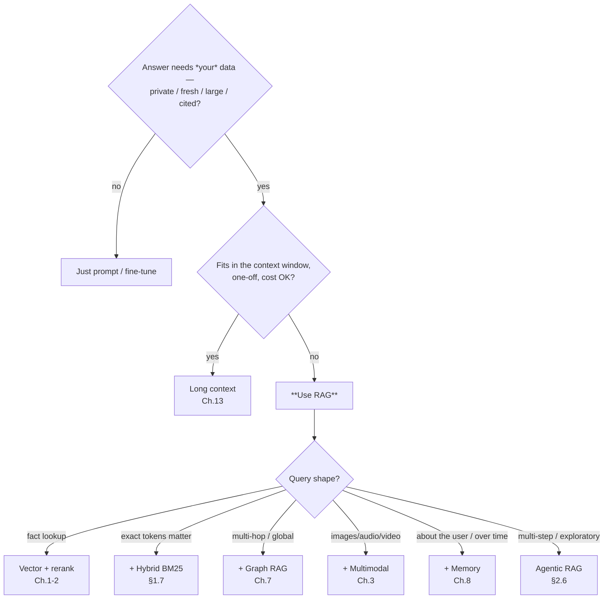

# RAG Guide — Cheat Sheet & Decision Flowcharts

> One-page reference: do you even need RAG, which altitude to build at, and
> pick-your-stack tables for models, vector DBs, and edge hardware. Every row
> links back to the chapter that justifies it.

---

## Do I need RAG? (and which kind)

## Build order (climb only when a measured failure demands it)

1. **Naive** — embed → search → stuff → generate ([Ch. 1](01-foundations.md)).
2. **+ Hybrid** (vector + BM25, RRF) ([§1.7](01-foundations.md)).
3. **+ Metadata pre-filtering** — often the biggest win ([§2.3.1](02-evolution-and-types.md)).
4. **+ Reranking** (cross-encoder, retrieve-wide-rerank-narrow) ([§1.8](01-foundations.md)).
5. **+ Contextual chunking** ([§1.4.1](01-foundations.md)).
6. **+ Query rewriting / HyDE / decomposition** ([§2.3.1](02-evolution-and-types.md)).
7. **+ Routing / multimodal / graph / memory / agentic** — only as needed
   ([Ch. 2](02-evolution-and-types.md)–[8](08-memory-and-personalization.md)).
8. **Measure throughout** — retrieval vs generation, separately ([§1.11](01-foundations.md)).

## Model picks ([Ch. 4](04-models.md))

| Role | Default | Multilingual | Edge |
|---|---|---|---|
| Text embed | `bge-small-en-v1.5` | **`bge-m3`** / `multilingual-e5` | `bge-small` int8 + matryoshka |
| Rerank | `bge-reranker-base` | `bge-reranker-v2-m3` | skip or base on CPU |
| Image↔text | OpenCLIP `ViT-B/32` | `nllb-clip` / SigLIP | CLIP ONNX / NanoDB |
| Audio (speech) | `faster-whisper` | whisper multilingual | distil-whisper |
| Faces | InsightFace ArcFace (⚠ licence) | — | InsightFace ONNX |
| Generator | Qwen 2.5 7B / Llama 3.1 8B | Qwen 2.5 | 3B Q4 (Pi) / 7B Q4 (Orin NX) |

## Vector DB picks ([Ch. 5](05-vector-databases.md))

| Situation | Pick |
|---|---|
| Already on Postgres, < few M vectors | **pgvector / VectorChord** |
| Standalone service, filtering + hybrid | **Qdrant** |
| Edge / embedded / no server | **sqlite-vec / LanceDB / FAISS** |
| Prototyping | **Chroma** |
| Billions of vectors | **Milvus / Vespa** |
| Already run Elasticsearch/Redis | **ES kNN / Redis vector** |

**Always:** pre-filter (not post), hybrid for exact tokens, quantize on the edge
(int8/PQ/RaBitQ + full-vector rerank).

## Multimodal map ([Ch. 3](03-multimodal-rag.md))

| Need | Model |
|---|---|
| Text ↔ image search | CLIP / OpenCLIP / SigLIP; **NV-CLIP** (enterprise/NVIDIA NIM) |
| "Who is this?" (identity) | ArcFace / FaceNet — **separate index**, ⚠ biometric + licence |
| Speech → searchable | Whisper → text RAG |
| Non-speech audio | CLAP |
| Video | keyframes → CLIP + Whisper transcript |
| Visual documents (slides/scans) | ColPali / ColQwen |
| **Rule** | **One index per embedding space; route + fuse** |

## Memory tools ([Ch. 8](08-memory-and-personalization.md))

| Need | Tool |
|---|---|
| Model *the user* (preferences / theory-of-mind) | **Honcho** |
| Temporal facts that change (provenance, "true when") | **Graphiti** ← what "Graphify" means |
| Drop-in "remember facts" | **Mem0** |
| Agent owns its own paged memory | **Letta / MemGPT** |
| One-shot graph over static corpus | GraphRAG ([Ch. 7](07-graph-rag.md)) |

## Edge hardware ([Ch. 9](09-edge-devices.md))

| Board | RAM | LLM sweet spot | Best for |
|---|---|---|---|
| Raspberry Pi 5 | up to 16 GB | 3B Q4 (~4–9 tok/s) | text RAG, budget; +Hailo for vision |
| Jetson Nano (orig) | 4 GB | ≤1B (slow) | **CUDA vision/CLIP inference** (dated) |
| Jetson Orin Nano | 8 GB | 1–4B | compact multimodal appliance |
| **Jetson Orin NX** | 16 GB | **7–8B Q4** | **full offline RAG kiosk (sweet spot)** |
| Jetson AGX Orin | 64 GB | up to 70B Q4 | on-prem server-in-a-box |

**Nano vs Pi:** Nano's CUDA GPU wins **vision/CLIP/face**; Pi 5 wins **text-LLM +
modern tooling** (more RAM, faster CPU). New build → **Orin Nano**. Edge stack:
llama.cpp/Ollama + sqlite-vec + ONNX CLIP; reuse **NanoDB / Jetson Copilot**.

## Frameworks ([Ch. 6](06-frameworks-langchain.md))

| Want | Use |
|---|---|
| Agentic / graph orchestration | **LangGraph** / LlamaIndex |
| RAG *is* the app (great defaults + graph) | **LlamaIndex** |
| Typed production pipelines | **Haystack** |
| Simple / edge / latency-critical | **Thin or no framework** |
| Low-code visual builder | Dify / Flowise |

## Ten gotchas that bite everyone

1. Different embedding model for query vs chunks → garbage. Use the **same** one.
2. Wrong metric/prefix/normalization vs the model card → silent quality loss.
3. Chunks too big/small, no overlap → missed or noisy retrieval.
4. Pure vector, no keyword → whiffs on names/codes/exact terms.
5. **Post**-filtering instead of **pre**-filtering → too few or irrelevant results.
6. No reranker → right doc, wrong passage.
7. No grounding instruction → confident hallucination.
8. Mixing embedding spaces in one index (CLIP + faces) → meaningless search.
9. Not measuring retrieval vs generation separately → debugging blind.
10. Rebuilding the whole graph/index on every edit → cost blowup; do incremental.

## Glossary

**ANN** approximate nearest neighbour · **HNSW/IVF/PQ** ANN index types ·
**BM25** keyword ranking · **RRF** reciprocal rank fusion · **HyDE** hypothetical
document embeddings · **CRAG/Self-RAG** self-grading RAG · **CLIP/SigLIP/CLAP**
joint embedding encoders · **ArcFace/FaceNet** face-identity embeddings ·
**GGUF** quantized model format · **MTEB** embedding benchmark · **MCP** model
context protocol · **VLM** vision-language model · **matryoshka** truncatable
embeddings.

---

Full guide: [README / chapter map](README.md).
