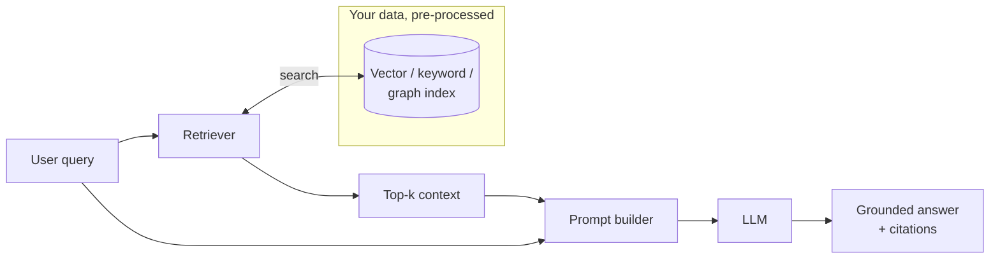
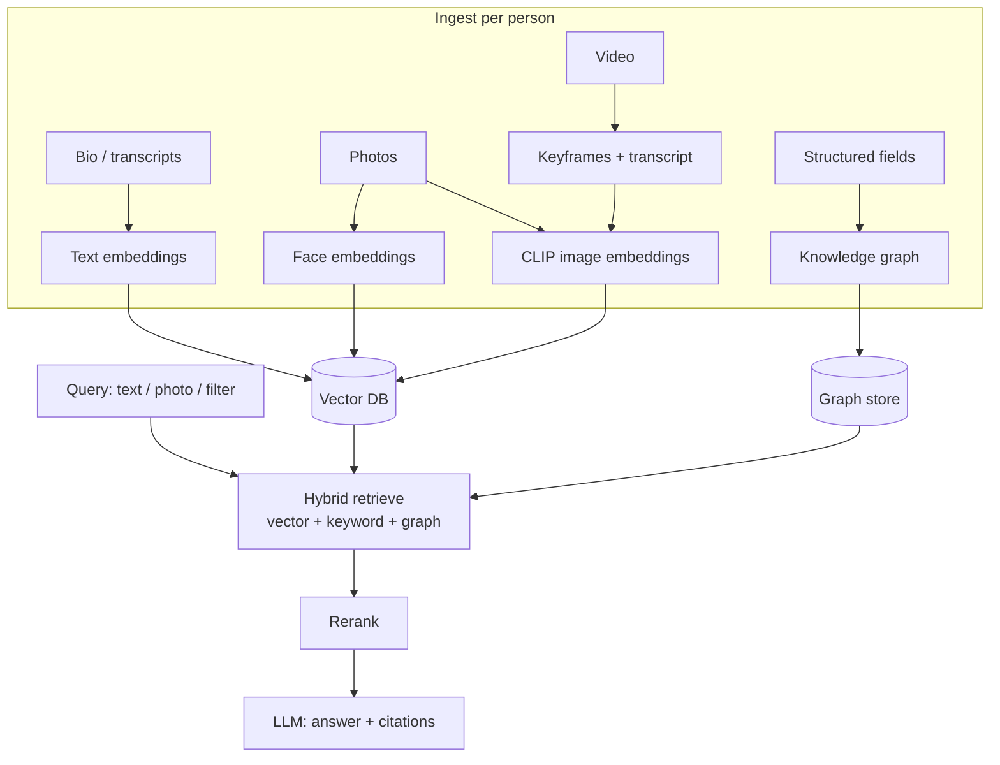

# RAG — A Deep but Friendly Guide (self-hosted & on-device edition)

> A standalone, hands-on guide to **Retrieval-Augmented Generation**: what it is,
> why it exists, how the pipeline is actually built, and how it evolved from a
> naive "stuff some chunks into the prompt" trick into agentic, multimodal, and
> graph-based systems. The bias throughout is **self-hosted, open-source, small
> resources** — running RAG on your own boxes and on edge hardware (Raspberry Pi,
> Jetson Nano/Orin), *not* renting a SaaS. We cover the models you can actually
> download (embedding, reranking, CLIP/CLAP/NV-CLIP, LLMs), the vector databases
> that fit a single node, LangChain/LlamaIndex/Haystack, **Graph RAG** and when
> it earns its keep, and **memory/personalization** tools (Honcho, Graphiti). A
> single **running example — a people-catalog matcher** — threads through every
> chapter so the abstractions stay concrete. We also mine three real self-hosted
> photo apps — **Immich, PhotoPrism, LibrePhotos** — for battle-tested ideas.

---

## Who this is for

You can write code, you understand a database and an HTTP service, and you want
to *build* a retrieval system rather than call someone's `/v1/chat` endpoint.
You care about owning your data, running on hardware you control, and knowing
which knob does what. You don't need an ML PhD — we explain the ML where it
matters and skip the derivations.

## The one-paragraph version of RAG

An LLM only knows what was in its training data and what you put in the prompt.
**RAG** is the pattern of *retrieving relevant information at query time and
placing it into the prompt*, so the model answers from **your** data — fresh,
private, and citable — instead of from its frozen weights. That's it. Everything
else in this guide is about doing that *retrieval* well: how you split content,
how you turn it into vectors, how you search, how you re-rank, how you handle
images and audio and video, how you use a graph when relationships matter, and
how you squeeze the whole thing onto a $70 board.

## Why RAG instead of the alternatives

| Approach | What it is | Best when | Weakness |
|---|---|---|---|
| **RAG** | Retrieve external context at query time | Data changes, must be private, needs citations, large corpus | Retrieval quality caps answer quality |
| **Fine-tuning** | Bake knowledge/behaviour into weights | Fixed style/format/skill, narrow domain | Stale the moment data changes; costly to redo |
| **Long context** | Paste everything into a huge prompt | Corpus fits the window, one-off | Cost & latency scale with tokens; "lost in the middle"; no persistence |
| **Tool/agent calls** | Model calls APIs/DBs live | Structured/transactional data, actions | Needs good tools; not for fuzzy semantic recall |

RAG and these are **not mutually exclusive** — production systems fine-tune a
small reranker, keep a long-context model for the final synthesis, and let an
agent decide *when* to retrieve. Chapters 2 and 12 come back to this.

---

## The running example — **PeopleFinder**

Every chapter grounds its ideas in one system, so you see the same problem
solved at each layer of sophistication.

> **PeopleFinder** is a self-hosted catalog of ~50,000 **people** — think a
> talent agency, a casting database, an alumni network, or an internal "who
> knows what" directory. Each person record carries:
> - **Structured fields**: name, roles/skills, location, languages, availability.
> - **Free text**: bio, notes, interview transcripts, project write-ups.
> - **Photos**: one or more headshots plus candid/event photos.
> - **Video**: short clips (an intro reel, a talk).
>
> Users need to: **(a)** search in plain language ("Ukrainian-speaking backend
> engineer in Berlin who has spoken at a conference"), **(b)** search by image
> ("is this person in our catalog?" / "find people photographed outdoors"),
> **(c)** get **suggestions while they type** (autosuggest + query completion),
> **(d)** ask relationship questions ("who worked with Maria on Project Atlas?")
> and **(e)** get a **cited, summarized answer** ("shortlist candidates for this
> job description and explain why").

That single scenario forces us to touch **text RAG** (bios/transcripts),
**multimodal RAG** (photos/video, CLIP/face embeddings), **hybrid search +
reranking**, **Graph RAG** (people↔projects↔orgs relationships), **memory**
(the recruiter's evolving preferences), and finally **edge deployment** (run a
trimmed PeopleFinder on a Jetson at a kiosk or field laptop with no cloud).

---

## How to read this guide (chapter map)

Read top-to-bottom for the full story, or jump to what you need. Chapters are
standalone but cross-link.

| # | Chapter | You'll learn |
|---|---|---|
| 1 | [Foundations — how a RAG pipeline is actually built](01-foundations.md) | Chunking, embeddings, vector search, the retrieve→augment→generate loop, evaluation |
| 2 | [Evolution & the types of RAG](02-evolution-and-types.md) | Naive → advanced → modular → **agentic**; query rewriting, HyDE, fusion, reranking, self-RAG, corrective RAG, contextual retrieval |
| 3 | [Multimodal RAG](03-multimodal-rag.md) | Joint embedding spaces; images, audio, video; **CLIP, SigLIP, CLAP, NV-CLIP, ImageBind, ColPali**; captioning vs embedding |
| 4 | [Models you can self-host](04-models.md) | Embedding models, rerankers, multimodal encoders, and generator LLMs — sizes, quantization, how to choose |
| 5 | [Vector databases & storage](05-vector-databases.md) | FAISS, Qdrant, Milvus, Weaviate, Chroma, **pgvector**, LanceDB, **sqlite-vec**; HNSW/IVF/PQ; hybrid + filtering |
| 6 | [Frameworks — LangChain & friends](06-frameworks-langchain.md) | LangChain, LlamaIndex, Haystack, **LangGraph**; what each is for; when *not* to use a framework |
| 7 | [Graph RAG](07-graph-rag.md) | Knowledge-graph construction, Microsoft GraphRAG, local vs global queries, when a graph beats vectors |
| 8 | [Memory & personalization](08-memory-and-personalization.md) | **Honcho**, **Graphiti** (& the older Neo4j *Graphify*), Mem0, Letta — agent memory vs document RAG |
| 9 | [Edge devices — Raspberry Pi & NVIDIA Jetson](09-edge-devices.md) | What actually fits; **Jetson Nano vs Raspberry Pi**; Orin tiers; llama.cpp/Ollama; NanoDB, Jetson Copilot |
| 10 | [On-device suggestions & media libraries](10-on-device-suggestions-and-media.md) | Autosuggest, semantic photo/video search; lessons from **Immich, PhotoPrism, LibrePhotos** |
| 11 | [Worked example — the PeopleFinder matcher](11-worked-example-people-catalog.md) | The whole thing assembled: multimodal + graph + rerank, self-hosted, then shrunk to a Jetson |
| 12 | [Worked example 2 — image enrichment at upload](12-worked-example-image-enrichment.md) | **Ingest-time** multi-axis suggestions (vibe, sentiment, tags, caption, location) via zero-shot + neighbour-RAG |
| 13 | [Products & the AI era](13-products-and-ai-era.md) | Who ships RAG (Perplexity, Glean, Notion…), RAG + agents + MCP, RAG vs long context in 2025-26 |
| — | [Cheat sheet & decision flowcharts](99-cheatsheet.md) | Pick-your-stack tables, sizing, one-page decisions |

## Conventions

- **All diagrams are Mermaid** (render on GitHub / most markdown viewers).
- **Self-hosted first**: every recommendation is something you can `docker run`
  or `pip install` and own. SaaS is mentioned only for contrast.
- **"When to use / when not"** boxes end most sections — the goal is judgment,
  not a feature list.
- Model/tool facts current to **early 2026**; this space moves fast, so treat
  specific version numbers as "as of writing".
