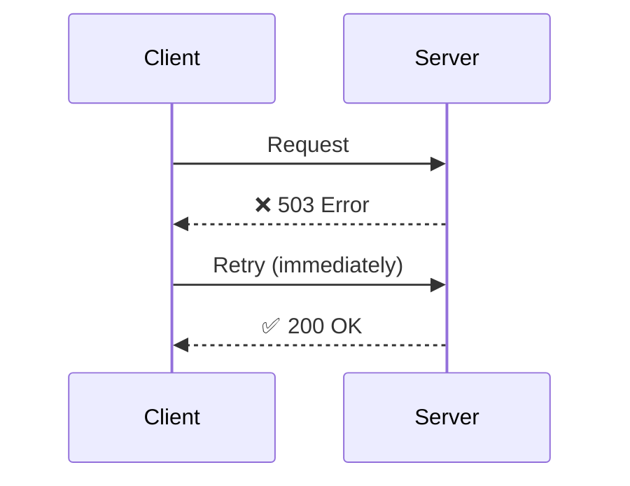
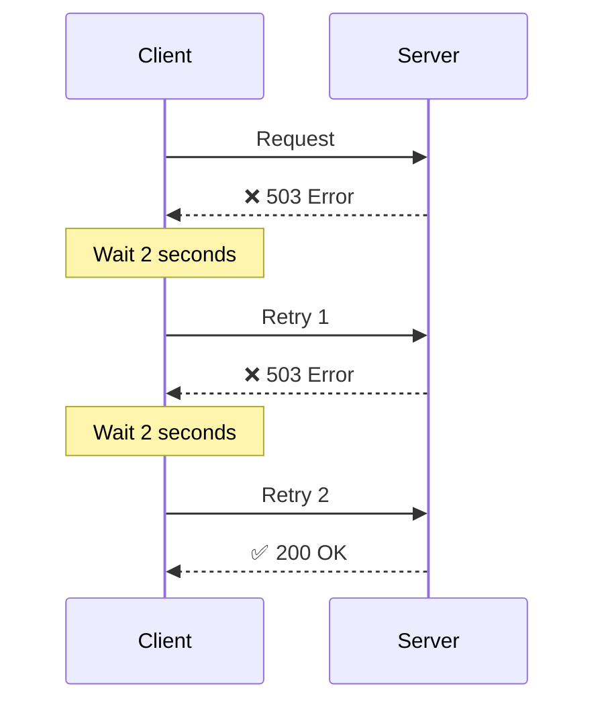
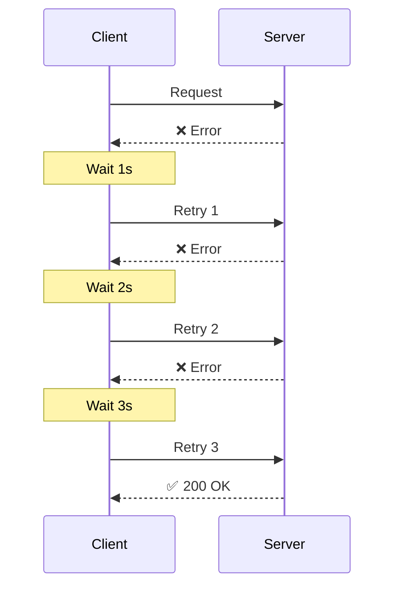
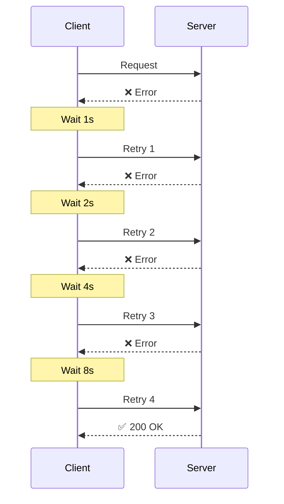
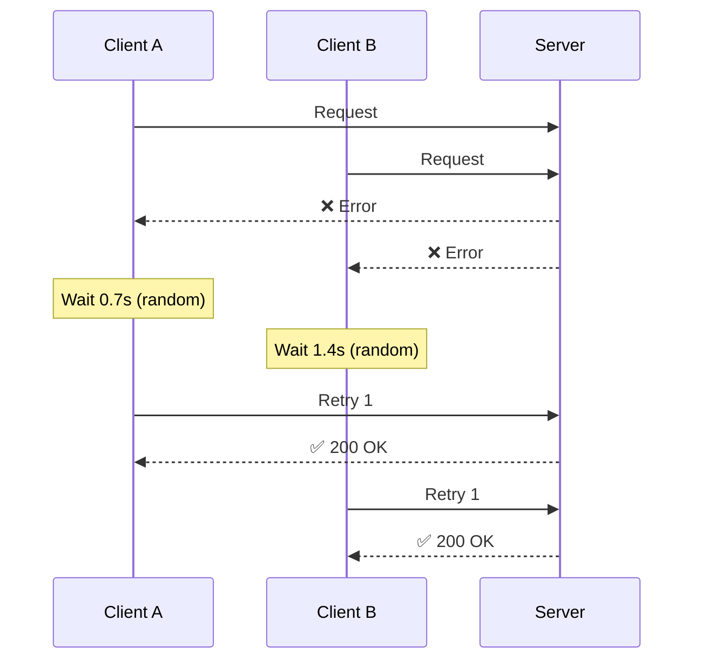
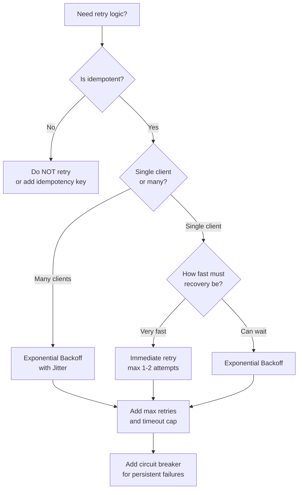
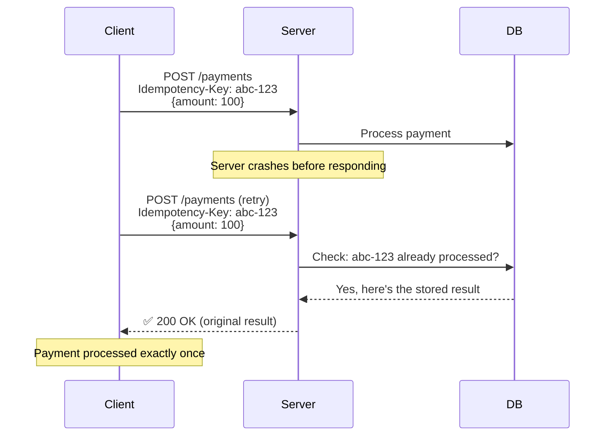
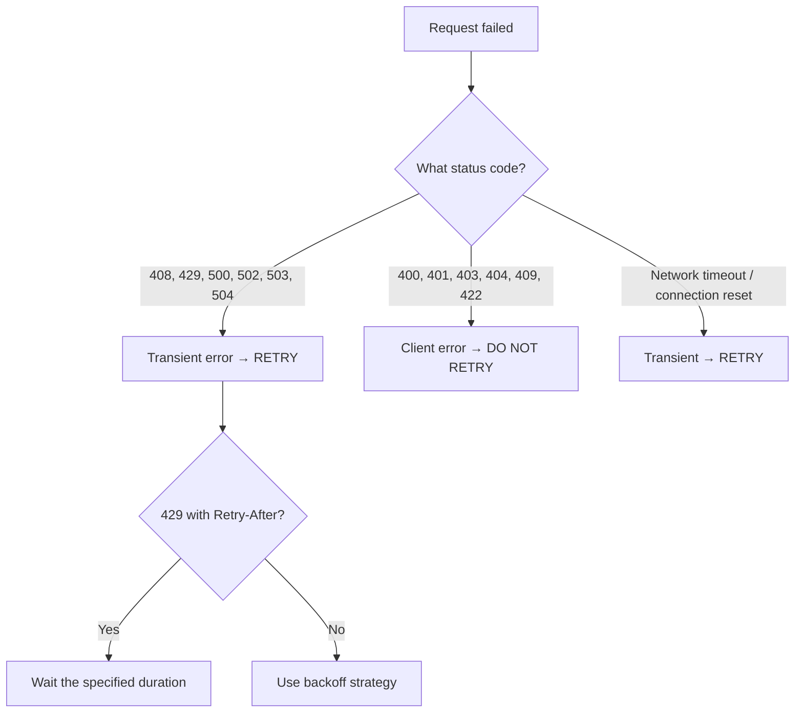
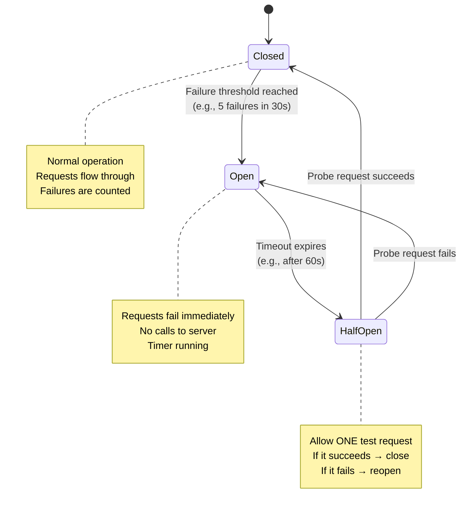
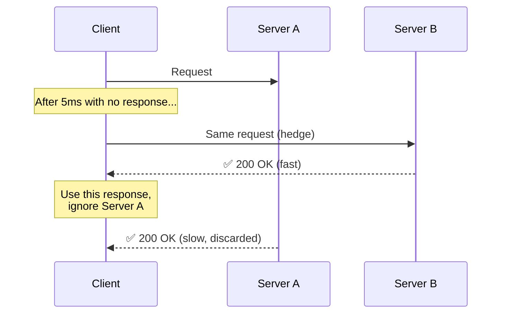

# Retry Strategies: Complete Guide

> A beginner-friendly guide to retry strategies, backoff algorithms, and resilience patterns in distributed systems.

---

## Table of Contents

1. [Why Do We Need Retries?](#1-why-do-we-need-retries)
2. [Retry Strategies](#2-retry-strategies)
   - [Immediate Retry](#21-immediate-retry)
   - [Fixed Delay](#22-fixed-delay)
   - [Linear Backoff](#23-linear-backoff)
   - [Exponential Backoff](#24-exponential-backoff)
   - [Exponential Backoff with Jitter](#25-exponential-backoff-with-jitter)
3. [Strategy Comparison](#3-strategy-comparison)
4. [When to Retry (and When Not To)](#4-when-to-retry-and-when-not-to)
5. [Advanced Patterns](#5-advanced-patterns)
   - [Circuit Breaker](#51-circuit-breaker)
   - [Retry Budgets](#52-retry-budgets)
   - [Hedged Requests](#53-hedged-requests)
6. [Retry in Practice](#6-retry-in-practice)
7. [Interview Discussion Points](#7-interview-discussion-points)

---

## 1. Why Do We Need Retries?

In distributed systems, failures are not the exception — they **are** the norm. Networks drop packets, servers restart, databases have momentary hiccups.

**The Restaurant Analogy:**

Imagine ordering food at a busy restaurant:
- Waiter didn't hear you → you repeat your order (immediate retry)
- Kitchen is slammed → you wait a minute, then ask again (fixed delay)
- Still not ready → you wait longer each time (backoff)
- Kitchen is on fire → stop asking, come back tomorrow (circuit breaker)

### Types of Transient Failures

| Failure | Cause | Retryable? |
|---------|-------|------------|
| **Network timeout** | Packet lost, high latency | Yes |
| **503 Service Unavailable** | Server temporarily overloaded | Yes |
| **429 Too Many Requests** | Rate limit exceeded | Yes (after delay) |
| **Connection reset** | Server restarted mid-request | Yes |
| **Database deadlock** | Concurrent transaction conflict | Yes |
| **404 Not Found** | Resource does not exist | No |
| **400 Bad Request** | Malformed input | No |
| **401 Unauthorized** | Invalid credentials | No |

The key insight: **only retry transient failures** — errors that might succeed if you try again.

---

## 2. Retry Strategies

### 2.1 Immediate Retry

**The Simplest Strategy**

Failed? Try again right away. No waiting.



**Timing:**

```
Attempt 1: t=0ms     → fail
Attempt 2: t=0ms     → fail or succeed
Attempt 3: t=0ms     → fail or succeed
```

**When to Use:**

- The failure was a random blip (e.g., dropped packet)
- You only retry once or twice
- The server can handle the extra load

**Why It's Dangerous:**

If the server is overloaded, immediate retries make it worse — every client hammers the server simultaneously. This creates a **retry storm**.

```
                    Server under load
                         │
              ┌──────────┼──────────┐
              ▼          ▼          ▼
          Client A   Client B   Client C
          retries    retries    retries
          instantly  instantly  instantly
              │          │          │
              └──────────┼──────────┘
                         ▼
                 Server even MORE
                   overloaded
                         │
                         ▼
                   💥 Cascading
                      failure
```

---

### 2.2 Fixed Delay

**Wait the Same Amount of Time Between Retries**

Every retry waits the same fixed duration before trying again.



**Timing:**

```
Attempt 1: t=0s       → fail
            wait 2s
Attempt 2: t=2s       → fail
            wait 2s
Attempt 3: t=4s       → succeed
```

**When to Use:**

- Simple services with predictable recovery times
- Polling for a status change (e.g., waiting for a job to finish)
- The delay is aligned with the server's expected recovery

**Limitation:**

If 1,000 clients all fail at the same time, they all retry at the same time too — every 2 seconds, in lockstep. This is called the **thundering herd** problem.

```
t=0s:   1000 clients send requests → all fail
t=2s:   1000 clients retry simultaneously → all fail again
t=4s:   1000 clients retry simultaneously → all fail again
        ^^^^^^^^^^^^^^^^^^^^^^^^^^^^^^^^^^^
        All retries are synchronized!
```

---

### 2.3 Linear Backoff

**Increase Wait Time by a Fixed Amount Each Retry**

Each retry waits a bit longer than the last. The delay increases linearly.



**Timing (base = 1 second):**

```
Attempt 1: t=0s       → fail
            wait 1s
Attempt 2: t=1s       → fail
            wait 2s
Attempt 3: t=3s       → fail
            wait 3s
Attempt 4: t=6s       → succeed

Formula: delay = attempt × base_delay
```

**When to Use:**

- Moderate load situations
- When you want a gentler ramp-up than exponential
- Short-lived outages where you don't want to wait too long

**Limitation:**

Still suffers from the thundering herd — all clients increase delays at the same rate, staying synchronized.

---

### 2.4 Exponential Backoff

**Double the Wait Time After Each Failure**

This is the most common backoff strategy. Each retry waits exponentially longer.



**Timing (base = 1 second):**

```
Attempt 1: t=0s        → fail
            wait 1s
Attempt 2: t=1s        → fail
            wait 2s
Attempt 3: t=3s        → fail
            wait 4s
Attempt 4: t=7s        → fail
            wait 8s
Attempt 5: t=15s       → succeed

Formula: delay = base_delay × 2^(attempt - 1)
```

**The Growth Is Fast:**

| Attempt | Delay | Total Time Elapsed |
|---------|-------|--------------------|
| 1 | 0s | 0s |
| 2 | 1s | 1s |
| 3 | 2s | 3s |
| 4 | 4s | 7s |
| 5 | 8s | 15s |
| 6 | 16s | 31s |
| 7 | 32s | 63s |
| 8 | 64s | ~2 min |
| 9 | 128s | ~4 min |
| 10 | 256s | ~8.5 min |

**Why It Works:**

- Gives the server progressively more time to recover
- Backs off quickly — reduces load on the failing service
- Widely understood and supported by libraries

**Limitation:**

Still has the thundering herd problem — 1,000 clients that failed at the same time will all retry at 1s, 2s, 4s, etc. in lockstep. This is where **jitter** comes in.

---

### 2.5 Exponential Backoff with Jitter

**The Gold Standard — Exponential Backoff + Random Spread**

Add randomness to spread retries out in time. This breaks the synchronization that causes thundering herds.



**Three Common Jitter Strategies:**

**Full Jitter** (recommended):

```
delay = random(0, base_delay × 2^attempt)
```

The delay is a random value between 0 and the exponential cap. Maximum spread.

**Equal Jitter:**

```
half = (base_delay × 2^attempt) / 2
delay = half + random(0, half)
```

The delay is at least half the exponential value, plus a random portion. Guarantees a minimum wait.

**Decorrelated Jitter:**

```
delay = random(base_delay, previous_delay × 3)
```

Each delay is based on the previous one rather than the attempt number. Less predictable.

**Visual Comparison (10 clients retrying):**

```
Without Jitter (synchronized):
t=1s:  ██████████  (all 10 clients retry)
t=2s:  ██████████
t=4s:  ██████████
t=8s:  ██████████

With Full Jitter (spread out):
t=0.3s: █
t=0.7s: █
t=0.9s: ██
t=1.2s: █
t=1.5s: █
t=1.8s: ██
t=2.1s: █
t=2.4s: █
```

Jitter transforms synchronized bursts into a smooth trickle of retries.

**Why Full Jitter Wins:**

| Jitter Type | Spread | Minimum Wait | Simplicity |
|-------------|--------|--------------|------------|
| **Full** | Maximum | 0 (can be instant) | Simple |
| **Equal** | Good | Half of exponential | Moderate |
| **Decorrelated** | Good | base_delay | Moderate |

Full jitter provides the best load distribution. The occasional instant retry is acceptable because other clients are spread across the full range.

---

## 3. Strategy Comparison

### Quick Comparison Table

| Strategy | Delay Pattern | Thundering Herd? | Server Load | Best For |
|----------|--------------|-------------------|-------------|----------|
| **Immediate** | 0, 0, 0 | Worst | Very High | One-off blips, 1 retry max |
| **Fixed Delay** | 2s, 2s, 2s | Yes (synchronized) | Medium | Polling, predictable recovery |
| **Linear Backoff** | 1s, 2s, 3s | Yes (synchronized) | Medium-Low | Short outages |
| **Exponential Backoff** | 1s, 2s, 4s, 8s | Yes (synchronized) | Low | General purpose |
| **Exponential + Jitter** | random spread | No | Lowest | Production systems |

### Time to Complete 5 Retries

```
Strategy              Attempt timeline (seconds)
                      0    2    4    6    8    10   12   14   16

Immediate:            ●●●●●
                      ▲ all at once

Fixed (2s):           ●    ●    ●    ●    ●
                      ▲ evenly spaced

Linear (1s base):     ●  ●   ●     ●       ●
                                             ▲ t=10s total

Exponential (1s):     ● ●  ●     ●              ●
                                                  ▲ t=15s total

Exp + Jitter:         ● ●  ●      ●           ●
                      (varies each run)
```

### Decision Flowchart



---

## 4. When to Retry (and When Not To)

### The Idempotency Rule

**Only retry operations that are safe to repeat.** An operation is **idempotent** if performing it multiple times produces the same result as performing it once.

| Operation | Idempotent? | Safe to Retry? | Why |
|-----------|-------------|----------------|-----|
| `GET /users/123` | Yes | Yes | Reading doesn't change state |
| `PUT /users/123 {name: "Alice"}` | Yes | Yes | Same update applied again = same result |
| `DELETE /users/123` | Yes | Yes | Deleting twice = same as deleting once |
| `POST /orders {item: "book"}` | No | Dangerous | Could create duplicate orders |
| `POST /transfer {amount: 100}` | No | Dangerous | Could transfer money twice |

**Making Non-Idempotent Operations Retryable:**

Use an **idempotency key** — a unique identifier the server uses to deduplicate requests.



### Retryable vs Non-Retryable Errors



### The Max Retry + Timeout Rule

Always set both:

1. **Max retries** — stop after N attempts (typically 3-5)
2. **Max total time** — stop after T seconds regardless of attempts
3. **Max delay cap** — don't let exponential delay grow unbounded

```
max_retries = 5
max_total_time = 30 seconds
max_delay_cap = 10 seconds

Attempt 1: delay = 1s
Attempt 2: delay = 2s
Attempt 3: delay = 4s
Attempt 4: delay = 8s
Attempt 5: delay = 10s   ← capped (would have been 16s)
--- STOP: max retries reached ---
```

---

## 5. Advanced Patterns

### 5.1 Circuit Breaker

**Stop Retrying When the Server Is Clearly Down**

If retries keep failing, stop sending requests entirely and give the server time to recover. Inspired by electrical circuit breakers.



**The Three States:**

| State | Behavior | Transitions To |
|-------|----------|---------------|
| **Closed** | All requests pass through. Count failures. | Open (when failures exceed threshold) |
| **Open** | All requests fail immediately (fast fail). No calls to server. | Half-Open (after timeout) |
| **Half-Open** | Allow one test request through. | Closed (if test succeeds) or Open (if test fails) |

**Why It Matters:**

Without a circuit breaker, a dead service gets hammered by retries from every client. With a circuit breaker, clients fail fast and the server gets breathing room.

```
Without circuit breaker:          With circuit breaker:
Server down                       Server down
  ← retry retry retry retry         ← retry retry retry
  ← retry retry retry retry         Circuit OPENS
  ← retry retry retry retry         ← fast fail (no call)
  ← retry retry retry retry         ← fast fail (no call)
  Server can't recover              Server recovers
                                    Circuit half-opens
                                    ← one test request → OK
                                    Circuit CLOSES
                                    ← normal traffic resumes
```

---

### 5.2 Retry Budgets

**Limit the Total Number of Retries Across All Clients**

Instead of each client deciding independently how many times to retry, set a global budget: "retries should be no more than X% of total requests."

```
┌────────────────────────────────────────────────────────────┐
│                     RETRY BUDGET                            │
├────────────────────────────────────────────────────────────┤
│                                                             │
│  Rule: Retries ≤ 10% of total requests                    │
│                                                             │
│  Normal operation:                                          │
│    1000 requests/sec, 5 retries/sec (0.5%) → ✅ under budget│
│                                                             │
│  Server degraded:                                           │
│    1000 requests/sec, 80 retries/sec (8%) → ✅ under budget │
│                                                             │
│  Server failing:                                            │
│    1000 requests/sec, 150 retries/sec (15%) → ❌ OVER BUDGET│
│    New retries are SUPPRESSED                               │
│                                                             │
│  This prevents retries from amplifying failures.            │
│                                                             │
└────────────────────────────────────────────────────────────┘
```

**Why It Matters:**

In a large system with thousands of clients, even "polite" per-client retries can multiply into an overwhelming flood. A retry budget caps the total retry volume system-wide.

---

### 5.3 Hedged Requests

**Send the Same Request to Multiple Servers Simultaneously**

Don't wait for a timeout — send the request to a second server after a short delay. Use whichever response comes back first.



**When to Use:**

- Latency-sensitive systems (search, ad serving)
- Requests are cheap and idempotent
- You have spare capacity across servers

**Trade-Off:**

Hedged requests reduce **tail latency** (the slowest 1-5% of requests) at the cost of sending more total requests (typically 2-5% more load).

---

## 6. Retry in Practice

### 6.1 Common Defaults

| Service / Library | Default Strategy | Max Retries | Base Delay |
|-------------------|-----------------|-------------|------------|
| AWS SDK | Exponential + jitter | 3 | 100ms |
| Google Cloud Client | Exponential + jitter | 3-5 | 100ms |
| gRPC | Exponential + jitter | 4 | 1s |
| Stripe API | Exponential | 3 | 500ms |
| HTTP clients (general) | None (manual) | - | - |

### 6.2 What Good Retry Logic Looks Like

A well-implemented retry system has these properties:

| Property | Description |
|----------|-------------|
| **Selective** | Only retries transient errors (5xx, timeouts), never client errors (4xx) |
| **Bounded** | Has max retries AND max total time |
| **Backed off** | Waits longer between each attempt |
| **Jittered** | Adds randomness to avoid thundering herds |
| **Capped** | Delay never exceeds a maximum (e.g., 30s) |
| **Observable** | Logs and emits metrics for each retry |
| **Idempotency-aware** | Only retries safe-to-repeat operations |

### 6.3 Retry + Timeout Interaction

Retries and timeouts must work together. A common mistake is setting per-request timeouts without considering total retry time.

```
BAD: 30s timeout × 5 retries = user waits 2.5 minutes!

GOOD: 30s TOTAL budget, split across retries:
  Attempt 1: timeout 10s → fail at 10s
  Attempt 2: timeout 10s → fail at 20s
  Attempt 3: timeout 10s → fail at 30s
  --- STOP: total budget exhausted ---
```

### 6.4 Observability

Always track retry metrics:

| Metric | Why |
|--------|-----|
| `retry_count` by service | Detect degraded dependencies |
| `retry_exhausted_total` | Requests that failed all retries |
| `retry_success_by_attempt` | How often does retry N succeed? |
| `circuit_breaker_state` | Open/closed/half-open per service |

If retries always succeed on attempt 2, the first timeout may be too aggressive. If they never succeed, the service may need a circuit breaker.

---

## 7. Interview Discussion Points

### Common Questions

**Q: What retry strategy would you use for a payment service?**

> Exponential backoff with jitter + an idempotency key. Payments are not idempotent by nature (you don't want to charge a customer twice), so every request must carry a unique idempotency key. The server stores the result keyed by this ID and returns the cached result on retries. Add a circuit breaker to avoid overwhelming the payment provider.

**Q: How do you prevent retry storms in a microservices architecture?**

> Three layers of defense:
> 1. **Exponential backoff with jitter** — spread retries in time
> 2. **Retry budgets** — cap total retry volume across all clients
> 3. **Circuit breakers** — stop retrying when the service is clearly down
>
> Also: only retry at **one layer**. If Service A calls Service B calls Service C, and each layer retries 3 times, a single failure at C can generate 3 × 3 = 9 requests. Retry at the outermost layer or use hedging instead.

**Q: What's the difference between exponential backoff and exponential backoff with jitter?**

> Both increase the delay exponentially. The difference is **synchronization**. Without jitter, 1,000 clients that failed simultaneously will all retry at the same moments (1s, 2s, 4s, 8s). With jitter, each client randomizes its delay within the exponential range, spreading retries evenly across time. Jitter is critical in production systems with many clients.

**Q: When should you NOT retry?**

> Don't retry when:
> - The error is **not transient** (400 Bad Request, 401 Unauthorized, 403 Forbidden)
> - The operation is **not idempotent** and you don't have an idempotency mechanism
> - You're already **inside a retry loop** (avoid nested retries that multiply)
> - The **circuit breaker is open** — the downstream is known to be unhealthy
> - The **retry budget is exhausted** — too many retries are already in flight

**Q: How do retries interact with timeouts?**

> You need both a per-attempt timeout and a total deadline. Per-attempt timeout prevents waiting forever on a single call. The total deadline prevents the sum of all retries from taking too long. A common mistake is `timeout × max_retries` being far too long for the user experience.

### Anti-Patterns to Avoid

| Don't Do This | Why It's Bad | Do This Instead |
|---------------|--------------|-----------------|
| Retry on all errors | Retrying 400s wastes resources | Only retry transient (5xx, timeout) |
| No max retry limit | Infinite retries never give up | Cap at 3-5 attempts |
| Same delay every retry | Thundering herd, no backoff | Use exponential backoff |
| Backoff without jitter | Synchronized retry bursts | Always add jitter |
| Retry at every layer | 3 × 3 × 3 = 27 retries for 1 failure | Retry at one layer only |
| Retry non-idempotent calls | Duplicate side effects | Add idempotency keys |
| No circuit breaker | Hammering a dead service | Break circuit after N failures |
| Silent retries (no logging) | Can't debug or alert | Log and meter every retry |

---

## Quick Reference Card

### Which Strategy to Use?

| Scenario | Recommended Strategy |
|----------|---------------------|
| Production microservice | Exponential backoff + full jitter |
| Polling for job completion | Fixed delay |
| Single quick retry for blip | Immediate (1 attempt only) |
| Latency-critical path | Hedged requests |
| Calling unreliable third-party | Exponential + jitter + circuit breaker |

### Formula Cheat Sheet

```
Immediate:        delay = 0
Fixed:            delay = base
Linear:           delay = attempt × base
Exponential:      delay = base × 2^(attempt - 1)
Full Jitter:      delay = random(0, base × 2^attempt)
Equal Jitter:     delay = base × 2^(attempt-1) / 2 + random(0, base × 2^(attempt-1) / 2)
Decorrelated:     delay = random(base, prev_delay × 3)

Always apply: min(delay, max_delay_cap)
```

### Key Numbers

```
Typical max retries:     3-5
Typical base delay:      100ms - 1s
Typical max delay cap:   30s - 60s
Retry budget:            10-20% of total requests
Circuit breaker timeout: 30s - 120s
```

---

*Guide created for learning and interview preparation.*
