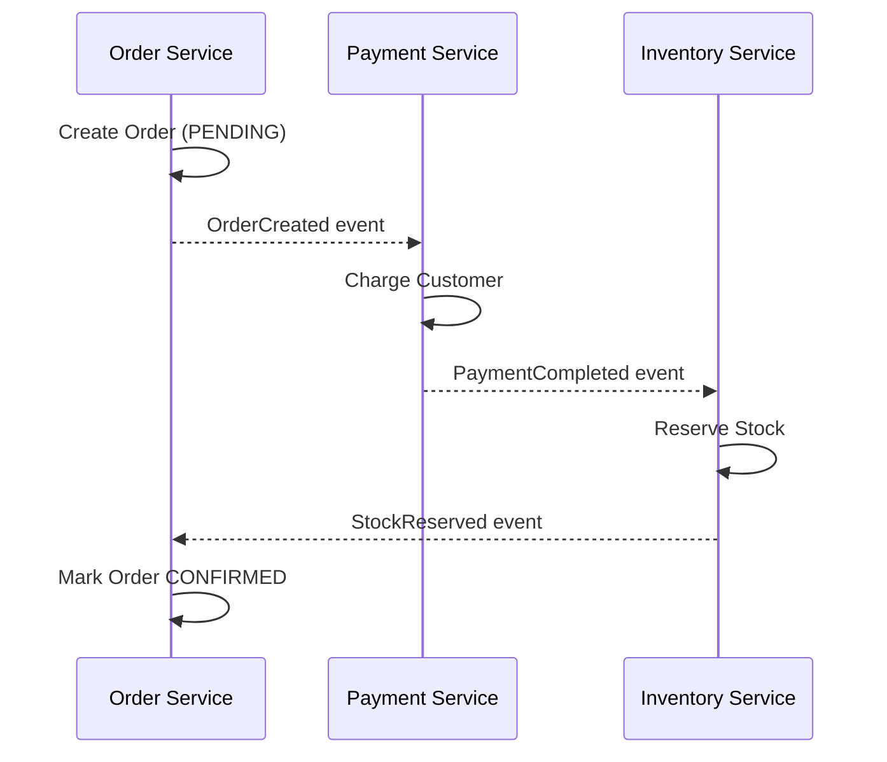
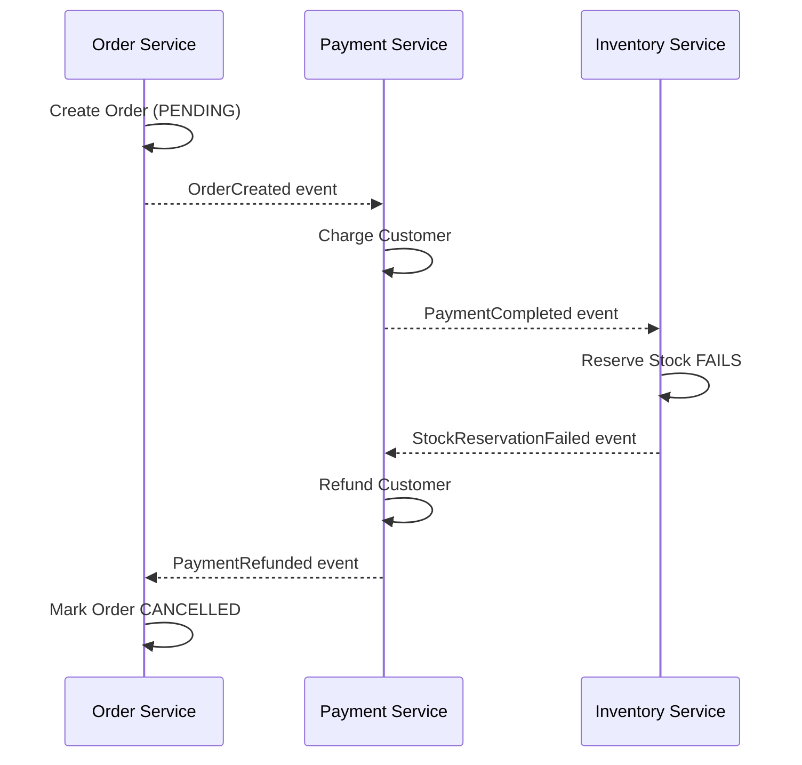
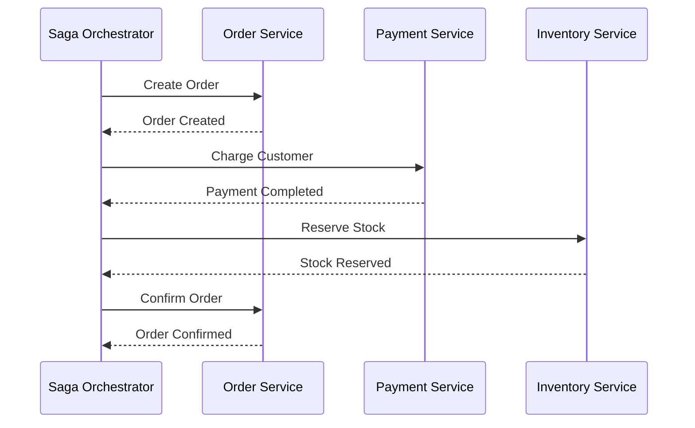
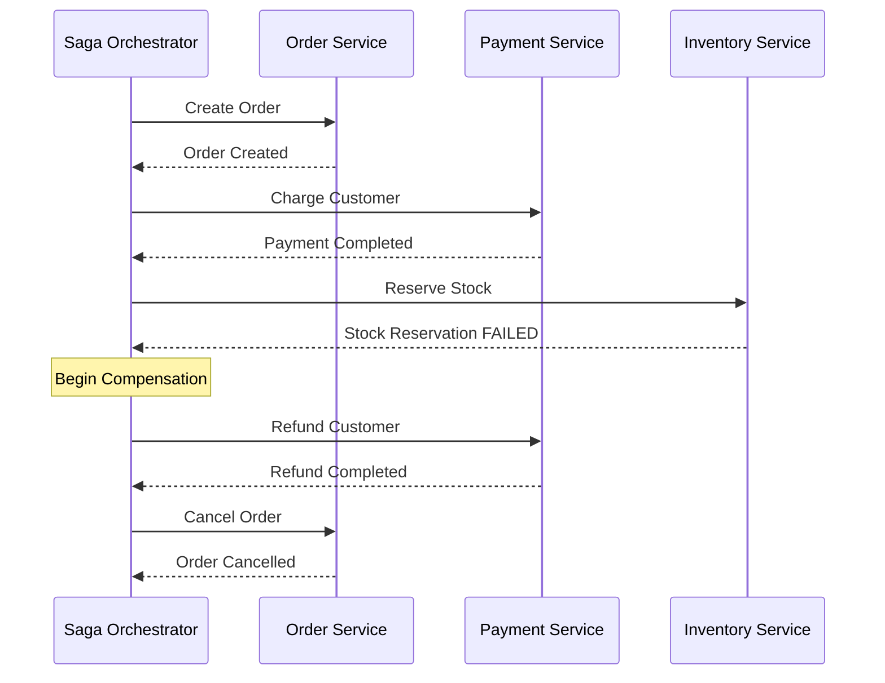
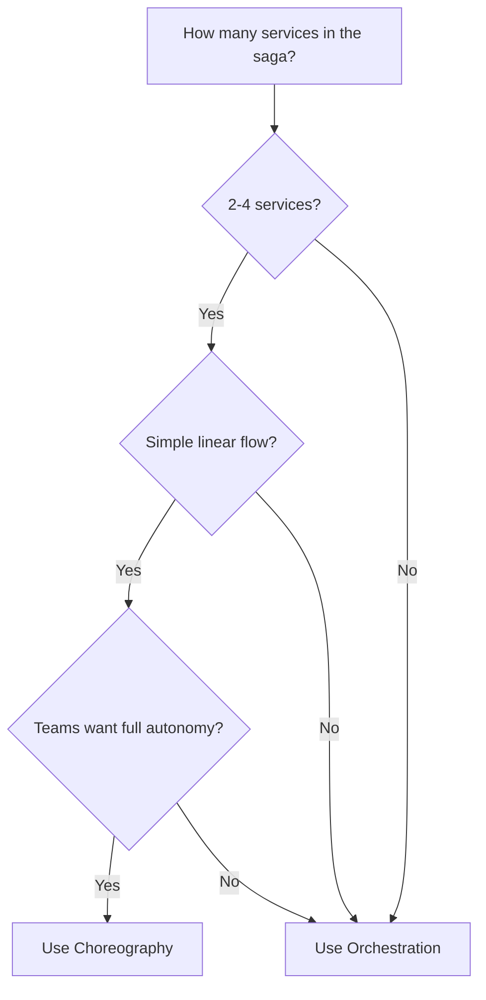
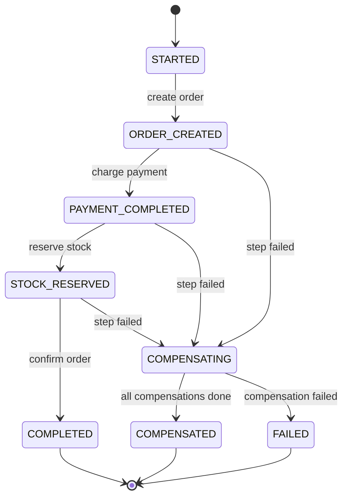
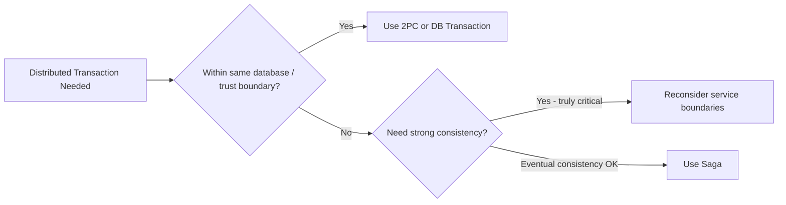
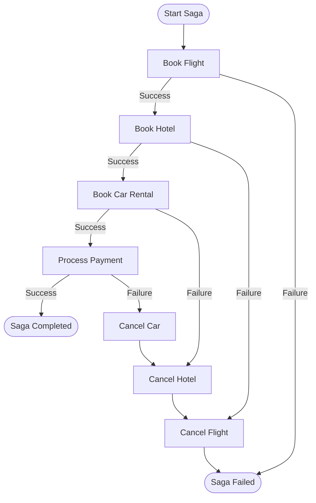

# Saga Pattern: Complete Guide

> A beginner-friendly guide to the Saga pattern for managing distributed transactions across microservices.

---

## Table of Contents

1. [Why Do We Need Sagas?](#1-why-do-we-need-sagas)
2. [What is the Saga Pattern?](#2-what-is-the-saga-pattern)
3. [Saga Execution Strategies](#3-saga-execution-strategies)
   - [Choreography](#31-choreography)
   - [Orchestration](#32-orchestration)
4. [Strategy Comparison](#4-strategy-comparison)
5. [Compensating Transactions](#5-compensating-transactions)
6. [Saga State Management](#6-saga-state-management)
7. [Failure Handling](#7-failure-handling)
8. [Saga vs Two-Phase Commit](#8-saga-vs-two-phase-commit)
9. [Saga in Practice](#9-saga-in-practice)
10. [Interview Discussion Points](#10-interview-discussion-points)

---

## 1. Why Do We Need Sagas?

In a monolith, a single database transaction can span multiple operations:

```
BEGIN TRANSACTION
  1. Deduct money from wallet
  2. Create order record
  3. Reserve inventory
COMMIT
```

If step 3 fails, the database rolls back everything. Simple.

**In microservices, each service owns its database.** There is no shared transaction boundary. You can't wrap a call to the Order Service, Payment Service, and Inventory Service in a single `BEGIN/COMMIT`.

### The Problem

Imagine an e-commerce checkout:

```
Order Service    -->  Payment Service    -->  Inventory Service
(create order)       (charge customer)       (reserve stock)
     DB1                  DB2                     DB3
```

What happens if Payment succeeds but Inventory fails? Without a coordination pattern, you end up with:
- An order that exists
- A customer who was charged
- No reserved stock

**The Saga pattern solves this by breaking a distributed transaction into a sequence of local transactions, each with a compensating action to undo its work if a later step fails.**

---

## 2. What is the Saga Pattern?

A **Saga** is a sequence of local transactions where:

1. Each step performs a local transaction and publishes an event or message
2. If a step fails, **compensating transactions** run in reverse order to undo previous steps
3. The system reaches **eventual consistency** rather than immediate consistency

### The Core Idea

Think of it like booking a vacation:

1. Book flight
2. Book hotel
3. Book rental car

If the rental car is unavailable, you don't just leave the flight and hotel booked (unless you want to). You **cancel the hotel**, then **cancel the flight** — unwinding in reverse order.

### Saga Guarantee

Sagas provide the **ACD** properties (no Isolation from ACID):

| Property | Provided? | Explanation |
|----------|-----------|-------------|
| **Atomicity** | Yes (logical) | All steps complete or all are compensated |
| **Consistency** | Yes (eventual) | System reaches a consistent state eventually |
| **Isolation** | No | Intermediate states are visible to other transactions |
| **Durability** | Yes | Each local transaction is durable once committed |

The lack of **Isolation** is the biggest challenge — we'll cover how to handle it.

---

## 3. Saga Execution Strategies

There are two fundamentally different ways to coordinate the steps in a saga.

### 3.1 Choreography

Each service listens for events and decides independently what to do next. There is **no central coordinator** — services react to events published by other services.



**Failure flow (Inventory fails):**



**How it works:**
- Services communicate through an event bus (Kafka, RabbitMQ, etc.)
- Each service knows which events to listen to and how to react
- Each service knows its own compensating action

**When to use:**
- Simple sagas with 2-4 steps
- Loosely coupled services that already publish domain events
- Teams that want full service autonomy

**Risks:**
- Hard to understand the full flow — logic is spread across services
- Cyclic dependencies can emerge between services
- Difficult to track "where is this saga right now?"

### 3.2 Orchestration

A **central orchestrator** (saga coordinator) tells each service what to do and when. It manages the sequence, handles failures, and triggers compensations.



**Failure flow (Inventory fails):**



**How it works:**
- The orchestrator holds the saga definition (steps + compensations)
- It persists saga state so it can recover from crashes
- Communication is typically command-based (request/reply)

**When to use:**
- Complex sagas with 5+ steps or branching logic
- When you need clear visibility into the saga's progress
- When business logic requires conditional steps

**Risks:**
- Orchestrator can become a single point of failure (mitigate with persistence + replayability)
- Risk of putting too much business logic in the orchestrator (keep it as a coordinator, not a god service)

---

## 4. Strategy Comparison

| Aspect | Choreography | Orchestration |
|--------|-------------|---------------|
| **Coordination** | Decentralized (events) | Centralized (orchestrator) |
| **Coupling** | Loose — services only know events | Medium — orchestrator knows all participants |
| **Complexity at scale** | Grows rapidly (spaghetti events) | Grows linearly (add steps to orchestrator) |
| **Visibility** | Hard to trace full saga flow | Easy — orchestrator tracks state |
| **Single point of failure** | No (distributed) | Yes (orchestrator, mitigated with persistence) |
| **Testing** | Harder (need full event flow) | Easier (test orchestrator logic) |
| **Best for** | Simple flows, 2-4 steps | Complex flows, 5+ steps, conditional logic |

### Decision Guide



---

## 5. Compensating Transactions

Compensating transactions are the **undo** operations for each saga step. They are **not** a rollback — they are a new transaction that semantically reverses the effect.

### Key Principles

**1. Compensations must be idempotent**

A compensation might be retried if it fails or if the system crashes mid-compensation. Running it twice must produce the same result.

```
// BAD: Not idempotent
wallet.balance += refundAmount

// GOOD: Idempotent — check before applying
if not exists(refund for this saga_id):
    wallet.balance += refundAmount
    record refund
```

**2. Compensations must be commutative with retries**

The system may retry the original action and the compensation concurrently. Design so the final state is correct regardless of order.

**3. Not all steps need compensation**

Some operations are inherently **retriable** (can be repeated safely) or **pivot transactions** (the point of no return after which only forward recovery makes sense).

### Step Types

| Type | Description | Example |
|------|-------------|---------|
| **Compensatable** | Can be undone | Create order -> Cancel order |
| **Pivot** | Point of no return, cannot be undone | Charge credit card (after this, go forward only) |
| **Retriable** | Guaranteed to eventually succeed | Send notification (retry until delivered) |

### Ordering Rule

A well-designed saga orders its steps as:

```
[Compensatable steps] -> [Pivot transaction] -> [Retriable steps]
```

This minimizes the chance of needing to undo irreversible actions.

**Example — E-commerce Order:**

```
1. Create Order (PENDING)      -- compensatable: cancel order
2. Reserve Inventory           -- compensatable: release inventory
3. Charge Payment              -- PIVOT: once charged, we commit to fulfilling
4. Confirm Order               -- retriable: will eventually succeed
5. Send Confirmation Email     -- retriable: will eventually succeed
```

---

## 6. Saga State Management

The orchestrator (or each participant in choreography) must track where the saga currently is.

### Saga State Machine



### Persistence

The saga state **must be persisted** (database, event log) so that:
- If the orchestrator crashes, it can resume from the last known state
- Failed sagas can be retried or manually resolved
- You have an audit trail of what happened

### Common Storage Approaches

| Approach | How it works | Trade-off |
|----------|-------------|-----------|
| **Saga table in DB** | Store saga_id, current_step, status, payload | Simple, requires polling or triggers |
| **Event sourcing** | Store each step as an event, rebuild state by replay | Full audit trail, more complex |
| **Workflow engine** | Use Temporal, Cadence, or Step Functions | Built-in retry, state, and visibility |

---

## 7. Failure Handling

### Types of Failures

**1. Participant failure (a step fails)**
- Trigger compensations for all completed steps in reverse order
- Log the failure for debugging

**2. Orchestrator failure (coordinator crashes)**
- On restart, read persisted saga state
- Resume from the last completed step
- This is why saga state persistence is critical

**3. Compensation failure (undo fails)**
- Retry the compensation (they must be idempotent)
- After max retries, flag the saga for **manual intervention**
- Alert operations team — this is a data inconsistency

**4. Network / timeout failures**
- Use timeouts for each step with sensible defaults
- On timeout, check if the step actually completed (query the participant)
- Never assume timeout = failure — the step may have succeeded

### The Isolation Problem

Since sagas don't provide isolation, concurrent operations can see intermediate states. Strategies to handle this:

| Strategy | How it works | Example |
|----------|-------------|---------|
| **Semantic locks** | Mark records as "in-progress" during saga | Order status = PENDING (not yet CONFIRMED) |
| **Commutative updates** | Design operations so order doesn't matter | Increment/decrement counters instead of set |
| **Pessimistic view** | Reorder saga steps to reduce anomaly window | Do the risky step first |
| **Reread value** | Re-check data before committing a step | Verify inventory count before reserving |
| **Version file** | Use optimistic concurrency (versioned records) | Update only if version matches |

---

## 8. Saga vs Two-Phase Commit

| Aspect | Saga | Two-Phase Commit (2PC) |
|--------|------|----------------------|
| **Consistency** | Eventual | Strong (immediate) |
| **Isolation** | No — intermediate states visible | Yes — locks held until commit |
| **Availability** | High — no global locks | Lower — blocked if coordinator fails |
| **Latency** | Lower per step | Higher — waits for all participants |
| **Scalability** | High — no distributed locks | Low — lock contention across services |
| **Complexity** | Business logic for compensations | Infrastructure complexity (XA protocol) |
| **Recovery** | Compensating transactions | Participant must hold locks until resolved |
| **Best for** | Microservices, long-lived transactions | Short transactions within same trust boundary |

### Why Microservices Use Sagas Over 2PC



2PC requires all participants to support the XA protocol, hold locks during the prepare phase, and can block indefinitely if the coordinator fails. In microservices where services are independently deployed and scaled, this is impractical. Sagas trade isolation for availability and scalability.

---

## 9. Saga in Practice

### Example: Travel Booking Saga (Orchestration)



**Saga definition:**

| Step | Action | Compensation |
|------|--------|-------------|
| 1 | Book flight | Cancel flight booking |
| 2 | Book hotel | Cancel hotel reservation |
| 3 | Book rental car | Cancel car reservation |
| 4 | Process payment (PIVOT) | — |
| 5 | Send confirmation email (retriable) | — |

### Real-World Implementations

| Tool / Framework | Type | Notes |
|-----------------|------|-------|
| **Temporal** | Orchestration | Workflow engine with built-in retry, state, and visibility. Workflows are code. |
| **AWS Step Functions** | Orchestration | Serverless state machines with built-in error handling |
| **Cadence** | Orchestration | Predecessor to Temporal, similar model |
| **Eventuate Tram** | Both | Java framework for choreography and orchestration sagas |
| **MassTransit** | Both | .NET library with built-in saga state machines |
| **Axon Framework** | Both | Java/Kotlin framework with saga support and event sourcing |
| **Kafka + custom logic** | Choreography | Roll your own with event-driven communication |

### Implementation Tips

1. **Start with orchestration** unless you have a strong reason for choreography — it's easier to debug and maintain
2. **Use a workflow engine** (Temporal, Step Functions) rather than building saga infrastructure from scratch
3. **Log everything** — saga ID, step, status, timestamps, payloads. You will need this for debugging
4. **Design compensations from day one** — don't bolt them on later
5. **Test failure scenarios explicitly** — kill services mid-saga, simulate timeouts, test double-deliveries
6. **Use correlation IDs** — a unique saga ID that flows through every service for tracing
7. **Set up dead letter queues** — for messages that repeatedly fail processing
8. **Monitor saga durations** — a saga taking too long likely has a stuck step

---

## 10. Interview Discussion Points

### Beginner Questions

**Q: What problem does the Saga pattern solve?**
> It manages distributed transactions across multiple microservices where a traditional ACID transaction isn't possible because each service has its own database.

**Q: What are the two types of saga coordination?**
> Choreography (event-driven, decentralized) and Orchestration (central coordinator). Choreography is simpler for small flows; orchestration is better for complex flows with many steps.

**Q: What is a compensating transaction?**
> A new transaction that semantically undoes the effect of a previous transaction. It's not a rollback — it's a forward action that reverses the business effect. For example, a refund compensates a payment.

### Intermediate Questions

**Q: Why don't sagas provide isolation?**
> Each step commits immediately to its local database. Between steps, other transactions can read the intermediate state. For example, another service might see an order as PENDING with payment completed but stock not yet reserved.

**Q: How do you handle a compensation that fails?**
> Compensations must be idempotent so they can be safely retried. After a maximum number of retries, flag the saga for manual intervention and alert the operations team. This is a rare but critical scenario.

**Q: When would you choose choreography over orchestration?**
> When the saga is simple (2-4 steps), the flow is linear, teams want full autonomy, and the services already publish domain events. Choreography avoids a central coordinator but gets hard to reason about as complexity grows.

### Advanced Questions

**Q: How do you handle the lack of isolation in sagas?**
> Use semantic locks (mark records as in-progress), commutative updates (operations that work regardless of order), optimistic concurrency (version checks), and reread values before committing steps. Design the step ordering to minimize the anomaly window.

**Q: What is the difference between a pivot transaction and a compensatable transaction?**
> A compensatable transaction can be undone (e.g., cancel a reservation). A pivot transaction is the point of no return — once it succeeds, the saga must go forward. Steps after the pivot should be retriable (guaranteed to eventually succeed). The ideal order is: compensatable -> pivot -> retriable.

**Q: How would you design a saga for a payment + fulfillment flow where the payment provider has no refund API?**
> If refunds aren't possible, the payment step becomes the pivot transaction. Move it as late as possible — first reserve inventory, validate addresses, check fraud, etc. Only charge after all validatable steps succeed. If something fails after payment, use credit/voucher as a business-level compensation instead of a technical refund.

**Q: How do sagas interact with event sourcing?**
> Event sourcing is a natural fit — each saga step produces events, and the saga state can be rebuilt by replaying them. This gives a full audit trail and enables temporal queries ("what was the saga state at time T?"). The event store becomes the saga log.

**Q: How would you handle a saga that spans 15+ services?**
> Break it into sub-sagas. A parent orchestrator delegates to child orchestrators, each managing a logical group of steps (e.g., "payment sub-saga", "fulfillment sub-saga"). This keeps each saga manageable and allows teams to own their sub-saga independently. Also consider if the service boundaries are correct — 15 services in one transaction may indicate a design problem.