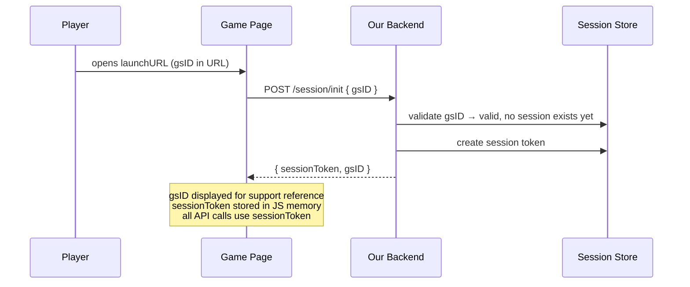
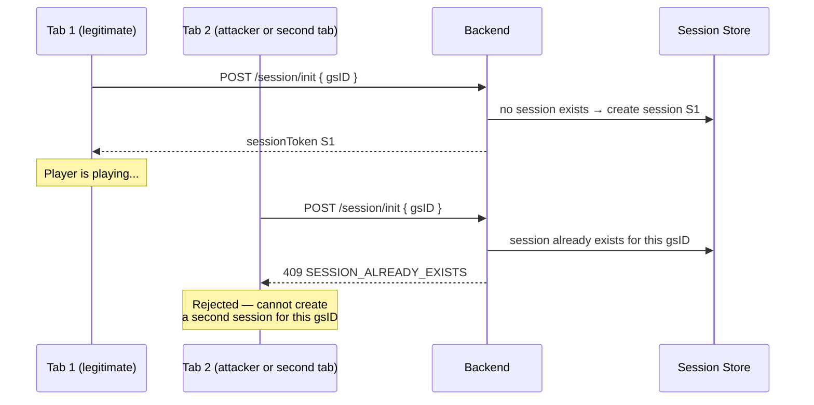
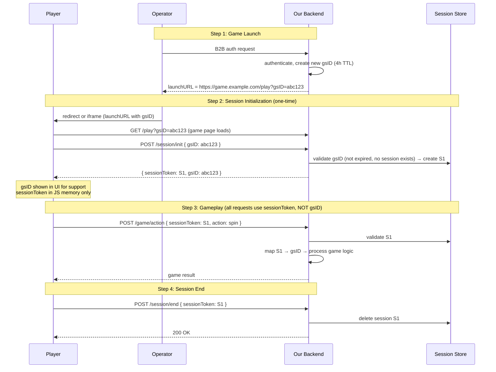
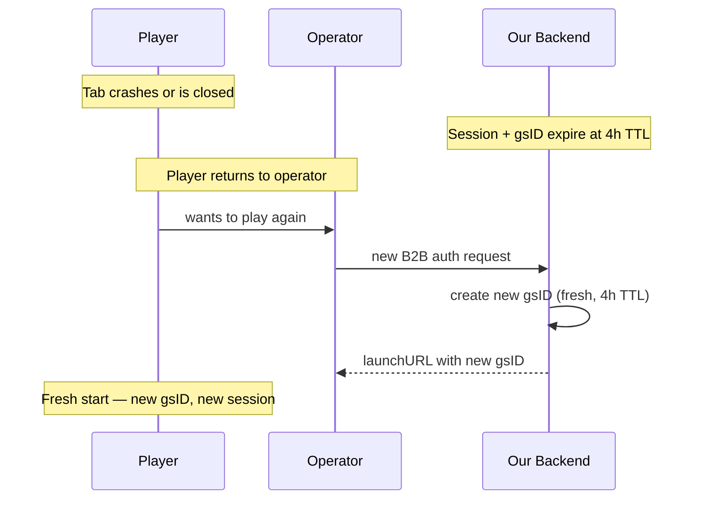

# Securing LaunchURL and gsID

## Context

Our backend authenticates players via a B2B call and returns a **launchURL** containing a **gsID** (game session ID) to the aggregator. The game opens via **redirect** (full page) or **iframe**. Communication is **HTTP only**.

### Constraints

- **gsID must be in the launchURL** — required part of the URL
- **gsID must be visible to the player** — serves as a support ticket reference
- **Every B2B call generates a new gsID** — operator requests a game → backend creates a fresh gsID every time. There is no gsID reuse.
- **gsID has a 4-hour TTL** — after that, the game session is over
- **HTTP only** — no WebSocket available

### Requirements

1. **gsID alone must not grant access** — possessing the gsID must not allow anyone to play or make API calls as the user
2. **Single session only** — a user can play on exactly one device/tab at a time, no parallel sessions
3. **One session per gsID, ever** — once a session is created for a gsID, no second session can be created for the same gsID. If the tab crashes, the player returns to the operator and gets a new gsID.

---

## Core Principle

**gsID is a public identifier, not a credential.** It is visible in the URL bar, referenced in support tickets, and known to the aggregator. Security does not depend on gsID being secret.

```
gsID = public identifier (like a username)
session token = credential (like a password)
```

All API calls require a **session token** — gsID alone is never sufficient.

---

## Solution

### Session Token

When the game page loads, the frontend calls `/session/init` with the gsID. The backend validates the gsID and issues a **session token** — the secret credential for all subsequent API calls.



| Property | gsID | Session Token |
|----------|------|---------------|
| **Purpose** | Public identifier, support reference | Authentication credential |
| **Visibility** | In URL bar, visible to player | Never in URL, JS memory only |
| **Usable alone** | No — cannot make API calls | Yes — required for all API calls |
| **Lifetime** | 4 hours | Same as gsID (bounded by gsID expiry) |

**Why JS memory (not cookies/localStorage):**

- Cleared when tab closes — natural session cleanup
- Not sent automatically in requests — prevents CSRF
- Not accessible to other tabs — limits XSS blast radius

### One Session Per gsID — No Re-Init

Once a session is created for a gsID, that gsID is **locked**. Any subsequent `/session/init` with the same gsID is rejected.



**Rules:**

- First `/session/init` succeeds — session created, gsID locked
- Any subsequent `/session/init` with the same gsID — **rejected** (409)
- No replacement, no kick-wars, no race conditions
- gsID + session expire together after 4 hours

---

## Full Flow



### Tab Crash / Close Recovery



---

## Attack Vectors

### 1. gsID Theft — URL Sharing / Shoulder Surfing 🟢

gsID is public by design (in the URL bar, visible to the player). An attacker who obtains it:

| Attack | Result | Why |
|--------|--------|-----|
| Call API with gsID only | **Blocked** | API requires session token, not gsID |
| `/session/init` after player already opened | **Blocked** | 409 — session already exists for this gsID |
| `/session/init` before player opens | **Succeeds** | Attacker gets the session. Player returns to operator → gets new gsID |

> **Safe.** gsID alone is useless for API calls. The only window for abuse (before the player opens the game) is typically seconds. High-entropy gsID format prevents guessing. Rate-limiting `/session/init` per gsID narrows the window further.

### 2. [XSS](#xss-cross-site-scripting) — Session Token Theft 🔴

If an attacker injects malicious JavaScript into the game page, they can read the session token from JS memory and exfiltrate it.

| Attack | Result | Why |
|--------|--------|-----|
| Read session token from JS memory | **Possible** | XSS code runs in the same page context |
| Use stolen token from another device | **Possible** | Token is not bound to IP/UA in this design |

> **Not safe.** XSS is the most dangerous vector. If an attacker achieves XSS, they have full access to the session. This is true of virtually all web applications — our design does not make it worse, but cannot fully prevent it at the architecture level.

**Possible solutions:**
- Strict [CSP](#csp-content-security-policy) policy to prevent unauthorized script execution
- Input sanitization — never render untrusted data as HTML
- Code review and security audits focused on XSS prevention
- Consider adding IP/UA binding to session tokens as an extra layer (limits stolen token usability from other devices)

### 3. [CSRF](#csrf-cross-site-request-forgery) — Forged Requests from Another Site 🟢

An attacker hosts a malicious page that tricks the player's browser into making requests to our backend.

| Attack | Result | Why |
|--------|--------|-----|
| Trick browser into calling `/game/action` | **Blocked** | Session token is in JS memory, not in cookies. The malicious page cannot access it. Browser does not attach it automatically. |
| Trick browser into calling `/session/init` | **Blocked** | Even if the request fires, it either gets 409 (session exists) or creates a session the attacker can't use (they don't receive the response due to [CORS](#cors-cross-origin-resource-sharing)). |

> **Safe.** Session token is stored in JS memory and sent explicitly in request headers/body. Cookies are not used, so the browser never auto-attaches credentials to cross-origin requests.

### 4. [MITM](#mitm-man-in-the-middle) — Network Interception 🔴

An attacker on the same network intercepts traffic between the player and our backend.

| Attack | Result | Why |
|--------|--------|-----|
| Intercept session token in transit | **Blocked if HTTPS** | TLS encrypts all traffic |
| Intercept session token in transit | **Possible if HTTP** | Token visible in plaintext |
| Intercept gsID in transit | **Not useful** | gsID alone cannot make API calls |

> **Not safe by default.** Depends entirely on whether HTTPS is enforced. Without it, session tokens are visible in plaintext.

**Possible solutions:**
- Enforce HTTPS on all endpoints, redirect HTTP → HTTPS
- Use [HSTS](#hsts-http-strict-transport-security) headers to prevent protocol downgrade

### 5. [Replay Attack](#replay-attack) — Re-sending Captured Requests 🔴

An attacker captures a valid request (with session token) and re-sends it later.

| Attack | Result | Why |
|--------|--------|-----|
| Replay a game action request | **Possible** | If the same request is valid twice, replay works |

> **Not safe.** Our design does not include replay protection at the architecture level. A captured request can be re-sent successfully.

**Possible solutions:**
- Idempotency keys — each game action includes a unique request ID; backend rejects duplicates
- Sequence numbers — backend tracks action order per session, rejects out-of-sequence requests
- HTTPS prevents network-level capture in the first place (reduces the chance of capture)

### 6. [Clickjacking](#clickjacking) — Embedding Game in a Malicious Page 🔴

An attacker embeds our game page in an invisible iframe on their site, tricking the player into clicking on game actions they don't intend.

| Attack | Result | Why |
|--------|--------|-----|
| Embed game in hidden iframe | **Possible** | Browser allows iframe embedding by default |

> **Not safe by default.** Without explicit frame protection headers, any site can embed the game page.

**Possible solutions:**
- `X-Frame-Options` header to restrict or deny iframe embedding
- [CSP](#csp-content-security-policy) `frame-ancestors` directive to allowlist specific operator domains
- If the game must run in an iframe on the operator's domain, allowlist only that domain

### 7. Referer Leakage — gsID Exposed via HTTP Headers 🟢

When the game page makes requests to third-party resources (analytics, CDNs, external scripts), the browser may send the full URL (including gsID) in the `Referer` header.

| Attack | Result | Why |
|--------|--------|-----|
| Third-party reads gsID from Referer | **Not useful** | gsID alone cannot make API calls |

> **Safe.** gsID is a public identifier — leaking it via Referer has no security impact. `Referrer-Policy: origin` can be added as defense in depth.

### 8. [Brute-Force](#brute-force) — Guessing gsIDs 🟢

An attacker tries random gsIDs against `/session/init` hoping to find one that hasn't been claimed yet.

| Attack | Result | Why |
|--------|--------|-----|
| Guess valid gsID and call `/session/init` | **Impractical** | If gsID has sufficient entropy (e.g., 128-bit UUID), guessing is computationally infeasible |

> **Safe.** High-entropy gsID (UUIDv4 or similar) makes guessing infeasible. Rate-limiting `/session/init` by IP and returning identical errors for "not found" vs "already exists" prevents enumeration.

### 9. Race Condition on `/session/init` 🔴

Two requests with the same gsID arrive at `/session/init` at the exact same time.

| Attack | Result | Why |
|--------|--------|-----|
| Two simultaneous `/session/init` calls | **Both could succeed** | Without atomicity, two sessions may be created |

> **Not safe by default.** Must be explicitly handled at the implementation level.

**Possible solutions:**
- Atomic session creation (database-level uniqueness constraint or distributed lock)
- Only the first write succeeds; the second gets 409

### Attack Vector Summary

| # | Vector | Status | Solution needed |
|---|--------|--------|-----------------|
| 1 | [gsID theft](#1-gsid-theft--url-sharing--shoulder-surfing) | 🟢 Safe | — |
| 2 | [XSS](#2-xss--session-token-theft) | 🔴 Vulnerable | CSP, input sanitization, security audits |
| 3 | [CSRF](#3-csrf--forged-requests-from-another-site) | 🟢 Safe | — |
| 4 | [MITM](#4-mitm--network-interception) | 🔴 Vulnerable | Enforce HTTPS, HSTS |
| 5 | [Replay](#5-replay-attack--re-sending-captured-requests) | 🔴 Vulnerable | Idempotency keys, sequence numbers |
| 6 | [Clickjacking](#6-clickjacking--embedding-game-in-a-malicious-page) | 🔴 Vulnerable | X-Frame-Options, CSP frame-ancestors |
| 7 | [Referer leakage](#7-referer-leakage--gsid-exposed-via-http-headers) | 🟢 Safe | — |
| 8 | [Brute-force](#8-brute-force--guessing-gsids) | 🟢 Safe | — |
| 9 | [Race condition](#9-race-condition-on-sessioninit) | 🔴 Vulnerable | Atomic session creation |

---

## How Each Requirement Is Met

| Requirement | Solution |
|-------------|----------|
| **gsID alone must not grant access** | All API calls require a session token. gsID is a public identifier only. |
| **gsID stays in the URL** | Yes — launchURL contains gsID. Player sees it and references it in support tickets. |
| **Single session only** | One session per gsID, ever. Second `/session/init` is rejected (409). No parallel sessions possible. |
| **Tab crash recovery** | Player returns to operator → new B2B call → new gsID → fresh session. Old gsID+session expire at 4h TTL. |

## Open Decisions

- **Session token rotation** — optionally rotate the token periodically to shrink the hijack window if a token is somehow leaked
- **`/session/init` rate limiting** — prevent brute-force attempts during the narrow window between B2B call and player opening the game

---

## Glossary

### XSS (Cross-Site Scripting)

An attack where malicious JavaScript is injected into a web page. When other users visit the page, the injected script runs in their browser with full access to the page's data (cookies, JS variables, DOM). There are three types:
- **Stored XSS** — malicious script is saved on the server (e.g., in a database) and served to users
- **Reflected XSS** — malicious script is embedded in a URL and reflected back by the server
- **DOM-based XSS** — malicious script manipulates the page's DOM directly via client-side JavaScript

In our context: XSS could allow an attacker to read the session token from JS memory.

### CSRF (Cross-Site Request Forgery)

An attack where a malicious website tricks the user's browser into making requests to another site where the user is authenticated. It exploits the browser's automatic attachment of cookies to requests. For example, a hidden form on `evil.com` could submit a POST to `game.example.com/game/action` — if auth is cookie-based, the browser sends the cookie automatically and the request succeeds.

In our context: CSRF is not a threat because we use JS memory for the session token (not cookies), so the browser never auto-attaches credentials.

### CSP (Content Security Policy)

An HTTP response header that tells the browser which sources of content (scripts, styles, images, etc.) are allowed on a page. Example: `Content-Security-Policy: script-src 'self'` means only scripts from the same origin can execute — inline scripts and scripts from other domains are blocked. This is the primary defense against XSS.

### CORS (Cross-Origin Resource Sharing)

A browser mechanism that controls which domains can make requests to your API. By default, browsers block JavaScript from reading responses of cross-origin requests. The server uses `Access-Control-Allow-Origin` headers to explicitly permit specific origins. This prevents a malicious site from reading API responses, even if it can trigger the request.

### MITM (Man-in-the-Middle)

An attack where someone intercepts communication between two parties (e.g., player and backend). On an unencrypted connection (HTTP), the attacker can read and modify all traffic. HTTPS (TLS) prevents this by encrypting the connection — the attacker sees only encrypted data.

### HSTS (HTTP Strict Transport Security)

An HTTP response header (`Strict-Transport-Security`) that tells the browser to **always** use HTTPS for this domain, even if the user types `http://`. This prevents downgrade attacks where an attacker forces a switch from HTTPS to HTTP to intercept traffic.

### Replay Attack

An attack where a valid request is captured and re-sent later. For example, if an attacker captures a "place bet" request, they could re-send it to place the same bet again. Defended against with idempotency keys (unique per-request IDs the server tracks) or sequence numbers.

### Clickjacking

An attack where a malicious site embeds your page in a transparent iframe and overlays it with deceptive UI. The user thinks they're clicking on the malicious site's buttons, but they're actually clicking on your hidden page. Defended with `X-Frame-Options` header or CSP `frame-ancestors` directive.

### Brute-Force

An attack that tries many possible values (e.g., random gsIDs) hoping to find a valid one. Defended with high-entropy identifiers (making the keyspace too large to search) and rate limiting (slowing down attempts).
