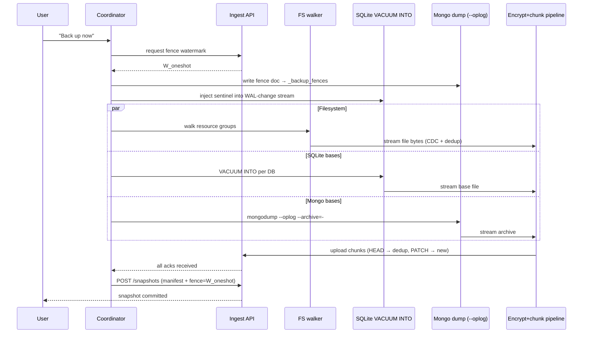

# One-Shot Backup & Restore

> Referenced from [`plans/2026-04-23.md`](plans/2026-04-23.md) D-1 / D-6 / D-10.

Two inverse operations live together in this doc because they share a
coordinator pattern, fence mechanism, and resumability model:

- **One-shot backup** — user clicks "Back up now"; coordinator fans out
  a capture of filesystem + MongoDB + SQLite, fences, commits one
  snapshot. [Jump to section](#one-shot-backup-back-up-everything-now).
- **One-shot restore** — fresh / wiped device brought back to a prior
  snapshot; coordinator fans out DB + file restores per resource
  group, structure-first, blobs lazily. [Jump to section](#one-shot-restore-bring-everything-back).

---

# One-shot backup ("Back up everything now")

## Scope

The path that runs when the continuous change watcher is **not** the
source of truth for the next snapshot. Concretely:

- User clicks **"Back up now"** and wants a coherent snapshot of
  everything at this instant.
- **First-ever backup** on a fresh device (no prior watcher state, no
  prior snapshots).
- Device has been **offline for a long time** and the user wants an
  explicit catch-up rather than waiting for the continuous watcher to
  drain.
- **Pre-risk checkpoint** — before an OS upgrade, disk replacement,
  moving apartments, etc.

The **continuous** path (inotify + tailers + cursors) is covered in
[`pipeline-01-detection.md`](pipeline-01-detection.md). This doc is about the
coordinated one-shot capture that does **not** assume the watcher has
been running.

## Invariants we must preserve

Same as the continuous path — we can't relax any of these just because
the user is in a hurry:

1. **Cross-system consistency.** On restore, DB rows must not reference
   blobs that weren't captured, and captured blobs must not reference
   DB rows that weren't captured.
2. **Liveness.** We can't stop the apps. Umbrel is always-on by
   design; a backup path that forces downtime is unusable.
3. **Zero-knowledge.** Server sees ciphertext only; nothing in the
   one-shot path leaks plaintext or schema.
4. **Resumability.** User may kill the app, reboot, lose network — the
   next run continues, not restarts.
5. **Dedup still applies.** CDC + content addressing means only new
   chunks upload. A repeated one-shot on an incrementally-changed
   device is cheap, not a full re-upload.

## Approach: capture → fence → commit

The one-shot is the **same chunk-and-upload pipeline** as the
continuous path, driven by a **coordinator** that fans out three
captures in parallel and commits a single snapshot when all three
finish.



Two things to notice:

- The coordinator doesn't run its own chunker or uploader — it reuses
  the shared pipeline (see
  [`pipeline-05-transport.md`](pipeline-05-transport.md) and
  [`pipeline-01-detection.md`](pipeline-01-detection.md)). This is what makes repeat
  one-shots dedup-friendly.
- The fence is written **once, at the start**, not periodically.
  Everything after the fence write is "as of W_oneshot" from the
  restore side's point of view.

## Filesystem capture

The coordinator invokes the **filesystem walker** per resource group
in parallel. The walker handles live writes (stable-read + torn-file
flagging), include/exclude rules (including skipping DB files owned
by the shippers), tree enumeration, and state-DB updates. Full
details in [`pipeline-02-file-capture.md`](pipeline-02-file-capture.md).

One-shot-specific coordination on top of the walker:

- **FS snapshot preference.** When the mount is `btrfs` / `zfs` /
  `APFS`, the coordinator takes an FS snapshot first and points the
  walker at the snapshot root instead of the live root — atomic by
  construction, no torn reads possible. Detected at runtime; not
  assumed. On ext4 (UmbrelOS default) this isn't available and the
  walker's stable-read protocol carries the weight.
- **Per-group parallelism.** Each resource group walks independently;
  they share the downstream encrypt-and-upload pipeline under
  back-pressure.

## SQLite capture

For every discovered SQLite DB in every resource group:

- Run `VACUUM INTO '/tmp/<app>.db.oneshot'`. Online, consistent, fully
  checkpointed. Writers block only briefly at the commit boundary.
- Stream the resulting file through the shared chunker/encryptor.
- Delete the temp file once the chunk containing its last byte is
  acked.

Disk precheck: `VACUUM INTO` needs roughly the full DB size in free
space on the temp volume. The coordinator refuses to start if free
space is below (sum of DB sizes × 1.2). Surface the error to the UI
before any capture begins — partial-failure mid-run is worse UX than
a clean "free up 2 GB first."

Why not just copy `app.db` + `app.db-wal`? Races with checkpoints,
produces files SQLite will refuse to open. The base-snapshot section
in [`databases.md`](databases.md#why-not-the-alternatives)
enumerates the alternatives and why they lose.

## MongoDB capture

Per Mongo instance:

- Use a `mongodump`-equivalent with `--oplog --archive=-`. Streams
  directly to stdout, which the coordinator pipes into the chunker.
  `--oplog` is the critical flag: it captures oplog entries covering
  the dump duration, giving a consistent point-in-time restore via
  `mongorestore --oplogReplay`.
- The fence doc (written into `_backup_fences` *before* the dump
  starts) ends up inside the dumped oplog — the restore side uses it
  the same way it uses continuously-shipped fences.
- No intermediate on-disk archive; one-shot dumps for a 5 GB database
  should stream at encrypt-and-upload speed, bounded by back-pressure
  (see [`pipeline-05-transport.md` §Back-pressure](pipeline-05-transport.md#back-pressure)).

Practical: build the dump logic into the agent rather than shelling
out, so the streaming is process-internal and errors surface cleanly.
Shelling out to `mongodump` works but complicates back-pressure and
error propagation.

## Cross-system fence (same mechanism as continuous)

The fence mechanism is identical to
[`databases.md` §Cross-system point-in-time consistency](databases.md#cross-system-point-in-time-consistency-shared-fence).
The only difference is cadence: continuous writes fences periodically;
the one-shot writes exactly one fence, at the start.

Explicit sequence the coordinator follows:

1. **Reserve** watermark `W_oneshot` from the ingest API.
2. **Fence Mongo** — insert fence doc into `_backup_fences` in every
   instance. This write lands in the oplog and therefore in any dump
   or continuous tail that runs after it.
3. **Fence SQLite** — append a sentinel record into every
   SQLite-WAL-change stream. (Only matters if the continuous watcher
   is running; the `VACUUM INTO` base is already past-the-fence by
   construction.)
4. **Start captures** (FS walk + SQLite bases + Mongo bases in
   parallel).
5. **Collect acks** for every chunk produced by any capture.
6. **Commit** `POST /snapshots` with `fence = W_oneshot` and the
   encrypted manifests.

If step 2 or 3 fails, abort before starting captures. A partial fence
is worse than no fence — it guarantees the restore cap rule can't
align the three sources.

## Coordination with the continuous watcher

**Watcher is already running.** Don't stop it. The coordinator:

- Requests `W_oneshot` and writes the fence — this fence flows
  through the watcher's pipeline too, so both paths agree on the
  restore cap.
- Forces the periodic base jobs to run now (via the single-flight
  guard in
  [`pipeline-01-detection.md` §Periodic jobs & overlap prevention](pipeline-01-detection.md#periodic-jobs--overlap-prevention)).
  If a base is already running, the coordinator waits for it instead
  of launching a duplicate — exactly the overlap case the single-
  flight guard is for.
- Commits the snapshot once all chunks (continuous + one-shot) are
  acked.

**Watcher is not running** (fresh install, first backup). The
coordinator does everything itself: FS walk + DB dumps + fence +
commit. After the first commit, the watcher can be started for
ongoing protection — it'll pick up where the one-shot left off via
cursors derived from the snapshot manifest.

## Speed and UX

**First-time backup is not fast.** "Everything now" for a fresh
device can be tens of GB (photo library). CDC dedup doesn't help on
the first run because no chunks exist on the server yet. The UI must:

- Show two progress indicators: **captured locally** (I/O + chunking
  progress) vs **uploaded** (bytes acked by server). These diverge a
  lot — fast local NVMe + slow residential uplink is the common case.
- Allow cancel-and-resume, not cancel-and-abort.
- Give a realistic ETA based on measured upload bandwidth and
  remaining bytes, updated continuously.

**Subsequent one-shots are fast.** If the continuous watcher has been
running, most chunks already exist server-side. Upload-path work
collapses into `HEAD /chunks/{ct-hash}` calls that return 200 without
bytes. Even a large photo library can one-shot in minutes rather than
hours.

## Resumability

The coordinator persists its own progress in the agent-state DB:

```sql
CREATE TABLE oneshot_jobs (
  job_id          TEXT PRIMARY KEY,
  fence           BLOB NOT NULL,      -- W_oneshot
  phase           TEXT NOT NULL,      -- 'fencing' | 'capturing' | 'committing' | 'done' | 'failed'
  fs_cursor       TEXT,               -- last path enumerated
  sqlite_cursor   TEXT,               -- JSON: per-DB progress
  mongo_cursor    TEXT,               -- JSON: per-instance progress
  started_at      INTEGER NOT NULL,
  finished_at     INTEGER
);
```

On restart the coordinator reads the latest non-done job, checks its
phase, and resumes:

- `fencing` → retry fence writes (idempotent; fence doc has a unique ID).
- `capturing` → per-capture cursor resumption. The FS walker picks up
  from `fs_cursor`; mongodump restarts (it's cheaper to restart than to
  plumb sub-dump resume); SQLite `VACUUM INTO` restarts per DB if its
  temp file is gone.
- `committing` → retry `POST /snapshots` — it's idempotent on
  snapshot root hash.
- `done` or `failed` → no-op; user must start a new job.

One-shot jobs don't have a server-side expiry. A job started and
paused at 60% can finish a week later; the fence the coordinator
holds is still valid, and the restore cap rule still applies.

## Problems and how they're handled

| Problem | Impact | Handling |
|---|---|---|
| File modified mid-read (torn) | Chunk inconsistent with live content | Stable-read retry; mark torn in manifest if persistent; next sync corrects |
| File unreadable (permissions / I/O error) | Single file missing | Log, mark skipped in manifest, continue — never abort the whole backup |
| `VACUUM INTO` fails (disk full) | DB not captured | Precheck before starting; if precheck missed it, fail fast with an actionable error |
| `mongodump` fails mid-stream | DB not captured | Retry once; if still failing, mark that resource group failed and commit the rest |
| Fence write to Mongo fails | Cross-system alignment broken | **Abort before captures.** Partial fence is worse than no fence |
| Network drops mid-upload | Chunk in flight | Uploader state machine handles retry/resume; coordinator unchanged |
| User kills the app | Job paused | Coordinator resumes from `oneshot_jobs` on next start |
| Device reboots | Same as kill | Durable agent-state DB + durable upload queue cover it |
| Continuous watcher running and busy | Risk of double-fence | Coordinator uses the shared single-flight guard and pipeline; one fence, one snapshot |
| User clicks "Back up now" twice quickly | Two overlapping jobs | Second click returns the existing job ID; only one coordinator runs at a time |
| Capture takes hours; new writes happen | Captured content lags real time | That's fine — the snapshot represents state as of `W_oneshot`; post-fence writes land in the next continuous chunks or the next one-shot |
| Resource group partially fails | Other groups should still succeed | Per-group failure isolation: commit succeeds for groups that completed; failed groups retry on next tick |

## Why not the alternatives

| Approach | Problem |
|---|---|
| **Stop every app, copy files, restart** | Breaks the always-on expectation of Umbrel; many apps don't recover cleanly from forced stops; user-visible downtime; forbidden by FR-22 (live writer) |
| **Require a snapshotting filesystem everywhere** | UmbrelOS default is ext4; Btrfs/ZFS are opt-in; building around them excludes most users |
| **Plain `cp` for SQLite** | Races with WAL checkpoints, produces files SQLite refuses to open |
| **Run `mongodump` without `--oplog`** | Dump isn't point-in-time consistent; restore can dangle against the fence |
| **Forget fencing; trust everything is "close enough"** | Restored DB references blobs that don't exist; silent data loss; identical failure mode to "no coordination" baseline enumerated in [`databases.md`](databases.md#industry-variants-considered) |
| **Take a brand-new snapshot each time (no dedup)** | Tens of GB re-uploaded per click on a mature library; unusable |

## Summary

- One-shot is the same chunk-encrypt-upload pipeline as continuous,
  driven by a **coordinator** that fences once, fans out three
  captures in parallel, and commits one snapshot.
- **Live writes** handled per-source: FS snapshot or stable-read for
  files; `VACUUM INTO` for SQLite; `mongodump --oplog` for Mongo.
- **Cross-system consistency** is the same fence mechanism as the
  continuous path; the cap rule on restore does the rest.
- **Dedup** means incremental one-shots are cheap; only the first one
  is large.
- **Resumable** via coordinator phase + per-capture cursors in the
  agent-state DB.
- **Fails gracefully** per-file and per-resource-group; never aborts
  the whole backup because of one bad file.

---

# One-shot restore ("Bring everything back")

The inverse direction: a device (fresh replacement, wiped original,
migrated hardware) is brought to a known prior snapshot. The existing
per-resource-group restore path in
[`databases.md` §Restore protocol](databases.md#restore-protocol-per-resource-group)
covers restoring one app. This section covers the **whole-device,
all-resource-groups-at-once** variant and the problems specific to it.

## Scope

- **Replacement hardware** — original device died, user has a new one.
- **Full wipe-and-restore** — same hardware, factory reset, restore.
- **Pre-risk rollback** — "restore to the snapshot before the failed OS
  upgrade."
- **Migration** — moving to a different Umbrel model.

All four reduce to the same flow: one target device, one chosen
snapshot, every resource group in parallel.

## Invariants

Identical in spirit to the backup-side invariants:

1. **Zero-knowledge preserved.** Server never sees plaintext; all
   decryption happens on-device using key material the server cannot
   produce.
2. **Cross-system consistency.** No restored DB row references a blob
   that wasn't also restored; no restored blob dangles if its DB row
   wasn't replayed. Enforced via the **fence cap** — same mechanism as
   backup.
3. **Metadata-first.** Apps become usable in seconds-to-minutes, not
   hours. Bulk media trickles in behind.
4. **Per-resource-group isolation.** One app failing to restore doesn't
   block the others.
5. **Resumable.** Kill / reboot mid-restore continues from where it
   stopped.

## Prerequisites (must hold before restore starts)

These are pre-conditions, not things the restore path solves. Without
them the restore is impossible, and no amount of coordinator cleverness
will help:

- **Paired device** with an active device keypair. Onboarding flow
  covers this; see
  [`multi-device.md`](multi-device.md#pairing-a-new-device).
- **Account key unwrapped on the device** — either from a still-alive
  paired device re-wrapping the KEK (normal case), or from the user
  entering the **BIP39 recovery phrase** (fresh start, no other device).
  See [`pipeline-04-encryption.md` §Recovery model](pipeline-04-encryption.md#recovery-model-h-4-resolution).
- **Target device has enough disk** for the structure phase. Blobs can
  be lazy; schemas cannot.

If the user has lost both their other devices and their recovery
phrase, the data is unrecoverable. This is the documented
zero-knowledge tradeoff; the restore UI must fail honestly and early,
not pretend partial recovery is possible.

## Approach: unlock → pick snapshot → structure-first per group

```mermaid
sequenceDiagram
  participant U as User
  participant Dev as New device
  participant KMS as Account key service
  participant API as Ingest API
  participant Obj as Object store
  participant LocalFS as Local filesystem
  participant LocalDB as Local DBs

  U->>Dev: factory-fresh, enter recovery phrase (or approve from other device)
  Dev->>KMS: fetch wrapped KEK
  KMS-->>Dev: wrapped KEK ciphertext
  Dev->>Dev: unwrap KEK locally
  U->>Dev: "Restore from snapshot S"
  Dev->>API: GET /snapshots/S (encrypted manifests per resource group)
  API-->>Dev: manifests (still ciphertext)
  Dev->>Dev: decrypt manifests
  par per resource group
    Dev->>Obj: fetch DB base chunks (signed URLs)
    Obj-->>Dev: ciphertext
    Dev->>Dev: decrypt → write DB base
    Dev->>Obj: fetch change-log chunks
    Dev->>LocalDB: mongorestore --oplogReplay / apply WAL frames, capped at fence
    Dev->>LocalFS: write file-tree skeleton (paths + sizes, blob placeholders)
    Note over Dev: app marked "ready" — user can open it
  end
  loop background blob fill
    Dev->>Obj: fetch chunk
    Dev->>LocalFS: decrypt + reassemble file
  end
  Dev-->>U: "All apps ready; media restoring in background"
```

### Three phases per resource group

1. **Manifest phase** (seconds). Fetch + decrypt the encrypted manifest.
   Produces the list of chunk refs (DB base, change-log, and file
   blobs) plus file paths and sizes.
2. **Structure phase** (seconds-to-minutes per app). Restore the DB
   base, replay change-log up to the fence cap, write the file-tree
   skeleton. **This is when the app becomes usable.**
3. **Blob phase** (minutes-to-hours). Download every referenced chunk,
   decrypt, write file contents. Runs in the background; user can open
   apps and browse metadata while this proceeds.

Phases 1 and 2 run sequentially within a resource group; phase 3
overlaps phase 2 for already-reassemblable files. Across resource
groups, all three phases parallelize.

## Fence cap at restore (same mechanism as continuous)

Identical to
[`databases.md` §On restore](databases.md#on-restore):

1. Restore the latest DB base ≤ T.
2. Replay change-log (oplog / WAL frames) up to **`first fence ≥ T`**,
   capped by **`W_blobs_restored`** (blob watermark the restore has
   actually retrieved so far).
3. Guarantees no DB row references a blob that isn't present.

The cap is recomputed as blobs land, so replay can extend as more
blobs arrive. The structure phase uses whatever cap is valid at that
instant; it doesn't wait for all blobs.

## Dedup across device during restore

Restore dedups in the same way backup does, but in reverse. Before
downloading a chunk the client:

1. Computes the expected ct-hash from the manifest.
2. Checks the local chunk cache and any existing filesystem content
   that might hash to the same value (common when re-restoring onto a
   partially-populated disk).
3. Downloads only the genuine misses.

On a same-disk wipe-and-restore this is a huge win; on a brand-new
disk it's a no-op but harmless.

## Concurrent activity during restore

The restore coordinator temporarily **disables the continuous change
watcher** for every resource group it's restoring. Otherwise the
watcher would observe the restore writes as "new user content" and
try to back them up, churning through inotify events for GB of
content that already has server-side manifests.

On-demand blob fetch: if the user opens a file before its blobs have
been written, the restore client **prioritizes those chunks** to the
front of the download queue. The file materializes while the user
watches; UI shows a per-file spinner rather than "not found."

Once restore is complete for a resource group, the watcher is re-
enabled for that group. Its initial reconciliation scan finds the
state matches what's already in snapshots, so no re-upload.

## Resumability

Mirrored from the backup-side model. The agent-state DB gets:

```sql
CREATE TABLE restore_jobs (
  job_id         TEXT PRIMARY KEY,
  snapshot_id    TEXT NOT NULL,
  resource_group TEXT NOT NULL,
  phase          TEXT NOT NULL,     -- 'manifest' | 'structure' | 'blobs' | 'done' | 'failed'
  blob_cursor    TEXT,              -- JSON: which ct-hashes fetched
  db_cursor      TEXT,              -- JSON: DB base + log replay progress
  started_at     INTEGER NOT NULL,
  finished_at    INTEGER
);
```

On restart:

- `manifest` → refetch + redecrypt (idempotent).
- `structure` → DB base rewrite is cheap enough to restart per DB;
  WAL / oplog replay resumes from last applied position.
- `blobs` → skip already-downloaded ct-hashes (check via local hash),
  fetch the rest.
- `done` / `failed` → no-op; user must start a new restore job.

## Problems and how they're handled

| Problem | Impact | Handling |
|---|---|---|
| User lost recovery phrase and has no other paired device | Data unrecoverable | **Fail fast** with an honest message. Zero-knowledge tradeoff, not a bug |
| Target disk smaller than total blob size | Restore cannot complete fully | Preflight: sum manifest sizes vs free space; offer per-group selection so user restores what fits |
| Missing chunk server-side (rare — GC bug, storage incident) | One file unrecoverable; rest fine | Manifest hash fails; mark that file unrecoverable, continue restore, surface a "couldn't recover N files" list at the end |
| Network drops mid-chunk | Single chunk retries | Same state machine as upload side; no coordinator intervention |
| User opens app mid-restore | File may not yet have blobs | Structure is live; on-demand fetch promotes that file's chunks to the front of the queue |
| Resource group fails (corrupt DB base) | Other groups restore normally | Per-group isolation; failed group retries independently |
| Kill / reboot mid-restore | Resume from `restore_jobs` phase | Durable per-group progress |
| PIT between snapshots (T not on a snapshot boundary) | No exact match | Pick snapshot ≤ T; replay change-logs up to T under the fence cap |
| App version on device newer than backup | Possible DB schema mismatch | DB replay is schema-neutral; first app launch runs its normal upgrade path |
| User requests partial restore (just some groups) | Some groups intentionally skipped | Same flow, coordinator just fans out to the chosen subset |
| Fence missing from change-log (corrupted manifest) | Can't safely cap replay | Fall back to the previous snapshot's fence; warn user about possible dangling refs |
| Two restore jobs started concurrently | Conflicting writes | Single-flight guard per device; second request returns the existing job ID |
| Continuous watcher starts firing on restored files | Spurious re-upload of already-backed-up content | Watcher disabled per-group during restore; re-enabled after |
| User restores from snapshot A, then immediately from snapshot B | Previous restore's files overwritten | UI warns explicitly; coordinator treats this as a fresh restore job |

## Why not the alternatives

| Approach | Problem |
|---|---|
| **Server-side decryption + plaintext push** | Breaks zero-knowledge completely |
| **Download everything before opening any app** | Unusable for mature libraries (hours-to-days before the user sees anything) |
| **Purely lazy — don't restore structure, fetch per-request** | DBs can't replay lazily; apps can't open without their DBs; photo browsers show empty galleries |
| **Restore resource groups sequentially** | Avoidable latency; no cross-group dependency exists |
| **One giant tarball per snapshot** | Kills dedup on restore; can't do metadata-first; can't isolate failures |
| **Re-enable watcher during restore** | Generates churn: inotify events for every file we write land as new backup candidates |

## Summary

- Restore is the **inverse coordinator** — unlock → pick snapshot →
  manifest phase → structure phase → lazy blob phase, all parallelized
  per resource group.
- **Fence cap** on DB replay guarantees cross-system consistency —
  same mechanism as backup, used in reverse.
- **Dedup** on restore avoids redownloading chunks already present on
  disk.
- **Watcher disabled** per group during its restore; re-enabled when
  done.
- **Resumable** via `restore_jobs` phase + per-phase cursors.
- **Fails honestly** on missing keys, missing disk, missing chunks —
  never silently corrupts, never pretends partial recovery is whole.
