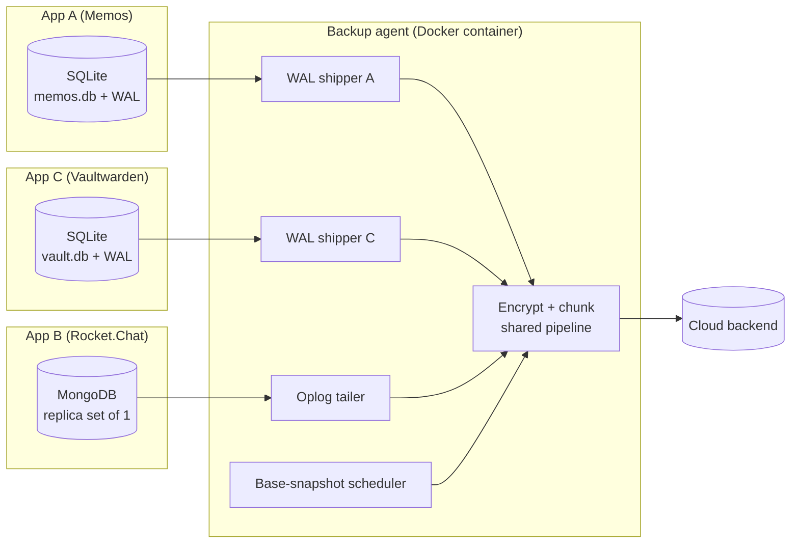
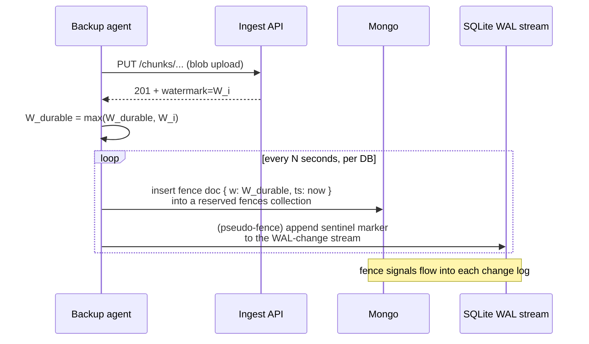

# Local Databases Backup (MongoDB + SQLite)

> Referenced from [`plans/2026-04-23.md`](plans/2026-04-23.md) D-6 / D-10.

## Problem

Umbrel Home runs a zoo of self-hosted apps, each with its own data
directory and its own embedded database. In practice on UmbrelOS, that
means:

- **SQLite** for most lightweight apps — Memos, Vaultwarden, Uptime Kuma,
  Scrutiny, dozens more. Usually one `app.db` file plus `app.db-wal` and
  `app.db-shm` sidecars when WAL mode is on.
- **MongoDB** for heavier apps — Rocket.Chat, some self-hosted tools.

Losing these DBs while the blobs survive means losing the "glue" that
makes blobs meaningful (tags, albums, note indexes, chat history,
attachments references). We need:

- **Near-zero RPO** — crashes shouldn't lose the last hour of DB edits.
- **Point-in-time consistency** with blob backups — restored DB rows
  never reference a blob that wasn't also restored.
- **Zero-knowledge** — server sees ciphertext only.
- **Per-app isolation** — each app backed up and restorable independently.
- **Restore independence** — metadata comes back fast so users see a
  working library while big media re-downloads in the background.
- **Works against a live writer** — can't stop the app to take a
  consistent copy.

## Approach

Different DB families have different native change-log primitives, so
use each one's grain for capture and share the **fence mechanism** for
cross-system consistency.



Each DB has its own capture component, but everything funnels into the
same encrypt-and-chunk pipeline and rides the same upload machinery.

## MongoDB

### Continuous oplog tailing

Mongo runs as a single-node replica set so the oplog exists. (Change
streams are built on the oplog; both work, oplog tailing is simpler.)

- One tailer per Mongo instance. Follows `oplog.rs` from a persisted cursor.
- Each oplog entry is serialized and fed to the chunker as part of a
  continuous byte stream. FastCDC chunks the stream like any other file.
- Cursor position is advanced only after the containing chunk is durably
  uploaded.
- On crash/reboot, tailing resumes from the last persisted cursor —
  at-least-once delivery. Idempotent restore tolerates overlap.

RPO is bounded by chunk cadence (seconds to minutes under normal load).

### Periodic base snapshots

Replaying the entire oplog from epoch-zero is intractable. A base
snapshot is taken every N days (default: weekly; configurable per DB).

- Base snapshot is a logical dump equivalent to `mongodump` — structured
  BSON per collection.
- Streamed through the same chunker/encryptor/uploader.
- Old bases retained per standard retention policy; oplog segments older
  than the oldest pinned base are eligible for GC.

## SQLite

SQLite is the harder case because a plain file copy is wrong: WAL can
contain committed transactions not yet checkpointed into the main file.

### WAL shipping (Litestream-style)

- Put the DB in WAL mode (`PRAGMA journal_mode=WAL`). Most modern Umbrel
  apps already do.
- The WAL shipper opens the DB **read-only** alongside the app (SQLite
  supports this explicitly) and monitors the WAL file.
- As frames are appended to the WAL, the shipper reads completed frames
  (those describing committed transactions) and streams them to the
  chunker as an append-only byte stream.
- The shipper also observes WAL checkpoints. When a checkpoint happens,
  the WAL is reset; the shipper rotates its own stream segment and keeps
  a local watermark of which frames it has durably shipped.

Two subtle correctness points:

- **Checkpoint races.** The shipper must hold a long-lived read lock
  (SQLite `BEGIN` with a read transaction) while reading WAL frames, so
  the app can't checkpoint-and-wrap faster than the shipper can read.
  SQLite's WAL semantics explicitly allow a reader to block checkpointing
  while keeping writers unblocked.
- **`busy_timeout` on the app side.** If the agent's read transactions
  are too long, app writes serialize through them. Keep reader
  transactions short and frequent; ship frames in small batches.

### Base snapshots with `VACUUM INTO`

- Every N hours, the shipper runs `VACUUM INTO '/tmp/app.db.backup'`
  on the live DB. This produces a consistent, fully-checkpointed copy
  without blocking writers (writers block only briefly for the commit).
- The base file is streamed through the chunker/encryptor. Because
  FastCDC is content-defined, consecutive base snapshots share most
  chunks — per-user dedup reclaims the apparent duplication.
- After a successful base upload, old WAL segments prior to that base
  are no longer needed for restore of that app; they age out under
  retention.

### Why not the alternatives

- **`cp app.db`** — races with WAL checkpoints; produces a corrupt copy.
  Non-starter.
- **`sqlite3 .backup`** — uses the online backup API. Correct, but
  full-DB copy every time — no incremental benefit. Acceptable for
  tiny DBs, wasteful at scale.
- **Stop the app, copy, restart** — disruptive, and some Umbrel apps
  don't handle unclean stops well.

Litestream-style WAL shipping is the native SQLite answer, originally
designed for exactly this: continuous durable replication of a live
SQLite DB without stopping the writer.

## Cross-system point-in-time consistency (shared fence)

The correctness invariant is: **after restore, no DB row references a
blob that wasn't also restored, and no app blob references a DB row that
wasn't replayed.**

The mechanism is identical for both DB types.



The fence is not stored *inside* the database files — it's a marker the
**agent** writes into the change-log byte stream it's shipping:

- **MongoDB:** write a tiny doc into a reserved `_backup_fences`
  collection; the write goes through the oplog and therefore into the
  shipped change stream.
- **SQLite:** inject a sentinel record into the WAL-frame byte stream
  the shipper is uploading (outside the DB file itself). Because the
  WAL stream is a pure byte stream the agent controls, adding a
  sentinel is cheap and never touches the live DB.

On snapshot commit, the agent records `fence = W_durable` in the
snapshot manifest.

### On restore

1. Restore the **latest base** of the target DB.
2. Replay the change log (oplog or WAL frames) **up to the first fence
   at or after the target time T, capped by the blob watermark already
   restored**.
3. The restored DB references only blobs that are also present.

If the user restores blobs and DBs to different points in time (e.g.,
"I want DB from yesterday, blobs as of now"), they'll get a warning
that some DB references may dangle — the UI should make the inconsistent
mode an explicit choice, not a silent outcome.

## Per-app isolation (resource groups)

Each Umbrel app is a **resource group** inside the backup model. A
resource group is a set of things that belong together:

- The app's data directory (photos, attachments, note files).
- The app's DB(s) — any mix of SQLite files and Mongo instances.
- The app's fences, which relate its DB logs to its own blobs.

Snapshots carry one encrypted manifest per resource group. A restore
request names the resource group(s) to restore. Failures restoring one
group don't affect others.

This buys us:

- **Partial restore.** "Just bring Memos back" works.
- **Per-app retention.** Possible to keep Memos snapshots forever but
  only Rocket.Chat for a month.
- **Failure isolation.** If Vaultwarden's DB corrupts locally, we can
  restore just Vaultwarden without disturbing Immich.

## Restore protocol (per resource group)

```mermaid
sequenceDiagram
  participant User
  participant Client
  participant API as Ingest API
  participant Obj as Object store
  participant LocalDB as Fresh local DB

  User->>Client: restore app X to time T
  Client->>API: fetch latest base snapshot for X ≤ T
  API-->>Client: manifest + chunk refs
  Client->>Obj: fetch + decrypt base chunks
  Client->>LocalDB: mongorestore OR write base SQLite file
  Client->>API: fetch change-log segments [base_time .. T]
  Client->>Obj: fetch + decrypt change-log chunks
  Client->>Client: scan for fence markers; cap replay at fence ≤ W_blobs_restored
  Client->>LocalDB: apply oplog / WAL frames up to cap
  Client-->>User: app X ready
  Note over Client: blob restore for X continues in background
```

Metadata-first restore is the UX win: the app's structure appears in
seconds to minutes, large media downloads lazily. Users can browse
immediately; opening an un-restored attachment triggers on-demand fetch.

## App-DB discovery (hotspot H-12 resolution)

The agent discovers what to back up via a **manifest-first, auto-scan
fallback** approach:

1. If the host OS or the app provides a manifest declaring its DBs
   (path + type), use it.
2. Otherwise, scan the app's data volume for `*.db` / `*.sqlite` files
   and for typical Mongo data directories. Any match is treated as a
   candidate.
3. Log every discovered DB and let the user confirm / override via the
   backup UI. Silent misses are the failure mode to avoid.

Over time, ecosystem-wide manifest conventions remove the need for
heuristics. Until then, heuristics + user confirmation is the safe
middle ground.

## Edge cases

- **Oplog rollover.** Mitigate by sizing the oplog generously (local-only,
  cheap) and monitoring tailing lag; if the tailer falls irrecoverably
  behind, trigger an emergency base snapshot instead of losing data.
- **SQLite WAL checkpoint outrunning the shipper.** The shipper's
  long-lived read transaction blocks checkpointing; if the shipper
  crashes for long enough that the WAL grows excessively, fall back to
  an out-of-band `VACUUM INTO` base + resync.
- **App deleted by user.** The agent notices the data directory is gone;
  marks the resource group as "deleted" in the next snapshot. Old
  snapshots retain the app's data under retention policy, enabling
  resurrection.
- **App upgraded with schema change.** DB change-log replay is
  schema-neutral (replays ops that already ran under the old schema).
  On restore the app sees its own DB in the exact state it would have
  naturally reached, upgrades happen normally on next launch.
- **Clock skew.** Watermarks are server-issued and monotonic server-side;
  the device's clock matters only for user-facing timestamps.

## What the server sees about the DBs

- Encrypted chunks of each DB's change log and base snapshots.
- Timing and byte volume of DB traffic per resource group — a rough
  activity signal. Accepted leakage.

It does not see: collection names, table names, document or row
structure, note text, message contents, attachment references, app
names. All of that is inside the encrypted payload.

## Industry variants considered

### MongoDB continuous backup

| Approach | Used by | Strength | Why not for us |
|---|---|---|---|
| **Periodic `mongodump`** | Small self-hosted setups, some cron-backup scripts | Simple, portable | Coarse RPO (one lost dump = one lost day); full-DB scan every run; heavy on a shared device |
| **Filesystem snapshot of data dir** (LVM/ZFS) | Some bare-metal DB deployments | Very fast, atomic | Requires Mongo fsync-and-lock, races with compaction; OS-specific; doesn't compose with E2E chunking pipeline |
| **Atlas Backup / Ops Manager** | MongoDB Atlas, Enterprise customers | Managed, continuous, PIT restore | Proprietary SaaS; requires trust in the operator; incompatible with zero-knowledge self-hosted |
| **Percona / mongobackup 3rd-party tools** | Percona users, some enterprise | Feature-rich, open-source | Adds a dependency ecosystem; still fundamentally `mongodump` + archive |
| **Oplog tailing + periodic base** (our pick) | Rocket.Chat Cloud, Meteor Galaxy, MongoDB Atlas under the hood, many custom "continuous backup" tools | Near-zero RPO, change-only incremental, rides any chunk pipeline | Restore = base + replay (more complex than dump/restore) |

**Pick: oplog tailing + periodic base snapshots.** This is how Atlas's own
continuous backup works internally; exposing it ourselves is just not using
a managed SaaS to do it. The replay complexity is contained in our restore
client.

### SQLite continuous backup

| Approach | Used by | Strength | Why not for us |
|---|---|---|---|
| **`cp app.db`** | Naive backup scripts | Trivial | **Wrong** — races with WAL checkpoints; produces corrupt copies. Non-starter. |
| **`sqlite3 .backup` (online backup API)** | Many small tools, Android app backups | Correct, uses Backup API | Full-DB copy each time; no incremental benefit; wasteful at scale |
| **`VACUUM INTO` + archive** | Some production systems | Correct, produces compact base | Same full-copy issue; useful for periodic bases but not sufficient alone |
| **Shut down the app and copy** | Classic file-level backups | Trivially correct | Disruptive; many apps don't recover well from forced stops |
| **Filesystem snapshot (ZFS/APFS/Btrfs)** | Production SQLite on managed FS | Instant, atomic | FS-specific; not portable across the device classes we target |
| **Litestream WAL shipping + periodic `VACUUM INTO` base** (our pick) | Fly.io's edge-DB pattern, many modern "SQLite in production" stacks, Ben Johnson's Litestream project (now part of the broader ecosystem) | Continuous, consistent against live writers, doesn't stop the app; framework-independent | More moving parts than a daily `cp` |

**Pick: WAL shipping + periodic base.** Litestream is the reference
implementation for "continuous durable backup of live SQLite without stopping
the writer." The technique is now widely adopted for edge / self-hosted
SQLite deployments. It's the only approach that satisfies FR-22 (live
writer) and FR-18 (near-zero RPO) together.

### Cross-system consistency (blob ↔ DB)

| Approach | Used by | Strength | Why not for us |
|---|---|---|---|
| **No coordination — hope for the best** | Many naive self-hosted backup tools | Trivial | Restored DB rows routinely reference missing blobs; silent data corruption |
| **Quiesce both before snapshot** | Time Machine (OS-level), some enterprise agents | Clean cut | Requires stopping writers; not acceptable for a live device |
| **Transactional two-phase commit across DB + object store** | Some enterprise backup products | Strongest guarantee | Requires tight coupling with DB internals; doesn't work for heterogeneous DB mix |
| **Monotonic watermark injected into each change log** (our pick) | WAL-based DB replication systems, Kafka + exactly-once patterns, many "coordinated snapshot" implementations | Works across heterogeneous sources; lightweight; doesn't require stopping writers | Requires a small agent-controlled write channel into each DB's change stream (fence doc, WAL sentinel) |

**Pick: monotonic ingest watermark as a fence.** The same idea shows up
under many names in distributed systems (Chandy-Lamport snapshot markers,
Kafka log watermarks, Netflix's Dynomite consistency markers). It's the
right tool when you have multiple producers and need a globally consistent
cut without stopping them.
