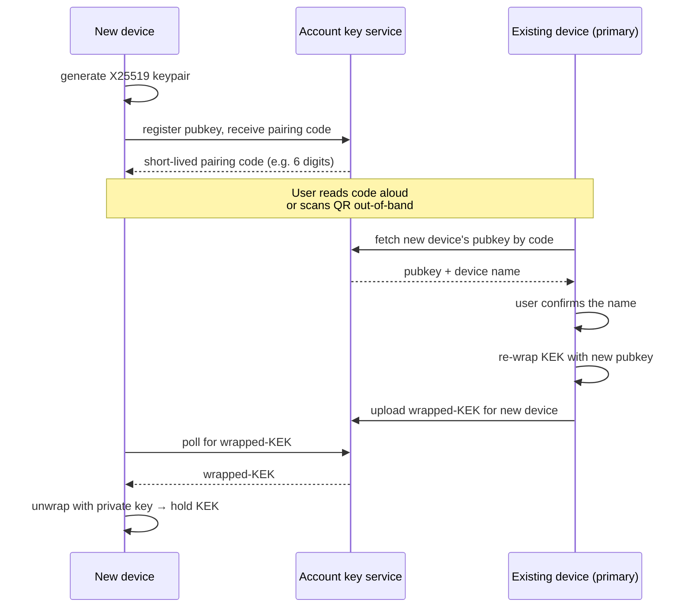
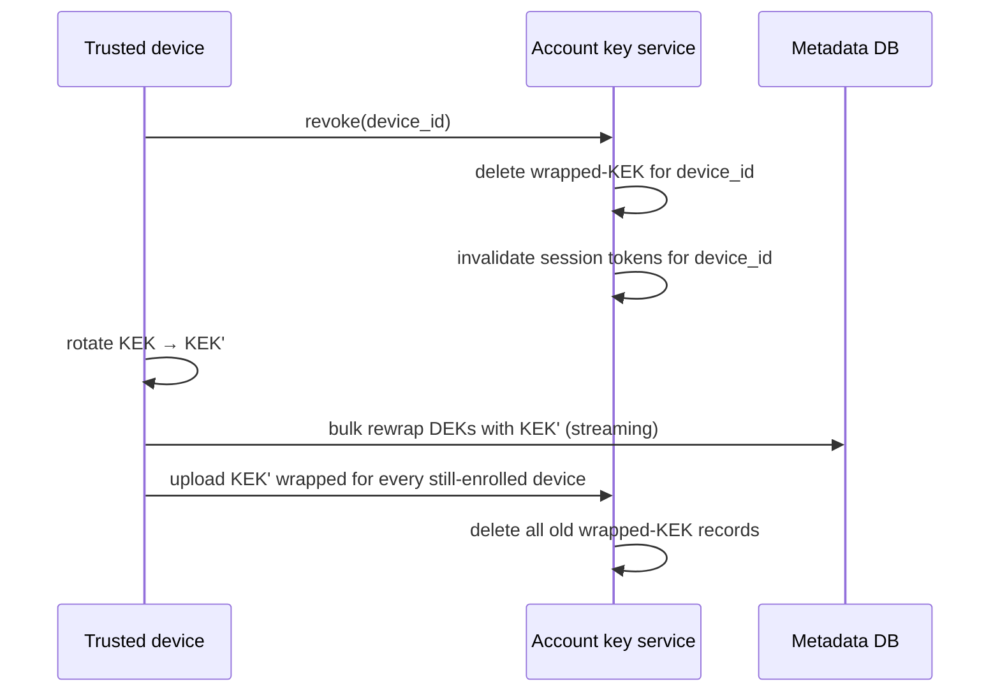

# Multi-Device Access

> Referenced from [`plans/2026-04-23.md`](plans/2026-04-23.md) D-7.

## Problem

The primary device (the RPi) is the only writer. But the user wants to
browse, download, and stream their own data from a phone, laptop, or web
browser. Under zero-knowledge E2E the secondary device must end up holding
the KEK, and the server must never.

## Device identity

Each client device (primary and every secondary) has:

- A long-lived X25519 identity keypair. Private key never leaves the device.
- A server-registered device record with the public key, a human-readable
  name ("Alice's phone"), and creation time.
- A short-lived session token (per-device, bearer token over HTTPS) used for
  normal API calls, minted via a challenge-response against the device
  private key.

## Pairing a new device

This is the one moment where the user actively transfers trust. The server
helps but cannot read the secret that flows.

Key property: the pairing code is a **capability to publish a pubkey under my
account**, not a secret that unlocks anything. Leaking it lets a third party
request to be paired, but pairing only completes when the existing device
user explicitly confirms and re-wraps.

### Web client specifics

The web client runs in a browser, which has no persistent secure key
storage. Options:

- **In-memory only:** the web client holds the unwrapped KEK in memory for
  the session, re-pairs on each new session via a QR code or approval ping
  to a mobile device. Private key lives in IndexedDB wrapped by a
  passphrase.
- **WebCrypto non-extractable keys:** store the device private key as a
  non-extractable CryptoKey. Resists casual exfiltration but still only as
  trustworthy as the origin (XSS on the web client domain is game over).

The design picks the first option as default. The web client is treated as
a less-trusted device; full write access can be gated behind a "this is a
trusted device" toggle during pairing.

## Revocation

Revocation is initiated by any still-trusted device against the account.

After revocation:

- The revoked device's session tokens are invalid — server-side rejection is
  immediate.
- Anything the revoked device *already downloaded and exfiltrated* is still
  readable to it — that's out of scope for the backup system (fundamentally
  can't un-leak a key a client already had).
- Anything uploaded **after** the rotation is under KEK' and unreadable to
  the revoked device. Forward secrecy from revocation onward.

The bulk DEK rewrap is metadata-heavy but not data-heavy: it iterates over
all chunk refs in the user's snapshots, not over the chunks themselves. For
a 50 GB library at ~1 MB chunks that's ~50,000 rewraps — a few minutes of
work on the trusted device.

## Listing and streaming on secondary devices

Once enrolled, a secondary device can:

1. `GET /snapshots` — fetch snapshot metadata list (root hashes, times).
2. For a chosen snapshot, fetch its encrypted manifest, unwrap with KEK,
   decrypt locally.
3. Render the file tree from the decrypted manifest.
4. For any file the user opens, request signed URLs for the file's chunks
   and stream them. Decrypt per-chunk with the wrapped DEK.

For video streaming: the client fetches chunks sequentially and feeds
decrypted output into the platform's media element. Because chunks are
content-addressed and reasonably sized (~1 MB), browser-side caching gives
a native "scrubbable" experience after initial buffer. Transcoding to
bitrate variants is **not** server-side (server can't decode) — it's done
on the primary device as part of ingest, producing a small number of
pre-encoded variants that are stored as separate files under the manifest.

## What the server learns about multi-device use

- Which devices exist and when they were enrolled.
- Per-device session activity (request patterns, IP).
- Which snapshots a device has fetched (via signed-URL requests).

It does not learn the content, file names, or the KEK. This matches the
overall threat model; the residual metadata is what it is.

## Hotspots deliberately unresolved here

- **Cross-device Mongo oplog authoring.** Right now only the primary writes
  oplog entries. If a secondary device edits a note, we need either a
  write-back channel to the primary or a direct-to-server encrypted-event
  submission. This design treats writes from secondary devices as
  out-of-scope; reading from secondaries is the scope.
- **Account recovery via a single device.** If the user only ever has one
  device and it dies, they must rely on the recovery phrase (see
  [`pipeline-04-encryption.md`](pipeline-04-encryption.md)). This is intentional; the alternative is
  server-side escrow, which breaks the trust model.

## Industry variants considered

### Device enrollment / pairing

| Approach | Used by | Strength | Why not for us |
|---|---|---|---|
| **Re-enter passphrase on every new device** | Older password managers, some simple E2E apps | Simplest mental model | Phishable; a leaked passphrase = full account compromise; no per-device revocation |
| **QR code out-of-band + symmetric key transfer** | WhatsApp multi-device (early), Signal (pre-Sesame) | Works without server mediation for the secret transfer | The secret is the root key itself; losing the QR mid-flow is catastrophic |
| **Numeric pairing code + server-mediated ciphertext transfer** (our pick) | iCloud Keychain, Keybase, Matrix cross-signing, Bitwarden Send-style flows | Server facilitates but can't read the transferred secret; short code is easy UX; existing device approves | — |
| **Signal Sesame / X3DH / Double Ratchet per pair** | Signal multi-device, WhatsApp multi-device (current) | Industry-leading forward secrecy, handles async delivery | Designed for message streams, not static-data sharing; heavy for our need (KEK is static, we just need to wrap it once per device) |
| **TEE-sealed local wrap (no pairing)** | Some enterprise MDM-locked tablets | No protocol — device hardware binds key | Requires hardware we can't rely on universally; doesn't enable cross-device access |

**Pick: numeric pairing code + server-mediated wrapped-KEK transfer.** Same
shape as iCloud Keychain enrollment and Keybase's "paper key + per-device
subkey" model. Good UX, preserves zero-knowledge, enables per-device
revocation.

### Revocation

| Approach | Used by | Notes |
|---|---|---|
| **Delete device record + rotate KEK + rewrap DEKs** (our pick) | iCloud Keychain device removal, Keybase revoke | Metadata-only rewrap; forward secrecy after rotation |
| **Delete device record, no rotation** | Some simpler E2E apps | Revoked device still decrypts data it already downloaded; no forward secrecy even for *new* uploads if it retained the KEK |
| **Full re-encryption of all data under new key** | Older enterprise backup tools | Correct but extremely expensive for large libraries |

### Web client

| Approach | Used by | Notes |
|---|---|---|
| **In-memory KEK, re-pair each session via QR** (our pick for untrusted browsers) | ProtonMail web, Tresorit web | No persistent secret on the web origin |
| **Non-extractable WebCrypto key in IndexedDB** | 1Password web, Bitwarden web | Good on trusted devices, still vulnerable to XSS on the origin |
| **Fully native-only (no web client)** | Signal desktop, Cryptomator | Simplest; sacrifices "access from any browser" UX |

Our design uses the first by default with the second as an opt-in for
"trusted device." Matches how ProtonDrive and Tresorit present the choice.
