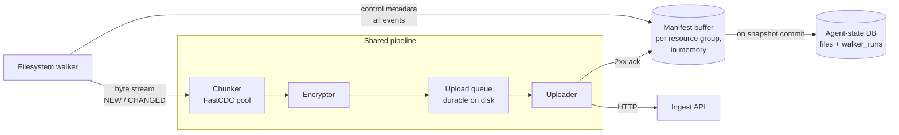

# Filesystem Walker

> Referenced from [`plans/2026-04-23.md`](plans/2026-04-23.md) D-1,
> [`pipeline-01-detection.md`](pipeline-01-detection.md), and
> [`flow-one-shot.md`](flow-one-shot.md).

## Scope

The one component that answers: **"what files are on disk, what has
changed since last time, and what do we need to hand to the chunker?"**

Used in three contexts:

1. **Startup / overflow reconciliation** — called by the continuous
   watcher on agent start and on `IN_Q_OVERFLOW`
   ([`pipeline-01-detection.md` §Filesystem watcher](pipeline-01-detection.md#filesystem-watcher)).
2. **One-shot capture** — called by the coordinator in
   [`flow-one-shot.md` §Filesystem capture](flow-one-shot.md#filesystem-capture).
3. **Per-file re-chunk** — invoked for a single path when inotify
   delivers a change event.

What happens **after** the walker hands work off — chunking, encryption,
upload — is covered in [`pipeline-03-chunking.md`](pipeline-03-chunking.md) and
[`pipeline-05-transport.md`](pipeline-05-transport.md). This doc stops at the boundary
where bytes leave the walker and enter the chunker.

## What the walker produces

For each file it cares about, the walker emits one of three events:

| Event | When | Payload |
|---|---|---|
| `NEW` | Path not in state DB | `(resource_group, path, size, mtime, mode)` + file bytes |
| `CHANGED` | Path in state DB, `(size, mtime)` differs | same |
| `DELETED` | Path in state DB, not on disk | `(resource_group, path)` only |

Unchanged files produce **no event** — the walker silently skips them.
This is the key to keeping large libraries cheap to re-walk.

## Event delivery

"Emits an event" in this doc is a shorthand for a concrete in-process
hand-off. No IPC, no network, no broker — the walker, chunker, and
encryptor are all goroutines / threads inside the same agent process,
talking through bounded in-memory channels. What "emit" means operationally:

### What an event carries

Each event is a pair of things, only one of which is traffic-heavy:

- **Control metadata** — a small struct:
  `(kind=NEW|CHANGED|DELETED, resource_group, path, size, mtime, mode)`.
  Always present.
- **Byte stream** — an `io.Reader` handle on the open file, valid only
  for the duration of the hand-off. Present for `NEW` and `CHANGED`;
  absent for `DELETED`.

The walker never buffers the whole file in memory — it passes a streaming
reader and the chunker pulls bytes as it consumes them.

### Who receives them

Exactly two consumers, both in-process:

| Consumer | Takes | Runs in |
|---|---|---|
| **Chunker** (FastCDC) | Byte stream (NEW / CHANGED only) | Worker pool, typically N = CPU count |
| **Manifest builder** | Control metadata (all events) + the chunk roots the chunker produces | One goroutine per resource group |

The chunker's output (`ct-hash` list per file) flows into the encryptor
→ upload queue → uploader, with no further walker involvement. Once the
uploader 2xx-acks every chunk for a file, the manifest builder finalizes
that file's entry in the pending snapshot manifest.

### The in-process topology



Control metadata goes to the manifest buffer immediately. Byte streams
go to the chunker. Both paths rejoin at the manifest buffer, which
pairs each control event with the `ct-hash` list its chunks produced.

### Back-pressure is the hand-off

"Hand off" is literally a blocking send into a bounded channel:

```text
hand_to_pipeline(event, reader_or_nil):
    # control metadata — cheap, near-instant
    manifest_buffer[event.resource_group].enqueue(event)

    # byte stream — can block for seconds under load
    if reader_or_nil is not None:
        chunker_input.send(reader_or_nil, event)   # BLOCKS if queue full
```

If the chunker's input channel is full, `send` blocks. The walker
pauses until the chunker drains. The chunker in turn blocks on the
encryptor; the encryptor blocks on the upload queue; the upload queue
applies device policy (quiet hours, bandwidth cap, disk headroom —
see [`pipeline-05-transport.md` §Back-pressure](pipeline-05-transport.md#back-pressure)
and §Device policy). Every stage is bounded, so the walker can't
outrun the slowest downstream stage.

This is why you rarely hear the walker described as "queueing events"
— there is no big queue in the walker itself. The walker either has a
free slot in the chunker's input channel or it's sleeping on a send.

### Ordering guarantees

What is ordered:

- **Bytes within a single file** — strict. The chunker sees file bytes
  in file-offset order because the walker feeds a single sequential
  reader.
- **Metadata before chunks for the same file** — the control event
  lands in the manifest buffer first, so the builder always has a
  row waiting when the chunks ack.

What is not ordered:

- **Files within a resource group** — the walker enumerates in
  directory order, but the chunker pool is parallel, so ack order is
  non-deterministic. The manifest builder doesn't care: it keys on
  path, not arrival order.
- **Resource groups vs each other** — fully independent; they have
  separate manifest buffers.
- **A delete vs a new write to the same path within the same scan** —
  shouldn't happen (walker stats each path once), but if it did
  (e.g., via inotify during a scan), last write wins: both events
  update the same manifest-buffer row, and the later one keyed on the
  same path overwrites.

Why lack of cross-file ordering is safe: content-addressed chunks
can't reference anything that isn't already stored by ct-hash, and
the snapshot manifest isn't committed until every file in it has
fully acked. No partially-committed state is ever exposed.

### Delivery semantics

| Level | Guarantee |
|---|---|
| Walker → chunker (in-process channel) | Exactly-once (buffered Go channel / equivalent) |
| Chunker → uploader → ingest API | At-least-once (chunks retry on network failure) |
| Server-side chunk store | Idempotent by `ct-hash` — duplicate PUTs are a no-op |
| Snapshot commit (`POST /snapshots`) | Idempotent by snapshot root hash |
| End-to-end: walker event → durable in a snapshot | Exactly-once, at the snapshot boundary |

Retries happen below the walker's visibility. From the walker's
perspective, handing an event off = the event will eventually be durable
in some snapshot, provided the agent keeps running.

### Durability boundary

Events are **not** themselves persisted. What's persisted is the
downstream state they produce:

- **Chunks queued for upload** — on disk in the durable upload queue;
  survive reboot.
- **`files` table row** — only advances after every chunk for that
  file is acked AND the snapshot commit succeeds. Crash-safe.
- **`walker_runs.last_path` cursor** — advances every ~100 files or
  ~1 s. Enables resume.

What is **not** durable and must be redone after a crash:

- In-flight bytes the chunker was reading — walker re-reads the file
  on the next scan (state DB hasn't advanced, so the walker still
  treats it as NEW / CHANGED).
- Manifest-buffer entries not yet committed — rebuilt by replaying
  the walk.

This is safe because all the "redo" work is cheap: CDC produces the
same chunks, the server already has them from the previous attempt,
and `HEAD /chunks/{ct-hash}` returns 200 for every one. Near-zero
wire cost on recovery.

### The snapshot commit is the real commit

An event becomes "real" at the snapshot boundary, not when the walker
emits it. Concretely, these three things must all complete before the
walker considers a file backed up:

1. All chunks for the file have 2xx-acked at the ingest API.
2. `POST /snapshots` returns 201 with the new snapshot root hash.
3. The walker updates `files.last_chunk_root` in a single local DB
   transaction.

If the agent dies between 1 and 2, the chunks exist server-side but
no snapshot references them — they're unreferenced and cheap to
re-reference on the next commit. If it dies between 2 and 3, the
snapshot is committed server-side but the walker doesn't know it yet;
on restart it re-chunks the file, produces the same `ct-hash`es, and
the next snapshot commit is a no-op (same root hash → idempotent).

Either way, the walker never "loses" a backup — it just may repeat
some cheap work.

### Where events end up in the server metadata DB

Once a commit succeeds, each walker event has translated into concrete
rows in the server-side metadata DB and entries inside the encrypted
manifest. The full schema, per-event-type translation table, and a
worked example (photo added, renamed, deleted) are in
[`pipeline-06-storage.md` §From walker events to stored rows](pipeline-06-storage.md#from-walker-events-to-stored-rows).
Short version:

- `NEW` / `CHANGED` → 0-to-K new rows in `chunks` (only for ct-hashes
  this user didn't already have) + a `FileEntry` in the new encrypted
  manifest.
- `DELETED` → a `Tombstone` entry in the manifest; no new chunk rows.
- Per commit, regardless of event count: one new `snapshots` row and
  a set of `chunk_refs` rows for GC.

## Consistency across the split event path

### The concern

An event goes to two places: the manifest buffer (control metadata)
and the chunker (byte stream). They proceed independently. What if
one side succeeds and the other fails — do we end up with a manifest
entry referencing chunks that were never uploaded, or chunks that no
manifest points to?

The short answer: **no, because nothing is stored in any database
until the commit is atomic, and every step before that is idempotent**.

### The invariant

**`POST /snapshots` is the only atomic boundary. Nothing about a
walker event is durable server-side until it returns 2xx.**

Before the commit the event's pieces sit in three places with very
different durability semantics:

| Layer | What | Durable when | If commit never happens |
|---|---|---|---|
| Manifest buffer (client, in-memory) | Control metadata | Never on its own | Lost on crash; replayed by next walk |
| Object store | Ciphertext chunks | `PUT /chunks` 2xx | Orphan; GC'd after safety delay |
| Metadata DB | `snapshots` row + `chunk_refs` | `POST /snapshots` 2xx (one transaction) | Never written |

Two things are worth emphasizing:

- **The manifest buffer is not a database.** It's an in-memory
  structure that exists only for the duration of one commit window.
  A walker event lands there instantly, but that's bookkeeping, not
  persistence. If the agent crashes with events in the buffer, they
  are gone — and that's fine, see below.
- **Chunks can be durable without being referenced.** This is
  intentional. It lets the uploader work ahead of the commit and
  makes the commit itself a pure metadata operation. Orphans become
  live once a snapshot references them, or get cleaned up by GC
  after the safety delay
  ([`pipeline-06-storage.md` §Garbage collection](pipeline-06-storage.md#garbage-collection)).

### Every step is idempotent

- **Chunks** are idempotent by `ct-hash` — duplicate `PUT`s are
  no-ops.
- **Snapshot commits** are idempotent by the Merkle root hash —
  `POST /snapshots` with a root the server already has returns 200
  with no side effect
  ([`pipeline-05-transport.md` §Snapshot commit atomicity](pipeline-05-transport.md#snapshot-commit-atomicity)).
- **The local `files.last_chunk_root` row** advances only after the
  commit succeeds, so replaying a partially-completed event is
  always safe.

The three idempotencies compose: the agent can re-emit, re-upload,
and re-commit the same event arbitrarily many times, and the system
converges to one correct snapshot.

### Failure matrix

Every realistic failure during the commit cycle and what happens:

| Failure | Server has | Local walker state | Recovery |
|---|---|---|---|
| Walker crashes before chunker reads bytes | Nothing | `files` unchanged | Next walk re-emits the event; full re-read of the file |
| Chunker crashes mid-file | Partial chunks as orphans | `files` unchanged | Next walk re-emits; `HEAD` returns 200 for already-uploaded chunks; only the missing tail is re-sent |
| Chunk upload hits terminal error (corrupt payload, quota exceeded, auth failure) | N−1 chunks as orphans | `files` unchanged | That file is dropped from the current commit window; re-emitted on next scan; orphans GC'd |
| All chunks uploaded, `POST /snapshots` fails (transient) | K orphan chunks | `files` unchanged | Commit retried with the same root hash; server idempotent; orphans become live on success |
| `POST /snapshots` returns 200 (server already has this snapshot from an earlier attempt) | Snapshot exists | `files` unchanged | Client treats 200 as success; advances `files`; file produces no event on next walk |
| Commit succeeds, agent crashes before advancing local `files` | Snapshot committed; chunks live | `files` stale | Walker re-emits on next walk → chunker produces the same ct-hashes → `HEAD` returns 200 for all → next `POST /snapshots` computes the same Merkle root → server returns 200 (idempotent); client finally advances `files` |
| Network partition during commit (client doesn't know if the server wrote the row) | Unknown | `files` unchanged | Retry the commit with the same root hash; server returns 200 or 201 — both mean success |

The pattern is consistent: **whenever the local `files` row and the
server's `snapshots` row disagree, the walker redoes the work, the
server recognizes the redo via content-addressing and root-hash
idempotency, and convergence happens in one more commit cycle.** The
replay cost is near-zero: `HEAD /chunks` returns 200 for every chunk,
no bytes cross the wire.

### What this is *not*

- **Not transactional** across the manifest buffer and the chunker —
  they operate on different timescales (microseconds for metadata
  vs seconds-to-minutes for byte streams). A cross-store transaction
  would serialize everything and destroy throughput.
- **Not write-ahead-logged on the client.** No recovery log; the
  state DB plus server-side idempotency replace it.
- **Not exactly-once on the wire.** Retries genuinely re-send work.
  Exactly-once semantics emerge only at the snapshot boundary, where
  the root-hash check absorbs duplicates.

### How this relates to cross-system consistency

The consistency story above covers a **single** resource group's
files. Keeping file and DB content consistent across a fence (so the
restored DB never references a photo that wasn't restored) is a
separate mechanism built on top of the same commit boundary, covered
in [`databases.md` §Cross-system point-in-time consistency](databases.md#cross-system-point-in-time-consistency-shared-fence).
Both rely on the same underlying invariant: the commit is the only
atomic boundary, and the client has full control over its root hash.

## What it stores

Every committed result lives in the agent-state DB (see
[`pipeline-01-detection.md` §Agent-state DB schema](pipeline-01-detection.md#agent-state-db-schema-sketch)).
The walker-owned table:

```sql
CREATE TABLE files (
  resource_group  TEXT NOT NULL,
  path            TEXT NOT NULL,        -- relative to resource-group root
  size            INTEGER NOT NULL,
  mtime           INTEGER NOT NULL,     -- unix ns
  mode            INTEGER NOT NULL,     -- file mode bits
  last_chunk_root BLOB,                 -- 32-byte Merkle root over the file's chunk ct-hashes
  deleted_at      INTEGER,              -- unix ns; null if live
  PRIMARY KEY (resource_group, path)
);
```

### `last_chunk_root` is a 32-byte hash, not the file data

A natural misread of `BLOB` is "this column stores the file's bytes."
It does not. `BLOB` in SQLite just means "raw bytes" as opposed to
"text"; the bytes here are a fixed-size hash — specifically, a
Merkle root (see [`../../merkle-trees-guide.md`](../../merkle-trees-guide.md)
for what that is and why we use it). The *actual* file content
(chunks of ~1 MB each, ciphertext) lives in the server's object
store, content-addressed by `ct-hash`. The state DB only stores
pointers.

Three related but distinct things — worth nailing down because the
terms blur easily:

| Term | What it is | Size | Where it lives |
|---|---|---|---|
| **Chunk** | One ~1 MB (average) piece of the file after CDC splits it, then encrypted | ~1 MB | Object store, keyed by `ct-hash` |
| **`ct-hash`** | The hash of one chunk's ciphertext (BLAKE3 or SHA-256) | 32 bytes | `chunks` table in the server metadata DB; inside the file's manifest entry |
| **`last_chunk_root`** | A Merkle root computed over the file's ordered list of `ct-hash`es | 32 bytes | `files` table in the local agent-state DB (this column) |

So one file → many chunks → each chunk has a `ct-hash` → a single
`last_chunk_root` is derived from that ordered list. One hash is
enough to identify "the file's entire content" because any byte
change anywhere in the file would produce a different chunk
somewhere, which would produce a different `ct-hash`, which would
produce a different root.

### Why store the root at all

The walker could in principle re-chunk every file every time and
let the dedup `HEAD /chunks` calls decide what's new. `last_chunk_root`
is a purely local optimization that catches one very common case
cheaply: **the mtime changed but the content didn't** (e.g.,
`touch`, a photo library re-indexing, apps rewriting metadata with
the same bytes).

Without the column:

1. Walker sees `(size, mtime)` differ → re-reads file.
2. Chunker produces chunk list.
3. Uploader does `HEAD /chunks/{ct-hash}` for every chunk → all 200.
4. A new manifest entry is still built and a new snapshot row is
   written, even though nothing actually changed.

With the column:

1. Walker sees `(size, mtime)` differ → re-reads file.
2. Chunker produces chunk list and finalizes a `chunk_root`.
3. Walker compares the new `chunk_root` to `last_chunk_root`.
4. **Match** → update `mtime` in `files`, emit no event, skip the
   manifest churn and the snapshot-row churn entirely.

One 32-byte comparison saves a round-trip per chunk plus a manifest
rebuild. For a library where most `mtime` bumps are spurious, this
turns a re-index into a near-no-op.

### Could we use something cheaper than a Merkle root?

In principle yes — a plain hash of the concatenated chunk-list would
also work for the "did content change?" question. The reason we use
a Merkle *root* is that the same structure serves two additional
purposes:

- **Snapshot identity** — the encrypted manifest's root hash is the
  snapshot ID, and it's built from these per-file roots. Using the
  same Merkle construction everywhere makes server-side integrity
  checks and parent-chain auditing one mechanism, not three
  (see [`pipeline-06-storage.md`](pipeline-06-storage.md) §Snapshot
  structure).
- **Cheap integrity proofs** — on restore, the client can verify
  individual chunks against the file's root without downloading
  every sibling chunk. This matters for partial restores.

So `last_chunk_root` is one byte-count away from the simplest thing
that could work, but it's the right byte-count because the root is
already being computed anyway for the snapshot manifest.

### Two rules the walker always follows when writing this table

- **`last_chunk_root` advances only after the chunks it refers to are
  acked by the ingest API.** Until then the row stays on its old value.
  If the upload fails, the walker hasn't "forgotten" the previous
  backed-up state.
- **`deleted_at` is set at commit time**, not at detection time. A file
  that reappears before the next snapshot commit looks like an in-place
  change, not a delete+create.

## Include / exclude rules

Before emitting any event, the walker applies a rule set so the wrong
things don't get captured:

1. **Per-resource-group roots** — only files under configured roots
   are considered at all.
2. **Skip DB files owned by shippers.** Paths matching `*.db`,
   `*.db-wal`, `*.db-shm`, `*.sqlite`, `*.sqlite-journal`,
   `WiredTiger*`, `journal/*` inside an app's data directory are
   **not** captured by the walker — the DB shippers own them. See
   [`databases.md`](databases.md).
3. **Skip transient editor / OS artifacts.** `*.tmp`, `*~`, `.DS_Store`,
   `.Trash/*`, `.~lock.*#`, `~$*`.
4. **Skip symlinks that escape the resource group.** A symlink pointing
   outside the root is not followed; the link itself is recorded by
   path but its target is not walked.
5. **Skip anything in user-configured ignore globs.** Loaded from
   `~/.umbrel-backup/ignore` per resource group.

Everything not excluded is **included**, including hidden files
(users store things in `.config` they want backed up).

## Step-by-step algorithm

```text
walk(resource_group):
    root := config.roots[resource_group]
    seen := empty set of paths

    for entry in recurse(root):                     # depth-first
        rel_path := entry.path relative to root
        if rules.excluded(rel_path):
            continue
        seen.add(rel_path)

        pre_stat := stat(entry)
        if pre_stat == null:                        # raced with delete
            continue

        prev := state_db.lookup(resource_group, rel_path)

        if prev == null:
            emit_new(resource_group, rel_path, pre_stat)
        else if prev.size == pre_stat.size
              and prev.mtime == pre_stat.mtime:
            continue                                # unchanged, silent skip
        else:
            emit_changed(resource_group, rel_path, pre_stat)

        checkpoint_cursor(resource_group, rel_path)  # for resumability

    # second pass: detect deletes
    for row in state_db.rows_for(resource_group) where deleted_at is null:
        if row.path not in seen:
            emit_deleted(resource_group, row.path)
```

### Per-file capture (the `emit_new` / `emit_changed` body)

This is the part that has to deal with **live writes** — the file may
be modified while we read it.

```text
capture_file(resource_group, path, pre_stat):
    chunker := new_chunker()
    f := open(path, O_RDONLY | O_NOATIME)
    try:
        for buffer in read_in_blocks(f, 1 MiB):
            chunker.feed(buffer)
    finally:
        close(f)

    post_stat := stat(path)
    if post_stat == null:
        mark_deleted(path); return
    if post_stat.size != pre_stat.size
       or post_stat.mtime != pre_stat.mtime:
        # file changed under us
        if not already_retried(path):
            return capture_file(resource_group, path, post_stat)  # retry once
        mark_torn(resource_group, path)  # persistent flag in manifest
        # fall through — we still emit; next sync corrects

    chunk_root := chunker.finalize()

    if chunk_root == state_db.last_chunk_root(resource_group, path):
        # content identical despite mtime bump (e.g., `touch`); no-op
        state_db.bump_mtime(resource_group, path, pre_stat.mtime)
        return

    hand_to_pipeline(
        chunks = chunker.chunks,
        manifest_entry = {
            resource_group, path,
            size   = pre_stat.size,
            mtime  = pre_stat.mtime,
            mode   = pre_stat.mode,
            chunk_root,
        },
    )
    # state_db.files(...) updated ONLY after the pipeline acks
```

`hand_to_pipeline` pushes chunks into the encrypt-and-upload queue
covered in [`pipeline-05-transport.md`](pipeline-05-transport.md). CDC + dedup means
chunks the server already has are recognized via `HEAD /chunks/{ct-hash}`
and skipped; only true new bytes are uploaded.

## Stable-read: why it works

The walker can't freeze the filesystem, so it uses **re-stat after
read** as a cheap integrity check:

- If `(size, mtime)` before and after reading match → the read saw a
  consistent file.
- If they differ → something wrote during the read; the bytes we got
  don't correspond to any single version of the file.

One retry handles most cases (users rarely write the same file twice
in the tens of milliseconds a read takes). Persistent torn reads are
recorded in the manifest and healed by the next sync — CDC chunking
means only the affected chunks are inconsistent, not the whole file.

This is the same mechanism described in
[`flow-one-shot.md` §Filesystem capture](flow-one-shot.md#filesystem-capture);
that doc now links here.

## Relationship to chunking and dedup

Your intuition — "if a file changed at the beginning, we should send only
a few chunks rather than the whole file" — is exactly what happens. But
the mechanism is layered, and the walker itself stays simple. Three
layers cooperate:

| Layer | Decision | Granularity |
|---|---|---|
| **Walker** | Does this file need re-reading at all? | Per **file** |
| **Chunker** (CDC) | How do I split these bytes into chunks? | Per **file's bytes** |
| **Dedup** (ingest API) | Does the server already have this chunk? | Per **chunk** |

The walker never tracks chunks directly — it compares `(size, mtime)`
per file, nothing more. The dedup savings come entirely from the layers
below it. Full CDC detail in
[`pipeline-03-chunking.md`](pipeline-03-chunking.md) and
[`../../cdc-guide.md`](../../cdc-guide.md).

### Worked example: 500 MB video, 10 bytes changed at the start

1. **Walker.** User opens the file in a metadata editor, bumps a tag,
   saves. `mtime` changes; `size` stays ~the same. The walker's
   `(size, mtime)` check sees a difference and calls
   `capture_file(path)`. It does **not** know or care which bytes
   changed.
2. **Chunker.** The full 500 MB is streamed into the chunker. FastCDC
   picks content-defined boundaries. The first chunk (covering the
   edited region) gets a new `ct-hash`. Every subsequent chunk has
   **the same bytes** as before, so it hashes to the same `ct-hash` as
   before. CDC's content-addressing guarantees this — boundaries depend
   on the rolling hash of local bytes, not file offset.
3. **Dedup.** The uploader runs `HEAD /chunks/{ct-hash}` for each
   chunk. The first chunk returns 404 → upload 1 MB of new bytes. The
   remaining ~499 chunks return 200 → **zero bytes uploaded**.
4. **Walker state.** After all chunks ack, the walker advances
   `last_chunk_root` to the new Merkle root over the file's chunks.

Net wire cost: ~1 MB for a 500 MB file. No per-chunk bookkeeping
needed on the walker's side.

### Why the walker doesn't track chunks

It might feel like the walker should remember each file's chunk list
and diff it intelligently. It shouldn't, for two reasons:

1. **CDC boundaries depend on content, not position.** You can't know
   which chunks changed without re-chunking. Re-reading the file is
   unavoidable once `(size, mtime)` differs. Storing per-chunk offsets
   per file wouldn't save any I/O.
2. **The dedup `HEAD` is already the right check.** Once the chunker
   produces `ct-hash` values, the ingest API answers "do you have it?"
   in one round trip per chunk. That's the authoritative "which chunks
   changed" answer. Local chunk tables would just cache something the
   server already knows cheaply.

The walker's **`last_chunk_root`** column is the one chunk-aware piece
of state it keeps, and only for one purpose: the no-op path below.

### The no-op path (why `touch` is free)

A common case: a file's `mtime` bumps but its content is identical
(e.g., `touch file.jpg`, or a photo library re-indexing). The walker
detects this without uploading anything:

1. `(size, mtime)` differ → walker calls `capture_file()`.
2. Chunker re-chunks the bytes, produces a new `chunk_root`.
3. Walker compares the new `chunk_root` to `last_chunk_root` in the
   state DB.
4. **Match** → update `mtime` in the state DB, emit nothing to the
   pipeline, return.

So the walker re-reads the file (unavoidable — it has to know whether
content changed), but nothing crosses the encrypt / upload boundary and
no new snapshot entry is created. For a library where most `mtime`
bumps don't reflect real content changes, this is the common path.

### What the chunker caches for the walker

The agent keeps a local **`(plaintext_hash → ciphertext_hash, wrapped
DEK)`** cache (see
[`pipeline-03-chunking.md` §Local chunk cache](pipeline-03-chunking.md#local-chunk-cache-on-the-device)).
When the walker re-reads a file that hasn't actually changed:

- Chunker produces the same plaintext chunks.
- Cache lookup returns the existing ciphertext hash → no re-encrypt.
- `HEAD` lookup returns 200 → no re-upload.

So "re-read" is the only cost. On NVMe at 500+ MB/s that's cheap; the
bottleneck is CPU-bound chunking, which is throttled by back-pressure
from the upload pipeline anyway.

## Resumability

A large resource group (hundreds of thousands of photos) can take long
enough that the agent might be killed mid-walk. The walker's cursor is
stored per run:

```sql
CREATE TABLE walker_runs (
  run_id          TEXT PRIMARY KEY,
  resource_group  TEXT NOT NULL,
  started_at      INTEGER NOT NULL,
  last_path       TEXT,                 -- last path the walker committed past
  state           TEXT NOT NULL,        -- 'running' | 'done' | 'failed'
  finished_at     INTEGER
);
```

On agent start:

1. For every `running` row, **resume from `last_path`** — the walker
   continues enumeration after that path instead of restarting from
   the root.
2. For every `done` row older than the reconciliation interval, start
   a fresh run (state is always eventually re-verified).
3. On `IN_Q_OVERFLOW` from the live watcher, start a new run for the
   affected resource group.

The cursor is updated in the state DB every N files or every M seconds,
whichever comes first (e.g., every 100 files or 1 s). The cost is one
small write; the benefit is never re-walking the whole tree after a
crash.

## Integration with the continuous watcher

Two entry points, both call into the walker machinery above:

- **Full scan** (startup, overflow) — runs the top-level `walk()`.
- **Single-file capture** (live inotify event for one path) — skips
  `walk()` and calls `capture_file()` directly.

The per-event flow — inotify masks, 500 ms debounce, overflow trigger —
lives in [`pipeline-01-detection.md`](pipeline-01-detection.md#filesystem-watcher).
That doc now points here for "what happens once the path is ready to
re-chunk."

## Integration with one-shot backup

The one-shot coordinator invokes the walker per resource group in
parallel. No special mode is needed: the walker always produces events
for new and changed files regardless of caller. See
[`flow-one-shot.md` §Filesystem capture](flow-one-shot.md#filesystem-capture).

When a filesystem snapshot (`btrfs` / `zfs` / `APFS`) is available, the
one-shot coordinator points the walker at the snapshot root instead of
the live root; the walker code is unchanged.

## Memory and throughput

- **Streaming by design.** The walker holds one directory's entries at
  a time, not the whole tree. Chunker receives bytes in 1 MiB blocks
  and streams them out; large files do not inflate memory.
- **Back-pressure is automatic.** If the chunker / encryptor /
  uploader is backed up, `hand_to_pipeline` blocks. See
  [`pipeline-05-transport.md` §Back-pressure](pipeline-05-transport.md#back-pressure).
- **Batched state-DB writes.** The walker groups commits into
  transactions (one commit per 100 files or per second). Keeps fsync
  cost bounded on the NVMe.
- **Parallelism across resource groups.** Each group walks in its own
  goroutine / thread; they share the chunker pool downstream but the
  enumeration is independent.

## Edge cases

| Case | Handling |
|---|---|
| Symlink inside the resource group | Record the link; don't follow if it points outside |
| Hard link to a file already walked | Record the path; dedup at chunk level means same bytes upload once |
| Sparse file | Read sequentially; holes read as zeros, which CDC handles fine |
| Permission denied on read | Log, record an `unreadable` flag on the manifest entry, continue |
| Non-UTF-8 path bytes | Store as raw bytes in the `path` column (Linux filenames are byte strings) |
| Rename across directories mid-walk | Detected as delete + new; CDC dedup means the bytes don't re-upload |
| File replaced by directory mid-walk (or vice versa) | Detected as delete + new; the new type is captured normally |
| Path longer than filesystem limit (rare) | Log + skip; surfaced in UI warnings |
| Very deep directory nesting | Recursion uses an explicit stack, not language recursion, so no stack overflow |
| File modified exactly at the mtime granularity | `size` check is the safety net; if size matches but content differs, next sync catches it |
| Filesystem exposes pseudo-files (`/proc`, `/sys` accidentally inside a root) | Exclusion rules cover it; sanity-check at config load that roots aren't on pseudo-fs |

## What the walker does **not** do

- **Encrypt.** That's the encryptor's job.
- **Chunk.** That's the chunker's job; the walker streams bytes into it.
- **Upload.** That's the uploader's job.
- **Decide when to back up.** The coordinator (one-shot) or the
  scheduler (continuous) decides invocation. The walker does the work
  when called.
- **Touch DB files.** Owned by the Mongo tailer / SQLite shipper.
- **Manage snapshots.** The snapshot committer in
  [`pipeline-05-transport.md`](pipeline-05-transport.md#snapshot-commit-atomicity)
  does that; the walker contributes manifest entries.

This separation keeps the walker replaceable — swapping it for a
filesystem-snapshot-based enumerator (when FS snapshots are available)
changes nothing downstream.

## Summary

- Walker enumerates files in a resource group, compares each against
  the state DB via `(size, mtime)`, and emits NEW / CHANGED / DELETED
  events for the ones that differ.
- For each emitted file it streams bytes through a stable-read capture
  (pre-stat → read → post-stat check) into the shared chunker.
- State is in the `files` table of the agent-state DB; cursors in
  `walker_runs`; both advance only after the pipeline acks.
- Unchanged files produce **zero** output — the cheap path is cheap.
- Same code runs in three contexts: continuous reconciliation, one-
  shot capture, per-event re-chunk. The caller decides when, the
  walker decides what.
