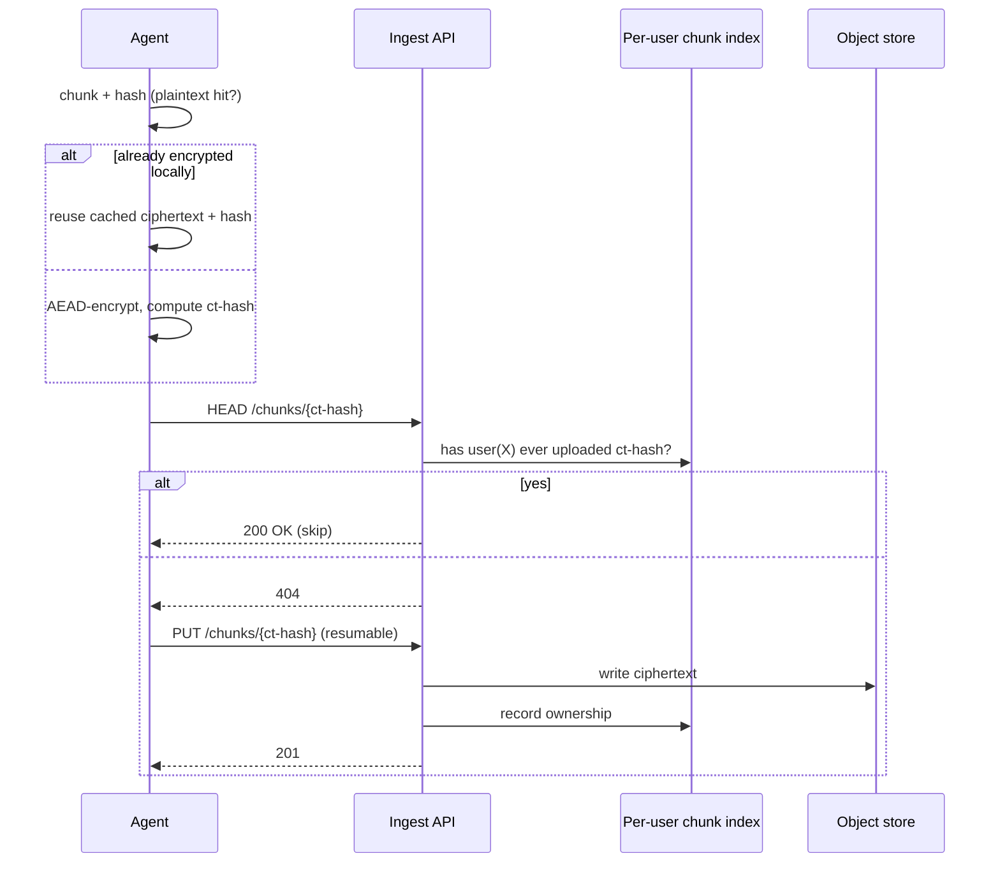

# Chunking & Deduplication

> Referenced from [`plans/2026-04-23.md`](plans/2026-04-23.md) D-2 / D-3.
>
> For the algorithms, worked examples, per-data-type behavior, streaming,
> resumability, and performance numbers on ARM, see the standalone
> [`../../cdc-guide.md`](../../cdc-guide.md).
>
> The upstream component that feeds bytes into the chunker — file
> enumeration, change detection, stable-read — is
> [`pipeline-02-file-capture.md`](pipeline-02-file-capture.md). The walker decides
> *whether* to re-chunk a file; this doc covers *how* the chunks are
> formed and deduplicated.

## What this gives us

The device-side agent must upload "as little as possible" — ideally only bytes
that are genuinely new in the user's library. Chunking + dedup turns every
file into a list of addressable fragments so that:

- An unchanged file costs zero bytes on the wire (its chunk hashes already
  exist server-side).
- A file with a small edit in the middle costs only the chunks spanning the
  edit, not the whole file.
- The same photo imported twice, or the same Mongo oplog segment, is stored
  once on the server.

## Chunker choice

**Content-defined chunking (CDC), FastCDC variant, ~1 MB average chunk.**
Whole-file storage for anything smaller than 256 KB.

- **Binary files (photos, videos)** — run FastCDC over the raw file bytes.
- **Mongo oplog stream** — run FastCDC over the binary oplog stream as it's
  tailed. Boundaries are stable across reboots because CDC boundaries depend
  only on content, not position.
- **Small files (< 256 KB)** — one chunk per file. Splitting costs more than
  it saves.

### Why CDC over fixed-size

Fixed-size chunking is cheaper (~no CPU) but catastrophic for any file where
bytes get inserted near the front: every downstream chunk shifts, nothing
dedups. CDC sets boundaries where a rolling hash hits a pattern, so insertions
only affect chunks they actually touch.

FastCDC is the specific variant chosen because it's roughly 2× faster than
Rabin-based CDC on the same CPU budget, which matters on ARM.

### Parameters

| Parameter | Value | Reason |
|---|---|---|
| Minimum chunk size | 256 KB | Avoid tiny chunks that amortize badly on network + metadata |
| Average chunk size | 1 MB | Sweet spot for photos/videos; low per-chunk metadata overhead |
| Maximum chunk size | 4 MB | Cap worst-case memory per chunk during encrypt/upload |

These are defensible defaults; the real values come from measurement. They
live in config, not code.

## Hashing

Two distinct hashes per chunk, used for different jobs:

- **Plaintext hash** (BLAKE3-256 of plaintext). Used *only* client-side, as
  the key in a local chunk index so the agent can skip re-encrypting the same
  plaintext twice.
- **Ciphertext hash** (BLAKE3-256 of ciphertext). Used as the content address
  the server sees. This is the only identifier ever sent to the cloud.

BLAKE3 is chosen over SHA-256 for speed on ARM (typically 3–5× faster), still
collision-resistant at 256 bits.

## Dedup scope: per-user only

The server accepts a "skip upload" response for a chunk only if that same
user has previously uploaded that ciphertext hash. Cross-user hits are
treated as a full upload.

### Why not cross-user (convergent encryption)

Convergent encryption derives the encryption key from the plaintext hash, so
two users encrypting identical plaintext produce identical ciphertext and the
server can dedup across them. This leaks **plaintext equality**: the server
learns that user A and user B have the same file. For well-known files
(leaked documents, popular images) this is effectively learning the plaintext.
Incompatible with the zero-knowledge promise.

The cost of refusing cross-user dedup is duplicate storage for files many
users have in common (e.g. a meme photo both saved). At 10K scale with a
personal-media profile, this is a small tax in practice; the real dedup wins
are within a single user's own library.

## Skip-upload protocol

The per-user chunk index is a small table of `(user_id, ct-hash) → ref count`.
It's the authority for "does this user already have this chunk?"

## Local chunk cache on the device

The agent keeps a bounded local cache of `(plaintext_hash → ciphertext_hash,
wrapped DEK)` so re-encountering the same file (e.g., a file scan after a
reboot) doesn't re-encrypt. Cache eviction is LRU, capped at a small fraction
of local disk.

## Resulting properties

- **Bandwidth:** near-optimal incremental uploads.
- **Storage:** linear in the user's unique data; no cross-user savings but no
  cross-user leakage either.
- **CPU on the device:** dominated by FastCDC + BLAKE3 + AEAD, all streaming
  and allocation-light; fits the RPi-class budget.
- **Memory:** bounded by max chunk size (4 MB) × upload concurrency.

## Industry variants considered

Picking a chunker is picking one of a well-explored field. The real options:

| Approach | Used by | Strength | Why not for us |
|---|---|---|---|
| **Fixed-size blocks** | Dropbox (historical 4 MB blocks), iCloud Drive, Google Drive, any "whole-file versioned" store | Zero CPU, trivial to implement, maps directly to HTTP range semantics | Catastrophic for insertions — a 1-byte prepend shifts every downstream block and defeats all dedup. Fine when you don't promise incremental efficiency; we do. |
| **Rabin fingerprint CDC** | bup, original LBFS paper, older ZFS dedup | The classic CDC, well-studied, content-defined boundaries | ~2× slower than FastCDC on ARM for the same dedup quality. Pure speed loss with no upside. |
| **Buzhash CDC** | borgbackup | Similar quality to Rabin, simpler rolling math | Slightly slower than FastCDC; no strong reason to prefer. Solid fallback. |
| **FastCDC** (our pick) | restic, duplicacy, kopia, Tarsnap-class backups | Best CPU/dedup trade-off currently published; ARM-friendly | Nothing relevant. Dominant industry answer for new backup tools since ~2016. |
| **Gear / Quickcdc** | Research tools, some recent OSS | Even faster than FastCDC on modern CPUs | Less mature, fewer production deployments to validate edge cases. Revisit in 2–3 years. |

**Pick: FastCDC.** It's what the best open-source backup engines converged on
and there's no domain-specific reason to deviate on an ARM device.

For **dedup scope**, the industry split is sharper:

| Approach | Used by | Strength | Why not for us |
|---|---|---|---|
| **Per-user dedup** (our pick) | Tarsnap, Arq, most E2E backup services | Zero cross-user leakage. Honest zero-knowledge. | Misses the (small) savings from cross-user identical files. |
| **Convergent / cross-user dedup** | Dropbox (historical), some older cloud storage | Large storage savings when many users share common files | Well-known plaintext-equality leak. iMessage researchers (and others) have shown this can recover known-file presence. Incompatible with our privacy goal. |
| **Opt-in "content-aware" dedup** | Backblaze B2 at account-scope, iCloud at container-scope | Compromise: dedup within a customer, not across | This is effectively what "per-user" means in our design. Same answer. |

The choice is really a privacy stance. Tarsnap picked the same trade-off we're
picking, for the same reasons. Dropbox moved away from aggressive cross-user
dedup after the leakage concerns became public.
