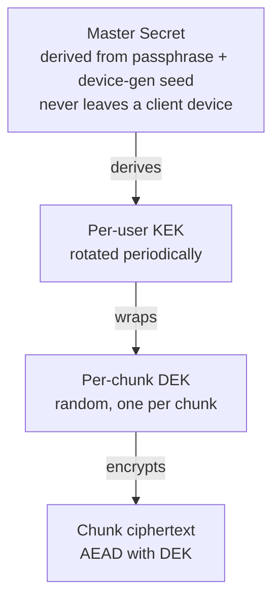
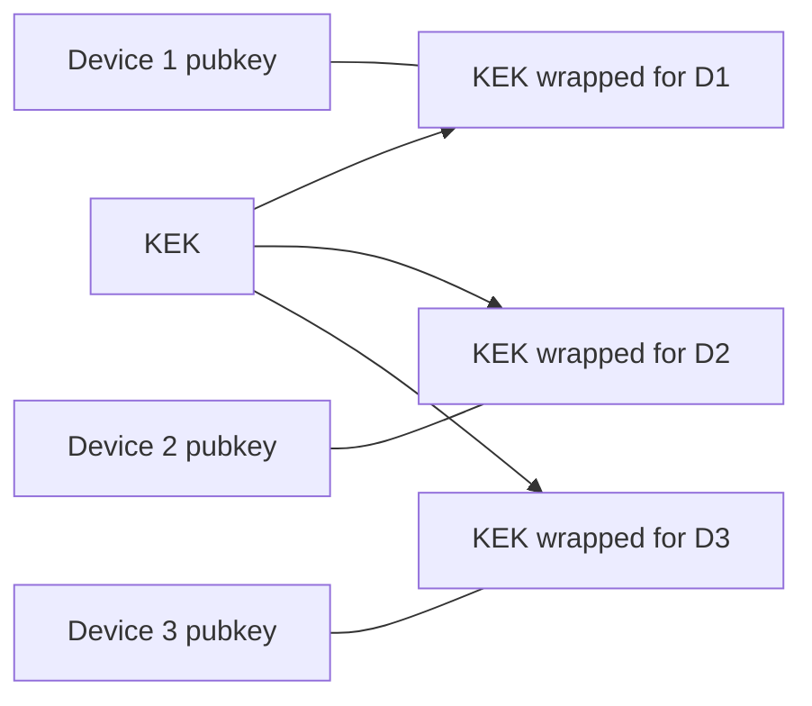

# End-to-End Encryption Model

> Referenced from [`plans/2026-04-23.md`](plans/2026-04-23.md) D-1 / D-3 / D-9.

## Goal

The server must be able to do its job (store blobs, serve reads to authorized
clients, track retention) while never holding a key that decrypts anything,
and never seeing plaintext at rest or in transit.

## Envelope encryption layout

Three key layers, each wrapping the one below it.

- **Master Secret (MS)** — derived from a user passphrase via a memory-hard
  KDF (Argon2id with conservative parameters that still fit the device),
  combined with a device-generated random seed for extra entropy.
- **Key Encryption Key (KEK)** — per-user symmetric key derived from MS.
  Rotated periodically (see rotation below). Server stores it only wrapped.
- **Data Encryption Key (DEK)** — random 256-bit key, one per chunk. Wrapped
  with the KEK and stored alongside the chunk reference in the encrypted
  manifest.

Why three layers and not two:

- Having a KEK layer means rotating encryption keys doesn't require
  re-encrypting all data — only rewrapping DEKs.
- Having per-chunk DEKs means compromise of one DEK compromises only one
  chunk, not the whole library. Matters more for future-proofing than for
  today's threat model.

## AEAD choice

**XChaCha20-Poly1305.** Chosen over AES-GCM because:

- 192-bit nonces — safe to use random nonces per chunk (2^96 nonces before
  birthday collision risk, vs AES-GCM's 2^32 safe limit that makes
  random-nonce schemes fragile).
- Constant-time software implementation on ARM without AES hardware
  acceleration.
- Widely audited; used by WireGuard, libsodium.

## Per-device key wrapping (multi-device)

The KEK is the shared user secret. To let N devices read the same data, each
device gets its own wrapping of the KEK:

- Each device has an X25519 keypair (private key stays on device, public key
  registered with the account).
- The server stores one wrapped-KEK record per device.
- Enrolling a new device = an existing device decrypts KEK, re-wraps for the
  new device's pubkey, uploads the new wrapped record (see
  [`multi-device.md`](multi-device.md)).
- Revoking a device = delete that device's wrapped-KEK record and rotate the
  KEK. Old blobs stay encrypted under the old KEK; new blobs use the new one.
  Forward secrecy after rotation.

## What the server sees

| Item | Visibility |
|---|---|
| Chunk ciphertext | Ciphertext only |
| Chunk content hash (ciphertext hash) | Plaintext (opaque to server) |
| File paths, names, folder tree | Encrypted in manifest (ciphertext) |
| File sizes, chunk boundaries | Plaintext (inferred from stored blob sizes) |
| Snapshot timestamps | Plaintext (needed for retention policy) |
| Wrapped KEKs, wrapped DEKs | Ciphertext |
| Device public keys | Plaintext |
| User email (account identity) | Plaintext |

Decision D-9: file names, paths, and timestamps **inside** the snapshot
manifest are encrypted. The server only needs the manifest's opaque hash, the
user ID, and the snapshot's ingest time for retention.

## Recovery model (H-4 resolution)

**Recovery phrase (BIP39-style, 24 words).** Generated on first device setup,
shown to the user once, treated as the root entropy.

- If all devices are lost, the user enters the recovery phrase on a new device
  to regenerate MS → KEK → all wrapped DEKs become decryptable.
- Server-side escrow is explicitly rejected — it would give the operator a
  theoretical path to user data.
- Social recovery (splitting the phrase via Shamir among trusted contacts) is
  an optional add-on the UI can implement on top of the phrase; it's not part
  of the core protocol.

Cost of this model: if the user loses all devices *and* loses the recovery
phrase, their data is gone. This is the honest price of zero-knowledge.

## KEK rotation

Triggered by:

- Device revocation (forced).
- Scheduled rotation (e.g., every 12 months) as hygiene.
- User request (e.g., after suspected passphrase exposure).

Procedure:

1. Current device generates KEK' (new).
2. For each existing wrapped DEK, unwrap with KEK, rewrap with KEK'.
3. Bulk-upload the re-wrapped DEKs. This is metadata-only — chunks are not
   re-encrypted.
4. Rewrap KEK' for each still-enrolled device's pubkey.
5. Delete all old wrapped-KEK records.

Cost is roughly proportional to the number of chunks (metadata), not data
volume. For a 50 GB user library with ~1 MB chunks, that's ~50K DEK rewraps:
seconds, not hours.

## What this design does *not* protect against

- Endpoint compromise of an authorized device — that device can by definition
  read data. Mitigated outside the backup system (OS security, device PIN).
- A malicious server operator *deleting* data. Confidentiality is protected;
  availability is not. Mitigation is redundancy at the object-storage layer
  and a verifiable snapshot hash chain the client can audit.
- Traffic analysis (timing, sizes). Acknowledged in the plan's accepted
  trade-offs.

## Industry variants considered

Consumer backup has a spectrum of trust models. The honest comparison:

| Model | Used by | Server can read plaintext? | Recovery | Why not for us |
|---|---|---|---|---|
| **TLS + server-side encryption at rest** | Dropbox, Google Drive, OneDrive (default), iCloud (default, most categories) | Yes | Easy (server holds key) | Fails zero-knowledge requirement. |
| **Client-side encryption, server-escrowed key (HSM)** | iCloud Standard Data Protection, many enterprise backup tools | Via HSM, not normal ops | Smooth | A compelled operator can still decrypt. Not strict zero-knowledge. |
| **E2E envelope encryption, user-held recovery phrase** (our pick) | iCloud Advanced Data Protection (opt-in), Tresorit, Cryptomator, ProtonDrive, Tarsnap, Arq | No | Recovery phrase; losing it = data lost | Honest zero-knowledge. Cost is user-visible recovery complexity. |
| **Convergent encryption** | Some early Dropbox, academic | No — but plaintext *equality* leaks | Same as above | Breaks our threat model for popular/known files. |
| **Multi-party / threshold encryption** | Research systems, some blockchain-adjacent backup | No | Split among trusted third parties | Over-engineered for single-user consumer device. |

**Pick: E2E envelope encryption with user-held recovery phrase.** Same model
iCloud ADP, Tresorit, and Cryptomator converged on. It's the only option
that is both honestly zero-knowledge and usable across multiple user devices.

### Building block picks

| Block | Options (used by) | Our pick | Why |
|---|---|---|---|
| **KDF** | PBKDF2 (legacy), scrypt (LastPass), Argon2id (1Password, Bitwarden, modern WhatsApp backup) | Argon2id | Current OWASP recommendation; memory-hard; ships in libsodium. |
| **AEAD** | AES-GCM (widespread, nonce hazards with random nonces), AES-GCM-SIV (misuse-resistant, hardware-AES dependent for speed), XChaCha20-Poly1305 (WireGuard, libsodium, Signal) | XChaCha20-Poly1305 | Safe with random nonces, constant-time in software on ARM without AES hardware. |
| **Per-device key distribution** | Shared passphrase (legacy), Signal Double Ratchet per pair, X25519 re-wrap per device (iCloud Keychain, Keybase, Matrix cross-signing), TEE-backed (iOS Secure Enclave) | X25519 re-wrap | Matches the actual use case (static data, multiple readers); overkill-free; portable across device classes. |
