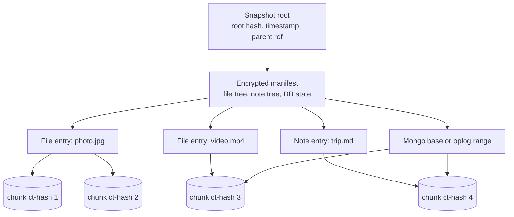
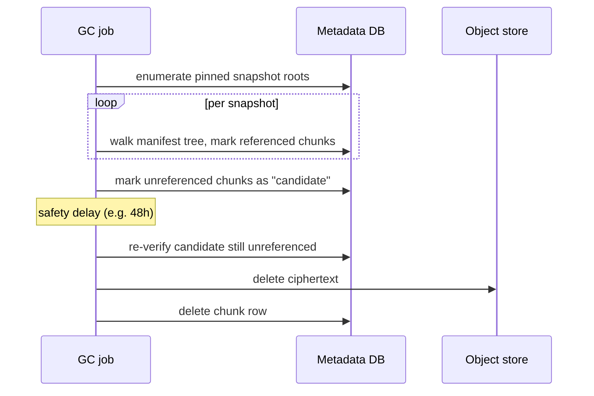

# Versioning & Retention

> Referenced from [`plans/2026-04-23.md`](plans/2026-04-23.md) D-4 / D-8.
>
> Assumes familiarity with Merkle trees — if that term is new, read
> [`../../merkle-trees-guide.md`](../../merkle-trees-guide.md) first.
> One-paragraph summary: a Merkle tree hashes pairs of hashes
> recursively up to a single ~32-byte root that commits to every
> leaf; any change anywhere re-hashes the root; unchanged subtrees
> produce the same subtree hash (so they dedup).

## Mental model

There is exactly one data structure that expresses everything: an **immutable
snapshot**. A snapshot is a Merkle tree whose leaves are (ciphertext-hash of
chunk, wrapped DEK) pairs and whose internal nodes are encrypted manifests
describing the file/folder/DB structure.

Every primitive the product exposes is a derivation of "which snapshots
exist":

- **Current state** = the most recent snapshot.
- **Time-travel** = pick any snapshot by time and read it.
- **Trash / undelete** = a previous snapshot still has the deleted file.
- **Retention** = rules that decide which snapshots stay pinned.
- **Garbage collection** = any chunk not reachable from any pinned snapshot
  is deletable.

This is the restic/borg model. The value is that features compose instead of
each having its own code path.

## Snapshot structure



Key properties:

- Each snapshot references the previous one by hash (parent pointer), forming
  a hash chain the client can audit to detect server-side tampering.
- Chunks are shared freely across snapshots — the whole point of content
  addressing.
- The manifest is encrypted; the server stores it as a blob like any other
  chunk.

## Metadata DB schema

The server-side metadata DB is a managed relational DB (Postgres-class).
It sees only **ciphertext and references** — no plaintext user data,
no file names, no DB schemas. Its tables:

```sql
-- Accounts & devices (control plane)
CREATE TABLE users (
  user_id          UUID PRIMARY KEY,
  created_at       TIMESTAMPTZ NOT NULL,
  retention_policy JSONB NOT NULL,        -- grandfather-father-son rules
  quota_bytes      BIGINT NOT NULL
);

CREATE TABLE devices (
  device_id     UUID PRIMARY KEY,
  user_id       UUID NOT NULL REFERENCES users,
  device_pubkey BYTEA NOT NULL,           -- X25519
  wrapped_kek   BYTEA NOT NULL,           -- KEK wrapped to this device's pubkey
  paired_at     TIMESTAMPTZ NOT NULL,
  last_seen_at  TIMESTAMPTZ,
  revoked_at    TIMESTAMPTZ
);

-- Chunk existence (dedup index + GC tracking)
CREATE TABLE chunks (
  user_id    UUID NOT NULL,
  ct_hash    BYTEA NOT NULL,              -- ciphertext content address
  size       INTEGER NOT NULL,
  tier       TEXT NOT NULL,               -- 'standard' | 'ia' | 'cold'
  created_at TIMESTAMPTZ NOT NULL,
  gc_state   TEXT NOT NULL DEFAULT 'live', -- 'live' | 'candidate' | 'deleted'
  PRIMARY KEY (user_id, ct_hash)
);
-- `HEAD /chunks/{ct-hash}` is a single PK lookup on (user_id, ct_hash).

-- Snapshots (one row per successful POST /snapshots)
CREATE TABLE snapshots (
  snapshot_id       BYTEA PRIMARY KEY,    -- Merkle root hash, client-computed
  user_id           UUID NOT NULL REFERENCES users,
  device_id         UUID NOT NULL REFERENCES devices,
  parent_snapshot_id BYTEA,               -- prior snapshot for this resource group
  resource_group    TEXT NOT NULL,        -- opaque app identifier
  manifest_ct_hash  BYTEA NOT NULL,       -- points to encrypted manifest chunk
  fence_watermark   BIGINT NOT NULL,      -- see databases.md §fence
  committed_at      TIMESTAMPTZ NOT NULL,
  pinned            BOOLEAN NOT NULL DEFAULT TRUE  -- set by retention
);

-- Snapshot → chunks edges (one row per referenced chunk, used by GC)
CREATE TABLE chunk_refs (
  user_id     UUID NOT NULL,
  snapshot_id BYTEA NOT NULL REFERENCES snapshots,
  ct_hash     BYTEA NOT NULL,
  PRIMARY KEY (user_id, snapshot_id, ct_hash)
);
```

Three things worth calling out:

- **Manifests live in object storage, not the DB.** An encrypted
  manifest is just another content-addressed ciphertext chunk. The
  metadata DB only stores its `ct_hash` pointer via
  `snapshots.manifest_ct_hash`. This keeps the DB small — hot rows
  only — and lets manifests ride the exact same lifecycle as file
  chunks (same tiering, same GC, same dedup for unchanged subtrees).
- **`chunks.user_id` is part of the primary key** — per-user dedup
  only; the same ciphertext for two users is stored twice. This is
  the zero-knowledge-enforced price (see
  [`pipeline-04-encryption.md`](pipeline-04-encryption.md) §Per-user
  dedup).
- **Append-only for data rows.** `snapshots` and `chunk_refs` rows
  are written once and never updated (except `chunks.gc_state` and
  `snapshots.pinned`, which are GC / retention mutations). Server
  can never rewrite a historical snapshot — the Merkle root hash
  would change, which the client can detect.

## From walker events to stored rows

A walker event ([`pipeline-02-file-capture.md`](pipeline-02-file-capture.md#event-delivery))
is not itself a row in any database. It's an in-memory hand-off.
Events become **durable** at the snapshot commit boundary, at which
point they land as a combination of new rows in the metadata DB and
new entries inside the encrypted manifest blob.

### What the encrypted manifest holds (client view)

The manifest is a client-built, client-encrypted data structure. The
server never sees its plaintext. Its internal shape per resource
group:

```text
Manifest {
  resource_group_id  -- opaque app identifier (still hashed, not name)
  parent_manifest    -- ct_hash of the prior snapshot's manifest
  fence_watermark    -- cross-system consistency marker
  entries: [
    FileEntry  { path, size, mtime, mode, chunk_roots: [ct_hash, ...] }
    FileEntry  { ... }
    Tombstone  { path, deleted_at }
    DBEntry    { kind='mongo'|'sqlite', base_chunks, changelog_chunks, fence }
    ...
  ]
}
```

The entry list is a Merkle tree internally (subtree hashes per
directory), so unchanged directories share sub-manifests with the
previous snapshot — the same dedup property files enjoy, applied to
the manifest itself. Large libraries where only a few photos changed
produce a tiny manifest delta.

### Event → storage translation

Each walker event type maps to specific writes at commit time. Assume
the commit coalesces N events into one snapshot.

| Walker event | New rows in metadata DB | Entry in encrypted manifest |
|---|---|---|
| `NEW` (path P, K new chunks) | 0–K rows in `chunks` (only for ct-hashes this user didn't already have) | `FileEntry { path=P, size, mtime, mode, chunk_roots=[...] }` |
| `CHANGED` (path P, K' new chunks after CDC) | 0–K' rows in `chunks` (typically far fewer than total file chunks — CDC dedup) | `FileEntry` replaces the previous `FileEntry` for P in the new manifest |
| `DELETED` (path P) | 0 new `chunks` rows | `Tombstone { path=P, deleted_at }` instead of a `FileEntry` |

Then, once per commit, regardless of how many events it coalesces:

- **1 row in `snapshots`** — the new snapshot root hash, parent ref,
  fence, manifest `ct_hash`.
- **M rows in `chunk_refs`** — one per distinct `ct_hash` the new
  snapshot's manifest transitively references (files + DBs +
  sub-manifests). Most are shared with the parent snapshot via dedup.
- **1 new chunk row** for the encrypted manifest itself (if its
  content differs from the parent's — which it always does if at
  least one event is in the commit).

### Worked example: one photo added, one renamed, one deleted

User adds `A.jpg`, renames `B.jpg` → `B2.jpg`, deletes `C.jpg`. All
during a 5-minute batching window. On commit:

1. Walker has emitted four events: `NEW A.jpg`, `DELETED B.jpg`,
   `NEW B2.jpg`, `DELETED C.jpg`.
2. Chunker produced chunks for A and B2. Because B2 has the same
   bytes as B, its CDC chunks hash identically to B's — the server
   already has those ct-hashes. Only A's chunks are new.
3. At commit:
   - `chunks` gets K new rows (one per A's unique ct-hash).
   - The encrypted manifest is rebuilt: the `FileEntry` for `A.jpg`
     is added; `FileEntry` for `B.jpg` is removed; `FileEntry` for
     `B2.jpg` is added (reusing B's ct-hashes); `Tombstone` for
     `C.jpg` is recorded.
   - The new manifest ciphertext is uploaded as a chunk; `chunks`
     gets one row for the new manifest ct-hash.
   - `snapshots` gets one new row.
   - `chunk_refs` gets rows for every ct-hash reachable from the new
     manifest — mostly shared with the previous snapshot's
     `chunk_refs`, plus the K new ones for A and the one for the new
     manifest.

Wire cost: ~K chunks (A's content) plus one small manifest delta.
Rename costs zero new content thanks to ct-hash matching. Delete
costs zero content, just a tombstone.

### Immutability and auditability

Once `snapshots.snapshot_id` is written, nothing about that snapshot
ever changes in a way that affects its identity. `snapshot_id` is
the Merkle root of the manifest; any mutation would re-hash. The
server cannot rewrite history without the client detecting it on
the next parent-chain walk.

Mutable fields on existing rows are limited to:

- `chunks.gc_state` / `chunks.tier` — GC and lifecycle transitions.
- `snapshots.pinned` — retention evaluator flips this; the content
  the snapshot refers to is unaffected.
- `devices.revoked_at` — device revocation.

Nothing the user authored is ever rewritten by the server.

## Snapshot cadence

The device doesn't snapshot per file. It snapshots per **commit**, where a
commit is issued by the agent when:

- A configurable batching window elapses (e.g., 5 minutes) and there are new
  chunks uploaded, **or**
- A significant bulk event closes (a large video fully ingested, a Mongo
  oplog segment crosses a threshold), **or**
- The agent shuts down cleanly.

Coalescing keeps the metadata DB small. For a 10K-user product, per-file
snapshots would bloat to billions of rows; per-commit snapshots at a 5-minute
cadence are hundreds per user per day at most — typically far fewer.

## Retention policy

The user configures retention as a small set of rules. Defaults:

| Tier | Rule |
|---|---|
| Fresh | Keep every snapshot for the last 7 days |
| Daily | Keep one snapshot per day for the last 90 days |
| Weekly | Keep one snapshot per week for the last year |
| Monthly | Keep one snapshot per month forever |
| Trash | Items deleted by the user stay restorable for 30 days via a hidden "trash" snapshot branch |

These rules are evaluated periodically by a background job. The result is a
set of **pinned snapshot IDs**. Every other snapshot is unpinned and eligible
for deletion.

This is a deliberately simple "grandfather-father-son" scheme. It's what
restic/borg/Time Machine all converge on because it balances "enough history
to recover mistakes" against "storage cost doesn't explode."

## Garbage collection

GC is a classic mark-and-sweep over chunk references.



The **safety delay** exists because a new snapshot commit might reference an
"unreferenced" chunk between the mark and sweep phases. If the chunk gets
re-referenced during the delay, it moves back to live. Deleting too eagerly
would corrupt the new snapshot.

GC is per-user and runs concurrently; one user's GC never blocks another's
writes. It can be implemented as a periodic job (daily) rather than
real-time — there's no correctness need for promptness, only cost pressure.

## Storage tiering (D-8)

A chunk's tier is a function of the age of the newest snapshot that
references it:

| Age of newest referencing snapshot | Tier | Retrieval time |
|---|---|---|
| < 30 days | Standard | ms |
| 30–365 days | Infrequent-access | seconds |
| > 365 days, or trash-only reference | Cold archive | minutes to hours |

Tier transitions happen via a lifecycle policy on the object store, not
custom code. Restore from cold-tiered snapshots shows a UI hint that it will
take longer — matches user expectation for "I'm restoring a five-year-old
photo."

## Restore semantics the model gives for free

- **Full restore as of time T** = pick the latest snapshot ≤ T; hydrate every
  chunk.
- **Restore one file as of time T** = same snapshot; hydrate just that file's
  chunks.
- **Undelete a file deleted yesterday** = look at the previous snapshot,
  copy its entry for that file back into the current state.
- **Roll back DB to time T** = restore DB base + replay encrypted oplog up to
  T. See [`databases.md`](databases.md).

No per-feature code paths: each is a read against the snapshot tree.

## Non-obvious edge case

When a user empties their trash (force-delete), the product wants that file
*gone*. But previous snapshots still reference its chunks. The right model:

- Force-delete evicts the file from the *current* snapshot only. Chunks
  remain until all snapshots that reference them age out under retention.
- The UI should surface this honestly: "This file will be fully removed in
  up to N days when the last backup copy expires." Pretending otherwise is
  either lying or requires breaking immutability of snapshots, which breaks
  everything else in the model.

## Industry variants considered

| Model | Used by | Strength | Why not for us |
|---|---|---|---|
| **Per-file version chain** | Dropbox, Google Drive, OneDrive, S3 Object Versioning | Simple mental model, easy per-file restore | No storage sharing across files; no "repo" concept; hard to express cross-file point-in-time consistency (e.g., blob + DB atomicity). |
| **Filesystem snapshots (block-level COW)** | ZFS, Btrfs, APFS/Time Machine (modern) | Extremely cheap snapshots, fast restore, kernel-native | Tied to the filesystem; doesn't work uniformly across user files + MongoDB + SQLite data dirs; not portable across restore targets. |
| **Incremental archive chains** (tar-based) | Duplicity, classic `rsnapshot`, Amanda | Well-understood, simple | Chain-break recovery is painful; limited dedup; PIT restore means replaying a chain. |
| **Content-addressed repo snapshots (Merkle)** (our pick) | restic, borgbackup, bup, duplicacy, Kopia, Tarsnap | Time-travel + dedup + retention collapse into one primitive; each snapshot is immutable and verifiable; GC is a graph traversal | Nothing relevant. State-of-the-art open-source answer. |
| **Event-sourced replay** | CouchDB-style, event-sourcing systems | Perfect granularity, natural audit log | Storage grows linearly with events; rebuild is O(history). Wrong tool for binary-heavy backup. |

**Pick: content-addressed repo snapshots.** Every successful open-source
dedup backup tool converged here (restic, borg, bup, duplicacy, Kopia).
Time Machine historically used hardlink trees that approximate the same
idea; modern macOS uses APFS snapshots, which is a filesystem-specific
version of the same Merkle-snapshot concept.

### Retention policy

Grandfather-father-son is universal: restic, borg, Arq, Backblaze, Time
Machine all express retention identically (keep-last N, keep-daily,
keep-weekly, keep-monthly, keep-yearly). No meaningful industry
variation here.

### Storage tiering

| Approach | Used by | Notes |
|---|---|---|
| **Object-store native lifecycle** (our pick: S3 Intelligent-Tiering / GCS Autoclass) | Most modern SaaS backup products | Hands-off; store moves chunks between hot/IA/archive based on access patterns |
| **Custom tier management** | Early restic backends, self-hosted | More control, more code to maintain |
| **Always-hot single tier** | Some premium consumer tiers | Predictable latency, higher cost |

Lifecycle policies are free operationally and match backup access patterns
(recent hot, old cold) better than anything hand-coded.
