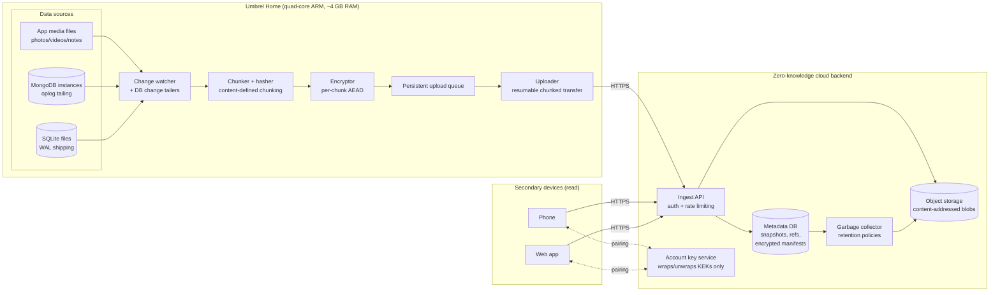
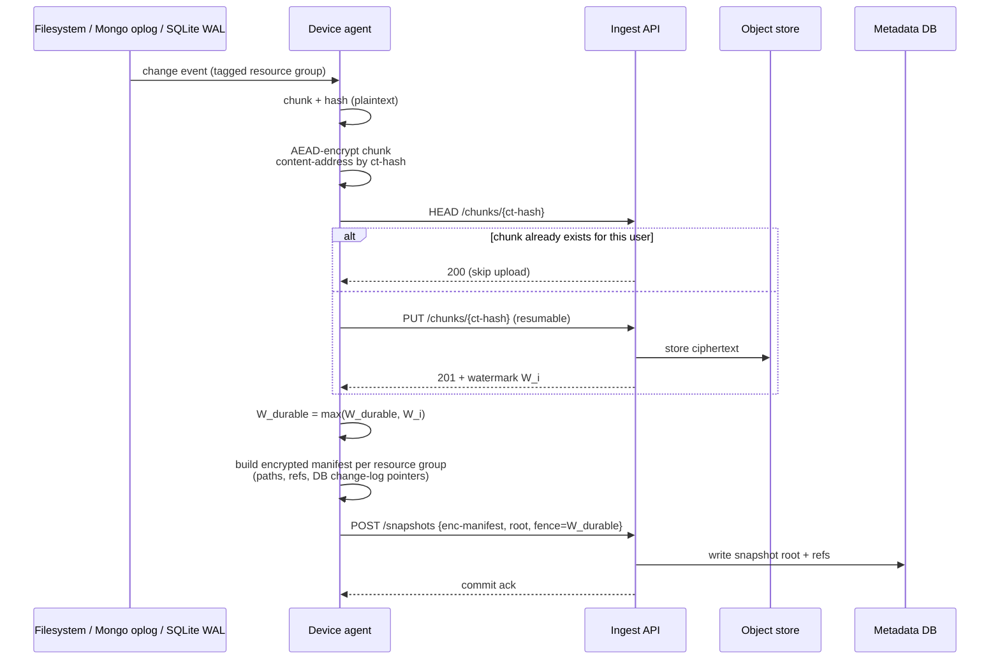
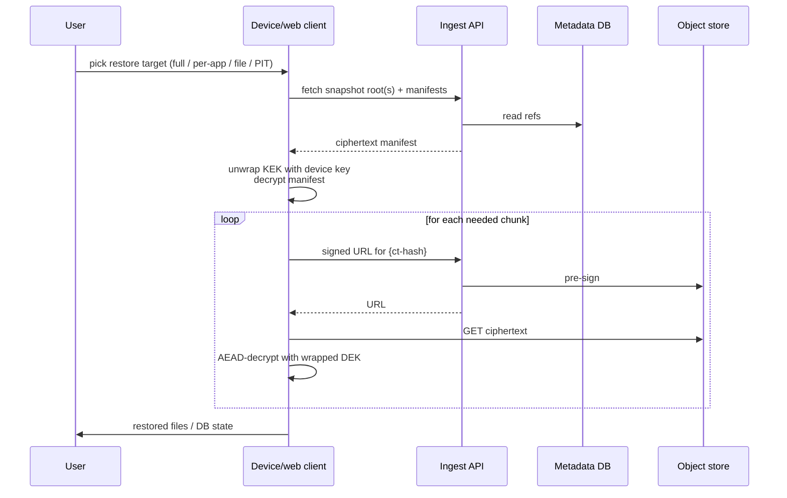

# System Design — Umbrel Home Backup & Restore

> Date: 2026-04-23
> Requirements: [`../requirements.md`](../requirements.md)

## Overview

End-to-end encrypted backup and restore for an [Umbrel Home](https://umbrel.com/umbrel-home)
personal server that stores photos, videos, notes, and a mix of embedded
databases — **MongoDB** (used by apps like Rocket.Chat) and **SQLite** (the
default for most lightweight Umbrel apps: Memos, Vaultwarden, Uptime Kuma,
etc.). Backups flow to a cloud backend built on IaaS object storage and
managed databases. Secondary devices (phone, laptop, web) can read the user's
data without the server ever handling plaintext.

The design combines three ideas that are individually well-understood but
interesting when composed under the E2E constraint on a device running a
zoo of third-party apps:

1. **Content-addressed, chunk-dedup storage** (restic/borg-style) so the
   device uploads near-minimum bytes across a mixed workload of media and
   DB change logs.
2. **Envelope encryption with per-device key wrapping** so many devices can
   read the same user's data without ever giving the server a plaintext key.
3. **Unified versioning** expressed as immutable snapshots whose identity is
   a Merkle root over chunk content, so time-travel and retention are natural
   consequences of the storage model, not bolted-on features.

The backup agent itself runs as a containerized service on the host
personal-server OS, reading other apps' data directories through that OS's
app-data convention — no cooperation from individual app authors required.
This pattern works uniformly across the device class (UmbrelOS, CasaOS,
Yunohost, Runtipi, etc.).

## High-level architecture

## Key architectural decisions

Each row below is a pick among real industry options. The supporting doc for
each row lays out the variants side-by-side (restic, Dropbox, iCloud,
Litestream, etc.) and explains why this is the best-of-breed for the
constraints in `requirements.md`. Umbrel Home is the *reference device* for
discussion, not a constraint on the solution space.

| # | Decision | Resolution | Why |
|---|---|---|---|
| D-1 | Encryption model | Envelope encryption: per-file DEK, wrapped by per-user KEK, wrapped per-device. Master secret never leaves client. See [`encryption.md`](../encryption.md). | Gives zero-knowledge while still allowing multi-device and revocation. |
| D-2 | Chunking | Content-defined chunking (FastCDC, ~1 MB avg) for media, Mongo oplog, and SQLite WAL streams; whole-file for tiny files (< 256 KB). See [`chunking-dedup.md`](../chunking-dedup.md) and the standalone [`../../cdc-guide.md`](../../cdc-guide.md). | CDC handles insertions well; DB change streams look like growing files, which CDC excels at. |
| D-3 | Dedup scope | Per-user only. No cross-user (convergent) dedup. See [`encryption.md`](../encryption.md). | Cross-user dedup leaks plaintext equality — incompatible with zero-knowledge. |
| D-4 | Versioning | Immutable snapshots referencing a Merkle tree of encrypted chunks. Retention as pinned snapshot set; GC removes unreferenced chunks. See [`versioning-retention.md`](../versioning-retention.md). | Time-travel, trash, and retention collapse into one primitive. |
| D-5 | Transport | HTTPS with resumable chunked uploads. See [`sync-protocol.md`](../sync-protocol.md). | Constrained-device friendly, interops with standard infra. |
| D-6 | Local DB backup | **MongoDB:** oplog tailing + periodic base snapshots. **SQLite:** Litestream-style WAL shipping + periodic `VACUUM INTO` base snapshots. Both fenced with a shared blob-ingest watermark for cross-system PIT consistency. See [`local-databases-backup.md`](../local-databases-backup.md). | Near-zero RPO for both DB families; each rides the same chunk pipeline; restore = base + change-log replay. |
| D-7 | Multi-device access | Device pairing transfers wrapped KEK over a short-lived, out-of-band channel. Server only ever sees ciphertext KEKs. See [`multi-device-access.md`](../multi-device-access.md). | Preserves E2E while allowing phone/web clients. |
| D-8 | Storage tiering | Recent chunks in standard object storage; older snapshots migrate to infrequent-access, then cold archive via lifecycle policy. | Matches access pattern (recent restores common); linear cost. |
| D-9 | Metadata encryption | File names, paths, folder structure, timestamps are encrypted client-side inside snapshot manifests. Server sees only opaque ct-hash chunk IDs. | Minimizes metadata leakage. Residual leaks (sizes, chunk counts, timing) are acknowledged, not "solved". |
| D-10 | Per-app isolation | Each Umbrel app is backed up as a distinct *resource group* inside the snapshot: its data directory, its DBs (any mix of Mongo/SQLite), and metadata. Restore is per-app-possible. See [`local-databases-backup.md`](../local-databases-backup.md). | Keeps blast radius small when one app misbehaves. Enables partial restore workflows. |

## Component responsibilities

### Device-side agent (containerized service on the host OS)

The agent is one process with a small memory footprint and bounded
backpressure, split into cooperating components:

- **Change watcher** — observes app-data directories for filesystem changes
  (photos/videos/note files). Spawns:
  - **Mongo oplog tailer** — one per Mongo instance, follows `oplog.rs`.
  - **SQLite WAL shipper** — one per SQLite file, observes WAL frames and
    periodic `VACUUM INTO` base snapshots.

  All sources emit an ordered stream of change events tagged with their
  **resource group** (which app they belong to).
- **Chunker + hasher** — applies FastCDC to binary files and to DB change
  streams; whole-file for small files. Produces `(plaintext chunk, plaintext
  hash)` pairs.
- **Encryptor** — derives per-chunk DEK, AEAD-encrypts the chunk, records
  `(ciphertext, ct-hash, wrapped DEK)`. Caches locally so re-encountered
  plaintext is a no-op.
- **Persistent upload queue** — durable queue of pending chunk uploads and
  pending snapshot commits, per resource group. Survives reboot. Applies
  policy (quiet hours, disk guardrails).
- **Uploader** — concurrent resumable uploads to the ingest API. Emits a
  **snapshot commit** once all chunks for a new snapshot have been
  acknowledged.

### Cloud backend

- **Ingest API** — thin, stateless. Authenticates the device, enforces
  per-user rate and quota limits, writes ciphertext to object storage,
  updates metadata DB. Does no cryptography on user data.
- **Metadata DB** — stores: snapshot roots, encrypted manifests (per resource
  group), chunk-to-snapshot references, retention policies, device
  registrations, wrapped KEKs. All user-authored text is ciphertext.
- **Object storage** — content-addressed blob store keyed by ct-hash.
  Immutable once written. Served to clients via signed URLs on restore.
- **Account key service** — holds only **wrapped** key material. Cannot
  decrypt anything itself.
- **Garbage collector** — walks snapshot roots under each user's retention
  policy, marks chunks reachable from live snapshots, deletes the rest after
  a safety delay.

## Backup data flow

Two things worth calling out:

- `HEAD /chunks/{ct-hash}` lets the device skip re-uploading a chunk it
  previously sent — the server's "yes I have that" response is the dedup
  mechanism. Under **per-user** scope, the server only accepts a HEAD hit as
  a skip if the user has uploaded that chunk before.
- The **snapshot commit** is the atomicity boundary. Until it lands, the new
  state is invisible to any reader. The snapshot's `fence=W_durable` is what
  ties DB replay to blob durability (see next section).

## Restore data flow

For DB restore specifically — applied independently per app:

- **MongoDB:** restore latest base dump + replay encrypted oplog up to the
  snapshot's fence.
- **SQLite:** restore latest base file + apply shipped WAL frames up to the
  snapshot's fence.

Details in [`local-databases-backup.md`](../local-databases-backup.md).

## Cross-system point-in-time consistency

The trick with backing up blobs + live databases is avoiding a restored
state where, e.g., a Memos note row references an image chunk that wasn't
included in the same backup window, or a Rocket.Chat message references a
missing attachment.

Approach (detail in [`local-databases-backup.md`](../local-databases-backup.md)):

- Every blob upload is tagged with a monotonic **ingest watermark** `W_i`
  issued by the server.
- The device agent keeps `W_durable` = max watermark it has seen ack'd.
- Each DB-change-log uploader **embeds the current `W_durable`** into the
  change stream: a fence doc in the Mongo oplog, a fence pragma-comment in
  the SQLite WAL stream.
- On restore, DB replay advances only up to a fence whose `W` matches a
  fully-restored blob set. By construction, every DB-side reference points
  at a blob that was also restored.

The same fence mechanism works for both DB types — the "how we inject the
fence" differs, but the invariant is identical.

## Trade-offs explicitly accepted

- **No cross-user dedup.** Storage cost for duplicates across users is the
  honest price of zero-knowledge.
- **Metadata leakage.** Sizes, chunk counts per resource group, and upload
  timing leak activity patterns. Padding and upload jitter are out of scope
  mitigations.
- **Snapshot commit is the atomicity boundary.** Partially uploaded
  snapshots are invisible; crash recovery resumes from the durable queue.
- **Server operator can destroy data but not read it.** Availability
  defended by object-storage redundancy and an auditable snapshot hash
  chain, not encryption.
- **Per-user dedup is still useful.** Same photo imported twice, or a
  SQLite base snapshot sharing pages with the previous one, dedup
  internally. Real wins, honest boundaries.
- **Agent shares the device with user apps.** Resource budget is bounded
  (RAM ceiling, CPU niceness) so a heavy backup pass doesn't stall Immich's
  upload or Vaultwarden's API. Users would notice either way.

## Supporting docs

- [`chunking-dedup.md`](../chunking-dedup.md) — CDC algorithm, hash sizing,
  dedup scope, the skip-upload protocol.
- [`../../cdc-guide.md`](../../cdc-guide.md) — standalone deep dive on CDC:
  Rabin / Buzhash / FastCDC algorithms, worked byte-level example,
  per-data-type chunking (photos, videos, Mongo oplog, SQLite WAL),
  streaming, resumability, ARM throughput.
- [`encryption.md`](../encryption.md) — envelope encryption layout, key
  wrapping, recovery model, why no convergent encryption.
- [`versioning-retention.md`](../versioning-retention.md) — snapshot Merkle
  tree, retention policy as a pinned-snapshot set, GC protocol.
- [`sync-protocol.md`](../sync-protocol.md) — resumable chunked upload,
  back-pressure, device-policy gates.
- [`multi-device-access.md`](../multi-device-access.md) — pairing flow, web
  client constraints, revocation.
- [`local-databases-backup.md`](../local-databases-backup.md) — unified
  MongoDB + SQLite backup pipeline, fence watermark, per-app restore
  protocol.
