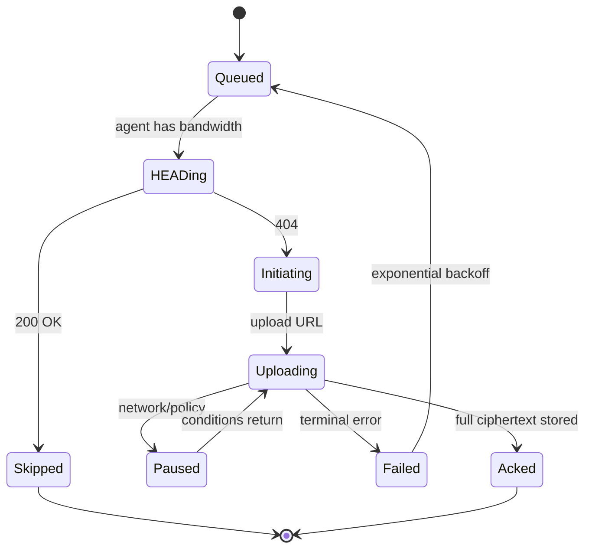

# Sync Protocol

> Referenced from [`plans/2026-04-23.md`](plans/2026-04-23.md) D-5.

## Scope

The wire protocol between the device agent and the ingest API, plus the
device-side policy that decides when to push. Restore traffic uses the same
primitives in reverse and isn't re-described here.

## Transport

**HTTPS/1.1 with resumable chunked uploads**, modeled on tus.io's resumable
upload semantics.

Why not something custom (QUIC/gRPC streaming):

- HTTPS/1.1 interoperates with every standard load balancer, WAF, and
  object-storage signed-URL mechanism without custom infrastructure.
- Resumability can be built cleanly on top with range semantics.
- The efficiency gap vs. a streaming protocol is small at chunk sizes of
  ~1 MB; the operational simplicity win is large.
- HTTP/2 or HTTP/3 at the load balancer is transparent; the application
  protocol doesn't need to change.

## Endpoints (logical)

| Endpoint | Purpose |
|---|---|
| `HEAD /chunks/{ct-hash}` | "Do I already have this chunk?" — enables skip-upload. |
| `POST /chunks` | Initiate a resumable upload; returns an upload URL. |
| `PATCH /chunks/{upload-id}` | Append bytes at a given offset; can retry. |
| `POST /snapshots` | Atomic snapshot commit referencing already-uploaded chunks and an encrypted manifest. |
| `GET /snapshots` | List snapshots (metadata only). |
| `GET /chunks/{ct-hash}/url` | Short-lived signed URL for direct download from object storage. |

All endpoints are under `/v1` for versioning. Authentication is a per-device
token (short-lived, bound to device pubkey) obtained from the account key
service during pairing.

## Upload state machine

Every transition is persisted to the device's durable queue so a reboot mid-
upload resumes at the last acked offset, not from zero.

## Back-pressure

The uploader runs with bounded concurrency (e.g., 4 concurrent chunk uploads)
and a bounded in-memory buffer (e.g., max 32 MB of chunks staged). When full,
the chunker blocks. When the chunker blocks, the change watcher buffers in
its own bounded event queue. When that queue fills, watcher events spill to
a disk-backed overflow.

The effect: the device never commits unbounded memory to backup work, no
matter how much new content appears. Upload latency grows gracefully under
backlog instead of the agent crashing.

## Device policy

The agent reads a policy block (user-configurable) that gates when uploads
are allowed:

| Policy | Default | Effect |
|---|---|---|
| Network class | Wi-Fi/Ethernet only | Don't upload over metered mobile tethering |
| Quiet hours | off | Pause uploads between configured hours |
| Disk headroom | 2 GB free | Pause encrypt/chunk work if local free space drops below threshold (avoid filling the device) |
| Thermal gate | enabled | Back off if `/sys/class/thermal` reports critical |
| Battery gate (if applicable) | pause below 20%, charging-only | N/A for always-powered RPi but part of the same policy block |

Policy is consulted per-chunk, not per-upload-session, so changes (e.g., user
starts a Zoom call and wants bandwidth back) take effect immediately via the
back-pressure pause.

## Rate limiting (server side)

The ingest API enforces:

- Per-device request rate (e.g., N requests/minute) — protects against runaway
  clients.
- Per-user upload byte rate (e.g., X MB/s rolling) — prevents one user from
  starving others on a shared backend.
- Per-user storage quota — rejects new chunk uploads once quota is exceeded.

Limits are returned as `429 Too Many Requests` with `Retry-After`; the agent
honors the header and backs off without dropping the queue.

## Resumability details

A resumable upload session is identified by an `upload-id` returned from
`POST /chunks`. The agent then PATCHes bytes at offsets. The server persists
partial state (offset, temporary blob) in a short-lived staging area.

- Sessions expire after a configurable window (e.g., 24 hours) if idle.
- `PATCH` is idempotent by offset — retrying a PATCH with the same offset and
  same bytes is a no-op.
- Once the final PATCH completes and the full ciphertext matches the declared
  content-address (ct-hash), the server moves the blob from staging to
  permanent storage and ACKs.

This is tus.io semantics, implemented with normal HTTP verbs.

## Snapshot commit atomicity

`POST /snapshots` is the one non-idempotent-from-the-client-perspective call,
but it's made atomic by referencing a client-generated snapshot root hash:

- If the root hash already exists server-side, return 200 (idempotent).
- Otherwise, validate all referenced ct-hashes exist for this user, then
  durably write the snapshot metadata, then return 201.

A failed commit leaves chunks uploaded but unreferenced — they're harmless
(GC will clean them) and the next retry simply posts the same snapshot again.

## Compression

Compression is applied **after** chunking and **before** encryption, per
chunk, using zstd at a low level (e.g., level 3) when it helps.

- Applied conditionally: if the compressed chunk is within 90% of the raw
  size, store raw. Many media formats (JPEG, H.264) are already compressed.
- Compression before encryption is safe because chunks are per-user; there's
  no cross-user oracle. (Compression + encryption across users would enable
  CRIME-style attacks if an attacker could influence plaintext.)

The header of each chunk ciphertext records whether the plaintext was
compressed, so the decryptor knows to run zstd decompress.

## Industry variants considered

### Transport

| Approach | Used by | Strength | Why not for us |
|---|---|---|---|
| **rsync / ssh** | rsync-based backup scripts, Timeshift | Mature, rich delta algorithm | Pull model (server initiates is awkward); firewall/NAT hostile; ops-heavy to scale multi-tenant. |
| **Custom binary protocol** | Dropbox client's streaming sync, Syncthing (BEP), iCloud private protocol | Peak efficiency, fine-tuned for the product | Requires custom infra on every edge (LB, WAF, monitoring); doesn't ride CDN/signed-URL goodies for free. |
| **gRPC streaming** | Some modern SaaS backup (Backblaze B2 CLI, enterprise tools) | Typed, efficient, good auth story | Still a custom stack operationally; limited CDN interop; less mature resumability primitives. |
| **S3 / object-store multipart directly from client** | Some self-hosted backup (rclone direct-to-S3, restic with S3 backend) | Zero middle-tier; client uploads straight to storage | Client sees the raw storage API; harder to insert rate-limits, per-user quotas, auth policies — everything the ingest API does for us. |
| **HTTPS + resumable chunked uploads (tus.io semantics)** (our pick) | Vimeo, Cloudflare Stream, many upload-heavy SaaS, Google Photos mobile upload | Works with every standard LB/WAF/CDN; resumable by design; interop is effortless | Slightly more request overhead vs a custom binary protocol (~negligible at 1 MB chunks). |

**Pick: HTTPS + tus.io-style resumable chunked uploads.** This is what
modern consumer upload services converged on. The operational simplicity
dominates at 10K scale, and the protocol is open and well-documented
(tus.io).

### Compression

| Approach | Used by | Notes |
|---|---|---|
| **zstd per chunk, conditional** (our pick) | restic, borg, duplicacy, many DB WAL ship tools | Good ratio, fast; skip when not worthwhile |
| **gzip per chunk** | Older backup tools | Deprecated — zstd dominates on both speed and ratio |
| **Brotli** | Web static content | Designed for text; slow to compress; wrong use case |
| **LZ4 (fast tier)** | Some hot-path log shippers | Too weak for bulk media/metadata; useful as a fast pre-filter but not worth two layers |
| **No compression** | S3 Object Lock-style immutable archives | Leaves bytes on the floor for text-heavy DB logs; worth the cost at ~CPU-free scale via zstd level-3 |

**Pick: zstd level 3, conditional per chunk.** Ubiquitous in modern backup
(restic, borg) and database WAL shipping; ARM-friendly; easy skip-if-
useless check keeps CPU bounded.
