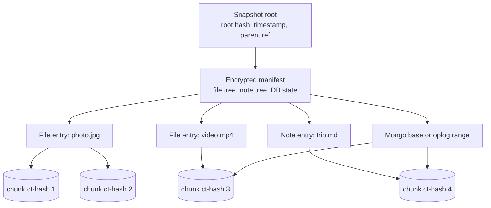
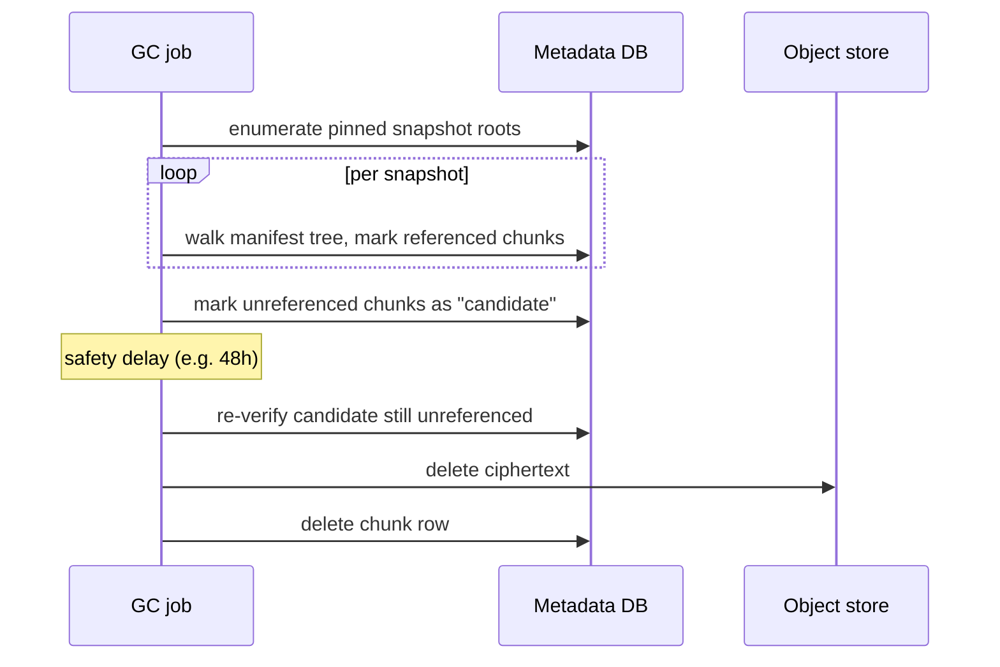

# Versioning & Retention

> Referenced from [`plans/2026-04-23.md`](plans/2026-04-23.md) D-4 / D-8.

## Mental model

There is exactly one data structure that expresses everything: an **immutable
snapshot**. A snapshot is a Merkle tree whose leaves are (ciphertext-hash of
chunk, wrapped DEK) pairs and whose internal nodes are encrypted manifests
describing the file/folder/DB structure.

Every primitive the product exposes is a derivation of "which snapshots
exist":

- **Current state** = the most recent snapshot.
- **Time-travel** = pick any snapshot by time and read it.
- **Trash / undelete** = a previous snapshot still has the deleted file.
- **Retention** = rules that decide which snapshots stay pinned.
- **Garbage collection** = any chunk not reachable from any pinned snapshot
  is deletable.

This is the restic/borg model. The value is that features compose instead of
each having its own code path.

## Snapshot structure

Key properties:

- Each snapshot references the previous one by hash (parent pointer), forming
  a hash chain the client can audit to detect server-side tampering.
- Chunks are shared freely across snapshots — the whole point of content
  addressing.
- The manifest is encrypted; the server stores it as a blob like any other
  chunk.

## Snapshot cadence

The device doesn't snapshot per file. It snapshots per **commit**, where a
commit is issued by the agent when:

- A configurable batching window elapses (e.g., 5 minutes) and there are new
  chunks uploaded, **or**
- A significant bulk event closes (a large video fully ingested, a Mongo
  oplog segment crosses a threshold), **or**
- The agent shuts down cleanly.

Coalescing keeps the metadata DB small. For a 10K-user product, per-file
snapshots would bloat to billions of rows; per-commit snapshots at a 5-minute
cadence are hundreds per user per day at most — typically far fewer.

## Retention policy

The user configures retention as a small set of rules. Defaults:

| Tier | Rule |
|---|---|
| Fresh | Keep every snapshot for the last 7 days |
| Daily | Keep one snapshot per day for the last 90 days |
| Weekly | Keep one snapshot per week for the last year |
| Monthly | Keep one snapshot per month forever |
| Trash | Items deleted by the user stay restorable for 30 days via a hidden "trash" snapshot branch |

These rules are evaluated periodically by a background job. The result is a
set of **pinned snapshot IDs**. Every other snapshot is unpinned and eligible
for deletion.

This is a deliberately simple "grandfather-father-son" scheme. It's what
restic/borg/Time Machine all converge on because it balances "enough history
to recover mistakes" against "storage cost doesn't explode."

## Garbage collection

GC is a classic mark-and-sweep over chunk references.

The **safety delay** exists because a new snapshot commit might reference an
"unreferenced" chunk between the mark and sweep phases. If the chunk gets
re-referenced during the delay, it moves back to live. Deleting too eagerly
would corrupt the new snapshot.

GC is per-user and runs concurrently; one user's GC never blocks another's
writes. It can be implemented as a periodic job (daily) rather than
real-time — there's no correctness need for promptness, only cost pressure.

## Storage tiering (D-8)

A chunk's tier is a function of the age of the newest snapshot that
references it:

| Age of newest referencing snapshot | Tier | Retrieval time |
|---|---|---|
| < 30 days | Standard | ms |
| 30–365 days | Infrequent-access | seconds |
| > 365 days, or trash-only reference | Cold archive | minutes to hours |

Tier transitions happen via a lifecycle policy on the object store, not
custom code. Restore from cold-tiered snapshots shows a UI hint that it will
take longer — matches user expectation for "I'm restoring a five-year-old
photo."

## Restore semantics the model gives for free

- **Full restore as of time T** = pick the latest snapshot ≤ T; hydrate every
  chunk.
- **Restore one file as of time T** = same snapshot; hydrate just that file's
  chunks.
- **Undelete a file deleted yesterday** = look at the previous snapshot,
  copy its entry for that file back into the current state.
- **Roll back DB to time T** = restore DB base + replay encrypted oplog up to
  T. See [`mongodb-backup.md`](mongodb-backup.md).

No per-feature code paths: each is a read against the snapshot tree.

## Non-obvious edge case

When a user empties their trash (force-delete), the product wants that file
*gone*. But previous snapshots still reference its chunks. The right model:

- Force-delete evicts the file from the *current* snapshot only. Chunks
  remain until all snapshots that reference them age out under retention.
- The UI should surface this honestly: "This file will be fully removed in
  up to N days when the last backup copy expires." Pretending otherwise is
  either lying or requires breaking immutability of snapshots, which breaks
  everything else in the model.

## Industry variants considered

| Model | Used by | Strength | Why not for us |
|---|---|---|---|
| **Per-file version chain** | Dropbox, Google Drive, OneDrive, S3 Object Versioning | Simple mental model, easy per-file restore | No storage sharing across files; no "repo" concept; hard to express cross-file point-in-time consistency (e.g., blob + DB atomicity). |
| **Filesystem snapshots (block-level COW)** | ZFS, Btrfs, APFS/Time Machine (modern) | Extremely cheap snapshots, fast restore, kernel-native | Tied to the filesystem; doesn't work uniformly across user files + MongoDB + SQLite data dirs; not portable across restore targets. |
| **Incremental archive chains** (tar-based) | Duplicity, classic `rsnapshot`, Amanda | Well-understood, simple | Chain-break recovery is painful; limited dedup; PIT restore means replaying a chain. |
| **Content-addressed repo snapshots (Merkle)** (our pick) | restic, borgbackup, bup, duplicacy, Kopia, Tarsnap | Time-travel + dedup + retention collapse into one primitive; each snapshot is immutable and verifiable; GC is a graph traversal | Nothing relevant. State-of-the-art open-source answer. |
| **Event-sourced replay** | CouchDB-style, event-sourcing systems | Perfect granularity, natural audit log | Storage grows linearly with events; rebuild is O(history). Wrong tool for binary-heavy backup. |

**Pick: content-addressed repo snapshots.** Every successful open-source
dedup backup tool converged here (restic, borg, bup, duplicacy, Kopia).
Time Machine historically used hardlink trees that approximate the same
idea; modern macOS uses APFS snapshots, which is a filesystem-specific
version of the same Merkle-snapshot concept.

### Retention policy

Grandfather-father-son is universal: restic, borg, Arq, Backblaze, Time
Machine all express retention identically (keep-last N, keep-daily,
keep-weekly, keep-monthly, keep-yearly). No meaningful industry
variation here.

### Storage tiering

| Approach | Used by | Notes |
|---|---|---|
| **Object-store native lifecycle** (our pick: S3 Intelligent-Tiering / GCS Autoclass) | Most modern SaaS backup products | Hands-off; store moves chunks between hot/IA/archive based on access patterns |
| **Custom tier management** | Early restic backends, self-hosted | More control, more code to maintain |
| **Always-hot single tier** | Some premium consumer tiers | Predictable latency, higher cost |

Lifecycle policies are free operationally and match backup access patterns
(recent hot, old cold) better than anything hand-coded.
