# WebRTC: Complete Guide

> A deep dive into WebRTC — how it works under the hood, what it can do beyond video calls, where it runs, and the libraries that make it practical across every platform.

---

## Table of Contents

1. [What is WebRTC?](#1-what-is-webrtc)
2. [History and Standardization](#2-history-and-standardization)
3. [Core Architecture](#3-core-architecture)
4. [The Connection Lifecycle](#4-the-connection-lifecycle)
5. [Signaling](#5-signaling)
6. [NAT Traversal: STUN, TURN, and ICE](#6-nat-traversal-stun-turn-and-ice)
7. [The Protocol Stack](#7-the-protocol-stack)
8. [Session Description Protocol (SDP)](#8-session-description-protocol-sdp)
9. [Media Capture and Tracks](#9-media-capture-and-tracks)
10. [Audio and Video Codecs](#10-audio-and-video-codecs)
11. [Data Channels](#11-data-channels)
12. [Data Channels vs HTTP/2 vs WebSocket vs QUIC](#12-data-channels-vs-http2-vs-websocket-vs-quic)
13. [RPC over WebRTC: gRPC, Protobuf, and Beyond](#13-rpc-over-webrtc-grpc-protobuf-and-beyond)
14. [Server Architectures: Mesh, SFU, MCU](#14-server-architectures-mesh-sfu-mcu)
15. [Security Model](#15-security-model)
16. [Browser and Platform Support](#16-browser-and-platform-support)
17. [Libraries and Frameworks](#17-libraries-and-frameworks)
18. [Use Cases Beyond Video Calling](#18-use-cases-beyond-video-calling)
19. [Scalability and Performance](#19-scalability-and-performance)
20. [Debugging and Monitoring](#20-debugging-and-monitoring)
21. [Common Pitfalls](#21-common-pitfalls)
22. [Real-World Architecture Examples](#22-real-world-architecture-examples)
23. [WebRTC-Next: The Future](#23-webrtc-next-the-future)
24. [Interview Discussion Points](#24-interview-discussion-points)

---

## 1. What is WebRTC?

**WebRTC (Web Real-Time Communication)** is an open-source project and set of APIs that enables real-time, peer-to-peer communication directly between browsers and devices — without plugins, downloads, or intermediary servers for the actual media/data transfer.

The key insight: before WebRTC, real-time communication on the web required Flash, Java applets, or proprietary plugins. WebRTC made it a native browser capability.

```
Traditional approach:    Client A → Server → Client B  (server relays everything)

WebRTC approach:         Client A ←――――――→ Client B   (direct peer-to-peer)
                              ↑
                         Server only helps with setup (signaling)
```

WebRTC provides three core capabilities:

- **MediaStream (getUserMedia)** — capture audio and video from cameras and microphones
- **RTCPeerConnection** — establish and manage peer-to-peer connections for audio/video
- **RTCDataChannel** — send arbitrary data peer-to-peer (files, game state, text, binary)

That third one is often overlooked but incredibly powerful — WebRTC is not just for video calls.

---

## 2. History and Standardization

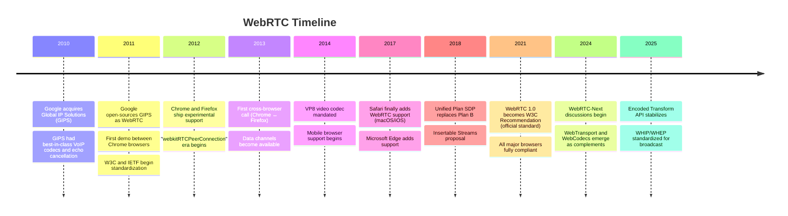

WebRTC is standardized by two bodies:

- **W3C** — defines the JavaScript APIs (what developers call in the browser)
- **IETF** — defines the underlying network protocols (how bits move on the wire)

This dual standardization means the API layer and the protocol layer can evolve somewhat independently, and non-browser implementations (mobile apps, IoT devices, servers) only need to implement the IETF protocols — they don't need a browser.

---

## 3. Core Architecture

WebRTC has three layers stacked on top of each other. Your code talks to the top layer (JavaScript APIs), and each layer below handles increasingly low-level concerns until packets leave the network card. Let's look at each layer independently.

### Layer 1: Application APIs

This is the only layer you interact with directly. WebRTC exposes exactly three APIs to your JavaScript code, each serving a distinct purpose:

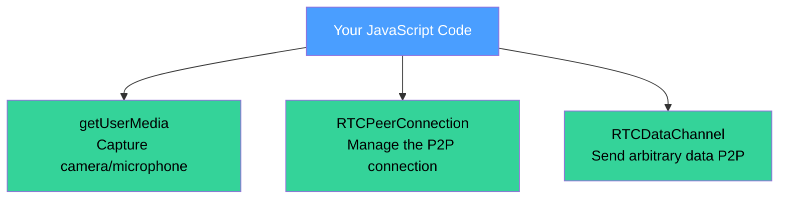

**getUserMedia** — Asks the user for permission, then accesses hardware devices (camera, microphone). Returns a `MediaStream` containing `MediaStreamTrack` objects — one for audio, one for video. You can also use `getDisplayMedia` to capture the screen instead of the camera.

**RTCPeerConnection** — The workhorse. This single object manages everything about the connection: you add media tracks to it, it generates SDP offers/answers, handles ICE candidate exchange, establishes the DTLS handshake, and manages bandwidth adaptation. One `RTCPeerConnection` per remote peer.

**RTCDataChannel** — Created from an `RTCPeerConnection`, this gives you a channel to send any data (strings, ArrayBuffers, Blobs) directly to the other peer. You can create multiple data channels on the same connection, each with independent reliability and ordering settings.

### Layer 2: Media Engines

Below the APIs, the browser runs native C++ code (originally from Google's GIPS acquisition) that handles media processing. You never interact with this layer directly — it works automatically when you add tracks to a peer connection.

**Voice Engine:**

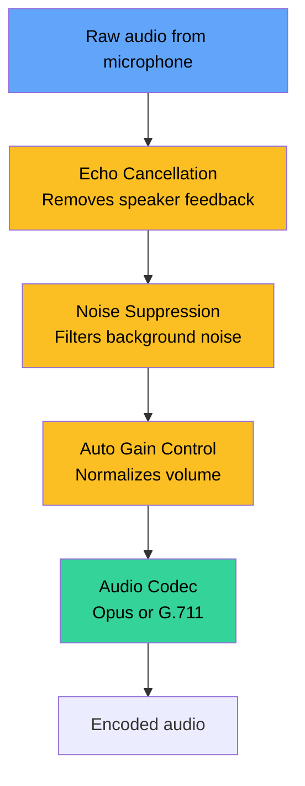

The voice engine processes audio in real time — it cancels echo (so the remote speaker doesn't hear themselves), suppresses background noise, normalizes volume levels, and then encodes the audio using a codec (usually Opus). On the receiving side, a **jitter buffer** reorders packets that arrive out of sequence and smooths out timing variations before playing audio through the speaker.

**Video Engine:**

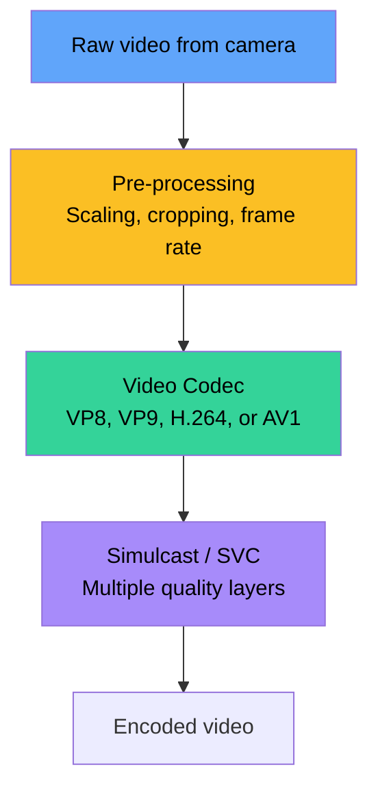

The video engine captures frames from the camera, optionally scales them down or reduces frame rate based on bandwidth estimates, then encodes using a video codec. When simulcast is enabled, it produces multiple quality levels simultaneously (e.g., 720p + 360p + 180p) so an SFU can forward the right quality to each receiver. On the receiving side, a jitter buffer handles reordering before the decoder produces frames for display.

### Layer 3: Transport

The transport layer gets encoded media and data channel messages from point A to point B securely and efficiently. It handles encryption, NAT traversal, and multiplexing — all over a single UDP port.

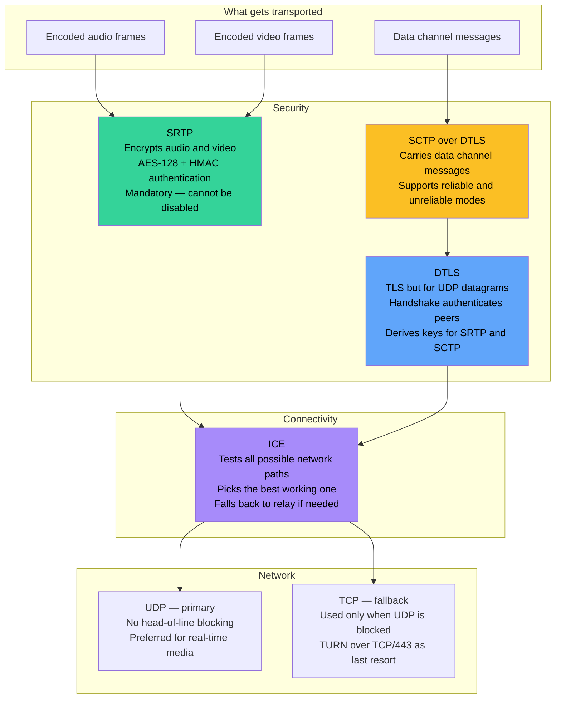

Everything multiplexes onto a single UDP port. The transport layer figures out whether an incoming packet is DTLS (handshake), SRTP (media), or SCTP (data channel) by examining the first byte, then routes it to the right handler. This single-port design is critical — it means only one port needs to traverse the NAT, and firewalls only need to allow one flow.

### How the layers connect

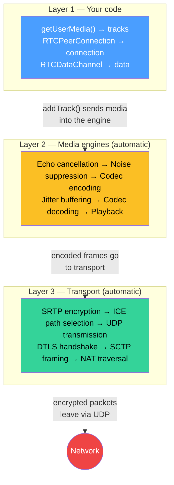

You call `addTrack()` with your camera stream — from that point on, the browser handles everything: noise suppression, echo cancellation, codec encoding, encryption, NAT traversal, packet transmission, bandwidth adaptation, and jitter compensation. Hundreds of thousands of lines of optimized C++ running behind three JavaScript API calls.

---

## 4. The Connection Lifecycle

Establishing a WebRTC connection involves several steps. This is the most confusing part for newcomers because there are many moving pieces.

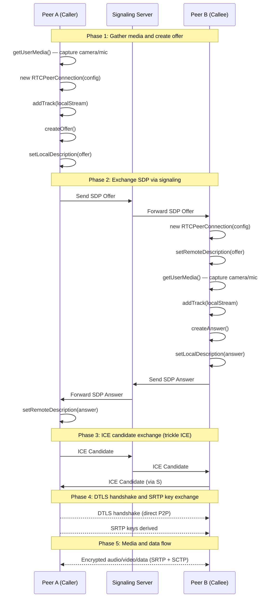

### Step by Step

**1. Capture media** — `getUserMedia()` accesses the camera and microphone, returning a `MediaStream` with audio and video tracks.

**2. Create the peer connection** — `new RTCPeerConnection(configuration)` where configuration includes ICE servers (STUN/TURN).

**3. Add tracks** — `peerConnection.addTrack(track, stream)` tells the connection what media to send.

**4. Create and exchange the offer/answer** — This is the SDP negotiation (more on SDP in section 8). The caller creates an offer, the callee responds with an answer. Both describe what codecs, resolutions, and capabilities they support.

**5. Exchange ICE candidates** — As the ICE agent discovers possible network paths (local addresses, STUN-derived addresses, TURN relays), it trickles these candidates to the other peer through the signaling server.

**6. Connect** — ICE finds the best path, DTLS establishes encryption, SRTP keys are derived, and media/data flows directly between peers.

---

## 5. Signaling

### The Fundamental Problem: How Do Two Strangers Find Each Other?

WebRTC is peer-to-peer — once connected, data flows directly between browsers. But there's a chicken-and-egg problem: **to establish a direct connection, two peers need to exchange information about each other first — and they have no way to do that directly because the connection doesn't exist yet.**

Think of it like a phone call. Before you can talk to someone, you need their phone number. But WebRTC peers don't have "phone numbers" — they have temporary, dynamically discovered network addresses hidden behind NATs and firewalls. Someone needs to introduce them.

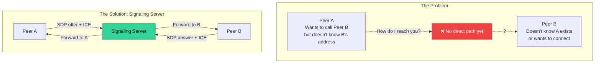

### What is Signaling?

**Signaling is the process of coordinating the initial connection setup between two peers.** It is the only part of WebRTC that requires a server — a middleman that both peers can reach to exchange the metadata needed to establish a direct connection.

Signaling is NOT part of the WebRTC specification. The spec defines what information must be exchanged (SDP offers/answers, ICE candidates) but deliberately leaves the delivery mechanism up to you. You could pass SDP on a Post-it note and type it into the other browser — it would work. The signaling server is just automating that exchange.

### Why Do We Need Signaling?

There are three things peers must share before they can connect directly:

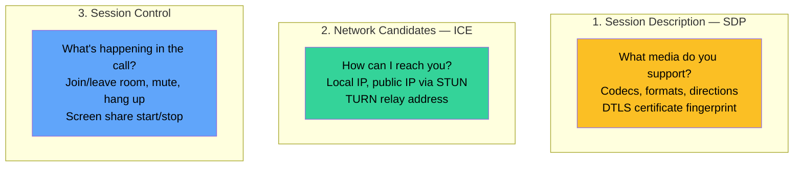

In short: **signaling answers "who are you, what can you do, and where are you on the network" so that the peers can then connect directly and exchange media without the server.**

### The Signaling Lifecycle

```mermaid
sequenceDiagram
    participant A as Peer A
    participant S as Signaling Server
    participant B as Peer B

    Note over A,S,B: Both peers connect to the signaling server<br/>(usually WebSocket on page load)

    A->>S: "I want to join room 'meeting-42'"
    B->>S: "I want to join room 'meeting-42'"
    S->>A: "Peer B is in the room"
    S->>B: "Peer A is in the room"

    Note over A,S,B: Signaling phase: exchange connection metadata

    A->>S: SDP Offer (my codecs, capabilities, DTLS fingerprint)
    S->>B: Forward SDP Offer to Peer B
    B->>S: SDP Answer (my codecs, capabilities, DTLS fingerprint)
    S->>A: Forward SDP Answer to Peer A

    A->>S: ICE Candidate (my network address #1)
    S->>B: Forward ICE Candidate
    A->>S: ICE Candidate (my network address #2)
    S->>B: Forward ICE Candidate
    B->>S: ICE Candidate (B's network address #1)
    S->>A: Forward ICE Candidate

    Note over A,B: Signaling is done.<br/>Peers now connect directly — P2P.

    A-->>B: Direct DTLS handshake
    A<<-->>B: Direct media/data flow (no server involved)

    Note over S: Signaling server is idle now.<br/>It never sees the media.
```

### How You Can Implement Signaling

Since WebRTC doesn't prescribe a signaling protocol, you can use anything that can deliver messages between two parties:

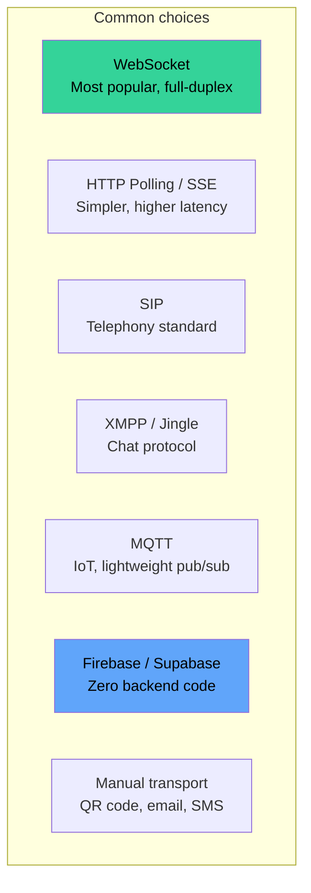

### Most common approach: WebSocket

```
Client A ←WebSocket→ Signaling Server ←WebSocket→ Client B
```

The signaling server is typically simple — it routes messages between peers and manages room/session state. It never touches or even sees the actual media data.

### Signaling is the only part that requires your server

Once signaling is done and ICE succeeds, the media flows peer-to-peer. Your signaling server can handle thousands of simultaneous calls because it only deals with small JSON messages, not video streams.

### Why WebRTC doesn't define a standard signaling protocol

- **Flexibility** — Video calling apps need different signaling than IoT sensor networks or telephony systems
- **Reuse** — Many organizations already have signaling infrastructure (SIP for telephony, XMPP for chat) and shouldn't be forced to replace it
- **Simplicity** — Signaling is fundamentally just "get these two blobs of text to the other side" — any message transport works, even carrier pigeon (RFC 1149, if you will)

---

## 6. NAT Traversal: STUN, TURN, and ICE

This is where most WebRTC complexity lives — and the part that determines whether a direct P2P connection is even possible.

### The Core Problem: Why Can't Two Browsers Just Connect?

WebRTC promises peer-to-peer, but the internet wasn't designed for that. The vast majority of devices sit behind **NAT (Network Address Translation)** — your laptop, phone, and smart TV all share one public IP address assigned to your router. From the outside, no one can reach your device directly.

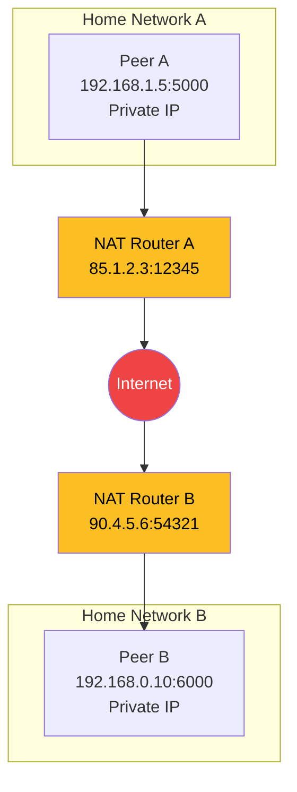

There are two problems here:

**Problem 1: Peers don't know their own public address.** Peer A knows it's 192.168.1.5 on its local network, but has no idea the outside world sees it as 85.1.2.3:12345. It can't tell Peer B where to send packets because it doesn't know its own externally reachable address.

**Problem 2: NATs block unsolicited incoming traffic.** Even if Peer A somehow learned Peer B's public address (90.4.5.6:54321) and sent a packet there, Peer B's router would drop it. NATs only allow incoming packets that correspond to an outgoing request the router already knows about. A random packet from an unknown address gets discarded.

This is why "just connect directly" doesn't work. WebRTC solves this with three complementary mechanisms: STUN, TURN, and ICE.

### NAT Types and Their Impact on P2P

Not all NATs behave the same way. The type of NAT determines whether a direct connection is possible.

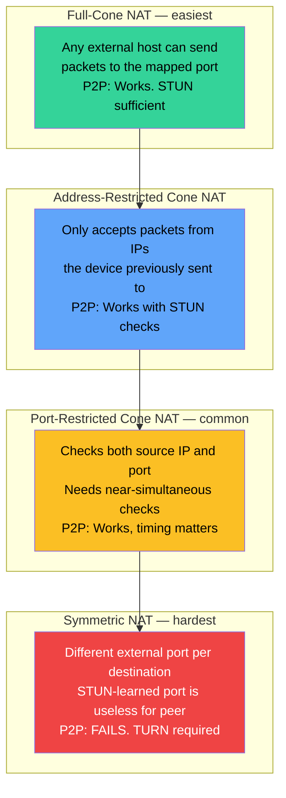

### Scenario 1: Both Peers on the Same Network (direct host connection)

This is the simplest case. Both devices are on the same LAN — no NAT traversal needed at all.

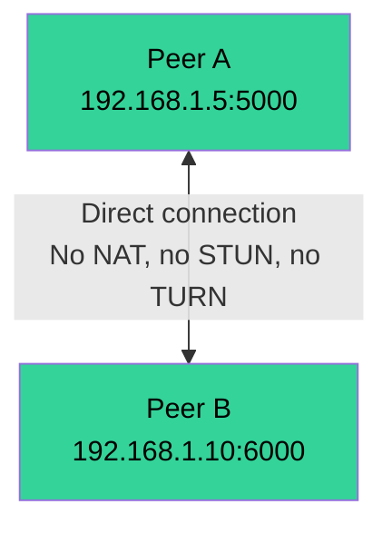

ICE discovers both peers' **host candidates** (their local IPs), tries the pair, and it works immediately. This is the fastest possible connection — zero extra hops, sub-millisecond overhead.

**When this happens:** Office colleagues, people on the same home WiFi, devices in the same data center. About **~20-30%** of real-world connections in typical consumer applications.

### Scenario 2: Peers Behind Different NATs (STUN-assisted P2P)

The most common internet scenario. Each peer is on a different network, behind their own NAT router. This is where STUN comes in.

**STUN (Session Traversal Utilities for NAT)** is a simple server on the public internet that answers one question: "What's my public address?"

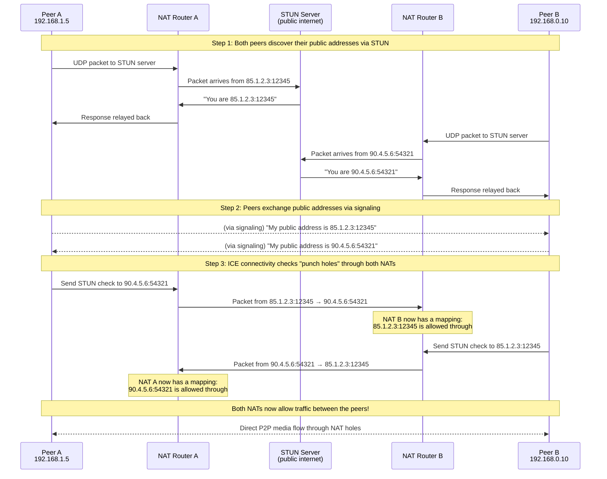

This technique is called **UDP hole punching**. When Peer A sends a packet to Peer B's public address, Peer A's NAT creates an entry saying "allow responses from 90.4.5.6:54321." When Peer B does the same toward Peer A, both NATs have entries allowing the traffic. Packets can now flow directly between the peers — the NATs simply forward them.

STUN is lightweight, fast, and essentially free to operate. Google provides public STUN servers (`stun:stun.l.google.com:19302`). The STUN server is only contacted during setup — it never sees any media data.

**When this works:** Both NATs are full-cone, address-restricted, or port-restricted. Covers **~50-65%** of all internet connections.

**When this fails:** Symmetric NATs, or strict firewalls that block all UDP.

### Scenario 3: Symmetric NAT or Strict Firewall (TURN relay required)

Sometimes direct P2P is impossible. The NAT creates a different external port for every destination (symmetric NAT), so the address learned from STUN is useless when talking to the peer. Or a corporate firewall blocks all UDP entirely.

This is where **TURN (Traversal Using Relays around NAT)** steps in. TURN is a relay server — all media flows through it.

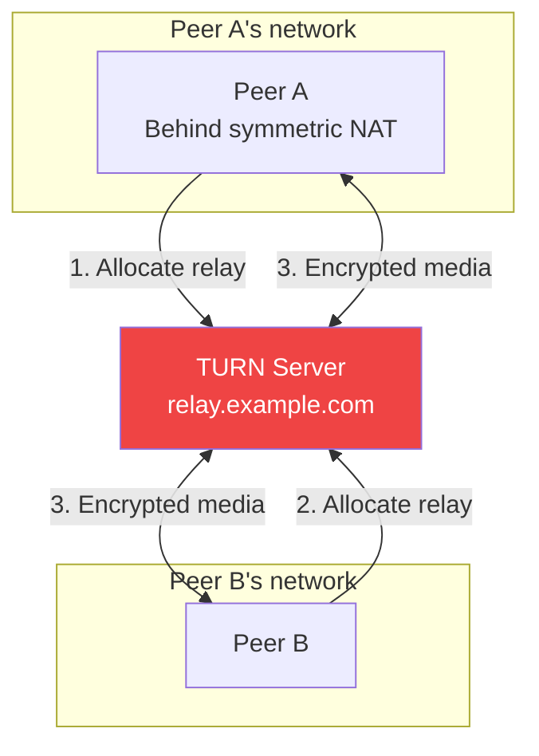

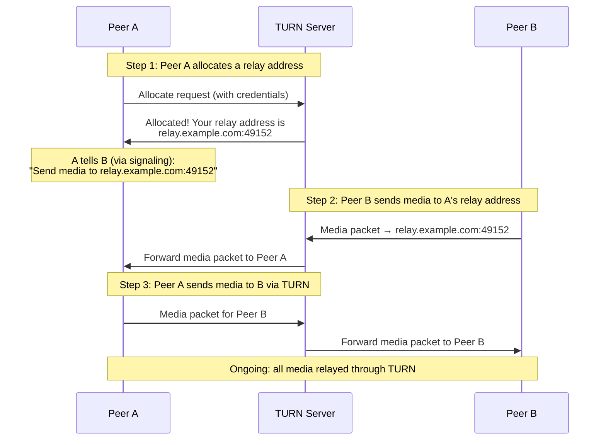

**Why TURN is the last resort:**
- **Added latency** — Every packet takes an extra network hop through the TURN server (typically adds 10-50ms RTT)
- **Bandwidth cost** — The TURN server relays every byte of media in both directions. A 1:1 video call at 2 Mbps costs 4 Mbps of TURN server bandwidth
- **Money** — TURN servers need significant bandwidth. Running your own costs money; managed services (Twilio, Xirsys) charge per GB
- **Single point of failure** — If the TURN server goes down, the call drops

**Why it always works:**
- TURN can run over TCP port 443, making it look like HTTPS traffic to firewalls
- Even the strictest corporate firewall typically allows outbound TCP/443
- The TURN server has a public IP — both peers can reach it with normal outbound connections

**When this is needed:** Symmetric NATs (common on mobile carriers and some enterprise networks), corporate firewalls blocking UDP, hotel/airport WiFi with restrictive rules. About **~10-20%** of connections, but varies dramatically by user demographic:

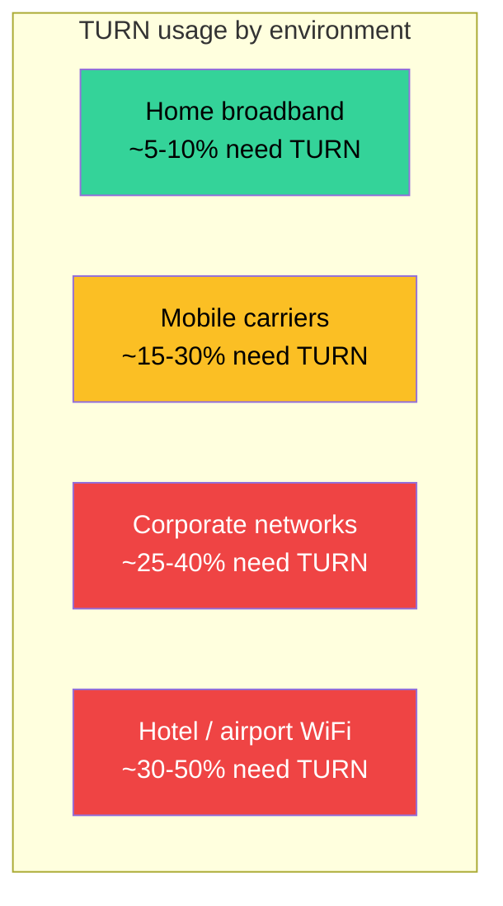

### Scenario 4: Everything Blocked (connection fails)

In rare cases, even TURN fails:

- Network blocks ALL outbound traffic except HTTP through an explicit proxy (some government and high-security corporate networks)
- TURN server is unreachable or overloaded
- Network requires authentication at the proxy level that WebRTC can't provide

In these cases, the ICE state transitions to `failed` and the connection cannot be established. There's no magical workaround — the network simply doesn't allow it. Your application should detect this and show a meaningful error.

### ICE: The Orchestrator

ICE (Interactive Connectivity Establishment) ties everything together. It doesn't find addresses itself — it coordinates STUN and TURN, gathers all discovered paths, and systematically tests them to find the best working connection.

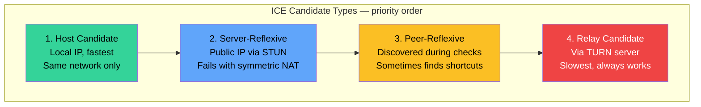

### How ICE actually tests connections

ICE doesn't just try one path — it systematically tests every possible combination:

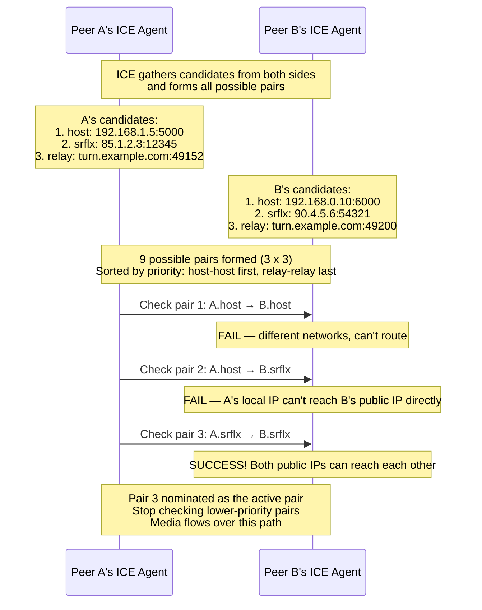

In reality, ICE checks run in parallel and use **Trickle ICE** — candidates are tested as soon as they arrive, rather than waiting for all candidates to be gathered first:

```mermaid
sequenceDiagram
    participant A as Peer A
    participant S as Signaling
    participant B as Peer B

    A->>S: SDP Offer (no candidates yet)
    S->>B: SDP Offer

    Note over A: Gathering candidates...
    A->>S: Host candidate found
    S->>B: Host candidate
    Note over A,B: ICE starts checking A.host ↔ B.host immediately

    A->>S: SRFLX candidate found (from STUN)
    S->>B: SRFLX candidate
    Note over A,B: More pairs formed, more checks in parallel

    B->>S: SDP Answer + B's host candidate
    S->>A: SDP Answer + B's host candidate
    B->>S: B's SRFLX candidate
    S->>A: B's SRFLX candidate

    Note over A,B: Trickle ICE: checks started ~1 second earlier<br/>than if we waited for all candidates
```

Trickle ICE can reduce connection setup time from 3-5 seconds to under 1 second in many cases.

### The Complete Fallback Chain

Putting it all together — here's what ICE does from start to finish:

```mermaid
flowchart TB
    START[ICE starts] --> GATHER[Gather candidates simultaneously]

    GATHER --> HOST_G[Discover host candidates<br/>Local network interfaces<br/>Instant — no network call]
    GATHER --> STUN_G[Query STUN server<br/>Learn public IP:port<br/>~50-100ms]
    GATHER --> TURN_G[Allocate TURN relay<br/>Get relay address<br/>~100-200ms]

    HOST_G --> PAIRS[Form candidate pairs<br/>Sort by priority]
    STUN_G --> PAIRS
    TURN_G --> PAIRS

    PAIRS --> CHECK[Run connectivity checks<br/>in priority order]

    CHECK --> HOST_C{Host pair works?}
    HOST_C -->|Yes| DONE_HOST[Use direct local connection<br/>Latency: ~1ms<br/>Best case]
    HOST_C -->|No| SRFLX_C{STUN pair works?}

    SRFLX_C -->|Yes| DONE_SRFLX[Use NAT-traversed P2P<br/>Latency: normal internet RTT<br/>Good case — still direct]
    SRFLX_C -->|No| RELAY_C{TURN relay works?}

    RELAY_C -->|Yes| DONE_RELAY[Use TURN relay<br/>Latency: +10-50ms overhead<br/>Works but costs bandwidth]
    RELAY_C -->|No| FAILED[Connection failed<br/>Network too restrictive<br/>Show error to user]

    style DONE_HOST fill:#34d399,color:#000
    style DONE_SRFLX fill:#60a5fa,color:#000
    style DONE_RELAY fill:#fbbf24,color:#000
    style FAILED fill:#ef4444,color:#fff
```

### What Are the Actual Chances of a Direct P2P Connection?

This is a critical question for any production system. The answer depends entirely on **what kind of networks both peers are on.** Two peers on different networks (the most common real case) don't always get a direct connection — and the probability varies dramatically based on their NAT types.

### P2P Success by NAT Type Combination

When two peers are on different networks, whether they can connect directly depends on the NAT types of both sides:

```mermaid
graph TB
    subgraph "NAT pair → P2P outcome"
        PAIR1["Full-Cone ↔ Full-Cone: ~100%"]
        PAIR2["Full-Cone ↔ Addr-Restricted: ~95%"]
        PAIR3["Full-Cone ↔ Port-Restricted: ~90%"]
        PAIR4["Full-Cone ↔ Symmetric: ~85%"]
        PAIR5["Port-Restricted ↔ Port-Restricted: ~75%"]
        PAIR6["Port-Restricted ↔ Symmetric: ~30%"]
        PAIR7["Symmetric ↔ Symmetric: ~0%"]
    end

    PAIR1 --> PAIR2 --> PAIR3 --> PAIR4 --> PAIR5 --> PAIR6 --> PAIR7

    style PAIR1 fill:#34d399,color:#000
    style PAIR2 fill:#34d399,color:#000
    style PAIR3 fill:#34d399,color:#000
    style PAIR4 fill:#34d399,color:#000
    style PAIR5 fill:#fbbf24,color:#000
    style PAIR6 fill:#ef4444,color:#fff
    style PAIR7 fill:#ef4444,color:#fff
```

The key insight: **it's the worst NAT in the pair that determines the outcome.** If even one side has a symmetric NAT, direct P2P becomes difficult or impossible.

### NAT Type Distribution in the Real World

What NAT types do people actually have?

```mermaid
graph TB
    subgraph "Home broadband"
        HOME_NAT["Cone NAT: ~80-85%<br/>Symmetric: ~10-15%<br/>Public IP: ~5%"]
    end

    subgraph "Mobile carriers — 4G/5G"
        MOBILE_NAT["Symmetric/CGNAT: ~40-60%<br/>Port-Restricted: ~30-40%<br/>Full-Cone: ~10-20%"]
    end

    subgraph "Corporate networks"
        CORP_NAT["Proxy/no UDP: ~20-30%<br/>Symmetric + firewall: ~40-50%<br/>Port-Restricted: ~20-30%"]
    end

    subgraph "Public WiFi"
        PUBLIC_NAT["Captive portal: ~30-40%<br/>Symmetric: ~30-40%<br/>Port-Restricted: ~20-30%"]
    end

    style HOME_NAT fill:#34d399,color:#000
    style MOBILE_NAT fill:#fbbf24,color:#000
    style CORP_NAT fill:#ef4444,color:#fff
    style PUBLIC_NAT fill:#ef4444,color:#fff
```

- **Home broadband** — Most routers use cone NAT. P2P works for the vast majority
- **Mobile carriers** — Biggest P2P challenge. CGNAT means many users share one IP, and symmetric NAT is common
- **Corporate** — Firewalls are hostile to WebRTC. Many block all UDP. TURN over TCP/443 is critical
- **Public WiFi** — Worst-case environment. Captive portals, UDP blocking, high TURN dependency

### Putting It Together: Real-World P2P Success Rates

Combining NAT type distributions with pair success rates, here are realistic numbers for different connection scenarios:

```mermaid
graph TB
    subgraph "Home ↔ Home"
        HH["P2P: ~80-85%<br/>TURN: ~15-20%"]
    end

    subgraph "Home ↔ Mobile"
        HM["P2P: ~55-70%<br/>TURN: ~30-45%"]
    end

    subgraph "Mobile ↔ Mobile"
        MM["P2P: ~35-55%<br/>TURN: ~45-65%"]
    end

    subgraph "Corporate ↔ Anything"
        CA["P2P: ~20-40%<br/>TURN: ~60-80%"]
    end

    style HH fill:#34d399,color:#000
    style HM fill:#fbbf24,color:#000
    style MM fill:#ef4444,color:#fff
    style CA fill:#ef4444,color:#fff
```

- **Home ↔ Home** — Most common consumer scenario. Both sides usually have cone NATs. Highest P2P success rate
- **Home ↔ Mobile** — Mobile side often has symmetric CGNAT. If mobile is symmetric and home is cone, P2P may still work (~85%). If both are symmetric: TURN required
- **Mobile ↔ Mobile** — Worst common scenario. High chance both sides have symmetric NAT. Varies by carrier and country (India/Indonesia: ~35% P2P, US/Europe: ~50% P2P)
- **Corporate ↔ Anything** — Corporate firewalls block UDP aggressively. Many allow only TCP/443 outbound. TURN over TCP/443 is the lifeline

### Overall Production Statistics

Across real production WebRTC deployments, the connection type breakdown:

```mermaid
graph TB
    subgraph "Consumer app — global avg"
        S1["Host: ~20-30%<br/>STUN/P2P: ~50-60%<br/>TURN: ~10-20% | Failed: ~1-3%"]
    end

    subgraph "Enterprise / corporate app"
        S2["Host: ~40-50%<br/>STUN/P2P: ~20-30%<br/>TURN: ~25-40% | Failed: ~2-5%"]
    end

    subgraph "Mobile-first — emerging markets"
        S3["Host: ~10-15%<br/>STUN/P2P: ~40-50%<br/>TURN: ~30-40% | Failed: ~3-8%"]
    end

    style S1 fill:#34d399,color:#000
    style S2 fill:#fbbf24,color:#000
    style S3 fill:#ef4444,color:#fff
```

### What Happens When Direct P2P Fails?

When ICE exhausts all direct candidates and only TURN works, the media path changes fundamentally:

```mermaid
graph TB
    subgraph "Direct P2P — ideal"
        A1[Peer A] <-->|"Direct UDP"| B1[Peer B]
    end

    subgraph "TURN Relay — fallback"
        A2[Peer A] <-->|"UDP/TCP"| TURN_S[TURN Server]
        TURN_S <-->|"UDP/TCP"| B2[Peer B]
    end

    subgraph "TURN TCP/443 — last resort"
        A3[Peer A] <-->|"TCP/443"| TURN_T[TURN Server]
        TURN_T <-->|"TCP/443"| B3[Peer B]
    end

    style A1 fill:#34d399,color:#000
    style B1 fill:#34d399,color:#000
    style TURN_S fill:#fbbf24,color:#000
    style TURN_T fill:#ef4444,color:#fff
```

- **Direct P2P** — Latency ~20-50ms, zero server cost, server never sees media
- **TURN over UDP** — Adds ~10-50ms per hop, costs server bandwidth, but SRTP-encrypted (TURN can't see content)
- **TURN over TCP/443** — Looks like HTTPS to firewalls, but TCP head-of-line blocking returns, highest latency

The degradation is gradual — TURN over UDP is slightly worse than direct P2P but still very usable for video calls. TURN over TCP/443 is noticeably worse (TCP head-of-line blocking comes back) but still works. The user experience difference:

```
Direct P2P:           Excellent quality, lowest latency
TURN over UDP:        Good quality, +10-50ms latency (most users won't notice)
TURN over TCP/443:    Acceptable quality, +30-100ms latency, occasional jitter spikes
Connection failed:    No call possible — show error, suggest different network
```

The takeaway: **always deploy TURN servers.** Even if 85% of your users connect directly, the remaining 15% will have a completely broken experience without TURN. In enterprise or mobile-heavy products, it can be 30-40% of users. TURN is not optional for production — it's insurance that guarantees your product works for everyone.

---

## 7. The Protocol Stack

WebRTC doesn't run over HTTP. It builds its own protocol stack, primarily over UDP.

```mermaid
graph TB
    subgraph "Application Layer"
        AUDIO[Audio Streams]
        VIDEO[Video Streams]
        DATA[Data Channels]
    end

    subgraph "Framing / Security"
        SRTP_L[SRTP<br/>Encrypts audio/video]
        SCTP_L[SCTP<br/>Reliable/unreliable data delivery]
        DTLS_L[DTLS 1.2<br/>Handshake + key exchange<br/>Encrypts data channels]
    end

    subgraph "Connectivity"
        ICE_L[ICE<br/>NAT traversal + path selection]
        STUN_L[STUN / TURN<br/>Address discovery + relay]
    end

    subgraph "Transport"
        UDP_L[UDP<br/>Primary transport]
        TCP_L[TCP<br/>Fallback only]
    end

    AUDIO --> SRTP_L
    VIDEO --> SRTP_L
    DATA --> SCTP_L
    SCTP_L --> DTLS_L
    SRTP_L --> ICE_L
    DTLS_L --> ICE_L
    ICE_L --> STUN_L
    STUN_L --> UDP_L
    STUN_L --> TCP_L

    style SRTP_L fill:#34d399,color:#000
    style DTLS_L fill:#60a5fa,color:#000
    style SCTP_L fill:#fbbf24,color:#000
    style ICE_L fill:#a78bfa,color:#000
```

### Protocol-by-protocol breakdown

**UDP** — The base transport. WebRTC prefers UDP because real-time media can't afford TCP's head-of-line blocking and retransmission delays. A lost video frame from 200ms ago is useless — it's better to skip it and show the next one.

**DTLS (Datagram Transport Layer Security)** — TLS but for UDP. Performs the cryptographic handshake, authenticates peers using certificates (fingerprints are in the SDP), and derives keys for SRTP. Uses DTLS 1.2 (DTLS 1.3 support is emerging).

**SRTP (Secure Real-time Transport Protocol)** — Encrypts and authenticates audio/video packets. Uses keys derived from the DTLS handshake. SRTP is mandatory — WebRTC has no unencrypted mode.

**SCTP (Stream Control Transmission Protocol)** — Carries data channel messages over DTLS. SCTP is remarkable because it supports both reliable and unreliable delivery, ordered and unordered delivery, and multiple independent streams without head-of-line blocking between them.

**RTP / RTCP** — RTP carries the actual media payload (encoded audio/video frames). RTCP provides feedback: receiver reports (packet loss, jitter), sender reports (synchronization), and bandwidth estimation signals (REMB, Transport-CC).

### Why UDP and not TCP?

```
TCP behavior with packet loss:

  Packet 1 ✓  →  delivered
  Packet 2 ✗  →  lost!
  Packet 3 ✓  →  HELD IN BUFFER (waiting for Packet 2 retransmission)
  Packet 4 ✓  →  HELD IN BUFFER
  Packet 5 ✓  →  HELD IN BUFFER
  ...retransmit Packet 2...
  Packet 2 ✓  →  NOW release 2, 3, 4, 5 all at once

  Result: Massive jitter spike. Unusable for real-time media.

UDP behavior with packet loss:

  Packet 1 ✓  →  delivered, play it
  Packet 2 ✗  →  lost! Skip it.
  Packet 3 ✓  →  delivered, play it
  Packet 4 ✓  →  delivered, play it

  Result: Brief glitch at packet 2, smooth otherwise.
```

---

## 8. Session Description Protocol (SDP)

SDP is the format used to describe a multimedia session. When peers exchange offers and answers, they're exchanging SDP blobs.

### What an SDP contains

```mermaid
graph TB
    subgraph "SDP Structure"
        SESSION[Session-level<br/>protocol version<br/>session ID<br/>timing info]

        subgraph "Media Descriptions"
            M1[m=audio 9 UDP/TLS/RTP/SAVPF 111<br/>Audio media line]
            M2[m=video 9 UDP/TLS/RTP/SAVPF 96 97<br/>Video media line]
            M3[m=application 9 UDP/DTLS/SCTP webrtc-datachannel<br/>Data channel line]
        end

        subgraph "Per-media attributes"
            CODEC[Codec info<br/>a=rtpmap:111 opus/48000/2]
            FMTP[Format params<br/>a=fmtp:111 minptime=10;useinbandfec=1]
            ICE_A[ICE credentials<br/>a=ice-ufrag:abc<br/>a=ice-pwd:xyz]
            DTLS_A[DTLS fingerprint<br/>a=fingerprint:sha-256 AB:CD:...]
            DIR[Direction<br/>a=sendrecv / sendonly / recvonly]
            CAND[Candidates<br/>a=candidate:... udp 85.1.2.3 12345]
        end
    end

    SESSION --> M1
    SESSION --> M2
    SESSION --> M3
    M1 --> CODEC
    M1 --> ICE_A
    M2 --> FMTP
    M2 --> DTLS_A
    M3 --> DIR
    M3 --> CAND

    style SESSION fill:#60a5fa,color:#000
    style M1 fill:#34d399,color:#000
    style M2 fill:#34d399,color:#000
    style M3 fill:#34d399,color:#000
```

### Real SDP example (simplified)

```
v=0
o=- 4625394283123372 2 IN IP4 127.0.0.1
s=-
t=0 0

m=audio 9 UDP/TLS/RTP/SAVPF 111
c=IN IP4 0.0.0.0
a=rtcp:9 IN IP4 0.0.0.0
a=ice-ufrag:abc123
a=ice-pwd:secretpassword
a=fingerprint:sha-256 4A:3B:2C:...
a=setup:actpass
a=mid:0
a=sendrecv
a=rtpmap:111 opus/48000/2
a=fmtp:111 minptime=10;useinbandfec=1
a=rtcp-fb:111 transport-cc

m=video 9 UDP/TLS/RTP/SAVPF 96 97
c=IN IP4 0.0.0.0
a=mid:1
a=sendrecv
a=rtpmap:96 VP8/90000
a=rtpmap:97 H264/90000
a=rtcp-fb:96 nack
a=rtcp-fb:96 nack pli
a=rtcp-fb:96 goog-remb
a=rtcp-fb:96 transport-cc

m=application 9 UDP/DTLS/SCTP webrtc-datachannel
a=mid:2
a=sctp-port:5000
a=max-message-size:262144
```

### Unified Plan vs Plan B

Historically, Chrome used **Plan B** (one media section for all tracks of a type) while Firefox used **Unified Plan** (one media section per track). This caused major interoperability headaches. As of 2018+, Unified Plan is the standard and Plan B is deprecated. If you see `a=msid` attributes or find old code referencing `plan-b`, it's legacy.

---

## 9. Media Capture and Tracks

### getUserMedia

```javascript
// Basic camera + microphone capture
const stream = await navigator.mediaDevices.getUserMedia({
  audio: {
    echoCancellation: true,
    noiseSuppression: true,
    autoGainControl: true,
    sampleRate: 48000
  },
  video: {
    width: { ideal: 1280 },
    height: { ideal: 720 },
    frameRate: { ideal: 30, max: 60 },
    facingMode: 'user'  // front camera on mobile
  }
});
```

### getDisplayMedia (Screen Sharing)

```javascript
// Screen or window capture
const screenStream = await navigator.mediaDevices.getDisplayMedia({
  video: {
    displaySurface: 'monitor',  // or 'window', 'browser'
    cursor: 'always'
  },
  audio: true  // system audio (not always supported)
});
```

### MediaStream and MediaStreamTrack

```mermaid
graph TB
    subgraph "MediaStream"
        AT[Audio Track<br/>kind: 'audio']
        VT[Video Track<br/>kind: 'video']
    end

    subgraph "Track operations"
        ENABLE[track.enabled = false<br/>Mutes locally]
        STOP[track.stop<br/>Releases hardware]
        CLONE[track.clone<br/>Independent copy]
        REPLACE[sender.replaceTrack<br/>Swap without renegotiation]
    end

    AT --> ENABLE
    AT --> STOP
    VT --> CLONE
    VT --> REPLACE
```

### Insertable Streams / Encoded Transform

A powerful newer API that lets you intercept encoded media frames before they're sent or after they're received, enabling:

- **End-to-end encryption** — Encrypt frames with your own keys so even an SFU can't see the content
- **Custom processing** — Add watermarks, blur backgrounds, inject metadata
- **Selective forwarding** — Drop or modify specific layers

```javascript
const sender = peerConnection.addTrack(videoTrack);
const senderStreams = sender.createEncodedStreams();
const transformer = new TransformStream({
  transform(encodedFrame, controller) {
    // Encrypt the frame payload with your own key
    const encrypted = customEncrypt(encodedFrame.data);
    encodedFrame.data = encrypted;
    controller.enqueue(encodedFrame);
  }
});
senderStreams.readable
  .pipeThrough(transformer)
  .pipeTo(senderStreams.writable);
```

---

## 10. Audio and Video Codecs

### Audio Codecs

```mermaid
graph TB
    subgraph "WebRTC Audio Codecs"
        OPUS[Opus<br/>Mandatory, 6-510 kbps<br/>Speech + Music]
        G711[G.711<br/>Required for interop<br/>64 kbps, PSTN compat]
        G722[G.722<br/>Optional, 64 kbps<br/>Wideband speech]
    end

    style OPUS fill:#34d399,color:#000
    style G711 fill:#fbbf24,color:#000
    style G722 fill:#93c5fd,color:#000
```

**Opus** is the star of WebRTC audio:
- Adaptive bitrate from 6 kbps (narrowband speech) to 510 kbps (full-band stereo music)
- Built-in forward error correction (FEC) — can recover from packet loss without retransmission
- Seamlessly switches between SILK (speech) and CELT (music) modes
- 20ms frame size by default, configurable down to 2.5ms
- Mandated by the WebRTC specification

### Video Codecs

```mermaid
graph TB
    subgraph "WebRTC Video Codecs"
        VP8[VP8<br/>Mandatory in spec<br/>Royalty-free, Google<br/>Good quality<br/>Fast encode/decode<br/>Universally supported]
        VP9[VP9<br/>Optional but widespread<br/>Royalty-free, Google<br/>30-50% better compression than VP8<br/>Supports SVC layers]
        H264[H.264 / AVC<br/>Mandatory in spec<br/>Licensed but ubiquitous<br/>Hardware acceleration everywhere<br/>Best mobile compatibility]
        H265[H.265 / HEVC<br/>Limited support<br/>Patent licensing issues<br/>50% better than H.264<br/>Not widely used in WebRTC]
        AV1[AV1<br/>Growing support<br/>Royalty-free, Alliance for Open Media<br/>30% better than VP9<br/>Computationally expensive<br/>Hardware support expanding]
    end

    VP8 --> VP9 --> AV1
    H264 --> H265

    style VP8 fill:#34d399,color:#000
    style H264 fill:#34d399,color:#000
    style VP9 fill:#60a5fa,color:#000
    style AV1 fill:#a78bfa,color:#000
    style H265 fill:#fbbf24,color:#000
```

### Simulcast and SVC

These are critical for scalable video conferencing:

**Simulcast** — The sender encodes the same video at multiple resolutions/bitrates simultaneously and sends all of them to an SFU. The SFU picks which quality to forward to each receiver based on their bandwidth and display size.

```mermaid
graph TB
    SENDER[Sender]
    SENDER -->|"720p @ 1.5 Mbps"| SFU[SFU Server]
    SENDER -->|"360p @ 500 kbps"| SFU
    SENDER -->|"180p @ 150 kbps"| SFU

    SFU -->|720p| GOOD[Good bandwidth receiver]
    SFU -->|360p| MED[Medium bandwidth receiver]
    SFU -->|180p| LOW[Low bandwidth receiver]

    style SFU fill:#fbbf24,color:#000
```

**SVC (Scalable Video Coding)** — The sender encodes video in layers. A base layer gives basic quality; enhancement layers add resolution, frame rate, or quality. An SFU can strip layers without re-encoding.

```
┌──────────────────────────────┐
│     Enhancement Layer 2      │  ← Full quality (720p60)
├──────────────────────────────┤
│     Enhancement Layer 1      │  ← Medium quality (720p30)
├──────────────────────────────┤
│        Base Layer            │  ← Minimum quality (360p15)
└──────────────────────────────┘

SFU can forward:
  - All layers → high bandwidth receiver
  - Base + Layer 1 → medium bandwidth receiver
  - Base only → low bandwidth receiver
```

VP9 and AV1 have native SVC support, making them ideal for SFU architectures.

---

## 11. Data Channels

Data channels are the most underappreciated feature of WebRTC. They let you send arbitrary data — text, binary, files, game state — directly between peers using the same P2P connection as media.

### How Data Channels Work

```mermaid
graph TB
    subgraph "Data Channel Stack"
        APP_DC[Application Data<br/>ArrayBuffer, Blob, String]
        SCTP_DC[SCTP<br/>Stream multiplexing<br/>Reliable or unreliable<br/>Ordered or unordered]
        DTLS_DC[DTLS<br/>Encryption]
        ICE_DC[ICE<br/>Same connection as media]
        UDP_DC[UDP]
    end

    APP_DC --> SCTP_DC --> DTLS_DC --> ICE_DC --> UDP_DC

    style SCTP_DC fill:#fbbf24,color:#000
```

### Data Channel Configuration Options

```javascript
// Reliable and ordered (like TCP) — good for chat, file transfer
const reliableChannel = peerConnection.createDataChannel('chat', {
  ordered: true,
  // no maxRetransmits or maxPacketLifeTime = fully reliable
});

// Unreliable and unordered (like UDP) — good for game state, sensor data
const unreliableChannel = peerConnection.createDataChannel('gameState', {
  ordered: false,
  maxRetransmits: 0  // fire and forget
});

// Partially reliable — retry a few times then give up
const partialChannel = peerConnection.createDataChannel('position', {
  ordered: true,
  maxRetransmits: 3  // try 3 times, then drop
});

// Time-limited — only deliver if within deadline
const timedChannel = peerConnection.createDataChannel('sensor', {
  ordered: false,
  maxPacketLifeTime: 500  // drop if not delivered within 500ms
});
```

### SCTP — The Secret Weapon

SCTP gives data channels capabilities that no single traditional protocol offers:

```mermaid
graph TB
    subgraph "SCTP Features"
        MULTI[Multiple Streams<br/>Up to 65535 independent streams<br/>No head-of-line blocking between streams]
        RELIABLE[Configurable Reliability<br/>Fully reliable (like TCP)<br/>Unreliable (like UDP)<br/>Partially reliable (n retransmits)]
        ORDER[Configurable Ordering<br/>Ordered within a stream<br/>Unordered for lowest latency]
        MSG[Message-oriented<br/>Preserves message boundaries<br/>No framing needed like TCP]
        FLOW[Flow Control<br/>Per-stream and per-association<br/>Prevents slow consumer issues]
    end

    style MULTI fill:#34d399,color:#000
    style RELIABLE fill:#60a5fa,color:#000
    style ORDER fill:#fbbf24,color:#000
    style MSG fill:#a78bfa,color:#000
    style FLOW fill:#f472b6,color:#000
```

### Data Channel Limits

- **Max message size**: 256 KiB is the commonly supported size (some implementations support up to 1 GiB with fragmentation)
- **Max channels**: 65535 per peer connection (practical limit is much lower)
- **Throughput**: Can sustain hundreds of Mbps on good connections (not limited to media bandwidth)
- **Buffer**: `bufferedAmount` property lets you implement backpressure

---

## 12. Data Channels vs HTTP/2 vs WebSocket vs QUIC

This is one of the most important comparisons for understanding when to use data channels vs traditional approaches.

### Latency comparison

```mermaid
graph TB
    subgraph "Connection setup latency"
        DC_L[WebRTC Data Channel<br/>Setup: ~1-3s, then 0 RTT]
        WS_L[WebSocket<br/>Setup: ~2-3 RTT, then 1 RTT via server]
        H2_L[HTTP/2<br/>Setup: 2-3 RTT, then 1 RTT via server]
        QUIC_L[QUIC / HTTP/3<br/>Setup: 0-1 RTT, then 1 RTT via server]
    end

    style DC_L fill:#34d399,color:#000
    style WS_L fill:#60a5fa,color:#000
    style H2_L fill:#fbbf24,color:#000
    style QUIC_L fill:#a78bfa,color:#000
```

### Detailed comparison

```mermaid
graph TB
    subgraph "WebRTC Data Channel"
        DC1[Peer-to-peer — no server in data path]
        DC2[UDP-based — lowest possible latency]
        DC3[Configurable reliability]
        DC4[Multiple independent streams — no HOL blocking]
        DC5[Encrypted by default — DTLS]
        DC6[Message-oriented — natural framing]
        DC7[Works behind NAT — ICE/TURN]
    end

    subgraph "HTTP/2"
        H1[Client-server only — always through server]
        H2[TCP-based — head-of-line blocking at transport]
        H3[Always reliable — every byte must arrive]
        H4[Stream multiplexing — but TCP HOL blocking kills it]
        H5[TLS 1.2+ required]
        H6[Framed — binary frames with headers]
        H7[Server push — server can initiate streams]
    end

    subgraph "WebSocket"
        WS1[Client-server — relay needed for P2P]
        WS2[TCP-based — same HOL blocking issues]
        WS3[Always reliable]
        WS4[Single connection — no multiplexing]
        WS5[TLS optional — WSS for secure]
        WS6[Message-oriented — text or binary frames]
        WS7[Full-duplex — true bidirectional]
    end

    subgraph "QUIC / HTTP/3"
        Q1[Client-server — no P2P mode]
        Q2[UDP-based — like WebRTC]
        Q3[Always reliable per stream]
        Q4[True stream multiplexing — no HOL blocking]
        Q5[TLS 1.3 built-in]
        Q6[0-RTT resumption possible]
        Q7[Connection migration — survives IP changes]
    end

    style DC1 fill:#34d399,color:#000
    style DC2 fill:#34d399,color:#000
    style DC3 fill:#34d399,color:#000
    style DC4 fill:#34d399,color:#000
```

### When Data Channels beat HTTP/2

**1. True peer-to-peer** — HTTP/2 always requires a server in the data path. Data channels connect peers directly, eliminating server bandwidth costs and adding no relay latency.

**2. No head-of-line blocking** — HTTP/2 multiplexes streams over a single TCP connection. If one TCP packet is lost, ALL streams stall. SCTP (used by data channels) has independent streams — loss in one stream doesn't block others. This is the same problem that motivated QUIC/HTTP/3.

**3. Configurable reliability** — HTTP/2 is always reliable. Data channels can be unreliable (like UDP) or partially reliable. For real-time applications (games, live collaboration, sensor data), dropping stale data is better than waiting for retransmission.

**4. Lower latency** — After initial setup, data channels deliver messages with minimal overhead. No HTTP framing, no server processing, just encrypted UDP straight to the peer. For a multiplayer game, the difference between 5ms (P2P) and 50ms (through a server) is enormous.

**5. No server bandwidth costs** — If users are transferring files P2P, your server never touches the data. With HTTP/2, every byte goes through your infrastructure.

**6. Privacy** — The server never sees the data in transit. With HTTP/2, your server has access to all the data it relays.

### When HTTP/2 or WebSocket beats Data Channels

**1. Server authority** — If the server needs to validate, transform, or store data before forwarding (chat moderation, game anti-cheat, financial transactions), client-server is required.

**2. Persistence** — WebRTC connections are ephemeral. HTTP/2 and WebSocket connect to servers that can store state, queue messages for offline users, and provide durability.

**3. Discovery and routing** — HTTP has URLs, DNS, load balancers, and CDNs. WebRTC has no addressing scheme — you need signaling to find and connect to peers.

**4. One-to-many** — Broadcasting to 10,000 clients is trivial with HTTP/2 + CDN. With WebRTC, you need SFU architecture.

**5. Simpler setup** — HTTP/2 just works. WebRTC requires signaling, ICE, STUN/TURN infrastructure.

**6. Firewall friendliness** — HTTP/2 on port 443 passes through any firewall. WebRTC UDP traffic is sometimes blocked (though TURN over TCP/443 is a fallback).

### Latency numbers in practice

```
Use case: Real-time cursor position sharing between 2 users

WebSocket (via server):
  Client A → Server: ~20ms
  Server → Client B: ~20ms
  Total: ~40ms (plus server processing time)

WebRTC Data Channel (P2P):
  Client A → Client B: ~10-20ms direct
  Total: ~10-20ms (no server hop)

HTTP/2 (polling, bad fit):
  Client A → POST to server: ~30ms
  Client B → GET from server: ~30ms
  Total: ~60ms minimum, plus polling interval
```

---

## 13. RPC over WebRTC: gRPC, Protobuf, and Beyond

A natural question arises once you understand data channels: if WebRTC gives you a reliable, low-latency, encrypted pipe between two peers, can you run structured RPC protocols over it — the way you'd use gRPC over HTTP/2?

The short answer: **yes, and people do it.** But it requires understanding what fits naturally and what needs adaptation.

### Why Would You Want RPC over WebRTC?

Traditional RPC (gRPC, JSON-RPC, tRPC) runs over HTTP/2 or TCP — meaning every call goes through a server. WebRTC data channels give you a direct pipe between peers. Combining the two gives you:

```mermaid
graph TB
    subgraph "Traditional gRPC"
        C1[Client A] -->|"gRPC via HTTP/2"| SERVER[Server]
        SERVER -->|"gRPC via HTTP/2"| C2[Client B]
    end

    subgraph "RPC over WebRTC"
        P1[Peer A] <-->|"RPC via data channel<br/>Direct P2P"| P2[Peer B]
    end

    style SERVER fill:#ef4444,color:#fff
    style P1 fill:#34d399,color:#000
    style P2 fill:#34d399,color:#000
```

**What this unlocks:**
- **P2P microservices** — Two devices can call each other's functions directly, without routing through a central server
- **Lower latency** — No server hop. A gRPC call that takes 50ms through a server takes 10-20ms peer-to-peer
- **Zero server cost** — RPC traffic never touches your infrastructure
- **Offline-first / edge** — Devices can communicate with each other even if the central server is down (after initial signaling)
- **Privacy** — The server never sees the RPC payloads

### gRPC over WebRTC — How It Would Work

gRPC is built on HTTP/2 framing. A WebRTC data channel is NOT HTTP/2 — it's a raw message pipe over SCTP. So you can't just point a gRPC client at a data channel and expect it to work. You have two approaches:

### Approach 1: Protobuf over Data Channels (most common)

Skip gRPC's HTTP/2 transport entirely. Use Protocol Buffers (protobuf) for serialization but build your own lightweight RPC framing over data channels.

```mermaid
graph TB
    subgraph "Standard gRPC Stack"
        GRPC_APP[Application Code]
        GRPC_STUB[Generated Stubs]
        GRPC_FW[gRPC Framework<br/>Streaming, deadlines, metadata]
        HTTP2[HTTP/2 Transport<br/>Framing, flow control, multiplexing]
        TLS[TLS 1.2+]
        TCP[TCP]
    end

    subgraph "Protobuf over WebRTC"
        DC_APP[Application Code]
        DC_STUB[Generated Stubs<br/>or hand-written wrappers]
        DC_FW[Lightweight RPC layer<br/>Request ID, method name, payload]
        SCTP_DC[Data Channel / SCTP<br/>Already has multiplexing,<br/>reliable + unreliable modes]
        DTLS_DC[DTLS<br/>Already encrypted]
        UDP_DC[UDP]
    end

    GRPC_APP --> GRPC_STUB --> GRPC_FW --> HTTP2 --> TLS --> TCP
    DC_APP --> DC_STUB --> DC_FW --> SCTP_DC --> DTLS_DC --> UDP_DC

    style HTTP2 fill:#ef4444,color:#fff
    style SCTP_DC fill:#34d399,color:#000
```

A typical message on the wire looks like:

```
┌──────────────────────────────────────────────────┐
│ Request ID (4 bytes) — correlate request/response │
│ Method ID  (2 bytes) — which function to call     │
│ Flags      (1 byte)  — request/response/stream/   │
│                        error/one-way               │
│ Payload    (N bytes) — protobuf-encoded message    │
└──────────────────────────────────────────────────┘
```

This approach is simple, efficient, and widely used. You get protobuf's compact binary encoding and type safety without the overhead of HTTP/2 framing that data channels don't need (SCTP already provides flow control and multiplexing).

```javascript
// Simplified example: Protobuf RPC over data channel

// Define your messages in .proto file
// message GetPlayerRequest { string player_id = 1; }
// message Player { string name = 1; int32 score = 2; }

// Sender side
function callRpc(channel, methodId, requestId, protoMessage) {
  const header = new ArrayBuffer(7);
  const view = new DataView(header);
  view.setUint32(0, requestId);
  view.setUint16(4, methodId);
  view.setUint8(6, 0x00); // flags: request
  
  const payload = protoMessage.serializeBinary();
  const message = concatBuffers(header, payload);
  channel.send(message);
}

// Receiver side
channel.onmessage = (event) => {
  const view = new DataView(event.data);
  const requestId = view.getUint32(0);
  const methodId = view.getUint16(4);
  const flags = view.getUint8(6);
  const payload = event.data.slice(7);
  
  // Dispatch to the right handler based on methodId
  const handler = rpcHandlers[methodId];
  const response = handler(payload);
  
  // Send response with same requestId
  sendResponse(channel, requestId, response);
};
```

### Approach 2: Full gRPC Transport Adapter

Some projects implement a gRPC transport that speaks the gRPC wire protocol but uses data channels instead of HTTP/2 underneath. This lets you use the full gRPC ecosystem — generated stubs, interceptors, deadlines, metadata — with WebRTC as the transport.

```mermaid
graph TB
    subgraph "gRPC with WebRTC transport adapter"
        APP[Application Code<br/>Normal gRPC service definitions<br/>Normal generated stubs]
        GRPC[gRPC Framework<br/>Interceptors, deadlines, metadata<br/>Streaming support]
        ADAPTER[WebRTC Transport Adapter<br/>Maps gRPC frames to data channel messages<br/>Handles stream multiplexing]
        DC[WebRTC Data Channel<br/>Reliable + ordered mode<br/>Encrypted via DTLS]
    end

    APP --> GRPC --> ADAPTER --> DC

    style ADAPTER fill:#fbbf24,color:#000
    style DC fill:#34d399,color:#000
```

This approach preserves gRPC compatibility but adds complexity. The adapter must handle:
- Mapping HTTP/2 streams to SCTP streams or separate data channels
- Translating gRPC's flow control to SCTP's flow control
- Deadline propagation (no HTTP headers to carry metadata)
- Error code translation

### Existing Libraries and Projects

```mermaid
graph TB
    subgraph "Production-ready"
        PION_GRPC["Pion + gRPC (Go)<br/>Pion's WebRTC + gRPC interceptors<br/>Used in production by some P2P systems<br/>Custom transport, full gRPC compatibility"]
        LIBDATACHANNEL["libdatachannel + protobuf (C++)<br/>Lightweight C++ WebRTC<br/>Pairs well with protobuf<br/>Used in games and IoT"]
        WEBRTC_RS_RPC["webrtc-rs + tonic (Rust)<br/>Rust WebRTC + Rust gRPC<br/>Custom transport layer<br/>Growing ecosystem"]
    end

    subgraph "Frameworks / libraries"
        PEERJS_RPC["PeerJS + protobufjs (Browser)<br/>Simple P2P + protobuf serialization<br/>Build lightweight RPC yourself<br/>Good for prototyping"]
        TRPC_DC["tRPC-style over data channel (TypeScript)<br/>No existing library — but easy to build<br/>TypeScript types + data channel transport<br/>End-to-end type safety P2P"]
        CONNECTRPC["ConnectRPC concepts (any language)<br/>ConnectRPC is gRPC-compatible but simpler framing<br/>Easier to adapt to data channel transport<br/>than full gRPC HTTP/2 framing"]
    end

    subgraph "Research / experimental"
        WEBRTC_GRPC["webrtc-grpc (various)<br/>Several GitHub projects experimenting<br/>with gRPC-over-datachannel<br/>Varying maturity levels"]
        STARGATE["Pion-based P2P meshes<br/>Some projects use Pion to build<br/>P2P service meshes with gRPC-like RPC"]
    end

    style PION_GRPC fill:#34d399,color:#000
    style LIBDATACHANNEL fill:#34d399,color:#000
    style TRPC_DC fill:#60a5fa,color:#000
```

### gRPC Features vs Data Channel Capabilities

Not all gRPC features map cleanly to WebRTC data channels. Some are a natural fit, others require workarounds:

```mermaid
graph TB
    subgraph "Natural fit"
        FIT1["Unary RPC<br/>Request → response by ID"]
        FIT2["Protobuf serialization<br/>Binary bytes, same .proto files"]
        FIT3["Bidi streaming<br/>Full-duplex by nature"]
        FIT4["Multiplexing<br/>SCTP: 65535 independent streams"]
    end

    subgraph "Requires adaptation"
        ADAPT1["Server/Client streaming<br/>Needs framing for stream lifecycle"]
        ADAPT2["Deadlines / timeouts<br/>Must embed in message framing"]
        ADAPT3["Metadata<br/>No headers — include in framing"]
        ADAPT4["Error codes<br/>Must be in response framing"]
    end

    subgraph "Different model"
        DIFF1["Load balancing<br/>N/A — each peer IS the server"]
        DIFF2["Service discovery<br/>Signaling replaces DNS"]
        DIFF3["TLS / mTLS<br/>Replaced by DTLS"]
    end

    style FIT1 fill:#34d399,color:#000
    style FIT2 fill:#34d399,color:#000
    style FIT3 fill:#34d399,color:#000
    style FIT4 fill:#34d399,color:#000
    style ADAPT1 fill:#fbbf24,color:#000
    style ADAPT2 fill:#fbbf24,color:#000
    style DIFF1 fill:#60a5fa,color:#000
```

### When RPC over WebRTC Makes Sense

```mermaid
flowchart TB
    Q1{Does the RPC call need<br/>to go through a server?} -->|"Yes — server validates,<br/>stores, or transforms"| USE_GRPC["Use standard gRPC / HTTP<br/>WebRTC doesn't help here"]
    Q1 -->|"No — peers talk directly"| Q2

    Q2{Is latency critical?<br/>Sub-50ms matters?} -->|Yes| GOOD["Strong fit for RPC over WebRTC<br/>P2P eliminates server hop"]
    Q2 -->|"No — 100ms+ is fine"| Q3

    Q3{Do you want to avoid<br/>server bandwidth costs?} -->|Yes| GOOD
    Q3 -->|"No — server cost is fine"| Q4

    Q4{Privacy — must the server<br/>not see the payload?} -->|Yes| GOOD
    Q4 -->|"No — server seeing data is OK"| USE_GRPC

    style USE_GRPC fill:#60a5fa,color:#000
    style GOOD fill:#34d399,color:#000
```

### Real-World Examples

**Multiplayer games** — The most natural fit. Game clients call RPCs on each other: `SyncPosition(pos)`, `FireWeapon(target)`, `TradeItem(offer)`. Unreliable data channels for position sync (RPC without guaranteed delivery), reliable channels for game actions.

**P2P collaborative tools** — Document editors where peers sync operations directly: `ApplyOperation(crdt_op)`, `RequestState(doc_id)`. Eliminates server as a bottleneck for real-time sync.

**IoT device control** — A phone controlling a drone: `SetThrottle(value)`, `GetTelemetry()`, `StartRecording()`. Protobuf gives type-safe contracts between heterogeneous devices (phone is TypeScript, drone is C++).

**Decentralized applications** — P2P networks where nodes provide services to each other: `QueryData(filter)`, `ReplicateBlock(block)`, `Propose(transaction)`. No central server means no single point of failure.

**Remote desktop / teleoperation** — Control commands from operator to device: `SendKeyEvent(key)`, `SendMouseEvent(x, y, button)`, `SetClipboard(text)`. Must be low-latency and reliable.

### Comparison: RPC over WebRTC vs Traditional Approaches

```mermaid
graph TB
    subgraph "gRPC / HTTP/2"
        T1["~30-100ms, Client→Server<br/>Massive ecosystem<br/>Best for: microservices"]
    end

    subgraph "Protobuf / WebRTC"
        T2["~10-30ms, Peer↔Peer<br/>$0 server cost, DIY ecosystem<br/>Best for: P2P, games, IoT"]
    end

    subgraph "tRPC / WebSocket"
        T3["~30-80ms, Client→Server<br/>Good TypeScript ecosystem<br/>Best for: real-time web apps"]
    end

    subgraph "ConnectRPC / WebTransport"
        T4["~20-50ms, Client→Server<br/>Growing ecosystem, QUIC-based<br/>Best for: modern HTTP/3 apps"]
    end

    style T1 fill:#60a5fa,color:#000
    style T2 fill:#34d399,color:#000
    style T3 fill:#fbbf24,color:#000
    style T4 fill:#a78bfa,color:#000
```

- **gRPC/HTTP2** — Topology: Client→Server. Server bandwidth for every call. TLS + tokens. DNS discovery. Massive ecosystem (every language, tool, proxy). Server/Client/Bidi streaming
- **Protobuf/WebRTC** — Topology: Peer↔Peer. $0 server bandwidth. DTLS auth. Signaling-based discovery. Small/DIY ecosystem. Natural full-duplex streaming
- **tRPC/WebSocket** — Topology: Client→Server. WSS + tokens. URL-based discovery. Good TypeScript ecosystem. Full-duplex. Server authority over data
- **ConnectRPC/WebTransport** — Topology: Client→Server. TLS 1.3 built-in. Multiplexed, no HOL blocking. Growing ecosystem. Emerging standard

### Practical Advice

**If you're building P2P and need structured communication** — use protobuf over data channels with a thin custom RPC layer. Don't drag in full gRPC; the HTTP/2 framing layer is unnecessary overhead and complexity. Protobuf gives you type safety and compact encoding. A 50-line request/response correlator is all you need for unary RPCs.

**If you need gRPC compatibility** (existing .proto service definitions, existing server-side gRPC services, and you want the same contract P2P) — look at Pion + gRPC in Go, or build a transport adapter. The effort is significant but worthwhile if you're maintaining both client-server and P2P paths for the same service interface.

**If you're in the browser only** — consider a tRPC-style approach: define your RPC contract in TypeScript types, serialize with protobuf or JSON, send over data channels. You get end-to-end type safety without a build step for code generation.

**For unreliable RPCs** (fire-and-forget, latest-wins) — this is something traditional gRPC cannot do at all. gRPC over HTTP/2 is always reliable. Data channels let you send unreliable RPCs — perfect for game state sync, sensor readings, or cursor positions where you only care about the latest value.

---

## 14. Server Architectures: Mesh, SFU, MCU

While WebRTC is peer-to-peer at the protocol level, real-world applications with more than 2-3 participants need server infrastructure.

### Mesh (Full P2P)

```mermaid
graph TB
    A[Peer A] <-->|stream| B[Peer B]
    A <-->|stream| C[Peer C]
    A <-->|stream| D[Peer D]
    B <-->|stream| C
    B <-->|stream| D
    C <-->|stream| D

    style A fill:#34d399,color:#000
    style B fill:#60a5fa,color:#000
    style C fill:#fbbf24,color:#000
    style D fill:#a78bfa,color:#000
```

- Each peer sends their media to every other peer directly
- Connections: N×(N-1)/2 — grows quadratically
- Upload bandwidth: (N-1) × stream bitrate per peer
- Works fine for 2-3 participants, breaks down at 4-5+
- No server cost for media relay

### SFU (Selective Forwarding Unit)

```mermaid
graph TB
    A[Peer A] -->|one upload| SFU[SFU Server]
    B[Peer B] -->|one upload| SFU
    C[Peer C] -->|one upload| SFU
    D[Peer D] -->|one upload| SFU

    SFU -->|B,C,D streams| A
    SFU -->|A,C,D streams| B
    SFU -->|A,B,D streams| C
    SFU -->|A,B,C streams| D

    style SFU fill:#ef4444,color:#fff
```

- Each peer sends one stream to the SFU
- SFU selectively forwards streams to each receiver
- Upload: 1 × bitrate (constant regardless of participants)
- Download: (N-1) × bitrate per receiver
- No transcoding — just packet forwarding — low CPU usage
- Can leverage simulcast/SVC to send different qualities to different receivers
- **The dominant architecture for modern video conferencing**

### MCU (Multipoint Control Unit)

```mermaid
graph TB
    A[Peer A] -->|stream| MCU[MCU Server]
    B[Peer B] -->|stream| MCU
    C[Peer C] -->|stream| MCU
    D[Peer D] -->|stream| MCU

    MCU -->|single composed<br/>stream| A
    MCU -->|single composed<br/>stream| B
    MCU -->|single composed<br/>stream| C
    MCU -->|single composed<br/>stream| D

    style MCU fill:#ef4444,color:#fff
```

- Each peer sends one stream, receives one composed stream
- MCU decodes all streams, composes them into a single layout, re-encodes
- Upload: 1 × bitrate, Download: 1 × bitrate (constant, lowest client bandwidth)
- Very CPU-intensive on the server (decode + compose + re-encode per participant)
- All participants see the same layout
- Used in legacy teleconferencing and specific enterprise scenarios
- Adds encoding latency

### Comparison

```mermaid
graph TB
    subgraph "Scalability"
        MESH_S[Mesh: 2-4 peers max]
        SFU_S[SFU: Hundreds of peers]
        MCU_S[MCU: Tens of peers]
    end

    subgraph "Server Cost"
        MESH_C[Mesh: $0]
        SFU_C[SFU: $$ bandwidth only]
        MCU_C[MCU: $$$ heavy CPU]
    end

    subgraph "Client Bandwidth"
        MESH_B["Mesh: O(N) up + down"]
        SFU_B["SFU: 1 up, O(N) down"]
        MCU_B[MCU: 1 up, 1 down]
    end
```

### Cascaded SFUs

For large-scale deployments, SFUs can be cascaded across regions:

```mermaid
graph TB
    subgraph "US West"
        SFU1[SFU - Portland]
        A1[Users in SF] --> SFU1
        A2[Users in LA] --> SFU1
    end

    subgraph "EU"
        SFU2[SFU - Frankfurt]
        B1[Users in London] --> SFU2
        B2[Users in Paris] --> SFU2
    end

    subgraph "Asia"
        SFU3[SFU - Tokyo]
        C1[Users in Tokyo] --> SFU3
        C2[Users in Seoul] --> SFU3
    end

    SFU1 <-->|SFU-to-SFU<br/>backbone| SFU2
    SFU2 <-->|SFU-to-SFU<br/>backbone| SFU3
    SFU1 <-->|SFU-to-SFU<br/>backbone| SFU3

    style SFU1 fill:#ef4444,color:#fff
    style SFU2 fill:#ef4444,color:#fff
    style SFU3 fill:#ef4444,color:#fff
```

Users connect to the nearest SFU, and SFUs relay streams between each other. This minimizes last-mile latency while keeping inter-region hops on optimized backbone connections.

---

## 15. Security Model

WebRTC was designed with security as a core principle, not an afterthought.

### Mandatory Encryption

```mermaid
graph TB
    subgraph "WebRTC Security Layers"
        E2E[Application-layer E2E encryption<br/>Optional — Insertable Streams API<br/>Protects content even from SFU servers]
        SRTP_S[SRTP — media encryption<br/>Mandatory — no opt-out<br/>AES-128 counter mode<br/>HMAC-SHA1 authentication]
        DTLS_S[DTLS — key exchange<br/>Mandatory — authenticates peers<br/>Certificate fingerprints in SDP<br/>Derives SRTP keys]
        ICE_S[ICE — consent verification<br/>Periodic STUN checks<br/>Verifies peer is still willing<br/>Prevents traffic amplification]
    end

    E2E --> SRTP_S --> DTLS_S --> ICE_S

    style E2E fill:#a78bfa,color:#000
    style SRTP_S fill:#34d399,color:#000
    style DTLS_S fill:#60a5fa,color:#000
    style ICE_S fill:#fbbf24,color:#000
```

### Key Security Properties

**No unencrypted mode** — Unlike SRTP outside of WebRTC (which can be used unencrypted), WebRTC mandates encryption. There is no API to disable it. This was a deliberate W3C/IETF decision.

**DTLS certificate verification** — Each peer generates a self-signed certificate. The certificate fingerprint is included in the SDP offer/answer. When DTLS handshake occurs, both sides verify the certificate matches the fingerprint from signaling. This means the signaling channel's integrity determines the security (if signaling is compromised, a MITM attack is possible).

**Consent freshness** — WebRTC periodically sends STUN binding requests on the media path. If the peer stops responding (timeout), media transmission stops. This prevents traffic from flowing to endpoints that no longer consent to receiving it.

**Same-origin policy** — `getUserMedia()` requires user permission (the browser shows a prompt). Sites cannot silently capture audio/video. Permission can be remembered per origin.

**Secure contexts only** — `getUserMedia()` and `RTCPeerConnection` only work in secure contexts (HTTPS or localhost). No HTTP page can use WebRTC.

### The SFU Trust Problem

With direct P2P, DTLS ensures only the two peers can decrypt media. But with an SFU, the server terminates DTLS on each leg:

```
Peer A ←DTLS→ SFU ←DTLS→ Peer B
```

The SFU can see and modify the media. For most use cases this is acceptable (the SFU is trusted infrastructure). For higher security requirements, **Insertable Streams / Encoded Transform** enables true end-to-end encryption where the SFU only sees encrypted payloads it cannot decrypt.

This is how services like Zoom's "end-to-end encrypted" mode and Cloudflare Calls work — they use an SFU for routing but encrypt the content with keys the SFU doesn't possess.

---

## 16. Browser and Platform Support

### The Big Picture: How Widely is WebRTC Supported Today?

WebRTC is one of the most broadly supported web APIs in existence. According to caniuse.com, **the core WebRTC APIs (RTCPeerConnection, getUserMedia, RTCDataChannel) are supported by ~97% of all browsers in active use globally.** That remaining ~3% is almost entirely legacy browsers (old Android WebView versions, legacy Opera Mini, and users who haven't updated in years).

For practical purposes: **if a user can browse the modern web, they can use WebRTC.** No plugins, no downloads, no extensions — it's a built-in browser capability like `<video>` or `fetch()`.

```mermaid
graph TB
    subgraph "Global browser support for core WebRTC (~97%)"
        CORE["RTCPeerConnection — ~97% global support<br/>getUserMedia — ~97% global support<br/>RTCDataChannel — ~97% global support<br/><br/>This covers the fundamental ability to<br/>make video calls and send data P2P"]
    end

    subgraph "Advanced APIs (lower support)"
        ADV["getDisplayMedia (screen share) — ~94% (no mobile Safari before 16.4)<br/>Encoded Transform / Insertable Streams — ~70% (Chromium-only)<br/>MediaStreamTrack Processor — ~70% (Chromium-only)<br/>WebTransport (complement) — ~75% (Chrome, Edge, Firefox)"]
    end

    subgraph "What's NOT supported (~3%)"
        NONE["Internet Explorer — dead, never had WebRTC<br/>Opera Mini — proxy-based, no real-time capability<br/>Very old Android WebView (<v83) — limited/broken<br/>iOS WKWebView — deliberately blocked by Apple<br/>Legacy Edge (EdgeHTML) — had ORTC, not WebRTC, now dead<br/>KaiOS browser — partial, unreliable"]
    end

    style CORE fill:#34d399,color:#000
    style ADV fill:#fbbf24,color:#000
    style NONE fill:#ef4444,color:#fff
```

### Desktop Browser Support

Every major desktop browser has full WebRTC support. The differences are in advanced/newer APIs:

```mermaid
graph TB
    subgraph "Chrome ~65% share"
        CH["Full support since 2013<br/>All advanced APIs<br/>Reference implementation"]
    end

    subgraph "Firefox ~3% share"
        FF["Full support since 2013<br/>Encoded Transform: partial<br/>AV1 encode: not yet"]
    end

    subgraph "Safari ~18% share"
        SF["Full support since 2017<br/>No VP9! H.264 + VP8 only<br/>Encoded Transform: partial"]
    end

    subgraph "Edge ~5% share"
        EDGE_D["Chromium-based since 2020<br/>Identical to Chrome"]
    end

    style CH fill:#34d399,color:#000
    style FF fill:#34d399,color:#000
    style SF fill:#fbbf24,color:#000
    style EDGE_D fill:#34d399,color:#000
```

- **Chrome** — The reference implementation. New WebRTC features land here first, typically 6-18 months before other browsers. All advanced APIs (Encoded Transform, Insertable Streams, MediaStreamTrack Processor, AV1 HW+SW)
- **Firefox** — Independent implementation (not Chromium). Strong core support. Encoded Transform partial/behind flag. AV1 decode only. Occasionally has different SDP quirks
- **Safari** — Last major browser to add WebRTC (2017). Historically buggy, now solid since 2021. **No VP9 support** — uses H.264 and VP8. Encoded Transform partial (15.4+). AV1 decode only (macOS 13+)
- **Edge** — Chromium-based since 2020, identical to Chrome. Legacy EdgeHTML had ORTC (not WebRTC) — now dead

Other Chromium-based browsers — **Opera, Brave, Vivaldi, Arc, Samsung Internet (desktop)** — all inherit Chrome's full WebRTC implementation.

### Mobile Browser Support

Mobile is where the platform differences get complicated:

```mermaid
graph TB
    subgraph "Android ~72% of mobile"
        CHROME_A["Chrome: Full support<br/>HW codecs, ~95% usage"]
        FIREFOX_A["Firefox: Full support"]
        SAMSUNG_A["Samsung Internet: Full<br/>Chromium-based"]
        WEBVIEW_A["WebView: Supported<br/>since Android 8.0 / v83+"]
    end

    subgraph "iOS ~27% of mobile"
        SAFARI_I["Safari: Full since iOS 11<br/>H.264 only, no VP9/AV1"]
        CHROME_I["Chrome on iOS<br/>Uses WebKit, NOT Chrome"]
        FIREFOX_I["Firefox on iOS<br/>Uses WebKit, same as Safari"]
        WKWEBVIEW["WKWebView<br/>NO WebRTC support!"]
    end

    style CHROME_A fill:#34d399,color:#000
    style SAFARI_I fill:#fbbf24,color:#000
    style WKWEBVIEW fill:#ef4444,color:#fff
```

### The Critical iOS Problem

This deserves its own section because it catches every development team:

**On iOS, all third-party browsers are forced to use Apple's WebKit engine.** This is Apple's App Store policy. Chrome on iOS, Firefox on iOS, Edge on iOS — they are all Safari with a different skin. They have Safari's WebRTC implementation, Safari's bugs, and Safari's limitations.

**iOS WKWebView does NOT support WebRTC.** If your app uses a WKWebView to display web content (extremely common), WebRTC calls will silently fail. Your options:

```mermaid
flowchart TB
    APP[Your iOS app needs WebRTC] --> Q1{Web-based or native?}

    Q1 -->|Web-based| Q2{In-app or external browser?}
    Q2 -->|In-app WKWebView| FAIL["WKWebView: NO WebRTC<br/>Will not work. Period."]
    Q2 -->|SFSafariViewController| OK1["Opens Safari engine<br/>WebRTC works<br/>But limited UI control"]
    Q2 -->|Open in Safari| OK2["Full Safari<br/>WebRTC works<br/>But leaves your app"]

    Q1 -->|Native app| OK3["Use Google WebRTC iOS SDK<br/>or LiveKit/Twilio native SDK<br/>Full control, best experience"]

    style FAIL fill:#ef4444,color:#fff
    style OK1 fill:#fbbf24,color:#000
    style OK2 fill:#fbbf24,color:#000
    style OK3 fill:#34d399,color:#000
```

**Note:** As of iOS 17.4+ in the EU, Apple began allowing alternative browser engines (the Digital Markets Act). This means Chrome on iOS in the EU may eventually use Blink (Chrome's real engine) with full Chrome WebRTC support. But this is early days and not yet widely deployed.

### What's NOT Supported and Where

```mermaid
graph TB
    subgraph "Features missing on Safari / iOS"
        S1["VP9 codec — not supported at all<br/>AV1 encode — not supported<br/>Encoded Transform — partial, lagging behind Chrome<br/>MediaStreamTrack Processor — not supported<br/>Screen sharing on iOS — only Safari 16.4+<br/>getDisplayMedia audio capture — not supported on any mobile browser"]
    end

    subgraph "Features missing on Firefox"
        F1["Encoded Transform — partial / behind flag<br/>AV1 encode — not supported (decode only)<br/>Insertable Streams — different API surface<br/>MediaStreamTrack Processor — not supported"]
    end

    subgraph "Features missing on all mobile browsers"
        M1["getDisplayMedia (screen share) — only works on iOS 16.4+ and Android Chrome<br/>System audio capture during screen share — not supported anywhere on mobile<br/>Multiple simultaneous cameras — limited support<br/>Background execution — OS kills WebRTC after 30s-5min in background"]
    end

    subgraph "Platforms with zero WebRTC"
        Z1["Internet Explorer (any version)<br/>Opera Mini (proxy-based architecture is incompatible)<br/>iOS WKWebView (Apple blocks it)<br/>Very old Smart TVs (pre-2020 models)<br/>Older feature phones (KaiOS has limited, broken support)"]
    end

    style S1 fill:#fbbf24,color:#000
    style F1 fill:#fbbf24,color:#000
    style M1 fill:#ef4444,color:#fff
    style Z1 fill:#6b7280,color:#fff
```

### Native Platform Support (outside the browser)

WebRTC is not just a browser technology. Native libraries exist for every major platform, letting you build apps that don't depend on a browser engine:

```mermaid
graph TB
    subgraph "Mobile Native"
        ANDROID_N["Android (Java / Kotlin)<br/>Google WebRTC Android SDK — prebuilt .aar via Maven<br/>Tracks libwebrtc closely, hardware codec support<br/>~95% of Android devices (Android 7.0+)"]
        IOS_N["iOS (Swift / Objective-C)<br/>Google WebRTC iOS SDK — via CocoaPods or SPM<br/>Hardware H.264, software VP8/VP9<br/>~98% of active iOS devices (iOS 13+)"]
        FLUTTER_N["Flutter (Dart)<br/>flutter_webrtc — wraps native SDKs<br/>iOS + Android + Web + macOS + Windows + Linux<br/>Single codebase, native performance"]
        RN_N["React Native (JavaScript)<br/>react-native-webrtc — native modules<br/>iOS + Android<br/>Mature but occasional native bridge issues"]
    end

    subgraph "Desktop Native"
        ELECTRON_N["Electron — full Chrome WebRTC built-in<br/>Discord, Slack, VS Code use this approach<br/>macOS, Windows, Linux"]
        CPP_N["C++ — libwebrtc directly<br/>Google's reference implementation<br/>Maximum control, hardest to build (~20M LoC)<br/>Used by Zoom, Discord (native clients)"]
        RUST_N["Rust — webrtc-rs or str0m<br/>Pure Rust, no C dependencies<br/>Growing ecosystem, production-ready for data channels"]
        DOTNET_N[".NET — SIPSorcery, MixedReality-WebRTC<br/>Windows-focused, some cross-platform<br/>Good for enterprise/Microsoft ecosystem"]
    end

    subgraph "Server / Backend"
        GO_N["Go — Pion<br/>Pure Go, no CGo, excellent documentation<br/>Most popular server-side WebRTC library<br/>Used by LiveKit, ion-sfu, and many SFUs"]
        NODE_N["Node.js — mediasoup (C++ worker), node-webrtc<br/>mediasoup is battle-tested at scale<br/>Powers many commercial products"]
        JAVA_N["Java/Kotlin — Kurento, Jitsi<br/>Media server focused<br/>Jitsi is a full open-source video conferencing platform"]
        PYTHON_N["Python — aiortc<br/>Pure Python, asyncio-based<br/>Great for prototyping and testing<br/>Not recommended for production media processing"]
        ELIXIR_N["Elixir — ex_webrtc<br/>Pure Elixir, part of Membrane framework<br/>BEAM VM concurrency model suits media routing"]
        RUST_S_N["Rust — webrtc-rs, str0m<br/>str0m uses sans-I/O design (highly testable)<br/>Webrtc-rs inspired by Pion"]
    end

    style ANDROID_N fill:#34d399,color:#000
    style IOS_N fill:#34d399,color:#000
    style GO_N fill:#34d399,color:#000
    style FLUTTER_N fill:#60a5fa,color:#000
    style ELECTRON_N fill:#60a5fa,color:#000
```

### Embedded and IoT

WebRTC runs on surprisingly constrained devices:

- **Raspberry Pi** — Full libwebrtc, commonly used for security cameras and robot teleoperation
- **ESP32** — Limited, but data-channel-only implementations exist for IoT sensor streaming
- **NVIDIA Jetson** — Hardware-accelerated video encoding for drones, robots, edge AI cameras
- **Automotive** — Some infotainment systems use WebRTC for remote diagnostics and updates
- **Smart displays** — Amazon Echo Show, Google Nest Hub use WebRTC for video calling
- **Smart TVs** — Samsung Tizen and LG webOS support WebRTC in their built-in browsers (2020+ models)
- **AR/VR headsets** — Meta Quest browser and Apple Vision Pro both support WebRTC

### Codec Support by Platform

This is a common source of interoperability issues — not all platforms support the same codecs:

```mermaid
graph TB
    subgraph "Video codec support"
        VP8_S["VP8 (mandatory per spec)<br/>Chrome: Yes  |  Firefox: Yes  |  Safari: Yes<br/>Android native: Yes  |  iOS native: Yes<br/>Universally supported — safe default"]
        VP9_S["VP9 (widely supported)<br/>Chrome: Yes  |  Firefox: Yes  |  Safari: NO<br/>Android native: Yes  |  iOS native: SW decode only<br/>30-50% better compression than VP8<br/>Safari gap is a major limitation"]
        H264_S["H.264 (mandatory per spec)<br/>Chrome: Yes  |  Firefox: Yes  |  Safari: Yes<br/>Android native: Yes (HW)  |  iOS native: Yes (HW)<br/>Best hardware acceleration support<br/>Safari strongly prefers H.264"]
        AV1_S["AV1 (growing)<br/>Chrome: Yes (HW+SW)  |  Firefox: Decode only  |  Safari: Decode only<br/>Android native: Newer devices  |  iOS native: Decode only (M3+)<br/>Best compression but limited encode support"]
    end

    style VP8_S fill:#34d399,color:#000
    style H264_S fill:#34d399,color:#000
    style VP9_S fill:#fbbf24,color:#000
    style AV1_S fill:#60a5fa,color:#000
```

**Practical advice:** Always negotiate H.264 as a fallback codec. It's the only video codec with hardware acceleration on every platform (especially important for iOS and older Android devices). Use VP9 or AV1 when both sides support it for better quality at lower bitrate.

---

## 17. Libraries and Frameworks

### Browser-side Libraries

```mermaid
graph TB
    subgraph "High-level SDKs (managed infrastructure)"
        TWILIO[Twilio Video<br/>Most mature<br/>Full infrastructure<br/>Rooms API + TURN<br/>JS, iOS, Android, React]
        DAILY[Daily<br/>Developer-friendly<br/>Prebuilt UI components<br/>Simple API<br/>JS, React, React Native]
        LIVEKIT_C[LiveKit Client SDK<br/>Open-source + cloud<br/>Room-based model<br/>JS, React, Swift, Kotlin, Flutter, Unity, Rust]
        VONAGE[Vonage (Tokbox)<br/>Formerly OpenTok<br/>Long-standing platform<br/>JS, iOS, Android]
        AGORA[Agora<br/>Global edge network<br/>Strong in Asia<br/>Low latency focus<br/>JS, native, Flutter, React Native, Unity]
        AMAZON_CHIME[Amazon Chime SDK<br/>AWS integration<br/>JS, iOS, Android, React Native]
    end

    subgraph "Low-level / Self-hosted"
        SIMPLE_PEER[simple-peer<br/>Minimal WebRTC wrapper<br/>~1000 lines<br/>Node.js + browser<br/>Good for learning]
        PEERJS[PeerJS<br/>Simplest possible API<br/>Free signaling server<br/>Browser only]
        JANUS_C[Janus JS Client<br/>Pairs with Janus gateway<br/>Plugin architecture]
        MEDIASOUP_C[mediasoup-client<br/>Pairs with mediasoup server<br/>Highly customizable]
    end

    style LIVEKIT_C fill:#34d399,color:#000
    style DAILY fill:#60a5fa,color:#000
    style SIMPLE_PEER fill:#fbbf24,color:#000
```

### Server-side / SFU / Media Servers

```mermaid
graph TB
    subgraph "Open-source SFUs"
        LIVEKIT[LiveKit<br/>Go + TypeScript<br/>Most popular open-source<br/>SFU + signaling + rooms<br/>Simulcast, SVC, E2EE<br/>Excellent docs]
        MEDIASOUP[mediasoup<br/>Node.js + C++<br/>Highly performant<br/>Low-level, more control<br/>No built-in signaling<br/>Powers many commercial products]
        JANUS[Janus Gateway<br/>C<br/>Plugin architecture<br/>Video rooms, SIP gateway, streaming<br/>Very mature, widely deployed]
        PION_SFU[Pion / ion-sfu<br/>Go<br/>Uses Pion WebRTC library<br/>Modular and extensible]
        GALENE[Galène<br/>Go<br/>Simple video conferencing server<br/>Easy to deploy<br/>Good for small/medium deployments]
    end

    subgraph "Media Processing"
        KURENTO[Kurento<br/>Java + C++<br/>Media pipeline framework<br/>Recording, transcoding, mixing<br/>Computer vision integration]
        GSTREAMER[GStreamer + webrtcbin<br/>C<br/>Full media pipeline<br/>Broadcast / streaming focus<br/>Very powerful, steep learning curve]
        FFMPEG[FFmpeg + libwebrtc<br/>C<br/>Recording, transcoding<br/>Not a server — used as a component]
    end

    subgraph "Commercial / Managed"
        TWILIO_S[Twilio<br/>Fully managed<br/>Pay per minute<br/>Global TURN network]
        CLOUDFLARE[Cloudflare Calls<br/>Edge-based SFU<br/>Global Anycast network<br/>Low latency by design]
        DAILY_S[Daily<br/>Managed infrastructure<br/>Pre-built UI<br/>Simple pricing]
        DOLBY[Dolby.io<br/>High-quality audio focus<br/>Spatial audio<br/>Noise suppression]
        AWS_CHIME[Amazon Chime SDK<br/>AWS infrastructure<br/>Media pipelines]
        MUXHQ[Mux<br/>Real-time video<br/>Spaces product<br/>Analytics built-in]
    end

    style LIVEKIT fill:#34d399,color:#000
    style MEDIASOUP fill:#34d399,color:#000
    style JANUS fill:#34d399,color:#000
    style PION_SFU fill:#60a5fa,color:#000
    style CLOUDFLARE fill:#a78bfa,color:#000
```

### Core Libraries (Protocol Implementation)

```mermaid
graph TB
    subgraph "By Language"
        LIBWEBRTC[libwebrtc — C++<br/>Google's reference implementation<br/>Used by Chrome, Electron, native apps<br/>Extremely hard to build from source<br/>~20M lines of code]
        PION_LIB[Pion — Go<br/>Pure Go implementation<br/>No CGo, no C dependencies<br/>Modular: use just ICE, just DTLS, etc.<br/>Best docs of any implementation]
        WEBRTC_RS[webrtc-rs — Rust<br/>Pure Rust, inspired by Pion<br/>Async/tokio-based<br/>Growing but less mature]
        STR0M[str0m — Rust<br/>Alternative Rust implementation<br/>Sans-I/O design<br/>Highly testable]
        AIORTC[aiortc — Python<br/>Pure Python, asyncio<br/>No native dependencies<br/>Great for prototyping/testing]
        EXWEBRTC[ex_webrtc — Elixir<br/>Pure Elixir implementation<br/>Part of Membrane framework]
        WERIFT[werift — TypeScript<br/>Pure TypeScript<br/>Node.js server-side]
        RAWRTC[rawrtc — C<br/>Minimal C implementation<br/>Data channels focused<br/>Embeddable]
    end

    style LIBWEBRTC fill:#ef4444,color:#fff
    style PION_LIB fill:#34d399,color:#000
    style WEBRTC_RS fill:#60a5fa,color:#000
    style AIORTC fill:#fbbf24,color:#000
```

### Mobile Libraries

```mermaid
graph TB
    subgraph "iOS"
        IOS_GOOG[Google WebRTC iOS SDK<br/>Prebuilt .framework<br/>Available via CocoaPods/SPM<br/>Tracks libwebrtc closely]
        IOS_LK[LiveKit iOS SDK<br/>Swift<br/>Room-based API<br/>Built on Google WebRTC]
        IOS_TW[Twilio Video iOS SDK<br/>Swift/ObjC<br/>Managed infrastructure]
    end

    subgraph "Android"
        AND_GOOG[Google WebRTC Android SDK<br/>Prebuilt .aar<br/>Available via Maven<br/>Java/Kotlin bindings]
        AND_LK[LiveKit Android SDK<br/>Kotlin<br/>Room-based API<br/>Built on Google WebRTC]
        AND_TW[Twilio Video Android SDK<br/>Java/Kotlin<br/>Managed infrastructure]
    end

    subgraph "Cross-platform"
        FLUTTER_W[flutter_webrtc<br/>Dart<br/>Wraps native SDKs<br/>iOS + Android + Web + Desktop]
        RN_W[react-native-webrtc<br/>JS<br/>Native modules<br/>iOS + Android]
        UNITY_W[Unity WebRTC<br/>C#<br/>Game engine integration<br/>iOS, Android, Desktop, WebGL]
    end

    style FLUTTER_W fill:#34d399,color:#000
    style RN_W fill:#60a5fa,color:#000
```

### Library selection guide

```mermaid
flowchart TD
    START[What are you building?] --> Q1{P2P only?<br/>2 participants max?}

    Q1 -->|Yes| Q2{Need simplicity?}
    Q2 -->|Yes| PEERJS_R[PeerJS<br/>Simplest API, free signaling]
    Q2 -->|More control| SIMPLE_R[simple-peer<br/>Thin wrapper, you handle signaling]

    Q1 -->|No, multi-party| Q3{Want managed infrastructure?}

    Q3 -->|Yes, pay per usage| Q4{Budget priority?}
    Q4 -->|Developer experience| DAILY_R[Daily<br/>Simplest managed API]
    Q4 -->|Scale + features| TWILIO_R[Twilio<br/>Most mature, enterprise]
    Q4 -->|Edge performance| CF_R[Cloudflare Calls<br/>Global Anycast]
    Q4 -->|AWS ecosystem| CHIME_R[Amazon Chime SDK]

    Q3 -->|No, self-hosted| Q5{Language preference?}
    Q5 -->|Go| LIVEKIT_R[LiveKit<br/>Full-featured, great docs]
    Q5 -->|Node.js| MEDIASOUP_R[mediasoup<br/>High performance, flexible]
    Q5 -->|C / maximum control| JANUS_R[Janus<br/>Plugin architecture, battle-tested]
    Q5 -->|Rust| STR0M_R[str0m / webrtc-rs]
    Q5 -->|Python| AIORTC_R[aiortc<br/>Prototyping / testing]

    style START fill:#60a5fa,color:#000
    style LIVEKIT_R fill:#34d399,color:#000
    style MEDIASOUP_R fill:#34d399,color:#000
    style DAILY_R fill:#34d399,color:#000
```

---

## 18. Use Cases Beyond Video Calling

WebRTC is far more than video calls. The data channel and low-latency media capabilities enable a wide range of applications.

### File Sharing

```mermaid
graph TB
    A[Sender] -->|"Data Channel<br/>chunked ArrayBuffers<br/>reliable + ordered"| B[Receiver]

    subgraph "Advantages over HTTP upload"
        ADV1[No server storage needed]
        ADV2[No file size limits]
        ADV3[E2E encrypted by default]
        ADV4[Peer bandwidth is the limit]
        ADV5[Server never sees the file]
    end
```

Services like **ShareDrop**, **Snapdrop/Pairdrop**, and **WebTorrent** use WebRTC data channels for browser-to-browser file transfer. Some achieve transfer speeds of 500+ Mbps on local networks.

### Multiplayer Gaming

WebRTC data channels are ideal for real-time multiplayer games:

- **Unreliable + unordered** for position updates (always want latest, don't care about old ones)
- **Reliable + ordered** for chat, inventory changes, game events
- P2P topology for <4 player games (no server cost)
- SFU topology for larger lobbies

Games using WebRTC: **agar.io** (early versions), many browser-based multiplayer games, and increasingly mobile games for their P2P modes.

### Live Streaming and Broadcasting

**WHIP (WebRTC-HTTP Ingestion Protocol)** and **WHEP (WebRTC-HTTP Egress Protocol)** standardize using WebRTC for broadcasting:

```mermaid
graph TB
    subgraph "Ingest"
        BROADCASTER[Broadcaster<br/>OBS, browser, mobile]
        BROADCASTER -->|"WHIP"| ORIGIN[Origin Server / SFU]
    end

    subgraph "Distribution"
        ORIGIN -->|"WHEP"| V1[Viewer 1]
        ORIGIN -->|"WHEP"| V2[Viewer 2]
        ORIGIN -->|"HLS/DASH"| V3[Viewer 3]
    end

    style ORIGIN fill:#ef4444,color:#fff
```

Advantages over RTMP → HLS pipeline:
- **Sub-second latency** (vs 5-30 seconds for HLS)
- **No transcoding at ingest** — WebRTC codecs go straight to viewers
- **Bidirectional** — viewers can instantly become broadcasters (raise hand, co-host)

Services like **Cloudflare Stream**, **Millicast (Dolby.io)**, and **Amazon IVS** use WebRTC for ultra-low-latency streaming.

### IoT and Sensor Data

```mermaid
graph TB
    subgraph "IoT Devices"
        CAM[Security Camera<br/>Video + audio stream<br/>+ motion events via data channel]
        DRONE[Drone<br/>Video feed to operator<br/>Control commands via data channel]
        ROBOT[Robot<br/>Teleoperation<br/>Camera feed + sensor data<br/>+ control commands]
        SENSOR[Sensor Network<br/>Temperature, humidity, etc.<br/>Data channel only — no media]
    end

    subgraph "Why WebRTC for IoT"
        R1[NAT traversal built-in<br/>Devices behind NAT just work]
        R2[Encryption mandatory<br/>Secure by default]
        R3[Low latency<br/>Real-time control needs <100ms]
        R4[Media + data on same connection<br/>Video feed + control in one pipe]
    end

    CAM --> R1
    DRONE --> R3
    ROBOT --> R4
    SENSOR --> R2
```

### Remote Desktop and Screen Sharing

WebRTC powers remote desktop solutions with advantages over traditional VNC/RDP:

- Works through NATs and firewalls without VPN
- Hardware-accelerated video encoding (the screen is just a video stream)
- Data channels carry mouse/keyboard input, clipboard, file transfer
- Adaptive bitrate adjusts to network conditions

**Parsec** (game streaming), **AnyDesk**, and **Google Remote Desktop** use WebRTC-based or WebRTC-inspired protocols.

### Collaborative Editing

Real-time collaboration tools use data channels for:
- CRDT/OT operation sync (reliable channel)
- Cursor position broadcast (unreliable channel — always want latest)
- Awareness information (who's typing, selection highlights)

P2P sync reduces server load and latency for co-located users.

### CDN and Content Distribution

**WebRTC can augment CDNs through P2P mesh distribution:**

```mermaid
graph TB
    CDN[CDN Edge] -->|initial chunks| P1[Peer 1]
    CDN -->|initial chunks| P2[Peer 2]
    CDN -->|initial chunks| P3[Peer 3]

    P1 <-->|share chunks via<br/>data channel| P2
    P2 <-->|share chunks| P3
    P1 <-->|share chunks| P3

    P1 -->|share chunks| P4[Peer 4 — gets from peers<br/>reducing CDN load]

    style CDN fill:#ef4444,color:#fff
```

Peers watching the same live stream can share video chunks with each other, reducing CDN bandwidth by 50-80%. Companies like **Peer5** (now Streamroot/Lumen) built commercial products around this.

### Other use cases

- **Telehealth** — HIPAA-compliant video with mandatory encryption
- **Online education** — Interactive classrooms with whiteboard over data channel
- **Customer support** — Cobrowsing (share DOM state via data channel)
- **Audio-only** — Podcast recording (Riverside.fm), spatial audio (High Fidelity)
- **Augmented Reality** — Stream AR content with low latency
- **Music collaboration** — Jamming with <20ms latency (requires excellent network)

---

## 19. Scalability and Performance

### Bandwidth Estimation

WebRTC continuously estimates available bandwidth and adapts:

```mermaid
sequenceDiagram
    participant S as Sender
    participant R as Receiver

    Note over S,R: Bandwidth estimation loop

    S->>R: Video packets with transport-wide sequence numbers
    R->>S: RTCP Transport-CC feedback (packet arrival times)
    S->>S: Google Congestion Control (GCC) algorithm<br/>estimates available bandwidth
    S->>S: Adjust encoder bitrate

    Note over S: If bandwidth drops
    S->>S: Reduce resolution (1080p → 720p → 480p)
    S->>S: Reduce framerate (30fps → 15fps)
    S->>S: Reduce quality (higher quantization)

    Note over S: If bandwidth recovers
    S->>S: Gradually increase quality<br/>(probe cautiously to avoid congestion)
```

### Bandwidth estimation algorithms

**GCC (Google Congestion Control)** — The default in Chrome. Uses delay-based estimation (measures one-way delay variation) combined with loss-based estimation. Conservative but stable.

**REMB (Receiver Estimated Maximum Bitrate)** — Older approach where the receiver estimates bandwidth and sends it back via RTCP. Being replaced by Transport-CC.

**Transport-CC** — The receiver sends detailed per-packet arrival time feedback, and the sender runs the congestion control algorithm. More accurate because the sender has the full picture.

### Performance considerations

**CPU** — Video encoding is the biggest CPU consumer. Use hardware acceleration (H.264 is best supported). VP9 and AV1 are more CPU-intensive to encode. On mobile, always prefer hardware codecs.

**Memory** — Each peer connection uses several MB for jitter buffers, encoded/decoded frames, and SCTP buffers. With many connections (SFU), this adds up.

**Network** — WebRTC is sensitive to:
- **Packet loss >5%** — Noticeable quality degradation
- **Jitter >30ms** — Jitter buffer increases, adds latency
- **RTT >300ms** — Conversation becomes awkward (satellite links)
- **Bandwidth <500kbps** — Audio-only recommended

### Scaling patterns

```mermaid
graph TB
    subgraph "Horizontal scaling"
        LB[Load Balancer] --> SFU1[SFU Instance 1]
        LB --> SFU2[SFU Instance 2]
        LB --> SFU3[SFU Instance 3]

        SFU1 <-->|Room state sync| REDIS[Redis / NATS]
        SFU2 <-->|Room state sync| REDIS
        SFU3 <-->|Room state sync| REDIS
    end

    subgraph "Key challenges"
        C1[Session stickiness — peers in same room<br/>must connect to same SFU<br/>or SFUs must cascade]
        C2[Health checking — ICE failures<br/>should trigger reconnection<br/>to a different instance]
        C3[Graceful drain — moving rooms<br/>off an instance before shutdown]
    end

    style LB fill:#fbbf24,color:#000
    style REDIS fill:#ef4444,color:#fff
```

---

## 20. Debugging and Monitoring

### chrome://webrtc-internals

The single most important debugging tool. Open `chrome://webrtc-internals` in Chrome to see:

- All active peer connections
- SDP offers and answers
- ICE candidate gathering and connectivity checks
- Codec negotiation results
- Real-time graphs: bitrate, packet loss, jitter, round-trip time, frame rate
- DTLS and SRTP state

### RTCPeerConnection.getStats()

Programmatic access to connection statistics:

```javascript
const stats = await peerConnection.getStats();
stats.forEach(report => {
  if (report.type === 'inbound-rtp' && report.kind === 'video') {
    console.log('Packets received:', report.packetsReceived);
    console.log('Packets lost:', report.packetsLost);
    console.log('Jitter:', report.jitter);
    console.log('Frames decoded:', report.framesDecoded);
    console.log('Frames dropped:', report.framesDropped);
  }
  if (report.type === 'candidate-pair' && report.nominated) {
    console.log('RTT:', report.currentRoundTripTime);
    console.log('Bytes sent:', report.bytesSent);
    console.log('Bytes received:', report.bytesReceived);
  }
});
```

### Key metrics to monitor

```mermaid
graph TB
    subgraph "Quality indicators"
        LOSS[Packet Loss %<br/>< 1% excellent<br/>1-5% acceptable<br/>> 5% problematic]
        JITTER[Jitter (ms)<br/>< 10ms excellent<br/>10-30ms acceptable<br/>> 30ms problematic]
        RTT_M[Round Trip Time<br/>< 100ms excellent<br/>100-300ms acceptable<br/>> 300ms problematic]
        FPS[Frame Rate<br/>Expected vs actual<br/>Drops indicate CPU/bandwidth issues]
        BITRATE[Bitrate<br/>Target vs actual<br/>Large gap indicates congestion]
    end

    subgraph "Connection health"
        ICE_STATE[ICE Connection State<br/>checking → connected → completed<br/>Failed = no path found]
        DTLS_STATE[DTLS Transport State<br/>new → connecting → connected<br/>Failed = certificate mismatch]
        CAND_TYPE[Selected Candidate Type<br/>host = best<br/>srflx = good<br/>relay = degraded]
    end

    style LOSS fill:#34d399,color:#000
    style JITTER fill:#60a5fa,color:#000
    style RTT_M fill:#fbbf24,color:#000
```

### Observability platforms

- **callstats.io** (now part of 8×8) — WebRTC-specific analytics
- **Location** — WebRTC monitoring service
- **Custom dashboards** — Ship getStats() data to Grafana/Datadog/Prometheus

---

## 21. Common Pitfalls

### 1. Forgetting TURN servers

"It works on my LAN!" — Then fails in production because symmetric NATs and firewalls block UDP. Always configure TURN as a fallback. Always.

### 2. iOS WKWebView

WebRTC does not work in WKWebView on iOS. This catches every mobile team at least once. You must use Safari, SFSafariViewController, or native WebRTC via a library.

### 3. Not handling disconnections

WebRTC connections are fragile — network changes, NAT rebinding, backgrounding on mobile. You must monitor `iceConnectionState` and implement reconnection logic (ICE restart or full renegotiation).

```javascript
peerConnection.addEventListener('iceconnectionstatechange', () => {
  if (peerConnection.iceConnectionState === 'disconnected') {
    // Start reconnection timer — may recover on its own
  }
  if (peerConnection.iceConnectionState === 'failed') {
    // Must renegotiate — ICE restart or new connection
    peerConnection.restartIce();
  }
});
```

### 4. Ignoring bandwidth adaptation

Sending 1080p to a user on 3G will cause massive packet loss and freezing. Use simulcast so the SFU can select appropriate quality, or manually adapt resolution/bitrate based on getStats() feedback.

### 5. Microphone echo

If users hear their own voice echoed back, `echoCancellation: true` in getUserMedia constraints helps, but it's not perfect. Headphones are the real solution. On some devices, echo cancellation fails entirely.

### 6. Permissions and autoplay

Browsers require user gesture for `getUserMedia()`. Autoplay policies block audio playback until user interaction. Safari is especially strict. Always design your UI to request permissions after a user click.

### 7. SDP munging

Modifying the SDP string directly ("SDP munging") was common in early WebRTC to work around missing APIs. It's fragile and breaks across browser versions. Modern APIs (`setCodecPreferences`, `RTCRtpTransceiver`) should be used instead.

### 8. Mobile backgrounding

On mobile, when the app goes to the background:
- iOS pauses the WebRTC connection after ~30 seconds
- Android may kill the process to save battery
- Audio-only connections survive longer than video

There's no perfect solution — you need reconnection logic and UI that handles intermittent connectivity.

### 9. Symmetric NAT

Some carrier-grade NATs (mobile networks) and enterprise firewalls use symmetric NAT, where each outgoing connection gets a different external port. STUN doesn't help here — you need TURN. This can affect 15-30% of mobile users depending on the carrier.

### 10. Certificate rotation

DTLS certificates expire. If your application caches or reuses peer connections, stale certificates will cause DTLS handshake failures. Regenerate certificates periodically and handle `dtlstransportstatechange` events.

---

## 22. Real-World Architecture Examples

### Zoom (simplified)

```mermaid
graph TB
    subgraph "Client"
        APP[Zoom App<br/>Custom native client<br/>Not standard WebRTC<br/>Custom protocol + WebRTC interop]
    end

    subgraph "Infrastructure"
        MM[Multimedia Router<br/>SFU-like<br/>Custom protocol<br/>Deployed in 20+ data centers]
        SIG[Signaling Server<br/>XMPP-based]
        TURN_Z[TURN Servers<br/>Global deployment]
    end

    subgraph "Web Client"
        WEB[Zoom Web Client<br/>Standard WebRTC<br/>Transcoding gateway needed]
    end

    APP -->|Custom UDP protocol| MM
    WEB -->|WebRTC| MM
    APP --> SIG
    WEB --> SIG
    APP -.->|Fallback| TURN_Z

    style MM fill:#ef4444,color:#fff
```

Zoom uses a custom protocol for native apps (not standard WebRTC) but provides WebRTC gateway for web clients. Their SFU is heavily optimized with custom congestion control.

### Google Meet

```mermaid
graph TB
    subgraph "Client"
        BROWSER[Chrome / WebRTC<br/>Standard APIs]
    end

    subgraph "Google Infrastructure"
        SFU_G[SFU<br/>Google's custom implementation<br/>Runs on Google's backbone]
        SIG_G[Signaling<br/>Proprietary]
        STUN_G[STUN/TURN<br/>Global deployment<br/>stun.l.google.com]
    end

    BROWSER -->|Standard WebRTC| SFU_G
    BROWSER --> SIG_G
    BROWSER -.-> STUN_G

    style SFU_G fill:#ef4444,color:#fff
```

Meet uses standard WebRTC in the browser with their own SFU infrastructure running on Google's private backbone network, giving them latency advantages.

### Discord

```mermaid
graph TB
    subgraph "Discord Voice/Video"
        CLIENT[Discord Client<br/>Electron + native<br/>WebRTC + custom transport]
        VOICE[Voice Server<br/>Custom SFU in Rust<br/>One per voice channel]
        GW[Gateway<br/>WebSocket signaling<br/>Routes to correct voice server]
    end

    CLIENT -->|WebRTC| VOICE
    CLIENT -->|WebSocket| GW
    GW --> VOICE

    style VOICE fill:#ef4444,color:#fff
```

Discord built their voice/video infrastructure on WebRTC with a custom SFU written in Rust. Each voice channel gets its own server instance, and they handle millions of concurrent voice connections.

### A typical startup architecture

```mermaid
graph TB
    subgraph "Frontend"
        WEB_F[React App<br/>LiveKit Client SDK]
        MOBILE_F[React Native<br/>LiveKit RN SDK]
    end

    subgraph "Self-hosted Infrastructure"
        LK[LiveKit Server<br/>SFU + signaling<br/>Docker / Kubernetes]
        COTURN[coturn<br/>Open-source TURN server<br/>Multiple regions]
        REDIS_F[Redis<br/>Room state]
    end

    subgraph "Cloud services"
        S3[S3 / R2<br/>Recording storage]
        CDN_F[CDN<br/>Static assets]
    end

    WEB_F -->|WebRTC| LK
    MOBILE_F -->|WebRTC| LK
    WEB_F -.->|TURN fallback| COTURN
    MOBILE_F -.->|TURN fallback| COTURN
    LK --> REDIS_F
    LK -->|Recordings| S3

    style LK fill:#34d399,color:#000
    style COTURN fill:#fbbf24,color:#000
```

---

## 23. WebRTC-Next: The Future

### WebTransport

WebTransport is a new API (not WebRTC, but complements it) that provides:
- Client-server unreliable/reliable streams over HTTP/3 (QUIC)
- No ICE, no SDP, no signaling complexity
- Simpler than WebRTC for client-server use cases
- Doesn't replace WebRTC P2P, but reduces the need for data channels when a server is involved

```
WebRTC Data Channel:    P2P, complex setup, any reliability mode
WebTransport:           Client-server, simple setup, any reliability mode over QUIC
```

### WebCodecs

Low-level access to the browser's hardware codecs for encoding/decoding video frames. Enables:
- Custom video pipelines (not limited to WebRTC's opinions about codecs)
- Server-side encoding in the browser
- Custom compositing before encoding
- Works with WebTransport for custom real-time protocols

### WebRTC Encoded Transform (successor to Insertable Streams)

The standardized API for intercepting encoded frames. Key for:
- End-to-end encryption in SFU architectures
- Server-side processing without decoding (watermarking, analytics on metadata)
- Custom FEC schemes

### Media over QUIC (MoQ)

An IETF effort to standardize real-time media delivery over QUIC:
- Combines the low latency of WebRTC with the scalability of CDNs
- Publish-subscribe model (better for broadcast than P2P)
- No ICE/SDP complexity
- Early stage but backed by major players (Akamai, Meta, Apple, Cisco)

### AV1 codec adoption

AV1 offers 30%+ compression improvement over VP9 but has been CPU-intensive to encode. Hardware encoder support in newer GPUs (NVIDIA RTX 40+, Apple M3+, Intel Arc) is making real-time AV1 practical. Expect AV1 to become the default WebRTC video codec within a few years.

### Predictions

```mermaid
graph TB
    subgraph "Near-term (2025-2026)"
        N1[AV1 becomes default video codec<br/>as hardware support matures]
        N2[WHIP/WHEP widely adopted<br/>replacing RTMP for ingest]
        N3[WebTransport complements<br/>WebRTC for client-server cases]
    end

    subgraph "Medium-term (2027-2028)"
        M1[MoQ standardized<br/>CDN-native real-time delivery]
        M2[E2EE becomes default<br/>via Encoded Transform]
        M3[AI-powered codec adaptation<br/>ML-based bandwidth estimation]
    end

    subgraph "Long-term (2029+)"
        L1[Convergence of WebRTC + WebTransport + MoQ<br/>into unified real-time web platform]
        L2[Sub-10ms global latency<br/>via edge computing + 5G]
        L3[Volumetric/3D video streams<br/>for AR/VR headsets]
    end

    N1 --> M3
    N3 --> M1
    M1 --> L1
    M2 --> L1
```

---

## 24. Interview Discussion Points

### Fundamentals

**Q: Explain how two browsers establish a WebRTC connection.**
Cover: signaling (offer/answer exchange), SDP, ICE candidate gathering (host, server-reflexive, relay), DTLS handshake, SRTP key derivation. Mention that signaling is not defined by the spec — any transport works.

**Q: Why does WebRTC use UDP instead of TCP?**
Cover: TCP's head-of-line blocking makes real-time media unusable under packet loss. Lost frames from 200ms ago are worthless — better to skip them. UDP lets the application decide what to retransmit. SCTP (for data channels) adds selective reliability on top of UDP.

**Q: What happens when two peers are behind symmetric NATs?**
Cover: STUN fails because each outgoing packet gets a different external port mapping. TURN relay is required. This is why TURN infrastructure is non-negotiable for production deployments. Mention that mobile carrier NATs are often symmetric.

### Architecture

**Q: SFU vs MCU — when would you choose each?**
Cover: SFU is dominant — low server CPU (no transcoding), supports simulcast/SVC for adaptive quality. MCU for legacy systems that need single composed stream or when client bandwidth is extremely constrained (MCU sends one stream vs N-1). SFU costs bandwidth, MCU costs CPU.

**Q: How would you scale a video conferencing system to 10,000 users?**
Cover: Cascaded SFUs across regions. Users connect to nearest SFU, SFUs relay between each other. Use simulcast/SVC so each SFU can select quality per receiver. Horizontally scale SFU instances with room-aware load balancing. Redis/NATS for room state coordination. Separate signaling from media path.

**Q: How do data channels compare to WebSocket for a multiplayer game?**
Cover: Data channels are P2P (lower latency, no server bandwidth), support unreliable delivery (ideal for position updates), and have multiple independent streams (no HOL blocking). WebSocket always goes through a server (higher latency, server costs) and is always reliable/ordered (no fire-and-forget). For games needing server authority (anti-cheat), WebSocket or a server-based WebRTC topology is needed.

### Security

**Q: Is WebRTC traffic truly encrypted? Can an SFU see the media?**
Cover: DTLS + SRTP encryption is mandatory. P2P = truly encrypted between peers. SFU terminates DTLS and can see media. For true E2E encryption through an SFU, use Insertable Streams / Encoded Transform to encrypt at the application layer before SRTP. The SFU sees only encrypted payloads.

**Q: How does WebRTC prevent MITM attacks?**
Cover: DTLS certificate fingerprints in the SDP. If signaling is secured (HTTPS + WSS), the fingerprints are authentic, and the DTLS handshake verifies them. If signaling is compromised, MITM is possible. Some applications show "security code" (hash of certificate fingerprints) for out-of-band verification, similar to Signal's safety numbers.

### Practical

**Q: What are the most common failure modes in production WebRTC?**
Cover: ICE failures (no TURN configured, corporate firewalls blocking UDP), permission prompts missed by users, iOS WKWebView not supporting WebRTC, mobile backgrounding killing connections, codec negotiation failures between platforms, insufficient bandwidth estimation leading to poor quality.

**Q: How would you implement low-latency live streaming for 100,000 viewers?**
Cover: WHIP ingest from broadcaster to origin SFU. Cascaded SFUs or edge SFUs for distribution. Simulcast from broadcaster. Each viewer gets a WebRTC connection (WHEP) to their nearest edge. Fallback to HLS/DASH for viewers behind restrictive firewalls. Consider Media over QUIC for future architecture.

### System design

**Q: Design a screen sharing application with remote control.**
Cover: `getDisplayMedia()` for screen capture → video track over RTCPeerConnection. Remote control via data channel (mouse events, keyboard events sent as messages). Data channel configured as reliable + ordered for input events. STUN/TURN for connectivity. Consider security — remote control should require explicit consent with visible indicator.

**Q: Design a file transfer system using WebRTC.**
Cover: Signaling to establish connection. Reliable + ordered data channel. Chunk files into ~64KB pieces (SCTP message size). Send metadata first (filename, size, type). Transfer chunks with progress tracking via `bufferedAmount`. Implement backpressure — pause sending when buffer is full. Hash verification on completion. Resume support by tracking chunk offsets.
