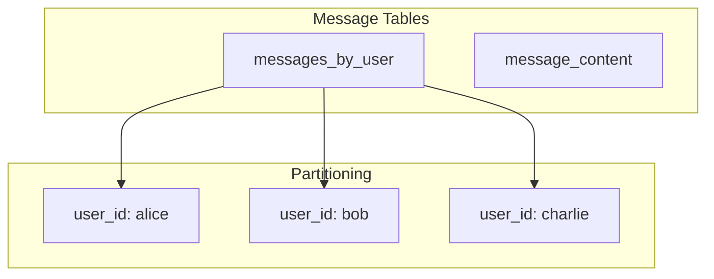
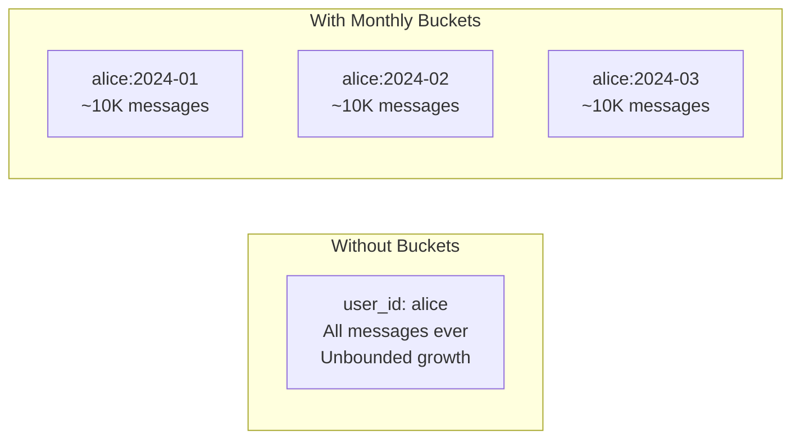
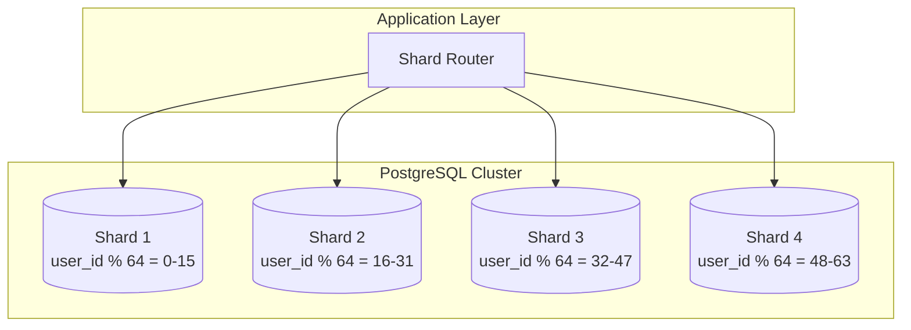
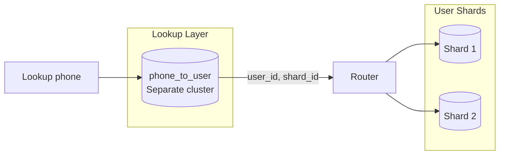
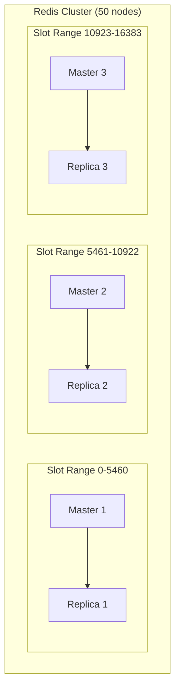
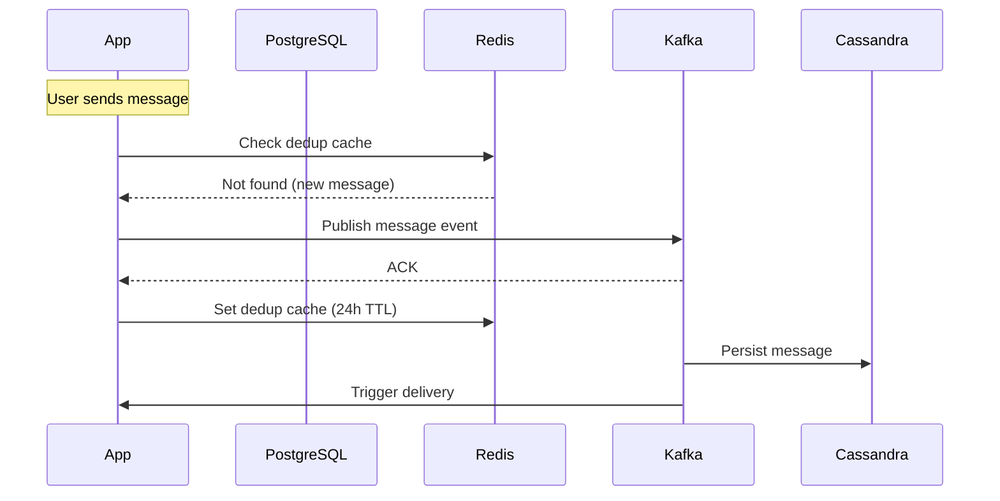
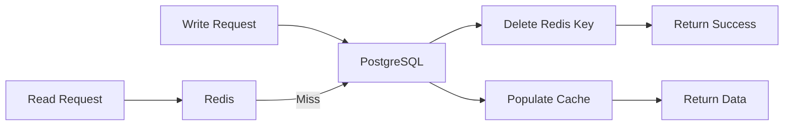

# Database Sharding

Data distribution strategies for WhatsApp-scale storage.

---

## Data Store Selection

| Data Type | Store | Rationale |
|-----------|-------|-----------|
| Messages | Cassandra | Write-heavy, time-series, linear scale |
| User profiles | PostgreSQL | Relational, ACID, complex queries |
| Presence | Redis | In-memory, TTL, pub/sub |
| Groups | PostgreSQL + Redis cache | Relational with high read cache |
| Media metadata | Cassandra | Append-only, scale with messages |
| Contacts | PostgreSQL | Relational (friend-of-friend queries) |

---

## Cassandra: Message Storage

### Data Model



### Schema Design

```cql
-- Messages indexed by recipient for inbox queries
CREATE TABLE messages_by_user (
    user_id         UUID,
    bucket          TEXT,           -- Monthly bucket: "2024-01"
    message_id      TIMEUUID,
    conversation_id UUID,
    sender_id       UUID,
    encrypted_content BLOB,
    message_type    TEXT,
    status          TEXT,           -- sent, delivered, read
    created_at      TIMESTAMP,
    PRIMARY KEY ((user_id, bucket), message_id)
) WITH CLUSTERING ORDER BY (message_id DESC);

-- Conversation view (for chat history)
CREATE TABLE messages_by_conversation (
    conversation_id UUID,
    bucket          TEXT,
    message_id      TIMEUUID,
    sender_id       UUID,
    encrypted_content BLOB,
    created_at      TIMESTAMP,
    PRIMARY KEY ((conversation_id, bucket), message_id)
) WITH CLUSTERING ORDER BY (message_id DESC);
```

### Partition Strategy



**Why buckets?**
- Prevent partition hotspots
- Efficient range queries within bucket
- Easy archival of old buckets
- Target: ~10K messages per partition

### Replication

```yaml
Replication Strategy: NetworkTopologyStrategy
  us-east: 3
  eu-west: 3
  ap-south: 3

Consistency:
  Writes: LOCAL_QUORUM
  Reads: LOCAL_QUORUM
```

---

## PostgreSQL: User Data

### Sharding Strategy



### Shard Key Selection

| Table | Shard Key | Rationale |
|-------|-----------|-----------|
| users | user_id | Natural distribution |
| contacts | owner_user_id | Colocate with owner |
| devices | user_id | Colocate with user |
| blocked_users | blocker_user_id | Colocate with blocker |

### Schema (Per Shard)

```sql
CREATE TABLE users (
    user_id         UUID PRIMARY KEY,
    phone_number    VARCHAR(20) UNIQUE,
    display_name    VARCHAR(100),
    profile_photo   TEXT,
    about           TEXT,
    last_seen_privacy VARCHAR(20),
    created_at      TIMESTAMPTZ,
    updated_at      TIMESTAMPTZ
);

CREATE TABLE contacts (
    owner_user_id   UUID REFERENCES users(user_id),
    contact_user_id UUID,
    display_name    VARCHAR(100),      -- Custom name
    is_blocked      BOOLEAN DEFAULT FALSE,
    created_at      TIMESTAMPTZ,
    PRIMARY KEY (owner_user_id, contact_user_id)
);

CREATE TABLE devices (
    device_id       UUID PRIMARY KEY,
    user_id         UUID REFERENCES users(user_id),
    device_type     VARCHAR(20),       -- ios, android, web
    push_token      TEXT,
    identity_key    BYTEA,
    signed_prekey   BYTEA,
    created_at      TIMESTAMPTZ,
    last_active_at  TIMESTAMPTZ
);
```

### Cross-Shard Queries

**Problem:** Find user by phone number (global lookup).

**Solution:** Phone number lookup table:



---

## Redis: Caching & Presence

### Cluster Topology



### Key Design

```
Prefix-based organization:

presence:{user_id}          -> Online/offline state
last_seen:{user_id}         -> Last seen timestamp
typing:{conv_id}:{user_id}  -> Typing indicator
session:{user_id}:{device}  -> Session cache
dedup:msg:{message_id}      -> Message deduplication
group:{group_id}:members    -> Group member list (SET)
user:{user_id}:groups       -> User's groups (SET)
```

### Eviction Policy

```
Hot data (TTL-based eviction):
- presence: 45s TTL
- typing: 5s TTL
- dedup: 24h TTL

Cached data (LRU eviction):
- session: LRU when memory pressure
- group members: Refresh on access
```

---

## Group Storage

### Hybrid Approach

```mermaid
graph LR
    subgraph "PostgreSQL (Source of Truth)"
        Groups[(groups table)]
        Members[(group_members table)]
    end

    subgraph "Redis (Cache)"
        GCache[group:{id}:info]
        MCache[group:{id}:members]
    end

    subgraph "Cassandra (Messages)"
        GMsgs[messages_by_group]
    end

    Groups --> GCache
    Members --> MCache
    GCache --> GMsgs
```

### PostgreSQL Schema

```sql
CREATE TABLE groups (
    group_id        UUID PRIMARY KEY,
    name            VARCHAR(100),
    description     TEXT,
    photo           TEXT,
    created_by      UUID,
    created_at      TIMESTAMPTZ,
    settings        JSONB               -- Admin-only messaging, etc.
);

CREATE TABLE group_members (
    group_id        UUID REFERENCES groups(group_id),
    user_id         UUID,
    role            VARCHAR(20),        -- admin, member
    joined_at       TIMESTAMPTZ,
    invited_by      UUID,
    PRIMARY KEY (group_id, user_id)
);

CREATE INDEX idx_group_members_user ON group_members(user_id);
```

### Group Sharding

Groups sharded by `group_id`:
- All members colocated with group
- Member lookup by user requires cross-shard query or inverted index

**Inverted index (separate table):**

```sql
CREATE TABLE user_groups (
    user_id     UUID,
    group_id    UUID,
    PRIMARY KEY (user_id, group_id)
);
-- Sharded by user_id, colocated with user data
```

---

## Data Consistency

### Write Patterns



### Cache Invalidation

**Pattern:** Write-through + TTL



---

## Capacity Planning

### Cassandra Sizing

```
Messages per day: 100 billion
Average message size: 1 KB (encrypted)
Daily write volume: 100 TB

Replication factor: 3
Compaction overhead: 2x
Daily storage need: 100 TB * 3 * 2 = 600 TB

Retention: Indefinite
Monthly growth: ~3 PB

Node capacity: 2 TB usable
Nodes needed: 1500+ (growing monthly)
```

### PostgreSQL Sizing

```
Users: 1 billion
User record: 5 KB average
Total user data: 5 TB

Shards: 64
Per-shard size: ~80 GB
Per-shard with indexes: ~200 GB

Node spec: 500 GB SSD, 64 GB RAM
```

### Redis Sizing

```
Concurrent users: 100 million
Presence entry: 100 bytes
Presence memory: 10 GB

Dedup cache (24h window):
  Messages per day: 100 billion
  Entry size: 50 bytes
  Memory: 5 TB (clustered)

Total Redis cluster: ~5 TB RAM
Nodes (256 GB each): ~20 nodes
```

---

## Failure Handling

### Cassandra Node Failure

- Quorum writes ensure durability
- Read repair on queries
- Replacement node streams data from replicas
- No data loss, temporary capacity reduction

### PostgreSQL Shard Failure

- Streaming replica promotes
- Connection pool retries
- < 30 second failover

### Redis Node Failure

- Cluster promotes replica
- Clients redirect automatically
- Presence data regenerated on reconnect
- Cache data refilled from source
