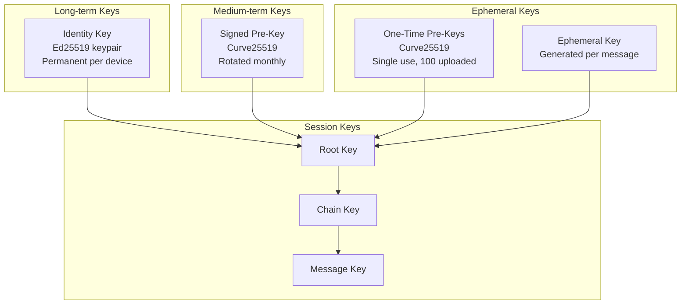
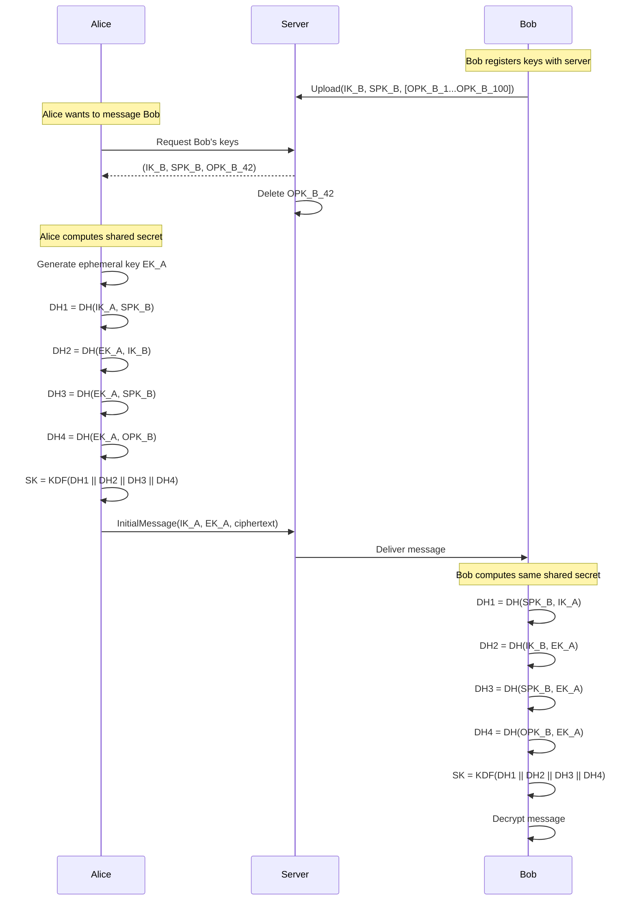
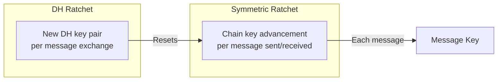
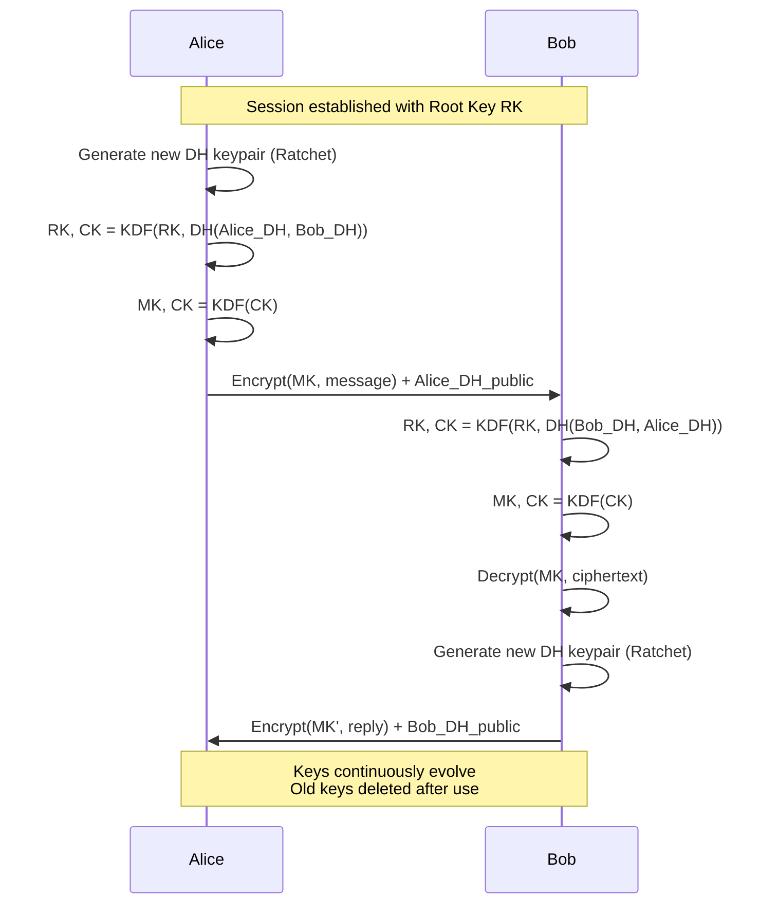
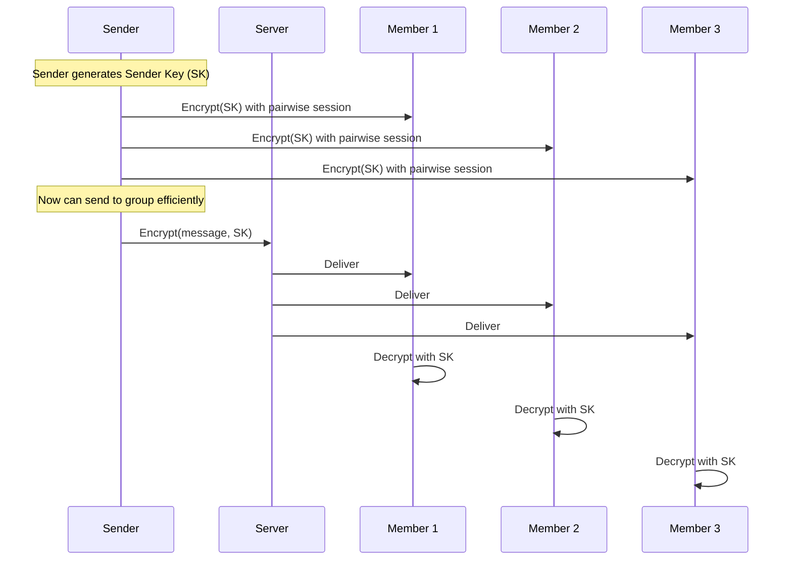
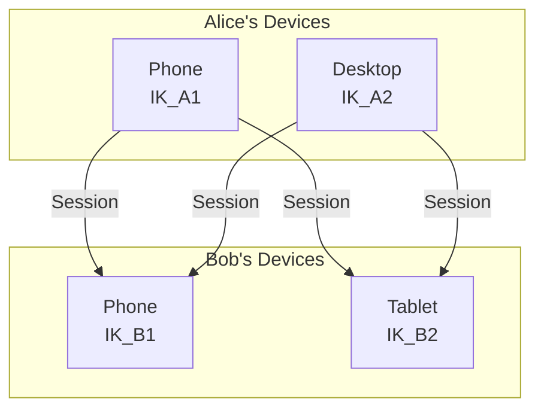

# End-to-End Encryption

Signal Protocol implementation for WhatsApp-scale messaging.

---

## Design Principles

1. **Zero server knowledge**: Server cannot read message content
2. **Forward secrecy**: Compromised key doesn't expose past messages
3. **Future secrecy**: Compromised key doesn't expose future messages
4. **Deniability**: Messages can't be cryptographically proven to originate from sender

---

## Signal Protocol Overview

### Key Types



---

## Key Exchange (X3DH)

Initial session establishment between Alice and Bob:



---

## Double Ratchet Algorithm

Provides forward and future secrecy through continuous key evolution.

### Ratchet Types



### How It Works



---

## Group Encryption

Groups use Sender Keys for efficiency.

### Sender Key Distribution



### Sender Key Rotation

Rotate sender key when:
- Member leaves group
- Member's device changes
- Periodic rotation (e.g., every 100 messages)

---

## Key Storage

### Client-Side

```
Device Storage (encrypted with device PIN/biometric):
├── identity_keypair        # Never leaves device
├── signed_prekey           # Current + previous
├── one_time_prekeys[]      # Unused pool
├── sessions/
│   ├── {user_id}/
│   │   ├── {device_id}/
│   │   │   ├── root_key
│   │   │   ├── chain_key
│   │   │   └── message_keys[]
│   │   └── ...
│   └── ...
└── sender_keys/
    └── {group_id}/
        └── {sender_id}     # Sender keys from others
```

### Server-Side

```
Server stores only public keys:
├── users/
│   └── {user_id}/
│       └── devices/
│           └── {device_id}/
│               ├── identity_key_public
│               ├── signed_prekey_public
│               ├── signed_prekey_signature
│               └── one_time_prekeys_public[]
```

---

## Multi-Device Support

Each device has independent identity:



**Sending to Bob:**
1. Fetch all of Bob's device keys
2. Encrypt message with each device's session
3. Send all encrypted copies in one message

---

## Security Verification

### Safety Number

```
Concatenate and hash:
  SHA256(Alice_IK_public || Bob_IK_public)

Display as:
  60 digits grouped: 12345 67890 12345...

Or QR code containing both identity keys
```

Users can verify out-of-band to detect MITM.

---

## Threat Model

### Protected Against

| Threat | Protection |
|--------|------------|
| Server reading messages | E2E encryption |
| Past message exposure | Forward secrecy (key ratcheting) |
| Future message exposure | Future secrecy (key ratcheting) |
| Man-in-the-middle | Safety number verification |

### Not Protected Against

| Threat | Limitation |
|--------|------------|
| Compromised device | Keys stored on device |
| Metadata analysis | Server sees who messages whom |
| Sender/recipient identities | Not hidden from server |
| Message timing | Visible to server |

---

## Implementation Notes

### Cryptographic Primitives

| Purpose | Algorithm |
|---------|-----------|
| Identity keys | Ed25519 |
| Key agreement | X25519 (Curve25519) |
| Message encryption | AES-256-GCM |
| Key derivation | HKDF-SHA256 |
| Signatures | Ed25519 |

### Performance Considerations

- Pre-generate one-time keys in batches
- Cache session state
- Batch sender key distribution
- Lazy session establishment (on first message)
