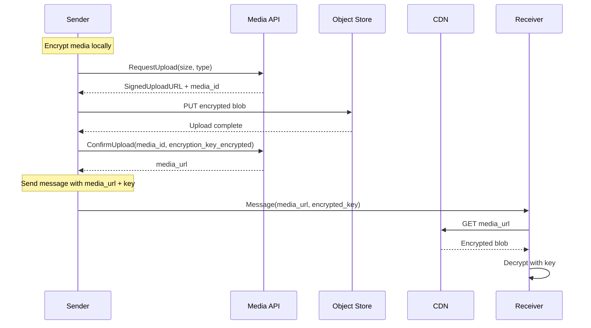
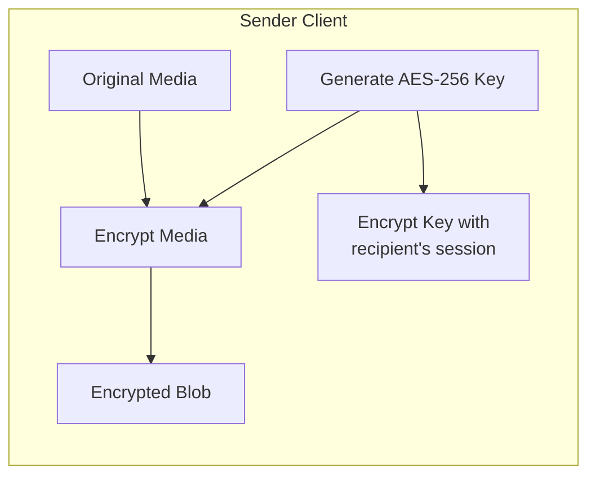
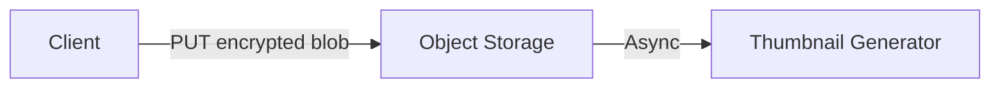
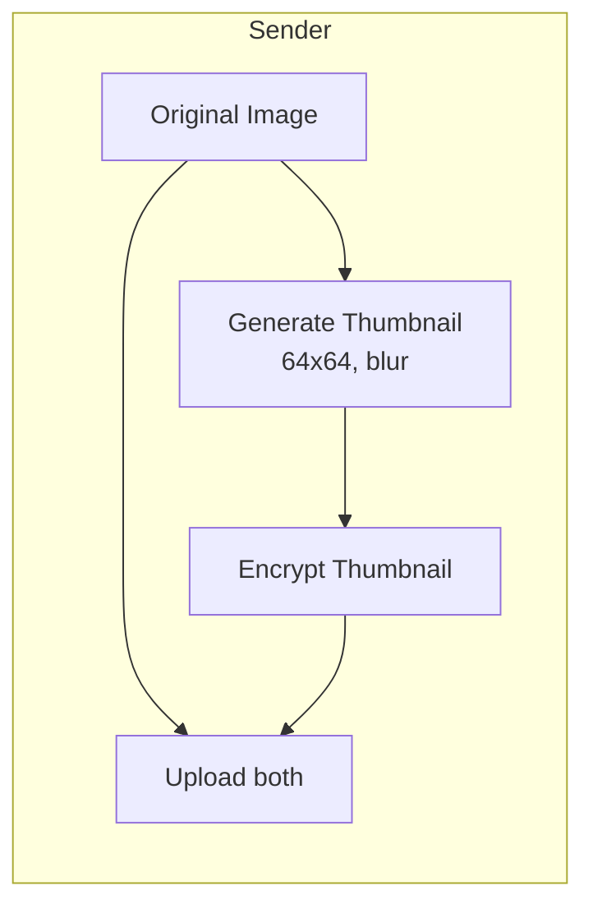
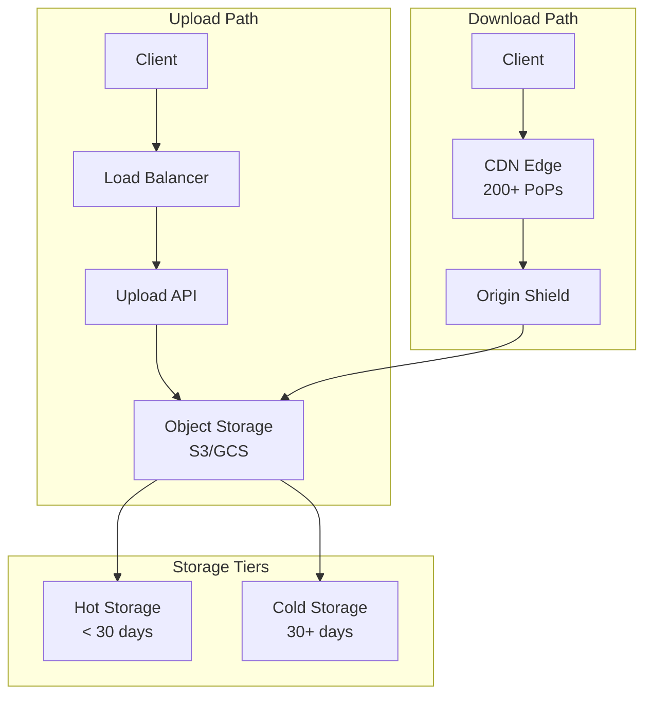
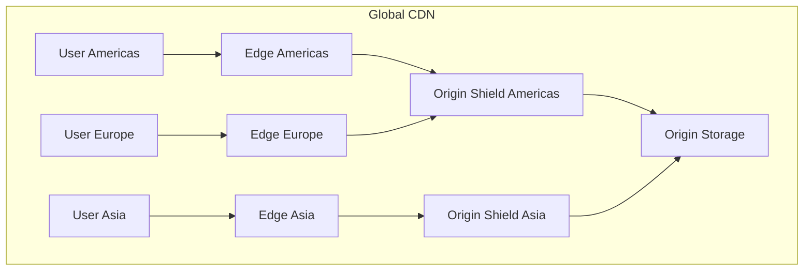
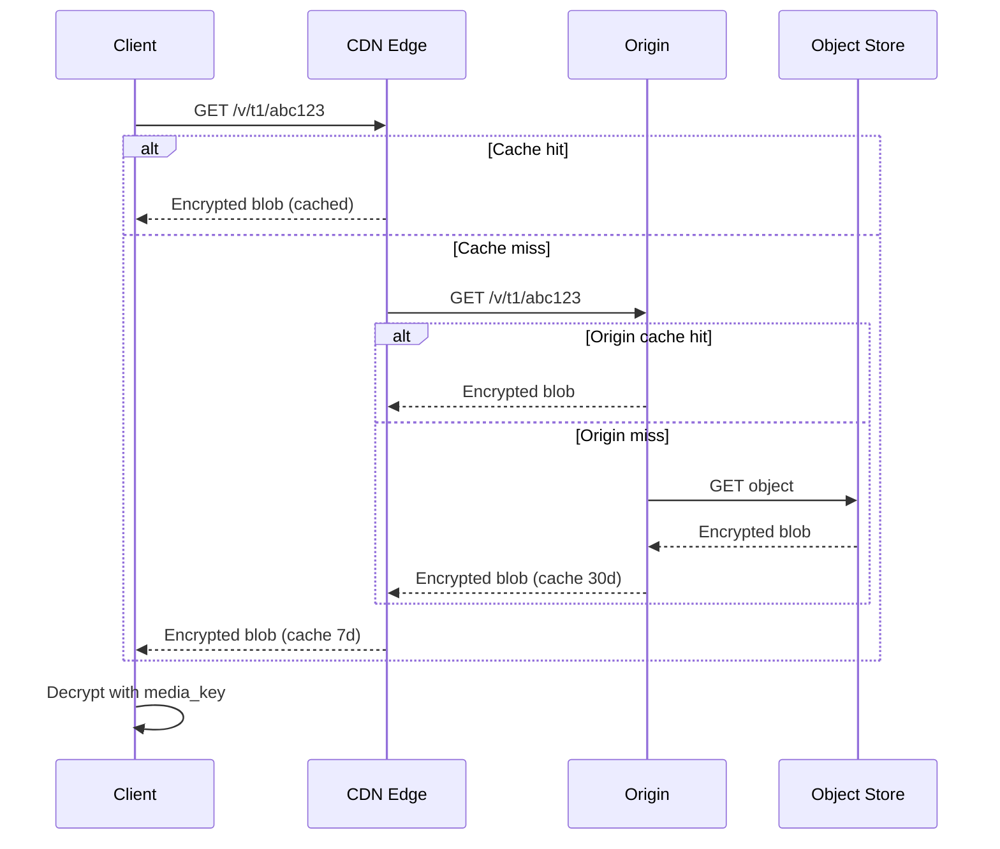
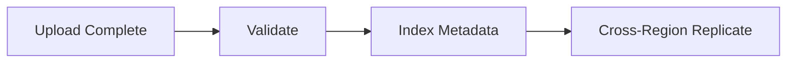

# Media Storage

Upload, storage, and delivery of encrypted media at WhatsApp scale.

---

## Design Principles

1. **Client-side encryption**: Media encrypted before upload
2. **Direct upload**: Bypass servers, upload directly to storage
3. **CDN delivery**: Edge caching for fast downloads
4. **Efficient thumbnails**: Low-bandwidth previews

---

## Media Flow Overview



---

## Client-Side Encryption

### Process



### Media Encryption Format

```
Encrypted media structure:
├── Header (16 bytes)
│   ├── magic: "WAMEDIA1"
│   └── version: 1
├── IV (16 bytes)
├── Encrypted content (AES-256-CBC)
└── HMAC (32 bytes)

Encryption key bundle (sent in message):
├── media_key (32 bytes) - encrypted with session
├── file_sha256 (32 bytes) - integrity check
├── media_key_timestamp
└── direct_path (URL path)
```

---

## Upload Flow

### Step 1: Request Upload

```
POST /v1/media/upload/request
{
  "file_size": 1048576,
  "file_type": "image/jpeg",
  "file_hash": "sha256:abc123..."
}

Response:
{
  "media_id": "m_xyz789",
  "upload_url": "https://upload.whatsapp.net/...",
  "upload_expires": "2024-01-15T12:00:00Z"
}
```

### Step 2: Direct Upload



Upload URL is pre-signed:
- Valid for 5 minutes
- Includes file size limit
- Single-use

### Step 3: Confirm Upload

```
POST /v1/media/upload/confirm
{
  "media_id": "m_xyz789",
  "file_sha256": "abc123...",
  "thumbnail_base64": "..." // Optional client-generated
}

Response:
{
  "media_url": "https://cdn.whatsapp.net/v/t1/...",
  "thumbnail_url": "https://cdn.whatsapp.net/v/t1/.../thumb"
}
```

---

## Thumbnail Handling

### Client-Generated Thumbnails

For E2E encryption, server can't generate thumbnails from encrypted media.



**Thumbnail specs:**
- Max 64x64 pixels
- Heavily blurred (preview only)
- Encrypted with same key as media
- Inline in message for instant preview

### Thumbnail in Message

```
Message payload:
{
  "type": "image",
  "media_url": "https://cdn.../abc123",
  "thumbnail_base64": "data:image/jpeg;base64,...", // ~2KB
  "media_key": "encrypted_key...",
  "file_sha256": "...",
  "width": 1920,
  "height": 1080
}
```

---

## Storage Architecture



### Storage Tiers

| Tier | Age | Storage Class | Access |
|------|-----|--------------|--------|
| Hot | 0-30 days | Standard | Frequent |
| Cold | 30+ days | Infrequent Access | Rare |

### Retention

- Media retained indefinitely (per requirements)
- No server-side deletion (encrypted, server can't identify content)
- Client-side "delete for everyone" sends delete message, clients remove locally

---

## CDN Strategy

### Edge Caching



### Cache Rules

| Content Type | Edge TTL | Shield TTL |
|--------------|----------|------------|
| Media files | 7 days | 30 days |
| Thumbnails | 7 days | 30 days |
| Profile photos | 1 day | 7 days |

### Cache Invalidation

Media is immutable (encrypted, unique key per media), so:
- No invalidation needed for media files
- New upload = new URL
- Efficient caching

---

## Download Flow



---

## Media Processing

### Upload Processing Pipeline



**Validation:**
- File size matches declared
- Hash matches declared
- Valid encrypted format
- No malware scanning (encrypted, can't scan)

### No Server-Side Transcoding

Unlike unencrypted platforms:
- Server cannot transcode (content encrypted)
- Client responsible for format compatibility
- Client compresses before encryption

---

## Bandwidth Optimization

### Resumable Uploads

```
PUT /upload?uploadType=resumable
X-Upload-Offset: 5242880

If interrupted:
HEAD /upload/{upload_id}
-> X-Upload-Offset: 5242880

Resume:
PUT /upload/{upload_id}
X-Upload-Offset: 5242880
[remaining bytes]
```

### Progressive Download

For video playback:
- Encrypted in chunks
- Each chunk independently decryptable
- Range requests supported
- Start playback before full download

---

## Group Media

### Deduplication Challenge

Same image sent to group - can we deduplicate?

**Problem:** Each recipient has different session key, so media key is encrypted differently.

**Solution:** Store encrypted blob once, multiple key bundles:

```
Media blob: https://cdn.../abc123 (single copy)

Message to group:
{
  "media_url": "https://cdn.../abc123",
  "file_sha256": "same_for_all",
  "media_key_per_recipient": {
    "user_1": "encrypted_key_for_user_1",
    "user_2": "encrypted_key_for_user_2",
    ...
  }
}
```

Actually: Use sender keys for groups, so one encrypted blob, one key distribution.

---

## Monitoring

| Metric | Alert Threshold |
|--------|-----------------|
| Upload success rate | < 99% |
| Upload p99 latency (1MB) | > 5s |
| Download p99 latency (1MB) | > 2s |
| CDN cache hit rate | < 80% |
| Storage growth rate | > 10% week-over-week |
| Cross-region replication lag | > 30 minutes |
