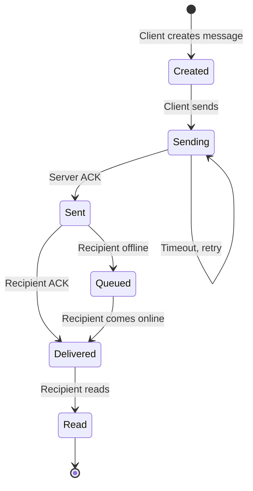
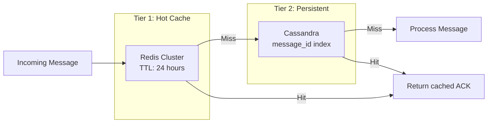
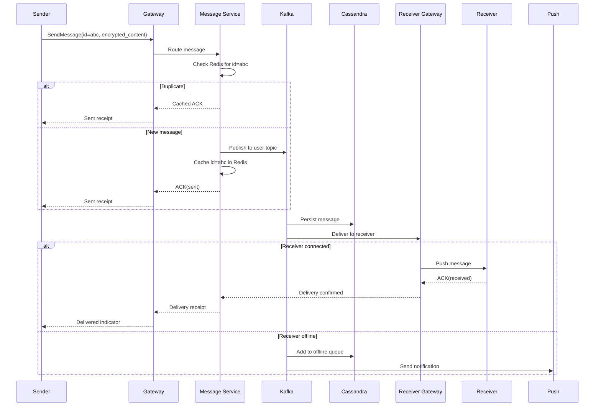
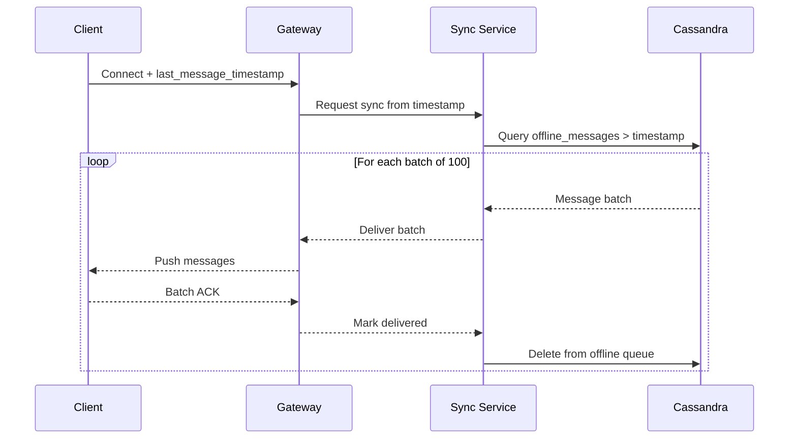

# Message Delivery System

Exactly-once message delivery at WhatsApp scale.

---

## The Challenge

At 1.2M messages/second with global distribution:
- Network failures are constant
- Client disconnections are frequent
- Duplicate sends must not duplicate messages
- Lost messages are unacceptable

---

## Exactly-Once Delivery Design

### Three Guarantees

1. **At-least-once send**: Client retries until ACK received
2. **Server deduplication**: Same message ID processed only once
3. **At-least-once receive**: Server retries until delivery ACK

Combined: **Exactly-once semantics**

---

## Message Lifecycle



---

## Message ID Design

**Format:** `{sender_device_id}:{timestamp_ms}:{sequence}:{random}`

Example: `d7f3a2b1:1706745600000:00042:x9k2`

**Properties:**
- Globally unique without coordination
- Client-generated (works offline)
- Sortable by time (roughly)
- Collision probability: effectively zero

---

## Deduplication Strategy

### Two-Tier Deduplication



**Cache Entry:**
```
Key: msg:{message_id}
Value: {status: "sent", ack_payload: {...}}
TTL: 24 hours
```

### Why Two Tiers?

| Tier | Purpose | Trade-off |
|------|---------|-----------|
| Redis | Fast lookup for recent messages | Memory cost |
| Cassandra | Persistent for retries after cache expiry | Slower lookup |

Most duplicates arrive within seconds (retry storms), so Redis catches 99%+.

---

## Ordering Guarantees

### Per-Conversation Ordering

Messages within a conversation are ordered by:
1. Server receive timestamp (assigned on first valid receipt)
2. Message ID as tiebreaker

**Causal ordering for replies:**
- Reply messages include `reply_to_message_id`
- Client displays reply after referenced message
- Server doesn't enforce, client handles display

### Cross-Conversation

No ordering guarantees across different conversations.

---

## Delivery Flow



---

## Retry Policies

### Client-Side Retries

```
Attempt 1: Immediate
Attempt 2: 1 second
Attempt 3: 2 seconds
Attempt 4: 4 seconds
Attempt 5: 8 seconds
... exponential backoff up to 5 minutes
```

**Same message ID on every retry** - critical for deduplication.

### Server-Side Delivery Retries

For delivery to connected recipients:

```
Attempt 1: Immediate
Attempt 2: 100ms
Attempt 3: 500ms
Then: Move to offline queue
```

---

## Offline Queue

### Structure

```
Table: offline_messages
Partition key: recipient_user_id
Clustering key: (priority, timestamp)

Columns:
- message_id
- sender_id
- encrypted_content
- timestamp
- priority (high for mentions, normal otherwise)
```

### Sync Protocol

When user comes online:



---

## Handling Edge Cases

### Split Brain

If message processed by two data centers:
- Both check/write to same Redis cluster (cross-DC)
- First write wins
- Second sees duplicate, returns cached ACK

### Clock Skew

- Server assigns receive timestamp, not client
- Message ID uniqueness doesn't depend on clock
- Ordering uses server timestamp only

### Message Stuck in Queue

- TTL on offline messages: none (per requirements)
- Monitoring for queue depth per user
- Alert if queue exceeds threshold (potential inactive user)

---

## Monitoring Metrics

| Metric | Alert Threshold |
|--------|-----------------|
| Duplicate rate | > 1% (retry storm indicator) |
| Delivery latency p99 | > 100ms |
| Offline queue depth | > 10K per user |
| Dedup cache hit rate | < 95% |
| Message loss rate | > 0 (critical) |
