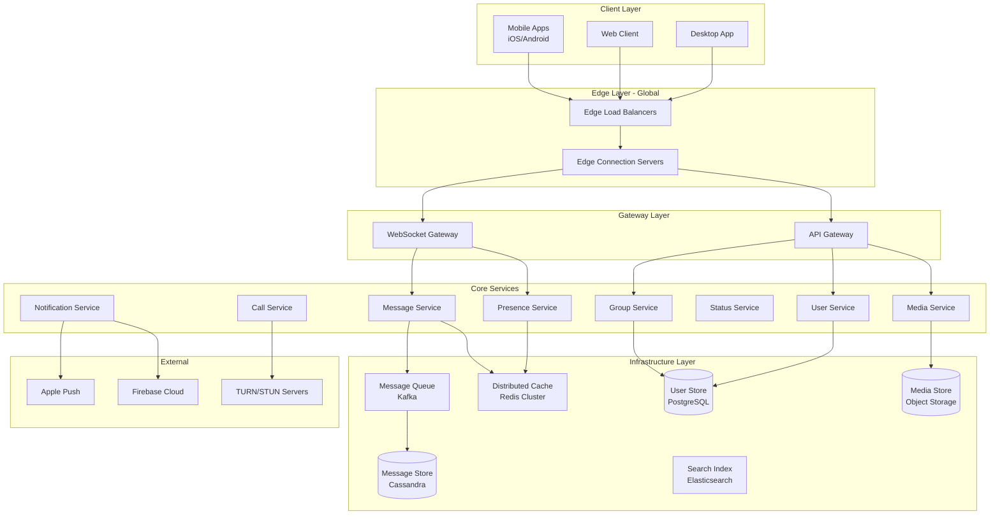
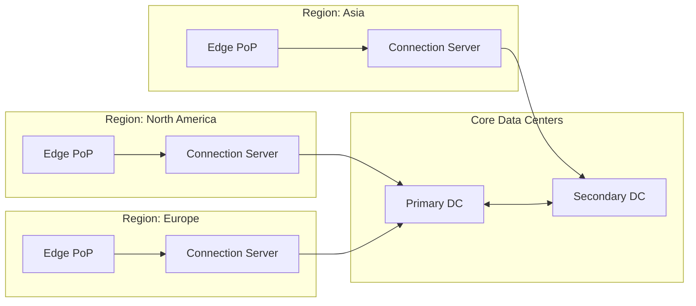
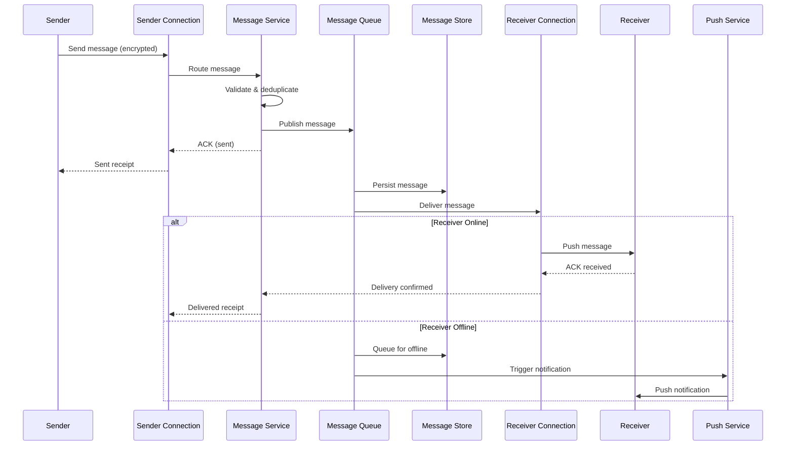
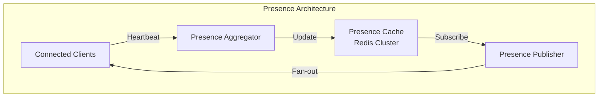
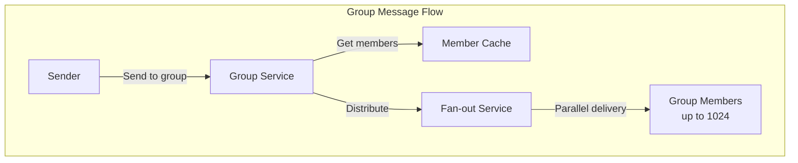
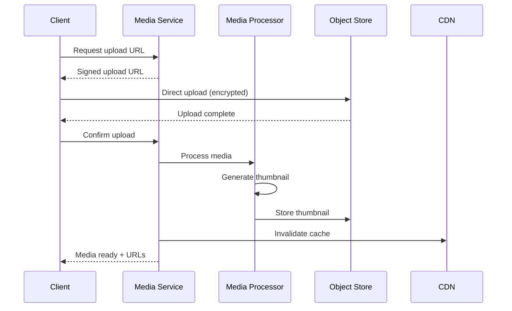
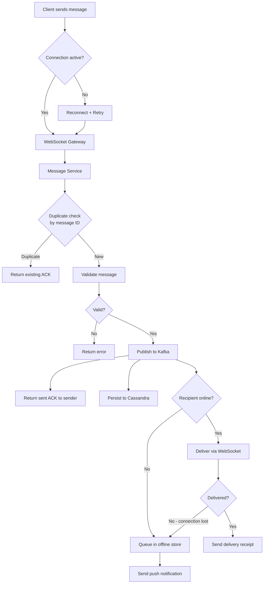
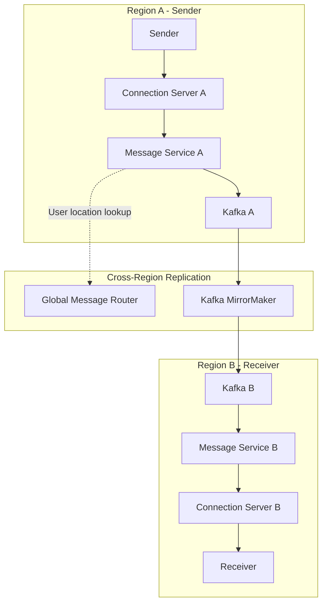
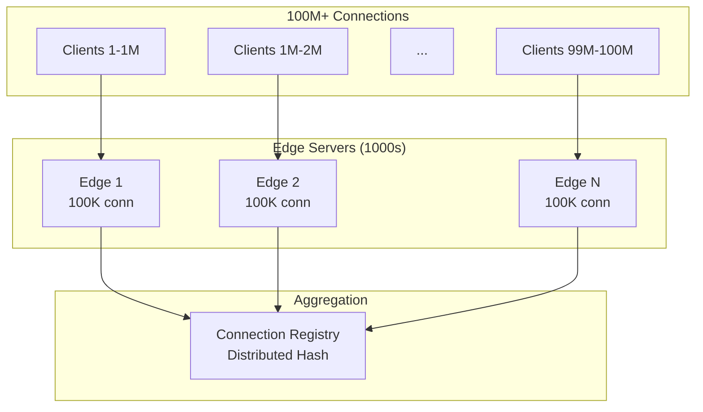
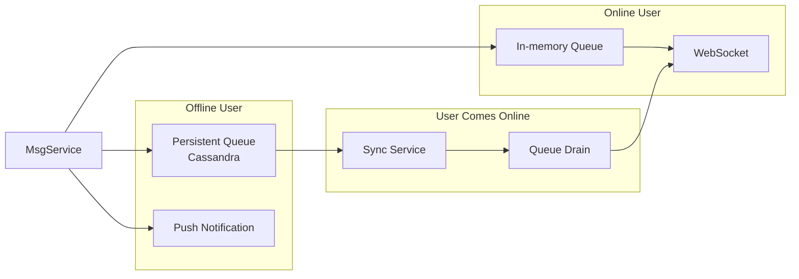

# WhatsApp System Design Plan

**Date:** 2026-02-01
**Requirements:** [requirements.md](../requirements.md)

---

## Table of Contents
1. [High-Level Architecture](#high-level-architecture)
2. [Core Components](#core-components)
3. [Data Flow](#data-flow)
4. [Key Design Decisions](#key-design-decisions)
5. [Supporting Documentation](#supporting-documentation)

---

## High-Level Architecture



---

## Core Components

### 1. Edge Layer

**Purpose:** Terminate client connections close to users globally, reduce latency.



| Component | Responsibility |
|-----------|---------------|
| Edge PoP | TLS termination, connection routing, DDoS protection |
| Connection Server | WebSocket management, connection state, heartbeats |

### 2. Message Service

**Purpose:** Handle all message operations - send, receive, acknowledge, store.



**Key Design Points:**
- Messages identified by client-generated UUID for idempotency
- Server stores encrypted blob, cannot read content
- Delivery receipts propagated back to sender
- See: [message-delivery.md](../message-delivery.md)

### 3. Presence Service

**Purpose:** Track user online/offline status, last seen, typing indicators.



| State | Meaning |
|-------|---------|
| Online | Active connection, recent activity |
| Away | Connected but idle > 5 min |
| Offline | No connection, show last seen |
| Typing | Actively typing in conversation |

**Challenges at Scale:**
- 100M+ concurrent connections tracking status
- Fan-out to contacts when status changes
- See: [presence-system.md](../presence-system.md)

### 4. Group Service

**Purpose:** Manage group metadata, membership, permissions, message fan-out.



**Group Size Tiers:**
| Tier | Size | Fan-out Strategy |
|------|------|------------------|
| Small | 2-50 | Direct fan-out |
| Medium | 51-256 | Batched fan-out |
| Large | 257-1024 | Async queue-based |

### 5. Media Service

**Purpose:** Handle upload, processing, storage, and delivery of media files.



**Storage Strategy:**
- Client encrypts media before upload
- Server stores encrypted blobs
- Thumbnails generated from encrypted preview data sent by client
- See: [media-storage.md](../media-storage.md)

### 6. Call Service

**Purpose:** Establish and manage voice/video calls using WebRTC.

```mermaid
sequenceDiagram
    participant CallerApp as Caller
    participant Signaling as Signaling Server
    participant TURN as TURN Server
    participant CalleeApp as Callee

    CallerApp->>Signaling: Initiate call
    Signaling->>CalleeApp: Incoming call (push if offline)
    CalleeApp-->>Signaling: Accept call
    Signaling-->>CallerApp: Call accepted

    CallerApp->>Signaling: SDP Offer
    Signaling->>CalleeApp: SDP Offer
    CalleeApp->>Signaling: SDP Answer
    Signaling->>CallerApp: SDP Answer

    CallerApp->>TURN: ICE Candidates
    CalleeApp->>TURN: ICE Candidates

    CallerApp<-->CalleeApp: P2P Media Stream<br/>(or via TURN relay)
```

**Call Types:**
| Type | Max Participants | Topology |
|------|-----------------|----------|
| 1:1 Voice | 2 | P2P preferred |
| 1:1 Video | 2 | P2P preferred |
| Group Voice | 32 | SFU (Selective Forwarding) |
| Group Video | 8 | SFU |

---

## Data Flow

### Message Send Flow (Detailed)



### Cross-Region Message Routing



---

## Key Design Decisions

### D1: Exactly-Once Delivery

**Approach:** Client-generated message IDs + server-side deduplication + ACK protocol

**How it works:**
1. Client generates UUID for each message
2. Server checks UUID against recent message cache (Redis)
3. If duplicate, returns cached ACK
4. If new, processes and stores
5. Client retries with same UUID on timeout
6. Receiver ACKs message ID, server marks delivered

**Trade-offs:**
- Requires deduplication cache at scale (memory cost)
- Clock skew doesn't affect correctness
- See: [message-delivery.md](../message-delivery.md)

### D2: End-to-End Encryption

**Approach:** Signal Protocol (Double Ratchet Algorithm)

**Key Components:**
1. Identity Key - Long-term public key per device
2. Signed Pre-Key - Medium-term key, rotated periodically
3. One-Time Pre-Keys - Single-use keys for initial key exchange
4. Session Keys - Derived per conversation, ratchet forward

**Server Role:**
- Store encrypted messages (opaque blobs)
- Distribute public keys for key exchange
- Cannot decrypt any message content

See: [encryption.md](../encryption.md)

### D3: Connection Management at Scale

**Approach:** Hierarchical connection handling with edge presence



**Per Edge Server:**
- ~100K concurrent WebSocket connections
- Heartbeat every 30 seconds
- Connection state in local memory
- Report to central registry on connect/disconnect

### D4: Message Storage

**Approach:** Cassandra for messages, PostgreSQL for users

| Data Type | Storage | Rationale |
|-----------|---------|-----------|
| Messages | Cassandra | Write-heavy, time-series, horizontal scale |
| User profiles | PostgreSQL | Relational, consistent reads |
| Presence | Redis | In-memory, TTL-based |
| Media | Object Storage + CDN | Large blobs, geographic distribution |
| Group membership | PostgreSQL + Cache | Relational with heavy caching |

**Message Partitioning:**
- Partition key: `user_id` (recipient)
- Clustering key: `timestamp DESC`
- Each user's messages colocated for efficient retrieval

### D5: Offline Message Handling

**Approach:** Persistent queue per user with indefinite retention



**Sync Protocol:**
1. Client connects, sends last received message ID
2. Server queries messages after that ID
3. Batch delivery with pagination
4. Client ACKs each batch
5. Server removes delivered messages from queue

---

## Supporting Documentation

Detailed design for complex topics:

| Document | Topic |
|----------|-------|
| [message-delivery.md](../message-delivery.md) | Exactly-once delivery, ordering, deduplication |
| [encryption.md](../encryption.md) | Signal Protocol, key management, group encryption |
| [presence-system.md](../presence-system.md) | Online status at scale, typing indicators |
| [media-storage.md](../media-storage.md) | Upload flow, CDN, client-side encryption |
| [database-sharding.md](../database-sharding.md) | Cassandra partitioning, PostgreSQL sharding |

---

## Capacity Estimates

### Storage

| Data Type | Calculation | Daily | Monthly |
|-----------|-------------|-------|---------|
| Messages | 100B msgs × 1KB avg | 100 TB | 3 PB |
| Media | 1B uploads × 500KB avg | 500 TB | 15 PB |
| User data | 1B users × 10KB | - | 10 TB |

### Throughput

| Metric | Calculation | Rate |
|--------|-------------|------|
| Messages/sec | 100B / 86400 | ~1.2M/sec |
| Media uploads/sec | 1B / 86400 | ~12K/sec |
| WebSocket connections | 100M concurrent | - |

### Network

| Flow | Bandwidth |
|------|-----------|
| Message ingress | ~1.2 GB/sec |
| Message egress | ~2.4 GB/sec (fan-out) |
| Media ingress | ~6 GB/sec |
| Media egress (CDN) | ~50+ GB/sec |

---

## Failure Scenarios

### Edge Server Failure
- Clients detect via heartbeat timeout
- Reconnect to different edge via DNS/load balancer
- Resume with last message ID sync

### Message Service Failure
- Kafka provides durability
- Consumer groups rebalance
- Unprocessed messages replayed

### Database Failure
- Cassandra: multi-DC replication, quorum writes
- PostgreSQL: streaming replication, automatic failover

### Cross-Region Partition
- Each region can operate independently
- Messages queue for cross-region delivery
- Eventual consistency on reconnect

---

## Next Steps

1. Deep dive into [message-delivery.md](../message-delivery.md) - exactly-once semantics
2. Design [encryption.md](../encryption.md) - Signal Protocol implementation
3. Detail [presence-system.md](../presence-system.md) - handling 100M+ connections
4. Specify [database-sharding.md](../database-sharding.md) - data distribution strategy
