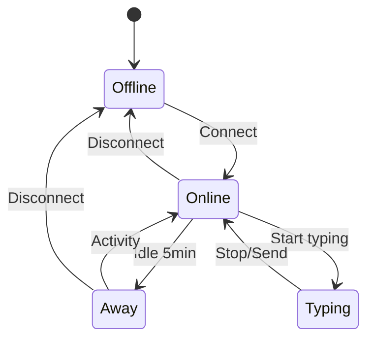
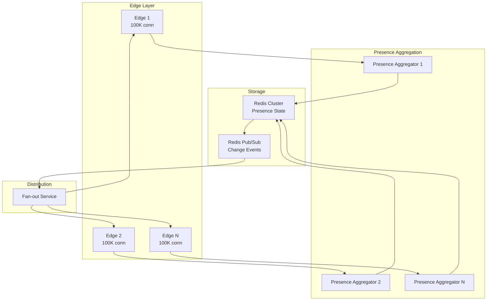
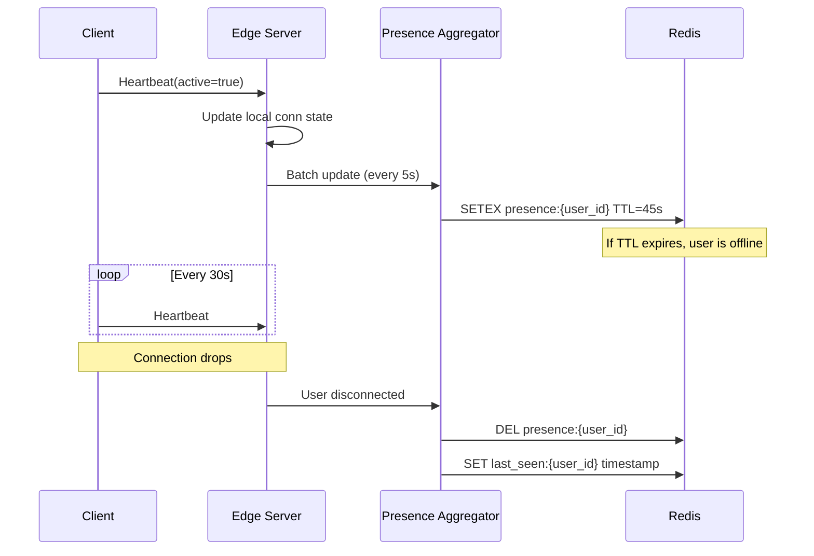
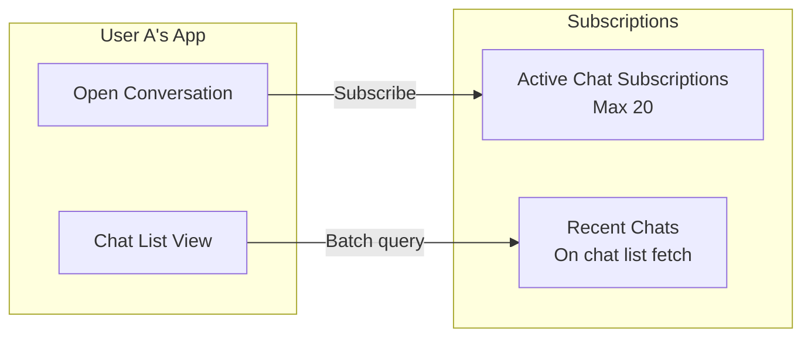
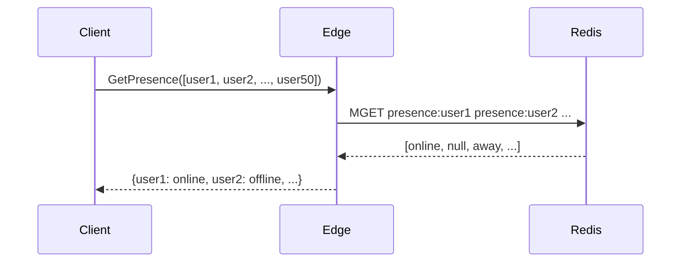
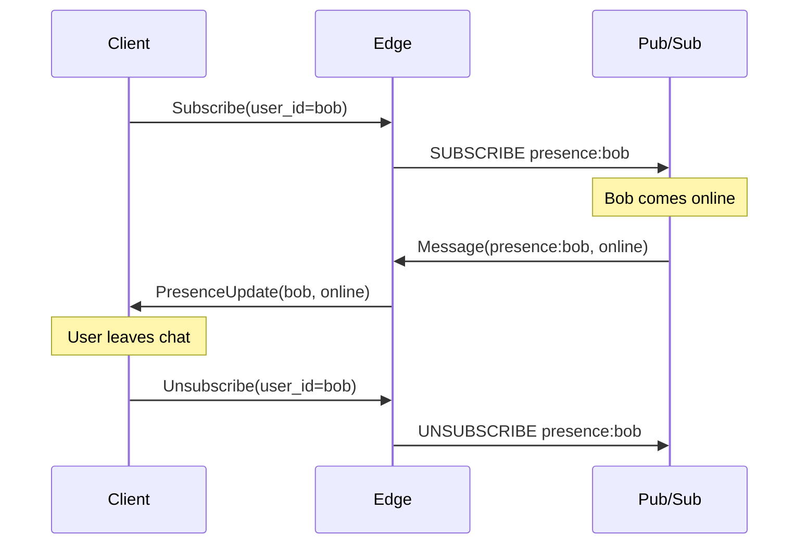
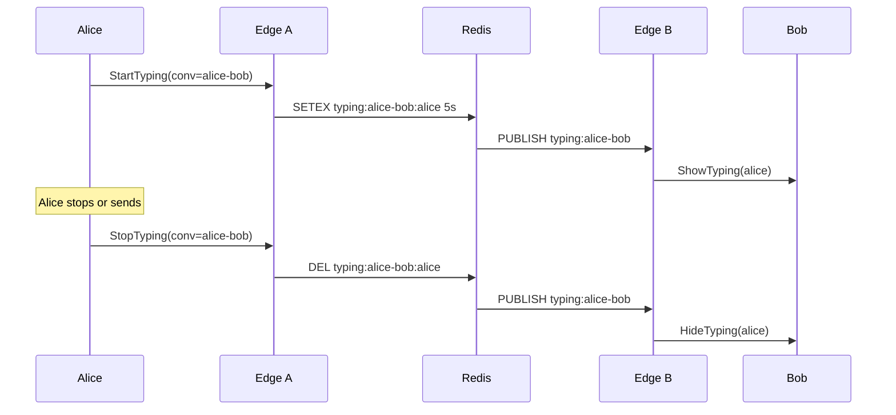
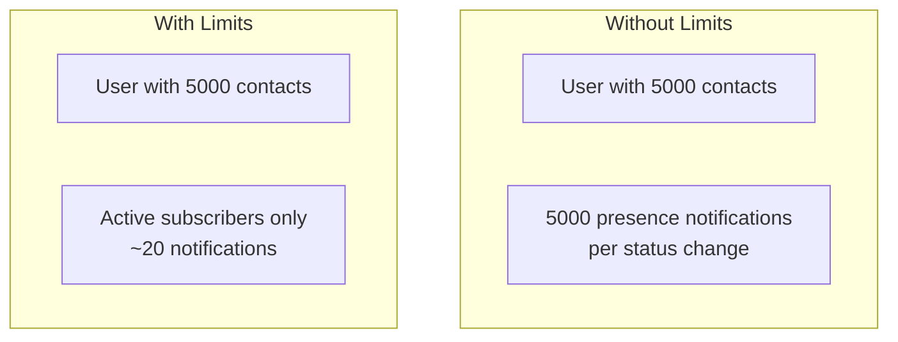
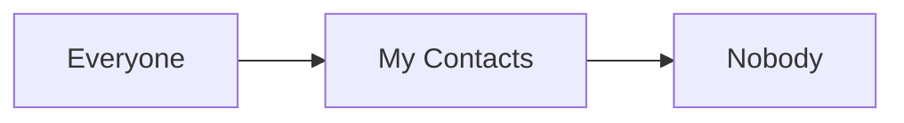

# Presence System

Tracking online status, last seen, and typing indicators at 100M+ concurrent connections.

---

## Presence States



| State | Meaning | TTL |
|-------|---------|-----|
| Online | Active connection, recent activity | Heartbeat-based |
| Away | Connected but idle | After 5 min inactivity |
| Offline | No connection | Show last seen timestamp |
| Typing | Actively typing | 5 seconds TTL |

---

## Architecture



---

## Heartbeat Protocol

### Client Behavior

```
Every 30 seconds:
  - Send heartbeat with current state
  - Include activity flag (user recently active)

On activity:
  - Send immediate heartbeat if state changed

On disconnect:
  - Server detects via TCP keepalive or timeout
```

### Server Handling



---

## Presence Data Model

### Redis Schema

```
# Current presence (volatile)
presence:{user_id}
  Type: Hash
  Fields:
    - state: "online" | "away"
    - edge_id: "edge-west-42"
    - connected_at: timestamp
  TTL: 45 seconds (refreshed by heartbeat)

# Last seen (persistent)
last_seen:{user_id}
  Type: String
  Value: Unix timestamp
  TTL: none

# Typing indicator (very volatile)
typing:{conversation_id}:{user_id}
  Type: String
  Value: "1"
  TTL: 5 seconds
```

---

## Subscription Model

### Problem

User A has 500 contacts. Subscribing to all 500 presence updates = massive fan-out.

### Solution: Active Conversation Subscription



**Rules:**
1. Subscribe to presence only for open conversations
2. Max 20 concurrent subscriptions per client
3. Batch query presence when rendering chat list (not subscribe)
4. Unsubscribe when leaving conversation

---

## Presence Query vs Subscribe

### Query (Pull)

For chat list rendering:



### Subscribe (Push)

For active conversations:



---

## Typing Indicators

### Flow



### Optimizations

- Debounce on client: Only send after 500ms of typing
- Coalesce on server: Batch typing updates
- Auto-expire: 5s TTL handles forgotten cleanup
- Rate limit: Max 1 update per second per user per conversation

---

## Scaling Considerations

### Connection Distribution

| Entity | Count | Strategy |
|--------|-------|----------|
| Users | 100M concurrent | - |
| Edge servers | 1,000 | 100K connections each |
| Presence aggregators | 100 | Consistent hash by user_id |
| Redis cluster | 50 nodes | Sharded by user_id |

### Batching

Edge servers batch presence updates to aggregators:
- Collect updates for 5 seconds
- Send batch to reduce network calls
- Accept up to 5s staleness in presence

### Fan-out Limiting



---

## Privacy Controls

### Last Seen Settings



### Implementation

```
User settings:
  last_seen_visibility: "everyone" | "contacts" | "nobody"

On presence query:
  if target.last_seen_visibility == "nobody":
    return null
  if target.last_seen_visibility == "contacts":
    if requester not in target.contacts:
      return null
  return last_seen
```

---

## Failure Handling

### Edge Server Crash

1. All connections on that edge drop
2. Other edges see heartbeat timeout
3. Users reconnect to different edge (DNS/LB)
4. New edge updates presence

### Redis Node Failure

1. Redis Cluster handles failover
2. Presence data on failed node lost
3. Clients re-establish presence on reconnect
4. Brief inconsistency acceptable (presence is soft state)

### Network Partition

- Presence may show stale (user appears online when offline)
- Heartbeat timeout eventually corrects
- Design for eventual consistency

---

## Monitoring

| Metric | Alert Threshold |
|--------|-----------------|
| Presence update latency p99 | > 500ms |
| Subscription fan-out count | > 1000 per update |
| Redis cluster memory usage | > 80% |
| Stale presence (missed heartbeat) | > 1% of users |
| Typing indicator delivery time | > 200ms |
